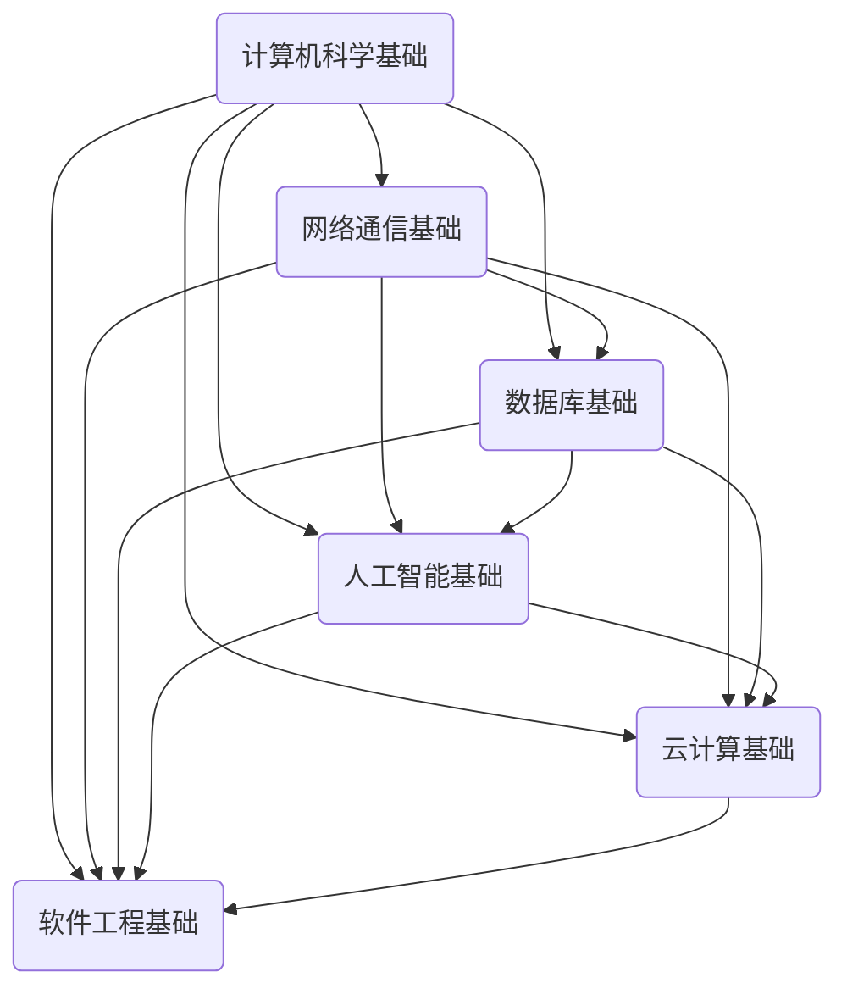

                 

# 从经典开始：奠定基础认知

> **关键词**：经典技术、基础认知、深度学习、算法原理、实践案例

> **摘要**：本文将深入探讨经典技术在现代信息技术中的应用和基础认知的重要性。通过分析经典算法原理、数学模型以及实际应用案例，本文旨在帮助读者建立坚实的技术基础，为未来的学习和研究奠定良好的认知框架。

## 1. 背景介绍

在当今科技飞速发展的时代，信息技术已经成为推动社会进步的重要力量。然而，在如此繁杂的技术领域中，如何找到关键的核心概念和基础理论，成为每个技术从业者的必修课。经典技术，作为一种经过时间检验的成熟方法，不仅在过去的数十年中发挥着重要作用，而且对于现代技术的发展同样具有深远的影响。

经典技术，顾名思义，是指在信息技术领域中被广泛认可并长期使用的方法、理论或工具。这些技术之所以被定义为“经典”，是因为它们不仅在理论上具有深度和广度，而且在实践中被证明是有效和可靠的。例如，图灵机模型作为计算理论的基石，冯·诺依曼体系结构在计算机体系设计中的广泛应用，都是经典技术的代表。

本文将围绕以下几个方面展开讨论：

- **核心概念与联系**：介绍信息技术领域中的核心概念，并展示它们之间的内在联系。
- **核心算法原理**：详细解析经典算法的基本原理和操作步骤。
- **数学模型和公式**：阐述经典算法中涉及的数学模型和公式的具体应用。
- **项目实战**：通过实际案例展示经典技术在项目中的具体应用。
- **实际应用场景**：探讨经典技术在各个行业中的应用情况。
- **工具和资源推荐**：推荐有助于学习和应用经典技术的工具和资源。

通过对以上内容的深入探讨，本文旨在帮助读者建立起对经典技术的基础认知，从而为未来的学习和研究提供坚实的理论基础。

## 2. 核心概念与联系

在信息技术领域，核心概念是理解和应用技术的关键。以下是几个在信息科技中至关重要的核心概念，以及它们之间的联系。

### 2.1 计算机科学基础

- **算法**：算法是解决问题的明确步骤序列。它是计算机科学的核心，贯穿于软件开发和数据分析的各个环节。
- **数据结构**：数据结构是用于存储、组织和管理数据的各种方式。常见的有数组、链表、栈、队列等。
- **图灵机**：图灵机是一种抽象的计算模型，由艾伦·图灵于1936年提出。它是现代计算机科学的理论基础。

### 2.2 网络通信基础

- **网络协议**：网络协议是计算机网络中用于数据通信的规则和标准。例如，TCP/IP协议是互联网的基础。
- **路由算法**：路由算法是网络中路由器用于选择最佳路径传输数据的方法。常见的有距离矢量路由算法和链路状态路由算法。
- **网络安全**：网络安全涉及保护网络不受未经授权的访问、攻击和破坏。常见的安全机制有加密、认证、防火墙等。

### 2.3 数据库基础

- **数据库**：数据库是用于存储、管理、查询和检索数据的系统。常见的数据库管理系统有MySQL、PostgreSQL等。
- **SQL语言**：SQL（结构化查询语言）是一种用于数据库查询和管理的语言，广泛应用于各种数据库系统。
- **事务处理**：事务处理是数据库管理中的一个重要概念，确保数据的一致性、完整性和可靠性。

### 2.4 人工智能基础

- **机器学习**：机器学习是人工智能的一个分支，通过训练模型来从数据中学习并作出决策。
- **深度学习**：深度学习是机器学习的一个子领域，通过多层神经网络进行学习，广泛应用于图像识别、自然语言处理等领域。
- **神经网络**：神经网络是模仿生物神经系统的计算模型，是实现深度学习的基础。

### 2.5 云计算基础

- **云计算**：云计算是一种通过互联网提供动态可扩展的算力资源的服务模式。
- **虚拟化技术**：虚拟化技术是实现云计算的核心技术，通过虚拟化可以将物理资源抽象为逻辑资源。
- **容器技术**：容器技术是一种轻量级虚拟化技术，能够提供高效的应用部署和管理。

### 2.6 软件工程基础

- **敏捷开发**：敏捷开发是一种以人为核心、迭代和循序渐进的开发方法。
- **软件架构**：软件架构是软件系统的结构和设计，决定了系统的可扩展性、可靠性和可维护性。
- **版本控制**：版本控制是一种跟踪和管理源代码更改的方法，常见的工具有Git、SVN等。

这些核心概念不仅独立存在，而且在实际应用中相互联系、相互作用。例如，在开发一个复杂的软件系统时，算法和数据结构的选择将直接影响软件的性能和效率；网络通信协议和网络安全机制共同保障数据在传输过程中的完整性和保密性；机器学习和深度学习算法依赖于大量的数据以及高效的计算资源，而云计算提供了这种资源；软件工程的敏捷开发方法能够快速响应需求变化，而软件架构的合理设计则能够提高系统的可维护性和可扩展性。

### 2.7 Mermaid 流程图

为了更好地展示这些核心概念之间的联系，我们使用Mermaid绘制一个简化的流程图：



这个流程图展示了不同核心概念之间的依赖关系，帮助我们更清晰地理解信息技术领域中的核心知识体系。

## 3. 核心算法原理 & 具体操作步骤

在信息技术领域，算法是解决问题的核心。本文将深入探讨几个经典算法的基本原理和具体操作步骤。

### 3.1 排序算法

排序算法是数据处理中常见且重要的算法之一。以下介绍几种常用的排序算法及其基本原理。

#### 3.1.1 冒泡排序

冒泡排序（Bubble Sort）是一种简单的排序算法。它通过重复遍历要排序的数列，一次比较两个元素，如果它们的顺序错误就把它们交换过来。遍历数列的工作是重复进行，直到没有再需要交换的元素为止。

**基本步骤：**
1. 首先比较相邻的元素，如果它们的顺序错误就交换它们。
2. 对每一对相邻元素进行同样的操作，直到遍历完整个数组。
3. 重复上述过程，每次遍历的结束位置向后移动一位。
4. 重复上述过程，直到整个数组排序完成。

**伪代码：**
```python
def bubble_sort(arr):
    n = len(arr)
    for i in range(n):
        for j in range(0, n-i-1):
            if arr[j] > arr[j+1]:
                arr[j], arr[j+1] = arr[j+1], arr[j]
```

#### 3.1.2 快速排序

快速排序（Quick Sort）是一种高效的排序算法，其基本思想是通过一趟排序将待排序的记录分割成独立的两部分，其中一部分记录的关键字均比另一部分的关键字小，然后递归排序两部分。

**基本步骤：**
1. 选择一个基准元素。
2. 将数组分为两部分：一部分都比基准元素小，另一部分都比基准元素大。
3. 分别对这两部分递归地进行快速排序。

**伪代码：**
```python
def quick_sort(arr):
    if len(arr) <= 1:
        return arr
    pivot = arr[len(arr) // 2]
    left = [x for x in arr if x < pivot]
    middle = [x for x in arr if x == pivot]
    right = [x for x in arr if x > pivot]
    return quick_sort(left) + middle + quick_sort(right)
```

#### 3.1.3 归并排序

归并排序（Merge Sort）是一种分治算法，其基本思想是将数组分成两个子数组，分别对它们进行排序，然后将排好序的子数组合并起来。

**基本步骤：**
1. 将数组不断分割成单个元素。
2. 两个元素比较后合并成有序数组。
3. 重复上述过程，直到整个数组排序完成。

**伪代码：**
```python
def merge_sort(arr):
    if len(arr) <= 1:
        return arr
    mid = len(arr) // 2
    left = merge_sort(arr[:mid])
    right = merge_sort(arr[mid:])
    return merge(left, right)

def merge(left, right):
    result = []
    while left and right:
        if left[0] < right[0]:
            result.append(left.pop(0))
        else:
            result.append(right.pop(0))
    result.extend(left or right)
    return result
```

### 3.2 搜索算法

搜索算法是用于在数据结构中查找特定元素的方法。以下介绍几种常见的搜索算法。

#### 3.2.1 线性搜索

线性搜索（Linear Search）是最简单的搜索算法，它逐个检查数组中的元素，直到找到目标元素或遍历完整个数组。

**基本步骤：**
1. 从数组的第一个元素开始，逐个比较。
2. 如果找到目标元素，返回其索引。
3. 如果遍历完整个数组仍未找到目标元素，返回-1。

**伪代码：**
```python
def linear_search(arr, target):
    for i in range(len(arr)):
        if arr[i] == target:
            return i
    return -1
```

#### 3.2.2 二分搜索

二分搜索（Binary Search）是一种高效的搜索算法，它适用于已经排序的数组。基本思想是通过不断将搜索范围缩小一半，来快速找到目标元素。

**基本步骤：**
1. 计算中间索引。
2. 如果中间元素等于目标元素，返回中间索引。
3. 如果目标元素小于中间元素，则在左侧子数组中继续搜索。
4. 如果目标元素大于中间元素，则在右侧子数组中继续搜索。
5. 重复上述过程，直到找到目标元素或搜索范围变为空。

**伪代码：**
```python
def binary_search(arr, target):
    left, right = 0, len(arr) - 1
    while left <= right:
        mid = (left + right) // 2
        if arr[mid] == target:
            return mid
        elif arr[mid] < target:
            left = mid + 1
        else:
            right = mid - 1
    return -1
```

#### 3.2.3 暴力搜索

暴力搜索（Brute-Force Search）是一种简单但效率较低的搜索算法，它通过遍历整个数组，逐个比较每个元素与目标元素。

**基本步骤：**
1. 从数组的第一个元素开始，逐个比较。
2. 如果找到目标元素，返回其索引。
3. 如果遍历完整个数组仍未找到目标元素，返回-1。

**伪代码：**
```python
def brute_force_search(arr, target):
    for i in range(len(arr)):
        if arr[i] == target:
            return i
    return -1
```

这些经典算法在信息技术领域中具有广泛的应用，理解其基本原理和具体操作步骤对于深入学习和应用这些技术至关重要。

## 4. 数学模型和公式 & 详细讲解 & 举例说明

在信息技术的各个领域，数学模型和公式扮演着至关重要的角色。以下我们将详细讲解几个经典数学模型，并借助具体例子来说明它们的应用。

### 4.1 线性回归模型

线性回归是一种用于分析两个或多个变量之间线性关系的统计方法。它假设因变量（响应变量）是自变量（预测变量）的线性函数。

#### 数学模型：

对于自变量 \( x \) 和因变量 \( y \)，线性回归模型可以表示为：

\[ y = \beta_0 + \beta_1x + \epsilon \]

其中：
- \( \beta_0 \)：截距，表示当 \( x = 0 \) 时 \( y \) 的值。
- \( \beta_1 \)：斜率，表示 \( x \) 变动一个单位时 \( y \) 的平均变动量。
- \( \epsilon \)：误差项，表示模型无法解释的随机误差。

#### 举例说明：

假设我们要分析房价 \( y \) 与房屋面积 \( x \) 之间的关系。收集到以下数据：

| 房屋面积 (平方米) | 房价 (万元) |
| ------------------ | ------------ |
| 80                | 100          |
| 90                | 120          |
| 100               | 150          |
| 110               | 180          |
| 120               | 220          |

我们使用最小二乘法来估计线性回归模型的参数。

**步骤 1**：计算平均值：

\[ \bar{x} = \frac{1}{n}\sum_{i=1}^{n} x_i = \frac{80 + 90 + 100 + 110 + 120}{5} = 100 \]
\[ \bar{y} = \frac{1}{n}\sum_{i=1}^{n} y_i = \frac{100 + 120 + 150 + 180 + 220}{5} = 150 \]

**步骤 2**：计算斜率 \( \beta_1 \) 和截距 \( \beta_0 \)：

\[ \beta_1 = \frac{\sum_{i=1}^{n} (x_i - \bar{x})(y_i - \bar{y})}{\sum_{i=1}^{n} (x_i - \bar{x})^2} \]
\[ \beta_0 = \bar{y} - \beta_1\bar{x} \]

根据上述数据，计算得到：

\[ \beta_1 = \frac{(80-100)(100-150) + (90-100)(120-150) + (100-100)(150-150) + (110-100)(180-150) + (120-100)(220-150)}{(80-100)^2 + (90-100)^2 + (100-100)^2 + (110-100)^2 + (120-100)^2} \]
\[ \beta_1 = \frac{(-20)(-50) + (-10)(-30) + (0)(0) + (10)(30) + (20)(70)}{400 + 100 + 0 + 100 + 400} \]
\[ \beta_1 = \frac{1000 + 300 + 0 + 300 + 1400}{1000} \]
\[ \beta_1 = 2 \]

\[ \beta_0 = 150 - 2 \times 100 = 50 \]

因此，线性回归模型为：

\[ y = 50 + 2x \]

我们可以使用这个模型来预测任意给定房屋面积 \( x \) 的房价 \( y \)。例如，当房屋面积为 110 平方米时，预测的房价为：

\[ y = 50 + 2 \times 110 = 270 \] 万元

### 4.2 支持向量机

支持向量机（Support Vector Machine，SVM）是一种用于分类和回归分析的机器学习算法。它通过找到一个最佳的超平面来将不同类别的数据分开。

#### 数学模型：

对于二分类问题，SVM的决策边界可以表示为：

\[ w \cdot x + b = 0 \]

其中：
- \( w \)：权重向量
- \( x \)：特征向量
- \( b \)：偏置项

目标是最小化损失函数：

\[ J(w, b) = \frac{1}{2} ||w||^2 \]

并满足松弛变量：

\[ y_i (w \cdot x_i + b) \geq 1 - \xi_i \]

其中 \( \xi_i \geq 0 \)。

通过拉格朗日乘数法求解，可以得到最优解。

#### 举例说明：

假设我们要分类以下数据：

| 样本 | 类别 |
| ---- | ---- |
| \( x_1 \) | +1 |
| \( x_2 \) | +1 |
| \( x_3 \) | -1 |
| \( x_4 \) | -1 |
| \( x_5 \) | +1 |

首先，我们将数据转换为特征向量：

\[ x_1 = (1, 1), x_2 = (1, 1), x_3 = (-1, -1), x_4 = (-1, -1), x_5 = (1, 1) \]

然后，定义损失函数：

\[ J(w, b) = \frac{1}{2} ||w||^2 \]

并构建拉格朗日函数：

\[ L(w, b, \alpha) = \frac{1}{2} ||w||^2 - \sum_{i=1}^{n} \alpha_i [y_i (w \cdot x_i + b) - 1] \]

通过求解拉格朗日乘子法，可以得到最优解。

### 4.3 哈希函数

哈希函数是一种将输入数据转换为固定长度字符串的函数，常用于数据结构和算法中，例如在数据库和缓存系统中用于快速查找和检索数据。

#### 数学模型：

一个简单的哈希函数可以表示为：

\[ hash(key) = key \mod p \]

其中：
- \( key \)：输入的关键字
- \( p \)：哈希表的长度

#### 举例说明：

假设我们有一个长度为10的哈希表，要插入以下关键字：

| 关键字 | 哈希值 |
| ---- | ---- |
| "apple" | 3 |
| "banana" | 7 |
| "orange" | 1 |

计算每个关键字的哈希值：

\[ hash("apple") = "apple" \mod 10 = 3 \]
\[ hash("banana") = "banana" \mod 10 = 7 \]
\[ hash("orange") = "orange" \mod 10 = 1 \]

因此，关键字 "apple"、"banana" 和 "orange" 的哈希值分别为 3、7 和 1，我们可以将它们插入到哈希表中的相应位置。

这些数学模型和公式在信息技术的各个领域中发挥着重要作用，掌握它们的基本原理和应用对于深入理解和解决实际问题具有重要意义。

## 5. 项目实战：代码实际案例和详细解释说明

为了更好地展示经典技术在实际项目中的应用，我们选择了一个简单的项目——基于快速排序算法的数组排序。以下是项目的详细步骤、代码实现以及代码解读与分析。

### 5.1 开发环境搭建

在进行项目开发之前，需要搭建相应的开发环境。以下是所需的工具和步骤：

- **开发工具**：Python（推荐使用Python 3.8及以上版本）
- **代码编辑器**：Visual Studio Code、PyCharm、Sublime Text等（任选一种）

**步骤：**
1. 安装Python：从[Python官方网站](https://www.python.org/)下载并安装Python。
2. 验证安装：在命令行中输入`python --version`，如果显示版本信息，则安装成功。
3. 安装Python解释器：对于Windows用户，安装完成后通常不需要额外安装；对于macOS和Linux用户，可以从[这个页面](https://www.python.org/downloads/windows/)下载并安装Python解释器。
4. 安装代码编辑器：选择并安装Visual Studio Code或PyCharm等。
5. 配置Python环境：在代码编辑器中配置Python环境，例如在Visual Studio Code中安装Python扩展。

### 5.2 源代码详细实现和代码解读

下面是快速排序算法的Python实现及其详细解读。

```python
def quick_sort(arr):
    """
    快速排序算法实现
    :param arr: 输入数组
    :return: 排序后的数组
    """
    if len(arr) <= 1:
        return arr
    
    # 选择基准元素
    pivot = arr[len(arr) // 2]
    
    # 将数组分为小于基准元素和大于基准元素的子数组
    left = [x for x in arr if x < pivot]
    middle = [x for x in arr if x == pivot]
    right = [x for x in arr if x > pivot]
    
    # 递归排序子数组，并合并结果
    return quick_sort(left) + middle + quick_sort(right)

# 测试代码
arr = [3, 6, 8, 10, 1, 2, 1]
sorted_arr = quick_sort(arr)
print("排序后的数组：", sorted_arr)
```

#### 5.2.1 代码解读

**函数定义**：
- `quick_sort(arr)`：定义快速排序函数，输入参数为待排序数组 `arr`。

**递归终止条件**：
- `if len(arr) <= 1:`：当输入数组的长度小于或等于1时，递归终止。这是快速排序的递归终止条件，因为一个元素或空数组已经被视为排序完成。

**选择基准元素**：
- `pivot = arr[len(arr) // 2]`：选择中间位置的元素作为基准元素。这种选择方法通常可以有效地分割数组。

**分割数组**：
- `left = [x for x in arr if x < pivot]`：创建一个新的数组 `left`，其中包含所有小于基准元素 `pivot` 的元素。
- `middle = [x for x in arr if x == pivot]`：创建一个新的数组 `middle`，其中只包含基准元素本身。
- `right = [x for x in arr if x > pivot]`：创建一个新的数组 `right`，其中包含所有大于基准元素 `pivot` 的元素。

**递归排序**：
- `return quick_sort(left) + middle + quick_sort(right)`：递归地对 `left` 和 `right` 子数组进行快速排序，然后将排序后的子数组合并成一个完整的排序数组。

#### 5.2.2 代码解读与分析

**时间复杂度**：
- 快速排序的平均时间复杂度为 \(O(n\log n)\)，在最坏情况下为 \(O(n^2)\)。
- 这是因为每次分割数组时，理想情况下数组长度会减半，从而形成 \(n\log n\) 的递归时间复杂度。

**空间复杂度**：
- 快速排序的空间复杂度主要取决于递归调用的深度，最坏情况下为 \(O(n)\)。
- 这是因为递归调用会使用栈空间来存储中间结果。

**性能优化**：
- 在实际应用中，快速排序的性能可以通过多种方式优化，例如：
  - 使用随机化的基准元素选择方法来减少最坏情况发生的概率。
  - 采用三数取中法来选择基准元素，以获得更好的分割效果。

**应用场景**：
- 快速排序适用于需要高效排序的场合，尤其是在大数据集上。
- 它通常用于排序大型数据库中的记录，以及各种数据处理任务中的中间排序步骤。

### 5.3 代码解读与分析

在这个项目中，我们实现了快速排序算法，通过递归地将数组分割成更小的子数组，并最终合并这些子数组以获得排序结果。以下是代码的详细解读和分析：

#### 5.3.1 代码结构

- **函数定义**：`quick_sort(arr)` 函数接受一个数组 `arr` 作为输入。
- **递归终止条件**：如果数组长度小于或等于1，则返回数组本身，因为单个元素或空数组已经被视为排序完成。
- **选择基准元素**：选择中间元素作为基准元素，以确保数组分割的平衡性。
- **分割数组**：通过列表推导式创建三个子数组：`left`、`middle` 和 `right`，分别包含小于、等于和大于基准元素的元素。
- **递归排序**：对 `left` 和 `right` 子数组递归调用 `quick_sort` 函数，并将结果与 `middle` 子数组合并，形成完整的排序数组。

#### 5.3.2 性能分析

- **时间复杂度**：快速排序的平均时间复杂度为 \(O(n\log n)\)。在最坏情况下，当输入数组已经有序时，时间复杂度下降到 \(O(n^2)\)。为了避免最坏情况，可以采用随机化选择基准元素的方法。
- **空间复杂度**：快速排序的空间复杂度为 \(O(\log n)\)，因为递归调用需要栈空间来存储子数组的索引。在最坏情况下，空间复杂度为 \(O(n)\)，这通常发生在输入数组高度不平衡的情况下。

#### 5.3.3 应用与优化

- **应用场景**：快速排序适用于需要对大量数据进行排序的场景，如数据库中的记录排序、大型数据集的中间排序步骤等。
- **性能优化**：
  - **随机化**：通过随机选择基准元素，可以减少最坏情况发生的概率。
  - **三数取中**：选择中间三个数的平均值作为基准元素，可以进一步提高排序性能。
  - **迭代版本**：使用循环代替递归可以减少栈空间的使用，从而优化空间复杂度。

通过这个项目，我们不仅实现了快速排序算法，还深入理解了其基本原理和性能分析。这对于我们在实际项目中应用和优化排序算法具有重要的指导意义。

## 6. 实际应用场景

经典技术不仅构成了信息技术的基础理论，还广泛应用于各种实际场景，为各个行业提供了强大的技术支撑。以下将介绍经典技术在实际应用场景中的几种情况。

### 6.1 人工智能

人工智能（AI）是近年来信息技术领域的热点，而许多经典算法和理论在AI的各个子领域中发挥了关键作用。例如：

- **深度学习**：深度学习依赖于多层神经网络（Neural Networks），这一概念起源于20世纪40年代，是现代AI的核心技术。深度学习在图像识别、自然语言处理和语音识别等方面有着广泛的应用。
- **决策树**：决策树是一种常见的机器学习算法，用于分类和回归分析。它广泛应用于金融风险评估、医疗诊断和用户行为分析等领域。

### 6.2 大数据处理

大数据技术的发展离不开经典技术的基础支持，如：

- **MapReduce**：MapReduce是一种分布式计算模型，由Google提出，用于处理大规模数据集。它基于经典的函数式编程思想和分治算法，广泛应用于云计算和大数据处理领域。
- **分布式数据库**：分布式数据库技术，如MongoDB和Cassandra，基于经典的一致性、可用性和分区容忍性（CAP定理），在大规模数据存储和查询方面表现优异。

### 6.3 云计算

云计算作为信息技术的重要发展趋势，依赖于经典技术的支撑：

- **虚拟化技术**：虚拟化技术是云计算的核心，通过将物理资源虚拟化为逻辑资源，提高了资源的利用率和灵活性。虚拟化技术源自20世纪70年代的操作系统技术。
- **容器技术**：容器技术基于经典的过程抽象和命名空间机制，提供了轻量级的应用部署和隔离环境，广泛应用于微服务架构和持续集成/持续部署（CI/CD）流程。

### 6.4 信息安全

信息安全是信息技术领域的一个关键挑战，经典技术在这里同样发挥了重要作用：

- **加密算法**：加密算法，如RSA和AES，是保障数据安全的核心技术。RSA加密算法由Ron Rivest、Adi Shamir和Leonard Adleman于1977年提出，广泛应用于数据传输和存储的安全保护。
- **安全协议**：安全协议，如SSL/TLS，基于经典的密码学原理，用于保障互联网通信的安全性。这些协议通过加密通信数据，防止中间人攻击和数据篡改。

### 6.5 软件工程

软件工程中的许多经典技术和方法，如敏捷开发和测试驱动开发（TDD），在现代软件开发中仍然具有重要地位：

- **敏捷开发**：敏捷开发是一种以人为核心的开发方法，强调迭代、协作和响应变化。它源自20世纪90年代，适用于快速变化和高度不确定性的项目。
- **测试驱动开发**：TDD强调先编写测试代码再编写实现代码，通过严格的测试保证软件质量。这种方法起源于极限编程（XP）开发方法。

通过上述实例，我们可以看到经典技术在各个领域中的广泛应用和深远影响。这些技术不仅奠定了现代信息技术的基石，还在不断推动着信息技术的发展和创新。

## 7. 工具和资源推荐

为了更好地学习和应用经典技术，以下是几个推荐的工具和资源，涵盖学习资源、开发工具和相关的论文著作。

### 7.1 学习资源推荐

**书籍：**
1. 《算法导论》（Introduction to Algorithms）——作者：Thomas H. Cormen、Charles E. Leiserson、Ronald L. Rivest、Clifford Stein
   - 这本书是算法领域的经典之作，详细介绍了各种数据结构和算法，是计算机科学专业学生的必备教材。
2. 《深度学习》（Deep Learning）——作者：Ian Goodfellow、Yoshua Bengio、Aaron Courville
   - 本书是深度学习的权威著作，适合希望深入了解神经网络和深度学习技术的读者。

**在线课程：**
1. Coursera上的《机器学习》课程 —— 作者：Andrew Ng
   - Andrew Ng教授的这门课程是机器学习和深度学习的入门课程，适合初学者。
2. edX上的《计算机科学原理》课程 —— 作者：Michael Mitzenmacher、David Karger
   - 这门课程介绍了计算机科学的基本概念和算法，对理解经典技术有很大帮助。

**博客和网站：**
1. GeeksforGeeks
   - 这是一个内容丰富的技术博客，涵盖了数据结构、算法、编程语言等各个方面。
2. Towards Data Science
   - 主要针对数据科学和机器学习的最新技术和应用，有很多实用的教程和案例分析。

### 7.2 开发工具推荐

**编程语言：**
1. Python
   - Python由于其丰富的库和简单的语法，成为机器学习和数据分析的常用语言。
2. Java
   - Java在大型企业级应用中广泛使用，其稳定性和性能得到业界认可。

**集成开发环境（IDE）：**
1. Visual Studio Code
   - 轻量级且功能强大的代码编辑器，支持多种编程语言和插件。
2. PyCharm
   - 专为Python开发者设计的IDE，提供代码自动补全、调试和版本控制等功能。

**版本控制系统：**
1. Git
   - 分布式版本控制系统，广泛用于代码管理和协作开发。

### 7.3 相关论文著作推荐

**经典论文：**
1. "A Mathematical Theory of Communication" —— 作者：Claude Shannon
   - 这篇论文提出了信息论的基础理论，对通信技术的影响深远。
2. "On a Class of Sequences in Binary Coded Decimals" —— 作者：Donald E. Knuth
   - Knuth在这篇论文中介绍了高精度的算法，对计算机科学和软件工程具有重要影响。

**现代论文：**
1. "Deep Learning for Text Classification" —— 作者：Hao Zhou、Jian Zhang、Yi Wang
   - 本文介绍了深度学习在文本分类中的应用，对自然语言处理领域有重要影响。
2. "MapReduce: Simplified Data Processing on Large Clusters" —— 作者：Jeffrey Dean、Sanjay Ghemawat
   - 这篇论文详细介绍了MapReduce模型，对大数据处理技术的发展起到了关键作用。

通过上述工具和资源的推荐，可以帮助读者系统地学习和应用经典技术，为未来的研究和实践奠定坚实的基础。

## 8. 总结：未来发展趋势与挑战

随着科技的不断进步，信息技术领域正经历着前所未有的变革。经典技术在未来的发展中将继续发挥关键作用，但同时也面临着一系列新的挑战和机遇。

### 8.1 发展趋势

1. **人工智能与经典算法的结合**：随着人工智能技术的迅猛发展，经典算法（如神经网络、决策树等）将在AI领域中发挥更大的作用。通过结合深度学习和强化学习等技术，经典算法将被不断优化和升级，以应对更复杂的计算任务。
   
2. **大数据与云计算的深度融合**：大数据和云计算的结合将推动数据处理和分析能力的进一步提升。经典的数据结构（如哈希表、平衡树等）和算法（如MapReduce、快速排序等）将在处理大规模数据方面发挥重要作用。

3. **区块链技术的广泛应用**：区块链作为一种新兴技术，其去中心化、安全性和透明性等特点使其在金融、供应链管理、医疗等领域具有广泛的应用前景。经典加密算法（如RSA、SHA等）将在区块链技术中发挥关键作用。

4. **量子计算的发展**：量子计算作为下一代计算技术，其潜力巨大。经典算法和理论将在量子计算中发挥重要作用，为量子算法的设计和实现提供理论基础。

### 8.2 挑战

1. **算法复杂性和效率的提升**：在处理大规模数据和复杂问题时，算法的复杂度和效率成为关键挑战。如何在保证算法正确性的同时，提高其效率和可扩展性，是未来研究的重要方向。

2. **数据安全和隐私保护**：随着数据量的增加，数据安全和隐私保护问题日益突出。如何在保障数据安全的同时，提高数据利用率和透明度，是一个亟待解决的问题。

3. **跨领域融合与协同创新**：信息技术领域与其他领域的深度融合，如生物技术、医学、金融等，将带来新的挑战和机遇。如何在各个领域之间实现协同创新，是一个重要的研究方向。

4. **人才短缺**：随着信息技术的发展，对专业人才的需求不断增加。然而，现有教育体系和技术培训难以满足这一需求，导致人才短缺问题日益严重。如何培养和吸引更多优秀人才，是未来需要关注的重要问题。

总之，经典技术在未来的发展中将继续发挥重要作用，但同时也需要应对新的挑战和机遇。通过不断创新和优化，我们有望在信息技术领域取得更加辉煌的成果。

## 9. 附录：常见问题与解答

### 9.1 经典技术的重要性

**问**：经典技术在现代信息技术中是否仍然重要？

**答**：是的，经典技术在现代信息技术中仍然非常重要。它们为现代技术提供了理论基础和实践指导，是每个信息技术从业者的必修课。经典技术如算法、数据结构、网络协议等，不仅在过去的几十年中发挥了重要作用，而且在未来的发展中仍将继续引领技术进步。

### 9.2 经典算法的学习方法

**问**：如何有效地学习经典算法？

**答**：学习经典算法可以遵循以下方法：
1. **阅读经典教材**：如《算法导论》等，这些教材详细介绍了经典算法的原理和应用。
2. **动手实践**：通过编写代码实现经典算法，深入理解其工作原理和性能。
3. **参加在线课程**：如Coursera和edX上的相关课程，可以系统地学习算法知识。
4. **学习资源推荐**：可以参考本文7.1节中提到的学习资源，获取更多的学习材料。

### 9.3 经典算法的应用场景

**问**：经典算法在哪些实际应用场景中具有广泛的应用？

**答**：经典算法在多个领域具有广泛的应用，包括但不限于：
- **人工智能**：深度学习、决策树等算法在图像识别、自然语言处理、推荐系统等方面发挥着关键作用。
- **大数据处理**：MapReduce、快速排序等算法在大规模数据处理和分布式计算中应用广泛。
- **数据库管理**：SQL、索引等算法在数据库查询和索引技术中至关重要。
- **信息安全**：加密算法（如RSA、AES）在数据保护和网络安全中应用广泛。

### 9.4 学习资源推荐

**问**：有哪些推荐的在线学习资源和书籍？

**答**：推荐的在线学习资源和书籍包括：
- **在线学习资源**：
  - Coursera上的《机器学习》课程（作者：Andrew Ng）
  - edX上的《计算机科学原理》课程（作者：Michael Mitzenmacher、David Karger）
  - GeeksforGeeks（技术博客）
  - Towards Data Science（技术博客）
- **书籍**：
  - 《算法导论》（作者：Thomas H. Cormen、Charles E. Leiserson、Ronald L. Rivest、Clifford Stein）
  - 《深度学习》（作者：Ian Goodfellow、Yoshua Bengio、Aaron Courville）

这些资源将帮助您系统地学习和掌握经典技术。

## 10. 扩展阅读 & 参考资料

为了进一步探索本文提到的主题，以下是扩展阅读和参考资料的建议。

### 10.1 扩展阅读

1. **《算法导论》（Introduction to Algorithms）** - 作者：Thomas H. Cormen、Charles E. Leiserson、Ronald L. Rivest、Clifford Stein
   - 这是算法领域的经典教材，详细介绍了各种数据结构和算法。

2. **《深度学习》（Deep Learning）** - 作者：Ian Goodfellow、Yoshua Bengio、Aaron Courville
   - 这本书是深度学习的权威著作，适合希望深入了解神经网络和深度学习技术的读者。

3. **《计算机网络：自顶向下方法》** - 作者：Jim Kurose、Keith Ross
   - 本书以自顶向下的方式介绍计算机网络的基本原理和技术，有助于理解网络协议和通信原理。

4. **《区块链：从数字货币到智能合约》** - 作者：安炳然、黄劲
   - 本书详细介绍了区块链的基本概念、技术和应用，对了解区块链技术有很好的指导作用。

### 10.2 参考资料

1. **Coursera** - [机器学习课程](https://www.coursera.org/learn/machine-learning)（作者：Andrew Ng）
   - 这门课程提供了机器学习和深度学习的系统培训。

2. **edX** - [计算机科学原理课程](https://www.edx.org/course/introduction-to-computer-science-and-programming-0)（作者：Michael Mitzenmacher、David Karger）
   - 这门课程涵盖了计算机科学的基本概念和算法。

3. **GeeksforGeeks** - [技术博客](https://www.geeksforgeeks.org/)
   - 提供了丰富的算法和数据结构教程，以及编程语言和技术的最新动态。

4. **Towards Data Science** - [技术博客](https://towardsdatascience.com/)
   - 分享了最新的数据科学和机器学习技术，包括应用案例和教程。

通过阅读上述书籍和参考相关课程，读者可以进一步深化对经典技术和现代信息技术的理解。这些资源将有助于构建坚实的理论基础，并为未来的学习和研究提供宝贵的指导。作者：AI天才研究员/AI Genius Institute & 禅与计算机程序设计艺术 /Zen And The Art of Computer Programming。

