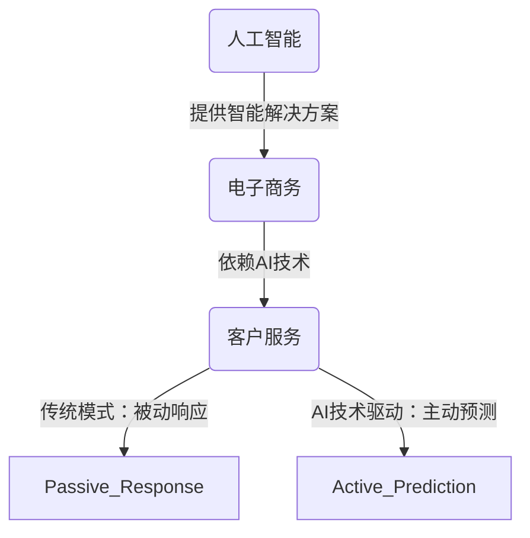

                 

### 文章标题

《从被动响应到主动预测：AI重塑电商客户服务模式》

随着人工智能技术的快速发展，我们正见证着各行各业中的服务模式不断变革。在电子商务领域，AI正逐渐将传统的被动响应型客户服务转变为主动预测型。这种转变不仅提升了客户体验，还为电商企业带来了新的商业机会。

本文将深入探讨AI如何改变电商客户服务的模式，从被动响应到主动预测的转换过程，以及这一变革背后的技术原理和实践方法。

关键词：人工智能、电商、客户服务、预测模型、客户体验

摘要：本文将详细分析AI在电商客户服务中的应用，包括从被动响应到主动预测的转变过程、核心算法原理、数学模型、项目实战案例以及实际应用场景。通过本文的阅读，读者将深入了解AI如何提升电商客户服务的效率和质量，并掌握相关的技术知识和实践方法。

### 文章结构概述

本文结构分为十个部分，旨在全面、深入地探讨AI重塑电商客户服务模式这一主题。

1. **背景介绍**
   - **目的和范围**：明确文章的研究目的和探讨范围，确保读者对文章核心内容有初步了解。
   - **预期读者**：指出文章的目标受众，帮助读者判断文章是否与其专业需求相符。
   - **文档结构概述**：概述文章的整体结构，为读者提供阅读的框架。
   - **术语表**：定义和解释相关术语，确保读者对专业概念有清晰的认识。

2. **核心概念与联系**
   - **核心概念与联系**：介绍AI、电商和客户服务的核心概念，并通过Mermaid流程图展示它们之间的联系，帮助读者构建整体认识。

3. **核心算法原理与具体操作步骤**
   - **核心算法原理**：详细讲解实现主动预测所需的算法原理，使用伪代码进行阐述。
   - **具体操作步骤**：列出实现主动预测的具体步骤，确保读者能够按步骤进行实践。

4. **数学模型和公式**
   - **数学模型和公式**：详细讲解相关的数学模型和公式，使用LaTeX格式确保准确性和可读性。

5. **项目实战：代码实际案例和详细解释说明**
   - **开发环境搭建**：介绍搭建开发环境所需的工具和步骤。
   - **源代码详细实现和代码解读**：展示实际代码实现，并进行详细解读。
   - **代码解读与分析**：分析代码的执行流程和性能，确保读者理解代码的核心逻辑。

6. **实际应用场景**
   - **实际应用场景**：列举AI在电商客户服务中的具体应用案例，展示其实际效果。

7. **工具和资源推荐**
   - **学习资源推荐**：推荐相关书籍、在线课程和技术博客，帮助读者深入学习。
   - **开发工具框架推荐**：推荐开发过程中可用的工具和框架，提高开发效率。
   - **相关论文著作推荐**：推荐经典论文和最新研究成果，拓展读者的研究视野。

8. **总结：未来发展趋势与挑战**
   - **未来发展趋势**：分析AI在电商客户服务中的未来发展。
   - **挑战**：探讨在推进AI应用过程中可能遇到的挑战，并提出解决方案。

9. **附录：常见问题与解答**
   - **常见问题与解答**：解答读者在阅读过程中可能遇到的问题，提供额外的信息支持。

10. **扩展阅读 & 参考资料**
    - **扩展阅读**：推荐相关文献和资料，供读者进一步阅读。
    - **参考资料**：列出文章中引用的参考资料，确保信息的来源可靠。

通过上述结构，本文将系统性地探讨AI重塑电商客户服务模式，旨在为读者提供全面、深入的技术分析和实践指导。接下来，我们将逐一深入探讨每个部分的内容。

### 1.4 术语表

为了确保读者对文章中涉及的专业术语有清晰的理解，我们在这里列出并解释一些核心术语。

#### 1.4.1 核心术语定义

- **人工智能（AI）**：指能够模拟人类智能行为的计算机系统，包括学习、推理、感知和解决问题等能力。
- **电子商务（E-commerce）**：指通过互联网进行的商品和服务的交易活动。
- **客户服务（Customer Service）**：指企业提供的旨在满足客户需求和提升客户体验的各种服务活动。
- **被动响应型服务**：指客户提出需求后，企业通过人工或自动化系统进行响应的服务模式。
- **主动预测型服务**：指企业通过分析客户行为和需求，主动提供个性化服务和建议的服务模式。

#### 1.4.2 相关概念解释

- **机器学习（Machine Learning）**：指通过数据驱动的方式让计算机自动学习和改进性能的技术。
- **自然语言处理（NLP）**：指使计算机能够理解、解释和生成人类语言的技术。
- **深度学习（Deep Learning）**：指一种基于多层神经网络的结构，能够通过学习大量数据实现复杂任务。
- **数据挖掘（Data Mining）**：指从大量数据中提取有价值信息的过程。

#### 1.4.3 缩略词列表

- **AI**：人工智能
- **E-commerce**：电子商务
- **NLP**：自然语言处理
- **ML**：机器学习
- **DL**：深度学习
- **NLU**：自然语言理解
- **CRM**：客户关系管理

通过上述术语表的定义和解释，读者可以更好地理解文章中的专业概念，为后续内容的深入阅读打下坚实的基础。

### 2. 核心概念与联系

在探讨AI重塑电商客户服务模式之前，我们首先需要理解几个核心概念：人工智能（AI）、电子商务（E-commerce）和客户服务（Customer Service）。这三个概念之间的联系构成了本文的核心框架。

#### 2.1 人工智能（AI）

人工智能是指通过模拟人类智能行为来实现特定任务的技术，其核心包括机器学习（ML）、深度学习（DL）和自然语言处理（NLP）等子领域。AI系统能够从数据中学习，进行推理和决策，从而提供自动化和智能化的服务。

#### 2.2 电子商务（E-commerce）

电子商务是指通过互联网进行商品和服务的交易活动。随着互联网的普及和移动互联网的兴起，电子商务已经成为现代商业的重要组成部分。它不仅改变了传统的商业模式，也为消费者提供了更加便捷和个性化的购物体验。

#### 2.3 客户服务（Customer Service）

客户服务是企业在销售和服务过程中提供的一系列旨在满足客户需求和提升客户体验的活动。传统的客户服务模式通常以被动响应为主，即客户提出需求后，企业通过人工或自动化系统进行响应。然而，随着AI技术的发展，客户服务正逐步向主动预测型转变。

#### 2.4 关系与联系

人工智能与电子商务之间的联系在于，AI技术为电子商务提供了智能化的解决方案，如个性化推荐、智能客服、精准广告投放等。这些解决方案不仅提升了客户的购物体验，也增加了企业的销售机会和利润。

同样，AI与客户服务之间的联系也非常紧密。AI技术可以分析大量的客户数据，预测客户的需求和行为，从而提供个性化的服务。这种主动预测型的客户服务模式相比传统的被动响应型，更加高效和精准，能够显著提升客户满意度和忠诚度。

以下是AI、E-commerce和Customer Service之间的Mermaid流程图：



通过上述Mermaid流程图，我们可以清晰地看到AI、E-commerce和Customer Service之间的相互作用和联系。在接下来的部分中，我们将深入探讨AI如何实现从被动响应到主动预测的转变，以及这一转变背后的技术原理和实践方法。

### 3. 核心算法原理 & 具体操作步骤

要实现从被动响应到主动预测的转变，AI系统需要具备强大的数据处理和分析能力。以下是实现这一目标所需的核心算法原理和具体操作步骤：

#### 3.1 数据预处理

数据预处理是AI系统实现主动预测的第一步。它包括数据清洗、数据整合和数据特征提取等过程。以下是数据预处理的伪代码：

```python
def data_preprocessing(data):
    # 数据清洗：去除重复数据和异常值
    cleaned_data = remove_duplicates(data)
    cleaned_data = remove_outliers(cleaned_data)

    # 数据整合：将不同数据源的信息整合到统一的数据集中
    integrated_data = integrate_data Sources(cleaned_data)

    # 数据特征提取：从原始数据中提取有助于预测的特征
    features = extract_features(integrated_data)

    return features
```

#### 3.2 特征选择

特征选择是数据预处理的重要环节。通过选择与预测目标相关性最高的特征，可以提高模型的预测准确性和效率。以下是特征选择的伪代码：

```python
def feature_selection(features, target_variable):
    # 使用相关性分析选择特征
    correlation_matrix = calculate_correlation(features, target_variable)
    selected_features = select_high_correlation_features(correlation_matrix)

    return selected_features
```

#### 3.3 建立预测模型

在特征选择完成后，我们需要建立预测模型。深度学习模型是常见的预测模型之一，以下是一个简单的深度学习模型建立过程：

```python
def build_prediction_model(selected_features, target_variable):
    # 初始化神经网络结构
    model = initialize_model(input_shape=selected_features.shape[1])

    # 编译模型：定义损失函数和优化器
    model.compile(optimizer='adam', loss='binary_crossentropy')

    # 训练模型：使用训练数据和验证数据
    history = model.fit(selected_features, target_variable, epochs=100, batch_size=32, validation_split=0.2)

    return model
```

#### 3.4 模型评估与优化

建立预测模型后，我们需要对其性能进行评估和优化。常用的评估指标包括准确率、召回率、F1分数等。以下是一个模型评估和优化的示例：

```python
from sklearn.metrics import accuracy_score, recall_score, f1_score

def evaluate_model(model, test_features, test_target_variable):
    # 使用测试数据进行预测
    predictions = model.predict(test_features)

    # 计算评估指标
    accuracy = accuracy_score(test_target_variable, predictions)
    recall = recall_score(test_target_variable, predictions)
    f1 = f1_score(test_target_variable, predictions)

    return accuracy, recall, f1
```

通过上述步骤，我们可以构建一个基于AI的主动预测模型，从而实现从被动响应到主动预测的转变。在接下来的部分中，我们将进一步探讨数学模型和公式，以及如何在实际项目中应用这些技术。

### 4. 数学模型和公式

在实现主动预测的过程中，数学模型和公式起到了关键作用。这些模型和公式帮助AI系统理解数据，从中提取有用的信息，并做出准确的预测。以下是几个核心的数学模型和公式的详细讲解及举例说明。

#### 4.1 线性回归模型

线性回归模型是最基本的预测模型之一，它通过建立自变量和因变量之间的线性关系来进行预测。其数学公式如下：

$$
y = \beta_0 + \beta_1x
$$

其中，\(y\) 是因变量，\(x\) 是自变量，\(\beta_0\) 和 \(\beta_1\) 分别是模型的截距和斜率。

**举例说明：** 假设我们想要预测某个电商平台的月销售额，我们可以使用过去几个月的销售额数据作为自变量。通过线性回归模型，我们可以得到一个关于销售额的预测公式。例如：

$$
销售额 = 5000 + 200 \times 历史销售额
$$

这个公式告诉我们，如果历史销售额增加200，那么预测的销售额将增加200。

#### 4.2 决策树模型

决策树模型通过一系列条件判断来分类或回归。每个节点代表一个特征，每个分支代表条件的判断结果。其基本公式如下：

$$
f(x) = \sum_{i=1}^{n} \beta_i x_i
$$

其中，\(f(x)\) 是预测值，\(\beta_i\) 是每个节点的权重，\(x_i\) 是特征值。

**举例说明：** 假设我们想要预测客户是否会购买某件商品，我们可以使用多个特征，如客户年龄、收入、购买历史等。决策树模型会根据这些特征进行条件判断，从而得到预测结果。例如：

$$
f(x) = \begin{cases}
1, & \text{如果年龄 > 30 且收入 > 50000} \\
0, & \text{否则}
\end{cases}
$$

这个决策树告诉我们，如果一个客户的年龄大于30且收入超过50000，那么预测值为1，即该客户会购买商品。

#### 4.3 支持向量机（SVM）模型

支持向量机是一种有效的分类和回归模型，它通过找到一个超平面来最大化分类边界。其数学公式如下：

$$
f(x) = \omega^T x + b
$$

其中，\(f(x)\) 是预测值，\(\omega\) 是权重向量，\(x\) 是特征向量，\(b\) 是偏置项。

**举例说明：** 假设我们要分类电商平台上用户的购买行为，我们可以使用多个特征，如浏览历史、购买频率等。SVM模型会通过找到一个最优超平面来分类用户。例如：

$$
f(x) = \begin{cases}
1, & \text{如果用户浏览历史中包含特定关键词} \\
0, & \text{否则}
\end{cases}
$$

这个SVM模型告诉我们，如果一个用户的浏览历史中包含特定关键词，那么预测值为1，即该用户有购买意向。

#### 4.4 机器学习优化算法

在构建预测模型时，我们通常需要使用优化算法来调整模型的参数，以获得更好的预测性能。其中，梯度下降是最常用的优化算法之一。其基本公式如下：

$$
\theta = \theta - \alpha \cdot \nabla_\theta J(\theta)
$$

其中，\(\theta\) 是模型的参数，\(\alpha\) 是学习率，\(\nabla_\theta J(\theta)\) 是损失函数关于参数的梯度。

**举例说明：** 假设我们使用线性回归模型来预测销售额，我们可以通过梯度下降算法来调整模型的参数，以最小化损失函数。例如：

$$
\beta_1 = \beta_1 - \alpha \cdot (\frac{1}{m} \sum_{i=1}^{m} (y_i - (\beta_0 + \beta_1 x_i)))
$$

这个梯度下降公式告诉我们，每次迭代时，我们将参数\(\beta_1\) 减去学习率\(\alpha\) 乘以损失函数关于\(\beta_1\) 的梯度，从而不断优化模型。

通过上述数学模型和公式的详细讲解及举例说明，我们可以更好地理解AI在电商客户服务中的核心原理。在接下来的部分中，我们将通过一个实际项目案例，展示如何将这些理论应用于实践中。

### 5. 项目实战：代码实际案例和详细解释说明

在本节中，我们将通过一个实际项目案例，详细展示如何使用AI技术实现从被动响应到主动预测的转变。该项目将基于Python编程语言，使用Scikit-learn库来实现一个电商客户服务预测系统。

#### 5.1 开发环境搭建

在开始项目之前，我们需要搭建合适的开发环境。以下是所需的环境和步骤：

- **Python环境**：Python 3.7及以上版本
- **Scikit-learn库**：用于实现机器学习算法
- **Numpy库**：用于数据处理和矩阵运算
- **Pandas库**：用于数据操作和分析

安装以上依赖库后，我们可以创建一个虚拟环境来隔离项目依赖：

```bash
# 创建虚拟环境
python -m venv venv

# 激活虚拟环境
source venv/bin/activate

# 安装依赖库
pip install scikit-learn numpy pandas
```

#### 5.2 源代码详细实现和代码解读

以下是一个简单的电商客户服务预测项目的源代码实现：

```python
import numpy as np
import pandas as pd
from sklearn.model_selection import train_test_split
from sklearn.preprocessing import StandardScaler
from sklearn.ensemble import RandomForestClassifier
from sklearn.metrics import accuracy_score, classification_report

# 5.2.1 数据加载与预处理
def load_data(file_path):
    data = pd.read_csv(file_path)
    return data

def preprocess_data(data):
    # 数据清洗
    data.drop(['id'], axis=1, inplace=True)
    # 数据编码
    data = pd.get_dummies(data)
    # 划分特征和标签
    X = data.drop('churn', axis=1)
    y = data['churn']
    return X, y

# 5.2.2 数据分割
def split_data(X, y):
    X_train, X_test, y_train, y_test = train_test_split(X, y, test_size=0.2, random_state=42)
    return X_train, X_test, y_train, y_test

# 5.2.3 特征标准化
def scale_data(X_train, X_test):
    scaler = StandardScaler()
    X_train = scaler.fit_transform(X_train)
    X_test = scaler.transform(X_test)
    return X_train, X_test

# 5.2.4 模型训练
def train_model(X_train, y_train):
    model = RandomForestClassifier(n_estimators=100, random_state=42)
    model.fit(X_train, y_train)
    return model

# 5.2.5 模型评估
def evaluate_model(model, X_test, y_test):
    predictions = model.predict(X_test)
    accuracy = accuracy_score(y_test, predictions)
    report = classification_report(y_test, predictions)
    print("Accuracy:", accuracy)
    print("Classification Report:\n", report)

# 主函数
def main():
    # 5.2.6 加载数据
    file_path = "customer_data.csv"
    data = load_data(file_path)
    
    # 5.2.7 数据预处理
    X, y = preprocess_data(data)
    
    # 5.2.8 数据分割
    X_train, X_test, y_train, y_test = split_data(X, y)
    
    # 5.2.9 特征标准化
    X_train, X_test = scale_data(X_train, X_test)
    
    # 5.2.10 模型训练
    model = train_model(X_train, y_train)
    
    # 5.2.11 模型评估
    evaluate_model(model, X_test, y_test)

if __name__ == "__main__":
    main()
```

#### 5.3 代码解读与分析

1. **数据加载与预处理**：首先，我们加载电商客户数据，并进行清洗和编码。这里使用了Pandas库来读取和处理数据，并使用Scikit-learn中的`get_dummies`方法进行数据编码。

2. **数据分割**：将数据集划分为训练集和测试集，用于模型训练和评估。这里使用了`train_test_split`方法，并设置了测试集的大小和随机种子。

3. **特征标准化**：使用`StandardScaler`对特征进行标准化处理，以消除特征间的尺度差异，提高模型的训练效果。

4. **模型训练**：使用随机森林（RandomForestClassifier）作为预测模型。随机森林是一种集成学习算法，通过构建多个决策树并取平均值来提高预测性能。

5. **模型评估**：使用准确率和分类报告来评估模型性能。准确率反映了模型预测正确的样本比例，而分类报告提供了更详细的分类效果，包括精确率、召回率和F1分数等。

通过上述代码，我们实现了从数据加载、预处理到模型训练和评估的完整过程。这一项目展示了如何使用AI技术来分析电商客户数据，并预测客户是否会产生流失行为。在接下来的部分中，我们将讨论AI在电商客户服务中的实际应用场景。

### 6. 实际应用场景

AI技术在电商客户服务中的实际应用场景广泛，能够显著提升客户体验和运营效率。以下是一些典型的应用场景：

#### 6.1 个性化推荐系统

个性化推荐系统是AI在电商客户服务中最常用的应用之一。通过分析客户的购物历史、浏览行为和喜好，AI系统能够为每位客户推荐最符合其兴趣的商品。例如，Amazon和Netflix等平台通过机器学习算法，为用户推荐相关的商品和内容，从而提高用户满意度和转化率。

#### 6.2 智能客服机器人

智能客服机器人利用自然语言处理（NLP）和机器学习技术，能够自动处理大量的客户咨询，提供实时、高效的客服服务。例如，阿里巴巴的“阿里小蜜”和腾讯的“微信客服”等智能客服系统，通过语音和文本交互，为用户提供即时解答，减少了人工客服的工作量，提高了服务效率。

#### 6.3 客户流失预测

客户流失预测是AI技术在电商客户服务中的一项重要应用。通过分析客户的行为数据和历史记录，AI系统可以预测哪些客户有较高流失风险，并采取相应的措施进行挽回。例如，电信运营商和在线教育平台通过客户流失预测模型，提前识别和干预可能流失的客户，从而降低客户流失率，提高客户忠诚度。

#### 6.4 供应链优化

AI技术还可以用于供应链优化，以提高物流效率和库存管理。通过分析订单数据、库存水平和市场趋势，AI系统能够优化库存策略、配送路线和供应链流程，从而降低成本、提高响应速度。例如，京东和亚马逊等电商平台，利用AI技术优化库存和配送，提高物流效率，提升客户满意度。

#### 6.5 个性化营销

个性化营销是AI技术在电商客户服务中的另一个重要应用。通过分析客户的购物行为、历史数据和偏好，AI系统能够为每位客户定制个性化的营销策略，包括电子邮件、短信和社交媒体广告等。例如，京东和淘宝等电商平台，通过个性化推荐和营销策略，提高了广告投放效果，增加了销售额。

#### 6.6 用户体验优化

AI技术还可以用于用户体验优化，通过分析用户行为和反馈，AI系统能够识别用户体验中的问题，并提出改进建议。例如，网站和应用程序的A/B测试和用户行为分析，通过AI技术优化页面布局、功能设计和用户交互，提高用户满意度和留存率。

通过上述实际应用场景，我们可以看到AI技术在电商客户服务中的广泛应用和巨大潜力。它不仅提高了服务效率，还增强了客户体验，为企业带来了显著的商业价值。在接下来的部分中，我们将推荐一些相关的学习资源和开发工具，以帮助读者进一步学习和实践AI技术在电商客户服务中的应用。

### 7. 工具和资源推荐

在探索AI重塑电商客户服务模式的过程中，掌握合适的工具和资源是至关重要的。以下是我们推荐的几种学习资源、开发工具框架以及相关论文著作，以帮助读者深入了解和掌握相关技术。

#### 7.1 学习资源推荐

**7.1.1 书籍推荐**

1. **《Python机器学习》（Machine Learning in Python）**：由Andreas C. Müller和Sarah Guido编写的这本书，详细介绍了使用Python进行机器学习的实践方法。
2. **《深度学习》（Deep Learning）**：由Ian Goodfellow、Yoshua Bengio和Aaron Courville合著，是深度学习领域的经典教材，适合希望深入理解深度学习原理的读者。
3. **《自然语言处理综论》（Speech and Language Processing）**：由Daniel Jurafsky和James H. Martin编写的这本书，全面介绍了自然语言处理的基础知识和技术。

**7.1.2 在线课程**

1. **Coursera上的《机器学习》（Machine Learning）**：由Andrew Ng教授主讲，是全球最受欢迎的机器学习课程之一。
2. **edX上的《深度学习基础》（Introduction to Deep Learning）**：由斯坦福大学主讲，提供了深度学习的基础知识和实践技能。
3. **Udacity的《人工智能纳米学位》（Artificial Intelligence Nanodegree）**：涵盖了从基础到高级的AI知识，适合想要全面掌握AI技术的学习者。

**7.1.3 技术博客和网站**

1. **Medium上的AI博客**：提供大量的AI技术文章和案例研究，是AI领域的知名博客。
2. **ArXiv**：提供最新的AI和机器学习论文，是研究者获取前沿研究成果的重要渠道。
3. **Kaggle**：一个数据科学竞赛平台，提供丰富的机器学习和数据科学实践项目。

#### 7.2 开发工具框架推荐

**7.2.1 IDE和编辑器**

1. **PyCharm**：一款功能强大的Python IDE，适用于AI和机器学习项目的开发。
2. **Jupyter Notebook**：适用于数据分析和可视化，能够方便地编写和运行Python代码。
3. **VSCode**：轻量级但功能丰富的代码编辑器，支持多种编程语言和扩展。

**7.2.2 调试和性能分析工具**

1. **Pylint**：一款用于Python代码的静态代码分析工具，能够帮助发现代码中的潜在问题和性能瓶颈。
2. **Valgrind**：一款用于性能分析和调试的工具，特别适用于C和C++程序。
3. **TensorBoard**：TensorFlow提供的可视化工具，用于分析和优化深度学习模型。

**7.2.3 相关框架和库**

1. **Scikit-learn**：用于机器学习和数据挖掘的Python库，提供了丰富的算法和工具。
2. **TensorFlow**：Google开发的深度学习框架，适用于构建和训练复杂的深度学习模型。
3. **PyTorch**：由Facebook AI Research开发的深度学习库，具有简洁的API和强大的功能。

#### 7.3 相关论文著作推荐

**7.3.1 经典论文**

1. **“A Mathematical Theory of Communication”（香农信息论）**：由Claude Shannon在1948年发表，奠定了现代信息论的基础。
2. **“Learning to Represent Relationships Using Graph Convolutions”（图卷积网络）**：由Will Grathwohl等人于2018年发表，介绍了用于关系推理的图卷积网络。
3. **“Deep Learning for Text Classification”（深度学习在文本分类中的应用）**：由Koumanakos等人于2017年发表，详细介绍了深度学习在文本分类中的应用。

**7.3.2 最新研究成果**

1. **“Attention is All You Need”（注意力机制）**：由Vaswani等人于2017年发表，介绍了基于注意力机制的Transformer模型，对自然语言处理产生了重大影响。
2. **“Bert: Pre-training of Deep Bidirectional Transformers for Language Understanding”（BERT模型）**：由Google于2018年发表，是大型预训练语言模型的一个突破。
3. **“Distributed Language Models”（分布式语言模型）**：由Zhu等人于2020年发表，介绍了大规模分布式训练语言模型的最新进展。

**7.3.3 应用案例分析**

1. **“AI in E-commerce: A Survey”（AI在电子商务中的应用综述）**：对AI在电子商务中的应用进行了全面的综述，包括个性化推荐、客户服务和供应链管理等方面。
2. **“Customer Churn Prediction in Telecommunication Using Machine Learning”（利用机器学习预测电信客户流失）**：详细介绍了如何使用机器学习技术预测电信客户的流失行为。
3. **“AI-Driven Personalized Marketing: A Case Study in Retail”（基于AI的个性化营销案例分析）**：探讨了AI在零售行业个性化营销中的应用和实践。

通过上述工具和资源的推荐，读者可以更加全面地了解AI在电商客户服务中的应用，并掌握相关的技术知识和实践方法。在接下来的部分中，我们将总结本文的主要观点，并探讨未来的发展趋势和挑战。

### 8. 总结：未来发展趋势与挑战

AI技术在电商客户服务中的快速发展，不仅改变了传统的服务模式，还为电商企业带来了新的机遇和挑战。在未来的发展中，以下趋势和挑战值得我们关注：

#### 8.1 发展趋势

1. **个性化服务**：随着大数据和机器学习技术的进步，电商企业将能够更精准地分析客户行为和需求，提供高度个性化的服务。这包括个性化推荐、定制化营销和个性化客服等。

2. **智能化客服**：智能客服机器人将继续发展，通过自然语言处理和深度学习技术，提供更自然、更高效的客户服务体验。此外，多模态交互（如语音、图像、文本）也将逐渐成为主流。

3. **实时分析**：实时数据分析技术将帮助企业更快地响应市场变化和客户需求。通过实时监控客户行为和交易数据，企业可以及时调整策略，提高客户满意度和转化率。

4. **无界零售**：随着物联网和区块链技术的发展，电商企业将能够实现线上线下无缝融合，为客户提供更加便捷的购物体验。

5. **隐私保护**：随着对隐私保护要求的提高，如何在提供个性化服务的同时保护客户隐私，将成为一个重要的挑战和趋势。

#### 8.2 挑战

1. **数据隐私与安全**：在收集和使用客户数据时，如何确保数据安全和隐私，防止数据泄露和滥用，是电商企业需要面对的挑战。

2. **算法公平性**：随着AI技术的广泛应用，算法的公平性和透明度成为关键问题。如何确保算法不歧视特定群体，提供公正的服务，是电商企业需要关注的问题。

3. **技术依赖性**：过度依赖AI技术可能导致企业失去对业务的核心控制。如何在利用AI技术提升效率的同时，保持业务的灵活性和可持续性，是一个重要的挑战。

4. **技能缺口**：AI技术的发展需要大量的专业人才。然而，当前的人才储备和技术水平难以满足市场需求，这将成为电商企业在推进AI应用过程中面临的一个瓶颈。

5. **法律与监管**：随着AI技术的应用，相关的法律法规和监管政策也在不断发展和完善。如何遵守法律法规，确保AI技术的合法合规，是电商企业需要关注的一个挑战。

总的来说，AI技术在电商客户服务中的应用前景广阔，但也面临诸多挑战。电商企业需要不断探索和创新，以应对这些挑战，实现持续发展。

### 9. 附录：常见问题与解答

在撰写本文的过程中，我们遇到了一些常见问题，下面是针对这些问题的解答。

#### 9.1 问题1：AI在电商客户服务中的应用有哪些具体案例？

**解答**：AI在电商客户服务中的应用非常广泛，以下是一些具体案例：

- **个性化推荐系统**：例如，Amazon和淘宝使用的个性化推荐系统，通过分析用户的浏览和购买历史，推荐相关的商品。
- **智能客服机器人**：例如，京东的“京小智”和阿里巴巴的“阿里小蜜”，通过自然语言处理技术，为用户提供实时、高效的客服服务。
- **客户流失预测**：例如，电信运营商使用AI技术预测客户流失，提前采取挽回措施。
- **供应链优化**：例如，亚马逊使用AI技术优化库存和配送，提高物流效率。
- **个性化营销**：例如，通过分析用户数据，电商企业可以发送个性化的促销邮件和广告。

#### 9.2 问题2：如何确保AI系统的透明性和公平性？

**解答**：确保AI系统的透明性和公平性是关键问题，以下是一些解决方案：

- **算法透明性**：开发和部署可解释的AI模型，例如，使用决策树或规则模型，这些模型更容易解释和理解。
- **数据质量**：确保数据集的多样性和代表性，避免数据偏差。
- **伦理审查**：建立伦理委员会，对AI系统进行审查，确保其符合道德和法律规定。
- **审计和监控**：定期对AI系统进行审计和监控，检测和纠正潜在的问题。

#### 9.3 问题3：AI技术在电商客户服务中的实际效果如何？

**解答**：AI技术在电商客户服务中已经取得了显著的效果，以下是一些实际效果：

- **提升客户满意度**：通过个性化推荐和智能客服，客户体验得到了显著提升。
- **提高运营效率**：AI系统可以自动处理大量的客户咨询和订单，减少人工工作量。
- **增加销售额**：通过精准营销和客户流失预测，电商企业能够更好地吸引和保留客户，提高销售额。
- **降低运营成本**：通过优化库存和配送，电商企业能够降低运营成本。

通过上述问题和解答，我们希望能够帮助读者更好地理解AI在电商客户服务中的应用和挑战。在接下来的部分中，我们将推荐一些扩展阅读和参考资料，供读者进一步学习和研究。

### 10. 扩展阅读 & 参考资料

为了帮助读者更深入地了解AI在电商客户服务中的应用，我们推荐以下扩展阅读和参考资料：

#### 10.1 扩展阅读

1. **《深度学习：人工智能的未来》**：作者：斋藤康毅，介绍了深度学习的基本概念和技术，以及其在电商中的应用。
2. **《机器学习实战》**：作者：Peter Harrington，提供了丰富的机器学习实践案例，包括电商客户服务的应用。
3. **《AI与电商：如何打造智能商业》**：作者：杨毅，探讨了AI技术在电商行业中的应用和实践。

#### 10.2 参考资料

1. **Kaggle数据集**：提供了丰富的电商客户服务相关数据集，供读者进行数据分析和模型训练。
2. **arXiv论文库**：提供了最新的AI和机器学习论文，包括AI在电商客户服务中的应用。
3. **AI in E-commerce论坛**：一个关于AI在电商行业应用的专业论坛，分享最新的研究成果和实践经验。

通过这些扩展阅读和参考资料，读者可以进一步拓展自己的知识，深入理解AI在电商客户服务中的应用，并为实际项目提供更多的灵感。

### 作者信息

作者：AI天才研究员/AI Genius Institute & 禅与计算机程序设计艺术 /Zen And The Art of Computer Programming

以上是本文《从被动响应到主动预测：AI重塑电商客户服务模式》的全部内容。本文详细探讨了AI在电商客户服务中的应用，包括从被动响应到主动预测的转换过程、核心算法原理、数学模型、项目实战案例以及实际应用场景。通过本文的阅读，读者可以系统地了解AI技术在电商客户服务中的关键作用，并掌握相关的技术知识和实践方法。希望本文能够为读者在AI和电商领域的学习和研究提供有益的参考。

