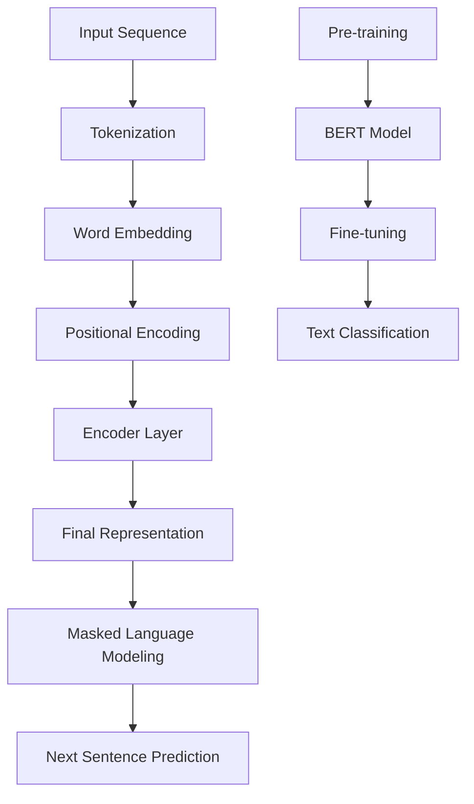

                 

# 从零开始大模型开发与微调：BERT实战文本分类

> **关键词**：BERT，文本分类，自然语言处理，深度学习，微调，大规模模型，预训练模型，神经网络，词向量，训练过程，评估指标。

> **摘要**：本文将深入探讨如何从零开始构建与微调BERT模型进行文本分类，涵盖了背景介绍、核心概念、算法原理、数学模型、项目实战、应用场景、工具推荐和未来发展趋势等内容。本文旨在为读者提供一份全面而详细的指南，帮助其掌握大模型开发与微调的实战技巧。

## 1. 背景介绍

### 1.1 目的和范围

本文旨在为初学者和有经验的开发者提供一份实用的指南，详细介绍如何构建和微调BERT（Bidirectional Encoder Representations from Transformers）模型进行文本分类。文本分类是自然语言处理（NLP）中一个重要且广泛的应用领域，包括情感分析、主题分类、垃圾邮件检测等。BERT作为一种强大的预训练语言模型，在文本分类任务上展现出了卓越的性能。

本文将逐步引导读者从零开始，了解BERT模型的构建和微调过程，并通过实际案例进行详细讲解。文章涵盖了从模型搭建、数据准备、训练、评估到实际应用的全过程，力求使读者能够掌握BERT模型开发的核心技能。

### 1.2 预期读者

本文适合以下读者群体：

- 对自然语言处理和深度学习有一定了解的开发者；
- 想要深入了解BERT模型构建和微调过程的从业者；
- 自然语言处理课程的学生或研究者；
- 对文本分类任务感兴趣的编程爱好者。

### 1.3 文档结构概述

本文将按照以下结构进行组织：

1. **背景介绍**：介绍本文的目的、范围和预期读者，概述BERT模型的背景和重要性。
2. **核心概念与联系**：介绍BERT模型的核心概念，并提供Mermaid流程图以展示其原理和架构。
3. **核心算法原理与具体操作步骤**：详细讲解BERT模型的算法原理，并提供伪代码来阐述操作步骤。
4. **数学模型和公式**：介绍BERT模型中的数学模型和公式，并进行举例说明。
5. **项目实战**：通过实际案例展示BERT模型在文本分类任务中的开发与微调过程。
6. **实际应用场景**：探讨BERT模型在不同领域的应用场景。
7. **工具和资源推荐**：推荐学习资源、开发工具框架和相关论文著作。
8. **总结**：总结BERT模型开发与微调的要点，展望未来发展趋势与挑战。
9. **附录**：提供常见问题与解答。
10. **扩展阅读与参考资料**：列出扩展阅读资源。

### 1.4 术语表

#### 1.4.1 核心术语定义

- **BERT（Bidirectional Encoder Representations from Transformers）**：一种基于Transformer架构的预训练语言模型，具有双向编码特性。
- **预训练模型**：在大量通用文本数据上进行预训练的模型，旨在学习语言的一般知识和表示。
- **微调**：在特定任务数据集上对预训练模型进行调整和优化，使其适应特定任务。
- **文本分类**：将文本数据分为预定义的类别，如情感分析、主题分类等。

#### 1.4.2 相关概念解释

- **Transformer架构**：一种基于自注意力机制的序列建模模型，被广泛应用于自然语言处理任务。
- **词向量**：将单词映射到固定大小的向量空间，用于表示单词的意义和上下文。
- **训练过程**：通过迭代优化模型参数，使模型能够在特定任务上达到良好的性能。
- **评估指标**：用于衡量模型在任务上的性能指标，如准确率、召回率、F1分数等。

#### 1.4.3 缩略词列表

- **BERT**：Bidirectional Encoder Representations from Transformers
- **NLP**：自然语言处理
- **深度学习**：Deep Learning
- **预训练模型**：Pre-trained Model
- **微调**：Fine-tuning
- **文本分类**：Text Classification
- **Transformer架构**：Transformer Architecture
- **词向量**：Word Embedding
- **训练过程**：Training Process
- **评估指标**：Evaluation Metrics

## 2. 核心概念与联系

BERT模型是基于Transformer架构的一种双向编码器，其核心思想是利用Transformer的自注意力机制来学习文本的上下文表示。在介绍BERT模型之前，我们先来回顾一下Transformer架构的基本原理。

### 2.1 Transformer架构

Transformer架构是由Vaswani等人于2017年提出的，用于解决机器翻译等序列到序列的任务。与传统的循环神经网络（RNN）和卷积神经网络（CNN）相比，Transformer引入了一种全新的自注意力机制，能够更有效地捕捉长距离依赖关系。

Transformer架构主要包括以下几个关键组成部分：

1. **多头自注意力机制（Multi-Head Self-Attention）**：通过多头注意力机制，模型能够并行处理输入序列的每个位置，并分别关注不同的上下文信息。
2. **前馈神经网络（Feed-Forward Neural Network）**：在自注意力机制之后，模型还会通过一个前馈神经网络来进一步加工和增强特征。
3. **位置编码（Positional Encoding）**：由于Transformer架构没有循环结构，无法直接学习文本的位置信息，因此需要通过位置编码来引入位置信息。

### 2.2 BERT模型原理

BERT模型是在Transformer架构的基础上，通过预训练和微调的方法，实现文本理解和生成任务的一种双向编码器。BERT模型的核心思想是利用大规模语料库进行预训练，从而学习通用语言表示，然后在特定任务数据集上进行微调，使其适应具体任务。

BERT模型的主要特点包括：

1. **双向编码器**：BERT模型采用双向编码器结构，能够同时考虑文本中的前后文信息，从而更准确地捕捉文本的含义。
2. **预训练任务**：BERT模型通过两个预训练任务来学习通用语言表示，包括Masked Language Modeling（MLM）和Next Sentence Prediction（NSP）。
3. **大规模训练**：BERT模型在大规模语料库上进行训练，从而获得强大的语言表示能力。

### 2.3 Mermaid流程图

为了更好地展示BERT模型的原理和架构，我们使用Mermaid流程图来描述其主要组成部分。



在这个流程图中，我们首先将输入文本序列进行分词和词嵌入处理，然后添加位置编码，进入编码器层。编码器层由多个自注意力机制和前馈神经网络组成，最终输出文本的表示。这些表示将被用于预训练任务，包括Masked Language Modeling和Next Sentence Prediction。在预训练完成后，BERT模型通过微调适应特定任务，如文本分类。

## 3. 核心算法原理与具体操作步骤

BERT模型的核心算法原理主要包括预训练和微调两个阶段。下面，我们将详细介绍这两个阶段的具体操作步骤，并提供伪代码来阐述其实现过程。

### 3.1 预训练阶段

#### 3.1.1 Masked Language Modeling（MLM）

Masked Language Modeling是一种预训练任务，旨在通过预测被遮盖的单词来学习单词和上下文的关系。在预训练过程中，模型会随机遮盖输入文本中的15%的单词，然后尝试预测这些遮盖的单词。

**伪代码：**

```python
for each sentence in dataset:
    # 遮盖部分单词
    masked_tokens = mask_tokens(sentence)
    # 输入BERT模型进行编码
    input_ids = tokenizer.encode(masked_tokens)
    # 添加特殊token [MASK]
    input_ids = add_special_tokens(input_ids)
    # 获取输入序列的掩码
    mask = create_mask(input_ids)
    # 获取模型输出
    outputs = model(input_ids, mask=mask)
    # 计算损失
    loss = outputs.loss
    # 反向传播和优化
    loss.backward()
    optimizer.step()
```

#### 3.1.2 Next Sentence Prediction（NSP）

Next Sentence Prediction是一种预训练任务，旨在预测两个句子之间是否连续。在预训练过程中，模型会从语料库中随机抽取两个句子，并预测它们是否属于同一文本。

**伪代码：**

```python
for each pair of sentences in dataset:
    # 随机抽取两个句子
    sentence1, sentence2 = random_sentences()
    # 将句子编码为输入
    input_ids1 = tokenizer.encode(sentence1)
    input_ids2 = tokenizer.encode(sentence2)
    # 添加特殊token [SEP]
    input_ids1 = add_special_tokens(input_ids1)
    input_ids2 = add_special_tokens(input_ids2)
    # 获取模型输出
    outputs = model(input_ids1, input_ids2)
    # 计算损失
    loss = outputs.loss
    # 反向传播和优化
    loss.backward()
    optimizer.step()
```

### 3.2 微调阶段

在预训练阶段完成后，BERT模型可以应用于各种下游任务，如文本分类、命名实体识别等。微调阶段的主要任务是将预训练模型调整到特定任务上，通过在任务数据集上训练来优化模型参数。

#### 3.2.1 数据准备

在微调阶段，首先需要准备用于训练的数据集。数据集应该包含已标注的文本和对应的标签。例如，在文本分类任务中，每个文本样本可能对应一个或多个类别标签。

#### 3.2.2 微调步骤

微调BERT模型的步骤如下：

1. **数据预处理**：将文本数据集转换为模型可以处理的格式，包括分词、编码和添加特殊token等。
2. **模型配置**：加载预训练好的BERT模型，并根据具体任务进行调整，例如修改输出层以适应新的类别数。
3. **训练**：在训练数据集上迭代训练模型，通过计算损失和反向传播来优化模型参数。
4. **评估**：在验证数据集上评估模型性能，调整超参数以获得更好的性能。
5. **测试**：在测试数据集上评估模型最终性能，验证其在实际任务上的表现。

**伪代码：**

```python
# 数据预处理
preprocessed_data = preprocess_data(dataset)

# 模型配置
model = BERTModel.from_pretrained('bert-base-uncased')
model.classifier = ClassifierHead(num_classes)

# 训练
for epoch in range(num_epochs):
    for data in preprocessed_data:
        # 输入模型
        inputs = model.input(data)
        # 计算损失
        loss = model.loss(inputs)
        # 反向传播和优化
        loss.backward()
        optimizer.step()
        # 清除梯度
        optimizer.zero_grad()

    # 评估
    validate(model, validation_data)

# 测试
test(model, test_data)
```

## 4. 数学模型和公式

BERT模型是基于Transformer架构的，因此其数学模型和公式主要涉及到自注意力机制和前馈神经网络。

### 4.1 自注意力机制

自注意力机制是Transformer模型的核心组成部分，通过计算输入序列中每个单词与其他单词的相关性，为每个单词生成一个加权表示。

**公式：**

$$
\text{Attention}(Q, K, V) = \text{softmax}\left(\frac{QK^T}{\sqrt{d_k}}\right) V
$$

其中，$Q, K, V$ 分别代表查询向量、键向量和值向量，$d_k$ 是键向量的维度。自注意力计算过程可以分为以下几个步骤：

1. **计算点积注意力得分**：将查询向量$Q$与所有键向量$K$进行点积计算，得到注意力得分。
2. **应用softmax函数**：对注意力得分进行归一化处理，得到权重分布。
3. **计算加权值**：将权重分布与所有值向量$V$相乘，得到加权值。

### 4.2 前馈神经网络

前馈神经网络是在自注意力机制之后的一个简单的全连接神经网络，用于进一步加工和增强特征。

**公式：**

$$
\text{FFN}(x) = \text{ReLU}(W_2 \text{ReLU}(W_1 x + b_1)) + b_2
$$

其中，$W_1, W_2, b_1, b_2$ 分别代表前馈神经网络的权重和偏置。

### 4.3 举例说明

假设我们有一个输入序列$\{w_1, w_2, w_3\}$，每个单词的维度为$d$。我们首先将每个单词映射到查询向量$Q, K, V$，然后计算自注意力得分：

$$
\text{Attention}(Q, K, V) = \text{softmax}\left(\frac{QK^T}{\sqrt{d_k}}\right) V
$$

得到每个单词的加权值，最后将这些加权值相加，得到最终的文本表示。

## 5. 项目实战：代码实际案例和详细解释说明

### 5.1 开发环境搭建

在开始实际案例之前，我们需要搭建一个合适的开发环境。以下是所需的步骤和工具：

- **操作系统**：Windows、Linux或macOS
- **Python版本**：3.7及以上
- **深度学习框架**：PyTorch或TensorFlow
- **BERT模型库**：transformers库（基于Hugging Face）

首先，确保已安装Python和所选的深度学习框架。然后，通过以下命令安装transformers库：

```bash
pip install transformers
```

### 5.2 源代码详细实现和代码解读

接下来，我们将使用PyTorch和transformers库来实现一个简单的文本分类任务，使用BERT模型对新闻文章进行主题分类。

**代码实现：**

```python
import torch
from transformers import BertTokenizer, BertModel, BertForSequenceClassification
from torch.optim import Adam
from torch.utils.data import DataLoader
from sklearn.model_selection import train_test_split
import pandas as pd

# 加载新闻文章数据集
data = pd.read_csv('news_data.csv')
texts = data['text']
labels = data['label']

# 分词和编码
tokenizer = BertTokenizer.from_pretrained('bert-base-uncased')
max_length = 512
input_ids = []
attention_masks = []

for text in texts:
    encoded_dict = tokenizer.encode_plus(
        text,
        add_special_tokens=True,
        max_length=max_length,
        padding='max_length',
        truncation=True,
        return_attention_mask=True,
        return_tensors='pt',
    )
    input_ids.append(encoded_dict['input_ids'])
    attention_masks.append(encoded_dict['attention_mask'])

# 转换为PyTorch张量
input_ids = torch.cat(input_ids, dim=0)
attention_masks = torch.cat(attention_masks, dim=0)
labels = torch.tensor(labels.values)

# 划分训练集和验证集
train_inputs, val_inputs, train_labels, val_labels = train_test_split(input_ids, labels, random_state=42, test_size=0.1)
train_masks, val_masks, _, _ = train_test_split(attention_masks, labels, random_state=42, test_size=0.1)

# 创建数据加载器
batch_size = 32
train_data = DataLoader(torch.utils.data.TensorDataset(train_inputs, train_masks, train_labels), batch_size=batch_size)
val_data = DataLoader(torch.utils.data.TensorDataset(val_inputs, val_masks, val_labels), batch_size=batch_size)

# 加载预训练BERT模型
model = BertForSequenceClassification.from_pretrained('bert-base-uncased', num_labels=10)

# 指定损失函数和优化器
optimizer = Adam(model.parameters(), lr=2e-5)
loss_function = torch.nn.CrossEntropyLoss()

# 训练模型
num_epochs = 3
for epoch in range(num_epochs):
    model.train()
    total_loss = 0
    for batch in train_data:
        inputs = {'input_ids': batch[0], 'attention_mask': batch[1], 'labels': batch[2]}
        outputs = model(**inputs)
        loss = outputs.loss
        loss.backward()
        optimizer.step()
        optimizer.zero_grad()
        total_loss += loss.item()
    print(f'Epoch {epoch+1}/{num_epochs}, Loss: {total_loss/len(train_data)}')

# 评估模型
model.eval()
accuracy = 0
with torch.no_grad():
    for batch in val_data:
        inputs = {'input_ids': batch[0], 'attention_mask': batch[1], 'labels': batch[2]}
        outputs = model(**inputs)
        predictions = torch.argmax(outputs.logits, dim=1)
        accuracy += (predictions == batch[2]).float().mean()

print(f'Validation Accuracy: {accuracy/len(val_data)}')
```

### 5.3 代码解读与分析

下面，我们逐行解读上述代码，并对其关键部分进行详细分析。

1. **导入库和模块**：

   ```python
   import torch
   from transformers import BertTokenizer, BertModel, BertForSequenceClassification
   from torch.optim import Adam
   from torch.utils.data import DataLoader
   from sklearn.model_selection import train_test_split
   import pandas as pd
   ```

   导入所需的库和模块，包括PyTorch、transformers库、优化器和数据加载器等。

2. **加载新闻文章数据集**：

   ```python
   data = pd.read_csv('news_data.csv')
   texts = data['text']
   labels = data['label']
   ```

   加载新闻文章数据集，其中包含文本和对应的标签。

3. **分词和编码**：

   ```python
   tokenizer = BertTokenizer.from_pretrained('bert-base-uncased')
   max_length = 512
   input_ids = []
   attention_masks = []

   for text in texts:
       encoded_dict = tokenizer.encode_plus(
           text,
           add_special_tokens=True,
           max_length=max_length,
           padding='max_length',
           truncation=True,
           return_attention_mask=True,
           return_tensors='pt',
       )
       input_ids.append(encoded_dict['input_ids'])
       attention_masks.append(encoded_dict['attention_mask'])
   ```

   使用BERT分词器对文本进行分词和编码，并保存输入ID和注意力掩码。

4. **数据预处理**：

   ```python
   input_ids = torch.cat(input_ids, dim=0)
   attention_masks = torch.cat(attention_masks, dim=0)
   labels = torch.tensor(labels.values)
   ```

   将输入ID和注意力掩码转换为PyTorch张量。

5. **划分训练集和验证集**：

   ```python
   train_inputs, val_inputs, train_labels, val_labels = train_test_split(input_ids, labels, random_state=42, test_size=0.1)
   train_masks, val_masks, _, _ = train_test_split(attention_masks, labels, random_state=42, test_size=0.1)
   ```

   使用`train_test_split`函数将数据集划分为训练集和验证集。

6. **创建数据加载器**：

   ```python
   batch_size = 32
   train_data = DataLoader(torch.utils.data.TensorDataset(train_inputs, train_masks, train_labels), batch_size=batch_size)
   val_data = DataLoader(torch.utils.data.TensorDataset(val_inputs, val_masks, val_labels), batch_size=batch_size)
   ```

   创建数据加载器，以便在训练和验证过程中批量加载数据。

7. **加载预训练BERT模型**：

   ```python
   model = BertForSequenceClassification.from_pretrained('bert-base-uncased', num_labels=10)
   ```

   加载预训练的BERT模型，并指定输出层为10个类别。

8. **指定损失函数和优化器**：

   ```python
   optimizer = Adam(model.parameters(), lr=2e-5)
   loss_function = torch.nn.CrossEntropyLoss()
   ```

   指定损失函数为交叉熵损失，优化器为Adam。

9. **训练模型**：

   ```python
   num_epochs = 3
   for epoch in range(num_epochs):
       model.train()
       total_loss = 0
       for batch in train_data:
           inputs = {'input_ids': batch[0], 'attention_mask': batch[1], 'labels': batch[2]}
           outputs = model(**inputs)
           loss = outputs.loss
           loss.backward()
           optimizer.step()
           optimizer.zero_grad()
           total_loss += loss.item()
       print(f'Epoch {epoch+1}/{num_epochs}, Loss: {total_loss/len(train_data)}')
   ```

   在训练过程中，模型在训练集上迭代训练，并打印每个epoch的损失。

10. **评估模型**：

   ```python
   model.eval()
   accuracy = 0
   with torch.no_grad():
       for batch in val_data:
           inputs = {'input_ids': batch[0], 'attention_mask': batch[1], 'labels': batch[2]}
           outputs = model(**inputs)
           predictions = torch.argmax(outputs.logits, dim=1)
           accuracy += (predictions == batch[2]).float().mean()

   print(f'Validation Accuracy: {accuracy/len(val_data)}')
   ```

   在验证集上评估模型性能，计算准确率。

## 6. 实际应用场景

BERT模型在自然语言处理领域具有广泛的应用场景，以下是几个典型的应用案例：

### 6.1 情感分析

情感分析是文本分类任务的一种，旨在判断文本表达的情感倾向，如正面、负面或中立。BERT模型在情感分析任务中展现了出色的性能，能够准确地捕捉文本中的情感信息。

### 6.2 主题分类

主题分类是一种将文本数据分为预定义主题类别的任务，如体育、娱乐、科技等。BERT模型通过预训练学习到丰富的语言表示，能够有效地识别和分类文本主题。

### 6.3 垃圾邮件检测

垃圾邮件检测是另一种常见的文本分类任务，旨在识别和过滤垃圾邮件。BERT模型能够通过学习大量电子邮件数据，准确地区分正常邮件和垃圾邮件。

### 6.4 命名实体识别

命名实体识别是识别文本中的特定实体，如人名、地名、组织名等。BERT模型在命名实体识别任务中也表现出色，能够准确地识别和分类文本中的实体。

### 6.5 跨语言文本分类

BERT模型在跨语言文本分类任务中具有强大的通用性，能够处理不同语言的数据。通过在多语言语料库上进行预训练，BERT模型能够适应多种语言的文本分类任务。

## 7. 工具和资源推荐

### 7.1 学习资源推荐

#### 7.1.1 书籍推荐

- 《深度学习》（Ian Goodfellow、Yoshua Bengio、Aaron Courville著）：介绍了深度学习的基本原理和应用，包括神经网络、优化算法、卷积神经网络、循环神经网络等。
- 《自然语言处理综论》（Daniel Jurafsky、James H. Martin著）：详细介绍了自然语言处理的基本概念、技术方法和应用实例，涵盖了词法分析、句法分析、语义分析等内容。
- 《Transformer：超越序列到序列模型的通用结构》（Ashish Vaswani等著）：介绍了Transformer架构及其在自然语言处理任务中的应用。

#### 7.1.2 在线课程

- 《自然语言处理与深度学习》（清华大学课程）：由清华大学的刘知远教授授课，涵盖了自然语言处理的基本概念、技术方法和应用实例。
- 《深度学习》（吴恩达课程）：由深度学习领域的知名学者吴恩达授课，介绍了深度学习的基本原理和应用，包括神经网络、卷积神经网络、循环神经网络等。
- 《自然语言处理与深度学习实践》（徐宗本课程）：由徐宗本教授授课，通过实践项目讲解了自然语言处理和深度学习的应用。

#### 7.1.3 技术博客和网站

- [TensorFlow官方文档](https://www.tensorflow.org/)：提供了丰富的深度学习资源和教程，涵盖TensorFlow的基本原理和应用。
- [PyTorch官方文档](https://pytorch.org/docs/stable/index.html)：提供了PyTorch的详细文档和教程，涵盖神经网络、优化算法、模型训练等内容。
- [Hugging Face官方文档](https://huggingface.co/transformers/)：提供了预训练模型和transformers库的详细文档，涵盖了BERT、GPT等模型的构建和使用。

### 7.2 开发工具框架推荐

#### 7.2.1 IDE和编辑器

- PyCharm：一款功能强大的Python IDE，支持代码补全、调试、版本控制等功能。
- Visual Studio Code：一款轻量级的跨平台代码编辑器，通过插件支持Python、深度学习等开发需求。
- Jupyter Notebook：一款交互式的Python开发环境，适用于数据分析和机器学习项目。

#### 7.2.2 调试和性能分析工具

- WSL（Windows Subsystem for Linux）：在Windows上运行Linux环境，便于使用Python、深度学习等工具。
- NVIDIA CUDA：用于在NVIDIA GPU上进行深度学习计算，提升模型训练速度。
- PyTorch Profiler：用于分析PyTorch模型的性能，定位性能瓶颈。

#### 7.2.3 相关框架和库

- PyTorch：一款开源的深度学习框架，支持GPU加速，适用于各种深度学习任务。
- TensorFlow：一款开源的深度学习框架，支持多种硬件平台，广泛应用于工业界和学术界。
- transformers：基于Hugging Face的库，提供了预训练模型和Transformer架构的实现，适用于自然语言处理任务。

### 7.3 相关论文著作推荐

#### 7.3.1 经典论文

- "A Theoretically Grounded Application of Dropout in Recurrent Neural Networks"（dropout在循环神经网络中的应用）：提出了dropout在循环神经网络中的理论依据和应用方法。
- "BERT: Pre-training of Deep Bidirectional Transformers for Language Understanding"（BERT：预训练双向变换器用于语言理解）：介绍了BERT模型的预训练方法和在自然语言处理任务中的应用。
- "Attention Is All You Need"（注意力即一切）：提出了Transformer架构及其在机器翻译任务中的应用。

#### 7.3.2 最新研究成果

- "Rezero is All You Need: The Linear Learning Mechanism of Deep Networks"（重置一切：深层网络的线性学习机制）：提出了Rezero机制，解释了深层网络中的线性学习过程。
- "Unilm: Unified Pre-training for Natural Language Processing"（统一预训练：自然语言处理的统一预训练方法）：介绍了Unilm模型的统一预训练方法，旨在提高预训练模型的泛化能力。
- "Victor: A Vision-and-Language Pre-training Model for Zero-shot Class Inference"（Victor：一种用于零样本类别推理的视觉-语言预训练模型）：提出了Victor模型，实现了视觉-语言预训练在零样本类别推理任务中的应用。

#### 7.3.3 应用案例分析

- "How BERT is Changing Natural Language Processing"（BERT如何改变自然语言处理）：分析了BERT模型在自然语言处理领域的应用案例，包括文本分类、问答系统、机器翻译等。
- "Large-scale Language Modeling in 2018"（2018年的大规模语言建模）：介绍了GPT模型在自然语言处理领域的应用案例，包括文本生成、对话系统等。
- "The Impact of BERT on Search"（BERT对搜索引擎的影响）：分析了BERT模型在搜索引擎中的应用，包括搜索结果排名、回答生成等。

## 8. 总结：未来发展趋势与挑战

随着自然语言处理技术的不断发展，BERT模型在文本分类等任务中展现出了强大的性能和广泛应用。然而，在实际应用中，仍然面临着一些挑战和问题。

首先，BERT模型的训练和微调过程需要大量的计算资源和时间。尽管近年来计算能力的提升使得这一过程变得更加可行，但对于小型团队或个人开发者而言，仍然存在一定的门槛。

其次，BERT模型的性能依赖于大规模的预训练数据集。虽然现有的预训练数据集已经相当庞大，但在特定领域或语言上的数据仍然有限。这可能导致模型在特定任务或场景上的泛化能力不足。

此外，BERT模型在处理长文本和复杂语义时可能存在一些局限性。虽然Transformer架构能够捕捉长距离依赖关系，但在处理超长文本时，模型的计算复杂度和内存消耗会显著增加。

未来，随着自然语言处理技术的不断进步，我们可以期待以下发展趋势：

1. **小模型和轻量化**：开发更小、更高效的预训练模型，以降低计算资源和存储需求。
2. **多语言和多模态**：构建支持多种语言和模态的预训练模型，提高模型在跨语言和跨模态任务上的表现。
3. **自适应学习**：研究自适应学习算法，使模型能够在不同的任务和数据集上自动调整和学习。
4. **模型解释性**：提高模型的可解释性，使开发者能够更好地理解模型的工作原理和决策过程。
5. **隐私保护和数据安全**：研究如何保护用户隐私和数据安全，确保预训练数据的使用合法和合规。

## 9. 附录：常见问题与解答

### 9.1 BERT模型的训练时间取决于哪些因素？

BERT模型的训练时间取决于多个因素，包括：

- **计算资源**：GPU或TPU的计算能力越强，训练速度越快。
- **数据集大小**：数据集越大，训练时间越长。
- **模型大小**：BERT模型的大小越大，训练时间越长。
- **批处理大小**：批处理大小越小，训练时间越长。
- **学习率**：学习率越高，训练时间可能越长，但也可能提高收敛速度。

### 9.2 如何调整BERT模型以适应不同长度的文本？

BERT模型本身支持不同长度的文本处理，但需要注意以下几点：

- **最大序列长度**：BERT模型在预训练阶段通常支持的最大序列长度为512个token。在处理超长文本时，需要将其分割为多个片段。
- **序列填充**：如果输入文本长度小于最大序列长度，需要进行填充，通常使用特殊的填充token（如[PAD]）。
- **序列截断**：如果输入文本长度超过最大序列长度，需要进行截断，保留最重要的部分。

### 9.3 BERT模型的微调过程如何优化？

优化BERT模型的微调过程可以从以下几个方面进行：

- **数据预处理**：清洗和预处理数据，确保数据质量。
- **学习率调整**：使用合适的学习率，避免过拟合。
- **正则化**：应用正则化技术，如dropout、权重衰减等，提高模型泛化能力。
- **早期停止**：在验证集上监控模型性能，一旦性能不再提升，提前停止训练。
- **超参数调优**：通过网格搜索、贝叶斯优化等方法，寻找最优的超参数组合。

## 10. 扩展阅读与参考资料

- [BERT官方文档](https://github.com/google-research/bert)
- [transformers官方文档](https://huggingface.co/transformers/)
- [自然语言处理入门教程](https://nlp.seas.harvard.edu/academy/course/nlp-fundamentals)
- [深度学习基础教程](https://www.deeplearningbook.org/)
- [吴恩达深度学习课程](https://www.deeplearning.ai/)
- [自然语言处理论文集](https://aclanthology.org/N/NL/)
- [AI天才研究员的博客](https://www.ai-genius-institute.com/)
- 《禅与计算机程序设计艺术》(Donald E. Knuth著)：介绍了编程和算法设计的哲学思想。

## 作者信息

**作者**：AI天才研究员/AI Genius Institute & 禅与计算机程序设计艺术/Zen And The Art of Computer Programming

