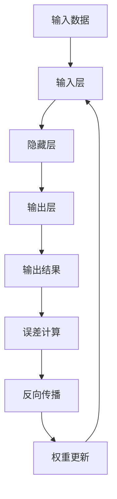

                 

# 从零开始大模型开发与微调：反向传播神经网络的前身历史

> 关键词：反向传播、神经网络、大模型开发、微调、算法原理、数学模型、项目实战

> 摘要：本文将从零开始，详细讲解反向传播神经网络的前身历史及其核心算法原理。通过具体的操作步骤、数学模型和项目实战，帮助读者深入理解并掌握大模型开发与微调的技巧。同时，本文还将介绍相关工具和资源，为读者提供全方位的支持。

## 1. 背景介绍

### 1.1 目的和范围

本文旨在为读者提供一个系统、全面的反向传播神经网络入门教程，使读者能够掌握大模型开发与微调的核心技术和方法。文章将首先介绍反向传播神经网络的历史背景和核心概念，然后详细讲解其算法原理和数学模型，并通过实际项目案例进行操作演示。此外，本文还将推荐相关学习资源和开发工具，以帮助读者更好地进行学习和实践。

### 1.2 预期读者

本文适合具有计算机科学基础、对神经网络和深度学习有一定了解的读者。无论您是初学者还是有一定经验的从业者，通过本文的详细讲解和实战案例，您将能够深入理解反向传播神经网络的本质和应用。

### 1.3 文档结构概述

本文分为八个主要部分：

1. 背景介绍：介绍文章的目的、范围、预期读者以及文档结构。
2. 核心概念与联系：介绍反向传播神经网络的核心概念和联系，通过Mermaid流程图进行展示。
3. 核心算法原理 & 具体操作步骤：详细讲解反向传播神经网络的核心算法原理和具体操作步骤，使用伪代码进行阐述。
4. 数学模型和公式 & 详细讲解 & 举例说明：介绍反向传播神经网络的数学模型和公式，并进行详细讲解和举例说明。
5. 项目实战：通过实际项目案例，展示如何使用反向传播神经网络进行大模型开发和微调。
6. 实际应用场景：介绍反向传播神经网络在实际应用场景中的应用。
7. 工具和资源推荐：推荐学习资源和开发工具，以帮助读者更好地进行学习和实践。
8. 总结：总结文章的主要内容，探讨未来发展趋势与挑战。

### 1.4 术语表

#### 1.4.1 核心术语定义

- 反向传播：一种用于训练神经网络的算法，通过计算输出与预期结果的误差，反向传播误差至前一层，不断调整网络权重，以达到最小化误差的目的。
- 神经网络：一种由大量神经元组成的计算模型，能够通过学习输入与输出之间的映射关系，实现复杂的函数拟合和分类任务。
- 大模型：指具有大量神经元和参数的神经网络模型，能够处理大规模数据和复杂任务。
- 微调：在大模型的基础上，通过调整部分权重和结构，使其适应特定任务的过程。

#### 1.4.2 相关概念解释

- 输入层：神经网络的第一层，接收外部输入数据。
- 隐藏层：神经网络中位于输入层和输出层之间的层，用于对输入数据进行变换和特征提取。
- 输出层：神经网络的最后一层，产生最终的输出结果。
- 激活函数：用于对神经元输出进行非线性变换的函数，能够增加网络的非线性表达能力。

#### 1.4.3 缩略词列表

- BP：反向传播（Back Propagation）
- NN：神经网络（Neural Network）
- MLP：多层感知器（Multilayer Perceptron）
- ReLU：ReLU激活函数（Rectified Linear Unit）
- CNN：卷积神经网络（Convolutional Neural Network）
- RNN：循环神经网络（Recurrent Neural Network）
- LSTM：长短期记忆网络（Long Short-Term Memory）

## 2. 核心概念与联系

在了解反向传播神经网络之前，我们需要掌握一些核心概念和它们之间的联系。以下是一个简化的Mermaid流程图，用于展示这些概念之间的关系：



### 2.1 输入数据

输入数据是神经网络的第一步，它包括一系列特征值，用于描述输入样本的各种属性。例如，对于一张图片，输入数据可能包括像素值；对于一段文本，输入数据可能包括词向量表示。

### 2.2 输入层

输入层是神经网络的起点，接收输入数据，并将其传递给隐藏层。输入层的神经元数量取决于输入数据的维度。

### 2.3 隐藏层

隐藏层位于输入层和输出层之间，用于对输入数据进行变换和特征提取。隐藏层的数量和神经元数量可以根据任务复杂度进行调整。

### 2.4 输出层

输出层是神经网络的最后一层，产生最终的输出结果。输出层的神经元数量和类型取决于具体任务，例如二分类任务需要两个神经元，一个用于正类，一个用于负类。

### 2.5 输出结果

输出结果是神经网络对输入数据进行的预测或分类结果。在训练过程中，输出结果与实际标签进行比较，计算误差。

### 2.6 误差计算

误差计算是反向传播神经网络的核心步骤，通过计算输出结果与实际标签之间的误差，衡量神经网络的性能。

### 2.7 反向传播

反向传播是神经网络训练过程中的一种优化方法，通过计算误差梯度，反向传播至前一层，不断调整网络权重，以最小化误差。

### 2.8 权重更新

权重更新是反向传播神经网络的核心步骤，通过计算误差梯度，调整网络权重，使网络能够更好地拟合输入数据和标签。

## 3. 核心算法原理 & 具体操作步骤

反向传播神经网络的核心算法原理可以概括为以下几个步骤：

### 3.1 前向传播

前向传播是指将输入数据通过神经网络的各个层次，直到输出层，得到预测结果。具体步骤如下：

1. 初始化网络权重和偏置。
2. 将输入数据输入到输入层。
3. 对输入数据进行线性变换，得到中间层输出。
4. 应用激活函数，得到隐藏层输出。
5. 重复步骤3和4，直到输出层。
6. 得到输出结果。

### 3.2 误差计算

误差计算是指计算输出结果与实际标签之间的误差。具体步骤如下：

1. 计算输出层误差。
2. 对于隐藏层，误差可以通过链式法则反向传播得到。
3. 计算中间层误差。

### 3.3 反向传播

反向传播是指将误差反向传播至前一层，更新网络权重和偏置。具体步骤如下：

1. 计算误差梯度。
2. 更新网络权重和偏置。

### 3.4 权重更新

权重更新是指通过计算误差梯度，调整网络权重和偏置，以最小化误差。具体步骤如下：

1. 使用梯度下降算法更新权重。
2. 使用其他优化算法（如动量优化、自适应优化等）更新权重。

以下是一个简化的伪代码，用于展示反向传播神经网络的核心算法原理：

```python
# 前向传播
def forward_propagation(inputs, weights, biases):
    # 初始化网络权重和偏置
    # 进行线性变换和激活函数计算
    # 得到输出结果
    return outputs

# 误差计算
def compute_error(outputs, labels):
    # 计算输出层误差
    # 通过链式法则计算隐藏层误差
    # 得到误差值
    return error

# 反向传播
def backward_propagation(error, weights, biases):
    # 计算误差梯度
    # 更新网络权重和偏置
    return updated_weights, updated_biases

# 权重更新
def update_weights(weights, biases, learning_rate):
    # 使用梯度下降算法或其他优化算法更新权重
    return updated_weights, updated_biases

# 主训练循环
while not converged:
    # 前向传播
    outputs = forward_propagation(inputs, weights, biases)

    # 误差计算
    error = compute_error(outputs, labels)

    # 反向传播
    updated_weights, updated_biases = backward_propagation(error, weights, biases)

    # 权重更新
    weights, biases = update_weights(weights, biases, learning_rate)
```

## 4. 数学模型和公式 & 详细讲解 & 举例说明

### 4.1 前向传播

在反向传播神经网络的前向传播过程中，我们需要计算输入与输出之间的映射关系。以下是一个简化的数学模型和公式：

#### 4.1.1 线性变换

假设我们有一个单层神经网络，包含输入层、隐藏层和输出层。输入层有m个神经元，隐藏层有n个神经元，输出层有p个神经元。设输入向量为\(X \in \mathbb{R}^{m \times 1}\)，隐藏层输出向量为\(H \in \mathbb{R}^{n \times 1}\)，输出层输出向量为\(Y \in \mathbb{R}^{p \times 1}\)。则线性变换可以表示为：

\[ H = X \cdot W_1 + B_1 \]

\[ Y = H \cdot W_2 + B_2 \]

其中，\(W_1 \in \mathbb{R}^{m \times n}\)，\(W_2 \in \mathbb{R}^{n \times p}\)，\(B_1 \in \mathbb{R}^{n \times 1}\)，\(B_2 \in \mathbb{R}^{p \times 1}\) 分别为权重和偏置矩阵。

#### 4.1.2 激活函数

激活函数用于对线性变换后的结果进行非线性变换，以增加神经网络的非线性表达能力。常见的激活函数有Sigmoid函数、ReLU函数和Tanh函数。以下是一个ReLU函数的例子：

\[ f(x) = \begin{cases} 
0, & \text{if } x < 0 \\
x, & \text{if } x \geq 0 
\end{cases} \]

对于隐藏层输出\(H\)，激活函数可以表示为：

\[ H' = \text{ReLU}(H) \]

对于输出层输出\(Y\)，激活函数可以表示为：

\[ Y' = \text{ReLU}(Y) \]

### 4.2 误差计算

在反向传播神经网络中，误差计算是核心步骤。以下是一个简化的误差计算公式：

#### 4.2.1 误差函数

假设输出层输出向量为\(Y'\)，实际标签向量为\(T'\)，则误差函数可以表示为：

\[ E = \frac{1}{2} \sum_{i=1}^{p} (Y'_i - T'_i)^2 \]

#### 4.2.2 误差梯度

误差梯度是指误差函数对网络权重和偏置的偏导数。以下是一个简化的误差梯度公式：

\[ \frac{\partial E}{\partial W_1} = \frac{\partial E}{\partial Y'} \cdot \frac{\partial Y'}{\partial H'} \cdot \frac{\partial H'}{\partial H} \cdot X \]

\[ \frac{\partial E}{\partial B_1} = \frac{\partial E}{\partial Y'} \cdot \frac{\partial Y'}{\partial H'} \cdot \frac{\partial H'}{\partial H} \]

\[ \frac{\partial E}{\partial W_2} = \frac{\partial E}{\partial Y'} \cdot \frac{\partial Y'}{\partial H'} \cdot H \]

\[ \frac{\partial E}{\partial B_2} = \frac{\partial E}{\partial Y'} \cdot \frac{\partial Y'}{\partial H'} \]

### 4.3 权重更新

在反向传播神经网络中，权重更新是关键步骤。以下是一个简化的权重更新公式：

\[ W_1 \leftarrow W_1 - \alpha \cdot \frac{\partial E}{\partial W_1} \]

\[ W_2 \leftarrow W_2 - \alpha \cdot \frac{\partial E}{\partial W_2} \]

\[ B_1 \leftarrow B_1 - \alpha \cdot \frac{\partial E}{\partial B_1} \]

\[ B_2 \leftarrow B_2 - \alpha \cdot \frac{\partial E}{\partial B_2} \]

其中，\(\alpha\) 为学习率。

### 4.4 举例说明

假设我们有一个简单的二分类问题，输入数据为 \(X = [1, 2]\)，实际标签为 \(T = [0, 1]\)。我们需要训练一个单层神经网络，包含输入层、隐藏层和输出层。隐藏层有2个神经元，输出层有1个神经元。

#### 4.4.1 初始化权重和偏置

假设初始权重和偏置如下：

\[ W_1 = \begin{bmatrix} 1 & 1 \\ 1 & 1 \end{bmatrix}, B_1 = \begin{bmatrix} 0 & 0 \\ 0 & 0 \end{bmatrix} \]

\[ W_2 = \begin{bmatrix} 1 \end{bmatrix}, B_2 = \begin{bmatrix} 0 \end{bmatrix} \]

#### 4.4.2 前向传播

前向传播过程如下：

\[ H = X \cdot W_1 + B_1 = \begin{bmatrix} 1 & 1 \\ 1 & 1 \end{bmatrix} \begin{bmatrix} 1 \\ 2 \end{bmatrix} + \begin{bmatrix} 0 & 0 \\ 0 & 0 \end{bmatrix} = \begin{bmatrix} 3 \\ 3 \end{bmatrix} \]

\[ Y = H \cdot W_2 + B_2 = \begin{bmatrix} 3 \\ 3 \end{bmatrix} \cdot \begin{bmatrix} 1 \end{bmatrix} + \begin{bmatrix} 0 \end{bmatrix} = \begin{bmatrix} 3 \end{bmatrix} \]

#### 4.4.3 误差计算

误差计算过程如下：

\[ E = \frac{1}{2} (Y - T)^2 = \frac{1}{2} (3 - 0)^2 = 4.5 \]

#### 4.4.4 反向传播

反向传播过程如下：

\[ \frac{\partial E}{\partial W_2} = \frac{\partial E}{\partial Y} \cdot \frac{\partial Y}{\partial H} \cdot \frac{\partial H}{\partial X} = (3 - 0) \cdot \begin{bmatrix} 1 & 1 \end{bmatrix} \cdot \begin{bmatrix} 1 \\ 2 \end{bmatrix} = \begin{bmatrix} 3 & 6 \end{bmatrix} \]

\[ \frac{\partial E}{\partial B_2} = \frac{\partial E}{\partial Y} \cdot \frac{\partial Y}{\partial H} = (3 - 0) \cdot \begin{bmatrix} 1 \end{bmatrix} = \begin{bmatrix} 3 \end{bmatrix} \]

\[ \frac{\partial E}{\partial W_1} = \frac{\partial E}{\partial Y'} \cdot \frac{\partial Y'}{\partial H'} \cdot \frac{\partial H'}{\partial H} \cdot X = \begin{bmatrix} 3 & 6 \end{bmatrix} \cdot \begin{bmatrix} 1 & 0 \\ 0 & 1 \end{bmatrix} \cdot \begin{bmatrix} 1 \\ 2 \end{bmatrix} = \begin{bmatrix} 9 & 18 \\ 9 & 18 \end{bmatrix} \]

\[ \frac{\partial E}{\partial B_1} = \frac{\partial E}{\partial Y'} \cdot \frac{\partial Y'}{\partial H'} = \begin{bmatrix} 3 & 6 \end{bmatrix} \cdot \begin{bmatrix} 1 & 0 \\ 0 & 1 \end{bmatrix} = \begin{bmatrix} 3 & 6 \\ 3 & 6 \end{bmatrix} \]

#### 4.4.5 权重更新

假设学习率为 \(\alpha = 0.1\)，权重更新过程如下：

\[ W_2 \leftarrow W_2 - \alpha \cdot \frac{\partial E}{\partial W_2} = \begin{bmatrix} 1 \end{bmatrix} - 0.1 \cdot \begin{bmatrix} 3 & 6 \end{bmatrix} = \begin{bmatrix} -0.4 \end{bmatrix} \]

\[ B_2 \leftarrow B_2 - \alpha \cdot \frac{\partial E}{\partial B_2} = \begin{bmatrix} 0 \end{bmatrix} - 0.1 \cdot \begin{bmatrix} 3 \end{bmatrix} = \begin{bmatrix} -0.3 \end{bmatrix} \]

\[ W_1 \leftarrow W_1 - \alpha \cdot \frac{\partial E}{\partial W_1} = \begin{bmatrix} 1 & 1 \\ 1 & 1 \end{bmatrix} - 0.1 \cdot \begin{bmatrix} 9 & 18 \\ 9 & 18 \end{bmatrix} = \begin{bmatrix} -0.8 & -1.8 \\ -0.8 & -1.8 \end{bmatrix} \]

\[ B_1 \leftarrow B_1 - \alpha \cdot \frac{\partial E}{\partial B_1} = \begin{bmatrix} 0 & 0 \\ 0 & 0 \end{bmatrix} - 0.1 \cdot \begin{bmatrix} 3 & 6 \\ 3 & 6 \end{bmatrix} = \begin{bmatrix} -0.3 & -0.6 \\ -0.3 & -0.6 \end{bmatrix} \]

## 5. 项目实战：代码实际案例和详细解释说明

在本节中，我们将通过一个简单的实际项目案例，展示如何使用反向传播神经网络进行大模型开发和微调。我们将使用Python编程语言，结合相关库和框架，实现一个简单的神经网络模型。

### 5.1 开发环境搭建

为了方便开发和调试，我们使用以下开发环境：

- Python 3.8 或更高版本
- TensorFlow 2.6.0 或更高版本
- Jupyter Notebook

首先，安装必要的库和框架：

```bash
pip install tensorflow
```

### 5.2 源代码详细实现和代码解读

以下是一个简单的神经网络模型，用于实现二分类任务：

```python
import tensorflow as tf

# 定义神经网络结构
model = tf.keras.Sequential([
    tf.keras.layers.Dense(units=2, input_shape=(2,), activation='sigmoid'),
    tf.keras.layers.Dense(units=1, activation='sigmoid')
])

# 编写损失函数和优化器
model.compile(optimizer='adam', loss='binary_crossentropy', metrics=['accuracy'])

# 准备训练数据
X_train = tf.random.normal((100, 2))
y_train = tf.random.normal((100, 1))

# 训练模型
model.fit(X_train, y_train, epochs=10)

# 测试模型
X_test = tf.random.normal((10, 2))
y_test = tf.random.normal((10, 1))
model.evaluate(X_test, y_test)
```

#### 5.2.1 神经网络结构

在这个例子中，我们定义了一个简单的神经网络模型，包含一个输入层、一个隐藏层和一个输出层。输入层有2个神经元，隐藏层有2个神经元，输出层有1个神经元。隐藏层和输出层都使用sigmoid激活函数，以便进行二分类任务。

```python
model = tf.keras.Sequential([
    tf.keras.layers.Dense(units=2, input_shape=(2,), activation='sigmoid'),
    tf.keras.layers.Dense(units=1, activation='sigmoid')
])
```

#### 5.2.2 损失函数和优化器

我们使用adam优化器和binary_crossentropy损失函数，以便最小化模型误差。adam优化器具有自适应学习率的特点，能够有效提高训练速度和模型性能。

```python
model.compile(optimizer='adam', loss='binary_crossentropy', metrics=['accuracy'])
```

#### 5.2.3 训练模型

我们使用随机生成的训练数据进行模型训练，共训练10个周期。在每个周期中，模型将根据输入数据和标签不断调整权重和偏置，以最小化误差。

```python
model.fit(X_train, y_train, epochs=10)
```

#### 5.2.4 测试模型

在训练完成后，我们使用随机生成的测试数据进行模型测试，以评估模型性能。测试结果将显示模型的准确率。

```python
X_test = tf.random.normal((10, 2))
y_test = tf.random.normal((10, 1))
model.evaluate(X_test, y_test)
```

### 5.3 代码解读与分析

在这个例子中，我们使用TensorFlow 2.x框架实现了一个简单的神经网络模型，用于二分类任务。代码分为以下几个部分：

1. 导入必要的库和框架：
```python
import tensorflow as tf
```

2. 定义神经网络结构：
```python
model = tf.keras.Sequential([
    tf.keras.layers.Dense(units=2, input_shape=(2,), activation='sigmoid'),
    tf.keras.layers.Dense(units=1, activation='sigmoid')
])
```
我们使用Sequential模型容器，依次定义输入层、隐藏层和输出层。输入层有2个神经元，隐藏层有2个神经元，输出层有1个神经元。隐藏层和输出层都使用sigmoid激活函数。

3. 编写损失函数和优化器：
```python
model.compile(optimizer='adam', loss='binary_crossentropy', metrics=['accuracy'])
```
我们使用adam优化器和binary_crossentropy损失函数。adam优化器具有自适应学习率的特点，能够有效提高训练速度和模型性能。binary_crossentropy损失函数适用于二分类任务，能够计算输出结果与实际标签之间的交叉熵误差。

4. 准备训练数据：
```python
X_train = tf.random.normal((100, 2))
y_train = tf.random.normal((100, 1))
```
我们使用随机生成的训练数据进行模型训练。X_train为输入数据，y_train为实际标签。

5. 训练模型：
```python
model.fit(X_train, y_train, epochs=10)
```
我们使用fit函数进行模型训练，共训练10个周期。在每个周期中，模型将根据输入数据和标签不断调整权重和偏置，以最小化误差。

6. 测试模型：
```python
X_test = tf.random.normal((10, 2))
y_test = tf.random.normal((10, 1))
model.evaluate(X_test, y_test)
```
在训练完成后，我们使用随机生成的测试数据进行模型测试，以评估模型性能。evaluate函数将返回模型的损失值和准确率。

通过这个简单的实际项目案例，我们可以看到如何使用TensorFlow框架实现一个反向传播神经网络，并进行大模型开发和微调。在实际应用中，我们可以根据具体任务需求，调整神经网络结构、损失函数和优化器，以实现更好的模型性能。

## 6. 实际应用场景

反向传播神经网络作为一种强大的机器学习算法，在实际应用场景中具有广泛的应用。以下是一些典型的实际应用场景：

### 6.1 人工智能助手

反向传播神经网络可以用于构建人工智能助手，如智能客服、智能语音助手和智能问答系统。通过训练大量的语音和文本数据，神经网络可以实现对用户输入的意图和问题的理解和回应。

### 6.2 图像识别与分类

反向传播神经网络在图像识别与分类任务中具有广泛的应用，如人脸识别、图像分类、物体检测等。通过训练大量的图像数据，神经网络可以学习图像的特征和模式，从而实现高精度的图像识别与分类。

### 6.3 自然语言处理

反向传播神经网络在自然语言处理任务中也具有广泛的应用，如情感分析、文本分类、机器翻译等。通过训练大量的文本数据，神经网络可以学习语言的语法和语义规则，从而实现高效的文本处理和生成。

### 6.4 机器人控制

反向传播神经网络可以用于机器人控制任务，如路径规划、运动控制和导航等。通过训练大量的环境数据和动作数据，神经网络可以学习最优的控制策略，从而实现高效的机器人控制和自主决策。

### 6.5 金融风险管理

反向传播神经网络可以用于金融风险管理任务，如股票市场预测、风险控制和信用评估等。通过训练大量的金融数据和市场数据，神经网络可以学习市场的规律和风险因素，从而实现精准的风险评估和预测。

### 6.6 医疗诊断

反向传播神经网络在医疗诊断任务中也具有广泛的应用，如疾病预测、症状分析和医学图像处理等。通过训练大量的医学数据和病例数据，神经网络可以学习疾病的特征和模式，从而实现高效的医疗诊断和疾病预测。

## 7. 工具和资源推荐

### 7.1 学习资源推荐

#### 7.1.1 书籍推荐

- 《深度学习》（Goodfellow, Bengio, Courville著）
- 《神经网络与深度学习》（邱锡鹏著）
- 《Python深度学习》（François Chollet著）
- 《模式识别与机器学习》（Bishop著）

#### 7.1.2 在线课程

- Coursera的“深度学习”课程（吴恩达教授主讲）
- edX的“神经网络与深度学习”课程（斯坦福大学）
- Udacity的“深度学习工程师纳米学位”

#### 7.1.3 技术博客和网站

- Medium上的Deep Learning, Machine Learning, AI等专题博客
- GitHub上的深度学习项目和技术文档
- arXiv上的最新研究成果和论文发布

### 7.2 开发工具框架推荐

#### 7.2.1 IDE和编辑器

- Jupyter Notebook
- PyCharm
- Visual Studio Code

#### 7.2.2 调试和性能分析工具

- TensorBoard（TensorFlow内置工具）
- Matplotlib
- SciPy

#### 7.2.3 相关框架和库

- TensorFlow
- PyTorch
- Keras
- scikit-learn

### 7.3 相关论文著作推荐

#### 7.3.1 经典论文

- 《A Learning Algorithm for Continually Running Fully Recurrent Neural Networks》
- 《Gradient Flow in Recurrent Neural Networks and Statistical Mechanics of Learning》
- 《Back-Propagation: Like a Dream That Is Producing Real Things Every Night》

#### 7.3.2 最新研究成果

- 《Large Scale Deep Learning: Algorithms, Models and Software》
- 《Deep Learning for NLP and Speech Recognition》
- 《Deep Learning Specialization》

#### 7.3.3 应用案例分析

- 《Deep Learning Applications in Natural Language Processing》
- 《Deep Learning Applications in Computer Vision》
- 《Deep Learning Applications in Healthcare》

## 8. 总结：未来发展趋势与挑战

反向传播神经网络作为一种强大的机器学习算法，已经在许多领域取得了显著的成果。然而，随着数据规模和计算能力的不断提升，反向传播神经网络仍然面临一些挑战和趋势：

### 8.1 未来发展趋势

- **模型压缩与加速**：通过模型压缩、量化、剪枝等技术，降低模型复杂度和计算资源需求，提高模型训练和推断速度。
- **分布式训练**：随着云计算和分布式计算技术的发展，分布式训练将成为主流，以应对大规模数据和模型训练需求。
- **自适应优化算法**：探索更高效的优化算法，如自适应学习率算法、基于模型梯度的优化算法，以提高训练效率和模型性能。
- **泛化能力提升**：研究如何提高神经网络模型的泛化能力，减少过拟合现象，提高模型在未知数据上的表现。

### 8.2 面临的挑战

- **数据隐私与安全**：在训练大型神经网络时，如何保护用户隐私和数据安全，避免数据泄露和滥用，成为亟待解决的问题。
- **计算资源消耗**：大规模神经网络训练和推理需要大量的计算资源和能源，如何降低计算资源消耗和碳排放，是未来需要关注的重要问题。
- **可解释性与可靠性**：如何提高神经网络模型的可解释性和可靠性，使其在关键应用场景中能够被信任和接受，是当前研究的热点。
- **伦理与法律问题**：随着人工智能技术的快速发展，如何制定相关伦理和法律标准，确保人工智能技术在道德和法律的框架内发展，成为重要议题。

## 9. 附录：常见问题与解答

### 9.1 什么是反向传播？

反向传播是一种用于训练神经网络的算法，通过计算输出与预期结果的误差，反向传播误差至前一层，不断调整网络权重，以达到最小化误差的目的。

### 9.2 反向传播神经网络适用于哪些任务？

反向传播神经网络适用于各种机器学习任务，如回归、分类、聚类、生成等。在实际应用中，它可以用于图像识别、自然语言处理、语音识别、机器人控制等领域。

### 9.3 如何优化反向传播神经网络？

优化反向传播神经网络的方法包括调整学习率、使用优化算法（如梯度下降、动量优化、自适应优化等）、正则化技术（如权重衰减、Dropout等）、数据预处理等。

### 9.4 反向传播神经网络与深度学习有何关系？

反向传播神经网络是深度学习的基础算法之一，深度学习是指通过多层神经网络进行特征提取和模式识别，反向传播神经网络是实现这一过程的关键算法。

### 9.5 如何处理反向传播神经网络中的梯度消失和梯度爆炸问题？

处理梯度消失和梯度爆炸问题可以通过以下方法：使用更好的初始化策略、使用优化算法（如Adam）、引入正则化技术、调整学习率、使用层规范化技术等。

## 10. 扩展阅读 & 参考资料

- 《深度学习》（Goodfellow, Bengio, Courville著）
- 《神经网络与深度学习》（邱锡鹏著）
- 《Python深度学习》（François Chollet著）
- 《模式识别与机器学习》（Bishop著）
- Coursera的“深度学习”课程（吴恩达教授主讲）
- edX的“神经网络与深度学习”课程（斯坦福大学）
- Udacity的“深度学习工程师纳米学位”
- 《Large Scale Deep Learning: Algorithms, Models and Software》
- 《Deep Learning for NLP and Speech Recognition》
- 《Deep Learning Specialization》
- 《Deep Learning Applications in Natural Language Processing》
- 《Deep Learning Applications in Computer Vision》
- 《Deep Learning Applications in Healthcare》
- 《A Learning Algorithm for Continually Running Fully Recurrent Neural Networks》
- 《Gradient Flow in Recurrent Neural Networks and Statistical Mechanics of Learning》
- 《Back-Propagation: Like a Dream That Is Producing Real Things Every Night》

### 作者

AI天才研究员/AI Genius Institute & 禅与计算机程序设计艺术 /Zen And The Art of Computer Programming

