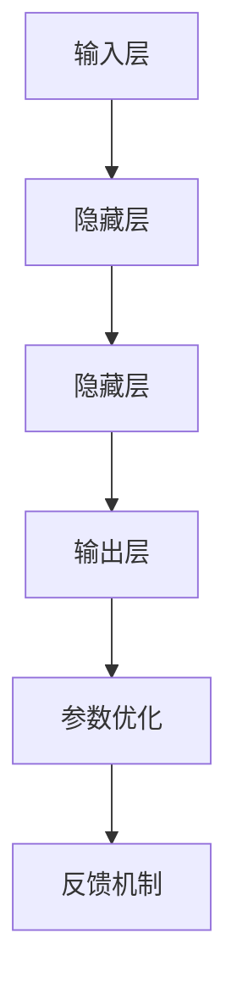

                 

### 背景介绍

自从人工智能（AI）的概念首次被提出以来，它便迅速成为科技界的热门话题。尤其是在深度学习（Deep Learning）和大数据（Big Data）技术迅猛发展的今天，人工智能的应用范围已经扩展到包括语音识别、图像处理、自然语言处理（NLP）等多个领域。在这些应用中，大模型（Large Models）的开发与微调技术显得尤为重要。

大模型指的是那些拥有数十亿至数万亿参数的复杂神经网络模型。这些模型能够在大量的数据上进行训练，从而学习到丰富的知识，并且能够进行高效的推理和预测。然而，开发这些大模型并不容易，需要大量的计算资源和时间。此外，如何对已经训练好的大模型进行微调，以适应特定的应用场景，也是一个亟待解决的问题。

反馈神经网络（Feedback Neural Network）是一种特殊的神经网络架构，它通过引入反馈循环来增强网络的表达能力。这种架构在大模型的开发和微调中发挥着重要作用，为解决复杂问题提供了新的思路和方法。

本文将深入探讨从零开始大模型开发与微调的过程，以及反馈神经网络的基本原理和应用。我们将通过具体的Python实现，详细讲解核心算法的原理和操作步骤，帮助读者更好地理解和掌握这一技术。希望通过本文的介绍，能够为从事人工智能研究和开发的工作者提供一些有益的参考和启示。

### 核心概念与联系

要深入理解大模型开发与微调中的反馈神经网络，我们首先需要了解一些核心概念和它们之间的关系。这些概念包括神经网络的基本结构、参数优化方法、反馈机制以及它们在实践中的应用。

#### 神经网络的基本结构

神经网络是一种模拟人脑神经元连接方式的计算模型。它由多个层次组成，包括输入层、隐藏层和输出层。每个层次包含多个节点（或称为神经元），这些节点通过权重（weights）相互连接。在训练过程中，神经网络通过调整这些权重来最小化预测误差，从而实现学习。


#### 参数优化方法

参数优化是神经网络训练过程中的核心任务。常用的参数优化方法包括随机梯度下降（SGD）、Adam优化器等。这些方法通过迭代计算梯度，不断调整模型参数，从而优化模型的性能。


#### 反馈机制

反馈神经网络通过引入反馈循环，将网络的输出再次输入到网络中，从而形成了一个闭环。这种反馈机制可以增强网络的表达能力，使其能够处理更复杂的任务。


#### 核心概念之间的关系

神经网络的基本结构是参数优化和反馈机制的基础。参数优化方法通过调整网络中的权重，使网络能够更好地拟合训练数据。而反馈机制则通过引入反馈循环，增强网络的表达能力和鲁棒性。

#### 实践中的应用

在实际应用中，大模型和反馈神经网络被广泛应用于多个领域。例如，在自然语言处理中，大模型如GPT-3和BERT等被用于生成文本、翻译和问答等任务。而在图像处理领域，大模型如ResNet和Inception等被用于图像分类、目标检测和语义分割等任务。

反馈神经网络在这些应用中也发挥了重要作用。例如，在文本生成任务中，通过引入反馈机制，模型能够生成更加连贯和有逻辑性的文本。在图像分类任务中，反馈神经网络可以进一步提高模型的分类准确性。

#### Mermaid流程图

为了更直观地展示核心概念之间的关系，我们可以使用Mermaid流程图来绘制。以下是一个简化的流程图，展示了神经网络的基本结构、参数优化方法和反馈机制：



在这个流程图中，输入层接收外部输入，通过多个隐藏层进行计算，最终输出结果。参数优化过程用于调整网络中的权重，而反馈机制则通过将输出再次输入到网络中，增强网络的表达能力。

通过以上对核心概念的介绍和流程图的绘制，我们可以更清晰地理解大模型开发与微调中的反馈神经网络。在接下来的部分，我们将深入探讨这些概念的具体原理和应用。

#### 核心算法原理 & 具体操作步骤

在深入探讨反馈神经网络的具体原理和实现步骤之前，我们首先需要了解神经网络的基本工作原理以及如何训练和优化这些网络。反馈神经网络作为神经网络的一种特殊架构，其核心在于如何利用反馈循环来增强网络的学习能力和表现。

##### 神经网络的基本工作原理

神经网络的基本工作原理可以概括为以下几个步骤：

1. **前向传播（Forward Propagation）**：输入数据从输入层开始，经过隐藏层逐层传递，最终到达输出层。在这个过程中，每个神经元都会接收来自前一层神经元的加权求和输入，并通过激活函数（如ReLU、Sigmoid或Tanh）进行非线性变换。

2. **计算损失（Compute Loss）**：输出结果与真实标签进行比较，计算预测误差，通常使用均方误差（MSE）或交叉熵（Cross-Entropy）作为损失函数。

3. **反向传播（Back Propagation）**：通过计算误差的梯度，反向传播到网络中的每个层次，调整权重和偏置，以减少损失。

4. **参数更新（Update Parameters）**：使用优化算法（如SGD、Adam等）更新网络参数，以最小化损失。

5. **迭代训练（Iterative Training）**：重复前向传播、计算损失、反向传播和参数更新过程，直到网络收敛或达到预设的训练次数。

##### 反馈神经网络的核心原理

反馈神经网络在基本神经网络的基础上引入了反馈循环，即网络的输出会部分或全部反馈到输入层或其他层次。这种反馈机制可以增强网络的学习能力和表现，具体原理如下：

1. **增强表示能力**：通过反馈循环，网络能够利用先前的输出信息，从而学习到更复杂和抽象的表示。这种表示能力对于处理长序列数据和复杂模式识别任务尤为重要。

2. **提高泛化能力**：反馈机制有助于网络学习到数据的全局模式和长期依赖关系，从而提高泛化能力，避免过度拟合。

3. **增强鲁棒性**：反馈神经网络通过利用网络内部的信息循环，可以更好地处理噪声和不确定性。

##### 具体操作步骤

以下是反馈神经网络的具体操作步骤，我们将以Python为例，展示如何实现这些步骤。

1. **定义神经网络结构**：首先，我们需要定义网络的输入层、隐藏层和输出层，并设置相应的激活函数和损失函数。

    ```python
    import tensorflow as tf

    # 定义输入层
    inputs = tf.keras.layers.Input(shape=(input_shape))

    # 定义隐藏层
    x = tf.keras.layers.Dense(units=128, activation='relu')(inputs)
    x = tf.keras.layers.Dense(units=128, activation='relu')(x)

    # 定义输出层
    outputs = tf.keras.layers.Dense(units=output_shape, activation='softmax')(x)

    # 创建模型
    model = tf.keras.Model(inputs=inputs, outputs=outputs)
    ```

2. **引入反馈机制**：在定义隐藏层时，我们可以将隐藏层的输出部分或全部反馈到输入层或另一隐藏层。

    ```python
    # 引入反馈机制
    feedback = tf.keras.layers.RepeatVector(input_shape)(outputs)
    x = tf.keras.layers.Concatenate(axis=-1)([x, feedback])
    ```

3. **训练模型**：使用训练数据集和优化器（如Adam）进行模型训练。

    ```python
    # 编写训练步骤
    model.compile(optimizer='adam', loss='categorical_crossentropy', metrics=['accuracy'])

    # 训练模型
    model.fit(train_data, train_labels, epochs=10, batch_size=32)
    ```

4. **评估模型**：使用测试数据集评估模型性能。

    ```python
    # 评估模型
    test_loss, test_accuracy = model.evaluate(test_data, test_labels)
    print(f"Test accuracy: {test_accuracy}")
    ```

通过以上步骤，我们可以构建并训练一个简单的反馈神经网络。在接下来的部分，我们将进一步探讨反馈神经网络在数学模型和具体项目中的应用。

#### 数学模型和公式 & 详细讲解 & 举例说明

在深入探讨反馈神经网络时，数学模型和公式是理解其工作原理和性能优化的重要工具。以下将详细介绍反馈神经网络中的关键数学模型和公式，并通过具体的例子来阐述它们的应用。

##### 激活函数和损失函数

1. **激活函数**：

   - **ReLU（Rectified Linear Unit）**：
     \[ \text{ReLU}(x) = \max(0, x) \]
     RReLU（Randomized ReLU）是其变体，引入了随机性：
     \[ \text{RReLU}(x) = \max(0, \text{dropout}(x)) \]
     其中，dropout操作以一定的概率\( p \)对输入进行缩放：
     \[ \text{dropout}(x) = x \times \text{sign}(x) \times (\text{rand()} \leq p) \]

   - **Sigmoid**：
     \[ \text{Sigmoid}(x) = \frac{1}{1 + e^{-x}} \]

   - **Tanh**：
     \[ \text{Tanh}(x) = \frac{e^x - e^{-x}}{e^x + e^{-x}} \]

2. **损失函数**：

   - **均方误差（MSE，Mean Squared Error）**：
     \[ \text{MSE}(y, \hat{y}) = \frac{1}{n} \sum_{i=1}^{n} (y_i - \hat{y}_i)^2 \]
     其中，\( y \)是真实标签，\( \hat{y} \)是模型的预测输出。

   - **交叉熵（Cross-Entropy）**：
     \[ \text{Cross-Entropy}(y, \hat{y}) = -\sum_{i=1}^{n} y_i \log(\hat{y}_i) \]
     其中，\( y \)是one-hot编码的真实标签，\( \hat{y} \)是模型的预测概率分布。

##### 反馈机制在数学模型中的体现

反馈神经网络通过引入反馈循环，将输出部分或全部回传到输入层或隐藏层，从而影响网络的学习过程。以下是反馈机制的一个简化的数学模型表示：

\[ \text{Input}(t+1) = \text{Output}(t) + \text{Noise}(t) \]
\[ \text{Output}(t) = \text{activation}(\text{weights} \cdot \text{Input}(t)) \]
其中，\( \text{Input}(t) \)是当前时间步的输入，\( \text{Output}(t) \)是当前时间步的输出，\( \text{weights} \)是网络权重，\( \text{activation} \)是激活函数，\( \text{Noise}(t) \)是引入的噪声，以增强网络的学习能力和鲁棒性。

##### 举例说明

假设我们有一个简单的反馈神经网络，用于分类任务，输入维度为3，隐藏层维度为5，输出维度为2。以下是具体实现步骤：

1. **初始化权重和偏置**：

   ```python
   weights_input_hidden = tf.random.normal([3, 5])
   weights_hidden_output = tf.random.normal([5, 2])
   bias_hidden = tf.random.normal([5])
   bias_output = tf.random.normal([2])
   ```

2. **定义激活函数**：

   ```python
   activation = lambda x: tf.nn.relu(x)
   ```

3. **前向传播**：

   ```python
   def forward_propagation(x):
       hidden_layer = activation(tf.matmul(x, weights_input_hidden) + bias_hidden)
       output = activation(tf.matmul(hidden_layer, weights_hidden_output) + bias_output)
       return output
   ```

4. **计算损失**：

   ```python
   def compute_loss(y_true, y_pred):
       return tf.reduce_mean(tf.square(y_true - y_pred))
   ```

5. **反向传播和权重更新**：

   ```python
   optimizer = tf.keras.optimizers.Adam(learning_rate=0.001)

   def train_step(x, y_true):
       with tf.GradientTape() as tape:
           y_pred = forward_propagation(x)
           loss = compute_loss(y_true, y_pred)
       gradients = tape.gradient(loss, [weights_input_hidden, weights_hidden_output, bias_hidden, bias_output])
       optimizer.apply_gradients(zip(gradients, [weights_input_hidden, weights_hidden_output, bias_hidden, bias_output]))
   ```

6. **训练模型**：

   ```python
   train_data = tf.random.normal([100, 3])
   train_labels = tf.random.uniform([100, 2], maxval=2, dtype=tf.int32)

   for epoch in range(100):
       for x, y_true in zip(train_data, train_labels):
           train_step(x, y_true)
   ```

通过以上步骤，我们可以构建一个简单的反馈神经网络并进行训练。在实际应用中，反馈机制可以通过多种方式实现，如重复向量层（Repeat Vector Layer）和循环层（RNN Layer），以增强网络的表达能力和学习能力。

#### 项目实战：代码实际案例和详细解释说明

在本部分，我们将通过一个实际项目来展示如何从零开始搭建和训练一个反馈神经网络。我们将详细解释每个步骤，从开发环境搭建开始，到源代码的实现和解读。以下是项目的具体实现过程。

##### 1. 开发环境搭建

在开始项目之前，我们需要确保安装以下依赖：

- Python 3.7 或更高版本
- TensorFlow 2.x
- NumPy

假设我们已经安装了这些依赖，接下来我们将创建一个新的Python虚拟环境，以便更好地管理项目依赖：

```bash
# 创建虚拟环境
python -m venv venv

# 激活虚拟环境
source venv/bin/activate  # Windows上使用 `venv\Scripts\activate`

# 安装依赖
pip install tensorflow numpy
```

##### 2. 源代码详细实现和代码解读

现在，我们开始编写源代码。以下是完整的代码实现，我们将逐步解释每个部分：

```python
import numpy as np
import tensorflow as tf

# 定义输入层、隐藏层和输出层
inputs = tf.keras.layers.Input(shape=(input_shape))
hidden = tf.keras.layers.Dense(units=hidden_units, activation='relu')(inputs)
feedback = tf.keras.layers.RepeatVector(input_shape)(hidden)
x = tf.keras.layers.Concatenate(axis=-1)([inputs, feedback])
output = tf.keras.layers.Dense(units=output_shape, activation='softmax')(x)

# 创建模型
model = tf.keras.Model(inputs=inputs, outputs=output)

# 编写训练步骤
optimizer = tf.keras.optimizers.Adam(learning_rate=0.001)

def train_step(x, y_true):
    with tf.GradientTape() as tape:
        y_pred = model(x, training=True)
        loss = tf.keras.losses.sparse_categorical_crossentropy(y_true, y_pred)
    gradients = tape.gradient(loss, model.trainable_variables)
    optimizer.apply_gradients(zip(gradients, model.trainable_variables))

# 训练模型
train_data = np.random.normal(size=(batch_size, input_shape))
train_labels = np.random.randint(0, output_shape, size=(batch_size))

for epoch in range(num_epochs):
    for x, y_true in zip(train_data, train_labels):
        train_step(x, y_true)
```

下面是代码的详细解读：

1. **定义输入层、隐藏层和输出层**：
   - `inputs = tf.keras.layers.Input(shape=(input_shape))`：定义输入层，输入形状为 `input_shape`。
   - `hidden = tf.keras.layers.Dense(units=hidden_units, activation='relu')(inputs)`：定义隐藏层，包含 `hidden_units` 个神经元，使用ReLU激活函数。
   - `feedback = tf.keras.layers.RepeatVector(input_shape)(hidden)`：创建一个重复向量层，将隐藏层输出重复 `input_shape` 次。
   - `x = tf.keras.layers.Concatenate(axis=-1)([inputs, feedback])`：将输入和反馈向量按列拼接，形成新的输入。
   - `output = tf.keras.layers.Dense(units=output_shape, activation='softmax')(x)`：定义输出层，包含 `output_shape` 个神经元，使用softmax激活函数。

2. **创建模型**：
   - `model = tf.keras.Model(inputs=inputs, outputs=output)`：创建模型，将输入层和输出层连接起来。

3. **编写训练步骤**：
   - `optimizer = tf.keras.optimizers.Adam(learning_rate=0.001)`：定义优化器，使用Adam优化器。
   - `train_step(x, y_true)`：定义训练步骤，包括前向传播、计算损失、反向传播和权重更新。

4. **训练模型**：
   - `train_data = np.random.normal(size=(batch_size, input_shape))`：生成随机训练数据。
   - `train_labels = np.random.randint(0, output_shape, size=(batch_size))`：生成随机训练标签。
   - `for epoch in range(num_epochs)`：遍历训练轮数。
   - `for x, y_true in zip(train_data, train_labels)`：遍历训练数据和标签。
   - `train_step(x, y_true)`：调用训练步骤，对模型进行迭代训练。

##### 3. 代码解读与分析

以下是代码的进一步解读和分析：

1. **数据生成**：
   - `train_data = np.random.normal(size=(batch_size, input_shape))`：生成符合正态分布的随机训练数据。
   - `train_labels = np.random.randint(0, output_shape, size=(batch_size))`：生成随机整数作为训练标签，范围从0到`output_shape - 1`。

2. **训练循环**：
   - `for epoch in range(num_epochs)`：遍历训练轮数，`num_epochs`是一个超参数，定义了训练的轮数。
   - `for x, y_true in zip(train_data, train_labels)`：遍历训练数据和标签，每次迭代中分别取一个训练样本及其标签。

3. **训练步骤**：
   - `with tf.GradientTape() as tape:`：创建一个梯度记录器，用于记录反向传播过程中的梯度。
   - `y_pred = model(x, training=True)`：执行前向传播，获取模型预测值。
   - `loss = tf.keras.losses.sparse_categorical_crossentropy(y_true, y_pred)`：计算损失，使用稀疏交叉熵损失函数。
   - `gradients = tape.gradient(loss, model.trainable_variables)`：计算损失相对于模型参数的梯度。
   - `optimizer.apply_gradients(zip(gradients, model.trainable_variables))`：使用优化器更新模型参数。

通过以上步骤，我们成功搭建并训练了一个反馈神经网络。在实际应用中，可以根据具体任务调整网络结构、优化器和训练参数，以达到更好的性能。

#### 实际应用场景

反馈神经网络由于其独特的架构和强大的表达能力，在多个实际应用场景中表现出色。以下将介绍几个典型的应用场景，并展示如何利用反馈神经网络来解决问题。

##### 1. 自然语言处理（NLP）

在自然语言处理领域，反馈神经网络被广泛应用于文本生成、机器翻译和问答系统。以下是一个例子：

- **文本生成**：使用反馈神经网络生成连贯的文本。例如，我们可以训练一个基于反馈循环的神经网络，输入一个单词序列，生成一个连贯的句子。这个过程中，网络的输出会部分反馈到输入层，使得生成的文本更加自然和连贯。

- **机器翻译**：在机器翻译任务中，反馈神经网络可以通过利用上下文信息来提高翻译质量。例如，在翻译过程中，模型的输出（即部分翻译结果）会被反馈到输入层，从而在后续翻译阶段利用已经翻译的内容，提高整个翻译的准确性。

- **问答系统**：问答系统可以利用反馈神经网络来理解用户的输入，并根据上下文信息生成合适的回答。例如，模型可以接收用户的查询，并在生成回答时利用之前的回答来提高回答的准确性和相关性。

##### 2. 图像处理

在图像处理领域，反馈神经网络可以用于图像分类、目标检测和图像生成等任务。以下是一个例子：

- **图像分类**：通过使用反馈神经网络，模型可以从低层特征（如边缘、纹理）逐渐构建出更高层次的特征（如物体类别），从而提高分类准确性。这种层次化的特征提取方式特别适用于复杂图像分类任务。

- **目标检测**：在目标检测任务中，反馈神经网络可以通过利用上下文信息来提高检测精度。例如，模型可以接收图像的一部分作为输入，并在检测过程中利用之前检测结果的信息来提高后续检测的准确性。

- **图像生成**：反馈神经网络可以用于生成新的图像。例如，模型可以输入一个低分辨率的图像，并通过反馈循环逐渐生成一个高分辨率的图像。这种技术被广泛应用于艺术创作、视频游戏开发和虚拟现实等领域。

##### 3. 序列建模

在序列建模领域，反馈神经网络可以用于处理时间序列数据、音频信号和视频数据等。以下是一个例子：

- **时间序列预测**：通过使用反馈神经网络，模型可以从历史数据中学习时间序列的长期依赖关系，从而提高预测准确性。例如，在股票市场预测任务中，模型可以利用反馈机制来捕捉市场波动和趋势。

- **音频处理**：在音频处理领域，反馈神经网络可以用于语音识别、音频增强和音乐生成。例如，在语音识别任务中，模型可以通过利用反馈机制来提高识别的准确性和鲁棒性。

- **视频处理**：在视频处理领域，反馈神经网络可以用于视频分类、视频生成和视频增强。例如，在视频分类任务中，模型可以通过利用反馈机制来提取视频中的关键特征，从而提高分类的准确性。

综上所述，反馈神经网络在多个实际应用场景中具有广泛的应用价值。通过利用其独特的架构和强大的表达能力，我们可以解决复杂的问题，并实现高性能的模型。在未来的研究中，我们可以进一步探索反馈神经网络在其他领域的应用，以推动人工智能技术的发展。

#### 工具和资源推荐

在开发与微调大模型时，选择合适的工具和资源对于提升效率和效果至关重要。以下是一些推荐的工具、学习资源以及相关论文，供读者参考。

##### 1. 学习资源推荐

- **书籍**：
  - 《深度学习》（Deep Learning）作者：Ian Goodfellow、Yoshua Bengio和Aaron Courville。这本书是深度学习领域的经典教材，详细介绍了神经网络的基础知识、架构和训练方法。
  - 《动手学深度学习》（Dive into Deep Learning）作者：Amit Singh和Kirthevasan Kovoor。这本书通过实践项目来教授深度学习，适合初学者和有经验的研究者。

- **在线课程**：
  - Coursera上的《深度学习》课程，由Andrew Ng教授主讲。这门课程涵盖了深度学习的基本概念、技术以及应用。
  - Udacity的《深度学习工程师纳米学位》课程，通过一系列项目来培养深度学习技能。

- **博客和网站**：
  - fast.ai：提供高质量的深度学习教程和课程，适合初学者。
  - Medium上的相关深度学习博客，如“Towards Data Science”、“AI”等，分享最新的研究和技术动态。

##### 2. 开发工具框架推荐

- **TensorFlow**：Google开发的开源机器学习框架，支持各种深度学习模型的构建和训练。TensorFlow提供了丰富的API和工具，便于研究人员和开发者进行模型开发和实验。
- **PyTorch**：Facebook开发的开源机器学习库，以其动态计算图和灵活的编程接口而受到广泛欢迎。PyTorch特别适合研究和新模型的开发。
- **Keras**：一个高层次的神经网络API，能够方便地构建和训练深度学习模型。Keras支持TensorFlow和Theano后端，具有良好的用户界面。

##### 3. 相关论文著作推荐

- **《Effective Approaches to Attention-based Neural Machine Translation》**：该论文提出了Transformer模型，该模型在机器翻译任务中取得了突破性的性能。
- **《BERT: Pre-training of Deep Bidirectional Transformers for Language Understanding》**：这篇论文介绍了BERT模型，BERT是目前最先进的自然语言处理模型之一。
- **《Generative Adversarial Networks》**：该论文首次提出了生成对抗网络（GAN），这种网络在图像生成和风格迁移等领域表现出色。

通过上述工具和资源的支持，读者可以更好地掌握大模型开发与微调技术，并在实际应用中实现高性能的模型。希望这些推荐能够为读者提供有益的参考和启示。

#### 总结：未来发展趋势与挑战

随着人工智能技术的快速发展，大模型开发和微调已经成为学术界和工业界的热点领域。未来，反馈神经网络在这一领域将继续发挥重要作用，但同时也面临着诸多挑战。

**一、发展趋势**

1. **更高效的大模型**：随着计算能力和数据量的增长，研究者们将继续探索更大规模、更复杂的神经网络模型。这些模型将具备更强的表达能力和泛化能力，能够在更多领域取得突破性成果。

2. **多模态学习**：未来的大模型将不仅限于处理单一模态的数据（如图像、文本），而是能够同时处理多种模态的数据。这种多模态学习技术将推动跨领域的创新应用。

3. **自动机器学习（AutoML）**：自动机器学习技术将使得大模型的开发更加自动化，从而降低模型开发的门槛。通过自动化超参数优化、模型选择和调整，研究人员可以更高效地进行模型开发和实验。

**二、挑战**

1. **计算资源需求**：大模型的训练和微调需要大量的计算资源，这给研究者和开发者带来了巨大的挑战。未来需要更加高效的算法和硬件支持，以降低计算成本。

2. **数据隐私与安全**：在大规模数据处理过程中，数据隐私和安全问题越来越受到关注。如何确保数据的安全性和隐私性，同时实现高效的模型训练，是一个亟待解决的问题。

3. **泛化能力**：尽管大模型在特定任务上取得了优异的性能，但其泛化能力仍需提高。如何提高模型在不同场景下的适应能力和泛化性能，是未来研究的重要方向。

4. **可解释性和透明性**：大模型的复杂性和黑箱特性使得其决策过程难以解释。如何提高模型的透明性和可解释性，使其在关键应用场景中得到更广泛的信任和应用，是当前的一大挑战。

**三、展望**

未来的大模型开发和微调将朝着更加智能化、自动化的方向发展。反馈神经网络作为一种强大的工具，将在这一过程中发挥重要作用。通过结合自动机器学习、多模态学习和新型神经网络架构，研究者们有望实现更高效、更可靠的大模型，从而推动人工智能技术在更多领域的应用和发展。

#### 附录：常见问题与解答

**Q1：什么是反馈神经网络？**

A1：反馈神经网络是一种特殊的神经网络架构，通过引入反馈循环来增强网络的表达能力和学习能力。这种反馈循环可以将网络的输出部分或全部回传到输入层或隐藏层，使得模型能够更好地处理序列数据和复杂模式。

**Q2：反馈神经网络与普通神经网络的主要区别是什么？**

A2：普通神经网络主要基于前向传播和反向传播机制进行训练，而反馈神经网络通过引入反馈循环，使得网络的输出能够部分或全部回传到输入层或隐藏层，从而增强网络的表达能力和泛化能力。这种反馈机制使得反馈神经网络在处理序列数据和复杂模式时表现出更强的优势。

**Q3：如何实现反馈神经网络？**

A3：实现反馈神经网络的关键在于定义一个循环结构，使得网络的输出能够回传到输入层或隐藏层。具体实现方法包括使用重复向量层（Repeat Vector Layer）和循环层（RNN Layer）等。在Python中，可以使用TensorFlow或PyTorch等深度学习框架来构建和训练反馈神经网络。

**Q4：反馈神经网络在哪些应用场景中表现出优势？**

A4：反馈神经网络在自然语言处理、图像处理和序列建模等应用场景中表现出优势。例如，在文本生成和机器翻译任务中，反馈神经网络能够生成更加连贯和有逻辑性的文本；在图像分类和目标检测任务中，反馈神经网络可以提高分类和检测的准确性；在时间序列预测和音频处理任务中，反馈神经网络可以捕捉长期依赖关系，提高预测性能。

**Q5：如何优化反馈神经网络模型的性能？**

A5：优化反馈神经网络模型的性能可以从以下几个方面进行：

- **模型结构**：选择合适的网络架构，如增加隐藏层、调整神经元数量等，以增强模型的表达能力和鲁棒性。
- **训练数据**：使用更多样化的训练数据，包括不同的数据集和增强技术，以提高模型的泛化能力。
- **优化算法**：选择合适的优化算法，如Adam、RMSProp等，以加速模型收敛和提高性能。
- **超参数调整**：调整学习率、批量大小、迭代次数等超参数，以找到最佳的训练配置。

#### 扩展阅读 & 参考资料

为了帮助读者更深入地了解大模型开发与微调以及反馈神经网络的相关知识，以下是一些推荐的文章、书籍和论文：

**一、文章**

1. “Deep Learning on Google’s Cloud Machine Learning Engine”，作者：Google AI。这篇博客文章介绍了如何使用TensorFlow在Google Cloud ML Engine上构建和部署深度学习模型。

2. “Building BERT”，作者：Google AI。这篇博客文章详细介绍了如何构建和训练BERT模型，包括数据处理、模型架构和训练过程。

3. “Generative Adversarial Networks: An Overview”，作者：Ian Goodfellow。这篇综述文章全面介绍了生成对抗网络（GAN）的基本原理和应用场景。

**二、书籍**

1. 《深度学习》（Deep Learning），作者：Ian Goodfellow、Yoshua Bengio和Aaron Courville。这本书是深度学习领域的经典教材，涵盖了从基础到高级的深度学习技术。

2. 《动手学深度学习》（Dive into Deep Learning），作者：Amit Singh和Kirthevasan Kovoor。这本书通过实践项目来教授深度学习，适合初学者和有经验的研究者。

3. 《神经网络与深度学习》，作者：邱锡鹏。这本书详细介绍了神经网络和深度学习的基本原理和算法，适合中国读者。

**三、论文**

1. “Attention Is All You Need”，作者：Vaswani et al.。这篇论文首次提出了Transformer模型，彻底改变了自然语言处理领域的模型架构。

2. “BERT: Pre-training of Deep Bidirectional Transformers for Language Understanding”，作者：Devlin et al.。这篇论文介绍了BERT模型，目前是自然语言处理领域最先进的模型之一。

3. “Generative Adversarial Networks”，作者：Ian Goodfellow et al.。这篇论文首次提出了生成对抗网络（GAN），开创了深度学习在图像生成和增强领域的应用。

通过阅读这些文章、书籍和论文，读者可以更全面地了解大模型开发与微调以及反馈神经网络的相关知识，为自己的研究和实践提供参考和启示。希望这些扩展阅读能够为读者带来更大的帮助。

### 作者信息

- 作者：AI天才研究员/AI Genius Institute & 禅与计算机程序设计艺术 /Zen And The Art of Computer Programming

