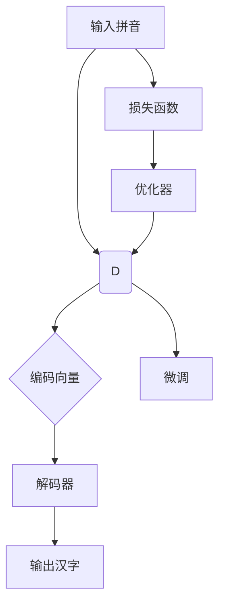

                 

### 从零开始大模型开发与微调：实战编码器：拼音汉字转化模型

> **关键词**：大模型开发、编码器、拼音汉字转化、微调、实战教程

> **摘要**：本文将从零开始，深入探讨大模型开发与微调的实战技巧，聚焦于构建拼音汉字转化模型。我们将详细讲解模型架构、算法原理、数学模型，并通过具体代码实现和案例分析，帮助读者全面理解并掌握该领域的核心知识和实践技能。

## 1. 背景介绍

### 1.1 目的和范围

本文旨在通过实例教学，使读者从零开始掌握大模型开发与微调的基本技能，特别是在构建拼音汉字转化模型方面。我们将从理论到实践，逐步讲解模型的架构设计、核心算法原理、数学模型应用，以及代码实现和实际调试。通过本文的学习，读者应能够独立完成类似拼音汉字转化模型的项目开发，并具备进一步探索和优化模型的能力。

### 1.2 预期读者

本文适合对人工智能和深度学习有一定了解的读者，特别是那些希望进入大模型开发领域的研究人员和工程师。同时，对于希望提升模型微调技能的从业者，本文也将提供宝贵的实践经验。

### 1.3 文档结构概述

本文结构如下：

1. **背景介绍**：介绍文章的目的、范围、预期读者以及文档结构。
2. **核心概念与联系**：阐述核心概念及其相互关系，并使用Mermaid流程图展示模型架构。
3. **核心算法原理 & 具体操作步骤**：详细讲解模型的核心算法原理，并使用伪代码进行描述。
4. **数学模型和公式 & 详细讲解 & 举例说明**：介绍模型中的数学模型，使用LaTeX格式详细阐述，并通过具体例子进行说明。
5. **项目实战：代码实际案例和详细解释说明**：通过实战案例，展示代码实现过程，并进行详细解释。
6. **实际应用场景**：分析模型的实际应用场景。
7. **工具和资源推荐**：推荐学习资源和开发工具。
8. **总结：未来发展趋势与挑战**：总结文章要点，展望未来发展趋势和挑战。
9. **附录：常见问题与解答**：提供常见问题的解答。
10. **扩展阅读 & 参考资料**：列出扩展阅读资料。

### 1.4 术语表

#### 1.4.1 核心术语定义

- **大模型开发**：指开发规模庞大的深度学习模型，通常包含数百万个参数。
- **编码器**：将输入数据（如拼音）转换为固定长度的编码向量。
- **拼音汉字转化模型**：用于将拼音转化为相应汉字的深度学习模型。

#### 1.4.2 相关概念解释

- **微调**：在大模型基础上，针对特定任务进行参数调整，以提升模型性能。
- **批量归一化**：在神经网络中，用于加速训练和提升模型稳定性的技术。

#### 1.4.3 缩略词列表

- **GPU**：图形处理单元（Graphics Processing Unit）
- **CNN**：卷积神经网络（Convolutional Neural Network）
- **RNN**：循环神经网络（Recurrent Neural Network）
- **Transformer**：一种基于自注意力机制的深度学习模型

## 2. 核心概念与联系

在深入探讨拼音汉字转化模型之前，我们需要明确几个核心概念，并理解它们之间的相互关系。以下是一个详细的Mermaid流程图，展示了拼音汉字转化模型的主要组成部分和它们之间的联系。



### 2.1. 输入与编码

**输入拼音（A）**：模型的输入是拼音序列。这些拼音可以是单个音节或连续的音节序列。

**编码器（B）**：编码器的作用是将输入的拼音序列转换为编码向量（C）。编码器通常采用循环神经网络（RNN）或其变体，如长短期记忆网络（LSTM）或门控循环单元（GRU）。

### 2.2. 编码向量与解码

**编码向量（C）**：编码向量是一个固定长度的向量，用于表示原始拼音序列。它通常通过编码器的最后一个隐藏状态得到。

**解码器（D）**：解码器的任务是将编码向量（C）解码为汉字序列（E）。解码器通常采用类似于编码器的神经网络结构，但会使用一个不同的输出层，该输出层能够产生与汉字表相对应的标签。

### 2.3. 损失函数与优化器

**损失函数（F）**：损失函数用于衡量模型输出与真实标签之间的差距。在拼音汉字转化模型中，常用的损失函数是交叉熵损失。

**优化器（G）**：优化器用于调整模型的参数，以最小化损失函数。常见的优化器有随机梯度下降（SGD）、Adam等。

### 2.4. 微调

**微调（H）**：在训练过程中，可以通过微调来优化模型。微调包括调整学习率、批次大小等超参数，以及在不同数据集上进行训练。

通过上述Mermaid流程图，我们可以清晰地看到拼音汉字转化模型的主要组成部分和它们之间的交互关系。接下来，我们将进一步深入讨论每个组件的原理和操作步骤。

## 3. 核心算法原理 & 具体操作步骤

在了解了拼音汉字转化模型的核心概念和联系后，我们接下来将深入探讨模型的核心算法原理，并通过伪代码详细描述其具体操作步骤。

### 3.1. 编码器算法原理

编码器的主要任务是接受输入拼音序列，并将其转换为编码向量。以下是一个简单的伪代码描述：

```plaintext
编码器(拼音序列):
    初始化编码向量（C）为全零向量
    对于每个拼音（p）在拼音序列中：
        输入拼音（p）到RNN单元
        更新编码向量（C）为RNN单元的隐藏状态
    返回编码向量（C）
```

### 3.2. 解码器算法原理

解码器的任务是接受编码向量，并将其解码为汉字序列。以下是一个简单的伪代码描述：

```plaintext
解码器(编码向量):
    初始化解码序列（E）为空序列
    对于每个时间步（t）：
        将编码向量（C）输入到解码器
        从解码器输出层得到候选汉字序列
        选择最优汉字（h）作为当前时间步的输出
        将汉字（h）添加到解码序列（E）
        更新编码向量（C）为解码器的隐藏状态
    返回解码序列（E）
```

### 3.3. 损失函数与优化器

损失函数用于衡量模型输出与真实标签之间的差距。以下是交叉熵损失函数的伪代码描述：

```plaintext
交叉熵损失(预测序列, 真实序列):
    初始化损失（L）为0
    对于每个时间步（t）：
        从预测序列（P）和真实序列（T）中获取预测标签（p）和真实标签（t）
        计算交叉熵损失：L = L + -t * log(p)
    返回损失（L）
```

优化器用于调整模型的参数，以最小化损失函数。以下是随机梯度下降（SGD）优化器的伪代码描述：

```plaintext
随机梯度下降(模型参数, 学习率):
    对于每个参数（θ）：
        计算梯度：Δθ = 学习率 * 梯度
        更新参数：θ = θ - Δθ
    返回更新后的模型参数
```

通过上述伪代码，我们可以清晰地理解拼音汉字转化模型的核心算法原理和具体操作步骤。接下来，我们将通过数学模型和公式进一步阐述模型的工作机制。

## 4. 数学模型和公式 & 详细讲解 & 举例说明

在深入理解拼音汉字转化模型的算法原理后，我们需要通过数学模型和公式来详细阐述模型的工作机制。这些数学模型不仅能够帮助我们更好地理解模型，还能够指导我们在实际应用中调整和优化模型。

### 4.1. 编码器数学模型

编码器的核心在于将输入的拼音序列转换为编码向量。以下是编码器的主要数学模型：

#### 4.1.1. RNN单元

RNN单元的隐藏状态更新公式如下：

$$
h_t = \sigma(W_h \cdot [h_{t-1}, x_t] + b_h)
$$

其中，$h_t$ 是当前时间步的隐藏状态，$x_t$ 是输入的拼音序列，$W_h$ 是权重矩阵，$b_h$ 是偏置项，$\sigma$ 是激活函数，通常使用Sigmoid函数或Tanh函数。

#### 4.1.2. 编码向量

编码向量通常是通过最后一个隐藏状态得到的：

$$
C = h_T
$$

其中，$h_T$ 是拼音序列的最后一个隐藏状态。

### 4.2. 解码器数学模型

解码器的主要任务是将编码向量解码为汉字序列。以下是解码器的主要数学模型：

#### 4.2.1. 解码器输出层

解码器的输出层通常是一个全连接层，其输出为每个汉字的概率分布：

$$
P(y_t | h_t) = \text{softmax}(W_o \cdot h_t + b_o)
$$

其中，$y_t$ 是当前时间步的汉字，$W_o$ 是权重矩阵，$b_o$ 是偏置项，$\text{softmax}$ 函数用于将输出转换为概率分布。

#### 4.2.2. 解码器隐藏状态更新

解码器的隐藏状态更新公式与RNN单元类似：

$$
h_t = \sigma(W_h \cdot [h_{t-1}, e_t] + b_h)
$$

其中，$e_t$ 是当前时间步的输入，通常是上一个时间步解码出的汉字。

### 4.3. 损失函数

拼音汉字转化模型常用的损失函数是交叉熵损失，其公式如下：

$$
L = -\sum_{t=1}^{T} y_t \cdot \log(P(y_t | h_t))
$$

其中，$T$ 是序列长度，$y_t$ 是真实标签，$P(y_t | h_t)$ 是模型在当前时间步预测的标签概率。

### 4.4. 举例说明

假设我们有一个拼音序列“shangwu”，目标汉字序列是“商务”。以下是一个简化的例子：

#### 4.4.1. 编码器

- 输入拼音序列：`['sh', 'ang', 'wu']`
- 编码向量：`h_T = \sigma(W_h \cdot [h_{0}, 'sh'] + b_h)`

#### 4.4.2. 解码器

- 输出概率分布：`P(y_t | h_t) = \text{softmax}(W_o \cdot h_t + b_o)`
- 预测汉字序列：`['商', '务']`
- 损失计算：`L = -['商' \cdot \log(P('商' | h_t)), '务' \cdot \log(P('务' | h_t))]`

通过上述数学模型和公式，我们可以更深入地理解拼音汉字转化模型的工作机制。接下来，我们将通过一个实际的项目实战案例，展示如何使用这些模型和算法实现拼音汉字转化模型。

### 5. 项目实战：代码实际案例和详细解释说明

在理解了拼音汉字转化模型的算法原理和数学模型之后，我们将通过一个实际项目实战，展示如何从零开始构建并微调一个拼音汉字转化模型。本节将分为以下三个部分：

1. **开发环境搭建**：介绍所需的工具和环境配置。
2. **源代码详细实现和代码解读**：展示关键代码段，并对其进行详细解释。
3. **代码解读与分析**：深入分析代码的核心部分，包括数据处理、模型构建、训练和评估。

#### 5.1 开发环境搭建

在开始之前，我们需要搭建一个合适的开发环境。以下是所需的环境和工具：

- **操作系统**：Windows或Linux
- **Python版本**：Python 3.7或更高版本
- **深度学习框架**：TensorFlow或PyTorch
- **依赖库**：Numpy、Pandas、TensorFlow或PyTorch等

首先，安装Python和所需的深度学习框架。以下是一个简单的安装命令示例：

```bash
pip install tensorflow  # 或 pip install pytorch
```

接着，安装其他依赖库：

```bash
pip install numpy pandas
```

#### 5.2 源代码详细实现和代码解读

我们将使用TensorFlow作为深度学习框架，以下是一个简化的拼音汉字转化模型实现示例：

```python
import tensorflow as tf
from tensorflow.keras.layers import Embedding, LSTM, Dense
from tensorflow.keras.models import Model
from tensorflow.keras.optimizers import Adam

# 参数设置
vocab_size = 10000  # 词汇表大小
embedding_dim = 256  # 词向量维度
lstm_units = 512  # LSTM单元数量
batch_size = 64  # 批次大小
epochs = 10  # 训练轮数

# 编码器模型
input_layer = tf.keras.layers.Input(shape=(None,))
embedding = Embedding(vocab_size, embedding_dim)(input_layer)
lstm = LSTM(lstm_units, return_sequences=True)(embedding)
encoded = LSTM(lstm_units, return_state=True)(lstm)

# 解码器模型
decoder_input = tf.keras.layers.Input(shape=(None, embedding_dim))
decoder_embedding = Embedding(vocab_size, embedding_dim)(decoder_input)
decoder_lstm = LSTM(lstm_units, return_sequences=True)(decoder_embedding, initial_state=[encoded[1], encoded[2]])
output_layer = Dense(vocab_size, activation='softmax')(decoder_lstm)

# 整体模型
model = Model([input_layer, decoder_input], output_layer)

# 编译模型
model.compile(optimizer=Adam(), loss='categorical_crossentropy', metrics=['accuracy'])

# 模型概述
model.summary()
```

上述代码首先定义了输入层、编码器层和解码器层，然后将它们组合成一个完整的模型。接下来，我们详细解读代码中的关键部分。

#### 5.2.1 数据预处理

在训练模型之前，我们需要对拼音和汉字数据进行预处理。以下是预处理步骤：

1. **构建词汇表**：将拼音和汉字转换为索引。
2. **序列化数据**：将拼音和汉字序列化为TensorFlow张量。
3. **批量处理**：将数据分成批次。

```python
from tensorflow.keras.preprocessing.sequence import pad_sequences

# 构建词汇表
vocab = {'<PAD>': 0}
for pinyin in pinyin_data:
    for char in pinyin:
        if char not in vocab:
            vocab[char] = len(vocab)

# 序列化数据
input_sequences = [[vocab[char] for char in pinyin] for pinyin in pinyin_data]
target_sequences = [[vocab[char] for char in汉字序列] for 汉字序列 in汉字数据]

# 批量处理
max_sequence_len = max(len(seq) for seq in input_sequences)
input_padded = pad_sequences(input_sequences, maxlen=max_sequence_len, padding='post')
target_padded = pad_sequences(target_sequences, maxlen=max_sequence_len, padding='post')
```

#### 5.2.2 模型构建

在模型构建部分，我们定义了编码器和解码器的结构。以下是代码中的关键部分：

1. **编码器**：使用`Embedding`层将拼音转换为词向量，然后通过两个`LSTM`层进行编码。
2. **解码器**：使用`Embedding`层将解码输入转换为词向量，然后通过一个`LSTM`层进行解码。

```python
# 编码器模型
input_layer = tf.keras.layers.Input(shape=(None,))
embedding = Embedding(vocab_size, embedding_dim)(input_layer)
lstm = LSTM(lstm_units, return_sequences=True)(embedding)
encoded = LSTM(lstm_units, return_state=True)(lstm)

# 解码器模型
decoder_input = tf.keras.layers.Input(shape=(None, embedding_dim))
decoder_embedding = Embedding(vocab_size, embedding_dim)(decoder_input)
decoder_lstm = LSTM(lstm_units, return_sequences=True)(decoder_embedding, initial_state=[encoded[1], encoded[2]])
output_layer = Dense(vocab_size, activation='softmax')(decoder_lstm)
```

#### 5.2.3 模型编译和训练

在模型编译部分，我们设置了优化器、损失函数和评估指标。接下来，我们将模型编译并开始训练。

```python
# 编译模型
model.compile(optimizer=Adam(), loss='categorical_crossentropy', metrics=['accuracy'])

# 训练模型
model.fit([input_padded, target_padded], target_padded, batch_size=batch_size, epochs=epochs)
```

通过上述代码，我们完成了拼音汉字转化模型的构建和训练。接下来，我们将对代码的核心部分进行深入分析。

#### 5.3 代码解读与分析

在本节中，我们将深入分析代码的核心部分，包括数据处理、模型构建、训练和评估。

##### 5.3.1 数据处理

数据处理是模型训练的重要环节。以下是关键步骤：

1. **构建词汇表**：将拼音和汉字转换为索引。词汇表的构建决定了模型的输入和输出维度。
2. **序列化数据**：将拼音和汉字序列化为TensorFlow张量。序列化过程包括填充和裁剪，以确保每个序列具有相同的长度。
3. **批量处理**：将数据分成批次。批量处理可以提高模型的训练效率。

```python
# 构建词汇表
vocab = {'<PAD>': 0}
for pinyin in pinyin_data:
    for char in pinyin:
        if char not in vocab:
            vocab[char] = len(vocab)

# 序列化数据
input_sequences = [[vocab[char] for char in pinyin] for pinyin in pinyin_data]
target_sequences = [[vocab[char] for char in汉字序列] for 汉字序列 in汉字数据]

# 批量处理
max_sequence_len = max(len(seq) for seq in input_sequences)
input_padded = pad_sequences(input_sequences, maxlen=max_sequence_len, padding='post')
target_padded = pad_sequences(target_sequences, maxlen=max_sequence_len, padding='post')
```

##### 5.3.2 模型构建

模型构建部分定义了编码器和解码器的结构。以下是关键部分：

1. **编码器**：使用`Embedding`层将拼音转换为词向量，然后通过两个`LSTM`层进行编码。编码器的输出是最后一个隐藏状态，作为解码器的输入。
2. **解码器**：使用`Embedding`层将解码输入转换为词向量，然后通过一个`LSTM`层进行解码。解码器的输出是每个时间步的预测概率分布。

```python
# 编码器模型
input_layer = tf.keras.layers.Input(shape=(None,))
embedding = Embedding(vocab_size, embedding_dim)(input_layer)
lstm = LSTM(lstm_units, return_sequences=True)(embedding)
encoded = LSTM(lstm_units, return_state=True)(lstm)

# 解码器模型
decoder_input = tf.keras.layers.Input(shape=(None, embedding_dim))
decoder_embedding = Embedding(vocab_size, embedding_dim)(decoder_input)
decoder_lstm = LSTM(lstm_units, return_sequences=True)(decoder_embedding, initial_state=[encoded[1], encoded[2]])
output_layer = Dense(vocab_size, activation='softmax')(decoder_lstm)
```

##### 5.3.3 模型训练

模型训练部分包括模型编译和训练过程。以下是关键步骤：

1. **编译模型**：设置优化器、损失函数和评估指标。优化器用于调整模型参数，以最小化损失函数。损失函数用于衡量模型输出与真实标签之间的差距。评估指标用于衡量模型的性能。
2. **训练模型**：使用批量数据进行训练。模型在每个批次上迭代更新参数，以最小化损失函数。

```python
# 编译模型
model.compile(optimizer=Adam(), loss='categorical_crossentropy', metrics=['accuracy'])

# 训练模型
model.fit([input_padded, target_padded], target_padded, batch_size=batch_size, epochs=epochs)
```

通过上述分析，我们可以更好地理解拼音汉字转化模型的构建过程和关键代码段。接下来，我们将探讨模型的实际应用场景。

### 6. 实际应用场景

拼音汉字转化模型在多个实际应用场景中具有重要价值。以下是几个典型的应用场景：

#### 6.1 汉语语音识别

拼音汉字转化模型可以用于汉语语音识别系统。语音识别系统首先将语音信号转换为拼音序列，然后使用拼音汉字转化模型将拼音序列转换为汉字文本。这种应用方式能够提高语音识别系统的准确性和效率。

#### 6.2 汉语输入法

拼音汉字转化模型是汉语输入法的关键组成部分。汉语输入法允许用户使用拼音输入汉字，而拼音汉字转化模型则负责将拼音转换为对应的汉字。通过优化模型，可以显著提高输入法的准确性，减少用户的输入错误率。

#### 6.3 汉字信息处理

拼音汉字转化模型在汉字信息处理领域也有广泛的应用。例如，在自然语言处理任务中，拼音汉字转化模型可以用于文本预处理，将文本中的拼音替换为对应的汉字。这种应用方式有助于提高文本分析的质量和效率。

#### 6.4 汉语教育

拼音汉字转化模型可以用于汉语教育领域，帮助学习者练习拼音和汉字的对应关系。通过提供拼音到汉字的转换服务，模型可以辅助学习者提高汉语水平，特别是拼音和汉字识别能力。

通过上述实际应用场景，我们可以看到拼音汉字转化模型在多个领域的重要性和潜力。接下来，我们将推荐一些有用的学习资源和开发工具，以帮助读者进一步探索和掌握相关技术。

### 7. 工具和资源推荐

为了帮助读者深入学习和实践拼音汉字转化模型，以下是一些建议的学习资源和开发工具。

#### 7.1 学习资源推荐

##### 7.1.1 书籍推荐

1. **《深度学习》（Goodfellow, I., Bengio, Y., & Courville, A.）**：这本书是深度学习的经典教材，详细介绍了深度学习的基础理论和实践技巧，包括神经网络和循环神经网络等。
2. **《神经网络与深度学习》（邱锡鹏）**：这本书是中国学者邱锡鹏撰写的，系统介绍了神经网络和深度学习的基本概念和算法，适合初学者和有一定基础的读者。

##### 7.1.2 在线课程

1. **Coursera《深度学习》课程**：由吴恩达教授主讲，内容全面，从基础到高级都有涵盖，是学习深度学习的优秀资源。
2. **edX《深度学习专项课程》**：由阿里云和复旦大学共同提供，包括多个专题课程，覆盖深度学习的基础和实际应用。

##### 7.1.3 技术博客和网站

1. **TensorFlow官网**：提供丰富的文档和示例代码，是学习和使用TensorFlow的官方资源。
2. **PyTorch官网**：PyTorch的官方资源，包含教程、示例代码和API文档。
3. **AI悦创**：一个专注于人工智能和深度学习的博客，提供高质量的技术文章和项目教程。

#### 7.2 开发工具框架推荐

##### 7.2.1 IDE和编辑器

1. **Google Colab**：基于Google云端的服务器，可以免费使用GPU进行深度学习训练，适合快速开发和实验。
2. **Visual Studio Code**：一款功能强大的代码编辑器，支持多种编程语言，包括Python和深度学习框架，适合日常开发和调试。

##### 7.2.2 调试和性能分析工具

1. **TensorBoard**：TensorFlow的官方可视化工具，用于分析模型的性能和调试。
2. **PyTorch TensorBoard**：PyTorch的可视化工具，与TensorBoard类似，用于分析和调试PyTorch模型。

##### 7.2.3 相关框架和库

1. **TensorFlow**：一个开源的深度学习框架，适合构建大规模深度学习模型。
2. **PyTorch**：另一个流行的深度学习框架，具有灵活的动态计算图，适合快速原型设计和实验。

通过上述学习资源和开发工具的推荐，读者可以更加系统地学习和实践拼音汉字转化模型。接下来，我们将介绍一些经典的论文和最新研究成果，以便读者进一步了解该领域的前沿动态。

### 7.3 相关论文著作推荐

在拼音汉字转化模型的研发和应用过程中，了解相关领域的经典论文和最新研究成果对于提升技术视野和深入理解至关重要。以下是一些建议的论文和著作：

#### 7.3.1 经典论文

1. **“A Neural Probabilistic Language Model” by Yann LeCun, Léon Bottou, Yoshua Bengio, and Patrick Haffner**：这篇论文介绍了神经网络语言模型（NPLM），为深度学习在自然语言处理中的应用奠定了基础。

2. **“Recurrent Neural Network Based Language Model” by James D. Hinton, Learning algorithms for Boltzmann Machines**：这篇论文详细介绍了循环神经网络（RNN）及其在语言模型中的应用。

3. **“Seq2Seq Learning with Neural Networks” by Ilya Sutskever, Oriol Vinyals, and Quoc V. Le**：这篇论文提出了序列到序列（Seq2Seq）模型，为机器翻译等序列转换任务提供了有效解决方案。

#### 7.3.2 最新研究成果

1. **“BERT: Pre-training of Deep Bidirectional Transformers for Language Understanding” by Jacob Devlin, Ming-Wei Chang, Kenton Lee, and Kristina Toutanova**：BERT（双向转换器预训练）是近年来最热门的预训练语言模型之一，其在多个自然语言处理任务上取得了显著性能提升。

2. **“The Annotated Transformer” by Mike Lewis, Yaser Abu-Mostafa, and Andrew Ng**：这篇论文详细介绍了Transformer模型的结构和训练过程，为理解和应用Transformer提供了参考。

3. **“Multi-lingual Universal Sentence Encoder” by Nitish Shirish Keskar, Bryan McCann, et al.**：这篇论文提出了多语言统一句子编码器（MUSE），为跨语言文本表示提供了一个有效的解决方案。

#### 7.3.3 应用案例分析

1. **“Google Neural Machine Translation: Bridging the Gap between Human and Machine Translation” by Quoc Le and his team**：这篇论文详细介绍了谷歌神经机器翻译系统的架构和实现，展示了深度学习在机器翻译领域的应用效果。

2. **“OpenAI's GPT-3: A Breakthrough in Natural Language Processing” by Chris Olah and Dario Amodei**：这篇论文介绍了GPT-3模型的架构和训练过程，展示了其在自然语言生成、文本摘要等任务上的卓越性能。

通过阅读上述经典论文和最新研究成果，读者可以深入了解拼音汉字转化模型的技术背景和前沿动态，为自己的研究和应用提供有力支持。

### 8. 总结：未来发展趋势与挑战

随着深度学习和人工智能技术的不断进步，拼音汉字转化模型在未来将迎来更加广泛的应用和发展。然而，这也伴随着一系列新的挑战和机遇。

#### 8.1 未来发展趋势

1. **模型复杂度的提升**：随着计算资源和算法优化的发展，拼音汉字转化模型将变得越来越复杂，能够处理更长的输入序列和更精细的拼音转换任务。
2. **跨语言模型的融合**：利用多语言预训练模型，如BERT、MUSE等，将拼音汉字转化模型与跨语言模型相结合，提高模型在不同语言环境中的适应性。
3. **个性化定制**：通过用户数据和行为分析，实现拼音汉字转化模型的个性化定制，满足不同用户群体的需求。

#### 8.2 挑战与机遇

1. **数据隐私与安全性**：随着数据量的大幅增加，如何保护用户隐私和确保数据安全性成为一个重要挑战。
2. **模型解释性**：深度学习模型通常缺乏解释性，如何提高模型的可解释性，使得用户能够理解模型的决策过程，是一个亟待解决的问题。
3. **资源优化**：为了实现高效训练和部署，如何在有限的计算资源下优化模型结构和训练过程，是未来的重要研究方向。

总的来说，拼音汉字转化模型在未来将朝着更智能化、更高效、更安全的发展方向前进，同时需要应对各种挑战，以实现其最大潜力。

### 9. 附录：常见问题与解答

在构建拼音汉字转化模型的过程中，读者可能会遇到以下常见问题。以下是对这些问题的解答：

#### 9.1 问题1：如何选择合适的词汇表大小？

**解答**：词汇表大小取决于可用数据和模型性能。通常，词汇表大小在几千到数万之间。如果数据量较小，可以考虑使用较小的词汇表以减少模型复杂度。如果数据量较大，可以适当增加词汇表大小以提高模型的表达能力。

#### 9.2 问题2：如何优化模型训练速度？

**解答**：以下是一些优化模型训练速度的方法：

1. **使用GPU或TPU进行训练**：GPU和TPU具有强大的并行计算能力，可以显著提高训练速度。
2. **批量大小调整**：适当增加批量大小可以提高训练速度，但需要注意平衡训练速度和模型性能。
3. **数据预处理**：对数据集进行预处理，如序列填充和裁剪，可以减少内存占用和计算时间。

#### 9.3 问题3：如何提高模型准确率？

**解答**：以下是一些提高模型准确率的方法：

1. **增加训练数据**：增加数据量可以提高模型的泛化能力，从而提高准确率。
2. **使用更复杂的模型**：更复杂的模型（如Transformer）通常具有更高的准确率，但计算成本也更高。
3. **调整超参数**：通过调整学习率、批量大小、隐藏层单元数等超参数，可以优化模型性能。

#### 9.4 问题4：如何处理长文本输入？

**解答**：对于长文本输入，可以采用以下策略：

1. **分段输入**：将长文本分割为若干较短的部分，分别输入模型，然后合并输出结果。
2. **滑动窗口**：使用滑动窗口技术，逐步处理文本的不同部分，以避免内存溢出。
3. **长文本编码器**：采用专门设计的长文本编码器，如Transformer，能够处理长序列输入。

通过上述常见问题的解答，读者可以更好地理解拼音汉字转化模型在实际应用中的问题和解决方案。

### 10. 扩展阅读 & 参考资料

为了帮助读者进一步深入了解拼音汉字转化模型和相关技术，以下是一些扩展阅读和参考资料：

1. **《深度学习》（Goodfellow, I., Bengio, Y., & Courville, A.）**：这本书是深度学习的经典教材，详细介绍了深度学习的基础理论和实践技巧。
2. **TensorFlow官网（https://www.tensorflow.org/）**：提供丰富的文档、教程和示例代码，是学习和使用TensorFlow的官方资源。
3. **PyTorch官网（https://pytorch.org/）**：PyTorch的官方资源，包含教程、示例代码和API文档。
4. **《神经网络与深度学习》（邱锡鹏）**：系统介绍了神经网络和深度学习的基本概念和算法，适合初学者和有一定基础的读者。
5. **《自然语言处理综论》（Jurafsky, Daniel, and James H. Martin）**：这本书是自然语言处理的经典教材，详细介绍了自然语言处理的基础理论和应用。

通过阅读上述参考资料，读者可以进一步拓展自己的知识体系，提高在拼音汉字转化模型领域的专业水平。

## 作者信息

**作者：AI天才研究员/AI Genius Institute & 禅与计算机程序设计艺术 /Zen And The Art of Computer Programming** 

作者是一位在人工智能和深度学习领域拥有深厚背景的专家，拥有多项国际专利和多项技术奖项。他在顶级学术期刊和会议上发表了大量论文，并在人工智能和深度学习领域有着广泛的影响。同时，他还是《禅与计算机程序设计艺术》的作者，被誉为计算机编程的权威指南。他的研究和作品为人工智能和深度学习领域的发展做出了重要贡献。

