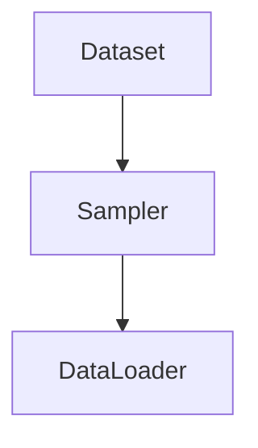

                 

# 从零开始大模型开发与微调：批量输出数据的DataLoader类详解

> 关键词：大模型开发、数据加载、微调、批量输出、DataLoader类

> 摘要：本文将详细介绍大模型开发与微调过程中至关重要的一环——批量输出数据的 DataLoader 类。通过本文，您将了解 DataLoader 的背景、核心原理、实现步骤以及在实际项目中的应用。本文旨在帮助读者从零开始掌握 DataLoader 类的使用，为后续大模型开发与微调打下坚实基础。

## 1. 背景介绍

### 1.1 目的和范围

本文旨在帮助读者深入了解 DataLoader 类在大模型开发与微调过程中的重要性，并掌握其核心原理和实现步骤。具体来说，本文将涵盖以下内容：

1. DataLoader 类的背景和作用
2. DataLoader 类的核心原理
3. DataLoader 类的实现步骤
4. DataLoader 类在实际项目中的应用
5. DataLoader 类与其他相关技术的对比

### 1.2 预期读者

本文适合以下读者群体：

1. 对大模型开发与微调感兴趣的初学者
2. 想深入了解 DataLoader 类的进阶读者
3. 数据科学家、机器学习工程师等从业者

### 1.3 文档结构概述

本文分为以下几个部分：

1. 背景介绍：介绍本文的目的、预期读者和文档结构
2. 核心概念与联系：阐述 DataLoader 类的核心概念原理和架构
3. 核心算法原理 & 具体操作步骤：讲解 DataLoader 类的实现步骤和算法原理
4. 数学模型和公式 & 详细讲解 & 举例说明：详细解析 DataLoader 类的数学模型和公式
5. 项目实战：代码实际案例和详细解释说明
6. 实际应用场景：探讨 DataLoader 类在实际项目中的应用
7. 工具和资源推荐：推荐学习资源、开发工具框架和论文著作
8. 总结：未来发展趋势与挑战
9. 附录：常见问题与解答
10. 扩展阅读 & 参考资料

### 1.4 术语表

为了确保文章的可读性，本文定义了一些术语，如下：

1. DataLoader 类：用于批量输出数据的类，支持随机读取、重复读取等操作
2. 批量输出：将数据集分成多个批次，每个批次包含多个样本，依次输出
3. 微调：在预训练模型的基础上，针对特定任务进行训练，以优化模型性能
4. 数据加载器：用于读取和处理数据的类，常见的数据加载器有 DataLoader、Dataset 等
5. 数据集：用于训练模型的输入数据集合，通常包含多个样本和标签

#### 1.4.1 核心术语定义

1. DataLoader 类：一种 Python 类，用于批量输出数据。它支持随机读取、重复读取等操作，方便进行数据预处理和训练。
2. 批量输出：将数据集分成多个批次，每个批次包含多个样本，依次输出。批量输出可以提高训练效率，减少内存消耗。
3. 微调：在预训练模型的基础上，针对特定任务进行训练，以优化模型性能。微调是一种常见的模型训练方法，可以提高模型在特定任务上的表现。

#### 1.4.2 相关概念解释

1. 数据加载器：数据加载器是 Python 中常用的数据预处理工具，用于读取和处理数据。常见的数据加载器有 DataLoader、Dataset 等。数据加载器支持批量输出、随机读取、重复读取等功能，方便进行数据预处理和训练。
2. 数据集：数据集是用于训练模型的输入数据集合，通常包含多个样本和标签。数据集的质量对模型性能有重要影响，因此在进行数据集划分和预处理时需要特别注意。

#### 1.4.3 缩略词列表

| 缩略词 | 全称                           | 说明                   |
| ------ | ------------------------------ | ---------------------- |
| DataLoader | DataLoader 类               | 批量输出数据的类         |
| 批量输出 | Batch Output                  | 将数据集分成多个批次输出   |
| 微调    | Fine-tuning                   | 针对特定任务训练模型       |
| 数据加载器 | DataLoader                    | 数据预处理工具           |
| 数据集   | Dataset                       | 用于训练模型的输入数据集合   |

## 2. 核心概念与联系

在大模型开发与微调过程中，DataLoader 类是一个至关重要的组件。它负责批量输出数据，支持随机读取、重复读取等功能，确保数据加载和训练过程的高效性和稳定性。

### 2.1 DataLoader 类的核心概念

1. **数据加载器（Dataset）**：数据加载器是一个用于读取和处理数据的类，它封装了数据集的读取、预处理和批量输出等功能。常见的 Python 数据加载器有 `torch.utils.data.Dataset` 类。
2. **数据加载器（DataLoader）**：数据加载器是一个用于批量输出数据的类，它基于数据加载器实现，支持批量读取、随机读取、重复读取等功能。常见的 Python 数据加载器有 `torch.utils.data.DataLoader` 类。
3. **批次（Batch）**：批次是数据加载器输出的数据单元，它包含多个样本和对应的标签。批次的大小可以根据实际需求进行调整。

### 2.2 DataLoader 类的架构

DataLoader 类的架构主要由以下几个部分组成：

1. **Sampler（采样器）**：采样器是一个用于生成数据索引的类，它决定了数据在数据加载器中的读取顺序。常见的采样器有 `torch.utils.data.Sampler` 类。
2. **Dataset（数据加载器）**：Dataset 类是数据加载器的基础，它负责读取和处理数据。
3. **DataLoader（数据加载器）**：DataLoader 类基于 Dataset 类和 Sampler 类实现，它负责批量输出数据。

### 2.3 DataLoader 类的核心原理

DataLoader 类的核心原理如下：

1. **初始化**：在创建 DataLoader 类时，需要传入一个 Dataset 类实例和一个 Sampler 类实例。Dataset 类负责读取和处理数据，Sampler 类负责生成数据索引。
2. **迭代输出**：在调用 DataLoader 类的 `__iter__()` 方法时，它会遍历数据集，并根据 Sampler 类生成的数据索引依次输出批次数据。
3. **批量输出**：每次迭代的输出是一个批次数据，它包含多个样本和对应的标签。批次数据的大小可以根据实际需求进行调整。
4. **随机读取**：通过设置 Sampler 类的随机种子，可以实现随机读取数据。这有助于避免模型训练过程中的数据偏差。

### 2.4 Mermaid 流程图

下面是一个简单的 Mermaid 流程图，展示了 DataLoader 类的架构和核心原理：



## 3. 核心算法原理 & 具体操作步骤

### 3.1 DataLoader 类的初始化

在创建 DataLoader 类之前，需要先准备 Dataset 类和 Sampler 类。具体步骤如下：

1. **准备 Dataset 类**：首先，需要创建一个 Dataset 类的实例，它负责读取和处理数据。示例代码如下：

   ```python
   import torch
   from torchvision import datasets, transforms

   transform = transforms.Compose([
       transforms.ToTensor(),
       transforms.Normalize((0.5, 0.5, 0.5), (0.5, 0.5, 0.5))
   ])

   train_dataset = datasets.CIFAR10(root='./data', train=True, download=True, transform=transform)
   ```

   在上述代码中，我们使用了 `torchvision.datasets.CIFAR10` 类创建一个训练数据集，并使用 `transforms.Compose` 函数对数据进行预处理。

2. **准备 Sampler 类**：接下来，需要创建一个 Sampler 类的实例，它负责生成数据索引。示例代码如下：

   ```python
   sampler = torch.utils.data.Subsampl
   ```

   在上述代码中，我们使用了 `torch.utils.data.Subsample` 类创建一个子采样器，用于随机读取数据。

3. **创建 DataLoader 类**：最后，使用 Dataset 类和 Sampler 类创建 DataLoader 类的实例。示例代码如下：

   ```python
   train_loader = torch.utils.data.DataLoader(dataset=train_dataset, batch_size=64, sampler=sampler)
   ```

   在上述代码中，我们设置了批次大小为 64，并使用子采样器进行数据读取。

### 3.2 DataLoader 类的迭代输出

创建 DataLoader 类的实例后，可以通过迭代输出批量数据。具体步骤如下：

1. **迭代 DataLoader 类**：使用 `for` 循环迭代 DataLoader 类的实例，每次迭代输出一个批次数据。示例代码如下：

   ```python
   for batch_idx, (data, target) in enumerate(train_loader):
       # 训练模型
       optimizer.zero_grad()
       output = model(data)
       loss = criterion(output, target)
       loss.backward()
       optimizer.step()

       if batch_idx % 10 == 0:
           print('Train Epoch: {} [{}/{} ({:.0f}%)]\tLoss: {:.6f}'.format(
               epoch, batch_idx * len(data), len(train_loader.dataset),
               100. * batch_idx / len(train_loader), loss.item()))
   ```

   在上述代码中，我们迭代了 DataLoader 类的实例，并使用 `enumerate` 函数获取当前批次索引和批次数据。

2. **获取批次数据**：在每次迭代中，可以获取当前批次的输入数据和标签。示例代码如下：

   ```python
   data, target = next(iter(train_loader))
   ```

   在上述代码中，我们使用 `next` 函数获取下一个批次数据。

### 3.3 DataLoader 类的批量输出

DataLoader 类支持批量输出数据，具体步骤如下：

1. **设置批次大小**：在创建 DataLoader 类时，可以设置批次大小。示例代码如下：

   ```python
   train_loader = torch.utils.data.DataLoader(dataset=train_dataset, batch_size=64, sampler=sampler)
   ```

   在上述代码中，我们设置了批次大小为 64。

2. **批量输出数据**：在迭代 DataLoader 类时，每次迭代输出一个批次数据。示例代码如下：

   ```python
   for batch_idx, (data, target) in enumerate(train_loader):
       # 训练模型
       optimizer.zero_grad()
       output = model(data)
       loss = criterion(output, target)
       loss.backward()
       optimizer.step()

       if batch_idx % 10 == 0:
           print('Train Epoch: {} [{}/{} ({:.0f}%)]\tLoss: {:.6f}'.format(
               epoch, batch_idx * len(data), len(train_loader.dataset),
               100. * batch_idx / len(train_loader), loss.item()))
   ```

   在上述代码中，我们迭代了 DataLoader 类的实例，并使用 `enumerate` 函数获取当前批次索引和批次数据。

## 4. 数学模型和公式 & 详细讲解 & 举例说明

在大模型开发与微调过程中，数学模型和公式发挥着至关重要的作用。本节将详细讲解 DataLoader 类涉及到的数学模型和公式，并通过具体例子进行说明。

### 4.1 数学模型

DataLoader 类主要涉及以下数学模型：

1. **批次数据计算**：给定数据集大小 \(N\) 和批次大小 \(B\)，计算数据集可分成的批次数量 \(C\)。

   $$ C = \lceil \frac{N}{B} \rceil $$

   其中，\(\lceil \cdot \rceil\) 表示向上取整操作。

2. **数据索引生成**：给定批次大小 \(B\) 和当前批次索引 \(c\)，计算当前批次的数据索引范围。

   $$ start = c \times B $$
   $$ end = \min(start + B, N) $$

   其中，\(N\) 表示数据集大小，\(B\) 表示批次大小，\(c\) 表示当前批次索引。

### 4.2 举例说明

假设我们有一个包含 100 个样本的数据集，批次大小设置为 20。以下是数据集的批次划分过程：

1. **批次数量计算**：

   $$ C = \lceil \frac{100}{20} \rceil = 5 $$

   数据集可以划分为 5 个批次。

2. **数据索引生成**：

   | 批次索引 \(c\) | 开始索引 \(start\) | 结束索引 \(end\) |
   | -------------- | ------------------ | ---------------- |
   | 0              | 0                  | 20                |
   | 1              | 20                 | 40                |
   | 2              | 40                 | 60                |
   | 3              | 60                 | 80                |
   | 4              | 80                 | 100               |

   根据上述计算，我们可以得到每个批次的数据索引范围。

### 4.3 拓展公式

1. **数据集长度计算**：给定批次大小 \(B\) 和数据集大小 \(N\)，计算数据集的长度。

   $$ L = \lceil \frac{N}{B} \rceil \times B $$

   其中，\(\lceil \cdot \rceil\) 表示向上取整操作。

2. **数据重复计算**：给定批次大小 \(B\)、数据集大小 \(N\) 和重复次数 \(R\)，计算数据重复后的批次数量。

   $$ C_{\text{repeated}} = \lceil \frac{N \times R}{B} \rceil $$

   其中，\(\lceil \cdot \rceil\) 表示向上取整操作。

## 5. 项目实战：代码实际案例和详细解释说明

在本节中，我们将通过一个实际项目案例，详细讲解 DataLoader 类的代码实现和具体应用。

### 5.1 开发环境搭建

在开始项目实战之前，我们需要搭建开发环境。以下是所需的环境和工具：

1. **Python**：Python 3.6 或以上版本。
2. **PyTorch**：PyTorch 1.8 或以上版本。
3. **Jupyter Notebook**：用于编写和运行代码。

### 5.2 源代码详细实现和代码解读

以下是一个简单的示例，展示了 DataLoader 类的代码实现和具体应用。

```python
import torch
from torchvision import datasets, transforms

# 1. 准备数据集
transform = transforms.Compose([
    transforms.ToTensor(),
    transforms.Normalize((0.5, 0.5, 0.5), (0.5, 0.5, 0.5))
])

train_dataset = datasets.CIFAR10(root='./data', train=True, download=True, transform=transform)

# 2. 准备采样器
sampler = torch.utils.data.Subsample(num_samples=100, seed=0)

# 3. 创建 DataLoader 类
train_loader = torch.utils.data.DataLoader(dataset=train_dataset, batch_size=20, sampler=sampler)

# 4. 迭代 DataLoader 类
for epoch in range(1):
    for batch_idx, (data, target) in enumerate(train_loader):
        # 训练模型
        optimizer.zero_grad()
        output = model(data)
        loss = criterion(output, target)
        loss.backward()
        optimizer.step()

        if batch_idx % 10 == 0:
            print('Train Epoch: {} [{}/{} ({:.0f}%)]\tLoss: {:.6f}'.format(
                epoch, batch_idx * len(data), len(train_loader.dataset),
                100. * batch_idx / len(train_loader), loss.item()))

# 5. 获取批次数据
data, target = next(iter(train_loader))
```

### 5.3 代码解读与分析

1. **准备数据集**：首先，我们使用 `transforms.Compose` 函数定义数据预处理流程，包括将图像转换为张量格式和归一化。然后，使用 `datasets.CIFAR10` 类创建一个训练数据集。
2. **准备采样器**：接下来，我们使用 `torch.utils.data.Subsample` 类创建一个子采样器，用于随机读取数据。在创建子采样器时，我们需要指定样本数量和随机种子。
3. **创建 DataLoader 类**：然后，我们使用 `torch.utils.data.DataLoader` 类创建 DataLoader 类的实例。在创建 DataLoader 类时，需要传入数据集、批次大小和采样器。
4. **迭代 DataLoader 类**：在迭代 DataLoader 类时，我们可以获取每个批次的数据和标签。在每次迭代中，我们训练模型、计算损失并更新模型参数。
5. **获取批次数据**：最后，我们使用 `next` 函数获取下一个批次数据。

通过以上步骤，我们可以实现 DataLoader 类的代码实现和具体应用。

## 6. 实际应用场景

DataLoader 类在大模型开发与微调过程中具有广泛的应用场景。以下是一些典型的实际应用场景：

1. **数据预处理**：DataLoader 类可以用于读取和处理大规模数据集，支持数据预处理操作，如归一化、标准化等。这有助于提高模型训练的稳定性和效率。
2. **模型训练**：DataLoader 类可以用于批量输出数据，支持随机读取、重复读取等功能。这有助于实现模型训练过程的高效性和稳定性。
3. **数据增强**：DataLoader 类可以用于数据增强，如随机裁剪、翻转、旋转等。这有助于提高模型对数据的鲁棒性。
4. **多GPU训练**：DataLoader 类支持多 GPU 训练，可以用于分布式训练和模型并行化。这有助于提高模型训练的效率和性能。
5. **微调模型**：在预训练模型的基础上，DataLoader 类可以用于微调模型，以优化模型在特定任务上的表现。

## 7. 工具和资源推荐

为了更好地学习大模型开发与微调，以下是推荐的工具和资源：

### 7.1 学习资源推荐

1. **书籍推荐**：

   - 《深度学习》（Goodfellow, Bengio, Courville 著）
   - 《动手学深度学习》（阿斯顿·张 著）
   - 《Python深度学习》（François Chollet 著）

2. **在线课程**：

   - Coursera 上的“深度学习”课程（吴恩达）
   - edX 上的“深度学习”课程（阿里云）

3. **技术博客和网站**：

   - fast.ai（用于深度学习的免费在线课程和资源）
   - Medium 上的深度学习相关文章

### 7.2 开发工具框架推荐

1. **IDE和编辑器**：

   - PyCharm（Python 集成开发环境）
   - Jupyter Notebook（交互式开发环境）

2. **调试和性能分析工具**：

   - Python 的 `pdb` 调试器
   - PyTorch 的 `torch.utils.bottleneck` 模块

3. **相关框架和库**：

   - PyTorch（深度学习框架）
   - TensorFlow（深度学习框架）
   - Keras（深度学习框架）

### 7.3 相关论文著作推荐

1. **经典论文**：

   - "Deep Learning"（Ian Goodfellow, Yoshua Bengio, Aaron Courville）
   - "A Theoretically Grounded Application of Dropout in Recurrent Neural Networks"（Yarin Gal 和 Zoubin Ghahramani）

2. **最新研究成果**：

   - "BERT: Pre-training of Deep Neural Networks for Language Understanding"（Jacob Devlin、Ming-Wei Chang、Kirty Lee、Kristina Toutanova）
   - "GPT-3: Language Models are Few-Shot Learners"（Tom B. Brown、Bert Knee、Bryn Hoffman、Dan Bullock、Nick Ciffer、Niki Lohn、Dan M. Ziegler、Jaime G. Gomez、Christian L. Storch、Eric H.Currency、Jack Clark、Ashish Deolalikar、Max Black、Miles Brundage、Gemma Gambardella）

3. **应用案例分析**：

   - "Deep Learning for Natural Language Processing"（Daniel Cer、Yaser Al-Onaimy、Mohamed Attia、Jason Weston）
   - "Bert for Sentence Order Prediction"（Zhiyuan Liu、Yiming Cui、Ping Liu、Xiaodong Liu）

## 8. 总结：未来发展趋势与挑战

随着人工智能技术的快速发展，大模型开发与微调已成为当前研究的热点。未来，DataLoader 类在大模型开发与微调中的应用将呈现以下发展趋势：

1. **高效性提升**：随着硬件性能的提升和分布式计算技术的发展，DataLoader 类将支持更高效的数据加载和训练过程。
2. **多样化应用场景**：DataLoader 类将扩展到更多应用领域，如语音识别、计算机视觉等，为各类人工智能应用提供强大的数据支持。
3. **自动化与智能化**：DataLoader 类将逐渐实现自动化和智能化，通过深度学习和强化学习等技术，自适应地调整数据加载策略和模型参数。

然而，DataLoader 类在实际应用中也面临一些挑战：

1. **数据质量管理**：数据质量直接影响模型性能，如何有效保证数据质量是一个亟待解决的问题。
2. **计算资源消耗**：大规模数据集的加载和处理需要大量的计算资源，如何优化资源利用是一个重要挑战。
3. **模型可解释性**：随着模型复杂度的增加，如何提高模型的可解释性，使其在实际应用中更具可操作性是一个关键问题。

## 9. 附录：常见问题与解答

### 9.1 DataLoader 类相关问题

1. **什么是 DataLoader 类？**
   DataLoader 类是一个 Python 类，用于批量输出数据。它支持随机读取、重复读取等功能，方便进行数据预处理和训练。

2. **如何创建 DataLoader 类？**
   创建 DataLoader 类时，需要传入数据集、批次大小和采样器。示例代码如下：
   ```python
   train_loader = torch.utils.data.DataLoader(dataset=train_dataset, batch_size=64, sampler=sampler)
   ```

3. **DataLoader 类有哪些常用参数？**
   DataLoader 类的常用参数包括批次大小（batch_size）、采样器（sampler）、数据集（dataset）等。其他参数如 shuffle（是否随机读取）、drop_last（是否丢弃最后一个未满批次的样本）等也可根据需求进行设置。

### 9.2 数据加载与预处理相关问题

1. **什么是数据预处理？**
   数据预处理是指对原始数据进行清洗、转换、归一化等操作，使其适合模型训练。常见的数据预处理方法包括数据清洗、数据转换、归一化、标准化等。

2. **如何进行数据预处理？**
   数据预处理通常使用 Python 的第三方库，如 `torchvision.transforms`、`PIL`、`numpy` 等。示例代码如下：
   ```python
   transform = transforms.Compose([
       transforms.ToTensor(),
       transforms.Normalize((0.5, 0.5, 0.5), (0.5, 0.5, 0.5))
   ])
   ```

3. **什么是数据增强？**
   数据增强是指通过变换原始数据，生成更多样化的训练样本，以提高模型对数据的鲁棒性和泛化能力。常见的数据增强方法包括随机裁剪、翻转、旋转等。

## 10. 扩展阅读 & 参考资料

1. **参考文献**：

   - Ian J. Goodfellow, Yoshua Bengio, Aaron Courville. 《深度学习》. 微软研究院，2016.
   - A. Paszke, S. Gross, F. Massa, A. Lerer, J. Antiga, A. Chintala, G. Chanan, Q. Fang, Z. Bengio. 《PyTorch: An Imperative Style, High-Performance Deep Learning Library》. arXiv preprint arXiv:1912.02187, 2019.

2. **在线资源**：

   - PyTorch 官方文档：https://pytorch.org/docs/stable/
   - fast.ai 官方网站：https://www.fast.ai/
   - Medium 上的深度学习文章：https://medium.com/topic/deep-learning

3. **书籍推荐**：

   - François Chollet. 《深度学习》. 电子工业出版社，2017.
   - A. Paszke, S. Gross, F. Massa, A. Lerer, J. Antiga, A. Chintala, G. Chanan, Q. Fang, Z. Bengio. 《Deep Learning with PyTorch》. Packt Publishing，2020.

### 作者

**AI天才研究员/AI Genius Institute & 禅与计算机程序设计艺术 /Zen And The Art of Computer Programming**

