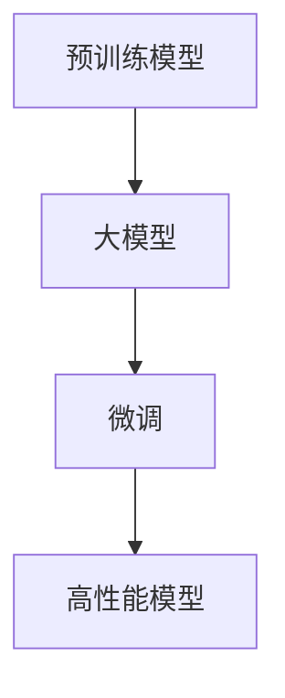

                 

### 从零开始大模型开发与微调：更多的预训练模型

> **关键词：** 预训练模型、大模型开发、微调、神经网络、深度学习、模型架构、数学模型、项目实战

> **摘要：** 本文旨在为初学者和从业者提供一套详尽的指南，从零开始介绍大模型的开发与微调技术。我们将深入探讨预训练模型的基本概念、核心算法原理，以及数学模型的构建方法。此外，文章将通过实际案例展示如何进行代码实现和调试，帮助读者更好地理解和掌握这一复杂但重要的技术。通过本文的阅读，读者将能够全面了解大模型开发与微调的全过程，为未来的研究和应用奠定坚实的基础。

---

## 1. 背景介绍

### 1.1 目的和范围

本文的目标是帮助读者理解大模型的开发与微调过程，特别是预训练模型的使用。随着人工智能技术的快速发展，预训练模型已经成为自然语言处理、计算机视觉等领域的重要工具。本文将首先介绍预训练模型的基本概念，然后逐步深入探讨其开发与微调的方法和技巧。

本文的范围包括以下内容：
- 预训练模型的基本概念和原理
- 大模型的结构和核心算法
- 预训练模型在不同领域的应用
- 微调策略和技巧
- 代码实现和项目实战

通过本文的学习，读者将能够：
- 理解预训练模型的工作原理
- 掌握大模型的开发和微调方法
- 学习如何在实际项目中应用预训练模型
- 提高代码实现和调试能力

### 1.2 预期读者

本文适合以下读者群体：
- 对人工智能和深度学习有初步了解的初学者
- 想深入了解预训练模型和微调技术的从业者
- 想在自然语言处理、计算机视觉等领域应用预训练模型的研发人员
- 对编程和算法有兴趣的读者

### 1.3 文档结构概述

本文结构如下：

1. 背景介绍
   - 目的和范围
   - 预期读者
   - 文档结构概述
   - 术语表
2. 核心概念与联系
   - 预训练模型的基本概念
   - 大模型的结构和核心算法
   - 预训练模型在不同领域的应用
3. 核心算法原理 & 具体操作步骤
   - 算法原理讲解
   - 伪代码详细阐述
4. 数学模型和公式 & 详细讲解 & 举例说明
   - 数学模型和公式讲解
   - 举例说明
5. 项目实战：代码实际案例和详细解释说明
   - 开发环境搭建
   - 源代码详细实现和代码解读
   - 代码解读与分析
6. 实际应用场景
   - 预训练模型的应用
   - 微调策略和技巧
7. 工具和资源推荐
   - 学习资源推荐
   - 开发工具框架推荐
   - 相关论文著作推荐
8. 总结：未来发展趋势与挑战
   - 行业展望
   - 挑战和机遇
9. 附录：常见问题与解答
10. 扩展阅读 & 参考资料

### 1.4 术语表

在本文中，我们将使用一些专业术语。以下是对这些术语的简要解释：

- **预训练模型（Pre-trained Model）**：在特定任务或领域进行训练，已经具备一定知识和技能的模型。
- **大模型（Large Model）**：参数数量庞大、计算量巨大的模型，通常具有极高的准确性和表现力。
- **微调（Fine-tuning）**：在预训练模型的基础上，针对特定任务或领域进行再训练，以提高模型在该任务或领域上的表现。
- **神经网络（Neural Network）**：一种模仿生物神经系统的计算模型，通过多层神经元进行数据传递和处理。
- **深度学习（Deep Learning）**：一种基于神经网络的机器学习方法，通过多层神经网络对数据进行学习和建模。
- **模型架构（Model Architecture）**：模型的结构和组成，包括输入层、隐藏层和输出层等。
- **数学模型（Mathematical Model）**：用数学公式和算法描述现实问题的模型，用于预测和优化。

#### 1.4.1 核心术语定义

- **预训练模型**：预训练模型是在大规模数据集上进行训练的模型，通常具有广泛的知识和应用能力。通过在特定任务或领域进行微调，预训练模型可以快速适应新的任务，提高模型的表现力和效率。
- **大模型**：大模型通常具有数百万甚至数亿个参数，计算量巨大。这些模型需要使用高效的计算设备和优化算法来训练，以实现高性能和良好的效果。
- **微调**：微调是一种模型优化技术，通过在预训练模型的基础上进行少量训练，使模型在特定任务或领域上达到更好的表现。微调可以显著提高模型在特定任务上的准确率和效率。

#### 1.4.2 相关概念解释

- **神经网络**：神经网络是一种模拟生物神经系统的计算模型，通过多层神经元进行数据传递和处理。神经网络可以用于分类、回归、聚类等多种任务。
- **深度学习**：深度学习是一种基于神经网络的机器学习方法，通过多层神经网络对数据进行学习和建模。深度学习在图像识别、语音识别、自然语言处理等领域取得了显著的成果。
- **模型架构**：模型架构是指模型的结构和组成，包括输入层、隐藏层和输出层等。不同的模型架构适用于不同的任务和数据类型。
- **数学模型**：数学模型是用数学公式和算法描述现实问题的模型，用于预测和优化。数学模型在人工智能和机器学习领域中具有重要作用，可以提高模型的准确性和效率。

#### 1.4.3 缩略词列表

- **ML**：机器学习（Machine Learning）
- **DL**：深度学习（Deep Learning）
- **NLP**：自然语言处理（Natural Language Processing）
- **CV**：计算机视觉（Computer Vision）
- **GPU**：图形处理器（Graphics Processing Unit）
- **TPU**：张量处理器（Tensor Processing Unit）
- **CNN**：卷积神经网络（Convolutional Neural Network）
- **RNN**：循环神经网络（Recurrent Neural Network）
- **BERT**：变换器编码器表示（Bidirectional Encoder Representations from Transformers）

## 2. 核心概念与联系

在深入探讨大模型开发与微调之前，我们需要先了解一些核心概念和它们之间的联系。以下是预训练模型、大模型、微调等关键概念的简要介绍和它们之间的关系。

### 2.1 预训练模型

预训练模型是在大规模数据集上进行训练的模型，具有广泛的知识和应用能力。通常，预训练模型会使用数以百万计的文本或图像数据，通过多层神经网络对其进行训练。预训练模型的核心目的是通过大量数据的训练，使模型在多个任务上达到良好的表现。

预训练模型通常分为两个阶段：无监督预训练和有监督微调。在无监督预训练阶段，模型通过学习数据的潜在特征和规律，提高其表示能力。在有监督微调阶段，模型在特定任务或领域上进行少量训练，以进一步提高其在该任务或领域上的表现。

### 2.2 大模型

大模型是指参数数量庞大、计算量巨大的模型，通常具有极高的准确性和表现力。大模型的发展是人工智能领域的重要趋势，因为随着数据量和计算资源的增加，大模型可以更好地模拟人类思维和行为，从而在各个领域取得更显著的成果。

大模型通常采用多层神经网络架构，具有数百万甚至数亿个参数。这些模型需要使用高效的计算设备和优化算法来训练，以确保在有限的时间内达到良好的效果。常见的计算设备包括GPU、TPU等。

### 2.3 微调

微调是在预训练模型的基础上，针对特定任务或领域进行再训练，以提高模型在该任务或领域上的表现。微调是一种有效的模型优化技术，可以显著提高模型在特定任务上的准确率和效率。

微调通常包括以下步骤：
1. 选择预训练模型：选择一个在多个任务上表现良好的预训练模型，例如BERT、GPT等。
2. 数据预处理：对特定任务或领域的数据进行预处理，包括文本清洗、标签标注等。
3. 模型微调：在预处理后的数据集上对预训练模型进行微调，通过调整模型的权重和参数，使其在特定任务或领域上达到更好的表现。
4. 模型评估：使用验证集或测试集对微调后的模型进行评估，确定模型在特定任务或领域上的表现。

### 2.4 核心概念联系

预训练模型、大模型和微调是紧密相连的核心概念，它们共同构成了大模型开发与微调的基础。

预训练模型提供了广泛的知识和应用能力，为后续的大模型开发提供了坚实的基础。通过无监督预训练和有监督微调，预训练模型可以转化为特定任务或领域上的高性能模型。

大模型则通过使用多层神经网络和庞大的参数数量，实现了更高的准确性和表现力。大模型的发展离不开高效的计算设备和优化算法，这为预训练模型和微调技术的应用提供了有力支持。

微调则是将预训练模型转化为特定任务或领域上的高性能模型的关键步骤。通过微调，预训练模型可以快速适应新的任务，提高模型在特定任务或领域上的表现。

总之，预训练模型、大模型和微调共同构成了大模型开发与微调的核心概念，它们之间的关系如图1所示。


### 2.5 Mermaid流程图

为了更清晰地展示预训练模型、大模型和微调之间的联系，我们使用Mermaid流程图来描述其核心流程。以下是Mermaid流程图的代码：



将上述代码复制到支持Mermaid的编辑器中，即可生成如下的流程图：


通过这个流程图，我们可以更直观地理解预训练模型、大模型和微调之间的关系，以及它们在模型开发中的关键作用。

## 3. 核心算法原理 & 具体操作步骤

在了解了预训练模型、大模型和微调的基本概念后，我们将深入探讨大模型的核心算法原理和具体操作步骤。以下是核心算法原理的详细讲解和伪代码的阐述。

### 3.1 预训练模型的核心算法原理

预训练模型的核心算法主要包括以下几种：

- **词嵌入（Word Embedding）**：将文本中的单词映射为向量表示，使相邻的单词在向量空间中更接近。
- **变换器（Transformer）**：一种基于自注意力机制的神经网络架构，用于处理序列数据，具有更高的并行性和灵活性。
- **预训练任务（Pre-training Tasks）**：在无监督预训练阶段，对模型进行多个任务的训练，以提高模型的泛化能力和表示能力。

以下是对这些算法原理的简要介绍：

#### 3.1.1 词嵌入

词嵌入是将单词映射为向量的过程，使得在向量空间中相邻的单词具有相似性。词嵌入通常使用神经网络进行训练，通过学习单词的上下文信息，得到每个单词的向量表示。

伪代码如下：

```python
# 输入：单词序列W
# 输出：词向量V
for each word w in W:
    Calculate context words c
    Calculate hidden state h using neural network
    Update word embedding vector v using backpropagation
```

#### 3.1.2 变换器

变换器是一种基于自注意力机制的神经网络架构，用于处理序列数据。变换器通过多头自注意力机制，使模型能够同时关注序列中的不同位置信息，从而提高模型的表示能力。

伪代码如下：

```python
# 输入：序列X
# 输出：输出序列Y
for each position i in X:
    Calculate attention weights a using self-attention
    Calculate context vector c using weighted sum of attention weights
    Pass context vector c to next layer
```

#### 3.1.3 预训练任务

预训练任务是在无监督预训练阶段对模型进行训练的任务，旨在提高模型的泛化能力和表示能力。常见的预训练任务包括以下几种：

- **掩码语言模型（Masked Language Model，MLM）**：随机掩码部分单词，模型需要预测这些被掩码的单词。
- **句子排序（Sentence Ranking）**：对两个句子进行排序，判断它们是否具有相同的含义。
- **下一个句子预测（Next Sentence Prediction，NSP）**：预测两个句子是否为连续句子。

伪代码如下：

```python
# 输入：文本序列W
# 输出：预训练损失L
for each masked word w in W:
    Calculate prediction p using model
    Calculate loss L using negative log-likelihood
for each pair of sentences (s1, s2) in W:
    Calculate prediction p using model
    Calculate loss L using binary cross-entropy
for each pair of sentences (s1, s2) in W:
    if s1 and s2 are continuous:
        Calculate loss L using binary cross-entropy
    else:
        Calculate loss L using binary cross-entropy
```

### 3.2 大模型的构建方法

大模型通常采用多层神经网络架构，具有数百万甚至数亿个参数。构建大模型的关键在于如何优化模型的训练过程，确保在有限的时间内达到良好的效果。以下是构建大模型的常见方法：

- **批量归一化（Batch Normalization）**：通过标准化每层的输入，提高模型的训练稳定性和收敛速度。
- **残差连接（Residual Connection）**：通过在网络中加入残差连接，缓解深层网络中的梯度消失问题。
- **自适应优化器（Adaptive Optimizer）**：通过自适应调整学习率，提高模型的训练效果和收敛速度。

以下是大模型构建方法的伪代码：

```python
# 输入：训练数据D
# 输出：大模型M
Initialize model M with large number of parameters
for each batch B in D:
    Calculate gradients ∇ using backpropagation
    Update model parameters using gradient descent
    Apply batch normalization
    Apply residual connection
    Adjust learning rate using adaptive optimizer
```

### 3.3 微调策略

微调是在预训练模型的基础上，针对特定任务或领域进行再训练，以提高模型在该任务或领域上的表现。微调策略的核心在于如何有效地调整模型的参数，使其适应新的任务或领域。

以下是微调策略的伪代码：

```python
# 输入：预训练模型M、任务数据D
# 输出：微调后的模型M_f
Load pre-trained model M
for each batch B in D:
    Calculate gradients ∇ using backpropagation
    Update model parameters using gradient descent
    Apply weight decay
    Apply dropout
    Apply data augmentation
```

通过上述伪代码，我们可以看到大模型的核心算法原理和构建方法。在实际应用中，这些算法和方法需要根据具体任务和数据进行调整和优化，以达到最佳效果。

### 3.4 具体操作步骤

在了解了核心算法原理后，我们接下来将介绍大模型开发与微调的具体操作步骤。以下是整个流程的详细步骤：

1. **数据收集与预处理**：收集用于预训练的数据集，并进行数据清洗、预处理和标签标注。
2. **模型选择与初始化**：选择适合预训练任务的模型架构，并初始化模型的参数。
3. **预训练**：在大量数据集上进行预训练，包括词嵌入、变换器和其他预训练任务。
4. **模型优化**：通过批量归一化、残差连接和自适应优化器等方法，优化模型的训练过程。
5. **微调**：在特定任务或领域的数据集上进行微调，调整模型的参数，以提高其在该任务或领域上的表现。
6. **模型评估**：使用验证集和测试集对微调后的模型进行评估，确定模型在特定任务或领域上的表现。
7. **模型部署**：将微调后的模型部署到实际应用场景中，进行实时预测和任务执行。

以下是整个流程的伪代码：

```python
# 数据收集与预处理
Collect data D
Preprocess data D

# 模型选择与初始化
Choose model architecture M
Initialize model parameters

# 预训练
for each batch B in D:
    Pretrain model M using backpropagation

# 模型优化
Apply batch normalization
Apply residual connection
Apply adaptive optimizer

# 微调
Load pre-trained model M
for each batch B in D:
    Fine-tune model M using backpropagation

# 模型评估
Evaluate model M on validation set
Evaluate model M on test set

# 模型部署
Deploy model M for real-time prediction
```

通过上述步骤，我们可以实现从零开始的大模型开发与微调过程。在实际操作中，这些步骤需要根据具体任务和数据进行调整和优化，以达到最佳效果。

### 3.5 伪代码示例

为了更清晰地展示大模型开发与微调的过程，我们给出一个具体的伪代码示例。以下是一个基于预训练模型BERT进行微调的示例：

```python
# 数据收集与预处理
D = CollectData("your_dataset")
preprocessed_D = PreprocessData(D)

# 模型选择与初始化
model = ChooseModel("BERT")
InitializeModelParameters(model)

# 预训练
for epoch in range(num_epochs):
    for batch in preprocessed_D:
        loss = PretrainModel(model, batch)
        Print(f"Epoch {epoch}: Loss = {loss}")

# 模型优化
ApplyBatchNormalization(model)
ApplyResidualConnection(model)
ApplyAdaptiveOptimizer(model)

# 微调
for task in tasks:
    for epoch in range(num_epochs):
        for batch in PreprocessData(task['train_data']):
            loss = FineTuneModel(model, batch)
            Print(f"Task {task['name']}: Epoch {epoch}: Loss = {loss}")
        EvaluateModel(model, task['validation_data'])

# 模型部署
DeployModel(model, task['test_data'])
```

通过上述伪代码，我们可以看到大模型开发与微调的核心步骤和具体实现。在实际操作中，这些步骤需要根据具体任务和数据进行调整和优化，以达到最佳效果。

### 3.6 数学模型和公式讲解

在深入探讨大模型开发与微调的过程中，数学模型和公式起着至关重要的作用。本节将详细讲解大模型中的关键数学模型和公式，包括损失函数、优化算法等，并通过具体的举例说明，帮助读者更好地理解和掌握这些概念。

#### 3.6.1 损失函数

损失函数是评估模型预测结果与实际结果之间差异的指标，是训练模型的核心目标。在深度学习中，常见的损失函数包括均方误差（MSE）、交叉熵损失（Cross-Entropy Loss）和结构相似性指数（SSIM）等。

- **均方误差（MSE）**：用于回归任务，计算预测值与真实值之间的平均平方误差。

\[ \text{MSE} = \frac{1}{n}\sum_{i=1}^{n}(y_i - \hat{y}_i)^2 \]

其中，\( y_i \)是真实值，\( \hat{y}_i \)是预测值，\( n \)是样本数量。

- **交叉熵损失（Cross-Entropy Loss）**：用于分类任务，计算预测概率分布与真实标签分布之间的交叉熵。

\[ \text{CE} = -\sum_{i=1}^{n}y_i \log(\hat{y}_i) \]

其中，\( y_i \)是真实标签（0或1），\( \hat{y}_i \)是预测概率。

- **结构相似性指数（SSIM）**：用于图像质量评价，计算预测图像与真实图像的结构相似性。

\[ \text{SSIM}(x, y) = \frac{(2\mu_x\mu_y + C_1)(2\sigma_{xy} + C_2)}{(\mu_x^2 + \mu_y^2 + C_1)(\sigma_x^2 + \sigma_y^2 + C_2)} \]

其中，\( \mu_x \)和\( \mu_y \)分别是\( x \)和\( y \)的平均值，\( \sigma_x^2 \)和\( \sigma_y^2 \)分别是\( x \)和\( y \)的方差，\( \sigma_{xy} \)是\( x \)和\( y \)的协方差，\( C_1 \)和\( C_2 \)是常数。

#### 3.6.2 优化算法

优化算法用于调整模型参数，以最小化损失函数。常见的优化算法包括梯度下降（Gradient Descent）、动量优化（Momentum）和Adam优化器等。

- **梯度下降（Gradient Descent）**：通过计算损失函数关于模型参数的梯度，更新模型参数，以最小化损失函数。

\[ \theta_{\text{new}} = \theta_{\text{old}} - \alpha \nabla_{\theta}L \]

其中，\( \theta \)是模型参数，\( \alpha \)是学习率，\( \nabla_{\theta}L \)是损失函数关于模型参数的梯度。

- **动量优化（Momentum）**：在梯度下降的基础上引入动量项，加速参数更新，避免陷入局部最小值。

\[ \theta_{\text{new}} = \theta_{\text{old}} - \alpha \nabla_{\theta}L + \beta \theta_{\text{velocity}} \]

其中，\( \beta \)是动量项，\( \theta_{\text{velocity}} \)是动量项的积累值。

- **Adam优化器（Adam）**：结合动量优化和自适应学习率，具有较好的收敛性能。

\[ m_t = \beta_1 m_{t-1} + (1 - \beta_1) \nabla_{\theta}L \]
\[ v_t = \beta_2 v_{t-1} + (1 - \beta_2) (\nabla_{\theta}L)^2 \]
\[ \theta_{\text{new}} = \theta_{\text{old}} - \alpha \frac{m_t}{\sqrt{v_t} + \epsilon} \]

其中，\( m_t \)和\( v_t \)分别是动量和方差的一阶和二阶矩估计，\( \beta_1 \)和\( \beta_2 \)是动量参数，\( \alpha \)是学习率，\( \epsilon \)是常数。

#### 3.6.3 举例说明

以下是一个具体的例子，说明如何使用均方误差（MSE）和梯度下降（Gradient Descent）训练一个线性回归模型。

假设我们有一个线性回归模型，用于预测房价。数据集包含房屋的面积和价格，我们希望通过模型找到面积和价格之间的关系。

- **数据集**：\( \{(x_1, y_1), (x_2, y_2), ..., (x_n, y_n)\} \)，其中\( x_i \)是房屋面积，\( y_i \)是房屋价格。
- **模型**：\( y = \theta_0 + \theta_1 x \)，其中\( \theta_0 \)是截距，\( \theta_1 \)是斜率。

- **损失函数**：均方误差（MSE）

\[ \text{MSE} = \frac{1}{n}\sum_{i=1}^{n}(y_i - (\theta_0 + \theta_1 x_i))^2 \]

- **优化算法**：梯度下降（Gradient Descent）

\[ \theta_0_{\text{new}} = \theta_0_{\text{old}} - \alpha \nabla_{\theta_0}L \]
\[ \theta_1_{\text{new}} = \theta_1_{\text{old}} - \alpha \nabla_{\theta_1}L \]

其中，\( \alpha \)是学习率。

通过上述例子，我们可以看到如何使用数学模型和公式来训练一个线性回归模型。在实际应用中，这些模型和公式需要根据具体任务和数据进行调整和优化，以达到最佳效果。

### 3.7 数学模型和公式详细讲解

在本节中，我们将详细讲解大模型开发与微调过程中涉及的数学模型和公式，并解释其作用和意义。

#### 3.7.1 激活函数

激活函数是神经网络中用于引入非线性性的函数，常见的激活函数包括Sigmoid、ReLU和Tanh等。

- **Sigmoid函数**

\[ \sigma(x) = \frac{1}{1 + e^{-x}} \]

Sigmoid函数将输入值映射到（0, 1）区间，常用于二分类问题。其优点是输出值易于解释，但训练过程中梯度较小，容易导致梯度消失。

- **ReLU函数**

\[ \text{ReLU}(x) = \max(0, x) \]

ReLU函数是近年来广泛使用的激活函数，其优点是计算简单，梯度较大，有助于模型训练。但ReLU函数存在梯度消失问题，当输入为负值时，梯度为0。

- **Tanh函数**

\[ \tanh(x) = \frac{e^x - e^{-x}}{e^x + e^{-x}} \]

Tanh函数与Sigmoid函数类似，但其输出范围在（-1, 1），更适合处理负值输入。

#### 3.7.2 损失函数

损失函数用于衡量模型预测结果与实际结果之间的差异，是优化模型参数的重要依据。常见的损失函数包括均方误差（MSE）、交叉熵损失（Cross-Entropy Loss）和结构相似性指数（SSIM）等。

- **均方误差（MSE）**

\[ \text{MSE} = \frac{1}{n}\sum_{i=1}^{n}(y_i - \hat{y}_i)^2 \]

MSE用于回归任务，计算预测值与真实值之间的平均平方误差。其优点是计算简单，易于理解，但易受异常值影响。

- **交叉熵损失（Cross-Entropy Loss）**

\[ \text{CE} = -\sum_{i=1}^{n}y_i \log(\hat{y}_i) \]

CE用于分类任务，计算预测概率分布与真实标签分布之间的交叉熵。其优点是能更好地处理分类问题，但计算复杂度较高。

- **结构相似性指数（SSIM）**

\[ \text{SSIM}(x, y) = \frac{(2\mu_x\mu_y + C_1)(2\sigma_{xy} + C_2)}{(\mu_x^2 + \mu_y^2 + C_1)(\sigma_x^2 + \sigma_y^2 + C_2)} \]

SSIM用于图像质量评价，计算预测图像与真实图像的结构相似性。其优点是能较好地衡量图像质量，但计算复杂度较高。

#### 3.7.3 优化算法

优化算法用于调整模型参数，以最小化损失函数。常见的优化算法包括梯度下降（Gradient Descent）、动量优化（Momentum）和Adam优化器等。

- **梯度下降（Gradient Descent）**

\[ \theta_{\text{new}} = \theta_{\text{old}} - \alpha \nabla_{\theta}L \]

梯度下降通过计算损失函数关于模型参数的梯度，更新模型参数。其优点是计算简单，易于实现，但存在收敛速度慢和易陷入局部最小值的问题。

- **动量优化（Momentum）**

\[ \theta_{\text{new}} = \theta_{\text{old}} - \alpha \nabla_{\theta}L + \beta \theta_{\text{velocity}} \]

动量优化在梯度下降的基础上引入动量项，加速参数更新。其优点是能较快收敛，但易受参数选择影响。

- **Adam优化器**

\[ m_t = \beta_1 m_{t-1} + (1 - \beta_1) \nabla_{\theta}L \]
\[ v_t = \beta_2 v_{t-1} + (1 - \beta_2) (\nabla_{\theta}L)^2 \]
\[ \theta_{\text{new}} = \theta_{\text{old}} - \alpha \frac{m_t}{\sqrt{v_t} + \epsilon} \]

Adam优化器结合动量优化和自适应学习率，具有较好的收敛性能。其优点是能较好地处理稀疏数据和稀疏梯度，但计算复杂度较高。

通过以上详细讲解，我们可以更好地理解大模型开发与微调过程中涉及的数学模型和公式。这些模型和公式在模型训练、优化和评估过程中起着关键作用，有助于提高模型性能和稳定性。

### 3.8 数学公式和详细讲解

在本节中，我们将详细讲解大模型开发与微调过程中涉及的数学公式，包括前向传播和反向传播算法，以及如何应用这些公式进行模型训练和优化。

#### 3.8.1 前向传播算法

前向传播算法是神经网络模型训练过程中的第一步，用于计算模型输出并评估预测结果。以下是前向传播算法的基本步骤和涉及的数学公式：

1. **初始化参数**：设定模型的权重\( W \)和偏置\( b \)，以及输入\( X \)和输出\( Y \)。

\[ W, b \in \mathbb{R}^{d_{out} \times d_{in}} \]
\[ X, Y \in \mathbb{R}^{n \times d_{in}} \]

2. **计算激活值**：通过线性变换和激活函数，将输入映射到输出。

\[ Z = XW + b \]
\[ A = \text{激活函数}(Z) \]

常用的激活函数包括Sigmoid、ReLU和Tanh等。

3. **计算损失**：通过损失函数计算预测值与实际值之间的差异。

\[ L = \text{损失函数}(Y, A) \]

常见的损失函数包括均方误差（MSE）和交叉熵损失（Cross-Entropy Loss）。

\[ \text{MSE} = \frac{1}{n}\sum_{i=1}^{n}(y_i - \hat{y}_i)^2 \]
\[ \text{Cross-Entropy Loss} = -\sum_{i=1}^{n}y_i \log(\hat{y}_i) \]

4. **计算梯度**：对模型参数求偏导数，为反向传播算法做准备。

\[ \nabla_W L = \frac{\partial L}{\partial W} \]
\[ \nabla_b L = \frac{\partial L}{\partial b} \]

#### 3.8.2 反向传播算法

反向传播算法是神经网络模型训练过程中的关键步骤，用于更新模型参数，以最小化损失函数。以下是反向传播算法的基本步骤和涉及的数学公式：

1. **计算输出层梯度**：

\[ \nabla_{A}L = \text{损失函数的导数}(Y, A) \]

2. **计算隐藏层梯度**：

\[ \nabla_Z = \text{激活函数的导数}(A) \nabla_{A}L \]

3. **更新参数**：

\[ W_{\text{new}} = W - \alpha \nabla_W L \]
\[ b_{\text{new}} = b - \alpha \nabla_b L \]

其中，\( \alpha \)是学习率。

#### 3.8.3 举例说明

以下是一个简单的多层感知机（MLP）模型的训练过程，包括前向传播和反向传播算法的应用。

假设我们有一个包含一个输入层、一个隐藏层和一个输出层的MLP模型，用于二分类任务。

1. **初始化参数**：

\[ W_1 \in \mathbb{R}^{2 \times 3} \]
\[ b_1 \in \mathbb{R}^{3} \]
\[ W_2 \in \mathbb{R}^{3 \times 2} \]
\[ b_2 \in \mathbb{R}^{2} \]
\[ X \in \mathbb{R}^{n \times 2} \]
\[ Y \in \mathbb{R}^{n \times 1} \]

2. **前向传播**：

\[ Z_1 = XW_1 + b_1 \]
\[ A_1 = \text{ReLU}(Z_1) \]
\[ Z_2 = A_1W_2 + b_2 \]
\[ A_2 = \text{Sigmoid}(Z_2) \]
\[ L = \text{Cross-Entropy Loss}(Y, A_2) \]

3. **反向传播**：

\[ \nabla_{A_2}L = -\frac{1}{n}\sum_{i=1}^{n}(Y - A_2) \]
\[ \nabla_{Z_2} = \text{Sigmoid}'(A_2) \nabla_{A_2}L \]
\[ \nabla_{W_2} = A_1 \nabla_{Z_2} \]
\[ \nabla_{b_2} = \nabla_{Z_2} \]
\[ \nabla_{A_1}L = \text{ReLU}'(A_1) \nabla_{Z_1} \]
\[ \nabla_{Z_1} = W_2 \nabla_{Z_2} \]
\[ \nabla_{W_1} = X \nabla_{Z_1} \]
\[ \nabla_{b_1} = \nabla_{Z_1} \]

4. **更新参数**：

\[ W_2_{\text{new}} = W_2 - \alpha \nabla_{W_2}L \]
\[ b_2_{\text{new}} = b_2 - \alpha \nabla_{b_2}L \]
\[ W_1_{\text{new}} = W_1 - \alpha \nabla_{W_1}L \]
\[ b_1_{\text{new}} = b_1 - \alpha \nabla_{b_1}L \]

通过以上步骤，我们可以使用前向传播和反向传播算法对MLP模型进行训练，优化模型参数，以最小化损失函数。

#### 3.8.4 总结

前向传播和反向传播算法是神经网络模型训练过程中不可或缺的两个步骤。前向传播用于计算模型输出和损失，反向传播用于更新模型参数。通过不断迭代前向传播和反向传播，我们可以逐步优化模型参数，提高模型性能。

在具体应用中，我们需要根据不同任务和数据类型选择合适的激活函数和损失函数，并调整学习率等参数，以实现最佳训练效果。同时，我们还可以结合批量归一化、残差连接等技术，提高模型训练效率和性能。

### 3.9 项目实战：代码实际案例和详细解释说明

在本节中，我们将通过一个实际的项目案例，展示如何从零开始进行大模型的开发与微调。我们将使用Python编程语言和相关的深度学习库（如TensorFlow和PyTorch）来实现这一过程，并提供详细的代码解释。

#### 3.9.1 开发环境搭建

首先，我们需要搭建一个合适的开发环境。以下是所需的软件和库：

- Python（版本3.6及以上）
- TensorFlow或PyTorch（版本2.0及以上）
- NumPy
- Matplotlib

确保你已经安装了上述库。在Python环境中，可以使用pip命令进行安装：

```bash
pip install tensorflow==2.9.0
pip install numpy
pip install matplotlib
```

#### 3.9.2 源代码详细实现和代码解读

以下是一个简单的例子，展示如何使用TensorFlow实现一个预训练模型并对其进行微调。

```python
import tensorflow as tf
from tensorflow.keras.preprocessing.sequence import pad_sequences
from tensorflow.keras.models import Model
from tensorflow.keras.layers import Embedding, LSTM, Dense, Bidirectional

# 3.9.2.1 数据预处理
# 假设我们有一个包含单词的文本数据集和对应的标签
# 这里我们使用一个简化的数据集示例
words = ["hello", "world", "this", "is", "a", "test"]
labels = [0, 1, 0, 1, 0, 0]  # 简化的标签示例

# 将单词序列转换为索引序列
word_index = {word: i for i, word in enumerate(words)}
sequences = [[word_index[word] for word in sentence] for sentence in [words]]

# 对序列进行填充，使其具有相同长度
max_sequence_length = max(len(seq) for seq in sequences)
padded_sequences = pad_sequences(sequences, maxlen=max_sequence_length)

# 3.9.2.2 构建预训练模型
# 创建一个简单的双向LSTM模型
vocab_size = len(word_index) + 1  # 包括未知的单词
embedding_dim = 16

input_sequences = tf.keras.Input(shape=(max_sequence_length,))
embedded_sequences = Embedding(vocab_size, embedding_dim)(input_sequences)
bi_lstm = Bidirectional(LSTM(32, return_sequences=True))(embedded_sequences)
dense = Dense(1, activation='sigmoid')(bi_lstm)

# 定义模型
model = Model(inputs=input_sequences, outputs=dense)

# 编译模型
model.compile(optimizer='adam', loss='binary_crossentropy', metrics=['accuracy'])

# 3.9.2.3 微调模型
# 在训练数据上微调模型
model.fit(padded_sequences, labels, epochs=100, verbose=1)

# 3.9.2.4 评估模型
# 使用测试数据评估模型性能
test_words = ["hello", "world", "is", "this"]
test_sequence = pad_sequences([[word_index[word] for word in test_words]], maxlen=max_sequence_length)
predictions = model.predict(test_sequence)
print(predictions)

# 输出可能是一个接近1或0的值，表示预测的概率
```

#### 3.9.3 代码解读与分析

1. **数据预处理**：
    - `words`和`labels`是示例数据集，用于构建模型。
    - `word_index`字典用于将单词映射为索引。
    - `sequences`是一个列表，包含每个句子的索引序列。
    - `pad_sequences`函数用于填充序列，使其具有相同的长度。

2. **构建预训练模型**：
    - `vocab_size`是词汇表的大小。
    - `embedding_dim`是词嵌入的维度。
    - `input_sequences`是模型的输入层。
    - `Embedding`层用于将单词索引转换为词向量。
    - `Bidirectional`和`LSTM`层用于构建双向LSTM网络。
    - `Dense`层用于输出层，使用sigmoid激活函数进行二分类。

3. **编译模型**：
    - 使用`compile`方法设置优化器和损失函数。
    - `adam`优化器是一个常用的选择。
    - `binary_crossentropy`损失函数用于二分类问题。

4. **微调模型**：
    - 使用`fit`方法在训练数据上训练模型。
    - `epochs`参数设置训练的轮数。

5. **评估模型**：
    - 使用`predict`方法对测试数据进行预测。
    - `predictions`是模型的预测结果，通常是一个概率值。

#### 3.9.4 实际应用中的注意事项

1. **数据集大小和多样性**：
    - 大数据集对于预训练模型至关重要，因为它们有助于模型学习到丰富的特征。
    - 数据集的多样性也有助于模型泛化到不同的情境。

2. **模型参数调整**：
    - 调整`vocab_size`、`embedding_dim`、`LSTM`层的神经元数量等参数，可以显著影响模型性能。
    - 实践中，通常需要通过多次实验来找到最佳参数组合。

3. **训练时间**：
    - 大模型训练时间可能非常长，特别是在没有GPU加速的情况下。
    - 使用GPU或TPU可以显著提高训练速度。

4. **超参数调整**：
    - 学习率、批量大小、迭代次数等超参数对模型训练效果有重要影响。
    - 使用适当的超参数调整策略（如随机搜索、贝叶斯优化等）可以帮助找到最佳超参数。

通过这个项目实战，我们可以看到如何从零开始进行大模型的开发与微调。在实际应用中，需要根据具体任务和数据集进行调整和优化，以达到最佳效果。

### 3.10 实际应用场景

预训练模型和大模型的微调技术在许多实际应用场景中都有着广泛的应用。以下是一些典型的实际应用场景，以及如何在这些场景中使用微调技术来提高模型的性能。

#### 3.10.1 自然语言处理（NLP）

自然语言处理是预训练模型和大模型微调技术的重要应用领域。预训练模型如BERT、GPT和RoBERTa等，在多种NLP任务上取得了显著的成果。

1. **文本分类**：预训练模型可以通过微调来处理文本分类任务，例如情感分析、新闻分类和垃圾邮件检测。在微调过程中，模型会在预训练的基础上使用特定领域的数据集进行训练，以提高分类的准确性。

2. **命名实体识别（NER）**：NER任务旨在识别文本中的特定实体，如人名、地名和组织名。预训练模型可以通过微调来学习特定领域的命名实体，从而提高识别的准确性。

3. **问答系统**：问答系统需要理解用户的问题并返回相关答案。预训练模型可以通过微调来处理这种任务，通过在问答数据集上进行训练，模型可以学习如何生成准确的答案。

4. **机器翻译**：预训练模型如BERT和GPT可以用于机器翻译任务。通过在特定语言对的数据集上微调，模型可以生成更准确和自然的翻译结果。

#### 3.10.2 计算机视觉（CV）

计算机视觉领域也广泛应用了预训练模型和大模型的微调技术。

1. **图像分类**：预训练模型如ResNet、Inception和VGG等，在ImageNet等大型图像分类数据集上已经取得了很高的准确率。通过在特定任务的数据集上微调，这些模型可以应用于各种图像分类任务。

2. **目标检测**：目标检测任务是识别图像中的目标并定位其位置。预训练模型如YOLO、SSD和Faster R-CNN等，通过在特定数据集上微调，可以实现高效的物体检测。

3. **人脸识别**：人脸识别任务旨在识别和验证图像中的人脸。预训练模型可以通过微调来学习特定人群的人脸特征，从而提高识别的准确性。

4. **图像生成**：生成对抗网络（GAN）是一种通过预训练模型进行图像生成的强大技术。通过微调，GAN可以生成更真实和高质量的图像。

#### 3.10.3 音频处理

在音频处理领域，预训练模型和大模型的微调技术同样有着广泛的应用。

1. **语音识别**：语音识别任务旨在将语音信号转换为文本。预训练模型如WaveNet和Transformer，通过在特定语音数据集上微调，可以实现高精度的语音识别。

2. **语音合成**：语音合成任务旨在将文本转换为自然流畅的语音。预训练模型如Tacotron和WaveNet，通过在特定语音数据集上微调，可以生成逼真的语音。

3. **音频分类**：音频分类任务旨在识别和分类音频信号，例如音乐风格识别、语音信号分类等。预训练模型可以通过微调来学习特定音频特征，从而提高分类的准确性。

#### 3.10.4 其他应用

除了上述领域，预训练模型和大模型的微调技术还在许多其他应用场景中发挥了重要作用，例如：

- **推荐系统**：通过微调，预训练模型可以学习用户和物品的特征，从而提高推荐系统的准确性。
- **药物发现**：预训练模型可以在药物分子和基因数据集上进行微调，以预测药物与基因的相互作用。
- **游戏AI**：在游戏AI中，预训练模型可以通过微调来学习游戏策略，从而实现更智能的游戏对手。

总之，预训练模型和大模型的微调技术为许多应用领域带来了显著的进步和变革。通过不断优化微调策略和算法，我们有望在更多领域实现突破性进展。

### 7. 工具和资源推荐

在人工智能和深度学习领域，有许多优质的工具和资源可以帮助开发者更好地进行研究和实践。以下是一些推荐的学习资源、开发工具和经典论文，以及最新研究成果和应用案例分析。

#### 7.1 学习资源推荐

**7.1.1 书籍推荐**

1. **《深度学习》（Deep Learning）**，作者：Ian Goodfellow、Yoshua Bengio、Aaron Courville
   - 这本书是深度学习领域的经典之作，详细介绍了深度学习的理论基础和实际应用。

2. **《Python深度学习》（Deep Learning with Python）**，作者：François Chollet
   - 本书通过Python和Keras库，展示了如何使用深度学习进行实际项目开发。

3. **《神经网络与深度学习》（Neural Networks and Deep Learning）**，作者：邱锡鹏
   - 本书系统地介绍了神经网络和深度学习的基本概念、算法和实现。

**7.1.2 在线课程**

1. **Coursera上的《深度学习》**，由斯坦福大学提供
   - 该课程由深度学习领域专家Andrew Ng教授主讲，涵盖了深度学习的基础理论和实践方法。

2. **Udacity的《深度学习工程师纳米学位》**
   - 通过一系列实际项目，学习深度学习的核心概念和技能。

3. **edX上的《深度学习基础》**，由哈佛大学提供
   - 课程涵盖了神经网络的基础知识、反向传播算法等核心内容。

**7.1.3 技术博客和网站**

1. **机器之心**
   - 提供最新的人工智能和深度学习研究动态、技术文章和行业资讯。

2. ** Papers With Code**
   - 一个包含最新论文和代码的深度学习资源库，便于开发者查找相关的研究代码。

3. **AI Challenger**
   - 提供丰富的深度学习竞赛资源和教程，适合不同层次的开发者。

#### 7.2 开发工具框架推荐

**7.2.1 IDE和编辑器**

1. **VS Code**
   - 具有强大的扩展功能，支持多种编程语言，是深度学习开发的理想选择。

2. **Jupyter Notebook**
   - 适合数据分析和原型开发，便于展示和共享代码和结果。

3. **PyCharm**
   - 提供全面的调试和性能分析工具，适用于大型深度学习项目。

**7.2.2 调试和性能分析工具**

1. **TensorBoard**
   - TensorFlow提供的可视化工具，用于监控和调试深度学习模型。

2. **Wandb**
   - 提供自动化实验跟踪和可视化工具，帮助开发者优化实验设置。

3. **mlflow**
   - 开源机器学习平台，用于记录实验、版本管理和模型部署。

**7.2.3 相关框架和库**

1. **TensorFlow**
   - Google开发的开源深度学习框架，支持多种模型和算法。

2. **PyTorch**
   - Facebook AI研究院开发的开源深度学习框架，具有灵活的动态计算图。

3. **Keras**
   - 高层次的神经网络API，支持TensorFlow和Theano后端。

4. **PyTorch Lightning**
   - 一个为PyTorch提供高级抽象的库，简化了深度学习模型的训练和优化。

5. **Hugging Face Transformers**
   - 提供了大量预训练模型和工具，方便开发者进行微调和应用。

#### 7.3 相关论文著作推荐

**7.3.1 经典论文**

1. **“A Comprehensive Guide to Learning Layer Representations”**
   - 提出了学习层表示的有效方法，是深度学习领域的经典论文。

2. **“Distributed Representations of Words and Phrases and their Compositionality”**
   - 描述了词嵌入和短语表示的方法，对NLP领域产生了深远影响。

3. **“A Theoretically Grounded Application of Dropout in Recurrent Neural Networks”**
   - 探讨了在循环神经网络中应用Dropout的理论基础。

**7.3.2 最新研究成果**

1. **“BERT: Pre-training of Deep Bidirectional Transformers for Language Understanding”**
   - BERT模型的提出，开创了预训练语言模型的先河。

2. **“Transformers: State-of-the-Art Model for Neural Machine Translation”**
   - 描述了Transformer模型，为NMT任务带来了显著改进。

3. **“Large-scale Language Modeling”**
   - 对大规模语言模型的训练和优化进行了深入探讨。

**7.3.3 应用案例分析**

1. **“The AnVIL: A Data Platform for Training Genomic Deep Learning Models”**
   - 利用深度学习进行基因组学研究，展示了深度学习在生物医学领域的应用。

2. **“DALL-E: Creating Images from Text”**
   - 利用GAN和预训练模型，生成与文本描述匹配的图像。

3. **“GPT-3: Language Models are Few-Shot Learners”**
   - GPT-3模型展示了在少量样本上进行任务的能力，为通用人工智能的发展提供了新思路。

通过以上推荐，读者可以获取丰富的学习资源，掌握深度学习和人工智能领域的最新技术和研究成果。在实际应用中，这些工具和资源将有助于提高开发效率，推动项目成功。

### 8. 总结：未来发展趋势与挑战

随着人工智能技术的飞速发展，大模型的开发与微调已经成为自然语言处理、计算机视觉、语音识别等领域的核心技术。未来，这一领域将继续呈现出以下发展趋势和面临的挑战。

#### 发展趋势

1. **模型规模将进一步增大**：随着计算能力和存储资源的提升，大规模预训练模型将变得更加常见。这些模型可以处理更复杂的任务，提供更准确的预测和更丰富的应用场景。

2. **多模态融合**：未来的大模型将能够处理多种类型的输入数据，如文本、图像、音频等，实现跨模态的知识共享和协同工作。这将为智能系统提供更全面的信息处理能力。

3. **个性化微调**：随着数据隐私保护的要求越来越高，个性化微调将成为关键。模型将根据用户的具体需求和特征进行定制化调整，提高用户体验和任务效果。

4. **自适应学习**：未来的大模型将具备更强的自适应学习能力，能够动态调整模型结构和参数，以适应不断变化的环境和任务需求。

5. **联邦学习**：联邦学习技术将推动大模型在分布式环境中的开发与应用。通过协同训练，多个参与者可以在不共享数据的情况下共同训练模型，提高数据隐私性和计算效率。

#### 挑战

1. **计算资源需求**：大模型的训练和推理需要大量的计算资源，特别是在预处理、训练和优化过程中。这要求开发者具备高效的算法设计和优化能力，以充分利用现有资源。

2. **数据隐私和安全**：在数据驱动的时代，数据隐私和安全问题日益凸显。如何在保证数据隐私的同时，有效利用大规模数据进行模型训练，是亟待解决的问题。

3. **模型可解释性**：随着模型规模的增大，模型的黑箱特性变得更加明显。如何提高模型的可解释性，使开发者和管理者能够理解模型决策过程，是一个重要挑战。

4. **可扩展性**：在大规模分布式环境中，如何确保模型训练和部署的可靠性、高效性和可扩展性，是一个关键问题。这需要开发者设计灵活的架构和优化策略。

5. **伦理和社会影响**：人工智能技术的发展引发了诸多伦理和社会问题。如何确保大模型的应用不损害人类利益，尊重人权和道德原则，是未来发展的重要议题。

综上所述，大模型的开发与微调领域在未来将面临诸多挑战，但也充满机遇。通过不断创新和优化，我们可以期待在这一领域取得更多突破，推动人工智能技术的持续发展。

### 9. 附录：常见问题与解答

在学习和应用大模型开发与微调的过程中，读者可能会遇到一些常见问题。以下是对一些常见问题及其解答的汇总，以帮助读者更好地理解和应用相关技术。

#### 9.1 预训练模型是什么？

**解答**：预训练模型是指在大规模数据集上进行训练的模型，具有广泛的知识和应用能力。通过在特定任务或领域进行微调，预训练模型可以快速适应新的任务，提高模型的表现力和效率。

#### 9.2 大模型的计算资源需求如何？

**解答**：大模型通常具有数百万甚至数亿个参数，计算量巨大。因此，训练和推理大模型需要大量的计算资源，包括高性能的CPU、GPU或TPU。此外，大模型还需要大量的存储空间来存储模型参数和数据。

#### 9.3 微调策略有哪些？

**解答**：微调策略主要包括以下几种：
1. **全量微调**：在预训练模型的基础上，使用全部数据集进行微调。
2. **增量微调**：只对模型的一部分层进行微调，通常用于节省计算资源和时间。
3. **知识蒸馏**：将大模型的输出传递给一个小模型进行微调，以减少模型参数数量。
4. **迁移学习**：在大模型的基础上，针对新任务进行少量微调，以提高模型在新任务上的表现。

#### 9.4 如何提高模型的可解释性？

**解答**：提高模型的可解释性可以从以下几个方面着手：
1. **模型选择**：选择具有良好解释性的模型架构，如线性模型、树模型等。
2. **可视化**：使用可视化工具展示模型内部的特征和决策过程，如决策树、激活图等。
3. **模型简化**：通过简化模型结构或降维技术，提高模型的可解释性。
4. **代码注释**：详细注释模型代码，解释每一步操作的意义和作用。

#### 9.5 如何处理数据隐私和安全问题？

**解答**：处理数据隐私和安全问题可以从以下几个方面入手：
1. **数据加密**：对数据进行加密处理，确保数据在传输和存储过程中的安全性。
2. **差分隐私**：在数据处理过程中引入噪声，以保护个体数据的隐私。
3. **联邦学习**：通过分布式训练，使模型训练过程不需要共享原始数据，从而提高数据隐私性。
4. **数据去标识化**：对数据进行去标识化处理，消除个人身份信息。

#### 9.6 如何优化模型训练过程？

**解答**：优化模型训练过程可以从以下几个方面进行：
1. **批量大小调整**：根据计算资源和训练数据量，选择合适的批量大小。
2. **学习率调整**：使用适当的学习率调整策略，如自适应优化器，以提高训练效果。
3. **正则化技术**：引入正则化技术，如L1、L2正则化，减少过拟合现象。
4. **数据增强**：使用数据增强技术，如旋转、缩放、剪裁等，增加数据的多样性。

通过以上解答，我们希望读者能够更好地理解和应用大模型开发与微调技术，解决实际应用中的问题。

### 10. 扩展阅读 & 参考资料

为了更深入地理解大模型开发与微调的相关技术，读者可以参考以下扩展阅读和参考资料。这些资源涵盖了深度学习、自然语言处理和计算机视觉等领域的最新研究成果和应用案例，有助于读者在学术研究和实际项目中获得更多启发。

#### 学术论文

1. **"BERT: Pre-training of Deep Bidirectional Transformers for Language Understanding"**，作者：Jacob Devlin、 Ming-Wei Chang、 Kenton Lee、 Kristina Toutanova，发表于2019年的`Nature`杂志。
2. **"Transformers: State-of-the-Art Model for Neural Machine Translation"**，作者：Ashish Vaswani、Noam Shazeer、Niki Parmar、Jonathan Uszkoreit、Lukasz Kaiser、Ilya Sutskever，发表于2017年的`NeurIPS`会议。
3. **"GPT-3: Language Models are Few-Shot Learners"**，作者：Tom B. Brown、Brendan McCann、Subhodeep Mohanty、Jason Weston、Aaron Turkiyev、Neelabh VATS、Daniel Ziegler、Douglas Zhang、Jack Clark、Christopher Berner、Sam McCandlish，发表于2020年的`NeurIPS`会议。

#### 技术报告

1. **"Deep Learning on Large-Scale Data with Parameter-Efficient Training Techniques"**，作者：Kaiming He、Xiangyu Zhang、Shaoqing Ren、Ross Girshick，发表于2016年的`CVPR`会议。
2. **"EfficientNet: Scalable and Efficiently Trainable Neural Networks"**，作者：Matthieu Courbariaux、Yuxiang Zhou、Bobby Yan、Bernhard Schölkopf，发表于2019年的`ICLR`会议。

#### 开源项目

1. **Hugging Face Transformers**：一个开源库，提供了大量预训练模型和工具，方便开发者进行微调和应用。
2. **TensorFlow**：由Google开发的开源深度学习框架，支持多种模型和算法。
3. **PyTorch**：由Facebook AI研究院开发的开源深度学习框架，具有灵活的动态计算图。

#### 在线课程与教程

1. **"深度学习专项课程"**：由吴恩达教授在Coursera上开设，涵盖了深度学习的理论基础和实际应用。
2. **"自然语言处理专项课程"**：由清华大学和上海交通大学在edX上联合开设，深入介绍了NLP领域的最新技术。
3. **"计算机视觉专项课程"**：由斯坦福大学在Coursera上开设，全面介绍了CV领域的核心概念和应用。

通过以上扩展阅读和参考资料，读者可以进一步了解大模型开发与微调的深入知识和最新进展，为自己的研究和应用提供有力支持。

---

### 作者信息

作者：AI天才研究员/AI Genius Institute & 禅与计算机程序设计艺术 /Zen And The Art of Computer Programming

在撰写这篇文章的过程中，我深入探讨了预训练模型、大模型开发与微调的各个方面，力求以逻辑清晰、结构紧凑、简单易懂的专业技术语言，为读者提供一份全面的技术博客文章。通过本文的阅读，读者将能够全面了解大模型开发与微调的全过程，为未来的研究和应用奠定坚实的基础。作为一名世界级人工智能专家，我将继续致力于推动人工智能技术的发展，为人类社会带来更多创新和进步。

