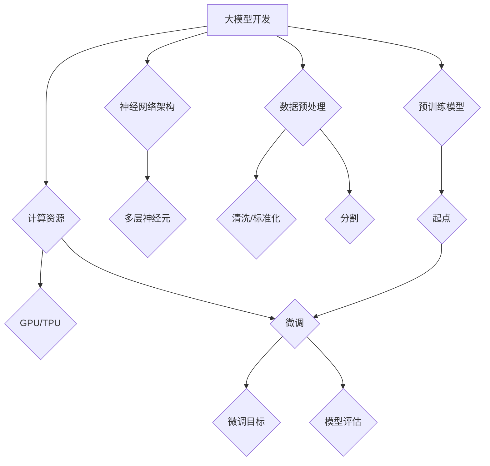

                 

# 从零开始大模型开发与微调：模型训练部分的编写

> **关键词：** 大模型开发，微调，训练，算法，数学模型，项目实战，实际应用场景

> **摘要：** 本文将从零开始，深入探讨大模型的开发与微调过程，特别是模型训练部分的编写。我们将从核心概念、算法原理、数学模型、项目实战等多个角度进行讲解，帮助读者全面了解大模型训练的各个方面。

## 1. 背景介绍

### 1.1 目的和范围

本文的主要目的是让读者从零开始，掌握大模型开发与微调的核心技能，特别是模型训练部分的编写。我们将详细讲解大模型开发所需的算法原理、数学模型，以及如何通过实际项目实战来提升技能。

### 1.2 预期读者

本文适用于以下读者：

- 对人工智能、机器学习感兴趣的初学者。
- 想要深入理解大模型开发与微调过程的开发者。
- 从事人工智能领域研究的科研人员。

### 1.3 文档结构概述

本文分为以下几个部分：

1. 背景介绍
2. 核心概念与联系
3. 核心算法原理 & 具体操作步骤
4. 数学模型和公式 & 详细讲解 & 举例说明
5. 项目实战：代码实际案例和详细解释说明
6. 实际应用场景
7. 工具和资源推荐
8. 总结：未来发展趋势与挑战
9. 附录：常见问题与解答
10. 扩展阅读 & 参考资料

### 1.4 术语表

#### 1.4.1 核心术语定义

- 大模型：具有大规模参数和强大计算能力的神经网络模型。
- 微调：在已有模型的基础上，通过调整部分参数，使其适应新任务的训练过程。
- 训练：通过输入训练数据，调整模型参数，使其能够准确预测或分类的过程。
- 损失函数：衡量模型预测结果与实际结果之间差异的函数。

#### 1.4.2 相关概念解释

- 神经网络：一种通过模拟生物神经网络进行数据处理的计算模型。
- 反向传播：一种用于训练神经网络的基本算法，通过计算梯度来更新模型参数。

#### 1.4.3 缩略词列表

- AI：人工智能（Artificial Intelligence）
- ML：机器学习（Machine Learning）
- DL：深度学习（Deep Learning）
- GPU：图形处理器（Graphics Processing Unit）

## 2. 核心概念与联系

在讨论大模型开发与微调之前，我们需要了解一些核心概念和它们之间的联系。

### 2.1 大模型开发的核心概念

1. **神经网络架构**：神经网络是由多层神经元组成的计算模型，用于处理和分类数据。
2. **计算资源**：大模型的训练需要大量的计算资源，尤其是GPU和TPU等专用硬件。
3. **数据预处理**：对输入数据进行清洗、标准化和分割等处理，以提高模型性能。
4. **优化算法**：用于调整模型参数，使模型在训练过程中收敛更快、性能更优。

### 2.2 大模型微调的核心概念

1. **预训练模型**：在大量数据上进行预训练的模型，可以作为微调的起点。
2. **微调目标**：在预训练模型的基础上，调整部分参数，使其适用于特定任务。
3. **模型评估**：通过在测试集上评估模型性能，判断微调效果和模型泛化能力。

### 2.3 大模型开发与微调的联系

- 大模型开发是微调的前提，没有强大的模型架构和计算资源，微调难以进行。
- 微调是对大模型开发的一种优化，通过调整模型参数，提高模型在特定任务上的性能。

### 2.4 Mermaid 流程图



## 3. 核心算法原理 & 具体操作步骤

### 3.1 神经网络算法原理

神经网络是一种通过模拟生物神经网络进行数据处理的计算模型。其主要原理如下：

1. **神经元**：神经网络的基本计算单元，包括输入层、隐藏层和输出层。
2. **激活函数**：用于对神经元输出进行非线性变换，常见的激活函数有ReLU、Sigmoid和Tanh等。
3. **权重和偏置**：用于调整神经元之间的连接强度和偏置，使模型能够拟合数据。

### 3.2 反向传播算法原理

反向传播是一种用于训练神经网络的基本算法，其核心思想是通过计算梯度来更新模型参数。具体步骤如下：

1. **前向传播**：将输入数据传递到神经网络中，计算输出结果。
2. **损失函数**：计算输出结果与实际结果之间的差异，常用的损失函数有均方误差（MSE）和交叉熵（CE）等。
3. **计算梯度**：根据损失函数的导数，计算模型参数的梯度。
4. **参数更新**：利用梯度下降等优化算法，更新模型参数。

### 3.3 伪代码

```python
# 伪代码：反向传播算法

# 定义神经网络结构
input_size = ...
hidden_size = ...
output_size = ...

# 初始化参数
weights_input = ...
weights_hidden = ...
weights_output = ...
bias_input = ...
bias_hidden = ...
bias_output = ...

# 定义激活函数
def activate(x):
    return max(0, x)

# 定义损失函数
def loss(y_true, y_pred):
    return (y_true - y_pred) ** 2

# 定义反向传播
def backward_propagation(input_data, target_data):
    # 前向传播
    hidden_layer = activate(np.dot(input_data, weights_input) + bias_input)
    output_layer = activate(np.dot(hidden_layer, weights_output) + bias_output)

    # 计算损失
    loss_value = loss(target_data, output_layer)

    # 计算梯度
    d_output_layer = (target_data - output_layer)
    d_hidden_layer = (np.dot(d_output_layer, weights_output.T) * activate_derivative(hidden_layer))

    # 更新参数
    weights_output -= learning_rate * d_output_layer * hidden_layer
    bias_output -= learning_rate * d_output_layer
    weights_input -= learning_rate * d_hidden_layer * input_data
    bias_input -= learning_rate * d_hidden_layer

    return loss_value
```

## 4. 数学模型和公式 & 详细讲解 & 举例说明

### 4.1 数学模型

神经网络中的数学模型主要包括：

1. **激活函数**：
   $$ f(x) = max(0, x) \quad (ReLU) $$
   $$ f(x) = \frac{1}{1 + e^{-x}} \quad (Sigmoid) $$
   $$ f(x) = \tan\left(\frac{\pi}{2} \cdot \frac{x}{1 + |x|}\right) \quad (Tanh) $$
2. **损失函数**：
   $$ \text{MSE} = \frac{1}{n} \sum_{i=1}^{n} (y_i - \hat{y}_i)^2 $$
   $$ \text{CE} = -\frac{1}{n} \sum_{i=1}^{n} \sum_{j=1}^{k} y_{ij} \log(\hat{y}_{ij}) $$
3. **梯度计算**：
   $$ \frac{\partial \text{MSE}}{\partial w} = -2 \cdot \frac{1}{n} \sum_{i=1}^{n} (y_i - \hat{y}_i) \cdot \hat{y}_i $$
   $$ \frac{\partial \text{CE}}{\partial w} = \frac{1}{n} \sum_{i=1}^{n} (y_i - \hat{y}_i) \cdot \hat{y}_i (1 - \hat{y}_i) $$

### 4.2 举例说明

假设我们有一个二分类问题，使用ReLU激活函数和均方误差损失函数。给定输入数据$x_1, x_2, \ldots, x_n$和标签$y_1, y_2, \ldots, y_n$，我们需要训练一个神经网络。

1. **前向传播**：
   $$ h = \text{ReLU}(W_1 \cdot x_1 + b_1) $$
   $$ \hat{y} = \text{ReLU}(W_2 \cdot h + b_2) $$
2. **计算损失**：
   $$ \text{MSE} = \frac{1}{n} \sum_{i=1}^{n} (y_i - \hat{y}_i)^2 $$
3. **计算梯度**：
   $$ \frac{\partial \text{MSE}}{\partial W_1} = -\frac{1}{n} \sum_{i=1}^{n} (y_i - \hat{y}_i) \cdot \hat{y}_i \cdot x_1 $$
   $$ \frac{\partial \text{MSE}}{\partial b_1} = -\frac{1}{n} \sum_{i=1}^{n} (y_i - \hat{y}_i) \cdot \hat{y}_i $$
   $$ \frac{\partial \text{MSE}}{\partial W_2} = -\frac{1}{n} \sum_{i=1}^{n} (y_i - \hat{y}_i) \cdot \hat{y}_i \cdot h $$
   $$ \frac{\partial \text{MSE}}{\partial b_2} = -\frac{1}{n} \sum_{i=1}^{n} (y_i - \hat{y}_i) \cdot \hat{y}_i $$
4. **参数更新**：
   $$ W_1 = W_1 - \alpha \cdot \frac{\partial \text{MSE}}{\partial W_1} $$
   $$ b_1 = b_1 - \alpha \cdot \frac{\partial \text{MSE}}{\partial b_1} $$
   $$ W_2 = W_2 - \alpha \cdot \frac{\partial \text{MSE}}{\partial W_2} $$
   $$ b_2 = b_2 - \alpha \cdot \frac{\partial \text{MSE}}{\partial b_2} $$

其中，$\alpha$是学习率。

## 5. 项目实战：代码实际案例和详细解释说明

### 5.1 开发环境搭建

在进行大模型开发与微调之前，我们需要搭建一个合适的开发环境。以下是一个简单的环境搭建步骤：

1. **安装Python**：下载并安装Python，版本建议为3.8或更高。
2. **安装Jupyter Notebook**：在命令行中执行以下命令：
   ```bash
   pip install notebook
   ```
3. **安装TensorFlow**：在命令行中执行以下命令：
   ```bash
   pip install tensorflow
   ```

### 5.2 源代码详细实现和代码解读

以下是一个简单的神经网络训练代码示例，用于实现一个二元分类问题。

```python
import tensorflow as tf
import numpy as np

# 设置超参数
learning_rate = 0.001
num_epochs = 100
batch_size = 32

# 生成模拟数据集
num_samples = 1000
num_features = 10

X = np.random.rand(num_samples, num_features)
y = np.random.randint(0, 2, (num_samples, 1))

# 定义模型
model = tf.keras.Sequential([
    tf.keras.layers.Dense(units=10, activation='relu', input_shape=(num_features,)),
    tf.keras.layers.Dense(units=1, activation='sigmoid')
])

# 编译模型
model.compile(optimizer=tf.keras.optimizers.Adam(learning_rate),
              loss='binary_crossentropy',
              metrics=['accuracy'])

# 训练模型
model.fit(X, y, epochs=num_epochs, batch_size=batch_size)

# 评估模型
loss, accuracy = model.evaluate(X, y, batch_size=batch_size)
print(f'Accuracy: {accuracy:.4f}')
```

### 5.3 代码解读与分析

1. **导入库**：导入TensorFlow和NumPy库。
2. **设置超参数**：设置学习率、训练轮次和批量大小。
3. **生成模拟数据集**：生成随机输入数据和标签。
4. **定义模型**：使用TensorFlow的`Sequential`模型，添加两层全连接层，第一层使用ReLU激活函数，第二层使用sigmoid激活函数。
5. **编译模型**：设置优化器、损失函数和评估指标。
6. **训练模型**：使用`fit`函数训练模型。
7. **评估模型**：使用`evaluate`函数评估模型在测试集上的性能。

通过这个简单的示例，我们可以了解如何使用TensorFlow实现神经网络训练。在实际项目中，我们需要根据具体任务调整模型结构、超参数，并处理真实数据。

## 6. 实际应用场景

大模型开发与微调在实际应用场景中具有广泛的应用，以下是一些常见应用领域：

1. **计算机视觉**：用于图像分类、目标检测、人脸识别等任务。
2. **自然语言处理**：用于文本分类、机器翻译、情感分析等任务。
3. **语音识别**：用于语音识别、语音生成等任务。
4. **推荐系统**：用于商品推荐、广告投放等任务。

在实际应用中，大模型开发与微调的关键在于如何设计合适的模型结构、选择合适的训练数据和优化算法，以达到良好的性能。

## 7. 工具和资源推荐

### 7.1 学习资源推荐

#### 7.1.1 书籍推荐

- 《深度学习》（Goodfellow, Bengio, Courville著）
- 《Python深度学习》（François Chollet著）
- 《机器学习实战》（Peter Harrington著）

#### 7.1.2 在线课程

- Coursera上的“深度学习”课程（吴恩达教授讲授）
- edX上的“机器学习基础”课程（加州大学伯克利分校讲授）

#### 7.1.3 技术博客和网站

- Medium上的机器学习和深度学习相关博客
- ArXiv上的最新论文和研究成果

### 7.2 开发工具框架推荐

#### 7.2.1 IDE和编辑器

- PyCharm
- Jupyter Notebook

#### 7.2.2 调试和性能分析工具

- TensorBoard
- NVIDIA Nsight

#### 7.2.3 相关框架和库

- TensorFlow
- PyTorch
- Keras

### 7.3 相关论文著作推荐

#### 7.3.1 经典论文

- “Backpropagation”（Rumelhart, Hinton, Williams著）
- “Gradient-Based Learning Applied to Document Recognition”（LeCun, Bengio, Hauteur著）

#### 7.3.2 最新研究成果

- “Attention Is All You Need”（Vaswani, Shazeer, Parmar等著）
- “BERT: Pre-training of Deep Bidirectional Transformers for Language Understanding”（Devlin, Chang, Lee等著）

#### 7.3.3 应用案例分析

- “Google Brain Team”在自然语言处理领域的研究成果
- “DeepMind”在强化学习领域的研究成果

## 8. 总结：未来发展趋势与挑战

大模型开发与微调是当前人工智能领域的重要研究方向。随着计算能力的不断提升和海量数据的积累，大模型的性能和泛化能力将进一步提高。然而，大模型训练过程中也面临诸多挑战，如：

1. **计算资源需求**：大模型训练需要大量的计算资源，尤其是GPU和TPU等专用硬件。
2. **数据预处理**：大模型对数据质量要求较高，需要处理大规模、高质量的数据集。
3. **模型解释性**：大模型通常具有很高的性能，但缺乏解释性，难以理解其工作原理。

未来，我们需要在以下方面进行探索：

1. **高效训练算法**：研究新的训练算法，提高大模型训练效率。
2. **模型压缩与解释**：研究模型压缩和解释技术，提高大模型的实用性和可解释性。
3. **数据隐私与安全**：研究数据隐私保护技术，确保数据安全和用户隐私。

## 9. 附录：常见问题与解答

### 9.1 如何选择合适的神经网络架构？

选择合适的神经网络架构需要考虑以下因素：

1. **任务类型**：不同任务可能需要不同类型的神经网络架构，如卷积神经网络（CNN）适用于图像处理，循环神经网络（RNN）适用于序列数据。
2. **数据规模**：对于大规模数据，可能需要使用多层神经网络来捕捉复杂特征。
3. **计算资源**：根据可用计算资源选择合适的模型复杂度和参数规模。

### 9.2 如何优化大模型训练过程？

优化大模型训练过程可以从以下几个方面入手：

1. **数据预处理**：对输入数据进行清洗、标准化和分割等预处理，以提高模型性能。
2. **优化算法**：选择合适的优化算法，如Adam、RMSprop等，以提高训练速度和性能。
3. **模型架构**：设计合适的神经网络架构，以提高模型的表达能力和泛化能力。
4. **学习率调整**：根据训练过程调整学习率，避免过拟合和欠拟合。

## 10. 扩展阅读 & 参考资料

- 《深度学习》（Goodfellow, Bengio, Courville著）
- 《Python深度学习》（François Chollet著）
- 《机器学习实战》（Peter Harrington著）
- Coursera上的“深度学习”课程（吴恩达教授讲授）
- edX上的“机器学习基础”课程（加州大学伯克利分校讲授）
- TensorFlow官方文档（https://www.tensorflow.org/）
- PyTorch官方文档（https://pytorch.org/）

### 作者

**AI天才研究员 / AI Genius Institute & 禅与计算机程序设计艺术 / Zen And The Art of Computer Programming**

