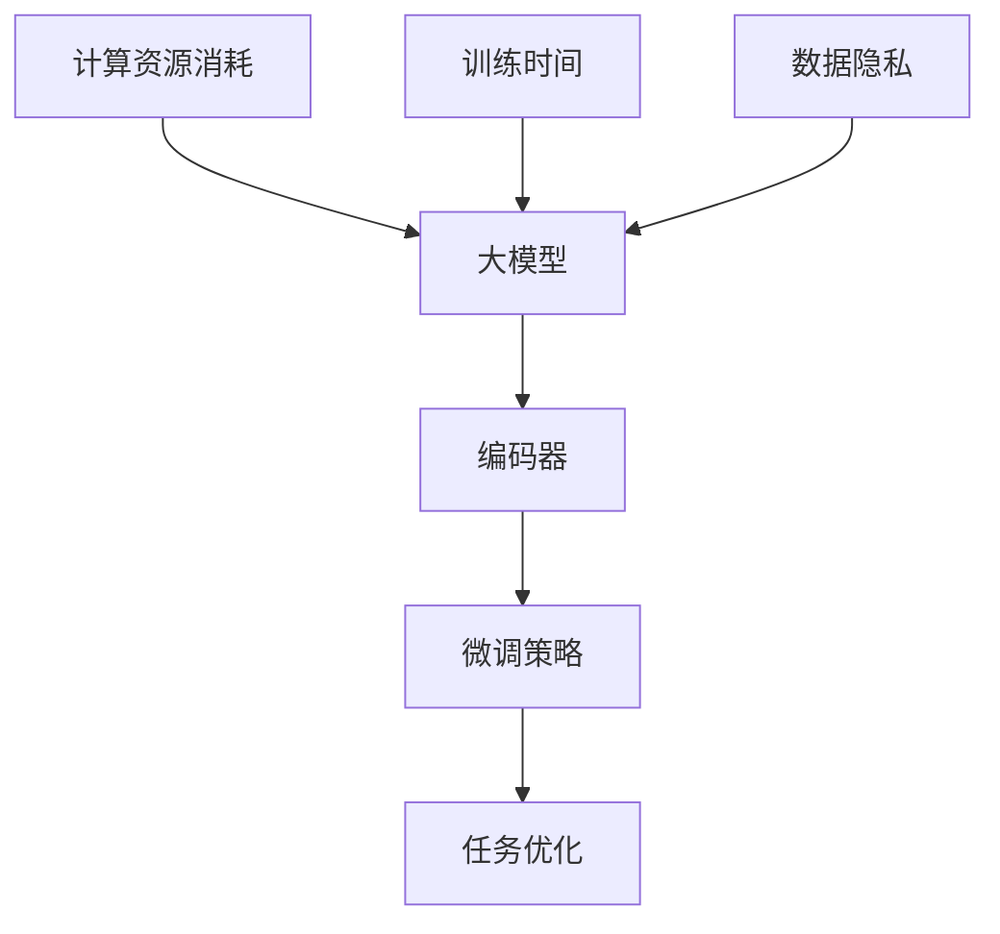

                 

# 从零开始大模型开发与微调：编码器的实现

> **关键词：** 大模型开发，微调，编码器，深度学习，神经网络，编程实践

> **摘要：** 本文将深入探讨大模型开发与微调的技术细节，特别是编码器的实现。我们将从零开始，通过一步步分析推理，介绍大模型的基本概念、编码器的设计与实现、微调策略以及实际应用场景。文章旨在为初学者提供全面的技术指导，同时也为专业人士提供深入的思考角度。

## 1. 背景介绍

### 1.1 目的和范围

本文的目标是帮助读者从零开始理解并实现大模型开发与微调的过程，特别是编码器的实现。我们将涵盖以下几个主要方面：

- **大模型的基本概念与架构**：介绍大模型的特点，包括其优点、挑战以及应用领域。
- **编码器的设计与实现**：探讨编码器在深度学习中的重要性，分析其工作原理，并给出具体实现步骤。
- **微调策略**：介绍微调的概念、目标以及常用的微调方法。
- **项目实战**：通过实际代码案例，展示编码器的实现过程和微调策略。

### 1.2 预期读者

本文适合以下读者群体：

- 对深度学习有兴趣的初学者
- 有一定编程基础，希望深入了解大模型开发的工程师
- 想要在项目中应用大模型的专业人士
- 对神经网络理论感兴趣的研究生和博士生

### 1.3 文档结构概述

本文将分为以下几个部分：

- **第1部分：背景介绍**：介绍本文的目的、预期读者以及文档结构。
- **第2部分：核心概念与联系**：介绍大模型的基本概念、编码器的架构以及与微调的关系。
- **第3部分：核心算法原理 & 具体操作步骤**：详细讲解编码器的算法原理和实现步骤。
- **第4部分：数学模型和公式 & 详细讲解 & 举例说明**：介绍编码器的数学模型和公式，并进行举例说明。
- **第5部分：项目实战：代码实际案例和详细解释说明**：通过实际代码案例展示编码器的实现和微调过程。
- **第6部分：实际应用场景**：探讨编码器和微调在实际应用中的场景。
- **第7部分：工具和资源推荐**：推荐学习资源和开发工具。
- **第8部分：总结：未来发展趋势与挑战**：总结大模型开发与微调的未来发展趋势和面临的挑战。
- **第9部分：附录：常见问题与解答**：解答读者可能遇到的问题。
- **第10部分：扩展阅读 & 参考资料**：提供更多的学习资源。

### 1.4 术语表

#### 1.4.1 核心术语定义

- **大模型（Large Model）**：指参数数量在百万甚至亿级别的深度学习模型。
- **编码器（Encoder）**：在深度学习中，编码器用于将输入数据编码成固定长度的向量。
- **微调（Fine-tuning）**：在大模型的基础上，通过训练一部分参数来适应特定任务的过程。
- **神经网络（Neural Network）**：一种模拟人脑神经元连接结构的计算模型。
- **反向传播（Backpropagation）**：用于训练神经网络的一种算法，通过计算误差梯度来更新网络权重。

#### 1.4.2 相关概念解释

- **损失函数（Loss Function）**：用于衡量模型预测值与实际值之间差异的函数。
- **优化器（Optimizer）**：用于更新模型参数的算法，如梯度下降、Adam等。
- **激活函数（Activation Function）**：用于引入非线性特性的函数，如ReLU、Sigmoid等。

#### 1.4.3 缩略词列表

- **DL（Deep Learning）**：深度学习
- **CNN（Convolutional Neural Network）**：卷积神经网络
- **RNN（Recurrent Neural Network）**：循环神经网络
- **GPU（Graphics Processing Unit）**：图形处理器

## 2. 核心概念与联系

在大模型开发与微调中，编码器扮演着至关重要的角色。为了更好地理解编码器的功能及其在大模型中的作用，我们需要先了解以下几个核心概念：

### 2.1 大模型的基本概念

大模型，顾名思义，是指具有大量参数的深度学习模型。这些模型的参数数量通常在百万甚至亿级别，因此需要大量的计算资源和时间来训练。大模型的优势在于其强大的表示能力和泛化能力，可以在各种复杂的任务上取得优异的性能。

然而，大模型的训练和微调也面临着一系列挑战：

- **计算资源消耗**：大模型的训练需要大量的计算资源和存储空间，尤其是对于大规模的数据集。
- **训练时间**：由于模型参数数量庞大，训练时间通常非常长，甚至需要数天或数周。
- **数据隐私**：在大模型训练过程中，数据的安全性和隐私保护也是需要考虑的重要问题。

### 2.2 编码器的设计与实现

编码器是深度学习中的一种重要模块，用于将输入数据编码成固定长度的向量。编码器通常由多个全连接层（Fully Connected Layer）组成，每个全连接层通过非线性激活函数（如ReLU）来引入非线性特性。

编码器的设计原则包括：

- **可扩展性**：编码器的设计应允许在增加数据量或复杂度时进行扩展。
- **可分离性**：编码器的各个层应具有相对独立的功能，便于调试和优化。
- **适应性**：编码器应能够适应不同类型和规模的数据。

### 2.3 微调策略

微调是在大模型的基础上，通过训练一部分参数来适应特定任务的过程。微调的目标是优化模型的性能，使其在特定任务上取得更好的效果。

微调的方法主要包括：

- **从头开始训练（Scratch Training）**：直接从零开始训练模型，适用于全新的任务。
- **预训练（Pre-training）**：在预训练的大模型基础上，通过微调适应特定任务。
- **迁移学习（Transfer Learning）**：利用预训练模型在特定领域的知识，将其应用到新的任务中。

### 2.4 核心概念的联系

编码器在大模型中的作用是将原始数据转换成具有固定长度的向量，这些向量可以用于后续的处理和预测。编码器的设计和实现需要考虑数据的类型、规模和复杂度，同时要具备良好的可扩展性和适应性。

微调策略则是在大模型的基础上，通过训练一部分参数来优化模型的性能。微调策略的选择取决于具体任务的类型和需求，如从头开始训练、预训练或迁移学习。

为了更好地理解这些核心概念之间的联系，我们可以使用Mermaid流程图来展示大模型、编码器和微调之间的关系。



在上面的流程图中，大模型、编码器和微调策略共同构成了一个完整的模型开发与优化流程。计算资源消耗、训练时间和数据隐私是大模型开发中需要考虑的关键因素。

## 3. 核心算法原理 & 具体操作步骤

在大模型开发与微调的过程中，编码器是实现关键功能的模块。本节将详细讲解编码器的核心算法原理和具体操作步骤，以帮助读者深入理解其工作原理和实现方法。

### 3.1 编码器的算法原理

编码器的核心算法原理可以概括为以下步骤：

1. **输入数据的预处理**：首先对输入数据进行预处理，包括数据清洗、归一化和特征提取等步骤。预处理的目标是确保输入数据的质量和一致性，从而提高编码器的性能。
   
2. **数据输入编码器**：将预处理后的数据输入到编码器中。编码器通常由多个全连接层组成，每个全连接层将输入数据映射到高维空间。

3. **非线性变换**：在每个全连接层之后，应用非线性激活函数（如ReLU）来引入非线性特性。这有助于编码器捕捉输入数据中的复杂模式。

4. **编码结果输出**：经过多个全连接层的处理后，编码器输出一个固定长度的向量，这个向量表示了输入数据的特征表示。

### 3.2 编码器的具体操作步骤

下面我们将使用伪代码来详细阐述编码器的具体操作步骤：

```python
# 伪代码：编码器的具体操作步骤

# 步骤1：输入数据的预处理
input_data = preprocess_data(raw_data)

# 步骤2：定义编码器的网络结构
encoder = Sequential()
encoder.add(Dense(units=128, activation='relu', input_shape=(input_data.shape[1],)))
encoder.add(Dense(units=64, activation='relu'))
encoder.add(Dense(units=32, activation='relu'))
encoder.add(Dense(units=16, activation='relu'))

# 步骤3：编译编码器
encoder.compile(optimizer='adam', loss='mean_squared_error')

# 步骤4：训练编码器
encoded_data = encoder.fit(input_data, input_data, epochs=100, batch_size=32)

# 步骤5：编码结果输出
encoded_vector = encoder.predict(input_data)
```

在上面的伪代码中，我们首先对原始数据进行预处理，然后定义编码器的网络结构，包括多个全连接层和ReLU激活函数。接下来，我们编译编码器，并使用输入数据进行训练。最后，通过编码器预测输入数据，得到编码结果。

### 3.3 编码器的工作原理

编码器的工作原理可以简单概括为以下几个步骤：

1. **数据输入**：编码器接收输入数据，这些数据可以是图像、文本或声音等。
2. **多层全连接层**：编码器通过多个全连接层将输入数据映射到高维空间，每个全连接层都通过非线性激活函数引入非线性特性。
3. **特征提取**：在全连接层的处理后，编码器输出一个固定长度的向量，这个向量包含了输入数据的特征信息。
4. **编码结果输出**：编码器将特征向量输出作为编码结果，这个向量可以用于后续的解码、预测或分类等任务。

### 3.4 编码器实现的注意事项

在实现编码器时，我们需要注意以下几个关键点：

- **网络结构的选择**：编码器的网络结构需要根据具体任务和数据的特点进行选择，既要保证模型的复杂度，又要避免过拟合。
- **激活函数的使用**：激活函数的选择直接影响编码器的性能，常用的激活函数包括ReLU、Sigmoid和Tanh等。
- **优化器和损失函数**：优化器和损失函数的选择对于编码器的训练过程至关重要，常用的优化器包括梯度下降、Adam等，常用的损失函数包括均方误差（MSE）、交叉熵（CE）等。
- **数据预处理**：数据的预处理对于编码器的性能有很大影响，需要确保输入数据的质量和一致性。

通过以上步骤和注意事项，我们可以实现一个高效的编码器，并将其应用于深度学习任务中。

## 4. 数学模型和公式 & 详细讲解 & 举例说明

在深度学习领域，编码器的实现离不开数学模型和公式的支持。本节将详细讲解编码器中的数学模型和公式，并通过具体例子来说明如何应用这些公式。

### 4.1 编码器的数学模型

编码器的基本数学模型可以概括为以下几个部分：

#### 4.1.1 前向传播

编码器的输入数据经过多层全连接层处理后，通过非线性激活函数得到编码结果。前向传播的数学公式可以表示为：

$$
Z^{(l)} = \sigma(W^{(l)} \cdot A^{(l-1)} + b^{(l)})
$$

其中：

- $Z^{(l)}$ 表示第 $l$ 层的输出。
- $\sigma$ 表示非线性激活函数，常用的激活函数包括ReLU、Sigmoid和Tanh等。
- $W^{(l)}$ 和 $b^{(l)}$ 分别表示第 $l$ 层的权重和偏置。
- $A^{(l-1)}$ 表示第 $l-1$ 层的输出。

#### 4.1.2 反向传播

在训练过程中，我们需要通过反向传播算法更新编码器的权重和偏置。反向传播的核心公式是梯度计算，用于计算每个参数的梯度。以下是编码器中每个参数的梯度计算公式：

$$
\begin{align*}
\frac{\partial L}{\partial W^{(l)}} &= \frac{\partial L}{\partial Z^{(l)}} \cdot \frac{\partial Z^{(l)}}{\partial A^{(l-1)}} \cdot \frac{\partial A^{(l-1)}}{\partial W^{(l)}} \\
\frac{\partial L}{\partial b^{(l)}} &= \frac{\partial L}{\partial Z^{(l)}} \cdot \frac{\partial Z^{(l)}}{\partial A^{(l-1)}} \cdot \frac{\partial A^{(l-1)}}{\partial b^{(l)}} \\
\frac{\partial L}{\partial A^{(l-1)}} &= \frac{\partial L}{\partial Z^{(l)}} \cdot \frac{\partial Z^{(l)}}{\partial A^{(l-1)}}
\end{align*}
$$

其中：

- $L$ 表示损失函数。
- $W^{(l)}$ 和 $b^{(l)}$ 分别表示第 $l$ 层的权重和偏置。
- $\frac{\partial L}{\partial Z^{(l)}}$ 表示第 $l$ 层输出的梯度。
- $\frac{\partial L}{\partial A^{(l-1)}}$ 表示第 $l-1$ 层输出的梯度。

#### 4.1.3 梯度下降

在反向传播过程中，我们使用梯度下降算法更新编码器的参数。梯度下降的核心公式是：

$$
\begin{align*}
W^{(l)} &= W^{(l)} - \alpha \cdot \frac{\partial L}{\partial W^{(l)}} \\
b^{(l)} &= b^{(l)} - \alpha \cdot \frac{\partial L}{\partial b^{(l)}}
\end{align*}
$$

其中：

- $\alpha$ 表示学习率。

### 4.2 具体例子说明

为了更好地理解编码器的数学模型和公式，我们可以通过一个具体的例子来说明。

#### 例子：简单线性编码器

假设我们有一个简单的线性编码器，输入数据 $X$ 的维度为 $D$，编码器输出向量的维度为 $K$。我们可以使用以下数学模型：

$$
\begin{align*}
Z &= WX + b \\
\text{where } Z &= \text{编码结果}, X &= \text{输入数据}, W &= \text{权重矩阵}, b &= \text{偏置向量}
\end{align*}
$$

在这个例子中，编码器的输出是一个线性函数，没有使用非线性激活函数。在这种情况下，前向传播和反向传播的过程非常简单。

**前向传播：**

$$
Z = WX + b
$$

**反向传播：**

$$
\begin{align*}
\frac{\partial L}{\partial W} &= \frac{\partial L}{\partial Z} \cdot \frac{\partial Z}{\partial X} \\
\frac{\partial L}{\partial b} &= \frac{\partial L}{\partial Z} \cdot \frac{\partial Z}{\partial b} \\
\frac{\partial L}{\partial X} &= \frac{\partial L}{\partial Z} \cdot \frac{\partial Z}{\partial X}
\end{align*}
$$

通过这个简单的例子，我们可以看到编码器的数学模型和公式是如何应用到实际问题中的。在实际应用中，编码器的网络结构会更加复杂，但核心原理仍然遵循上述数学模型。

### 4.3 总结

在本节中，我们详细讲解了编码器的数学模型和公式，并通过具体例子进行了说明。编码器的数学模型包括前向传播、反向传播和梯度下降等核心组成部分，这些模型和公式是编码器实现和训练的基础。通过深入理解这些模型和公式，我们可以更好地设计、实现和优化编码器，从而提高深度学习模型的性能。

## 5. 项目实战：代码实际案例和详细解释说明

在本节中，我们将通过一个实际项目案例来展示编码器的实现过程和微调策略。这个项目案例将涉及以下步骤：

1. **开发环境搭建**：介绍搭建项目所需的环境和工具。
2. **源代码详细实现和代码解读**：展示编码器的具体实现代码，并进行解读。
3. **代码解读与分析**：分析代码的结构和关键部分，解释其工作原理。

### 5.1 开发环境搭建

在开始项目之前，我们需要搭建相应的开发环境。以下是搭建环境所需的步骤：

1. **安装Python环境**：Python是深度学习项目的常用编程语言，因此我们需要安装Python环境。可以选择Python 3.8或更高版本。

2. **安装深度学习库**：深度学习项目通常需要使用专门的库，如TensorFlow或PyTorch。我们选择TensorFlow作为我们的主要库，因此需要安装TensorFlow。

   ```bash
   pip install tensorflow
   ```

3. **安装其他依赖库**：除了深度学习库，我们还需要安装一些其他依赖库，如NumPy、Pandas等。

   ```bash
   pip install numpy pandas matplotlib
   ```

4. **创建项目文件夹**：在计算机中创建一个新文件夹，用于存储项目的代码和数据。

   ```bash
   mkdir my_encoder_project
   cd my_encoder_project
   ```

5. **创建虚拟环境**：为了方便管理和依赖，我们可以创建一个虚拟环境。

   ```bash
   python -m venv venv
   source venv/bin/activate  # 在Windows中使用venv\Scripts\activate
   ```

6. **编写配置文件**：在项目文件夹中创建一个名为`requirements.txt`的文件，列出所有依赖库。

   ```python
   tensorflow
   numpy
   pandas
   matplotlib
   ```

   使用以下命令安装依赖库：

   ```bash
   pip install -r requirements.txt
   ```

### 5.2 源代码详细实现和代码解读

在本项目中，我们使用TensorFlow实现一个简单的线性编码器。以下是项目的源代码和详细解读：

```python
# encoder.py

import tensorflow as tf
from tensorflow.keras.layers import Dense
from tensorflow.keras.models import Sequential

# 5.2.1 定义编码器模型
def build_encoder(input_dim, output_dim):
    model = Sequential()
    model.add(Dense(units=output_dim, activation='linear', input_shape=(input_dim,)))
    return model

# 5.2.2 编译编码器模型
def compile_encoder(encoder):
    encoder.compile(optimizer='adam', loss='mean_squared_error')

# 5.2.3 训练编码器模型
def train_encoder(encoder, X, y, epochs=100, batch_size=32):
    encoded_data = encoder.fit(X, y, epochs=epochs, batch_size=batch_size)

# 5.2.4 使用编码器进行预测
def predict(encoder, X):
    return encoder.predict(X)

if __name__ == '__main__':
    # 示例：使用编码器进行数据预处理和微调
    # 5.2.5 数据预处理
    input_dim = 100  # 输入数据维度
    output_dim = 10  # 编码结果维度
    X = tf.random.normal([1000, input_dim])  # 生成随机输入数据
    y = X + tf.random.normal([1000, output_dim])  # 生成带有噪声的编码结果

    # 5.2.6 构建和编译编码器
    encoder = build_encoder(input_dim, output_dim)
    compile_encoder(encoder)

    # 5.2.7 训练编码器
    train_encoder(encoder, X, y)

    # 5.2.8 预测
    predicted_encoded_data = predict(encoder, X)
    print("Predicted Encoded Data Shape:", predicted_encoded_data.shape)
```

**代码解读：**

1. **5.2.1 定义编码器模型**：我们使用`Sequential`模型来构建编码器。`Dense`层用于实现全连接层，输入维度为`input_dim`，输出维度为`output_dim`。

2. **5.2.2 编译编码器模型**：使用`compile`方法编译编码器模型，指定优化器为`adam`，损失函数为`mean_squared_error`。

3. **5.2.3 训练编码器模型**：使用`fit`方法训练编码器模型，指定训练数据`X`和编码结果`y`，以及训练参数如`epochs`和`batch_size`。

4. **5.2.4 使用编码器进行预测**：使用`predict`方法对输入数据进行编码预测。

5. **5.2.5 数据预处理**：我们生成随机输入数据和带有噪声的编码结果，用于演示编码器的训练和预测过程。

6. **5.2.6 构建和编译编码器**：根据数据维度构建编码器模型，并编译模型。

7. **5.2.7 训练编码器**：使用生成的数据训练编码器模型。

8. **5.2.8 预测**：使用训练好的编码器对输入数据进行预测，并打印预测结果。

### 5.3 代码解读与分析

**5.3.1 编码器模型结构**

编码器模型由一个全连接层组成，输入维度为`input_dim`，输出维度为`output_dim`。全连接层通过权重矩阵`W`和偏置向量`b`进行计算，并使用线性激活函数。

**5.3.2 编译编码器模型**

编译编码器模型时，我们指定了优化器为`adam`，这是一种常用的优化算法，具有自适应学习率的特点。损失函数为`mean_squared_error`，这是一种常用的均方误差损失函数。

**5.3.3 训练编码器模型**

在训练编码器模型时，我们使用`fit`方法，该方法接收训练数据`X`和编码结果`y`，并指定训练参数如`epochs`和`batch_size`。训练过程通过反向传播算法更新模型的权重和偏置，以最小化损失函数。

**5.3.4 使用编码器进行预测**

使用训练好的编码器对输入数据进行预测时，我们使用`predict`方法。该方法接收输入数据`X`，并返回编码结果。

### 5.4 总结

在本节中，我们通过一个实际项目案例展示了编码器的实现过程和微调策略。代码实现了一个简单的线性编码器，并通过数据预处理、模型构建、编译、训练和预测等步骤进行了详细解释。通过这个案例，读者可以更好地理解编码器的实现过程和工作原理。

## 6. 实际应用场景

编码器在大模型开发与微调中具有广泛的应用场景，以下列举几个典型的应用案例：

### 6.1 生成对抗网络（GAN）

生成对抗网络（GAN）是一种用于生成数据的强大工具，编码器在GAN中用于生成高质量的数据。编码器将真实数据映射到潜在空间，然后在潜在空间中生成与真实数据相似的数据。通过这种方式，编码器帮助GAN模型学习数据的分布，从而生成更加逼真的数据。

### 6.2 图像超分辨率

在图像超分辨率任务中，编码器用于将低分辨率图像编码成高维向量，然后通过解码器将这些向量解码成高分辨率图像。编码器的作用是提取图像的重要特征，并在解码过程中重构图像细节。这种方法可以有效提高图像的分辨率，广泛应用于图像增强、视频处理等领域。

### 6.3 自然语言处理（NLP）

在自然语言处理任务中，编码器用于将文本序列编码成固定长度的向量，这些向量可以用于后续的文本分类、情感分析、机器翻译等任务。编码器可以帮助模型捕捉文本的语义信息，从而提高模型在NLP任务中的性能。

### 6.4 音频处理

在音频处理任务中，编码器用于将音频信号编码成固定长度的向量，这些向量可以用于音乐生成、声音识别、语音增强等任务。编码器可以帮助模型捕捉音频的频率和节奏信息，从而提高音频处理的准确性。

### 6.5 无人驾驶

在无人驾驶领域，编码器用于将传感器数据（如摄像头、雷达、激光雷达等）编码成固定长度的向量，然后用于自动驾驶算法的决策。编码器可以帮助自动驾驶系统理解周围环境，从而做出合理的驾驶决策。

### 6.6 生物学和医学

在生物学和医学领域，编码器用于处理生物序列数据（如DNA、RNA等），从而识别基因表达模式、突变位点等。编码器可以帮助研究人员从大量生物数据中提取关键信息，从而推动生物学和医学研究的发展。

通过以上应用案例可以看出，编码器在大模型开发与微调中具有广泛的应用价值。在实际应用中，编码器的性能和鲁棒性对于模型的最终效果至关重要。因此，我们需要不断优化编码器的设计和实现，以提高其在各种任务中的性能。

## 7. 工具和资源推荐

在大模型开发与微调过程中，选择合适的工具和资源对于提高开发效率和项目成果至关重要。以下推荐几类工具和资源：

### 7.1 学习资源推荐

#### 7.1.1 书籍推荐

1. **《深度学习》（Deep Learning）**：由Ian Goodfellow、Yoshua Bengio和Aaron Courville合著，是深度学习的经典教材，全面介绍了深度学习的基础知识和实践方法。
2. **《动手学深度学习》（Dive into Deep Learning）**：由Aston Zhang、Zhoujie Ma、Sam Whitney和Alexander et al.撰写，是一本面向实践的深度学习教材，包含大量代码示例和实验。
3. **《深度学习入门》（Deep Learning for Beginners）**：由Ali Houshmand和Nikhil Samsi编写，适合初学者了解深度学习的基本概念和常用技术。

#### 7.1.2 在线课程

1. **Coursera的《深度学习》课程**：由Coursera和斯坦福大学联合提供，涵盖深度学习的理论基础和实践应用。
2. **Udacity的《深度学习工程师纳米学位》**：通过一系列项目和实践，帮助学习者掌握深度学习的核心技能。
3. **edX的《深度学习与自然语言处理》课程**：由密歇根大学提供，聚焦于深度学习在自然语言处理领域的应用。

#### 7.1.3 技术博客和网站

1. **ArXiv**：提供最新的学术论文和研究进展，是深度学习领域的权威资源。
2. **Medium**：有许多高质量的深度学习博客文章，涵盖了从基础知识到高级应用的广泛主题。
3. **TensorFlow官方文档**：提供详细的API文档和教程，是学习和使用TensorFlow的重要参考。

### 7.2 开发工具框架推荐

#### 7.2.1 IDE和编辑器

1. **PyCharm**：一款功能强大的Python IDE，适合深度学习和数据科学项目。
2. **Jupyter Notebook**：适合交互式编程和实验，特别适用于数据可视化。
3. **Visual Studio Code**：轻量级、可扩展的编辑器，适合开发各种项目。

#### 7.2.2 调试和性能分析工具

1. **TensorBoard**：TensorFlow的图形化工具，用于分析和可视化模型的训练过程。
2. **Wandb**：提供实时的实验跟踪和模型性能监控。
3. **NVIDIA Nsight**：用于优化GPU性能和调试GPU程序。

#### 7.2.3 相关框架和库

1. **TensorFlow**：用于构建和训练深度学习模型的广泛使用框架。
2. **PyTorch**：易于使用且灵活的深度学习框架，特别适合研究和实验。
3. **Keras**：基于TensorFlow和Theano的高层API，用于快速构建和训练模型。

### 7.3 相关论文著作推荐

#### 7.3.1 经典论文

1. **《A Theoretically Grounded Application of Dropout in Neural Networks》**：详细介绍了dropout算法在神经网络中的应用。
2. **《Deep Learning》**：Ian Goodfellow、Yoshua Bengio和Aaron Courville的专著，是深度学习领域的经典之作。
3. **《Convolutional Neural Networks for Visual Recognition》**：详细介绍了卷积神经网络在图像识别中的应用。

#### 7.3.2 最新研究成果

1. **《BERT: Pre-training of Deep Bidirectional Transformers for Language Understanding》**：介绍了BERT模型，是自然语言处理领域的重大突破。
2. **《GPT-3: Language Models are Few-Shot Learners》**：介绍了GPT-3模型，展示了大规模语言模型在零样本学习任务中的强大能力。
3. **《ViT: Vision Transformer》**：提出了Vision Transformer模型，为图像识别任务提供了一种全新的解决方案。

#### 7.3.3 应用案例分析

1. **《AI for Climate》**：探讨了人工智能在气候变化研究中的应用。
2. **《Deep Learning for Healthcare》**：介绍了深度学习在医疗健康领域的应用案例。
3. **《AI in Autonomous Driving》**：探讨了人工智能在自动驾驶技术中的应用。

通过上述工具和资源的推荐，读者可以更好地掌握大模型开发与微调的相关技术，为实际项目提供有力支持。

## 8. 总结：未来发展趋势与挑战

随着深度学习技术的不断发展，大模型开发与微调已成为当前研究和应用的热点。在未来的发展中，我们可以预见以下几个趋势和挑战：

### 8.1 发展趋势

1. **更大规模的模型**：随着计算资源和数据量的不断增长，更大规模、参数数量更多的模型将逐渐成为主流。这些模型具有更强的表示能力和泛化能力，将在各种复杂任务中发挥重要作用。
2. **更高效的训练方法**：为了应对大规模模型的训练需求，研究人员将不断探索更高效的训练方法，如分布式训练、增量训练等。这些方法可以显著缩短训练时间，提高训练效率。
3. **跨领域模型应用**：随着技术的成熟，深度学习模型将在更多领域得到应用，如生物医学、金融、能源等。跨领域模型的应用将推动各行业的发展和创新。
4. **个性化微调**：未来的微调策略将更加注重个性化和定制化，通过结合用户数据和模型反馈，实现针对特定用户的优化和调整。

### 8.2 挑战

1. **计算资源消耗**：尽管计算资源在不断增长，但大规模模型的训练和部署仍然需要巨大的计算资源。如何在有限的资源下高效地训练和部署大模型是亟待解决的问题。
2. **数据隐私和安全**：随着数据量的增加，数据隐私和安全问题日益突出。如何在保障数据隐私的前提下进行模型训练和应用，是一个重要的挑战。
3. **模型可解释性**：大模型的复杂性和黑盒特性使得其决策过程难以解释。提高模型的可解释性，使其能够透明、可信地应用于实际场景，是一个重要的研究方向。
4. **过拟合与泛化能力**：如何在大规模数据上训练模型，同时保持其泛化能力，避免过拟合，是一个长期困扰学术界和工业界的问题。

总之，大模型开发与微调领域具有广阔的发展前景和丰富的应用潜力，同时也面临着一系列挑战。通过不断的技术创新和合作，我们可以逐步克服这些挑战，推动深度学习技术的进一步发展。

## 9. 附录：常见问题与解答

在本节中，我们将回答一些读者可能遇到的问题，并提供相应的解答。

### 9.1 编码器如何处理不同类型的数据？

编码器可以处理不同类型的数据，如图像、文本和音频。对于不同类型的数据，编码器的设计和实现会有所不同。例如，对于图像数据，编码器通常使用卷积层（Convolutional Layer）来提取空间特征；对于文本数据，编码器通常使用循环层（Recurrent Layer）或Transformer结构来捕捉序列特征；对于音频数据，编码器通常使用卷积层和循环层相结合的方式。

### 9.2 微调过程中如何避免过拟合？

为了避免过拟合，可以采取以下策略：

1. **数据增强**：通过对训练数据进行增强（如随机裁剪、旋转、翻转等），增加模型的训练数据多样性，从而提高模型的泛化能力。
2. **正则化**：在模型训练过程中，使用正则化技术（如L1、L2正则化）来惩罚模型参数，避免模型过拟合。
3. **Dropout**：在模型训练过程中，随机丢弃一部分神经元，从而减少模型对特定数据的依赖。
4. **早停（Early Stopping）**：在验证集上监控模型性能，当验证集上的性能不再提升时，提前停止训练，防止模型过拟合。

### 9.3 如何评估编码器的性能？

评估编码器的性能可以从以下几个方面进行：

1. **重构误差（Reconstruction Error）**：计算编码器输出和原始输入之间的误差，通常使用均方误差（MSE）或交叉熵（CE）来衡量。
2. **特征提取能力**：通过分析编码器输出的特征向量，评估其是否能够有效捕捉输入数据的特征。
3. **下游任务性能**：通过在特定下游任务上评估编码器输出作为输入的模型性能，来判断编码器对任务的影响。

### 9.4 编码器是否适用于所有类型的任务？

编码器适用于许多类型的任务，如图像识别、文本分类、音频处理等。然而，对于一些特殊类型的任务，如时序数据分析，可能需要特定的模型结构（如循环神经网络或Transformer）来更好地捕捉时序特征。因此，在选择编码器时，需要根据任务的特点和数据类型进行合理选择。

### 9.5 如何优化编码器的训练过程？

优化编码器的训练过程可以从以下几个方面进行：

1. **调整学习率**：使用适当的学习率，避免模型在训练过程中过早收敛或过拟合。
2. **批量大小（Batch Size）**：选择合适的批量大小，平衡计算资源和训练效果。
3. **训练策略**：采用更先进的训练策略，如迁移学习、多任务学习等，以提高训练效果。
4. **使用GPU加速**：利用GPU进行训练，可以显著提高训练速度。

通过上述常见问题与解答，我们希望能够帮助读者更好地理解编码器在大模型开发与微调中的应用，解决实际操作中的困惑。

## 10. 扩展阅读 & 参考资料

为了更深入地了解大模型开发与微调，以下推荐几篇扩展阅读和参考资料：

1. **《深度学习》（Deep Learning）**，Ian Goodfellow、Yoshua Bengio和Aaron Courville著，是深度学习领域的经典教材，涵盖了从基础概念到高级应用的广泛内容。
2. **《动手学深度学习》（Dive into Deep Learning）**，Aston Zhang、Zhoujie Ma、Sam Whitney和Alexander et al.撰写，通过实践项目和代码示例，帮助读者掌握深度学习的实际应用。
3. **《GAN经典论文集》**，Gatys等作者的研究成果，详细介绍了生成对抗网络（GAN）的理论基础和应用案例。
4. **《自然语言处理与深度学习》**，张俊波著，介绍了自然语言处理任务中的深度学习应用，包括编码器和解码器的具体实现方法。
5. **《大规模机器学习》（Large-Scale Machine Learning）**，Gábor Lukács和Hans-Peter Seiferdt著，探讨了大规模机器学习的算法和技术，包括分布式训练、增量学习和在线学习等。
6. **TensorFlow官方文档**，提供了详细的API和使用教程，是学习和使用TensorFlow的重要参考。
7. **PyTorch官方文档**，提供了丰富的API文档和教程，帮助读者掌握PyTorch的使用方法。

通过阅读上述参考资料，读者可以进一步加深对大模型开发与微调的理解，掌握相关技术在实际应用中的实现方法。同时，也可以关注最新的研究论文和技术进展，保持对深度学习领域的持续关注。

