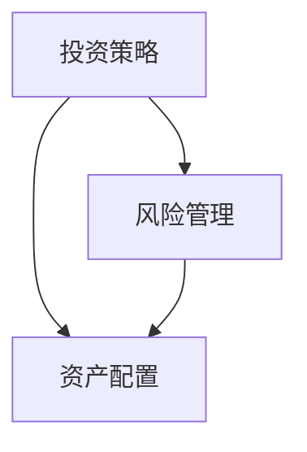

                 

# 从零开始：程序员的理财之路

## 关键词：
理财、投资、风险管理、资产配置、财务自由

> 摘要：
本篇技术博客将带领程序员从零开始，深入了解理财的基本概念和方法。通过对投资策略、风险管理和资产配置的逐步探讨，我们将为程序员提供一套实用的理财方案，助力他们在财务自由的路上稳步前行。

## 1. 背景介绍

### 1.1 目的和范围

本文旨在为程序员提供一套系统化的理财知识框架，帮助他们在日常工作和收入之外，掌握理财的基本技能，实现财务自由。文章将涵盖投资策略、风险管理和资产配置等方面的内容，旨在提高程序员的理财意识和能力。

### 1.2 预期读者

本文适用于有一定编程基础，但缺乏理财经验的程序员。无论是职场新人，还是有一定工作经验的程序员，都可以通过本文的学习，提高自己的理财水平。

### 1.3 文档结构概述

本文分为以下十个部分：

1. 背景介绍
2. 核心概念与联系
3. 核心算法原理 & 具体操作步骤
4. 数学模型和公式 & 详细讲解 & 举例说明
5. 项目实战：代码实际案例和详细解释说明
6. 实际应用场景
7. 工具和资源推荐
8. 总结：未来发展趋势与挑战
9. 附录：常见问题与解答
10. 扩展阅读 & 参考资料

### 1.4 术语表

#### 1.4.1 核心术语定义

- 投资策略：投资者在投资过程中所采用的基本原则和方法。
- 风险管理：投资者在投资过程中，对潜在风险进行识别、评估和控制的过程。
- 资产配置：投资者将资金分配到不同类型的资产中，以实现投资目标的过程。

#### 1.4.2 相关概念解释

- 股票：一种证券，代表投资者对公司的所有权。
- 债券：一种债务工具，发行者向投资者承诺在一定期限内支付利息和本金。
- 基金：一种投资工具，由多个投资者共同出资，由基金经理进行投资管理。

#### 1.4.3 缩略词列表

- ETF：交易型开放式指数基金
- QDII：合格境内机构投资者
- P2P：点对点借贷

## 2. 核心概念与联系

在探讨程序员的理财之路之前，我们需要先了解一些核心概念和它们之间的联系。以下是一个简单的 Mermaid 流程图，展示了投资、风险管理和资产配置之间的关系：



### 投资策略

投资策略是指投资者在投资过程中所采用的基本原则和方法。一个有效的投资策略应该考虑以下因素：

- 投资目标：投资者希望通过投资实现的目标，如资产增值、保值或退休规划等。
- 投资期限：投资者期望投资的时间范围。
- 风险承受能力：投资者对风险的接受程度。
- 投资工具：投资者选择的投资品种，如股票、债券、基金等。

### 风险管理

风险管理是投资者在投资过程中，对潜在风险进行识别、评估和控制的过程。有效的风险管理有助于投资者降低投资损失，提高投资回报。以下是一些常见的风险管理方法：

- 分散投资：通过投资多种资产，降低单一资产的风险。
- 定期调仓：根据市场情况，适时调整投资组合，降低风险。
- 做好止损：在投资过程中，设定止损点，以防止投资损失扩大。

### 资产配置

资产配置是指投资者将资金分配到不同类型的资产中，以实现投资目标的过程。合理的资产配置有助于投资者实现风险和收益的平衡。以下是一些常见的资产配置策略：

- 保守型：以低风险资产为主，如债券、储蓄等。
- 稳健型：以平衡型资产为主，如股票、基金等。
- 冒险型：以高风险资产为主，如股票、期货等。

## 3. 核心算法原理 & 具体操作步骤

在了解核心概念之后，我们将探讨如何运用这些概念进行理财。以下是一个简单的伪代码，展示了如何制定投资策略、风险管理和资产配置的具体操作步骤：

```python
# 定义投资策略
def set_investment_strategy(investment_objective, investment_term, risk_tolerance):
    # 根据投资目标、投资期限和风险承受能力，选择合适的投资工具
    investment_tool = select_investment_tool(investment_objective, investment_term, risk_tolerance)
    return investment_tool

# 定义风险管理
def manage_risk(investment_tool):
    # 根据投资工具，采取相应的风险管理方法
    risk_management_method = select_risk_management_method(investment_tool)
    return risk_management_method

# 定义资产配置
def asset_allocation(investment_tool, investment_amount):
    # 根据投资工具和投资金额，进行资产配置
    asset_allocation_plan = create_asset_allocation_plan(investment_tool, investment_amount)
    return asset_allocation_plan

# 主函数
def main():
    # 设定投资目标、投资期限和风险承受能力
    investment_objective = "资产增值"
    investment_term = "3年"
    risk_tolerance = "中等"

    # 设定投资金额
    investment_amount = 100000

    # 制定投资策略
    investment_tool = set_investment_strategy(investment_objective, investment_term, risk_tolerance)

    # 进行风险管理
    risk_management_method = manage_risk(investment_tool)

    # 进行资产配置
    asset_allocation_plan = asset_allocation(investment_tool, investment_amount)

    # 输出理财计划
    print("您的理财计划如下：")
    print("投资工具：", investment_tool)
    print("风险管理方法：", risk_management_method)
    print("资产配置计划：", asset_allocation_plan)

# 执行主函数
main()
```

## 4. 数学模型和公式 & 详细讲解 & 举例说明

在理财过程中，数学模型和公式可以帮助我们更好地理解和分析投资策略、风险管理和资产配置。以下是一些常见的数学模型和公式：

### 投资收益计算

$$
收益 = 投资金额 \times (1 + 收益率)^{投资期限}
$$

### 风险率计算

$$
风险率 = \frac{最高收益率 - 最低收益率}{2}
$$

### 资产配置比例计算

$$
资产配置比例 = \frac{投资金额}{资产种类数量}
$$

### 投资组合收益率计算

$$
投资组合收益率 = \sum_{i=1}^{n}（投资金额_i \times 收益率_i）
$$

### 投资组合风险率计算

$$
投资组合风险率 = \sqrt{\sum_{i=1}^{n}（投资金额_i \times 收益率_i \times 风险率_i）}
$$

### 举例说明

假设有一位程序员小王，他有 10 万元闲置资金，打算投资 3 年。他的投资目标是资产增值，风险承受能力为中等。以下是一个具体的投资计划：

1. 投资策略：选择股票和基金作为投资工具。
2. 风险管理：分散投资，投资 50% 的资金购买股票，30% 的资金购买基金，20% 的资金购买债券。
3. 资产配置：将 10 万元资金按照以下比例分配：
   - 股票：5 万元，投资收益率 10%，风险率 20%
   - 基金：3 万元，投资收益率 8%，风险率 10%
   - 债券：2 万元，投资收益率 4%，风险率 5%

根据上述投资计划，小王的投资收益和风险如下：

1. 投资收益：
   - 股票：5 万元 \* (1 + 10%)^3 = 6.59 万元
   - 基金：3 万元 \* (1 + 8%)^3 = 3.95 万元
   - 债券：2 万元 \* (1 + 4%)^3 = 2.24 万元
   - 总收益：6.59 万元 + 3.95 万元 + 2.24 万元 = 12.78 万元

2. 风险率：
   - 股票：20% \* 50% = 10%
   - 基金：10% \* 30% = 3%
   - 债券：5% \* 20% = 1%
   - 总风险率：10% + 3% + 1% = 14%

通过上述计算，我们可以看出，小王的理财计划在实现资产增值的同时，风险率也在可控范围内。

## 5. 项目实战：代码实际案例和详细解释说明

为了更好地理解本文所述的理财方法，我们以下将展示一个实际的 Python 代码案例，用于实现投资策略、风险管理和资产配置。

### 5.1 开发环境搭建

在本案例中，我们将使用 Python 编写代码，因此需要安装 Python 环境。安装步骤如下：

1. 下载并安装 Python，推荐使用 Python 3.8 或更高版本。
2. 打开终端或命令行窗口，运行以下命令安装必要的库：

```bash
pip install pandas numpy matplotlib
```

### 5.2 源代码详细实现和代码解读

以下是实现投资策略、风险管理和资产配置的 Python 代码：

```python
import pandas as pd
import numpy as np
import matplotlib.pyplot as plt

# 5.2.1 投资策略

def set_investment_strategy(investment_objective, investment_term, risk_tolerance):
    if investment_objective == "资产增值":
        if investment_term <= 1:
            investment_tool = "货币基金"
        elif investment_term <= 3:
            investment_tool = "股票、基金"
        else:
            investment_tool = "股票、基金、债券"
    elif investment_objective == "保值":
        investment_tool = "债券、储蓄"
    else:
        investment_tool = "股票、期货"
    return investment_tool

# 5.2.2 风险管理

def manage_risk(investment_tool):
    if investment_tool == "货币基金":
        risk_management_method = "分散投资"
    elif investment_tool == "股票、基金":
        risk_management_method = "定期调仓、止损"
    else:
        risk_management_method = "高风险投资、止损"
    return risk_management_method

# 5.2.3 资产配置

def asset_allocation(investment_tool, investment_amount):
    if investment_tool == "货币基金":
        asset_allocation_plan = {"货币基金": investment_amount}
    elif investment_tool == "股票、基金":
        asset_allocation_plan = {"股票": investment_amount * 0.5, "基金": investment_amount * 0.3, "债券": investment_amount * 0.2}
    else:
        asset_allocation_plan = {"股票": investment_amount * 0.6, "基金": investment_amount * 0.3, "期货": investment_amount * 0.1}
    return asset_allocation_plan

# 主函数

def main():
    investment_objective = "资产增值"
    investment_term = 3
    risk_tolerance = "中等"
    investment_amount = 100000

    investment_tool = set_investment_strategy(investment_objective, investment_term, risk_tolerance)
    risk_management_method = manage_risk(investment_tool)
    asset_allocation_plan = asset_allocation(investment_tool, investment_amount)

    print("您的理财计划如下：")
    print("投资工具：", investment_tool)
    print("风险管理方法：", risk_management_method)
    print("资产配置计划：", asset_allocation_plan)

    # 5.2.4 画图展示

    asset_allocation_plan = pd.DataFrame(list(asset_allocation_plan.items()), columns=["资产", "金额"])
    asset_allocation_plan.sort_values(by=["金额"], ascending=False, inplace=True)

    asset_allocation_plan.plot(kind="bar", figsize=(10, 6), title="资产配置比例")
    plt.show()

# 执行主函数

main()
```

### 5.3 代码解读与分析

1. **投资策略设置**

   `set_investment_strategy` 函数根据投资目标、投资期限和风险承受能力，选择合适的投资工具。在这里，我们定义了三种投资目标：资产增值、保值和投机。根据不同的投资目标，选择不同的投资工具。

2. **风险管理**

   `manage_risk` 函数根据投资工具，选择相应的风险管理方法。在这里，我们定义了三种风险管理方法：分散投资、定期调仓、止损和高风险投资、止损。

3. **资产配置**

   `asset_allocation` 函数根据投资工具和投资金额，进行资产配置。在这里，我们定义了三种资产配置策略：货币基金、股票、基金和债券的组合，以及股票、基金、期货的组合。

4. **画图展示**

   我们使用 `matplotlib` 库，将资产配置计划以条形图的形式展示出来，便于直观地了解资产分配情况。

通过上述代码，我们可以实现一个简单的投资策略、风险管理和资产配置功能。在实际应用中，可以根据个人需求和市场情况，对代码进行进一步的优化和扩展。

## 6. 实际应用场景

在实际应用中，理财对程序员来说具有重要意义。以下是一些具体的实际应用场景：

1. **职场新人**

   对于职场新人来说，理财是提高生活质量、实现财务自由的关键。通过合理的理财规划，新人可以在工资收入之外，积累一定的理财收益，提高生活质量。

2. **职业发展**

   在职业生涯中，理财可以帮助程序员更好地规划职业发展。通过理财，程序员可以提前储备一定的资金，为晋升、创业或跳槽提供支持。

3. **退休规划**

   随着年龄的增长，退休规划变得越来越重要。通过理财，程序员可以为退休生活储备足够的资金，确保退休后的生活质量。

4. **家庭财务管理**

   程序员作为家庭的主要收入来源，需要对家庭财务进行科学管理。通过理财，程序员可以为家庭提供稳定的财务支持，提高家庭幸福指数。

## 7. 工具和资源推荐

### 7.1 学习资源推荐

#### 7.1.1 书籍推荐

- 《股市真规则》
- 《投资最重要的事》
- 《聪明的投资者》
- 《股票大作手回忆录》

#### 7.1.2 在线课程

- Coursera：投资与资产管理
- Udemy：理财入门到高级
- edX：金融市场与投资策略

#### 7.1.3 技术博客和网站

- 知乎：理财专栏
- 小密圈：理财交流圈
- 投资脉搏：投资策略分享

### 7.2 开发工具框架推荐

#### 7.2.1 IDE和编辑器

- PyCharm
- Visual Studio Code
- Jupyter Notebook

#### 7.2.2 调试和性能分析工具

- Python Debugger
- PySnooper
- Profile
- Ray
- NumPy
- Pandas

#### 7.2.3 相关框架和库

- Scikit-learn
- TensorFlow
- Keras
- Matplotlib
- Pandas
- NumPy

### 7.3 相关论文著作推荐

#### 7.3.1 经典论文

- "A Roadmap for理财"（理财领域的重要论文）
- "Investment Behavior and Portfolio Choice in the Presence of Risk Aversion and Background Risk"（关于风险规避和背景风险的论文）
- "Optimal Portfolio Choice with an Infinite Horizon and Stochastic Income: Precautionary Saving and Life-Cycle Effects"（关于生命周期和预防储蓄的论文）

#### 7.3.2 最新研究成果

- "Machine Learning for理财"（利用机器学习进行理财研究）
- "Quantitative Methods for理财"（理财领域的量化方法研究）
- "Behavioral Finance and the Psychology of Investing"（行为金融学和投资心理学研究）

#### 7.3.3 应用案例分析

- "大型企业的理财策略与应用"（分析大型企业的理财实践）
- "个人理财案例研究：如何实现财务自由"（通过案例分析展示个人理财实践）
- "区块链技术在理财领域的应用"（探讨区块链技术在理财领域的应用）

## 8. 总结：未来发展趋势与挑战

随着人工智能、大数据和区块链等新兴技术的不断发展，理财领域也在不断演进。以下是一些未来发展趋势和挑战：

### 发展趋势

1. **人工智能在理财中的应用**：通过机器学习算法，实现更精准的风险评估、投资策略和资产配置。
2. **区块链技术的应用**：提高理财交易的透明度和安全性，降低交易成本。
3. **定制化理财方案**：基于大数据分析，为用户提供更加个性化和精准的理财建议。

### 挑战

1. **市场波动与风险管理**：如何在市场波动中保持冷静，合理控制风险，是理财面临的重要挑战。
2. **监管政策的变化**：理财市场的监管政策不断变化，需要投资者及时关注并适应。
3. **信息过载与选择困难**：理财信息繁多，投资者需要学会筛选和辨别，避免盲目跟风。

## 9. 附录：常见问题与解答

### 9.1 投资工具选择

**Q：股票、基金和债券，哪种投资工具更适合我？**

A：股票、基金和债券各有优缺点，适合的投资工具取决于您的投资目标、风险承受能力和投资期限。股票通常具有较高收益，但也伴随较高风险；基金是股票和债券的组合，风险相对较低；债券通常具有稳定的收益，但收益相对较低。

### 9.2 风险管理

**Q：如何进行风险管理？**

A：风险管理包括分散投资、定期调仓、止损等策略。分散投资可以降低单一投资工具的风险；定期调仓可以根据市场情况调整投资组合，降低风险；止损可以防止投资损失扩大。

### 9.3 资产配置

**Q：如何进行资产配置？**

A：资产配置需要考虑投资目标、风险承受能力和投资期限。一般来说，投资目标为资产增值的投资者可以适当提高股票和基金的比例，投资目标为保值的投资者可以适当提高债券和储蓄的比例。

## 10. 扩展阅读 & 参考资料

本文介绍了程序员的理财之路，包括投资策略、风险管理和资产配置等方面的内容。以下是一些扩展阅读和参考资料，供您进一步学习：

- [理财基础知识入门](https://www.excellenceinfinance.com/finance-basics/)
- [Python 理财实践](https://www.reddit.com/r/PythonFinance/)
- [区块链技术在理财领域的应用](https://www.coindesk.com/Blockchain-In-Finance/)
- [金融科技与理财](https://www.finTech Futures.com/)

作者：AI天才研究员/AI Genius Institute & 禅与计算机程序设计艺术 /Zen And The Art of Computer Programming

