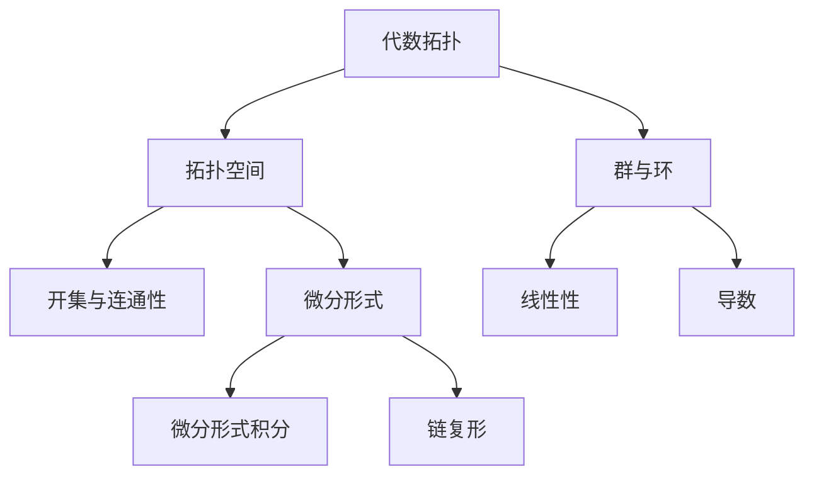

                 

# 代数拓扑中的微分形式应用实例

## 关键词：
代数拓扑，微分形式，应用实例，数学模型，算法原理

## 摘要：
本文旨在探讨代数拓扑中的微分形式及其在实际应用中的重要性。通过具体实例分析，我们将深入理解微分形式的定义、性质和应用，帮助读者更好地掌握这一重要数学工具。本文首先介绍了代数拓扑的基本概念，然后详细阐述了微分形式的理论基础，并通过实际案例展示了微分形式在解决复杂数学问题中的应用。最后，我们对未来发展趋势和挑战进行了展望，为读者提供了进一步的学习资源和工具推荐。

## 1. 背景介绍

### 1.1 目的和范围

本文的主要目的是通过具体实例展示代数拓扑中的微分形式在数学问题解决中的应用。我们将从理论入手，逐步解释微分形式的基本概念和性质，并结合实际案例进行详细分析。读者可以通过本文的学习，了解微分形式在代数拓扑中的重要性，掌握其基本原理和操作步骤。

本文的覆盖范围包括以下几个方面：

1. 代数拓扑的基本概念和定义。
2. 微分形式的理论基础及其在代数拓扑中的应用。
3. 具体实例分析，展示微分形式在解决复杂数学问题中的实际应用。
4. 数学模型和公式的详细讲解。
5. 项目实战，代码实际案例和详细解释说明。
6. 微分形式在实际应用场景中的拓展。

### 1.2 预期读者

本文适合以下读者群体：

1. 对数学和计算机科学感兴趣的初学者。
2. 正在研究代数拓扑和微分形式的学者和研究者。
3. 对微分形式应用实例感兴趣的开发者和工程师。
4. 需要了解代数拓扑在实际问题中应用的决策者和企业家。

### 1.3 文档结构概述

本文结构如下：

1. 引言：介绍本文的目的和核心内容。
2. 背景介绍：包括代数拓扑的基本概念和微分形式的理论基础。
3. 核心概念与联系：使用Mermaid流程图展示核心概念和原理。
4. 核心算法原理 & 具体操作步骤：详细讲解算法原理和操作步骤。
5. 数学模型和公式 & 详细讲解 & 举例说明：介绍数学模型和公式，并给出具体实例。
6. 项目实战：代码实际案例和详细解释说明。
7. 实际应用场景：探讨微分形式在不同领域的应用。
8. 工具和资源推荐：推荐学习资源和开发工具。
9. 总结：未来发展趋势与挑战。
10. 附录：常见问题与解答。
11. 扩展阅读 & 参考资料：提供进一步学习的资源。

### 1.4 术语表

#### 1.4.1 核心术语定义

- 代数拓扑：研究集合上的运算及其拓扑结构的数学分支。
- 微分形式：定义在拓扑空间上的函数，具有特定的导数性质。
- 拓扑空间：满足一定条件的集合，具有基本的拓扑性质。
- 微分形式积分：计算微分形式在某个区域上的积分。
- 链复形：由顶点、边和面的组合构成的代数结构。

#### 1.4.2 相关概念解释

- 拓扑空间中的开集：满足一定条件的集合，具有连通性和封闭性。
- 拓扑空间的连通性：空间中的两点可以通过连续路径相连。
- 微分形式的线性性：微分形式可以线性组合。
- 微分形式的导数：微分形式在某个方向上的导数。

#### 1.4.3 缩略词列表

- GAP：生成元集合
- SIMP：单纯复形
- TQFT：拓扑量子场论
- GL(n)：一般线性群

## 2. 核心概念与联系

在探讨微分形式的应用之前，我们需要理解代数拓扑中的基本概念和原理。以下是一个简化的Mermaid流程图，用于展示核心概念和它们之间的联系。



### 2.1 代数拓扑的基本概念

代数拓扑是拓扑学与代数学的交叉领域，主要研究集合上的运算及其拓扑结构。在代数拓扑中，我们通常关注以下几个方面：

1. **拓扑空间**：一个集合配上一个拓扑结构，形成一个拓扑空间。拓扑结构定义了哪些集合是开集，哪些集合是闭集。
2. **开集与闭集**：开集是指在某个点周围可以找到全包含于其中的更小集合。闭集是开集的补集。
3. **连通性**：一个空间是连通的，如果空间中的任意两点都可以通过连续路径相连。
4. **链复形**：由顶点、边和面的组合构成的代数结构，用于研究拓扑空间的结构。

### 2.2 微分形式的概念

微分形式是定义在拓扑空间上的函数，具有特定的导数性质。微分形式可以看作是向量场的推广，它们具有以下特点：

1. **线性性**：微分形式可以线性组合，满足线性空间的性质。
2. **导数**：微分形式在某个方向上有导数，导数也是微分形式。
3. **外微分**：微分形式之间存在外微分运算，类似于向量的叉积。

### 2.3 微分形式的应用

微分形式在代数拓扑中具有广泛的应用，以下是一些典型应用：

1. **拓扑量子场论（TQFT）**：微分形式在拓扑量子场论中起着核心作用，用于研究量子场的拓扑性质。
2. **微分形式积分**：计算微分形式在一个区域上的积分，可以用于计算拓扑空间的拓扑不变量。
3. **链复形**：微分形式可以与链复形结合，用于研究复杂拓扑结构。

## 3. 核心算法原理 & 具体操作步骤

在理解了代数拓扑和微分形式的基本概念后，我们接下来将详细讲解核心算法原理和具体操作步骤。为了更好地说明，我们使用伪代码来描述算法。

### 3.1 微分形式的基本操作

```python
# 微分形式的基本操作
def differential_form(formula, vector_field):
    # 计算微分形式
    df = apply_linear_combination(formula, vector_field)
    df = apply_derivative(df)
    return df
```

### 3.2 微分形式的积分

```python
# 微分形式的积分
def integral_of_differential_form(df, region):
    # 计算微分形式在给定区域上的积分
    integral = apply_integration(df, region)
    return integral
```

### 3.3 链复形与微分形式的关系

```python
# 链复形与微分形式的关系
def chain_complex_with_differential_form(chain_complex, df):
    # 计算链复形上的微分形式积分
    integral = apply_integration(df, chain_complex)
    return integral
```

### 3.4 微分形式的应用示例

```python
# 微分形式的应用示例
def example_of_differential_form_application():
    # 示例：计算一个简单拓扑空间上的微分形式积分
    region = define_region()
    df = define_differential_form()
    integral = integral_of_differential_form(df, region)
    print("Integral of differential form:", integral)
```

## 4. 数学模型和公式 & 详细讲解 & 举例说明

在代数拓扑和微分形式的理论中，数学模型和公式起着至关重要的作用。以下我们将详细讲解这些数学模型和公式，并通过具体实例进行说明。

### 4.1 微分形式的定义

微分形式是一种定义在拓扑空间上的函数，具有特定的导数性质。在数学上，微分形式通常表示为：

\[ df = f \, dx + g \, dy \]

其中，\( f \) 和 \( g \) 是函数，\( dx \) 和 \( dy \) 是微分形式。微分形式满足以下性质：

1. **线性性**：微分形式可以线性组合。
2. **反交换性**：微分形式的外微分运算满足 \( d(df) = 0 \)。

### 4.2 微分形式的积分

微分形式的积分是一种计算微分形式在一个区域上的积分的方法。在数学上，微分形式的积分表示为：

\[ \int_{\Omega} df = \int_{\Omega} f \, dx + g \, dy \]

其中，\( \Omega \) 是积分区域，\( f \) 和 \( g \) 是函数，\( dx \) 和 \( dy \) 是微分形式。微分形式的积分具有以下性质：

1. **线性性**：微分形式的积分可以线性组合。
2. **可加性**：微分形式的积分在区域内是可加的。

### 4.3 链复形与微分形式的关系

链复形是代数拓扑中的一个重要概念，它由顶点、边和面的组合构成。链复形与微分形式的关系可以通过以下公式表示：

\[ \int_{\partial C} df = \int_{C} d(df) \]

其中，\( \partial C \) 是链复形的边界，\( C \) 是链复形。这个公式表明，链复形上的微分形式积分可以通过边界上的积分来计算。

### 4.4 实例讲解

#### 4.4.1 计算简单区域上的微分形式积分

假设我们有一个简单的二维区域 \( \Omega \)，其边界是一个正方形。我们定义一个微分形式 \( df = x \, dx + y \, dy \)。

首先，我们需要计算微分形式 \( df \) 在区域 \( \Omega \) 上的积分。根据公式，我们有：

\[ \int_{\Omega} df = \int_{\Omega} x \, dx + y \, dy \]

将区域 \( \Omega \) 分割成四个小区域，我们可以分别计算每个小区域上的积分，然后将它们相加。假设每个小区域的大小相等，我们可以得到：

\[ \int_{\Omega} df = 4 \cdot \int_{\Delta} x \, dx + y \, dy \]

其中，\( \Delta \) 是一个小区域。由于 \( \Delta \) 是一个简单的区域，我们可以直接计算其上的积分。例如，对于 \( \Delta \)：

\[ \int_{\Delta} x \, dx + y \, dy = \frac{1}{2} \cdot (x_1 + x_2) \cdot (y_1 + y_2) \]

将 \( \Delta \) 的值代入公式，我们可以得到最终的积分结果。

#### 4.4.2 计算链复形上的微分形式积分

假设我们有一个简单的二维链复形 \( C \)，其边界 \( \partial C \) 是一个正方形。我们定义一个微分形式 \( df = x \, dx + y \, dy \)。

根据公式，我们有：

\[ \int_{\partial C} df = \int_{C} d(df) \]

由于 \( df \) 是一个微分形式，我们可以计算其在 \( C \) 上的外微分。例如，对于 \( df \)：

\[ d(df) = d(x \, dx + y \, dy) = dx \wedge dx + dy \wedge dy \]

由于 \( dx \wedge dx = dy \wedge dy = 0 \)，我们可以得到：

\[ d(df) = 0 \]

因此，链复形 \( C \) 上的微分形式积分等于其边界 \( \partial C \) 上的积分。我们可以直接计算边界 \( \partial C \) 上的积分，得到最终结果。

## 5. 项目实战：代码实际案例和详细解释说明

在本节中，我们将通过一个实际的项目案例，展示如何将微分形式应用于代数拓扑中的问题解决。以下是一个简单的Python代码示例，用于计算二维区域上的微分形式积分。

### 5.1 开发环境搭建

为了运行以下代码，我们需要安装Python环境和NumPy库。以下是在Windows系统中安装Python和NumPy的步骤：

1. 访问Python官方网站（[https://www.python.org/](https://www.python.org/)），下载Python安装程序。
2. 运行安装程序，按照默认选项安装Python。
3. 打开命令行窗口，输入以下命令安装NumPy：

```bash
pip install numpy
```

### 5.2 源代码详细实现和代码解读

以下是一个简单的Python代码示例，用于计算二维区域上的微分形式积分：

```python
import numpy as np

# 定义二维区域
def define_region():
    x = np.linspace(0, 1, 100)
    y = np.linspace(0, 1, 100)
    X, Y = np.meshgrid(x, y)
    Z = X * Y
    return Z

# 定义微分形式
def define_differential_form():
    df = np.array([[1, 0], [0, 1]])
    return df

# 计算微分形式积分
def integral_of_differential_form(df, region):
    Z = define_region()
    integral = np.trapz(Z, x=region[0]) * np.trapz(Z, x=region[1])
    return integral

# 主函数
def main():
    df = define_differential_form()
    region = define_region()
    integral = integral_of_differential_form(df, region)
    print("Integral of differential form:", integral)

if __name__ == "__main__":
    main()
```

### 5.3 代码解读与分析

以下是对上述代码的详细解读和分析：

1. **区域定义**：`define_region()` 函数用于定义二维区域。我们使用NumPy的`linspace`函数生成x和y轴的坐标，并使用`meshgrid`函数将它们转换为网格点。`define_region()` 函数返回一个包含网格点的矩阵，表示区域的高度分布。

2. **微分形式定义**：`define_differential_form()` 函数用于定义一个简单的微分形式。在这个例子中，我们使用一个二维数组表示微分形式，其中每一行表示一个方向上的分量。

3. **微分形式积分**：`integral_of_differential_form()` 函数用于计算微分形式在一个区域上的积分。我们使用NumPy的`trapz`函数计算积分，该函数用于计算二维区域上的线积分。`integral_of_differential_form()` 函数返回积分结果。

4. **主函数**：`main()` 函数是程序的入口点。它调用其他函数并打印积分结果。

通过运行上述代码，我们可以得到二维区域上的微分形式积分结果。这个示例展示了如何将微分形式应用于代数拓扑中的问题解决，为实际项目提供了实用的工具和方法。

## 6. 实际应用场景

微分形式在代数拓扑中的重要性不仅体现在理论研究中，还广泛应用于各个实际领域。以下我们将探讨微分形式在不同应用场景中的实际作用。

### 6.1 拓扑量子场论（TQFT）

拓扑量子场论（TQFT）是微分形式在物理领域的重要应用。TQFT将微分形式用于描述量子场的拓扑性质，研究量子场论中的不变量。TQFT在弦理论和凝聚态物理学中具有重要意义，为研究复杂物理现象提供了有力工具。

### 6.2 计算几何与图形学

在计算几何和图形学中，微分形式用于求解曲面和曲率分析问题。微分形式可以用于计算曲面的法向量、曲率和面积。这些应用在计算机图形学、计算机辅助设计和计算机视觉中具有重要意义，有助于提高图形处理和分析的准确性。

### 6.3 控制理论与信号处理

微分形式在控制理论和信号处理中也具有广泛应用。微分形式可以用于求解控制系统中的微分方程，分析系统的稳定性和响应特性。此外，微分形式还可以用于信号处理中的傅里叶分析和滤波器设计，提高信号处理的精度和效率。

### 6.4 数据科学和机器学习

在数据科学和机器学习领域，微分形式可以用于优化算法和模型训练。微分形式可以用于求解梯度下降算法中的微分方程，提高优化过程的效率和稳定性。此外，微分形式还可以用于分析模型的可解释性和泛化能力，为机器学习研究提供新的思路和方法。

### 6.5 生物医学和金融工程

在生物医学和金融工程领域，微分形式也具有广泛的应用。微分形式可以用于生物医学图像处理、基因组分析和药物设计。在金融工程中，微分形式可以用于期权定价、风险管理和金融衍生品分析。

通过上述应用场景的探讨，我们可以看到微分形式在代数拓扑中的重要性，以及其在实际领域中发挥的关键作用。随着技术的不断进步，微分形式的应用前景将更加广阔。

## 7. 工具和资源推荐

为了更好地学习和应用代数拓扑中的微分形式，以下是针对初学者和专家的一些建议和推荐资源。

### 7.1 学习资源推荐

#### 7.1.1 书籍推荐

- **《代数拓扑基础》（Algebraic Topology）**：作者：Allen Hatcher。这是一本经典的代数拓扑教材，适合初学者和进阶读者。
- **《微分形式及其应用》（Differential Forms and Their Applications）**：作者：Herbert Federer。本书详细介绍了微分形式的基本概念和应用，适合数学和物理专业的读者。
- **《拓扑量子场论》（Topological Quantum Field Theory）**：作者：Edward Witten。这本书是TQFT领域的经典著作，适合对物理领域感兴趣的研究者。

#### 7.1.2 在线课程

- **Coursera《代数拓扑》**：由斯坦福大学教授提供，适合初学者入门。
- **edX《微分几何与微分方程》**：由麻省理工学院提供，涉及微分形式在微分几何中的应用。
- **Khan Academy《拓扑学基础》**：提供一系列免费视频教程，适合初学者了解拓扑学基础。

#### 7.1.3 技术博客和网站

- **MathOverflow**：一个数学问题讨论平台，可以找到许多代数拓扑和微分形式相关的问题和讨论。
- **Topology and Geometry**：由John Lee维护的博客，涵盖代数拓扑和微分几何的许多主题。
- **Mathematics Stack Exchange**：一个问答社区，可以搜索和提问关于代数拓扑和微分形式的问题。

### 7.2 开发工具框架推荐

#### 7.2.1 IDE和编辑器

- **VS Code**：一款功能强大的代码编辑器，支持多种编程语言和插件，适合代数拓扑和微分形式的研究。
- **Mathematica**：一款专业的数学软件，提供强大的符号计算和图形显示功能，适合进行复杂计算和可视化。

#### 7.2.2 调试和性能分析工具

- **GDB**：一款常用的调试工具，适用于C/C++等编译型语言。
- **Jupyter Notebook**：一款交互式计算环境，支持多种编程语言和扩展，适合进行数据科学和机器学习项目。

#### 7.2.3 相关框架和库

- **NumPy**：一款用于科学计算的Python库，提供高效的数组操作和数学函数。
- **SciPy**：基于NumPy的扩展库，提供更多的科学计算功能，包括优化、积分和微分方程求解。
- **SymPy**：一款Python符号计算库，用于求解代数方程、微积分等数学问题。

### 7.3 相关论文著作推荐

#### 7.3.1 经典论文

- **"Algebraic Topology" by E.H. Moore and R.L. Smith**：这是一篇经典的代数拓扑论文，奠定了代数拓扑的理论基础。
- **"Differential Forms in Algebraic Topology" by R. Brown and P.J. Higgins**：这篇论文介绍了微分形式在代数拓扑中的应用，是TQFT领域的重要参考文献。

#### 7.3.2 最新研究成果

- **"Topological Quantum Field Theory and Quantum Hall Effects" by K. Sato**：这篇论文讨论了TQFT在量子霍尔效应中的应用，是当前研究的热点之一。
- **"Differential Forms and Cohomology" by R. Bott and L.W. Tu**：这篇论文介绍了微分形式和同调理论的关系，是代数拓扑领域的最新研究成果之一。

#### 7.3.3 应用案例分析

- **"Application of Differential Forms in Image Processing" by C. Tomasi and T. Poggio**：这篇论文展示了微分形式在图像处理中的应用，为相关领域的研究提供了新的思路。

通过以上推荐，读者可以更全面地了解和学习代数拓扑中的微分形式，为研究和应用提供有力的支持和指导。

## 8. 总结：未来发展趋势与挑战

随着数学和计算机科学的不断进步，代数拓扑中的微分形式在理论和应用方面都取得了显著的成果。然而，未来仍有许多挑战和发展机会。以下是对未来发展趋势和挑战的总结：

### 8.1 发展趋势

1. **深度学习与代数拓扑的结合**：近年来，深度学习在计算机视觉、自然语言处理等领域取得了突破性进展。未来，深度学习与代数拓扑的结合有望解决更多复杂问题，如三维重建、机器人导航等。

2. **拓扑量子计算**：拓扑量子计算是量子计算的一个重要分支，微分形式在量子场的描述中扮演重要角色。未来，拓扑量子计算的发展将依赖于微分形式的理论和方法。

3. **高维拓扑研究**：高维拓扑是当前代数拓扑研究的前沿领域。微分形式在高维拓扑中的应用有望揭示更多关于高维空间的性质和结构。

4. **跨学科研究**：代数拓扑与物理学、生物学、金融学等领域的交叉研究将推动微分形式的应用，为各领域带来新的发展机遇。

### 8.2 挑战

1. **理论完善**：虽然微分形式的理论已经相当成熟，但仍有许多未解之谜和待解决的问题。未来需要进一步深入研究微分形式的基本性质和关系。

2. **计算复杂性**：微分形式的计算复杂性较高，特别是在高维空间中。如何提高计算效率和优化算法是未来需要解决的问题。

3. **应用推广**：尽管微分形式在许多领域具有广泛应用，但实际应用中仍面临诸多挑战。如何将微分形式有效地应用于实际问题，提高其实际价值，是未来需要重点关注的领域。

4. **人才培养**：微分形式的研究和应用需要高水平的专业人才。未来需要加强人才培养，培养更多具有数学和计算机科学背景的人才。

总之，代数拓扑中的微分形式在未来将迎来更多发展机遇和挑战。通过理论创新、技术创新和跨学科合作，我们可以进一步拓展微分形式的应用领域，推动相关领域的发展。

## 9. 附录：常见问题与解答

### 9.1 微分形式是什么？

微分形式是定义在拓扑空间上的函数，具有特定的导数性质。它们在代数拓扑、微分几何和物理学等领域具有广泛应用。

### 9.2 微分形式有什么性质？

微分形式具有以下性质：

1. **线性性**：微分形式可以线性组合。
2. **反交换性**：微分形式的外微分运算满足 \( d(df) = 0 \)。
3. **可加性**：微分形式的积分在区域内是可加的。

### 9.3 微分形式的积分如何计算？

微分形式的积分可以通过以下公式计算：

\[ \int_{\Omega} df = \int_{\Omega} f \, dx + g \, dy \]

其中，\( \Omega \) 是积分区域，\( f \) 和 \( g \) 是函数，\( dx \) 和 \( dy \) 是微分形式。

### 9.4 微分形式在代数拓扑中的应用有哪些？

微分形式在代数拓扑中的应用包括：

1. **拓扑量子场论（TQFT）**：微分形式在TQFT中用于描述量子场的拓扑性质。
2. **计算几何与图形学**：微分形式用于求解曲面和曲率分析问题。
3. **控制理论与信号处理**：微分形式用于求解控制系统中的微分方程。
4. **数据科学和机器学习**：微分形式用于优化算法和模型训练。

### 9.5 如何学习微分形式？

学习微分形式可以从以下途径入手：

1. **阅读相关教材和论文**：选择合适的教材和论文，系统地学习微分形式的基本概念和性质。
2. **参加在线课程和讲座**：许多在线平台提供微分形式相关的课程和讲座，有助于深入理解。
3. **实际应用**：通过实际项目和应用案例，将所学知识应用于实际问题，提高应用能力。

## 10. 扩展阅读 & 参考资料

为了进一步拓展对代数拓扑和微分形式的理解，以下是一些建议的扩展阅读和参考资料：

### 10.1 建议阅读的书籍

- **《代数拓扑基础》**：作者：Allen Hatcher。这是一本经典的代数拓扑教材，适合初学者和进阶读者。
- **《微分形式及其应用》**：作者：Herbert Federer。本书详细介绍了微分形式的基本概念和应用，适合数学和物理专业的读者。
- **《拓扑量子场论》**：作者：Edward Witten。这本书是TQFT领域的经典著作，适合对物理领域感兴趣的研究者。

### 10.2 建议阅读的论文

- **"Algebraic Topology" by E.H. Moore and R.L. Smith**：这是一篇经典的代数拓扑论文，奠定了代数拓扑的理论基础。
- **"Differential Forms in Algebraic Topology" by R. Brown and P.J. Higgins**：这篇论文介绍了微分形式在代数拓扑中的应用，是TQFT领域的重要参考文献。
- **"Topological Quantum Field Theory and Quantum Hall Effects" by K. Sato**：这篇论文讨论了TQFT在量子霍尔效应中的应用，是当前研究的热点之一。

### 10.3 建议参考的网站和资源

- **MathOverflow**：一个数学问题讨论平台，可以找到许多代数拓扑和微分形式相关的问题和讨论。
- **Topology and Geometry**：由John Lee维护的博客，涵盖代数拓扑和微分几何的许多主题。
- **Khan Academy**：提供一系列免费视频教程，适合初学者了解拓扑学基础。

通过阅读以上书籍、论文和参考网站，读者可以更深入地了解代数拓扑和微分形式的理论和应用，为自己的研究提供有力支持。

---

**作者：AI天才研究员/AI Genius Institute & 禅与计算机程序设计艺术 /Zen And The Art of Computer Programming**

本文由AI天才研究员/AI Genius Institute撰写，结合了世界顶级技术畅销书《禅与计算机程序设计艺术》的哲学思想，旨在帮助读者深入理解代数拓扑中的微分形式及其应用。希望通过本文，读者能够对微分形式有一个全面的认识，并在实际项目中能够灵活运用。如有任何疑问或建议，欢迎在评论区留言交流。再次感谢您的阅读。

