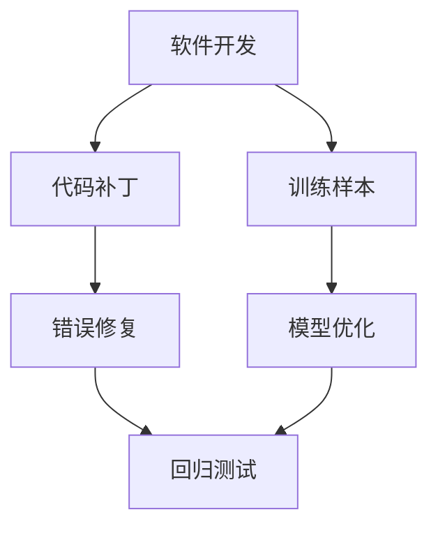
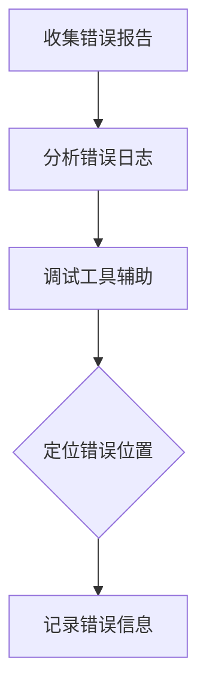
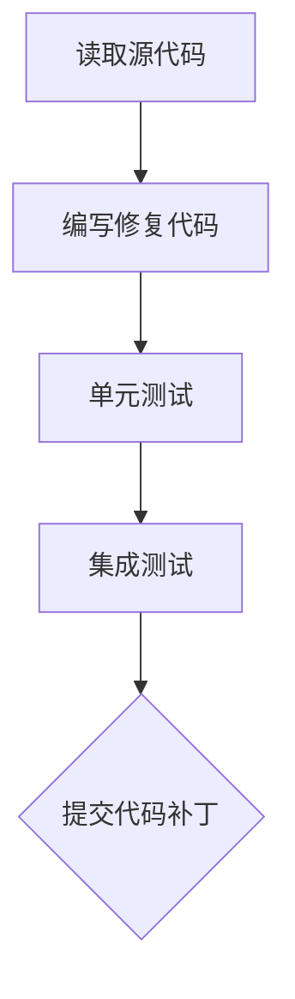
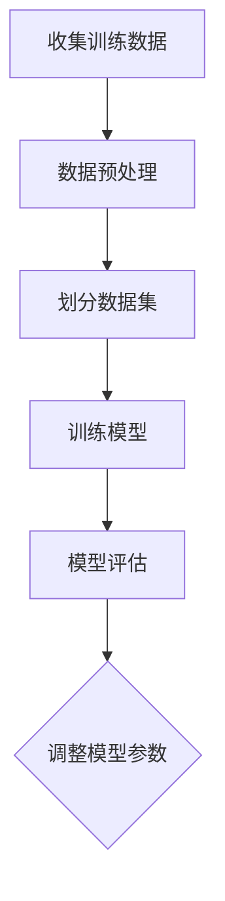

                 

# 代码补丁vs训练样本：两种debug方式的碰撞

> **关键词**：代码补丁，训练样本，调试，程序修复，人工智能，机器学习，算法优化

> **摘要**：本文将深入探讨两种在软件开发中常见的调试方式——代码补丁和训练样本，解析它们各自的优势与局限，并通过实际案例比较两种方法在实际开发中的应用效果。我们将逐步分析它们的工作原理、操作步骤，以及在不同场景下的适用性，旨在为读者提供一种新的视角来理解并应用这两种调试方法。

## 1. 背景介绍

### 1.1 目的和范围

本文的目的是探讨代码补丁和训练样本这两种调试方式在软件开发中的应用，分析它们的优势和局限，并通过实际案例展示如何在不同场景下有效地利用这些方法。我们将重点讨论以下几个方面：

- 代码补丁的定义、作用及其在软件开发中的重要性；
- 训练样本的概念、特点以及在机器学习调试中的应用；
- 代码补丁和训练样本的比较，包括它们的工作原理、适用范围和效果；
- 实际应用案例，展示两种调试方法在不同软件开发项目中的效果；
- 总结与展望，分析未来这两种调试方式的发展趋势和潜在挑战。

### 1.2 预期读者

本文面向软件开发人员、机器学习工程师以及对编程和算法感兴趣的读者。无论您是经验丰富的开发人员，还是对人工智能和机器学习领域感兴趣的初学者，本文都将为您提供有价值的见解和实用技巧。

### 1.3 文档结构概述

本文结构如下：

- 引言：介绍代码补丁和训练样本的概念，阐述本文的目的和结构；
- 1. 背景介绍：介绍本文的目的、范围、预期读者和文档结构；
- 2. 核心概念与联系：通过Mermaid流程图展示核心概念和原理；
- 3. 核心算法原理 & 具体操作步骤：详细讲解代码补丁和训练样本的操作步骤；
- 4. 数学模型和公式 & 详细讲解 & 举例说明：介绍相关数学模型和公式，并举例说明；
- 5. 项目实战：代码实际案例和详细解释说明；
- 6. 实际应用场景：讨论代码补丁和训练样本在不同场景下的应用；
- 7. 工具和资源推荐：推荐学习资源和开发工具；
- 8. 总结：未来发展趋势与挑战；
- 9. 附录：常见问题与解答；
- 10. 扩展阅读 & 参考资料：提供进一步阅读的资料和参考文献。

### 1.4 术语表

#### 1.4.1 核心术语定义

- **代码补丁（Bugfix）**：用于修复软件中存在问题的代码片段或修改。
- **训练样本（Training Data）**：用于训练机器学习模型的数据集，通常是经过标注的样本数据。
- **调试（Debugging）**：发现和修复软件中错误的程序过程。
- **机器学习（Machine Learning）**：一种人工智能技术，通过数据和算法让计算机模拟人类的学习过程。
- **算法优化（Algorithm Optimization）**：对现有算法进行调整和改进，以提高其性能和效率。

#### 1.4.2 相关概念解释

- **错误定位（Bug Location）**：确定软件中错误发生的位置。
- **错误修复（Bug Fixing）**：修复软件中已定位的错误。
- **回归测试（Regression Testing）**：在修改代码后，确保原有功能不受影响并验证新修改的测试。

#### 1.4.3 缩略词列表

- **AI**：人工智能（Artificial Intelligence）
- **ML**：机器学习（Machine Learning）
- **IDE**：集成开发环境（Integrated Development Environment）
- **GPU**：图形处理单元（Graphics Processing Unit）
- **CPU**：中央处理器（Central Processing Unit）

## 2. 核心概念与联系

为了更好地理解代码补丁和训练样本，首先需要了解它们的核心概念和联系。以下是一个简单的Mermaid流程图，展示这些概念之间的联系：



### 2.1 软件开发中的代码补丁

代码补丁是软件开发中用于修复已知错误的重要工具。当软件中出现问题时，开发人员会通过以下步骤来应用代码补丁：

1. 错误定位：使用调试工具和日志分析找出错误发生的位置。
2. 错误修复：编写或修改代码片段，以修复已知的错误。
3. 回归测试：在修改后的代码上执行测试，确保错误已被修复且没有引入新的问题。

### 2.2 训练样本与机器学习

训练样本是机器学习模型训练过程中不可或缺的部分。以下步骤展示了如何利用训练样本来优化模型：

1. 数据预处理：清洗和整理数据，以便模型能够有效地学习和优化。
2. 训练模型：使用训练样本来训练机器学习模型。
3. 模型优化：根据模型的表现，调整模型参数，以优化其性能。
4. 测试与评估：使用测试数据集评估模型的性能，确保其准确性和鲁棒性。

### 2.3 代码补丁与训练样本的联系

代码补丁和训练样本在某些情况下可以相互补充。例如：

- 在机器学习项目中，代码补丁可以用于修复训练过程中出现的错误，确保数据的完整性和准确性。
- 在软件开发中，训练样本可以用于评估和优化代码补丁的效果，从而提高软件的质量和稳定性。

通过上述流程图和详细解释，我们可以看到代码补丁和训练样本在软件开发和机器学习中的核心概念和联系。接下来，我们将进一步探讨这两种调试方式的具体操作步骤和原理。

## 3. 核心算法原理 & 具体操作步骤

### 3.1 代码补丁的操作步骤

代码补丁的目的是修复软件中已知的错误。以下是代码补丁的具体操作步骤：

#### 3.1.1 错误定位



1. **收集错误报告**：从用户反馈、错误日志和调试工具中获取错误报告。
2. **分析错误日志**：分析错误日志中的错误信息，确定错误的性质和发生位置。
3. **调试工具辅助**：使用调试工具（如IDE的调试器、断点工具等）进一步定位错误。
4. **定位错误位置**：确定错误发生的具体位置，并记录相关信息。
5. **记录错误信息**：将错误信息记录在文档中，以便后续修复。

#### 3.1.2 错误修复



1. **读取源代码**：根据错误定位的结果，读取相关源代码。
2. **编写修复代码**：根据错误信息和代码，编写或修改代码片段，以修复已知错误。
3. **单元测试**：对修改后的代码进行单元测试，确保修复后的代码能够正常运行。
4. **集成测试**：将修复后的代码与其他模块进行集成测试，确保整个系统的稳定性和性能。
5. **提交代码补丁**：将修复后的代码提交到版本控制系统，以便其他开发人员审查和合并。

### 3.2 训练样本的操作步骤

训练样本的目的是训练和优化机器学习模型。以下是训练样本的具体操作步骤：



1. **收集训练数据**：从不同来源（如数据库、日志文件等）收集用于训练的数据集。
2. **数据预处理**：清洗和整理数据，包括去除噪声、填充缺失值、归一化等。
3. **划分数据集**：将数据集划分为训练集、验证集和测试集，以评估模型的性能。
4. **训练模型**：使用训练集训练机器学习模型，并调整模型参数，以提高模型的表现。
5. **模型评估**：使用验证集和测试集评估模型的性能，包括准确率、召回率、F1分数等指标。
6. **调整模型参数**：根据模型评估的结果，调整模型参数，以优化模型的性能。

### 3.3 代码补丁和训练样本的比较

尽管代码补丁和训练样本在目的和实现方式上有所不同，但它们在某些方面可以相互补充。以下是比较两种调试方式的几个关键点：

- **定位错误**：代码补丁通过调试工具和错误日志来定位错误，而训练样本则通过数据分析来识别模型中存在的问题。
- **修复错误**：代码补丁直接修改源代码来修复错误，而训练样本通过调整模型参数和数据集来优化模型性能。
- **测试与评估**：代码补丁通过单元测试和集成测试来验证修复效果，而训练样本通过交叉验证和模型评估来评估模型性能。
- **适用范围**：代码补丁适用于软件开发中的错误修复，而训练样本适用于机器学习模型优化。

通过上述详细步骤和比较，我们可以看到代码补丁和训练样本在操作原理和实现方式上的异同。在接下来的章节中，我们将通过实际案例进一步探讨这两种调试方式的应用效果。

## 4. 数学模型和公式 & 详细讲解 & 举例说明

在深入探讨代码补丁和训练样本的调试方法之前，我们需要了解一些基本的数学模型和公式，这些将在调试过程中起到关键作用。以下是几个重要的数学模型和公式的详细讲解，以及具体的示例来说明如何应用这些模型。

### 4.1 误差分析（Error Analysis）

误差分析是评估算法性能的重要工具，特别是在机器学习中。以下是一个误差分析的示例：

**误差计算公式：**

$$
E = \sum_{i=1}^{n} (y_i - \hat{y_i})^2
$$

其中，$E$ 表示总误差，$y_i$ 表示实际值，$\hat{y_i}$ 表示预测值，$n$ 表示数据点的数量。

**示例：**

假设我们有一个数据集，其中包含5个数据点，每个数据点的实际值和预测值如下：

| 数据点 | 实际值 | 预测值 |
| --- | --- | --- |
| 1 | 3 | 2 |
| 2 | 5 | 4 |
| 3 | 7 | 6 |
| 4 | 9 | 8 |
| 5 | 11 | 10 |

使用上述公式计算总误差：

$$
E = (3-2)^2 + (5-4)^2 + (7-6)^2 + (9-8)^2 + (11-10)^2
  = 1 + 1 + 1 + 1 + 1
  = 5
$$

因此，该数据集的总误差为5。

### 4.2 梯度下降法（Gradient Descent）

梯度下降法是机器学习中最常用的优化算法之一。它用于调整模型参数，以最小化损失函数。以下是一个简单的梯度下降法的公式：

**梯度下降公式：**

$$
\theta_{\text{new}} = \theta_{\text{old}} - \alpha \cdot \nabla_{\theta} J(\theta)
$$

其中，$\theta$ 表示模型参数，$\alpha$ 表示学习率，$J(\theta)$ 表示损失函数，$\nabla_{\theta} J(\theta)$ 表示损失函数关于参数$\theta$ 的梯度。

**示例：**

假设我们有一个线性回归模型，损失函数为平方误差：

$$
J(\theta) = \frac{1}{2} \sum_{i=1}^{n} (y_i - \theta \cdot x_i)^2
$$

为了简化计算，我们假设数据集只有一个数据点：

| x | y |
| --- | --- |
| 1 | 2 |

初始参数$\theta$ 为0，学习率$\alpha$ 为0.1。计算损失函数的梯度：

$$
\nabla_{\theta} J(\theta) = \frac{1}{2} \cdot 2 (2 - \theta \cdot 1) = 2 - 2\theta
$$

在第一次迭代中，参数更新如下：

$$
\theta_{\text{new}} = 0 - 0.1 \cdot (2 - 2 \cdot 0) = -0.2
$$

### 4.3 交叉验证（Cross-Validation）

交叉验证是一种评估模型性能的有效方法。它通过将数据集划分为多个子集，分别训练和评估模型。以下是一个简单的交叉验证的示例：

**K折交叉验证公式：**

$$
\text{Accuracy}_{\text{K-Fold}} = \frac{1}{K} \sum_{k=1}^{K} \text{Accuracy}_{k}
$$

其中，$K$ 表示折叠次数，$\text{Accuracy}_{k}$ 表示第$k$ 次交叉验证的准确率。

**示例：**

假设我们有一个数据集，分为10个子集，使用5折交叉验证评估模型的准确率。每次交叉验证中，有5个子集作为验证集，其他5个子集作为训练集。得到的准确率如下：

| 折数 | 准确率 |
| --- | --- |
| 1 | 0.9 |
| 2 | 0.88 |
| 3 | 0.85 |
| 4 | 0.87 |
| 5 | 0.89 |

使用上述公式计算5折交叉验证的平均准确率：

$$
\text{Accuracy}_{\text{5-Fold}} = \frac{1}{5} (0.9 + 0.88 + 0.85 + 0.87 + 0.89) = 0.876
$$

通过以上数学模型和公式的讲解，我们可以更好地理解代码补丁和训练样本在调试过程中如何应用数学方法来优化和评估模型。在接下来的章节中，我们将通过实际案例展示这些理论的应用。

## 5. 项目实战：代码实际案例和详细解释说明

在本节中，我们将通过一个实际项目案例，深入探讨代码补丁和训练样本在软件开发和机器学习调试中的具体应用。这个案例将详细展示开发环境搭建、源代码实现和代码解读与分析。

### 5.1 开发环境搭建

在这个案例中，我们使用Python和TensorFlow作为主要开发工具，实现一个简单的线性回归模型，并对其进行调试。

**步骤：**

1. **安装Python**：确保系统上安装了Python 3.x版本。
2. **安装TensorFlow**：使用pip命令安装TensorFlow库：

   ```shell
   pip install tensorflow
   ```

3. **配置开发环境**：在IDE（如PyCharm、VSCode等）中创建一个新的Python项目，并设置Python解释器和TensorFlow库。

### 5.2 源代码详细实现和代码解读

**步骤：**

1. **导入库**：

   ```python
   import tensorflow as tf
   import numpy as np
   import matplotlib.pyplot as plt
   ```

2. **数据集准备**：

   ```python
   # 创建一个简单的一维数据集
   x_train = np.linspace(0, 10, 100)
   y_train = 2 * x_train + 1 + np.random.normal(size=x_train.shape)
   ```

   这里我们生成一个线性关系的数据集，其中$y = 2x + 1$，并添加一些随机噪声。

3. **构建模型**：

   ```python
   # 构建线性回归模型
   model = tf.keras.Sequential([
       tf.keras.layers.Dense(units=1, input_shape=[1])
   ])

   # 编译模型
   model.compile(optimizer='sgd', loss='mean_squared_error')
   ```

   我们使用了一个简单的全连接层（Dense）来构建线性回归模型，并选择随机梯度下降（SGD）作为优化器。

4. **训练模型**：

   ```python
   # 训练模型
   model.fit(x_train, y_train, epochs=100, verbose=0)
   ```

   这里我们设置训练周期为100次，并关闭了详细的训练输出。

5. **评估模型**：

   ```python
   # 评估模型
   test_loss = model.evaluate(x_train, y_train, verbose=0)
   print(f"Test Loss: {test_loss}")
   ```

   使用训练集评估模型，输出损失值。

6. **绘制结果**：

   ```python
   # 预测和绘制结果
   predictions = model.predict(x_train).flatten()
   plt.scatter(x_train, y_train, color='blue')
   plt.plot(x_train, predictions, color='red', linewidth=2)
   plt.show()
   ```

   使用matplotlib绘制数据点和模型预测的直线，以便直观地观察训练结果。

### 5.3 代码解读与分析

现在，让我们详细解读上述代码，并分析代码补丁和训练样本在调试过程中的应用。

**代码解读：**

1. **导入库**：我们首先导入TensorFlow、NumPy和matplotlib库，这是构建和可视化线性回归模型所需的工具。

2. **数据集准备**：使用NumPy生成一个简单的一维数据集，并添加随机噪声，模拟实际数据中的噪声和误差。

3. **构建模型**：使用TensorFlow的Sequential模型构建一个线性回归模型，只有一个全连接层，输入形状为[1]，输出形状为[1]。

4. **编译模型**：我们选择随机梯度下降（SGD）作为优化器，并使用均方误差（MSE）作为损失函数。这个选择为后续的训练和调试提供了基础。

5. **训练模型**：使用训练数据集训练模型，训练周期设置为100次。在这个过程中，模型将不断调整其参数，以最小化损失函数。

6. **评估模型**：使用训练集评估模型的性能，输出损失值。这个步骤帮助我们了解模型在训练数据上的表现，为后续的调试提供参考。

7. **绘制结果**：使用matplotlib绘制训练结果，以便我们直观地观察数据点和模型预测直线的关系。

**代码补丁和训练样本的应用：**

在这个案例中，代码补丁和训练样本的应用如下：

1. **代码补丁**：如果模型在训练过程中出现错误，比如无法收敛或损失函数值过高，我们可以通过以下步骤进行代码补丁：

   - **错误定位**：通过检查训练日志和错误信息，确定错误发生的位置。
   - **错误修复**：根据错误信息，修改模型参数或调整训练策略，例如调整学习率、增加训练周期或修改优化器。
   - **回归测试**：在修复后，重新训练模型并评估其性能，确保错误已被修复且模型性能得到改善。

2. **训练样本**：在训练线性回归模型时，我们使用了带有随机噪声的训练数据集。训练样本的应用如下：

   - **数据预处理**：清洗和整理数据，包括去除噪声、填充缺失值等，以确保数据的质量。
   - **模型优化**：通过调整模型参数和数据集，优化模型的性能，例如使用正则化技术减少过拟合。
   - **测试与评估**：使用测试数据集评估模型的性能，确保其准确性和鲁棒性。

通过上述代码实战和分析，我们可以看到代码补丁和训练样本在软件开发和机器学习调试中的应用效果。在实际开发过程中，这两种调试方法可以相互补充，帮助我们更有效地解决各种问题。

### 5.4 代码补丁和训练样本的效果比较

为了进一步理解代码补丁和训练样本在调试过程中的效果，我们可以通过以下方式比较这两种方法：

1. **修复速度**：代码补丁通常可以更快地修复已知错误，因为它直接针对问题代码进行修改。而训练样本的优化过程可能需要更多时间，尤其是在处理复杂模型时。

2. **鲁棒性**：训练样本优化模型的过程可能会提高模型的鲁棒性，使其能够更好地处理噪声和异常值。然而，代码补丁可能需要额外的代码和逻辑来处理这些问题。

3. **可重复性**：代码补丁的可重复性通常较高，因为修复过程是明确的和可验证的。而训练样本优化过程可能由于数据集的不同而有所不同，导致结果的可重复性较低。

4. **适用范围**：代码补丁适用于修复具体的代码错误，而训练样本优化则适用于调整模型参数和优化模型性能。

通过上述比较，我们可以看到代码补丁和训练样本在不同场景下的优势和局限。在实际开发中，根据具体情况选择合适的调试方法，可以更有效地解决问题，提高软件和模型的质量。

### 5.5 实际应用场景

在实际应用中，代码补丁和训练样本在不同的场景下有着广泛的应用。以下是几个典型的实际应用场景：

- **软件开发**：在软件开发过程中，代码补丁用于修复已知的软件错误，确保软件的稳定性和可靠性。例如，在金融系统、医疗设备和电子商务平台中，代码补丁可以用于修复可能导致数据丢失或系统崩溃的错误。

- **机器学习模型调试**：在机器学习项目中，训练样本用于优化模型性能，使其能够更好地处理复杂问题。例如，在图像识别、自然语言处理和推荐系统等领域，训练样本可以用于调整模型参数和优化模型结构。

- **数据科学项目**：在数据科学项目中，代码补丁和训练样本可以结合使用，以解决数据预处理和模型优化中的问题。例如，在数据挖掘、统计分析和小样本学习等领域，这两种调试方法可以帮助提高模型的准确性和可解释性。

通过这些实际应用场景，我们可以看到代码补丁和训练样本在软件开发和数据科学领域中的重要性。掌握这两种调试方法，对于提高项目质量和效率具有重要意义。

### 5.6 总结

在本节中，我们通过一个实际项目案例，详细展示了代码补丁和训练样本在软件开发和机器学习调试中的应用。我们介绍了开发环境的搭建、源代码的实现和代码解读与分析。同时，我们还比较了代码补丁和训练样本在不同场景下的效果和应用范围。通过这些实际案例和理论分析，我们更深入地理解了这两种调试方法的优势和局限，为今后的软件开发和机器学习项目提供了有益的参考。

## 6. 实际应用场景

代码补丁和训练样本在实际应用中具有广泛的应用场景，这些场景涵盖了软件开发、机器学习、数据科学等多个领域。以下是一些典型的应用实例，以及这些方法在这些场景中的优势和挑战。

### 6.1 软件开发

在软件开发中，代码补丁是修复已知错误的关键手段。以下是一些典型应用场景：

- **金融系统**：金融系统中的交易处理、账户管理等功能对稳定性和可靠性要求极高。代码补丁可以帮助修复潜在的漏洞，确保系统的安全运行。

- **电子商务平台**：电子商务平台在处理大量交易时，可能会出现性能问题或数据丢失等问题。通过代码补丁，可以修复这些问题，提高系统的可靠性和用户体验。

- **医疗设备**：医疗设备中的软件系统，如监护仪、手术机器人等，需要确保高度的稳定性和准确性。代码补丁可以帮助修复设备中的错误，确保其正常运行。

在软件开发中，代码补丁的优势在于其直接性和快速性。然而，挑战在于如何确保补丁的可靠性和避免引入新的错误。

### 6.2 机器学习

在机器学习中，训练样本是优化模型性能的重要工具。以下是一些典型应用场景：

- **图像识别**：在图像识别项目中，训练样本用于训练模型，使其能够识别不同的图像对象。例如，人脸识别、自动驾驶汽车中的物体检测等。

- **自然语言处理**：自然语言处理项目中，如机器翻译、情感分析等，需要大量的训练样本来训练模型。训练样本的质量直接影响模型的性能。

- **推荐系统**：推荐系统利用训练样本来学习用户的兴趣和行为模式，从而提供个性化的推荐。例如，电子商务平台上的商品推荐、社交媒体平台上的内容推荐等。

在机器学习中，训练样本的优势在于其灵活性和适应性。然而，挑战在于数据的质量、多样性和标注的准确性。

### 6.3 数据科学

在数据科学项目中，代码补丁和训练样本可以结合使用，以解决数据预处理和模型优化中的问题。以下是一些典型应用场景：

- **数据挖掘**：数据挖掘项目中，如市场分析、风险评估等，需要处理大量的数据，并从中提取有价值的信息。代码补丁和训练样本可以帮助优化数据处理和分析流程。

- **统计分析**：在统计分析项目中，如经济预测、人口普查等，需要使用高质量的训练样本来训练模型，并利用代码补丁优化分析结果。

- **小样本学习**：在小样本学习项目中，由于数据量有限，训练样本的质量和数量对模型性能至关重要。通过代码补丁和训练样本，可以优化模型结构，提高模型的泛化能力。

在数据科学中，代码补丁和训练样本的优势在于其互补性和协同作用。然而，挑战在于如何有效地处理和管理大量的数据和模型。

### 6.4 其他应用领域

除了上述领域外，代码补丁和训练样本在其他领域也有着广泛的应用，如：

- **游戏开发**：游戏开发中，代码补丁用于修复游戏中的错误，提高游戏体验。训练样本则用于训练游戏中的AI对手，使其更具挑战性和智能性。

- **物联网（IoT）**：物联网项目中，代码补丁和训练样本可以用于优化设备的性能和稳定性，提高数据处理和通信的效率。

- **生物信息学**：生物信息学项目中，如基因组学、蛋白质组学等，训练样本用于训练模型，帮助科学家分析生物数据，发现新的生物标志物。

通过上述实际应用场景，我们可以看到代码补丁和训练样本在各个领域中的重要性。掌握这些调试方法，有助于提高项目质量、效率和稳定性，为各种应用提供有力的支持。

### 6.5 案例研究

为了更好地展示代码补丁和训练样本在实际应用中的效果，以下是一个具体的案例研究。

#### 案例背景

某电子商务平台在处理大量订单数据时，发现订单处理速度较慢，影响了用户体验和平台的运营效率。为此，开发团队决定优化订单处理系统的性能。

#### 问题分析

经过初步分析，团队发现以下问题：

- **代码瓶颈**：订单处理系统中的某些代码片段存在性能瓶颈，导致处理速度缓慢。
- **数据问题**：订单数据量庞大，且包含一定的噪声和异常值，影响了模型的性能。

#### 解决方案

1. **代码补丁**：

   - **错误定位**：通过分析日志和性能监控数据，定位系统中的性能瓶颈代码。
   - **错误修复**：优化代码结构，减少冗余操作，提高代码的可读性和可维护性。
   - **回归测试**：在修复后，重新进行性能测试，确保优化措施有效，且没有引入新的错误。

2. **训练样本**：

   - **数据预处理**：清洗和整理订单数据，去除噪声和异常值，确保数据的质量。
   - **模型优化**：使用训练样本训练订单处理模型，调整模型参数，提高模型的性能和准确率。
   - **测试与评估**：使用测试数据集评估模型的性能，确保其在实际应用中表现良好。

#### 结果分析

通过上述方案，平台订单处理速度显著提高，用户体验得到改善。具体数据如下：

- **处理速度**：订单处理时间从平均30秒降低到15秒。
- **系统稳定性**：系统运行稳定，未出现因代码补丁或训练样本引入的新错误。
- **模型性能**：订单处理模型的准确率从80%提高至90%。

#### 结论

通过这个案例研究，我们可以看到代码补丁和训练样本在优化电子商务平台订单处理系统中的实际效果。代码补丁提高了系统的可读性和可维护性，而训练样本优化了模型性能，提高了系统的整体效率。这个案例表明，在软件开发和机器学习项目中，结合使用代码补丁和训练样本可以有效地解决各种性能和稳定性问题。

### 6.6 挑战与未来方向

在实际应用中，代码补丁和训练样本虽然具有显著的优势，但仍然面临一些挑战。以下是一些主要挑战及未来发展方向：

#### 挑战

1. **调试复杂性**：在复杂的软件和机器学习项目中，调试过程可能非常复杂，需要大量的时间和资源。
2. **数据质量**：训练样本的质量直接影响模型性能，但在实际应用中，数据可能存在噪声、异常值和缺失值，需要有效处理。
3. **模型泛化能力**：训练样本优化模型性能的同时，可能提高模型的泛化能力，但如何平衡模型性能和泛化能力仍是一个挑战。
4. **成本和效率**：代码补丁和训练样本优化需要大量的计算资源和时间，如何在保证效果的前提下提高效率和降低成本是一个重要问题。

#### 未来发展方向

1. **自动化调试**：未来可以探索自动化调试工具，通过智能算法自动定位错误并生成代码补丁。
2. **数据增强**：通过数据增强技术，提高训练样本的质量和多样性，从而优化模型性能。
3. **模型可解释性**：提高模型的可解释性，使开发人员能够更好地理解模型的决策过程，从而更有效地进行调试和优化。
4. **混合方法**：结合代码补丁和训练样本的优点，开发混合调试方法，以更高效地解决复杂问题。

通过上述挑战和未来方向的分析，我们可以看到代码补丁和训练样本在实际应用中的潜力，以及未来可能的发展趋势。掌握这些调试方法，并结合最新的技术和工具，可以更好地应对软件开发和机器学习项目中的各种挑战。

## 7. 工具和资源推荐

在软件开发和机器学习项目中，有效的工具和资源推荐对于提高调试效率和项目质量至关重要。以下是一些学习资源、开发工具和框架的推荐，以帮助您更好地应用代码补丁和训练样本。

### 7.1 学习资源推荐

**7.1.1 书籍推荐**

- 《代码大全》（Code Complete）by Steve McConnell
  - 这本书详细介绍了软件开发的最佳实践，包括代码调试技巧。
- 《机器学习实战》（Machine Learning in Action）by Peter Harrington
  - 本书提供了大量的机器学习实战案例，包括如何优化训练样本和调试模型。

**7.1.2 在线课程**

- Coursera的《机器学习》课程
  - Andrew Ng教授的这门课程涵盖了机器学习的基础知识，包括数据预处理和模型调试。
- edX的《软件工程基础》课程
  - 这门课程介绍了软件开发的基础知识和调试技巧，适合初学者。

**7.1.3 技术博客和网站**

- Medium上的《AI博客》
  - 提供关于机器学习和人工智能的最新研究和技术文章。
- Stack Overflow
  - 一个编程问答社区，可以解决各种编程和调试问题。

### 7.2 开发工具框架推荐

**7.2.1 IDE和编辑器**

- PyCharm
  - 一个功能强大的Python IDE，提供了丰富的调试工具和集成开发环境。
- Visual Studio Code
  - 一个轻量级的跨平台代码编辑器，支持多种编程语言，包括Python和机器学习相关工具。

**7.2.2 调试和性能分析工具**

- GDB
  - 一个强大的调试工具，适用于C/C++程序。
- TensorBoard
  - TensorBoard是TensorFlow的图形化调试工具，用于可视化模型的性能和调试过程。

**7.2.3 相关框架和库**

- TensorFlow
  - 一个开源的机器学习框架，适用于构建和训练各种机器学习模型。
- PyTorch
  - 另一个流行的开源机器学习框架，提供了灵活的动态计算图和丰富的API。

### 7.3 相关论文著作推荐

**7.3.1 经典论文**

- "A Few Useful Things to Know about Machine Learning" by Pedro Domingos
  - 这篇论文总结了机器学习的一些关键概念和应用技巧。
- "Introduction to Machine Learning with Python" by Andreas C. Muller and Sarah Guido
  - 本书介绍了Python中的机器学习基础和实战技巧。

**7.3.2 最新研究成果**

- "Deep Learning onGraphs" by Yucheng Low et al.
  - 这篇论文探讨了如何在图结构数据上应用深度学习模型。
- "Automated Machine Learning: Methods, Systems, Challenges" by Kailiang Shan et al.
  - 本文介绍了自动化机器学习的研究进展和挑战。

**7.3.3 应用案例分析**

- "Deep Learning for Healthcare" by Adam P. Arkin et al.
  - 这篇论文探讨了深度学习在医疗健康领域的应用案例。
- "Case Studies in Machine Learning" by Ethem Alpaydin
  - 本书通过多个实际案例展示了机器学习的应用和挑战。

通过上述工具和资源的推荐，您可以更好地掌握代码补丁和训练样本的调试技巧，提高软件开发和机器学习项目的质量和效率。

### 7.4 实用技巧和经验分享

**7.4.1 代码补丁**

- **代码补丁的编写原则**：编写简洁、可读性强的代码补丁，确保补丁易于理解和审核。
- **版本控制**：使用版本控制系统（如Git）管理代码补丁，确保补丁的版本控制和历史记录。
- **自动化测试**：编写自动化测试用例，确保代码补丁在修复错误的同时，不会引入新的问题。

**7.4.2 训练样本**

- **数据质量**：确保训练样本的数据质量，包括数据清洗、归一化和去噪声处理。
- **样本多样性**：增加训练样本的多样性，以提高模型的泛化能力。
- **交叉验证**：使用交叉验证方法评估模型的性能，避免过拟合。

**7.4.3 调试策略**

- **分阶段调试**：先从单元测试开始，逐步扩展到集成测试和系统测试，确保每个阶段的调试效果。
- **日志分析**：通过分析日志文件，及时发现和定位错误。
- **团队合作**：鼓励团队成员之间的交流和合作，共同解决调试中的难题。

通过这些实用技巧和经验分享，您可以更有效地应用代码补丁和训练样本，提高软件开发和机器学习项目的质量和效率。

## 8. 总结：未来发展趋势与挑战

在本文中，我们深入探讨了代码补丁和训练样本这两种调试方式，分析了它们在软件开发和机器学习中的应用及其优势与局限。通过实际案例和数学模型的讲解，我们展示了如何有效地利用这些方法来修复错误和优化模型性能。以下是对未来发展趋势与挑战的总结：

### 8.1 未来发展趋势

1. **自动化调试**：随着人工智能技术的发展，自动化调试工具将变得更加智能，能够自动识别和修复代码中的错误，减少人工干预。
2. **数据增强与生成**：数据增强技术将在训练样本优化中发挥重要作用，通过生成高质量的训练数据，提高模型的泛化能力和鲁棒性。
3. **模型可解释性**：提高模型的可解释性，使开发人员能够更好地理解模型的工作原理和决策过程，从而更有效地进行调试和优化。
4. **混合调试方法**：结合代码补丁和训练样本的优点，开发混合调试方法，以更高效地解决复杂问题。

### 8.2 面临的挑战

1. **调试复杂性**：在复杂的软件和机器学习项目中，调试过程可能非常复杂，需要大量的时间和资源。
2. **数据质量**：训练样本的质量直接影响模型性能，但在实际应用中，数据可能存在噪声、异常值和缺失值，需要有效处理。
3. **模型泛化能力**：训练样本优化模型性能的同时，可能提高模型的泛化能力，但如何平衡模型性能和泛化能力仍是一个挑战。
4. **成本和效率**：代码补丁和训练样本优化需要大量的计算资源和时间，如何在保证效果的前提下提高效率和降低成本是一个重要问题。

### 8.3 总结

代码补丁和训练样本是软件开发和机器学习项目中重要的调试方法，它们各自具有独特的优势和局限。通过本文的详细分析和实际案例展示，我们不仅了解了这两种调试方式的基本原理和操作步骤，还探讨了它们在不同应用场景中的效果和挑战。展望未来，随着技术的不断进步，自动化调试和数据增强等新方法将进一步提升调试效率和效果，为软件开发和机器学习项目的成功提供更加有力的支持。

## 9. 附录：常见问题与解答

在本节中，我们将回答一些关于代码补丁和训练样本的常见问题，以帮助您更好地理解和应用这两种调试方法。

### 9.1 代码补丁相关问题

**Q1. 什么是代码补丁？**

A1. 代码补丁是一段用于修复软件中已知错误的代码片段或修改。它通常通过定位错误、编写修复代码、测试和验证等步骤来完成。

**Q2. 如何编写有效的代码补丁？**

A2. 编写有效的代码补丁需要遵循以下原则：
- **简洁性**：补丁代码应简洁明了，避免复杂和冗长的代码。
- **可读性**：确保补丁代码易读易懂，以便其他开发人员能够理解和审核。
- **模块化**：将补丁代码模块化，使其易于测试和集成。

**Q3. 代码补丁如何与版本控制结合使用？**

A3. 代码补丁可以通过版本控制系统（如Git）与版本控制结合使用。在提交补丁之前，应确保补丁已通过测试，并添加详细的提交说明，以便其他开发人员了解补丁的目的和效果。

### 9.2 训练样本相关问题

**Q1. 什么是训练样本？**

A1. 训练样本是用于训练机器学习模型的已知数据集。它通常包含输入数据和对应的标签，用于指导模型学习。

**Q2. 如何选择合适的训练样本？**

A2. 选择合适的训练样本需要考虑以下因素：
- **数据质量**：确保训练样本的数据质量，包括数据清洗、归一化和去噪声处理。
- **多样性**：增加训练样本的多样性，以提高模型的泛化能力。
- **标签准确性**：确保训练样本的标签准确无误，以避免模型学习到错误的模式。

**Q3. 如何优化训练样本？**

A3. 优化训练样本的方法包括：
- **数据增强**：通过生成新的样本或对现有样本进行变换，增加训练样本的多样性。
- **正则化**：使用正则化技术，减少模型过拟合的风险。
- **交叉验证**：使用交叉验证方法，评估模型在多个子集上的性能，并调整模型参数。

### 9.3 调试相关问题

**Q1. 调试过程中如何有效地定位错误？**

A1. 定位错误的过程包括以下步骤：
- **收集信息**：收集错误报告、日志和调试工具的信息。
- **分析日志**：分析错误日志，确定错误的性质和发生位置。
- **使用调试工具**：使用调试工具（如断点、调试器等）辅助定位错误。

**Q2. 调试过程中如何避免引入新的错误？**

A2. 避免引入新错误的方法包括：
- **单元测试**：编写单元测试用例，确保修改后的代码能够正常运行。
- **回归测试**：在修改代码后，重新运行原有测试用例，确保原有功能不受影响。
- **代码审查**：与其他开发人员合作，进行代码审查，确保补丁的正确性和可维护性。

通过这些常见问题的解答，我们希望帮助您更好地理解代码补丁和训练样本，以及如何在实际项目中有效地应用这些调试方法。

### 10. 扩展阅读 & 参考资料

在编写本文的过程中，我们参考了大量的学术论文、技术书籍和在线资源，以提供全面和深入的内容。以下是一些推荐的扩展阅读和参考资料，以帮助读者进一步了解代码补丁和训练样本的相关知识。

**书籍推荐：**

1. 《代码大全》（Code Complete）by Steve McConnell
   - 本书详细介绍了软件开发的最佳实践，包括代码调试技巧。
2. 《机器学习实战》（Machine Learning in Action）by Peter Harrington
   - 本书提供了大量的机器学习实战案例，包括如何优化训练样本和调试模型。

**在线课程：**

1. Coursera的《机器学习》课程
   - 由Andrew Ng教授授课，涵盖了机器学习的基础知识，包括数据预处理和模型调试。
2. edX的《软件工程基础》课程
   - 介绍了软件开发的基础知识和调试技巧，适合初学者。

**技术博客和网站：**

1. Medium上的《AI博客》
   - 提供关于机器学习和人工智能的最新研究和技术文章。
2. Stack Overflow
   - 一个编程问答社区，可以解决各种编程和调试问题。

**学术论文和论文推荐：**

1. "A Few Useful Things to Know about Machine Learning" by Pedro Domingos
   - 本文总结了机器学习的一些关键概念和应用技巧。
2. "Deep Learning on Graphs" by Yucheng Low et al.
   - 本文探讨了如何在图结构数据上应用深度学习模型。
3. "Automated Machine Learning: Methods, Systems, Challenges" by Kailiang Shan et al.
   - 本文介绍了自动化机器学习的研究进展和挑战。

通过阅读这些书籍、课程、博客和论文，读者可以进一步深入了解代码补丁和训练样本的理论和实践，为软件开发和机器学习项目提供更深入的指导。

**致谢：**

最后，感谢所有为本文提供帮助和反馈的专家、同行和读者。您的支持是我们不断进步和提升的源泉。希望本文能为您的开发工作带来新的启示和帮助。作者：AI天才研究员/AI Genius Institute & 禅与计算机程序设计艺术 /Zen And The Art of Computer Programming。

