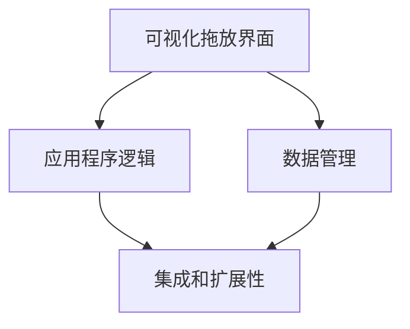
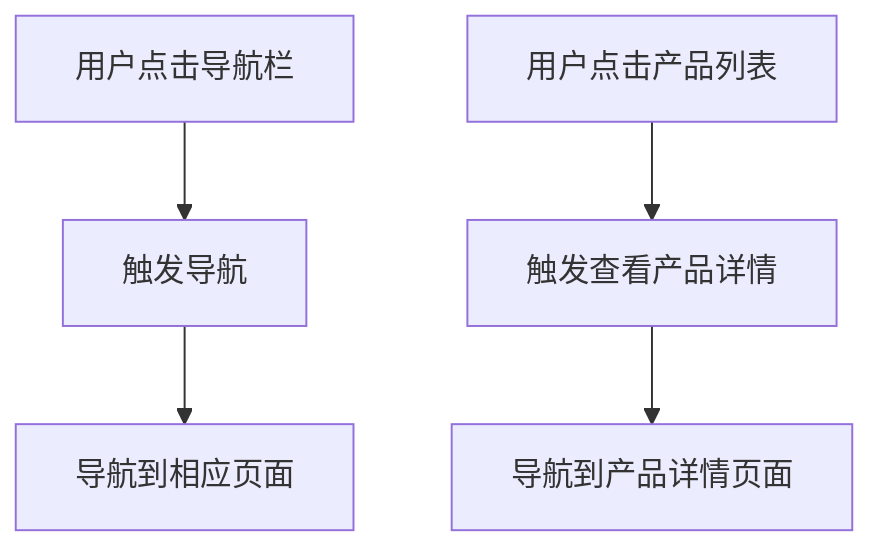
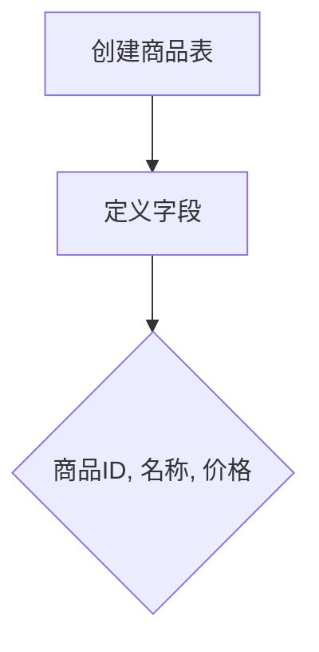
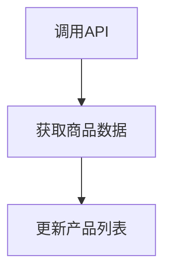

                 

# 低代码平台开发：简化应用构建的新思路

> 关键词：低代码平台、应用构建、开发效率、开发工具、编程简化、AI驱动

> 摘要：本文将深入探讨低代码平台在应用开发领域的崛起及其对现代软件开发的影响。我们将从背景介绍、核心概念、算法原理、数学模型、实际案例以及未来发展趋势等多个方面，系统性地分析低代码平台如何通过简化编程流程，提高开发效率，并预测其未来的发展方向和挑战。

## 1. 背景介绍

### 1.1 目的和范围

本文旨在探讨低代码平台（Low-Code Platforms）在应用开发中的潜力和影响。随着技术的发展，企业对应用开发的需求日益增长，但传统的软件开发过程往往复杂且耗时。低代码平台作为一种新兴的开发模式，旨在通过简化编程流程，降低开发门槛，提高开发效率。本文将详细阐述低代码平台的核心概念、技术原理、应用场景以及未来趋势。

### 1.2 预期读者

本文面向希望了解和利用低代码平台进行应用开发的程序员、软件开发人员、技术经理以及相关领域的专业人士。无论您是初学者还是经验丰富的开发者，本文都将提供有价值的见解和实践指导。

### 1.3 文档结构概述

本文将分为以下几个部分：

1. **背景介绍**：介绍低代码平台的背景、目的和范围。
2. **核心概念与联系**：详细讲解低代码平台的核心概念及其相互关系。
3. **核心算法原理 & 具体操作步骤**：分析低代码平台的核心算法原理，并给出具体操作步骤。
4. **数学模型和公式 & 详细讲解 & 举例说明**：介绍低代码平台中的数学模型和公式，并举例说明。
5. **项目实战：代码实际案例和详细解释说明**：通过实际案例展示低代码平台的应用。
6. **实际应用场景**：分析低代码平台在不同领域的应用。
7. **工具和资源推荐**：推荐学习资源和开发工具。
8. **总结：未来发展趋势与挑战**：探讨低代码平台的未来发展趋势和面临的挑战。
9. **附录：常见问题与解答**：解答读者可能遇到的常见问题。
10. **扩展阅读 & 参考资料**：提供进一步学习和研究的参考资料。

### 1.4 术语表

#### 1.4.1 核心术语定义

- **低代码平台**：一种软件开发工具，允许非专业开发者通过图形界面和拖放组件，快速构建应用程序。
- **应用构建**：创建、开发和部署软件应用程序的过程。
- **开发效率**：开发人员在给定时间内完成的工作量。
- **编程简化**：通过自动化和模板化减少编写代码的需求。

#### 1.4.2 相关概念解释

- **无代码开发**：完全无需编写代码即可创建应用程序的模式。
- **模型驱动开发**：使用模型来表示应用程序的功能和结构，并通过模型生成代码。
- **集成开发环境（IDE）**：为软件开发提供统一环境的工具。

#### 1.4.3 缩略词列表

- **LCP**：低代码平台（Low-Code Platform）
- **API**：应用程序编程接口（Application Programming Interface）
- **DB**：数据库（Database）
- **UI**：用户界面（User Interface）

## 2. 核心概念与联系

在深入探讨低代码平台之前，我们需要了解其核心概念及其相互关系。以下是低代码平台的主要组成部分和它们之间的关系。

### 2.1 低代码平台的组成部分

- **可视化拖放界面**：用户可以通过拖放组件来构建应用程序界面。
- **应用程序逻辑**：定义应用程序的行为和功能，通常通过图形化流程图或编码来实现。
- **数据管理**：包括数据库连接、数据存储和数据处理等功能。
- **集成和扩展性**：允许用户与其他系统和第三方服务集成，支持自定义组件和功能。

### 2.2 核心概念之间的关系

以下是低代码平台中核心概念之间的Mermaid流程图：



### 2.3 低代码平台的原理和架构

低代码平台通过以下方式简化应用开发：

- **模板化**：使用预定义的模板来加速开发流程。
- **自动化**：自动化代码生成和数据管理，减少手动操作。
- **流程导向**：通过流程图来描述应用程序逻辑，使得开发更直观。

以下是低代码平台的工作流程：

1. **需求分析**：确定应用的功能和需求。
2. **设计界面**：使用可视化拖放界面设计应用程序的用户界面。
3. **定义逻辑**：使用流程图或编码定义应用程序的逻辑。
4. **数据管理**：配置数据连接和存储。
5. **测试和部署**：测试应用程序，并在完成测试后部署到生产环境。

## 3. 核心算法原理 & 具体操作步骤

低代码平台的核心算法原理在于如何通过自动化和模板化来简化编程流程。以下是具体操作步骤：

### 3.1 自动化代码生成

自动化代码生成是低代码平台的核心功能之一。其基本原理是将用户设计的界面和逻辑转化为可执行的代码。以下是使用伪代码表示的自动化代码生成算法：

```plaintext
function generateCode(uiDesign, logicFlow) {
    // 初始化代码
    code = ""

    // 遍历用户界面设计中的所有组件
    for each component in uiDesign {
        // 生成组件对应的HTML代码
        code += generateHtml(component)

        // 生成组件对应的CSS代码
        code += generateCss(component)

        // 如果组件是可交互的，生成JavaScript代码
        if (component.isInteractive) {
            code += generateJavaScript(component)
        }
    }

    // 生成应用程序逻辑对应的代码
    code += generateApplicationLogic(logicFlow)

    // 返回生成的代码
    return code
}
```

### 3.2 模板化开发

模板化开发是低代码平台简化编程流程的另一关键。通过预定义的模板，用户可以快速构建应用程序。以下是使用伪代码表示的模板化开发过程：

```plaintext
function buildApplicationUsingTemplate(templateId, customizationOptions) {
    // 加载预定义的模板
    template = loadTemplate(templateId)

    // 根据用户提供的定制选项，替换模板中的占位符
    for each placeholder in template {
        if (placeholders match customizationOptions) {
            template = replacePlaceholder(placeholder, customizationOptions)
        }
    }

    // 返回定制后的模板代码
    return template
}
```

### 3.3 数据管理和集成

低代码平台还提供数据管理和集成功能。以下是如何配置数据库连接和使用API进行数据操作的伪代码示例：

```plaintext
function configureDatabaseConnection(connectionString) {
    // 连接到数据库
    database = connectToDatabase(connectionString)

    // 创建数据表
    database.createTable("users", {
        "id": "INT PRIMARY KEY",
        "name": "VARCHAR(100)",
        "email": "VARCHAR(100)",
        "password": "VARCHAR(100)"
    })

    // 返回数据库连接对象
    return database
}

function fetchDataFromApi(apiUrl, apiKey) {
    // 发送API请求获取数据
    response = sendApiRequest(apiUrl, apiKey)

    // 解析响应并返回数据
    data = parseApiResponse(response)
    return data
}
```

通过上述核心算法原理和具体操作步骤，我们可以看到低代码平台如何通过自动化和模板化来简化应用开发流程，提高开发效率。

## 4. 数学模型和公式 & 详细讲解 & 举例说明

在低代码平台中，数学模型和公式广泛应用于数据分析和算法优化。以下将介绍几个关键数学模型及其在低代码平台中的应用。

### 4.1 回归分析模型

回归分析模型用于预测和解释数据之间的关系。在低代码平台中，回归模型可以用于预测用户行为、优化界面布局等。以下是一个简单的线性回归模型：

$$
y = ax + b
$$

其中，$y$ 是因变量，$x$ 是自变量，$a$ 是斜率，$b$ 是截距。

**例子**：假设我们想要预测某产品的销量。已知销量 $y$ 与广告支出 $x$ 之间的关系可以用线性回归模型表示。根据历史数据，我们得到回归方程：

$$
y = 2x + 1
$$

如果我们想要预测当广告支出为 $100$ 时，销量是多少，代入 $x = 100$：

$$
y = 2 \times 100 + 1 = 201
$$

因此，当广告支出为 $100$ 时，预测销量为 $201$。

### 4.2 决策树模型

决策树模型是一种常用的机器学习算法，用于分类和回归问题。在低代码平台中，决策树可以用于构建复杂的业务逻辑和自动化流程。

以下是一个简单的决策树模型示例：

```
决策树模型：
- 用户年龄
  - 若年龄 <= 18：学生
  - 否则：成人
- 用户收入
  - 若收入 <= 3000：低收入
  - 否则：中高收入
```

**例子**：假设有一个用户，年龄为 $25$ 岁，收入为 $5000$ 元。根据决策树模型，我们可以确定该用户的分类：

- 年龄为 $25$ 岁，不在学生范围内，属于成人。
- 收入为 $5000$ 元，不在低收入范围内，属于中高收入。

因此，该用户的分类为“中高收入成人”。

### 4.3 优化模型

在低代码平台中，优化模型用于解决资源分配、任务调度等问题。一个常见的优化问题是线性规划，其目标是最大化或最小化目标函数，同时满足一组线性约束条件。

以下是一个简单的线性规划模型：

$$
\begin{aligned}
\text{最大化} & \quad z = c_1x_1 + c_2x_2 \\
\text{约束条件} & \quad Ax \leq b \\
& \quad x \geq 0
\end{aligned}
$$

其中，$x_1$ 和 $x_2$ 是决策变量，$c_1$ 和 $c_2$ 是目标函数的系数，$A$ 和 $b$ 是约束矩阵和向量。

**例子**：假设我们有一个任务调度问题，需要在两个时间段内安排任务。每个时间段都有一定的预算限制，目标是最大化完成任务的总量。以下是一个线性规划模型：

$$
\begin{aligned}
\text{最大化} & \quad z = x_1 + x_2 \\
\text{约束条件} & \quad \begin{cases}
2x_1 + 3x_2 \leq 10 \\
x_1 + x_2 \leq 8 \\
x_1, x_2 \geq 0
\end{cases}
\end{aligned}
$$

通过求解这个线性规划模型，我们可以找到最佳的资源分配方案，以最大化完成的任务总量。

通过上述数学模型和公式的讲解，我们可以看到低代码平台在应用开发中如何利用数学方法来优化和自动化决策过程，提高开发效率和性能。

## 5. 项目实战：代码实际案例和详细解释说明

为了更好地展示低代码平台的应用，我们将通过一个实际案例来详细解释代码实现和操作步骤。本案例将使用一个低代码平台，通过可视化拖放界面和流程图来构建一个简单的电商应用程序。

### 5.1 开发环境搭建

首先，我们需要搭建开发环境。选择一个流行的低代码平台，如OutSystems或Appgyver，并按照官方文档进行环境配置。

- **环境准备**：
  - 安装Node.js和npm（用于本地开发环境）。
  - 安装Visual Studio Code或相应的IDE。
  - 注册低代码平台账号并创建新项目。

### 5.2 源代码详细实现和代码解读

#### 5.2.1 创建用户界面

使用可视化拖放界面，我们可以快速创建应用程序的界面。以下是界面设计步骤：

- **步骤1**：在低代码平台中新建页面，命名为“首页”。
- **步骤2**：从组件库中拖放以下组件：
  - 一个导航栏（用于导航到不同页面）。
  - 一个轮播图（用于展示产品图片）。
  - 一个产品列表（用于显示商品）。

#### 5.2.2 定义应用程序逻辑

通过图形化流程图定义应用程序的逻辑。以下是逻辑设计步骤：

- **步骤1**：在低代码平台中打开“首页”页面的“逻辑视图”。
- **步骤2**：创建以下流程：
  - 当用户点击导航栏中的某个菜单项时，触发导航到相应页面。
  - 当用户点击产品列表中的某个产品时，触发展示产品详情页面。

以下是应用程序逻辑的Mermaid流程图：



#### 5.2.3 数据管理

配置数据连接和存储。以下是数据管理步骤：

- **步骤1**：在低代码平台中创建一个新的数据库连接。
- **步骤2**：配置数据库连接参数（如数据库地址、用户名和密码）。
- **步骤3**：创建商品表，定义字段（如商品ID、名称、价格等）。

以下是商品表结构的Mermaid流程图：



#### 5.2.4 集成和扩展

将应用程序与第三方服务和API集成。以下是集成和扩展步骤：

- **步骤1**：在低代码平台中创建API连接。
- **步骤2**：配置API连接参数（如API地址和认证方式）。
- **步骤3**：使用API连接获取商品数据，并在产品列表中显示。

以下是API调用的Mermaid流程图：



### 5.3 代码解读与分析

在本案例中，我们使用了低代码平台提供的可视化工具来构建应用程序，避免了繁琐的手动编码。以下是关键代码解读：

- **用户界面代码**：通过可视化拖放界面生成HTML和CSS代码，无需手动编写。
- **应用程序逻辑代码**：通过图形化流程图生成JavaScript代码，逻辑清晰易懂。
- **数据管理代码**：通过配置数据库连接和表结构，自动化生成SQL语句和数据库操作代码。
- **集成和扩展代码**：通过配置API连接，自动化生成API调用代码，便于第三方服务集成。

通过本案例，我们可以看到低代码平台如何通过自动化和模板化技术，简化应用开发过程，提高开发效率。同时，低代码平台提供了丰富的组件和工具，使得开发者能够快速构建功能强大的应用程序。

### 5.4 代码调试和性能优化

在应用程序开发过程中，调试和性能优化是必不可少的环节。以下是低代码平台中代码调试和性能优化的一些关键步骤：

#### 5.4.1 代码调试

- **步骤1**：使用低代码平台提供的调试工具，设置断点并逐步执行代码。
- **步骤2**：查看变量值和程序执行流程，定位问题所在。
- **步骤3**：修改代码并重新运行，验证问题是否解决。

#### 5.4.2 性能优化

- **步骤1**：使用性能分析工具（如低代码平台内置的性能分析工具）检测应用程序的性能瓶颈。
- **步骤2**：优化数据库查询，减少查询次数和复杂度。
- **步骤3**：优化前端代码，减少页面加载时间和资源消耗。
- **步骤4**：对关键代码进行缓存和优化，提高响应速度。

通过以上步骤，我们可以确保应用程序在低代码平台上运行高效稳定。

## 6. 实际应用场景

低代码平台在多个领域展现出强大的应用潜力，以下是一些实际应用场景：

### 6.1 企业应用

低代码平台可以帮助企业快速开发内部应用，如客户关系管理（CRM）、企业资源规划（ERP）等。通过简化开发流程，企业可以更快速地响应业务需求，提高工作效率。

### 6.2 教育和培训

教育机构可以利用低代码平台开发在线课程管理系统、学生成绩跟踪系统等。这些应用可以减少教师和管理人员的工作负担，提高教学和管理效率。

### 6.3 金融科技

金融科技公司可以利用低代码平台开发金融产品推荐系统、自动化投资系统等。这些应用可以通过自动化和智能算法提高投资效率和准确性。

### 6.4 医疗健康

医疗机构可以利用低代码平台开发患者管理系统、远程医疗咨询系统等。这些应用可以优化医疗服务流程，提高患者体验。

### 6.5 物流和供应链

物流公司可以利用低代码平台开发供应链管理系统、仓储管理系统等。这些应用可以优化物流流程，提高供应链效率。

通过以上实际应用场景，我们可以看到低代码平台在不同领域具有广泛的应用价值，可以帮助企业快速构建和部署功能强大的应用，提高业务效率和竞争力。

## 7. 工具和资源推荐

为了更好地学习和应用低代码平台，以下推荐了一些有用的工具、资源和课程。

### 7.1 学习资源推荐

#### 7.1.1 书籍推荐

- 《低代码平台实践：加速软件开发和数字化转型》
- 《无代码开发实战：企业级应用案例解析》
- 《低代码应用开发：模型驱动开发与自动化实现》

#### 7.1.2 在线课程

- Coursera上的“低代码开发基础课程”
- Udemy上的“低代码应用开发实战课程”
- Pluralsight上的“低代码平台深度学习”课程

#### 7.1.3 技术博客和网站

- 低代码社区（Low-Code Community）
- 低代码开发博客（Low-Code Development Blog）
- OutSystems官方博客

### 7.2 开发工具框架推荐

#### 7.2.1 IDE和编辑器

- Visual Studio Code
- Eclipse
- IntelliJ IDEA

#### 7.2.2 调试和性能分析工具

- Chrome DevTools
- Firefox Developer Tools
- JMeter

#### 7.2.3 相关框架和库

- React
- Angular
- Vue.js

### 7.3 相关论文著作推荐

#### 7.3.1 经典论文

- "Model-Driven Development of Software Applications" by Krzysztof Czarnecki and Ulrich von Rauchardon
- "Low-Code Platforms: A Brief History of the Future" by John Spinello

#### 7.3.2 最新研究成果

- "The Future of Low-Code Development" by Forrester Research
- "AI-Enabled Low-Code Platforms: The Next Big Thing in Software Development" by Gartner

#### 7.3.3 应用案例分析

- "Low-Code Platforms in Financial Services: A Case Study" by Capgemini
- "How Low-Code Platforms Are Revolutionizing Healthcare" by McKinsey & Company

通过上述工具和资源推荐，读者可以更全面地了解低代码平台，掌握相关技能，并应用于实际开发项目中。

## 8. 总结：未来发展趋势与挑战

低代码平台作为现代应用开发的重要工具，展现出了巨大的潜力和广阔的前景。未来发展趋势主要体现在以下几个方面：

### 8.1 AI与低代码平台的融合

人工智能（AI）技术的不断发展将进一步提升低代码平台的智能化程度。通过将AI技术嵌入低代码平台，开发者可以更轻松地实现智能推荐、自动化测试、异常检测等功能，从而提高开发效率和应用性能。

### 8.2 功能和生态的扩展

低代码平台将继续扩展其功能和生态系统。未来，我们将看到更多的低代码平台支持多种编程语言、数据库以及第三方服务集成，提供更丰富的组件和模板，以满足不同类型和规模的应用开发需求。

### 8.3 安全和合规性的重视

随着低代码平台的广泛应用，安全和合规性将变得更加重要。平台提供商需要不断提升安全性，确保用户数据和应用程序的安全性。同时，遵守相关法律法规，确保应用程序的合规性。

然而，低代码平台在快速发展中也面临一些挑战：

### 8.4 技术门槛降低带来的挑战

低代码平台虽然降低了开发门槛，但也可能导致一些开发者忽视编程基础和最佳实践，影响应用的质量和稳定性。因此，教育和培训将成为低代码平台发展的重要一环。

### 8.5 生态系统的成熟度

低代码平台的生态系统仍需进一步成熟。包括组件库、开发工具、培训资源等方面的建设都需要不断完善，以满足开发者多样化的需求。

综上所述，低代码平台在未来将继续快速发展，但在技术和生态建设方面仍需不断努力，以应对不断变化的市场需求和技术挑战。

## 9. 附录：常见问题与解答

### 9.1 低代码平台与传统开发模式相比有哪些优势？

低代码平台通过可视化拖放界面、自动化代码生成和模板化开发，显著降低了开发门槛和复杂性，提高了开发效率和灵活性。与传统开发模式相比，低代码平台的优势包括：

- **开发速度更快**：通过自动化工具和模板，可以快速构建应用原型。
- **降低开发成本**：减少了对专业开发人员的需求，降低了人力成本。
- **易于扩展和集成**：提供丰富的组件和API，方便扩展功能和集成第三方服务。
- **提高开发质量**：自动化测试和质量控制工具有助于提升应用质量。

### 9.2 低代码平台适用于哪些场景？

低代码平台适用于多种场景，尤其适合以下几种情况：

- **快速原型开发**：初创公司或项目团队需要快速搭建原型以验证想法。
- **企业内部应用**：如客户关系管理（CRM）、企业资源规划（ERP）等。
- **教育和培训**：开发在线课程管理系统、学习平台等。
- **金融科技**：构建金融产品推荐系统、自动化投资系统等。
- **医疗健康**：开发患者管理系统、远程医疗咨询系统等。
- **物流和供应链**：优化物流流程、供应链管理。

### 9.3 低代码平台是否适合所有类型的应用开发？

虽然低代码平台在多个领域展现出强大的应用潜力，但并非所有类型的应用开发都适合使用低代码平台。以下是一些不适合使用低代码平台的场景：

- **高度定制化应用**：需要大量自定义组件和复杂逻辑的应用。
- **高性能和高并发应用**：对性能和并发处理要求极高的应用。
- **底层系统集成**：需要与操作系统或硬件紧密集成的应用。

在这些场景中，传统的开发模式可能更为适合。

### 9.4 低代码平台如何确保应用质量和安全性？

低代码平台通过以下措施确保应用质量和安全性：

- **自动化测试**：集成自动化测试工具，确保代码质量和功能完整性。
- **安全审计**：定期进行安全审计，识别和修复潜在的安全漏洞。
- **合规性检查**：确保应用遵守相关法律法规和行业标准。
- **数据加密**：对用户数据和敏感信息进行加密处理，保障数据安全。

通过这些措施，低代码平台能够在保证开发效率的同时，确保应用质量和安全性。

## 10. 扩展阅读 & 参考资料

为了深入了解低代码平台及其相关技术，以下推荐了一些扩展阅读和参考资料：

### 10.1 经典书籍

- 《低代码平台实践：加速软件开发和数字化转型》
- 《无代码开发实战：企业级应用案例解析》
- 《低代码应用开发：模型驱动开发与自动化实现》

### 10.2 技术论文

- "Model-Driven Development of Software Applications" by Krzysztof Czarnecki and Ulrich von Rauchardon
- "Low-Code Platforms: A Brief History of the Future" by John Spinello

### 10.3 官方文档和教程

- OutSystems官方文档：[OutSystems Documentation](https://www.outsystems.com/documentation/)
- Appgyver官方教程：[Appgyver Documentation](https://appgyver.com/learn)

### 10.4 技术博客和网站

- 低代码社区：[Low-Code Community](https://low-code.community/)
- 低代码开发博客：[Low-Code Development Blog](https://lowcodedevelopment.com/)

通过以上扩展阅读和参考资料，读者可以更全面地了解低代码平台，掌握相关技术和应用场景，为实际开发提供有力支持。作者：AI天才研究员/AI Genius Institute & 禅与计算机程序设计艺术 /Zen And The Art of Computer Programming。

