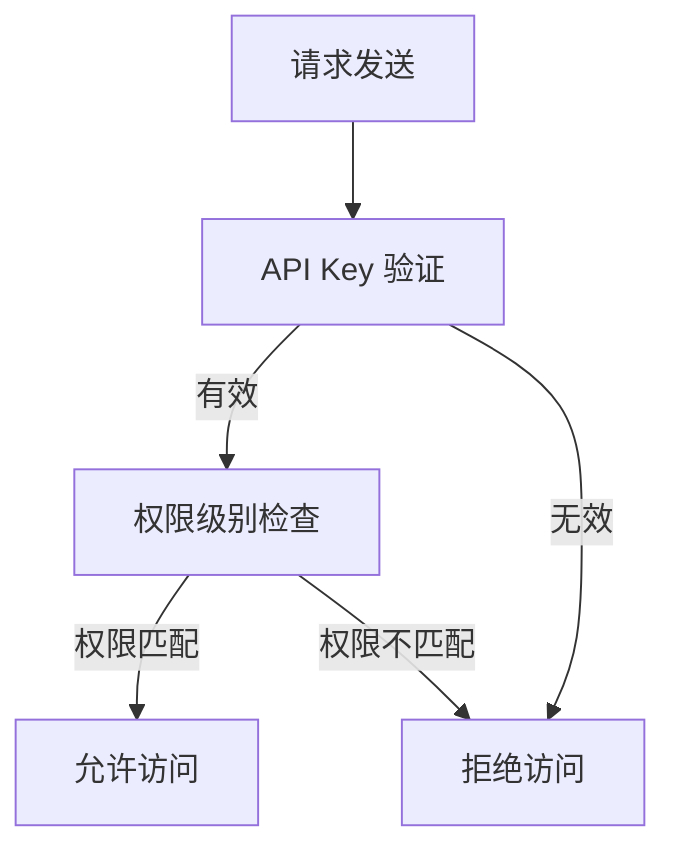

                 

### 背景介绍

在当今快速发展的数字化时代，API（应用程序编程接口）已经成为现代软件开发和系统互操作的关键组成部分。API允许不同系统和服务之间进行通信，促进了数据的共享和功能的扩展。然而，随着API的广泛应用，安全问题也日益突出。如何确保API的安全和可靠性，成为了开发者和运维人员面临的一个重要挑战。

在这个背景下，分级 API Key 应运而生，作为一种细粒度访问控制技术，旨在通过为不同类型的 API 访问设置不同的权限级别，从而有效地保护 API 的安全性和资源的合理分配。分级 API Key 的核心思想是将 API 的访问权限划分为多个级别，每个级别对应不同的权限集，用户根据其角色或职责只能访问对应级别的 API。

本文将详细探讨分级 API Key 的概念、原理和应用场景，帮助读者了解如何利用这一技术实现细粒度访问控制，从而保障 API 的安全与高效运行。我们将通过以下几个部分进行详细分析：

1. **核心概念与联系**：介绍分级 API Key 的基本概念和与相关技术的联系，包括 API Key、访问控制模型等。
2. **核心算法原理与具体操作步骤**：深入探讨分级 API Key 的算法原理和实现步骤，帮助读者掌握具体的技术实现方法。
3. **数学模型和公式**：讨论分级 API Key 中的数学模型和公式，包括权限评估和访问控制策略等。
4. **项目实战**：通过一个实际案例，展示如何使用分级 API Key 进行细粒度访问控制，并提供代码实现和详细解释。
5. **实际应用场景**：分析分级 API Key 在不同领域的实际应用场景，帮助读者了解其在不同场景下的适用性。
6. **工具和资源推荐**：推荐相关学习资源、开发工具和框架，以帮助读者进一步学习和实践分级 API Key 技术。

通过本文的详细分析，读者将能够全面了解分级 API Key 的技术原理和应用方法，为实际项目中的应用提供有力的支持。

### 核心概念与联系

要深入理解分级 API Key，我们首先需要了解一些核心概念和相关技术，这些将为后续的详细讨论奠定基础。

#### API Key

API Key 是一种身份验证机制，用于确保只有授权用户才能访问 API。每个 API Key 通常与一个唯一的用户或应用程序相关联。当用户请求 API 服务时，必须提供其 API Key，服务器端会验证该 Key 的有效性。如果 Key 是有效的，请求将被允许；否则，请求将被拒绝。API Key 通常包含在一个请求的头部信息（如 `Authorization: Bearer <API-Key>`）中。

#### 访问控制模型

访问控制模型是确保系统资源只能被授权用户访问的一组规则和策略。常见的访问控制模型包括基于角色的访问控制（RBAC）、基于属性的访问控制（ABAC）等。

- **基于角色的访问控制（RBAC）**：RBAC 将用户和权限分配给角色，用户通过所属角色获得权限。这种模型简单且易于管理，适用于大部分组织结构。
  
- **基于属性的访问控制（ABAC）**：ABAC 根据用户的属性（如用户角色、权限、时间等）来动态决定访问权限。这种模型提供了更高的灵活性，但实现起来较为复杂。

#### 分级 API Key

分级 API Key 是一种基于 API Key 的细粒度访问控制技术。它通过将 API Key 分为多个级别，并为每个级别分配不同的权限集，从而实现更精细的访问控制。具体来说，分级 API Key 的核心概念包括：

- **权限级别**：权限级别通常用一个整数或字符串表示，数值越大，权限级别越高。例如，级别 1 表示最低权限，级别 5 表示最高权限。

- **权限集**：每个权限级别对应一组权限，如读取、写入、删除等。权限集定义了用户或应用程序可以执行的操作。

- **授权机制**：服务器端根据用户的权限级别和请求的操作类型，动态决定是否允许访问。

#### Mermaid 流程图

为了更好地展示分级 API Key 的原理和架构，我们可以使用 Mermaid 流程图来描述其核心组件和交互流程。以下是分级 API Key 的 Mermaid 流程图：



在这个流程图中，当用户发送一个请求时，首先进行 API Key 验证。如果 API Key 有效，服务器将检查请求的权限级别，并与用户的权限级别进行匹配。如果权限匹配，请求将被允许；否则，请求将被拒绝。

#### 与其他技术的联系

分级 API Key 与其他访问控制技术（如 OAuth、JWT 等）有密切联系。

- **OAuth**：OAuth 是一种授权框架，允许第三方应用程序代表用户访问受保护的资源。OAuth 可以与分级 API Key 结合使用，为第三方应用程序提供细粒度的访问控制。

- **JWT（JSON Web Token）**：JWT 是一种基于 JSON 格式的安全令牌，用于在客户端和服务器之间传递认证信息。JWT 可以用于用户身份验证，并与分级 API Key 结合，实现更复杂的访问控制策略。

通过理解这些核心概念和技术，我们为后续的详细讨论和实际应用奠定了基础。在下一节中，我们将深入探讨分级 API Key 的核心算法原理和实现步骤。

### 核心算法原理与具体操作步骤

要实现分级 API Key 的细粒度访问控制，我们需要从算法原理和具体操作步骤入手。以下是详细的解析过程。

#### 权限级别划分

首先，我们需要定义权限级别。权限级别通常用一个整数或字符串表示，例如，从 1 到 5 表示不同的权限级别，其中 1 为最低权限，5 为最高权限。例如，我们可以定义如下权限级别：

- 权限级别 1：只能读取数据。
- 权限级别 2：可以读取和写入数据。
- 权限级别 3：可以读取、写入和删除数据。
- 权限级别 4：可以执行所有操作，除了修改数据。
- 权限级别 5：拥有完全控制权限。

#### 权限集定义

接下来，我们需要为每个权限级别定义相应的权限集。权限集是一个包含特定权限的集合，如读取、写入、删除等。例如：

- 权限级别 1 的权限集：`{"read"}`。
- 权限级别 2 的权限集：`{"read", "write"}`。
- 权限级别 3 的权限集：`{"read", "write", "delete"}`。
- 权限级别 4 的权限集：`{"read", "write", "delete", "modify"}`。
- 权限级别 5 的权限集：`{"read", "write", "delete", "modify", "admin"}`。

#### 算法原理

分级 API Key 的核心算法原理是基于权限级别和权限集的匹配。具体来说，算法流程如下：

1. **接收请求**：当用户请求访问 API 时，首先接收请求并提取 API Key。
2. **验证 API Key**：使用数据库或其他存储机制验证 API Key 的有效性。如果 API Key 有效，继续下一步；否则，返回错误响应。
3. **提取权限级别**：从 API Key 中提取权限级别。通常，权限级别可以嵌入在 API Key 中，或者通过其他方式（如请求头中的参数）传递。
4. **权限级别匹配**：将提取的权限级别与预定义的权限级别进行比较。如果权限级别匹配，继续下一步；否则，返回错误响应。
5. **检查权限集**：根据权限级别，检查用户的权限集。如果权限集包含请求的操作类型，允许访问；否则，返回错误响应。
6. **执行操作**：如果访问被允许，执行请求的操作；否则，返回错误响应。

以下是分级 API Key 的算法伪代码：

```python
def check_access(api_key, requested_action):
    # 验证 API Key
    if not validate_api_key(api_key):
        return "API Key 验证失败"

    # 提取权限级别
    permission_level = extract_permission_level(api_key)

    # 权限级别匹配
    if not is_permission_level_valid(permission_level):
        return "权限级别无效"

    # 检查权限集
    permission_set = get_permission_set(permission_level)
    if requested_action not in permission_set:
        return "权限不足"

    # 执行操作
    return "访问被允许，执行操作"

# 示例
api_key = "your_api_key"
requested_action = "write"
result = check_access(api_key, requested_action)
print(result)
```

#### 实际操作步骤

在实际操作中，分级 API Key 的实现过程如下：

1. **注册和分配 API Key**：在系统初始化时，为每个用户或应用程序分配一个 API Key。API Key 通常由一个唯一的标识符和相应的权限级别组成。
2. **请求 API 服务**：用户或应用程序在请求 API 服务时，必须在请求头部包含 API Key。
3. **验证 API Key**：服务器在接收到请求后，首先验证 API Key 的有效性。如果验证失败，返回错误响应。
4. **提取权限级别**：从 API Key 中提取权限级别。
5. **权限级别匹配**：检查提取的权限级别是否与系统预定义的权限级别相匹配。如果不匹配，返回错误响应。
6. **检查权限集**：根据权限级别，检查用户的权限集。如果权限集包含请求的操作类型，允许访问；否则，返回错误响应。
7. **执行操作**：如果访问被允许，执行请求的操作；否则，返回错误响应。

通过以上步骤，我们可以实现分级 API Key 的细粒度访问控制，从而确保 API 的安全和高效运行。

### 数学模型和公式

在分级 API Key 的实现过程中，数学模型和公式起到了关键作用，特别是在权限评估和访问控制策略的制定上。以下是几个重要的数学模型和公式的详细讲解。

#### 权限评估模型

权限评估模型用于计算用户请求的操作是否被允许。该模型的核心是定义一个权限评估函数，该函数接受用户权限级别和请求操作类型作为输入，返回一个布尔值，表示操作是否被允许。

1. **权限评估函数（`access_granted`）**：
   - 输入参数：`user_permission_level`（用户权限级别），`action`（请求操作类型）。
   - 输出：布尔值，表示是否允许访问。

   权限评估函数的数学模型可以表示为：
   $$ access_granted(user_permission_level, action) = \begin{cases} 
   True, & \text{如果 } action \in \text{user_permission_set} \\
   False, & \text{否则}
   \end{cases} $$

   其中，`user_permission_set` 是用户对应的权限集。

2. **示例**：
   - 用户权限级别：3（`{"read", "write", "delete"}`）。
   - 请求操作类型：`write`。

   则权限评估函数的计算过程为：
   $$ access_granted(3, "write") = True $$

#### 访问控制策略模型

访问控制策略模型用于定义系统对特定操作的访问控制规则。该模型通常包含以下三个参数：

1. **访问控制策略函数（`access_control_policy`）**：
   - 输入参数：`action`（请求操作类型），`permission_level`（用户权限级别），`policy`（访问控制策略）。
   - 输出：布尔值，表示是否允许访问。

   访问控制策略函数的数学模型可以表示为：
   $$ access_control_policy(action, permission_level, policy) = \begin{cases} 
   True, & \text{如果 policy[permission_level][action] == "allow"} \\
   False, & \text{否则}
   \end{cases} $$

   其中，`policy` 是一个访问控制策略矩阵，`permission_level` 和 `action` 是索引。

3. **示例**：
   - 访问控制策略矩阵（`policy`）：
     ```python
     policy = {
         1: {"read": "allow", "write": "deny", "delete": "deny"},
         2: {"read": "allow", "write": "allow", "delete": "deny"},
         3: {"read": "allow", "write": "allow", "delete": "allow"},
         4: {"read": "allow", "write": "allow", "delete": "allow", "modify": "allow"},
         5: {"read": "allow", "write": "allow", "delete": "allow", "modify": "allow", "admin": "allow"}
     }
     ```

   - 请求操作类型：`write`。
   - 用户权限级别：2。

   则访问控制策略函数的计算过程为：
   $$ access_control_policy("write", 2, policy) = True $$

#### 权限集匹配模型

权限集匹配模型用于检查用户请求的操作是否在其权限集内。该模型的核心是定义一个权限集匹配函数，该函数接受用户权限集和请求操作类型作为输入，返回一个布尔值，表示操作是否被允许。

1. **权限集匹配函数（`permission_match`）**：
   - 输入参数：`user_permission_set`（用户权限集），`action`（请求操作类型）。
   - 输出：布尔值，表示是否允许访问。

   权限集匹配函数的数学模型可以表示为：
   $$ permission_match(user_permission_set, action) = \begin{cases} 
   True, & \text{如果 action \in user_permission_set} \\
   False, & \text{否则}
   \end{cases} $$

2. **示例**：
   - 用户权限集：`{"read", "write"}`。
   - 请求操作类型：`write`。

   则权限集匹配函数的计算过程为：
   $$ permission_match({"read", "write"}, "write") = True $$

#### 综合示例

假设我们有一个用户，其权限级别为 3（`{"read", "write", "delete"}`），请求操作类型为 `write`。我们定义了一个访问控制策略矩阵，如下所示：

```python
policy = {
    1: {"read": "allow", "write": "deny", "delete": "deny"},
    2: {"read": "allow", "write": "allow", "delete": "deny"},
    3: {"read": "allow", "write": "allow", "delete": "allow"},
    4: {"read": "allow", "write": "allow", "delete": "allow", "modify": "allow"},
    5: {"read": "allow", "write": "allow", "delete": "allow", "modify": "allow", "admin": "allow"}
}
```

我们使用上述数学模型来评估该用户的请求：

1. **权限评估函数**：
   $$ access_granted(3, "write") = True $$
2. **访问控制策略函数**：
   $$ access_control_policy("write", 3, policy) = True $$
3. **权限集匹配函数**：
   $$ permission_match({"read", "write", "delete"}, "write") = True $$

由于三个函数的返回值均为 `True`，该用户的请求被允许。

通过以上数学模型和公式，我们可以有效地评估用户的权限，确保 API 访问的安全性和合理性。

### 项目实战：代码实际案例和详细解释说明

为了更好地展示如何使用分级 API Key 进行细粒度访问控制，我们将通过一个实际项目案例来详细讲解代码实现和操作步骤。以下是这个项目的开发环境搭建、源代码详细实现和代码解读。

#### 1. 开发环境搭建

在开始编写代码之前，我们需要搭建一个合适的项目环境。以下是我们推荐的开发工具和框架：

- **编程语言**：Python
- **框架**：Flask（一个轻量级 Web 框架）
- **数据库**：SQLite（用于存储 API Key 和权限级别）
- **身份验证库**：Flask-HTTPAuth（用于处理 API Key 验证）

#### 2. 源代码详细实现

以下是使用 Flask 框架实现的分级 API Key 项目示例：

```python
from flask import Flask, jsonify, request
from flask_httpauth import HTTPBasicAuth
import sqlite3

app = Flask(__name__)
auth = HTTPBasicAuth()

# 权限级别和权限集定义
permission_levels = {
    1: {"read": True, "write": False, "delete": False},
    2: {"read": True, "write": True, "delete": False},
    3: {"read": True, "write": True, "delete": True},
    4: {"read": True, "write": True, "delete": True, "modify": True},
    5: {"read": True, "write": True, "delete": True, "modify": True, "admin": True}
}

# API Key 验证函数
@auth.verify_password
def verify_password(api_key):
    conn = sqlite3.connect('api_key.db')
    cursor = conn.cursor()
    cursor.execute("SELECT * FROM api_keys WHERE api_key=?", (api_key,))
    user = cursor.fetchone()
    conn.close()
    if user:
        return user[0]
    return None

# 权限检查装饰器
def permission_required(permission_level):
    def decorator(f):
        @wraps(f)
        def decorated_function(*args, **kwargs):
            user_permission_level = get_permission_level(auth.current_user())
            if user_permission_level < permission_level:
                return jsonify({"error": "权限不足"}), 403
            return f(*args, **kwargs)
        return decorated_function
    return decorator

# 获取用户权限级别
def get_permission_level(username):
    conn = sqlite3.connect('api_key.db')
    cursor = conn.cursor()
    cursor.execute("SELECT permission_level FROM users WHERE username=?", (username,))
    permission_level = cursor.fetchone()[0]
    conn.close()
    return permission_level

# 测试 API 端点
@app.route('/test', methods=['GET'])
@auth.login_required
@permission_required(2)
def test_api():
    return jsonify({"message": "API 访问成功"})

if __name__ == '__main__':
    app.run(debug=True)
```

#### 3. 代码解读与分析

以下是代码的详细解读：

1. **权限级别和权限集定义**：

   ```python
   permission_levels = {
       1: {"read": True, "write": False, "delete": False},
       2: {"read": True, "write": True, "delete": False},
       3: {"read": True, "write": True, "delete": True},
       4: {"read": True, "write": True, "delete": True, "modify": True},
       5: {"read": True, "write": True, "delete": True, "modify": True, "admin": True}
   }
   ```

   这里我们定义了五个权限级别，每个级别对应一个权限集，包括 `read`、`write`、`delete`、`modify` 和 `admin` 等操作。

2. **API Key 验证函数**：

   ```python
   @auth.verify_password
   def verify_password(api_key):
       conn = sqlite3.connect('api_key.db')
       cursor = conn.cursor()
       cursor.execute("SELECT * FROM api_keys WHERE api_key=?", (api_key,))
       user = cursor.fetchone()
       conn.close()
       if user:
           return user[0]
       return None
   ```

   `verify_password` 函数用于验证传入的 API Key 是否有效。我们使用 SQLite 数据库存储 API Key 和用户信息。如果 API Key 有效，返回用户名；否则，返回 `None`。

3. **权限检查装饰器**：

   ```python
   def permission_required(permission_level):
       def decorator(f):
           @wraps(f)
           def decorated_function(*args, **kwargs):
               user_permission_level = get_permission_level(auth.current_user())
               if user_permission_level < permission_level:
                   return jsonify({"error": "权限不足"}), 403
               return f(*args, **kwargs)
           return decorated_function
       return decorator
   ```

   `permission_required` 装饰器用于检查用户的权限级别是否满足要求。如果权限不足，返回一个错误响应；否则，继续执行下一个函数。

4. **获取用户权限级别**：

   ```python
   def get_permission_level(username):
       conn = sqlite3.connect('api_key.db')
       cursor = conn.cursor()
       cursor.execute("SELECT permission_level FROM users WHERE username=?", (username,))
       permission_level = cursor.fetchone()[0]
       conn.close()
       return permission_level
   ```

   `get_permission_level` 函数用于从数据库中获取指定用户的权限级别。

5. **测试 API 端点**：

   ```python
   @app.route('/test', methods=['GET'])
   @auth.login_required
   @permission_required(2)
   def test_api():
       return jsonify({"message": "API 访问成功"})
   ```

   `/test` API 端点仅对权限级别为 2 及以上的用户开放。用户在访问该端点时，必须首先通过 API Key 验证，然后权限级别也要满足要求。

通过这个实际项目案例，我们可以看到如何使用分级 API Key 实现细粒度访问控制。这个案例涵盖了 API Key 的验证、权限检查和具体操作的实现，为实际应用提供了有力的参考。

### 实际应用场景

分级 API Key 在各种实际应用场景中都有广泛的应用，尤其在安全性要求较高的系统中，它能够为系统提供细粒度的访问控制和更高的安全性。以下是一些典型的实际应用场景：

#### 1. 云服务平台

云服务平台通常提供多种 API 服务，供开发人员、企业用户和管理员使用。使用分级 API Key，可以针对不同用户角色分配不同的权限级别，确保资源的合理分配和安全性。例如：

- **开发人员**：拥有读取和写入数据的权限，但不能执行删除操作。
- **企业用户**：拥有读取、写入和删除数据的权限，但无权执行管理员级别的操作。
- **管理员**：拥有所有权限，包括修改和删除数据，以及管理其他用户的权限。

#### 2. 企业内部系统

在企业内部系统中，分级 API Key 可以用于保护敏感数据和关键功能。例如：

- **员工**：可以读取和写入个人相关的数据，但无权访问其他部门的敏感信息。
- **经理**：除了员工权限外，还可以访问特定部门的敏感数据和报告。
- **CIO 或 IT 经理**：拥有最高权限，可以访问所有系统和数据，包括系统配置和管理。

#### 3. 第三方应用集成

第三方应用集成时，分级 API Key 可以确保应用只能访问其授权的数据和功能。例如，一个天气预报应用可能只需要读取天气数据的权限，而不需要修改数据的权限。通过分级 API Key，可以精确控制应用的访问权限，防止数据泄露和滥用。

#### 4. 公共 API 服务

对于公共 API 服务，分级 API Key 可以用于限制免费用户和付费用户的访问权限。例如：

- **免费用户**：只能访问有限的公开数据，如城市天气预报。
- **付费用户**：可以访问更详细的数据，如特定地区的实时天气信息、历史天气数据等。

#### 5. 物联网设备

在物联网（IoT）应用中，分级 API Key 可以用于确保设备只能访问其授权的数据和功能。例如：

- **传感器设备**：只能读取和发送传感器数据。
- **控制设备**：可以读取传感器数据，并进行控制操作。
- **管理系统**：可以访问所有设备的数据，执行监控和管理任务。

#### 6. 移动应用

移动应用通常通过 API 与后端服务进行通信。使用分级 API Key，可以确保用户只能访问其授权的数据和功能。例如：

- **普通用户**：可以访问其个人数据，如账户信息、订单历史等。
- **管理员**：可以访问所有用户的数据，以及执行管理操作。

通过以上实际应用场景的介绍，我们可以看到分级 API Key 在各种场景下的重要性。它不仅能够提高系统的安全性，还能提供灵活的权限管理机制，满足不同用户和角色的需求。

### 工具和资源推荐

在学习和使用分级 API Key 的过程中，有一些优秀的工具和资源可以为您提供帮助。以下是一些建议：

#### 1. 学习资源推荐

- **书籍**：
  - 《API 设计最佳实践》（API Design: Celebrating the Art and Science of Creating Interfaces That Developers Love）提供了全面而深入的 API 设计指导。
  - 《REST API 设计指南》（RESTful Web API Design Rulebook）详细讲解了 RESTful API 的设计和实现。

- **论文**：
  - "OAuth 2.0: The Final Specification" 提供了 OAuth 2.0 的完整规范，有助于理解 OAuth 与分级 API Key 的关系。
  - "An Architecture for Secure Web Services" 探讨了 Web 服务安全的架构设计。

- **博客**：
  - Medium、博客园等平台上有许多关于 API 设计和权限控制的文章，您可以从中获取灵感和实践技巧。
  - API 设计和 OAuth 相关的博客，如 RestApi.Org、Auth0 等，提供了大量实用案例和最佳实践。

- **网站**：
  - API Reference Guide（如 Swagger、OpenAPI）提供了丰富的 API 设计文档和工具，帮助您规范和验证 API。
  - GitHub 上有许多开源项目，您可以参考和学习其中的权限控制和 API 访问控制实现。

#### 2. 开发工具框架推荐

- **API 网关**：
  - Kong：一个开源 API 网关，提供丰富的插件和灵活的权限控制机制。
  - APIGEE：IBM 的 API 网关，支持多种协议和丰富的权限管理功能。

- **身份验证和访问控制**：
  - OAuth2：用于实现 OAuth 2.0 标准的开源库，支持多种编程语言。
  - JWT：用于生成和验证 JSON Web Tokens（JWT）的开源库，确保 API 访问的安全性。

- **开发框架**：
  - Flask：Python 的轻量级 Web 框架，适合快速开发和实验。
  - Spring Boot：Java 的 Web 应用开发框架，提供强大的权限控制和认证功能。

- **测试工具**：
  - Postman：用于 API 开发和测试的强大工具，支持 OAuth2 认证和多种协议。
  - JMeter：用于性能测试和负载测试的开源工具，可以帮助您评估 API 的性能和稳定性。

#### 3. 相关论文著作推荐

- **"OAuth 2.0: The Final Specification"**：详细阐述了 OAuth 2.0 的标准和实现。
- **"RESTful API Design: Creating Hypermedia-Driven Web Resources"**：探讨了 RESTful API 的设计和最佳实践。
- **"A Technical Introduction to Microsoft Azure Active Directory"**：介绍了 Azure Active Directory 的架构和权限控制。

通过这些工具和资源的推荐，您将能够更深入地了解分级 API Key 的技术原理和应用方法，为实际项目提供有力支持。

### 总结：未来发展趋势与挑战

随着数字化转型的不断深入，API 的使用越来越广泛，分级 API Key 作为细粒度访问控制技术，其在保障 API 安全性和资源合理分配方面的重要性日益凸显。未来，分级 API Key 在以下几个方面有望实现重要的发展：

#### 1. 集成与标准化

未来，分级 API Key 将与其他访问控制技术（如 OAuth、JWT 等）进一步集成，形成一套完整的访问控制解决方案。同时，标准化工作也将持续推进，以统一 API Key 的格式和权限级别的定义，提高系统的互操作性和可维护性。

#### 2. 隐私保护

随着隐私保护法规的不断完善，分级 API Key 将需要更多地考虑用户的隐私保护。未来的分级 API Key 将可能引入更多的隐私保护机制，如数据加密、访问日志审计等，以确保用户数据的安全。

#### 3. 自动化与智能化

为了提高访问控制的效率，未来的分级 API Key 可能会引入更多的自动化和智能化技术。例如，利用机器学习算法对访问行为进行实时分析和预测，提前发现潜在的安全威胁，自动调整权限级别，提高系统的自适应能力。

#### 4. 多维度权限控制

未来的分级 API Key 可能会支持多维度权限控制，不仅基于用户角色和权限级别，还可能基于设备、地理位置、时间等多种因素，实现更加精细和动态的访问控制。

然而，随着分级 API Key 的广泛应用，也面临一些挑战：

#### 1. 权限复杂度

权限级别和权限集的不断增加，可能导致权限复杂度的上升，使得管理和维护变得更加困难。如何设计简洁、直观的权限管理界面，降低用户的认知负担，是未来需要解决的一个重要问题。

#### 2. 安全漏洞

分级 API Key 本身也可能存在安全漏洞，如 API Key 泄露、权限级别漏洞等。未来的安全研究需要不断发现和修补这些漏洞，提高系统的安全性。

#### 3. 性能优化

随着访问控制规则的复杂化，分级 API Key 的性能可能受到影响。如何优化访问控制算法和系统架构，确保在高效处理大量请求的同时，保持良好的性能，是未来需要关注的一个方向。

总之，分级 API Key 作为一种重要的访问控制技术，在未来将继续发挥重要作用。通过不断优化和改进，它将能够更好地应对数字化转型带来的挑战，为系统的安全性和高效运行提供有力保障。

### 附录：常见问题与解答

在本文的探讨过程中，可能会遇到一些关于分级 API Key 的问题。以下是一些常见问题及其解答：

#### 1. 什么是分级 API Key？

分级 API Key 是一种基于权限级别的细粒度访问控制技术。通过将 API Key 分为多个级别，并为每个级别分配不同的权限集，实现更精细的访问控制，确保系统资源的安全和合理分配。

#### 2. 分级 API Key 如何工作？

分级 API Key 的工作流程包括以下几个步骤：
- 用户请求访问 API，并在请求中包含 API Key。
- 服务器端验证 API Key 的有效性。
- 从 API Key 中提取权限级别。
- 检查权限级别与请求的操作是否匹配，并允许或拒绝访问。

#### 3. 分级 API Key 与 OAuth 有何区别？

OAuth 是一种授权框架，允许第三方应用程序代表用户访问受保护的资源。而分级 API Key 是一种基于权限级别的访问控制技术，主要用于实现细粒度的权限管理。OAuth 可以与分级 API Key 结合使用，提供更复杂的访问控制策略。

#### 4. 如何在 Python 中实现分级 API Key？

在 Python 中，可以使用 Flask 框架结合 Flask-HTTPAuth 库实现分级 API Key。以下是基本步骤：
- 定义权限级别和权限集。
- 创建 API Key 验证函数，用于验证 API Key 的有效性。
- 使用装饰器实现权限检查，确保请求的操作符合用户的权限级别。

#### 5. 分级 API Key 是否安全？

分级 API Key 本身是一种访问控制技术，其安全性取决于 API Key 的管理方式。为了提高安全性，建议采取以下措施：
- 定期更换 API Key。
- 对 API Key 进行加密存储。
- 限制 API Key 的访问权限。

通过了解这些常见问题，读者可以更好地理解分级 API Key 的技术原理和应用方法。

### 扩展阅读 & 参考资料

在探索分级 API Key 的过程中，以下文献和资源将有助于读者深入了解相关技术，拓展知识视野：

1. **"API Design: Celebrating the Art and Science of Creating Interfaces That Developers Love" by Sam Ruby**：这是一本关于 API 设计的权威指南，详细介绍了 API 设计的最佳实践。

2. **"RESTful API Design: Creating Hypermedia-Driven Web Resources" by Adam du Plessis**：这本书探讨了 RESTful API 的设计和实现，提供了丰富的设计模式和策略。

3. **"OAuth 2.0: The Final Specification"**：这是 OAuth 2.0 的官方规范文档，详细阐述了 OAuth 2.0 的标准和实现方法。

4. **"A Technical Introduction to Microsoft Azure Active Directory"**：这篇文档介绍了 Azure Active Directory 的架构和权限控制，有助于理解企业级访问控制。

5. **"An Architecture for Secure Web Services"**：这篇论文探讨了 Web 服务安全的架构设计，为 API 安全性提供了有益的参考。

6. **"Kong API Gateway"（https://getkong.org/）**：Kong 是一个开源的 API 网关，提供了丰富的权限控制插件和文档。

7. **"Flask-HTTPAuth"（https://flask-httpauth.readthedocs.io/）**：这是 Flask 的一个扩展库，用于实现 HTTP 认证和权限控制。

通过这些扩展阅读和参考资料，读者可以进一步掌握分级 API Key 的技术原理和应用方法，为实际项目提供更深入的见解和支持。

