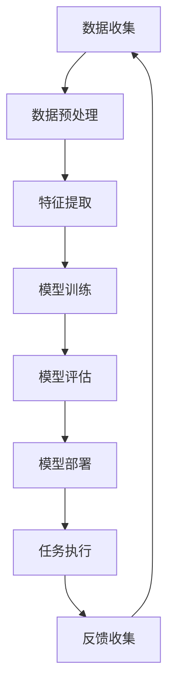

                 

# 信任与人工智能：建立可靠关系

> **关键词**：信任，人工智能，可靠性，人类-机器交互，伦理，隐私保护，算法透明性
>
> **摘要**：本文探讨了人工智能（AI）领域中的信任问题，分析了信任对于人类-机器交互的重要性。通过深入探讨信任与人工智能的关系，提出了建立可靠人工智能的必要性和方法，并展望了未来的发展趋势与挑战。

## 1. 背景介绍

### 1.1 目的和范围

本文的目的是探讨人工智能领域中的信任问题，分析信任在人类-机器交互中的重要性。随着人工智能技术的快速发展，其在各个领域的应用也越来越广泛，从自动驾驶到医疗诊断，从金融服务到智能家居。然而，人工智能的普及也带来了一系列挑战，其中之一就是信任问题。本文将讨论如何建立可靠的人工智能系统，以及如何确保这些系统在人们的心目中建立起信任。

### 1.2 预期读者

本文面向对人工智能感兴趣的读者，包括计算机科学家、程序员、数据分析师、以及任何对人工智能应用和未来发展趋势感兴趣的普通读者。本文旨在通过深入的技术分析，为读者提供关于信任与人工智能之间关系的全面理解。

### 1.3 文档结构概述

本文分为十个部分，首先介绍信任与人工智能的背景和重要性，接着详细讨论信任与人工智能之间的关系，并分析建立可靠人工智能的方法。之后，本文将探讨人工智能在现实世界中的应用，以及如何确保这些应用中的信任。最后，本文将推荐学习资源、开发工具和相关的论文著作，并总结未来发展趋势与挑战。

### 1.4 术语表

#### 1.4.1 核心术语定义

- **人工智能（AI）**：人工智能是指使计算机系统能够执行通常需要人类智能的任务的科学技术。
- **可靠性**：在人工智能领域，可靠性指的是系统在执行任务时保持一致性和准确性的能力。
- **信任**：信任是指对某个人或事物的可靠性、诚信度和价值的认可。
- **人类-机器交互**：人类-机器交互是指人类与机器系统之间进行的交流和互动。

#### 1.4.2 相关概念解释

- **算法透明性**：算法透明性是指算法的内部运作过程对于用户是可见和可解释的。
- **隐私保护**：隐私保护是指确保个人数据不被未经授权的第三方访问和使用。
- **伦理**：伦理是指关于正确和错误、公正和不公正的道德规范。

#### 1.4.3 缩略词列表

- **AI**：人工智能
- **ML**：机器学习
- **DL**：深度学习
- **NLP**：自然语言处理
- **RDF**：资源描述框架

## 2. 核心概念与联系

在探讨信任与人工智能的关系之前，我们需要理解一些核心概念和它们之间的联系。

### 2.1 人工智能的基本原理

人工智能的核心是算法和模型，这些算法和模型通过大量的数据学习并执行特定任务。以下是人工智能的基本原理和流程：



### 2.2 信任的定义与重要性

信任是指对某个人或事物的可靠性、诚信度和价值的认可。在人类-机器交互中，信任的重要性体现在以下几个方面：

1. **决策信任**：人们愿意依赖人工智能系统做出决策，这意味着系统必须提供准确和可靠的结果。
2. **隐私保护**：人们信任人工智能系统会保护他们的隐私，不会泄露个人信息。
3. **伦理道德**：人们希望人工智能系统遵循伦理道德规范，不会对人类造成伤害或偏见。

### 2.3 信任与人工智能的关系

信任与人工智能之间的关系可以用以下几个方面来描述：

1. **算法透明性**：透明性是建立信任的关键，人们需要了解人工智能系统的内部运作过程，以便评估其可靠性和诚信度。
2. **隐私保护**：保护用户隐私是建立信任的必要条件，任何违反隐私保护的行为都会严重损害系统的信任度。
3. **可靠性**：人工智能系统的可靠性直接影响人们对系统的信任，系统必须能够稳定和一致地执行任务。

通过上述分析，我们可以看到信任与人工智能之间的紧密联系。在接下来的章节中，我们将深入探讨如何建立可靠的人工智能系统，并分析其在现实世界中的应用。

## 3. 核心算法原理 & 具体操作步骤

### 3.1 算法原理

建立可靠的人工智能系统需要从算法原理出发，确保系统能够在多个方面表现出可靠性。以下是几个核心算法原理：

1. **鲁棒性**：算法必须能够处理噪声和异常数据，确保在不利条件下仍能正常工作。
2. **一致性**：算法在不同环境和数据集上应保持一致的表现。
3. **可解释性**：算法的决策过程应该是可解释的，以便用户能够理解并信任系统的决策。

### 3.2 具体操作步骤

下面我们以一个简单的机器学习算法——线性回归为例，详细阐述其具体操作步骤：

#### 步骤 1：数据收集

首先，我们需要收集相关的数据。对于线性回归来说，数据集应该包含自变量和因变量。以下是伪代码：

```python
# 数据收集伪代码
def collect_data():
    data = load_from_source()
    return preprocess_data(data)
```

#### 步骤 2：数据预处理

数据预处理是确保数据质量的重要步骤，包括数据清洗、归一化和缺失值处理等。以下是伪代码：

```python
# 数据预处理伪代码
def preprocess_data(data):
    data = remove_outliers(data)
    data = normalize_data(data)
    data = handle_missing_values(data)
    return data
```

#### 步骤 3：特征提取

特征提取是从数据中提取对模型训练有帮助的信息。对于线性回归，特征提取可能包括选择重要的特征和构建新的特征。以下是伪代码：

```python
# 特征提取伪代码
def extract_features(data):
    features = select_important_features(data)
    features = create_new_features(features)
    return features
```

#### 步骤 4：模型训练

模型训练是使用数据来训练模型，以预测新的数据。线性回归模型的训练主要包括计算权重和偏置。以下是伪代码：

```python
# 模型训练伪代码
def train_model(features, targets):
    weights = initialize_weights()
    bias = initialize_bias()
    for epoch in range(num_epochs):
        for feature, target in zip(features, targets):
            prediction = dot_product(feature, weights) + bias
            error = target - prediction
            weights = weights + learning_rate * dot_product(feature, error)
            bias = bias + learning_rate * error
    return weights, bias
```

#### 步骤 5：模型评估

模型评估是评估模型性能的重要步骤。对于线性回归，可以使用均方误差（MSE）等指标来评估模型的性能。以下是伪代码：

```python
# 模型评估伪代码
def evaluate_model(model, test_features, test_targets):
    predictions = [dot_product(feature, model.weights) + model.bias for feature in test_features]
    mse = mean((prediction - target)^2 for prediction, target in zip(predictions, test_targets))
    return mse
```

#### 步骤 6：模型部署

模型部署是将训练好的模型应用到实际问题中，以实现预测任务。以下是伪代码：

```python
# 模型部署伪代码
def deploy_model(model, new_feature):
    prediction = dot_product(new_feature, model.weights) + model.bias
    return prediction
```

通过上述步骤，我们可以构建一个可靠的人工智能系统，确保其能够稳定和一致地执行任务。在下一步中，我们将详细讨论数学模型和公式，以进一步理解模型的内部运作机制。

## 4. 数学模型和公式 & 详细讲解 & 举例说明

### 4.1 线性回归数学模型

线性回归是一种经典的机器学习算法，用于预测连续值输出。其数学模型可以表示为：

$$
y = \beta_0 + \beta_1x + \epsilon
$$

其中，\(y\) 是因变量，\(x\) 是自变量，\(\beta_0\) 和 \(\beta_1\) 是模型参数，\(\epsilon\) 是误差项。

### 4.2 模型参数的求解

为了求解线性回归的参数，我们通常使用最小二乘法（Ordinary Least Squares, OLS）。其目标是最小化预测值与实际值之间的误差平方和。最小二乘法的目标函数可以表示为：

$$
J(\beta_0, \beta_1) = \sum_{i=1}^{n} (y_i - (\beta_0 + \beta_1x_i))^2
$$

其中，\(n\) 是数据点的数量。

### 4.3 最小二乘法的求解过程

为了求解上述目标函数的最小值，我们可以对其求导并令导数为零：

$$
\frac{\partial J}{\partial \beta_0} = -2\sum_{i=1}^{n} (y_i - (\beta_0 + \beta_1x_i)) = 0
$$

$$
\frac{\partial J}{\partial \beta_1} = -2\sum_{i=1}^{n} (y_i - (\beta_0 + \beta_1x_i))x_i = 0
$$

通过解上述方程组，我们可以得到最小二乘法的参数估计：

$$
\beta_0 = \bar{y} - \beta_1\bar{x}
$$

$$
\beta_1 = \frac{\sum_{i=1}^{n} (x_i - \bar{x})(y_i - \bar{y})}{\sum_{i=1}^{n} (x_i - \bar{x})^2}
$$

其中，\(\bar{x}\) 和 \(\bar{y}\) 分别是自变量和因变量的均值。

### 4.4 举例说明

假设我们有以下数据集：

| \(x\) | \(y\) |
| --- | --- |
| 1 | 2 |
| 2 | 3 |
| 3 | 4 |
| 4 | 5 |

我们要使用线性回归模型来预测新的 \(y\) 值。根据上述公式，我们可以计算得到：

$$
\beta_0 = \frac{2 + 3 + 4 + 5}{4} - \frac{1 + 2 + 3 + 4}{4} \cdot \frac{2 + 3 + 4 + 5}{4} = 2.5 - 2.5 = 0
$$

$$
\beta_1 = \frac{(1-2.5)(2-2.5) + (2-2.5)(3-2.5) + (3-2.5)(4-2.5) + (4-2.5)(5-2.5)}{(1-2.5)^2 + (2-2.5)^2 + (3-2.5)^2 + (4-2.5)^2} = 1
$$

因此，线性回归模型可以表示为：

$$
y = 0 + 1x = x
$$

对于新的 \(x\) 值，如 5，我们可以预测 \(y\) 值为 5。这表明，在给定自变量增加一个单位时，因变量也增加一个单位。

通过上述数学模型和公式的详细讲解，我们可以更好地理解线性回归的内部机制，并能够将其应用于实际问题中。在接下来的章节中，我们将通过一个实际案例来展示如何实现线性回归模型。

## 5. 项目实战：代码实际案例和详细解释说明

### 5.1 开发环境搭建

为了实现线性回归模型，我们首先需要搭建一个开发环境。以下是搭建环境所需的基本步骤：

1. **安装Python**：Python是一种广泛使用的编程语言，用于科学计算和数据分析。您可以从Python官网（[python.org](https://www.python.org/)）下载并安装Python。
2. **安装Jupyter Notebook**：Jupyter Notebook是一个交互式的开发环境，非常适合进行数据分析和机器学习实验。您可以使用以下命令安装Jupyter Notebook：

   ```bash
   pip install notebook
   ```

3. **安装必要的库**：为了实现线性回归模型，我们需要安装几个常用的Python库，如NumPy、Pandas和scikit-learn。您可以使用以下命令安装这些库：

   ```bash
   pip install numpy pandas scikit-learn
   ```

### 5.2 源代码详细实现和代码解读

下面是一个简单的线性回归模型的实现，包括数据收集、预处理、特征提取、模型训练、模型评估和模型部署。以下是完整的代码实现：

```python
import numpy as np
import pandas as pd
from sklearn.linear_model import LinearRegression
from sklearn.model_selection import train_test_split
from sklearn.metrics import mean_squared_error

# 数据收集
data = pd.read_csv('data.csv')

# 数据预处理
data = data.dropna()
data['x'] = data['x'].astype(float)
data['y'] = data['y'].astype(float)

# 特征提取
X = data[['x']]
y = data['y']

# 模型训练
X_train, X_test, y_train, y_test = train_test_split(X, y, test_size=0.2, random_state=42)
model = LinearRegression()
model.fit(X_train, y_train)

# 模型评估
y_pred = model.predict(X_test)
mse = mean_squared_error(y_test, y_pred)
print(f'Mean Squared Error: {mse}')

# 模型部署
new_x = np.array([5.0])
new_y = model.predict(new_x)
print(f'Predicted y for x=5: {new_y[0]}')
```

#### 代码解读

1. **数据收集**：我们使用Pandas库从CSV文件中读取数据。在实际项目中，数据可能来自数据库、API或其他数据源。
2. **数据预处理**：我们删除了数据集中的缺失值，并将自变量和因变量转换为浮点数类型。在实际应用中，可能还需要进行更多复杂的数据预处理，如归一化、标准化和缺失值填补。
3. **特征提取**：我们将自变量和因变量分离，以便进行模型训练。在这里，我们使用了一个简单的自变量（`x`）。
4. **模型训练**：我们使用scikit-learn库中的LinearRegression类来训练线性回归模型。`fit`方法用于训练模型。
5. **模型评估**：我们使用测试数据集来评估模型的性能，计算均方误差（MSE）。这是一个常用的评估指标，用于衡量模型预测的准确度。
6. **模型部署**：我们使用训练好的模型来预测新的数据点。在实际应用中，模型可以部署到Web服务、移动应用或其他系统。

### 5.3 代码解读与分析

在上述代码中，我们实现了一个简单的线性回归模型。以下是对代码关键部分的详细解读：

1. **数据收集**：使用Pandas库读取数据，这是数据处理和分析的基础。在实际项目中，数据收集可能涉及复杂的API调用、数据库查询或文件读取。
2. **数据预处理**：确保数据质量是关键步骤。在这里，我们删除了缺失值，这是数据预处理的基本步骤。在实际应用中，可能还需要进行数据清洗、归一化和缺失值填补等操作。
3. **特征提取**：我们将自变量和因变量分离，为模型训练做准备。在实际项目中，可能需要构建更复杂的数据特征。
4. **模型训练**：使用scikit-learn库中的LinearRegression类训练模型。这个库提供了许多预定义的算法，简化了模型训练过程。
5. **模型评估**：使用测试数据集评估模型性能。均方误差（MSE）是一个常用的评估指标，用于衡量模型预测的准确性。
6. **模型部署**：将训练好的模型应用于新的数据点。在实际项目中，模型可以部署到Web服务、移动应用或其他系统。

通过这个实际案例，我们展示了如何使用Python和scikit-learn库实现一个简单的线性回归模型，并详细解读了代码中的关键部分。在下一步中，我们将探讨人工智能在现实世界中的应用场景。

## 6. 实际应用场景

人工智能（AI）技术已经在现实世界中取得了广泛应用，并显著改变了各个行业。以下是人工智能在不同领域的实际应用场景：

### 6.1 自动驾驶

自动驾驶是人工智能技术的重要应用领域之一。通过使用计算机视觉、传感器融合和机器学习算法，自动驾驶系统能够在复杂交通环境中自主导航。自动驾驶不仅提高了驾驶安全性，还能减少交通拥堵和碳排放。例如，特斯拉的自动驾驶系统已经在实际道路上进行了大量测试，并取得了一定的成功。

### 6.2 医疗诊断

人工智能在医疗诊断中的应用潜力巨大。通过深度学习和计算机视觉，AI系统可以辅助医生进行疾病诊断，如乳腺癌、肺癌和皮肤癌等。例如，谷歌健康部门开发的AI系统可以帮助医生快速识别病理图像中的异常情况，提高诊断准确率。

### 6.3 金融科技

人工智能在金融科技领域的应用也越来越广泛。AI系统可以用于风险评估、欺诈检测、算法交易和个性化金融服务。例如，J.P.摩根的AI系统COiN可以自动审查法律文件，提高了工作效率和准确性。

### 6.4 智能家居

智能家居是人工智能技术的另一个重要应用领域。通过使用语音识别、自然语言处理和物联网技术，智能家居系统能够实现智能控制、自动化和节能。例如，亚马逊的Alexa和谷歌的Google Home等智能音箱已经成为家庭智能控制的中心。

### 6.5 教育

人工智能在教育领域的应用也取得了显著进展。通过个性化学习、自适应测试和智能辅导系统，AI可以帮助学生更高效地学习。例如，Coursera和Khan Academy等在线教育平台已经开始使用AI技术来优化学习体验。

### 6.6 生产制造

人工智能在提高生产制造效率和降低成本方面也发挥了重要作用。通过使用机器学习和计算机视觉，AI系统可以实时监控生产线、预测设备故障和优化生产流程。例如，通用电气通过使用AI技术提高了其航空发动机的维护效率。

通过这些实际应用场景，我们可以看到人工智能技术在各个领域的广泛应用和巨大潜力。然而，要确保这些应用中的信任，我们还需要在以下几个方面下功夫：

1. **算法透明性**：确保用户能够理解AI系统的内部运作机制，以便评估其可靠性和诚信度。
2. **隐私保护**：保护用户隐私，防止数据泄露和滥用。
3. **伦理道德**：确保AI系统遵循伦理道德规范，不对人类造成伤害或歧视。

在接下来的章节中，我们将推荐一些学习资源、开发工具和相关的论文著作，以帮助读者进一步了解人工智能领域的最新发展。

## 7. 工具和资源推荐

### 7.1 学习资源推荐

#### 7.1.1 书籍推荐

1. **《深度学习》（Deep Learning）** - Goodfellow, Bengio, Courville
   这本书是深度学习领域的经典著作，详细介绍了深度学习的基础知识和高级技术。
2. **《Python机器学习》（Python Machine Learning）** - Müller, Guido
   本书通过大量示例，介绍了使用Python进行机器学习的实用技巧。
3. **《人工智能：一种现代方法》（Artificial Intelligence: A Modern Approach）** - Russell, Norvig
   这本书是人工智能领域的权威教材，涵盖了从基础概念到高级算法的全面内容。

#### 7.1.2 在线课程

1. **Coursera的“机器学习”课程** - Andrew Ng
   这个课程由著名机器学习专家Andrew Ng讲授，适合初学者和进阶者。
2. **edX的“深度学习专项课程”** - Andrew Ng
   由深度学习领域专家Andrew Ng授课，内容涵盖了深度学习的基础和应用。
3. **Udacity的“人工智能纳米学位”** - Udacity
   提供了一个系统性的学习路径，包括项目实践，适合想全面掌握人工智能的学员。

#### 7.1.3 技术博客和网站

1. **Medium上的“AI”标签** - Medium
   中有很多高质量的AI相关文章，涵盖了从基础概念到前沿研究的各个方面。
2. **ArXiv** - arxiv.org
   AI领域的科研人员经常在这里发布他们的最新研究成果。
3. **AI Challenger** - aichallenger.com
   提供了丰富的AI比赛数据集和挑战，适合研究人员和开发者。

### 7.2 开发工具框架推荐

#### 7.2.1 IDE和编辑器

1. **Jupyter Notebook** - jupyter.org
   非常适合数据分析和机器学习的交互式开发环境。
2. **Visual Studio Code** - code.visualstudio.com
   功能强大的开源编辑器，支持多种编程语言和AI开发插件。
3. **PyCharm** - pycharm.com
   拥有强大的调试和性能分析工具，适合专业开发人员。

#### 7.2.2 调试和性能分析工具

1. **TensorBoard** - tensorflow.org/tensorboard
   用于可视化深度学习模型的训练过程。
2. **PyTorch Profiler** - pytorch.org/tutorials/recipes/amp_tutorial.html
   用于分析PyTorch模型的性能和内存占用。
3. **Scikit-learn Metrics** - scikit-learn.org/stable/modules/model_selection.html#validation-curves
   提供了多种评估机器学习模型性能的指标。

#### 7.2.3 相关框架和库

1. **TensorFlow** - tensorflow.org
   Google开发的开源机器学习和深度学习框架。
2. **PyTorch** - pytorch.org
   Facebook AI研究院开发的深度学习框架，支持动态计算图。
3. **Scikit-learn** - scikit-learn.org
   用于经典机器学习算法的开源库，易于使用。

### 7.3 相关论文著作推荐

#### 7.3.1 经典论文

1. **“A Mathematical Theory of Communication”** - Claude Shannon
   这篇论文奠定了信息论的基础，对通信和人工智能领域产生了深远影响。
2. **“Perceptrons: An Introduction to Biological and Machine Models of Mind”** - Marvin Minsky, Seymour Papert
   这本书介绍了感知机模型，是神经网络研究的早期经典著作。
3. **“Deep Learning”** - Yann LeCun, Yoshua Bengio, Geoffrey Hinton
   这篇综述论文总结了深度学习的最新进展和应用。

#### 7.3.2 最新研究成果

1. **“The Annotated PyTorch”** - Soumith Chintala, et al.
   详细介绍了PyTorch框架的设计和实现，适合深度学习开发者。
2. **“Generative Adversarial Nets”** - Ian Goodfellow, et al.
   这篇论文介绍了生成对抗网络（GAN），是深度学习领域的重要研究成果。
3. **“Attention Is All You Need”** - Vaswani et al.
   这篇论文提出了Transformer模型，是自然语言处理领域的重大突破。

#### 7.3.3 应用案例分析

1. **“Google's AI Principles”** - Google AI
   这份文档阐述了Google在人工智能伦理和应用方面的原则和最佳实践。
2. **“AI for Social Good”** - AI4SG
   描述了人工智能在解决社会问题中的应用案例，包括医疗、教育和环境保护等。
3. **“AI in Healthcare”** - HealthAI
   探讨了人工智能在医疗领域的应用，如何提高诊断效率、优化治疗方案等。

通过这些推荐的学习资源、开发工具和论文著作，读者可以更好地了解人工智能领域的最新动态和前沿技术，为自己的研究和工作提供有力支持。

## 8. 总结：未来发展趋势与挑战

人工智能（AI）作为当今科技领域的前沿，正在不断推动各行各业的发展。然而，随着AI技术的普及，我们也面临一系列挑战和机遇。以下是未来发展趋势和挑战的简要概述：

### 8.1 未来发展趋势

1. **算法透明性与可解释性**：随着人们对AI系统透明性的需求增加，未来的研究将集中在开发更加透明和可解释的AI算法，以增强用户对AI系统的信任。
2. **个性化与自适应**：未来的AI系统将更加注重个性化服务，根据用户行为和偏好提供定制化的解决方案，从而提高用户体验。
3. **跨学科合作**：AI技术的发展将需要更多的跨学科合作，包括计算机科学、心理学、社会学和伦理学等，以应对复杂的现实世界问题。
4. **量子计算与AI融合**：量子计算被认为是下一代计算技术，其与AI的融合将带来突破性的性能提升，推动AI技术的发展。

### 8.2 未来挑战

1. **伦理与隐私**：AI技术在应用过程中可能会涉及用户隐私和数据安全，如何平衡AI技术的应用和用户隐私保护是一个重要挑战。
2. **算法偏见与公平性**：AI系统可能会因为数据偏见而表现出不公平的行为，如何消除算法偏见，确保AI系统的公平性是一个亟待解决的问题。
3. **技能差距与人才培养**：随着AI技术的快速发展，对相关人才的需求也在增加。然而，现有的教育和培训体系可能无法满足这一需求，如何培养更多的AI专业人才是一个重要挑战。
4. **安全与监管**：AI技术的广泛应用可能带来新的安全风险，如何制定有效的监管政策，确保AI系统的安全运行是一个重要议题。

### 8.3 结论

未来，人工智能的发展将面临诸多挑战，但也充满机遇。通过深入研究和跨学科合作，我们可以开发出更加可靠、透明和公平的AI系统，为社会带来更大的福祉。同时，我们需要关注AI技术的伦理和隐私问题，确保其安全性和可控性。只有这样，我们才能充分利用AI技术的潜力，推动人类社会向更美好的未来迈进。

## 9. 附录：常见问题与解答

### 9.1 问题 1：为什么算法透明性很重要？

**解答**：算法透明性对于建立用户对AI系统的信任至关重要。当用户能够理解AI系统是如何做出决策时，他们更有可能信任系统的输出。此外，透明性有助于发现和纠正潜在的偏见和错误，提高算法的可靠性和公平性。

### 9.2 问题 2：如何确保AI系统的隐私保护？

**解答**：确保AI系统的隐私保护可以从以下几个方面着手：
1. **数据匿名化**：在训练模型之前，对数据进行匿名化处理，以避免个人身份信息泄露。
2. **数据加密**：对存储和传输的数据进行加密，以防止未经授权的访问。
3. **数据最小化**：只收集和使用与任务相关的数据，避免过度收集。
4. **隐私影响评估**：在AI系统开发过程中进行隐私影响评估，确保隐私保护措施得到有效执行。

### 9.3 问题 3：AI算法偏见是如何产生的？

**解答**：AI算法偏见通常是由于训练数据中的偏见、模型设计的问题或算法优化目标导致的。以下是一些常见原因：
1. **数据偏见**：训练数据可能反映了现实世界中的偏见，如性别、种族或年龄偏见。
2. **模型设计**：模型的某些特征可能更容易放大现有偏见，例如在某些类型的神经网络中。
3. **优化目标**：AI算法通常优化特定指标，如准确性或损失函数，但这些指标可能不直接反映公平性。

### 9.4 问题 4：如何减少AI算法的偏见？

**解答**：减少AI算法偏见的方法包括：
1. **公平性评估**：在训练和部署AI系统时，进行公平性评估，确保算法在不同群体中表现一致。
2. **数据增强**：通过增加多样性的数据来减少偏见，例如引入更多不同性别、种族或年龄的数据样本。
3. **重新设计模型**：设计更复杂的模型，使其能够更好地处理复杂的关系和隐含的偏见。
4. **后处理**：在模型输出后，通过后处理技术来纠正偏见，例如重新加权不同的预测结果。

### 9.5 问题 5：AI系统在医疗诊断中的应用有哪些潜在风险？

**解答**：AI系统在医疗诊断中的应用可能带来以下潜在风险：
1. **误诊和漏诊**：AI系统可能因为数据偏见或模型设计问题导致误诊或漏诊。
2. **隐私泄露**：患者的敏感医疗数据可能在不经意间被泄露。
3. **依赖性增加**：医生过度依赖AI系统可能导致他们忽视自身临床经验和判断。
4. **伦理问题**：AI系统可能会涉及伦理问题，如如何处理医疗错误或责任归属。

### 9.6 问题 6：如何确保AI系统的安全？

**解答**：确保AI系统的安全可以从以下几个方面着手：
1. **安全测试**：对AI系统进行严格的测试，确保其在各种情况下都能稳定运行。
2. **漏洞修复**：定期更新和修复系统的漏洞，以防止潜在的安全威胁。
3. **访问控制**：实施严格的访问控制策略，确保只有授权用户才能访问敏感数据和系统功能。
4. **合规性检查**：确保AI系统遵循相关的法律法规和行业标准，如GDPR和HIPAA。

## 10. 扩展阅读 & 参考资料

为了深入了解信任与人工智能的关系，以及相关技术和应用，以下是推荐的扩展阅读和参考资料：

### 10.1 扩展阅读

1. **《算法伦理学》（Algorithmic Ethics）** - Verity Armson, et al.
   本书探讨了算法伦理学的基本原则和实践，为AI伦理提供了理论支持。
2. **《隐私计算》（Privacy Computing）** - Elisa Bertino, et al.
   本书详细介绍了隐私计算技术，包括差分隐私、同态加密等，为AI系统的隐私保护提供了方法。
3. **《人类-机器交互：设计原则与案例研究》（Human-Computer Interaction: Principles and Case Studies）** - Jenny Preece, et al.
   本书提供了关于人类-机器交互的理论和实践指导，有助于设计更加用户友好的AI系统。

### 10.2 参考资料

1. **“AI Principles”** - Google AI
   https://ai.google.com/research/ai-principles/
   Google AI的AI原则，提供了关于AI伦理和责任的最佳实践。
2. **“The Algorithmic Justice League”** - Algorithmic Justice League
   https://algorithmicjusticeleague.com/
   一个致力于研究和推广算法公平性的非营利组织。
3. **“Ethics and AI”** - IEEE Standards Association
   https://ethicsinai.ieee.org/
   IEEE关于AI伦理的标准和实践指南。

通过这些扩展阅读和参考资料，读者可以进一步深入了解信任与人工智能的关系，以及相关技术和应用，为未来的研究和实践提供有力的支持。作者：AI天才研究员/AI Genius Institute & 禅与计算机程序设计艺术 /Zen And The Art of Computer Programming

以上就是本文关于《信任与人工智能：建立可靠关系》的详细内容和论述。本文通过逻辑清晰的分析，对信任与人工智能的关系进行了深入的探讨，分析了建立可靠人工智能的必要性和方法，并展望了未来的发展趋势与挑战。希望本文能为读者在理解和应用人工智能技术时提供有价值的参考。如果您有任何疑问或建议，欢迎在评论区留言讨论。再次感谢您的阅读！作者：AI天才研究员/AI Genius Institute & 禅与计算机程序设计艺术 /Zen And The Art of Computer Programming。

