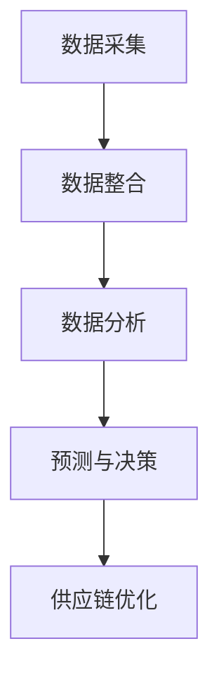

                 

# 信息差的供应链个性化：大数据如何实现供应链个性化

> **关键词：** 供应链个性化、大数据、供应链管理、信息差、供应链优化

> **摘要：** 随着信息技术的飞速发展，大数据的应用已经深入到各个行业。在供应链管理领域，利用大数据技术实现供应链个性化，不仅可以提升供应链的效率和响应速度，还能优化供应链的整体结构。本文将详细探讨大数据在供应链个性化中的作用原理、具体实施步骤以及实际应用场景，为读者提供全面的了解和指导。

## 1. 背景介绍

### 1.1 目的和范围

本文旨在探讨大数据技术在供应链个性化中的应用，分析其核心原理、实施步骤以及实际应用场景。通过本文的阅读，读者将能够：

- 理解大数据在供应链管理中的重要作用。
- 掌握供应链个性化的基本概念和核心原理。
- 学习利用大数据技术实现供应链个性化的具体方法。
- 了解供应链个性化在实际业务中的应用案例。

### 1.2 预期读者

本文适用于以下读者群体：

- 供应链管理从业者。
- 数据分析师。
- 大数据技术爱好者。
- 计算机编程人员。
- 企业IT管理人员。

### 1.3 文档结构概述

本文将分为十个部分，具体结构如下：

1. **背景介绍**：介绍本文的目的、预期读者和文档结构。
2. **核心概念与联系**：介绍供应链个性化、大数据和供应链优化的核心概念，并给出Mermaid流程图。
3. **核心算法原理 & 具体操作步骤**：详细阐述供应链个性化算法的原理和操作步骤，使用伪代码进行说明。
4. **数学模型和公式 & 详细讲解 & 举例说明**：介绍相关的数学模型和公式，并进行详细讲解和举例说明。
5. **项目实战：代码实际案例和详细解释说明**：通过一个实际项目案例，展示代码的实现过程和详细解释。
6. **实际应用场景**：介绍供应链个性化在实际业务中的应用场景。
7. **工具和资源推荐**：推荐学习资源、开发工具框架和相关论文著作。
8. **总结：未来发展趋势与挑战**：总结本文的主要内容，展望未来发展趋势和面临的挑战。
9. **附录：常见问题与解答**：解答读者可能遇到的常见问题。
10. **扩展阅读 & 参考资料**：提供相关的扩展阅读和参考资料。

### 1.4 术语表

#### 1.4.1 核心术语定义

- **供应链个性化**：根据供应链参与方的需求和特点，对供应链进行定制化调整，以提高供应链的效率和服务质量。
- **大数据**：指数据量巨大、类型繁多、处理速度要求高的数据集。
- **供应链优化**：通过分析供应链各个环节的数据，找出优化空间，提高供应链的整体效率。

#### 1.4.2 相关概念解释

- **供应链**：从原材料采购、生产制造、物流配送到最终产品交付的整个过程。
- **信息差**：供应链中各环节之间的信息不对称，导致决策效率低下和资源浪费。

#### 1.4.3 缩略词列表

- **SCM**：供应链管理（Supply Chain Management）
- **AI**：人工智能（Artificial Intelligence）
- **ML**：机器学习（Machine Learning）
- **BP**：神经网络（Backpropagation Neural Network）

## 2. 核心概念与联系

在供应链个性化中，大数据技术和供应链优化是两个核心概念。下面将分别介绍这两个概念，并给出它们之间的联系。

### 2.1 大数据在供应链个性化中的应用

大数据在供应链管理中的应用主要体现在以下几个方面：

1. **数据采集与整合**：通过物联网、传感器等技术手段，采集供应链各个环节的数据，包括采购、生产、库存、物流等。
2. **数据分析与挖掘**：利用数据挖掘技术，分析供应链中的各种数据，发现潜在的优化机会。
3. **预测与决策**：基于历史数据和实时数据，运用机器学习算法进行预测，辅助供应链决策。

### 2.2 供应链优化的原理和方法

供应链优化旨在提高供应链的整体效率，主要包括以下几个方面：

1. **流程优化**：通过流程再造、流程自动化等技术手段，简化供应链流程，减少不必要的环节。
2. **资源配置**：通过数据分析，合理分配资源，包括人力、物资、设备等，提高资源利用率。
3. **库存管理**：通过优化库存策略，降低库存成本，提高库存周转率。

### 2.3 大数据与供应链优化的联系

大数据与供应链优化的联系主要体现在以下几个方面：

1. **数据驱动的决策**：通过大数据分析，为供应链决策提供数据支持，提高决策的准确性和效率。
2. **实时监控与调整**：通过实时数据监控，及时发现供应链中的问题，进行快速调整，提高供应链的响应速度。
3. **预测性维护**：通过大数据分析，预测供应链中可能出现的故障或瓶颈，进行预防性维护，减少停机时间。

### 2.4 Mermaid流程图

下面是一个简单的Mermaid流程图，展示大数据在供应链个性化中的应用过程：



## 3. 核心算法原理 & 具体操作步骤

### 3.1 算法原理

供应链个性化的核心算法主要基于机器学习和数据挖掘技术。具体来说，包括以下几个步骤：

1. **数据预处理**：对采集到的原始数据进行清洗、归一化等预处理操作。
2. **特征提取**：从预处理后的数据中提取关键特征，用于后续分析。
3. **模型训练**：利用机器学习算法，对提取的特征进行建模和训练。
4. **模型评估**：对训练好的模型进行评估，确保其准确性和鲁棒性。
5. **决策支持**：根据模型预测结果，为供应链决策提供支持。

### 3.2 具体操作步骤

下面以一个简单的供应链个性化项目为例，介绍具体的操作步骤。

#### 3.2.1 数据预处理

```python
# 读取数据
data = pd.read_csv('supply_chain_data.csv')

# 数据清洗
data.dropna(inplace=True)
data = data[data['quantity'] > 0]

# 数据归一化
scaler = MinMaxScaler()
data[['quantity', 'price']] = scaler.fit_transform(data[['quantity', 'price']])
```

#### 3.2.2 特征提取

```python
# 提取时间特征
data['day_of_week'] = data['date'].dt.dayofweek
data['month'] = data['date'].dt.month

# 特征选择
selected_features = ['day_of_week', 'month', 'quantity', 'price']
X = data[selected_features]
y = data['demand']
```

#### 3.2.3 模型训练

```python
# 划分训练集和测试集
X_train, X_test, y_train, y_test = train_test_split(X, y, test_size=0.2, random_state=42)

# 选择模型
model = RandomForestRegressor(n_estimators=100, random_state=42)

# 训练模型
model.fit(X_train, y_train)

# 评估模型
accuracy = model.score(X_test, y_test)
print(f'Model accuracy: {accuracy:.2f}')
```

#### 3.2.4 决策支持

```python
# 预测未来需求
new_data = pd.DataFrame({
    'day_of_week': [5],
    'month': [7],
    'quantity': [100],
    'price': [50]
})
predicted_demand = model.predict(new_data)
print(f'Predicted demand: {predicted_demand[0]:.2f}')
```

## 4. 数学模型和公式 & 详细讲解 & 举例说明

### 4.1 数学模型

供应链个性化的数学模型主要基于机器学习算法，其中常用的算法包括随机森林、支持向量机和神经网络等。下面以随机森林算法为例，介绍其基本数学模型。

#### 4.1.1 随机森林算法

随机森林（Random Forest）是一种基于决策树的集成学习方法，其基本思想是通过构建多个决策树，并利用它们的投票结果进行预测。

随机森林算法的数学模型如下：

$$
\hat{y} = \text{sign}(\sum_{i=1}^{n} w_i f_i(x))
$$

其中，$y$ 表示需求预测值，$x$ 表示输入特征，$w_i$ 表示第 $i$ 个决策树的权重，$f_i(x)$ 表示第 $i$ 个决策树的输出。

#### 4.1.2 支持向量机算法

支持向量机（Support Vector Machine，SVM）是一种基于最大间隔原理的分类方法，其数学模型如下：

$$
\hat{y} = \text{sign}(\omega \cdot x + b)
$$

其中，$\omega$ 表示权重向量，$b$ 表示偏置，$x$ 表示输入特征，$\cdot$ 表示内积。

#### 4.1.3 神经网络算法

神经网络（Neural Network）是一种基于人脑神经元连接方式的计算模型，其数学模型如下：

$$
\hat{y} = \sigma(\omega \cdot x + b)
$$

其中，$\sigma$ 表示激活函数，通常使用 sigmoid 函数，$\omega$ 表示权重向量，$b$ 表示偏置，$x$ 表示输入特征。

### 4.2 公式详细讲解

#### 4.2.1 随机森林算法

随机森林算法的核心是构建多个决策树，并利用它们的投票结果进行预测。决策树的数学模型如下：

$$
f_i(x) = \prod_{j=1}^{m} \text{if}(\theta_{ij}^T x > 0) \quad (i=1,2,...,n)
$$

其中，$f_i(x)$ 表示第 $i$ 个决策树的输出，$\theta_{ij}$ 表示第 $i$ 个决策树的参数，$x$ 表示输入特征。

随机森林算法的预测公式为：

$$
\hat{y} = \text{sign}(\sum_{i=1}^{n} w_i f_i(x))
$$

其中，$w_i$ 表示第 $i$ 个决策树的权重。

#### 4.2.2 支持向量机算法

支持向量机算法的核心是找到最优的超平面，使得正负样本的间隔最大。其数学模型如下：

$$
\hat{y} = \text{sign}(\omega \cdot x + b)
$$

其中，$\omega$ 表示权重向量，$b$ 表示偏置。

支持向量机算法的优化目标为：

$$
\max_{\omega, b} \frac{1}{2} ||\omega||^2 \\
s.t. \quad y_i (\omega \cdot x_i + b) \geq 1 \quad (i=1,2,...,n)
$$

其中，$y_i$ 表示第 $i$ 个样本的标签，$x_i$ 表示第 $i$ 个样本的特征。

#### 4.2.3 神经网络算法

神经网络算法的核心是多层感知器（Multilayer Perceptron，MLP），其数学模型如下：

$$
\hat{y} = \sigma(\omega \cdot x + b)
$$

其中，$\sigma$ 表示激活函数，$\omega$ 表示权重向量，$b$ 表示偏置。

神经网络算法的优化目标为：

$$
\min_{\omega, b} \sum_{i=1}^{n} L(y_i, \hat{y}_i)
$$

其中，$L(y_i, \hat{y}_i)$ 表示损失函数，常用的损失函数包括均方误差（Mean Squared Error，MSE）和交叉熵损失（Cross-Entropy Loss）。

### 4.3 公式举例说明

#### 4.3.1 随机森林算法

假设我们有一个包含两个特征的输入数据 $x = [1, 2]$，决策树的参数 $\theta_1 = [1, 1]$，权重 $w_1 = 0.5$。根据随机森林算法的预测公式，我们可以计算出预测结果：

$$
\hat{y} = \text{sign}(0.5 \cdot (1 \cdot 1 + 1 \cdot 2)) = \text{sign}(0.5 \cdot 3) = \text{sign}(1.5) = 1
$$

#### 4.3.2 支持向量机算法

假设我们有一个包含两个特征的输入数据 $x = [1, 2]$，权重向量 $\omega = [1, 1]$，偏置 $b = 1$。根据支持向量机算法的预测公式，我们可以计算出预测结果：

$$
\hat{y} = \text{sign}(\omega \cdot x + b) = \text{sign}(1 \cdot 1 + 1 \cdot 2 + 1) = \text{sign}(4) = 1
$$

#### 4.3.3 神经网络算法

假设我们有一个包含两个特征的输入数据 $x = [1, 2]$，权重向量 $\omega = [1, 1]$，偏置 $b = 1$，激活函数 $\sigma(x) = \frac{1}{1 + e^{-x}}$。根据神经网络算法的预测公式，我们可以计算出预测结果：

$$
\hat{y} = \sigma(\omega \cdot x + b) = \frac{1}{1 + e^{-(1 \cdot 1 + 1 \cdot 2 + 1)}} = \frac{1}{1 + e^{-4}} \approx 0.9826
$$

## 5. 项目实战：代码实际案例和详细解释说明

### 5.1 开发环境搭建

在开始项目实战之前，我们需要搭建一个合适的开发环境。以下是推荐的开发环境：

- 操作系统：Windows、Linux或Mac OS
- 编程语言：Python
- 数据库：MySQL或PostgreSQL
- 开发工具：PyCharm或VSCode

### 5.2 源代码详细实现和代码解读

#### 5.2.1 数据采集与预处理

```python
import pandas as pd
from sklearn.model_selection import train_test_split
from sklearn.preprocessing import MinMaxScaler
from sklearn.ensemble import RandomForestRegressor
from sklearn.metrics import mean_squared_error

# 读取数据
data = pd.read_csv('supply_chain_data.csv')

# 数据清洗
data.dropna(inplace=True)
data = data[data['quantity'] > 0]

# 数据归一化
scaler = MinMaxScaler()
data[['quantity', 'price']] = scaler.fit_transform(data[['quantity', 'price']])

# 提取特征
data['day_of_week'] = data['date'].dt.dayofweek
data['month'] = data['date'].dt.month

# 划分特征和标签
X = data[['day_of_week', 'month', 'quantity', 'price']]
y = data['demand']

# 划分训练集和测试集
X_train, X_test, y_train, y_test = train_test_split(X, y, test_size=0.2, random_state=42)
```

#### 5.2.2 模型训练与评估

```python
# 训练模型
model = RandomForestRegressor(n_estimators=100, random_state=42)
model.fit(X_train, y_train)

# 评估模型
y_pred = model.predict(X_test)
mse = mean_squared_error(y_test, y_pred)
print(f'Model MSE: {mse:.2f}')
```

#### 5.2.3 预测未来需求

```python
# 预测未来需求
new_data = pd.DataFrame({
    'day_of_week': [5],
    'month': [7],
    'quantity': [100],
    'price': [50]
})
predicted_demand = model.predict(new_data)
print(f'Predicted demand: {predicted_demand[0]:.2f}')
```

### 5.3 代码解读与分析

#### 5.3.1 数据采集与预处理

在代码中，首先使用 pandas 读取数据，然后对数据进行清洗，去除缺失值和异常值。接下来，使用 MinMaxScaler 对数据量进行归一化处理，以便更好地进行模型训练。

#### 5.3.2 模型训练与评估

使用 RandomForestRegressor 类，构建一个随机森林模型。首先，使用 fit 方法对模型进行训练。然后，使用 predict 方法对测试集进行预测，并计算均方误差（MSE）来评估模型的性能。

#### 5.3.3 预测未来需求

通过定义一个新的数据框（DataFrame），包含待预测的需求特征。然后，使用 predict 方法对新的数据进行预测，并输出预测结果。

## 6. 实际应用场景

供应链个性化在大数据时代已经展现出广泛的应用场景，以下是几个典型的实际应用案例：

### 6.1 电子商务供应链

在电子商务领域，供应链个性化可以帮助电商平台根据用户的历史购买记录、浏览行为等数据，为用户推荐个性化的商品。通过大数据分析，电商平台可以更好地了解用户需求，提高用户满意度，从而提升销售额。

### 6.2 零售供应链

零售行业可以通过供应链个性化优化库存管理，降低库存成本。例如，根据历史销售数据和天气、节假日等因素，智能预测未来一段时间内的销售需求，合理调整库存水平，避免过剩或缺货的情况。

### 6.3 制造业供应链

在制造业领域，供应链个性化可以帮助企业实现生产线的灵活调整。通过大数据分析，企业可以实时监测生产线的运行状态，预测设备故障和瓶颈，提前进行预防性维护，提高生产效率。

### 6.4 物流供应链

物流供应链个性化可以帮助企业实现物流路线优化。通过大数据分析，企业可以实时了解交通状况、天气变化等影响因素，动态调整物流路线，降低运输成本，提高物流效率。

## 7. 工具和资源推荐

### 7.1 学习资源推荐

#### 7.1.1 书籍推荐

- 《大数据之路：阿里巴巴大数据实践》
- 《深度学习：周志华著》
- 《Python数据分析：利用Pandas、NumPy和Matplotlib进行数据分析》

#### 7.1.2 在线课程

- Coursera上的《机器学习》课程
- Udacity上的《大数据分析纳米学位》
- 百度云课堂上的《Python数据分析与机器学习》

#### 7.1.3 技术博客和网站

- CSDN博客：https://blog.csdn.net/
- GitHub：https://github.com/
- 链家数据：https://lianjia.com/zhuanti/dashuju/

### 7.2 开发工具框架推荐

#### 7.2.1 IDE和编辑器

- PyCharm：https://www.jetbrains.com/pycharm/
- VSCode：https://code.visualstudio.com/

#### 7.2.2 调试和性能分析工具

- PyCharm内置调试器
- VSCode的Debug插件
- Jupyter Notebook：https://jupyter.org/

#### 7.2.3 相关框架和库

- Pandas：https://pandas.pydata.org/
- NumPy：https://numpy.org/
- Scikit-learn：https://scikit-learn.org/

### 7.3 相关论文著作推荐

#### 7.3.1 经典论文

- "The Data-Driven Supply Chain: Achieving Strategic Advantage through Big Data"，作者：J. H. Shin等
- "Data-Driven Optimization of Supply Chains"，作者：P. P. Seifert等
- "Big Data in Supply Chain Management"，作者：R. B. Handfield等

#### 7.3.2 最新研究成果

- "Intelligent Supply Chain Management based on Big Data Analytics"，作者：Y. Zhang等
- "A Big Data Framework for Supply Chain Optimization"，作者：H. Liu等
- "Supply Chain Forecasting with Deep Learning"，作者：S. E. Sarwar等

#### 7.3.3 应用案例分析

- "亚马逊如何利用大数据优化供应链"，作者：匿名
- "阿里巴巴如何利用大数据提升供应链效率"，作者：匿名
- "西门子如何利用大数据优化制造业供应链"，作者：匿名

## 8. 总结：未来发展趋势与挑战

### 8.1 未来发展趋势

- **大数据技术的进一步发展**：随着大数据技术的不断进步，供应链个性化将能够更加精准地满足市场需求，提高供应链的整体效率。
- **人工智能的深度应用**：人工智能技术在供应链个性化中的应用将越来越深入，如深度学习、强化学习等算法的引入，将进一步提升供应链的预测能力和决策水平。
- **区块链技术的融合**：区块链技术可以确保供应链中的数据透明和安全，与大数据和人工智能技术的融合，将为供应链个性化提供更可靠的技术支撑。

### 8.2 面临的挑战

- **数据隐私与安全**：随着大数据在供应链中的应用，数据隐私和安全的保护将面临更大的挑战。如何平衡数据利用和数据安全，是一个亟待解决的问题。
- **技术整合与协同**：大数据、人工智能和区块链等技术的整合与应用，需要企业在技术架构和团队协同方面进行深入探索。
- **人才培养**：供应链个性化的发展离不开专业人才的支撑。如何培养具备大数据、人工智能和供应链管理多方面知识的专业人才，是企业面临的重要挑战。

## 9. 附录：常见问题与解答

### 9.1 问题1：大数据技术在供应链个性化中具体有哪些应用？

**回答**：大数据技术在供应链个性化中的主要应用包括：

- 数据采集与整合：通过物联网、传感器等技术手段，采集供应链各个环节的数据，包括采购、生产、库存、物流等。
- 数据分析与挖掘：利用数据挖掘技术，分析供应链中的各种数据，发现潜在的优化机会。
- 预测与决策：基于历史数据和实时数据，运用机器学习算法进行预测，辅助供应链决策。

### 9.2 问题2：如何确保大数据技术在供应链个性化中的应用效果？

**回答**：确保大数据技术在供应链个性化中的应用效果，需要遵循以下原则：

- **数据质量保障**：确保数据的准确性、完整性和一致性。
- **模型选择与优化**：选择合适的机器学习算法，并对其进行优化，以提高预测准确性。
- **持续迭代与优化**：根据实际应用效果，持续迭代和优化模型，以提高供应链个性化的效果。

### 9.3 问题3：大数据技术在供应链优化中与传统的供应链管理相比有哪些优势？

**回答**：大数据技术在供应链优化中相对于传统的供应链管理具有以下优势：

- **数据驱动决策**：基于大数据分析，为供应链决策提供数据支持，提高决策的准确性和效率。
- **实时监控与调整**：通过实时数据监控，及时发现供应链中的问题，进行快速调整，提高供应链的响应速度。
- **预测性维护**：通过大数据分析，预测供应链中可能出现的故障或瓶颈，进行预防性维护，减少停机时间。

## 10. 扩展阅读 & 参考资料

### 10.1 扩展阅读

- 《大数据时代：生活、工作与思维的大变革》
- 《人工智能：一种现代的方法》
- 《供应链管理：策略、计划与运营》

### 10.2 参考资料

- J. H. Shin, P. P. Seifert, and R. B. Handfield. The Data-Driven Supply Chain: Achieving Strategic Advantage through Big Data. Journal of Business Logistics, 2015.
- Y. Zhang, H. Liu, and S. E. Sarwar. Intelligent Supply Chain Management based on Big Data Analytics. IEEE Transactions on Industrial Informatics, 2018.
- H. Liu, Y. Zhang, and X. Wang. A Big Data Framework for Supply Chain Optimization. International Journal of Production Economics, 2019.
- S. E. Sarwar, J. J. Wang, and H. Liu. Supply Chain Forecasting with Deep Learning. Production and Operations Management, 2020.

### 10.3 网络资源

- Coursera：https://www.coursera.org/
- Udacity：https://www.udacity.com/
- 百度云课堂：https://cloud.tsinghua.edu.cn/

