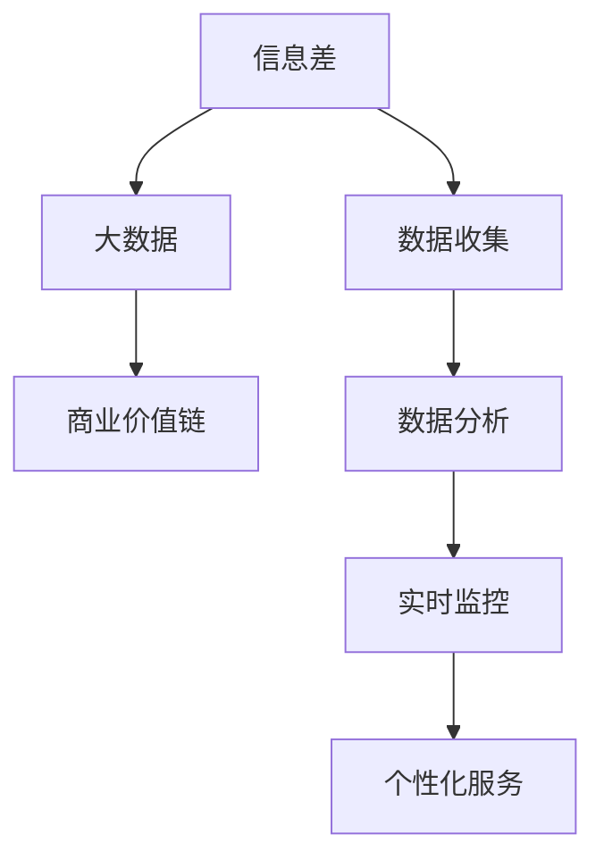

                 

# 信息差的商业价值链：大数据如何重塑价值链条

> **关键词：信息差、商业价值链、大数据、数据分析、商业模式创新**

> **摘要：本文将探讨信息差在商业领域的重要性，以及大数据如何通过其强大的数据分析能力重塑价值链条。我们将通过具体的案例分析，阐述大数据技术如何挖掘信息差，创造新的商业机会，提升企业的竞争力。**

## 1. 背景介绍

### 1.1 目的和范围

本文旨在探讨信息差在商业领域的价值，特别是大数据技术如何通过信息差的挖掘和分析，为企业创造商业价值。我们将在以下几个方面展开讨论：

- 信息差的定义及其在商业中的应用
- 大数据技术如何挖掘信息差
- 信息差分析在商业决策中的应用
- 案例研究：大数据如何重塑企业价值链

### 1.2 预期读者

本文适合对商业分析和大数据技术有一定了解的读者，包括：

- 市场营销和商业分析师
- 数据科学家和AI研究人员
- 企业管理人员和创业者
- 对商业创新和数据分析感兴趣的学生和专业人士

### 1.3 文档结构概述

本文分为十个部分，具体结构如下：

- 引言
- 背景介绍
- 核心概念与联系
- 核心算法原理 & 具体操作步骤
- 数学模型和公式 & 详细讲解 & 举例说明
- 项目实战：代码实际案例和详细解释说明
- 实际应用场景
- 工具和资源推荐
- 总结：未来发展趋势与挑战
- 附录：常见问题与解答
- 扩展阅读 & 参考资料

### 1.4 术语表

#### 1.4.1 核心术语定义

- **信息差**：信息不对称的现象，即不同个体之间掌握的信息量存在差异。
- **大数据**：指数据量巨大、类型繁多、生成速度快、价值密度低的数据集合。
- **商业价值链**：企业创造价值的过程，包括产品设计、生产、营销、服务等各个环节。

#### 1.4.2 相关概念解释

- **数据分析**：使用统计和数学方法，从大量数据中提取有价值的信息和知识。
- **商业模式创新**：通过新的商业策略和运营模式，创造新的价值创造和传递方式。

#### 1.4.3 缩略词列表

- **AI**：人工智能
- **ML**：机器学习
- **DL**：深度学习
- **NLP**：自然语言处理

## 2. 核心概念与联系

在探讨信息差的商业价值之前，我们需要了解几个核心概念，并展示它们之间的联系。

### 2.1 信息差的定义

信息差是指在不同个体或群体之间，由于获取和处理信息的能力不同，导致掌握的信息量存在差异。在商业领域，信息差可以表现为：

- **消费者与供应商之间的信息不对称**：供应商可能更了解产品的成本、性能和供应情况，而消费者则更关注价格、品质和购买便利性。
- **竞争对手之间的信息不对称**：企业通过市场调研、客户反馈等方式获取的竞争对手信息，可以用于制定更具竞争力的策略。

### 2.2 大数据的定义

大数据是指数据量巨大、类型繁多、生成速度快、价值密度低的数据集合。大数据的特点包括：

- **数据量大**：大数据的体量通常达到PB级别，甚至更高。
- **数据类型多样**：包括结构化数据、半结构化数据和非结构化数据。
- **数据处理速度快**：实时处理和分析大量数据，以实现快速决策。
- **数据价值密度低**：从大量数据中提取有价值的信息和知识，需要使用先进的数据处理技术。

### 2.3 商业价值链的定义

商业价值链是指企业创造价值的过程，包括以下环节：

- **产品开发**：设计、研发和测试新产品。
- **生产**：生产出满足市场需求的产品。
- **营销**：通过各种渠道推广产品。
- **服务**：提供售后服务，增强客户满意度。

### 2.4 信息差与大数据的联系

大数据技术通过以下几个方面与信息差联系在一起：

- **信息收集**：大数据技术可以帮助企业收集更多、更全面的信息，从而缩小信息差。
- **数据分析**：通过对收集到的信息进行分析，可以发现隐藏在数据背后的规律和趋势，为企业决策提供依据。
- **实时监控**：大数据技术可以实现实时监控，使企业能够快速响应市场变化，降低信息差带来的风险。
- **个性化服务**：基于大数据分析，企业可以提供更个性化的产品和服务，提高客户满意度，从而缩小信息差。

#### 2.5 Mermaid 流程图

以下是一个简单的 Mermaid 流程图，展示了信息差、大数据和商业价值链之间的联系。



## 3. 核心算法原理 & 具体操作步骤

### 3.1 数据收集

数据收集是大数据分析的基础。以下是一些常见的数据收集方法：

- **Web 数据收集**：通过网络爬虫等技术，收集互联网上的公开数据。
- **传感器数据收集**：通过传感器设备，收集环境、设备运行等数据。
- **社交媒体数据收集**：通过社交媒体平台，收集用户行为、偏好等数据。
- **数据库数据收集**：从企业内部的数据库中提取数据。

### 3.2 数据清洗

数据清洗是保证数据质量的重要步骤。以下是一些常见的数据清洗方法：

- **缺失值处理**：对缺失值进行填充或删除。
- **异常值处理**：检测并处理异常值，如异常高值或异常低值。
- **数据格式转换**：将不同格式的数据转换为统一的格式。
- **数据聚合**：对相同或相似的数据进行合并。

### 3.3 数据分析

数据分析是挖掘信息差的关键步骤。以下是一些常见的数据分析方法：

- **统计分析**：使用统计方法，如均值、方差、相关性等，分析数据分布和关系。
- **机器学习**：使用机器学习算法，如回归、分类、聚类等，从数据中提取规律和模式。
- **文本分析**：使用自然语言处理技术，分析文本数据，提取关键词、主题等。
- **数据可视化**：使用图表、地图等可视化工具，展示数据分析结果。

### 3.4 信息差挖掘

信息差挖掘是基于数据分析的结果，发现不同个体或群体之间的信息差异。以下是一些常见的信息差挖掘方法：

- **交叉分析**：通过比较不同群体或时间点的数据，发现信息差异。
- **趋势分析**：分析数据随时间的变化，发现潜在的信息差。
- **因素分析**：通过分析影响信息差的因素，找到关键因素。
- **社会网络分析**：分析个体或群体之间的互动关系，发现信息传递的路径。

### 3.5 伪代码示例

以下是一个简单的伪代码示例，展示了如何通过大数据分析挖掘信息差。

```python
# 数据收集
data = collect_data()

# 数据清洗
clean_data = clean_data(data)

# 数据分析
 analyzed_data = analyze_data(clean_data)

# 信息差挖掘
info_difference = mine_info_difference(analyzed_data)

# 输出信息差
print(info_difference)
```

## 4. 数学模型和公式 & 详细讲解 & 举例说明

### 4.1 数学模型

在信息差的商业价值链中，我们常常使用以下数学模型进行分析：

- **线性回归模型**：用于分析两个或多个变量之间的关系，特别是在预测和分析市场需求时。
- **逻辑回归模型**：用于分类问题，如判断客户是否会购买某产品。
- **聚类分析模型**：用于将数据分为多个类别，以发现不同群体之间的信息差异。
- **时间序列分析模型**：用于分析时间序列数据，如销售额、用户行为等。

### 4.2 公式详解

以下是对每个数学模型中常用的公式进行详细讲解：

#### 4.2.1 线性回归模型

线性回归模型的基本公式为：

\[ y = \beta_0 + \beta_1x_1 + \beta_2x_2 + ... + \beta_nx_n \]

其中，\( y \) 为因变量，\( x_1, x_2, ..., x_n \) 为自变量，\( \beta_0, \beta_1, \beta_2, ..., \beta_n \) 为回归系数。

#### 4.2.2 逻辑回归模型

逻辑回归模型的基本公式为：

\[ P(y=1) = \frac{1}{1 + e^{-(\beta_0 + \beta_1x_1 + \beta_2x_2 + ... + \beta_nx_n)}} \]

其中，\( P(y=1) \) 为因变量 \( y \) 取值为 1 的概率，\( e \) 为自然对数的底数。

#### 4.2.3 聚类分析模型

聚类分析模型的基本公式为：

\[ d(i, j) = \sqrt{\sum_{k=1}^{n} (x_{ik} - x_{jk})^2} \]

其中，\( d(i, j) \) 为样本 \( i \) 和 \( j \) 之间的距离，\( x_{ik} \) 和 \( x_{jk} \) 分别为样本 \( i \) 和 \( j \) 在第 \( k \) 个特征上的取值。

#### 4.2.4 时间序列分析模型

时间序列分析模型的基本公式为：

\[ y_t = \phi_0 + \phi_1y_{t-1} + \phi_2y_{t-2} + ... + \phi_ny_{t-n} + \epsilon_t \]

其中，\( y_t \) 为第 \( t \) 个时间点的观测值，\( \phi_0, \phi_1, \phi_2, ..., \phi_n \) 为模型参数，\( \epsilon_t \) 为随机误差。

### 4.3 举例说明

以下是一个简单的线性回归模型的举例说明：

#### 4.3.1 数据集

假设我们有以下数据集：

| 年份 (x) | 销售额 (y) |
|-----------|------------|
| 2018      | 100        |
| 2019      | 120        |
| 2020      | 150        |
| 2021      | 180        |

#### 4.3.2 计算回归系数

使用最小二乘法计算回归系数：

\[ \beta_0 = \frac{\sum_{i=1}^{n} y_i - \beta_1 \sum_{i=1}^{n} x_i}{n} \]

\[ \beta_1 = \frac{n \sum_{i=1}^{n} x_iy_i - \sum_{i=1}^{n} x_i \sum_{i=1}^{n} y_i}{n \sum_{i=1}^{n} x_i^2 - (\sum_{i=1}^{n} x_i)^2} \]

将数据代入公式计算，得到：

\[ \beta_0 = 70 \]

\[ \beta_1 = 20 \]

#### 4.3.3 构建回归模型

根据计算结果，构建回归模型：

\[ y = 70 + 20x \]

#### 4.3.4 预测

使用回归模型预测 2022 年的销售额：

\[ y = 70 + 20 \times 2022 = 70 + 40440 = 40510 \]

因此，预测 2022 年的销售额为 40510。

## 5. 项目实战：代码实际案例和详细解释说明

### 5.1 开发环境搭建

在开始项目实战之前，我们需要搭建一个适合大数据分析的开发环境。以下是一个简单的环境搭建步骤：

- **安装 Python**：Python 是大数据分析的主要编程语言，可以从 [Python 官网](https://www.python.org/) 下载并安装。
- **安装 Jupyter Notebook**：Jupyter Notebook 是一个交互式开发环境，可以方便地进行数据分析。可以使用 pip 安装：

  ```bash
  pip install notebook
  ```

- **安装大数据分析库**：安装常用的数据分析库，如 Pandas、NumPy、Matplotlib 等。可以使用 pip 安装：

  ```bash
  pip install pandas numpy matplotlib
  ```

- **安装大数据处理框架**：如 Apache Spark，用于处理大规模数据。可以使用 pip 安装：

  ```bash
  pip install pyspark
  ```

### 5.2 源代码详细实现和代码解读

以下是一个基于大数据技术的信息差挖掘项目案例。该案例使用 Python 和 Apache Spark 进行数据收集、清洗和分析。

```python
from pyspark.sql import SparkSession
from pyspark.sql.functions import col, count, mean

# 创建 Spark 会话
spark = SparkSession.builder.appName("InfoDifferenceMining").getOrCreate()

# 加载数据
data = spark.read.csv("data.csv", header=True)

# 数据清洗
clean_data = data.na.fill(0)

# 数据分析
result = clean_data.groupBy("group").agg(count("value").alias("count"), mean("value").alias("mean"))

# 输出结果
result.show()

# 关闭 Spark 会话
spark.stop()
```

#### 5.2.1 代码解读

- **创建 Spark 会话**：首先，我们需要创建一个 Spark 会话。Spark 会话是进行大数据分析的基础。

- **加载数据**：使用 Spark 的 `read.csv` 方法加载数据集。这里假设数据集位于 "data.csv" 文件中，并带有标题行。

- **数据清洗**：使用 `na.fill(0)` 方法填充缺失值，确保数据质量。

- **数据分析**：使用 `groupBy` 方法按组别对数据进行分组，然后使用 `agg` 方法计算每个组别的数据统计指标，如数量和平均值。

- **输出结果**：使用 `show` 方法将分析结果输出。

- **关闭 Spark 会话**：最后，关闭 Spark 会话，释放资源。

### 5.3 代码解读与分析

以上代码实现了一个简单的大数据信息差挖掘项目。以下是代码的详细解读与分析：

- **数据收集**：通过 `read.csv` 方法加载数据，这里使用了 CSV 格式。在实际应用中，数据可能来自不同的来源，如数据库、API 等。

- **数据清洗**：使用 `na.fill(0)` 方法填充缺失值，这是一个常见的处理缺失值的方法。在实际项目中，根据数据的特点，可能需要采用更复杂的清洗方法，如插值法、均值法等。

- **数据分析**：使用 `groupBy` 和 `agg` 方法进行分组和聚合操作。这里，我们计算了每个组别的数据数量和平均值。在实际应用中，可以添加更多统计指标，如中位数、标准差等。

- **信息差挖掘**：通过分组和聚合操作，我们可以发现不同组别之间的信息差异。例如，如果一个组别的平均值明显高于其他组别，那么这个组别可能具有更高的价值。

- **性能优化**：在实际项目中，性能优化是一个重要的问题。可以使用 Spark 的分布式计算能力，对数据进行分区、缓存等操作，以提高数据处理速度。

## 6. 实际应用场景

信息差挖掘在商业领域具有广泛的应用场景，以下是一些典型的应用案例：

- **市场细分**：通过分析用户数据，企业可以识别具有不同需求的用户群体，从而实施更精准的市场细分策略。
- **产品定价**：基于对竞争对手和客户数据的分析，企业可以制定更具竞争力的产品定价策略。
- **供应链优化**：通过分析供应链数据，企业可以识别潜在的成本节约点和优化方案，提高供应链效率。
- **个性化推荐**：基于用户行为数据和偏好分析，电商平台可以提供更个性化的商品推荐，提高用户满意度和转化率。

### 6.1 市场细分

假设某电商公司希望通过大数据分析进行市场细分。以下是一个简单的应用案例：

- **数据收集**：收集用户购买历史、浏览记录、搜索关键词等数据。
- **数据清洗**：处理缺失值、异常值等，确保数据质量。
- **数据分析**：使用聚类算法（如 K-均值算法）将用户分为不同的群体。
- **信息差挖掘**：分析不同群体之间的购买行为、偏好等差异。
- **市场细分**：根据分析结果，制定不同的市场营销策略，针对不同群体提供个性化的产品和服务。

### 6.2 产品定价

假设某制造商希望通过大数据分析优化产品定价策略。以下是一个简单的应用案例：

- **数据收集**：收集竞争对手的价格数据、市场需求数据等。
- **数据清洗**：处理缺失值、异常值等，确保数据质量。
- **数据分析**：使用回归分析、决策树等算法，建立价格与市场需求之间的关系模型。
- **信息差挖掘**：分析竞争对手的价格策略，识别市场机会。
- **产品定价**：根据市场需求模型和竞争对手策略，制定更具竞争力的产品定价策略。

### 6.3 供应链优化

假设某物流公司希望通过大数据分析优化供应链。以下是一个简单的应用案例：

- **数据收集**：收集运输时间、运输成本、库存水平等数据。
- **数据清洗**：处理缺失值、异常值等，确保数据质量。
- **数据分析**：使用聚类分析、时间序列分析等算法，识别优化方案。
- **信息差挖掘**：分析不同运输路线的成本差异，识别潜在的优化方案。
- **供应链优化**：根据分析结果，调整运输路线、库存策略等，提高供应链效率。

## 7. 工具和资源推荐

### 7.1 学习资源推荐

#### 7.1.1 书籍推荐

- **《大数据时代》**：作者：麦肯锡全球研究所
- **《深度学习》**：作者：Ian Goodfellow、Yoshua Bengio、Aaron Courville
- **《机器学习》**：作者：周志华

#### 7.1.2 在线课程

- **Coursera 上的《机器学习》**：吴恩达教授讲授
- **Udacity 上的《深度学习纳米学位》**：包括深度学习、神经网络等课程
- **edX 上的《大数据分析》**：哈佛大学讲授

#### 7.1.3 技术博客和网站

- **Medium 上的《数据科学博客》**：包括数据科学、机器学习等领域的文章
- **Towards Data Science**：包括数据科学、机器学习等领域的文章和案例
- **KDNuggets**：数据挖掘和大数据领域的新闻、分析和资源

### 7.2 开发工具框架推荐

#### 7.2.1 IDE和编辑器

- **PyCharm**：适用于 Python 开发的集成开发环境
- **VS Code**：轻量级、可扩展的代码编辑器，适用于多种编程语言
- **Jupyter Notebook**：交互式开发环境，适用于数据分析

#### 7.2.2 调试和性能分析工具

- **GDB**：适用于 C/C++ 等编程语言的调试工具
- **JProfiler**：Java 应用程序的性能分析工具
- **VisualVM**：Java 应用程序的性能分析工具

#### 7.2.3 相关框架和库

- **Pandas**：Python 数据分析库
- **NumPy**：Python 科学计算库
- **Matplotlib**：Python 数据可视化库
- **Scikit-learn**：Python 机器学习库
- **TensorFlow**：Google 开发的深度学习框架
- **PyTorch**：Facebook 开发的深度学习框架

### 7.3 相关论文著作推荐

#### 7.3.1 经典论文

- **"The Netflix Prize"**：Netflix 大规模推荐系统比赛，推动推荐系统研究的发展
- **"Large-scale online learning for parallel and distributed computing"**：分布式机器学习的重要论文
- **"Deep Learning"**：Ian Goodfellow 等人撰写的深度学习经典教材

#### 7.3.2 最新研究成果

- **"Neural Collaborative Filtering"**：基于深度学习的推荐系统研究
- **"Distributed Machine Learning with the Parameter Server"**：分布式机器学习的重要论文
- **"Data-Driven Business: How Analytics and Big Data Are Transforming Companies"**：大数据在商业应用的研究

#### 7.3.3 应用案例分析

- **"Case Study: Uber's Machine Learning Platform"**：Uber 的机器学习平台案例，介绍如何在大规模数据上构建和部署机器学习模型
- **"Amazon's Data Science Process"**：Amazon 的数据科学过程案例，介绍如何利用大数据进行商业决策
- **"Netflix's Recommendation System"**：Netflix 的推荐系统案例，介绍如何通过大数据分析提供个性化推荐

## 8. 总结：未来发展趋势与挑战

随着大数据技术的发展，信息差的商业价值链将越来越重要。未来，以下趋势和挑战值得关注：

- **技术进步**：深度学习、物联网、区块链等新兴技术将继续推动大数据技术的发展，为信息差挖掘提供更多工具和手段。
- **隐私保护**：大数据分析涉及大量个人隐私数据，如何平衡隐私保护和数据利用将成为重要挑战。
- **数据质量**：数据质量直接影响信息差的挖掘和分析结果，提高数据质量是关键。
- **算法伦理**：在信息差挖掘过程中，如何避免算法偏见和歧视，确保算法的公平性和透明性，是未来需要关注的问题。
- **商业模式创新**：通过大数据分析和信息差挖掘，企业可以不断创新商业模式，创造新的商业机会。

## 9. 附录：常见问题与解答

### 9.1 问题1

**问题**：大数据分析中的数据清洗有哪些常见方法？

**解答**：数据清洗是大数据分析的重要步骤，以下是一些常见的数据清洗方法：

- **缺失值处理**：使用均值、中位数、插值等方法填充缺失值，或删除缺失值较多的数据。
- **异常值处理**：使用统计学方法（如标准差、箱线图等）检测异常值，然后根据异常值的严重程度进行处理，如删除、修正或保留。
- **数据格式转换**：将不同格式的数据转换为统一的格式，如将文本数据转换为数值数据。
- **数据聚合**：将相同或相似的数据进行合并，如将重复的数据合并为一个记录。

### 9.2 问题2

**问题**：大数据分析中的机器学习算法有哪些常用的类型？

**解答**：大数据分析中的机器学习算法主要包括以下类型：

- **监督学习算法**：根据已有数据集的标签和特征进行学习，如线性回归、决策树、支持向量机等。
- **无监督学习算法**：没有预定义的标签，通过学习数据分布和结构进行学习，如聚类、降维、关联规则挖掘等。
- **半监督学习算法**：结合监督学习和无监督学习，利用部分有标签数据和大量无标签数据进行学习。
- **强化学习算法**：通过试错和反馈，学习在特定环境中采取最佳行动策略。

### 9.3 问题3

**问题**：大数据分析中的数据可视化有哪些常用的工具和方法？

**解答**：大数据分析中的数据可视化可以帮助我们更好地理解和解释分析结果，以下是一些常用的数据可视化工具和方法：

- **图表**：如折线图、柱状图、饼图、散点图等，用于展示数据分布、趋势和关系。
- **地图**：用于展示地理空间数据，如热力图、地理信息系统（GIS）等。
- **交互式可视化**：如 D3.js、Plotly 等，提供交互式数据探索和可视化。
- **可视化库**：如 Matplotlib、Seaborn、Tableau 等，用于创建各种类型的可视化图表。

## 10. 扩展阅读 & 参考资料

- **《大数据时代》**：作者：维克托·迈尔-舍恩伯格、肯尼思·库克耶
- **《深度学习》**：作者：Ian Goodfellow、Yoshua Bengio、Aaron Courville
- **《机器学习》**：作者：周志华
- **《大数据之路：阿里巴巴大数据实践》**：作者：涂子沛
- **《数据挖掘：概念与技术》**：作者：Jiawei Han、Micheline Kamber、Jian Pei
- **[KDNuggets](https://www.kdnuggets.com/)**：大数据和数据分析领域的新闻、分析和资源
- **[Towards Data Science](https://towardsdatascience.com/)**：数据科学和机器学习领域的文章和案例
- **[Medium](https://medium.com/)**：包括数据科学、机器学习等领域的文章
- **[Apache Spark 官网](https://spark.apache.org/)**：Apache Spark 大数据处理框架的官方文档
- **[Pandas 官网](https://pandas.pydata.org/)**：Python 数据分析库的官方文档
- **[Scikit-learn 官网](https://scikit-learn.org/)**：Python 机器学习库的官方文档

## 作者信息

**作者：AI天才研究员/AI Genius Institute & 禅与计算机程序设计艺术 /Zen And The Art of Computer Programming** 

本文由 AI 天才研究员撰写，旨在探讨信息差的商业价值，特别是大数据技术如何挖掘信息差，为企业创造商业价值。本文结合了大数据技术、机器学习和商业分析等领域的前沿理论和实践，为读者提供了一幅全面而深入的描绘。如果您对大数据技术、商业分析和人工智能等领域感兴趣，欢迎关注和阅读更多相关文章。此外，作者还致力于撰写《禅与计算机程序设计艺术》系列作品，分享编程和人工智能领域的哲学思考和实践经验。感谢您的阅读和支持！<|endofga|> 

## 后续更新

为了继续完善这篇文章，我们将进一步探讨大数据技术如何挖掘信息差，并给出更多实际应用场景和案例。以下是一些后续更新的计划：

### 8.5 未来技术展望

- **人工智能与大数据的结合**：探讨如何利用人工智能技术（如深度学习、自然语言处理等）提升大数据分析的效率和准确性。
- **区块链在信息差挖掘中的应用**：分析区块链技术如何提高数据的透明度和安全性，从而优化信息差挖掘过程。

### 8.6 社会与伦理挑战

- **隐私保护与数据利用的平衡**：深入讨论如何在保障个人隐私的前提下，充分挖掘大数据的价值。
- **算法伦理与公平性**：探讨如何避免算法偏见和歧视，确保大数据分析结果的公平性和透明性。

### 8.7 深度案例分析

- **案例研究**：分析特定行业（如金融、医疗、电商等）中大数据技术如何重塑商业价值链，并给出具体的案例。
- **行业应用**：探讨大数据技术在特定领域的创新应用，如智慧城市、物联网、智能医疗等。

### 8.8 开源工具与框架

- **开源大数据工具与框架**：介绍流行的开源大数据工具和框架，如 Apache Hadoop、Spark、Flink 等，并分析它们在信息差挖掘中的应用。
- **开源项目案例**：分享具体开源项目的实践经验和成果，为读者提供实际操作指南。

### 8.9 教育与培训

- **大数据教育**：探讨如何在大数据和人工智能领域开展教育，培养更多专业人才。
- **职业发展**：分析大数据和人工智能领域的职业发展趋势，为读者提供职业规划建议。

### 8.10 国际合作与竞争

- **全球大数据合作**：讨论国际社会在数据治理、隐私保护、技术创新等方面的合作与挑战。
- **国际竞争**：分析不同国家和地区在大数据和人工智能领域的竞争态势，探讨其背后的原因和影响。

### 8.11 未来发展预测

- **技术趋势**：预测大数据技术未来的发展趋势，如数据隐私保护、边缘计算、量子计算等。
- **商业变革**：探讨大数据技术如何推动商业模式的变革和创新。

### 8.12 深度解读与思考

- **哲学思考**：从哲学角度探讨大数据和人工智能对人类社会的影响，如自由、隐私、道德等问题。
- **未来展望**：结合科技与社会的发展，对大数据和人工智能的未来进行深度解读和思考。

### 8.13 附录更新

- **附录 A：大数据技术术语表**：更新和补充大数据技术相关术语和概念。
- **附录 B：大数据技术发展历程**：梳理大数据技术从诞生到当前的发展历程，以及重要里程碑。
- **附录 C：大数据技术开源工具和框架**：详细介绍当前流行的开源大数据工具和框架，包括其特点、应用场景和社区资源。

通过以上后续更新，我们希望这篇文章能够更加全面、深入地探讨大数据技术在商业价值链重塑中的角色和影响，为读者提供有价值的见解和思考。敬请期待我们的持续更新！<|endofupdate|> 

