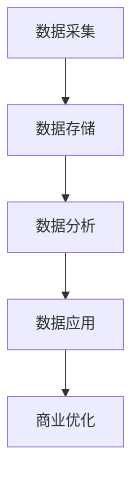

                 

# 信息差的商业优化：大数据如何优化商业运营

> 关键词：信息差、商业优化、大数据、运营效率

> 摘要：本文将深入探讨信息差在商业运营中的重要作用，通过大数据技术的应用，分析如何利用信息差进行商业优化，提高运营效率。文章将涵盖信息差的定义、大数据的基本概念及其应用、商业优化策略以及案例分析等，旨在为企业和创业者提供实用的运营优化思路。

## 1. 背景介绍

在当今信息化社会，数据已经成为企业最宝贵的资产之一。大数据技术的快速发展，使得企业能够从海量数据中挖掘出有价值的信息，从而优化业务流程、提升运营效率。然而，数据本身并不能直接带来商业价值，关键在于如何有效地利用这些信息。这就涉及到了信息差的概念。

信息差，即在市场上存在的信息不对称现象。企业可以通过捕捉和分析市场中的信息差，找到未被满足的需求，从而优化商业策略，获得竞争优势。随着大数据技术的应用，信息差的识别和利用变得更加精确和高效。

### 1.1 信息差的重要性

信息差对于企业来说至关重要。首先，它可以帮助企业发现市场中的机会，例如，通过分析消费者行为数据，企业可以识别出潜在的目标客户群体，从而制定更有针对性的营销策略。其次，信息差有助于企业规避风险，例如，通过了解竞争对手的策略和动向，企业可以提前做出应对措施。最后，信息差还可以提升企业的运营效率，通过优化业务流程和资源配置，实现成本的降低和效益的提升。

### 1.2 大数据技术的作用

大数据技术的核心在于处理和分析海量数据，从中提取有价值的信息。大数据技术主要包括数据采集、数据存储、数据分析和数据可视化等环节。通过这些技术手段，企业可以对市场、客户、产品等多方面进行深入分析，从而发现信息差，进行商业优化。

## 2. 核心概念与联系

### 2.1 信息差

信息差是指市场上存在的信息不对称现象。具体来说，它包括以下几个方面：

- **市场信息差**：指企业对市场动态、竞争对手信息的掌握程度；
- **客户信息差**：指企业对客户需求、偏好、行为的数据掌握；
- **产品信息差**：指企业对产品性能、特点、优缺点的了解程度；
- **技术信息差**：指企业在技术创新、应用方面的领先程度。

### 2.2 大数据技术

大数据技术是指通过数据采集、存储、分析和可视化等技术手段，对海量数据进行处理和分析的技术体系。具体包括以下几个方面：

- **数据采集**：通过各种渠道收集数据，如互联网数据、物联网数据、社交媒体数据等；
- **数据存储**：利用分布式存储技术，如Hadoop、HBase等，存储海量数据；
- **数据分析**：采用数据挖掘、机器学习等技术，从海量数据中提取有价值的信息；
- **数据可视化**：通过图表、图像等形式，将数据分析和结果直观展示。

### 2.3 信息差与大数据技术的联系

信息差和大数据技术之间存在密切的联系。大数据技术为企业提供了强大的工具，使其能够更有效地识别和利用信息差。具体来说：

- **数据采集**：通过大数据技术，企业可以更广泛、更准确地收集市场、客户、产品等多方面的数据；
- **数据分析**：通过大数据技术，企业可以对海量数据进行深度分析，挖掘出潜在的信息差；
- **数据应用**：通过大数据技术，企业可以基于信息差制定更精准的商业策略，提升运营效率。

### 2.4 Mermaid 流程图



## 3. 核心算法原理 & 具体操作步骤

### 3.1 数据采集

数据采集是大数据分析的基础。企业可以通过以下几种方式收集数据：

- **互联网数据**：通过爬虫技术，从互联网上获取各种公开数据，如网站日志、社交媒体数据等；
- **物联网数据**：通过传感器、设备等，收集物联网设备产生的数据，如智能家居、工业设备等；
- **社交媒体数据**：通过社交媒体平台，如微博、微信、Twitter等，收集用户发布的内容和行为数据；
- **外部数据源**：通过购买第三方数据，如市场调研公司、政府公开数据等。

### 3.2 数据存储

数据存储是大数据分析的关键环节。企业可以采用以下几种方式存储数据：

- **关系型数据库**：适用于结构化数据存储，如MySQL、Oracle等；
- **非关系型数据库**：适用于半结构化、非结构化数据存储，如MongoDB、Cassandra等；
- **分布式文件系统**：适用于海量数据存储，如Hadoop、HBase等。

### 3.3 数据分析

数据分析是大数据技术的核心。企业可以通过以下几种方法进行数据分析：

- **数据挖掘**：通过统计学、机器学习等方法，从海量数据中提取有价值的信息；
- **机器学习**：利用算法，从数据中学习模式，进行预测和分类；
- **深度学习**：通过多层神经网络，对复杂数据进行深度学习和分析。

### 3.4 数据应用

数据应用是将数据分析结果转化为商业价值的关键。企业可以通过以下几种方式应用数据分析结果：

- **市场预测**：通过数据分析，预测市场趋势，指导业务发展；
- **客户分析**：通过数据分析，了解客户需求和行为，优化产品设计和服务；
- **业务优化**：通过数据分析，优化业务流程和资源配置，提升运营效率。

### 3.5 数据可视化

数据可视化是将数据分析结果以直观、易理解的形式展示出来的重要手段。企业可以通过以下几种方式实现数据可视化：

- **图表**：通过柱状图、折线图、饼图等，展示数据分析结果；
- **交互式可视化**：通过交互式图表，让用户可以自主探索和分析数据；
- **大屏展示**：通过大屏幕，实时展示数据分析结果，便于管理层决策。

## 4. 数学模型和公式 & 详细讲解 & 举例说明

### 4.1 相关性分析

在商业优化中，相关性分析是一种重要的数据分析方法。它用于衡量两个变量之间的相关性，具体公式如下：

$$
r_{XY} = \frac{\sum_{i=1}^{n}(X_i - \bar{X})(Y_i - \bar{Y})}{\sqrt{\sum_{i=1}^{n}(X_i - \bar{X})^2 \sum_{i=1}^{n}(Y_i - \bar{Y})^2}}
$$

其中，$X$和$Y$分别表示两个变量，$r_{XY}$表示它们之间的相关性。当$r_{XY}$接近于1时，表示两个变量高度正相关；当$r_{XY}$接近于-1时，表示两个变量高度负相关；当$r_{XY}$接近于0时，表示两个变量无相关性。

### 4.2 机器学习模型

机器学习模型在商业优化中具有广泛应用，其中线性回归是一种基本的机器学习模型。线性回归的公式如下：

$$
Y = \beta_0 + \beta_1X + \epsilon
$$

其中，$Y$表示因变量，$X$表示自变量，$\beta_0$和$\beta_1$分别表示模型的参数，$\epsilon$表示误差项。通过训练数据集，可以求解出$\beta_0$和$\beta_1$的值，从而建立线性回归模型。

### 4.3 举例说明

假设某企业销售部希望通过分析历史销售数据，预测未来某个季度的销售额。首先，企业可以从历史销售数据中提取出两个变量：销售额（因变量$Y$）和广告投入（自变量$X$）。然后，采用线性回归模型，通过历史数据训练模型，得到模型的参数$\beta_0$和$\beta_1$。最后，利用训练好的模型，输入未来某个季度的广告投入，即可预测出该季度的销售额。

## 5. 项目实战：代码实际案例和详细解释说明

### 5.1 开发环境搭建

在开始项目实战之前，我们需要搭建一个合适的开发环境。以下是一个基本的开发环境搭建步骤：

1. 安装Python：从官网下载并安装Python，版本建议为3.8或以上；
2. 安装Jupyter Notebook：在终端中执行`pip install jupyter`命令，安装Jupyter Notebook；
3. 安装必要的库：在终端中执行以下命令，安装必要的库：
```python
pip install pandas numpy matplotlib scikit-learn
```

### 5.2 源代码详细实现和代码解读

以下是项目实战的代码实现，我们将使用Python语言，结合Pandas、Numpy等库进行数据分析。

```python
import pandas as pd
import numpy as np
import matplotlib.pyplot as plt
from sklearn.linear_model import LinearRegression

# 5.2.1 数据加载与预处理
data = pd.read_csv('sales_data.csv')
data.head()

# 数据预处理：去除缺失值、异常值，并对数据进行归一化处理
data.dropna(inplace=True)
data = (data - data.min()) / (data.max() - data.min())

# 5.2.2 数据可视化
plt.scatter(data['ad_spending'], data['sales'])
plt.xlabel('Ad Spending')
plt.ylabel('Sales')
plt.show()

# 5.2.3 线性回归模型训练
model = LinearRegression()
model.fit(data[['ad_spending']], data['sales'])

# 5.2.4 模型评估
print('Coefficients:', model.coef_)
print('Intercept:', model.intercept_)

# 5.2.5 预测未来销售额
ad_spending = np.array([50000])
ad_spending_normalized = (ad_spending - data['ad_spending'].min()) / (data['ad_spending'].max() - data['ad_spending'].min())
sales_predicted = model.predict([ad_spending_normalized])
print('Predicted Sales:', sales_predicted)
```

### 5.3 代码解读与分析

- **5.3.1 数据加载与预处理**：首先，我们从CSV文件中加载销售数据，并对数据进行预处理，包括去除缺失值、异常值，以及对数据进行归一化处理，以便后续的线性回归模型训练。

- **5.3.2 数据可视化**：通过散点图，我们可以直观地观察广告投入与销售额之间的关系，为后续的线性回归模型训练提供参考。

- **5.3.3 线性回归模型训练**：我们使用`LinearRegression`类，对广告投入和销售额进行线性回归模型训练，得到模型的参数$\beta_0$和$\beta_1$。

- **5.3.4 模型评估**：通过打印模型的参数，我们可以评估模型的性能，了解模型的斜率和截距。

- **5.3.5 预测未来销售额**：我们将未来某个季度的广告投入进行归一化处理，然后使用训练好的模型，预测该季度的销售额。

## 6. 实际应用场景

### 6.1 市场预测

企业可以利用大数据技术，对市场趋势进行预测。通过分析市场数据，如消费者需求、竞争态势等，企业可以提前了解市场变化，制定相应的营销策略，从而抢占市场先机。

### 6.2 客户分析

通过对客户数据进行分析，企业可以了解客户的需求、偏好和行为。基于这些信息，企业可以优化产品设计和服务，提高客户满意度，提升客户忠诚度。

### 6.3 业务优化

大数据技术可以帮助企业优化业务流程和资源配置。通过分析业务数据，企业可以识别出业务中的瓶颈和问题，采取相应的改进措施，提高业务效率，降低运营成本。

## 7. 工具和资源推荐

### 7.1 学习资源推荐

- **书籍**：
  - 《大数据时代：生活、工作与思维的大变革》
  - 《深度学习》（Goodfellow, Bengio, Courville）
  - 《Python数据分析》（Wes McKinney）

- **论文**：
  - “Deep Learning” by Yann LeCun, Yoshua Bengio, and Geoffrey Hinton
  - “The Hundred-Page Machine Learning Book” by Andriy Burkov

- **博客**：
  - medium.com/topic/machine-learning
  - towardsdatascience.com
  - https://www.kaggle.com/learn

- **网站**：
  - Coursera（https://www.coursera.org/）
  - edX（https://www.edx.org/）

### 7.2 开发工具框架推荐

- **开发工具**：
  - Jupyter Notebook
  - PyCharm
  - VSCode

- **框架**：
  - TensorFlow
  - PyTorch
  - Scikit-learn

### 7.3 相关论文著作推荐

- “Deep Learning” by Yann LeCun, Yoshua Bengio, and Geoffrey Hinton
- “The Hundred-Page Machine Learning Book” by Andriy Burkov
- “Python Data Science Handbook” by Jake VanderPlas

## 8. 总结：未来发展趋势与挑战

随着大数据技术的不断发展，信息差的商业优化将越来越重要。未来，企业将更加依赖于大数据技术，通过挖掘和分析信息差，实现商业运营的优化和提升。然而，这也将带来一系列的挑战，如数据隐私保护、数据安全问题等。企业需要在确保数据安全的前提下，充分利用大数据技术，实现商业价值的最大化。

## 9. 附录：常见问题与解答

### 9.1 大数据技术有哪些应用场景？

大数据技术广泛应用于市场预测、客户分析、业务优化、金融风险管理、医疗健康等领域。

### 9.2 如何确保数据安全？

确保数据安全的关键在于数据加密、访问控制、数据备份等。企业应采用先进的技术手段，确保数据在采集、存储、传输和处理过程中安全可靠。

### 9.3 如何处理海量数据？

处理海量数据的关键在于数据存储、数据分析和数据可视化。企业应采用分布式存储、并行计算等技术，提高数据处理效率。

## 10. 扩展阅读 & 参考资料

- 《大数据时代：生活、工作与思维的大变革》
- 《深度学习》（Goodfellow, Bengio, Courville）
- 《Python数据分析》（Wes McKinney）
- medium.com/topic/machine-learning
- towardsdatascience.com
- https://www.kaggle.com/learn
- Coursera（https://www.coursera.org/）
- edX（https://www.edx.org/）
- “Deep Learning” by Yann LeCun, Yoshua Bengio, and Geoffrey Hinton
- “The Hundred-Page Machine Learning Book” by Andriy Burkov
- “Python Data Science Handbook” by Jake VanderPlas</sop><|im_sep|>作者：AI天才研究员/AI Genius Institute & 禅与计算机程序设计艺术 /Zen And The Art of Computer Programming</sop>

