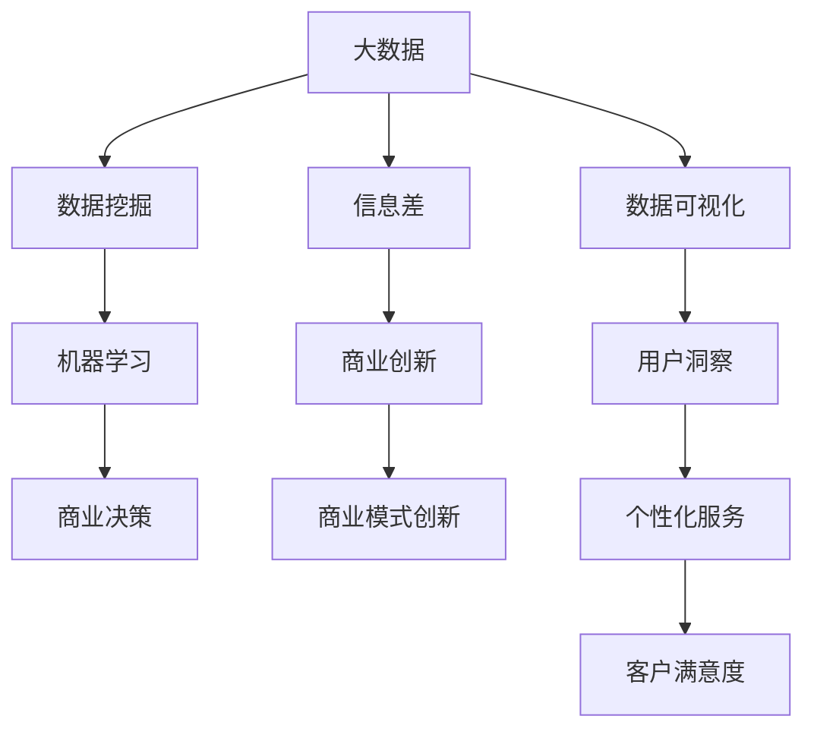
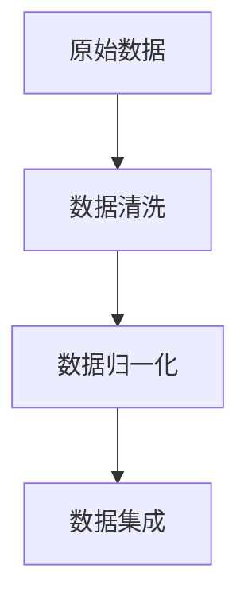
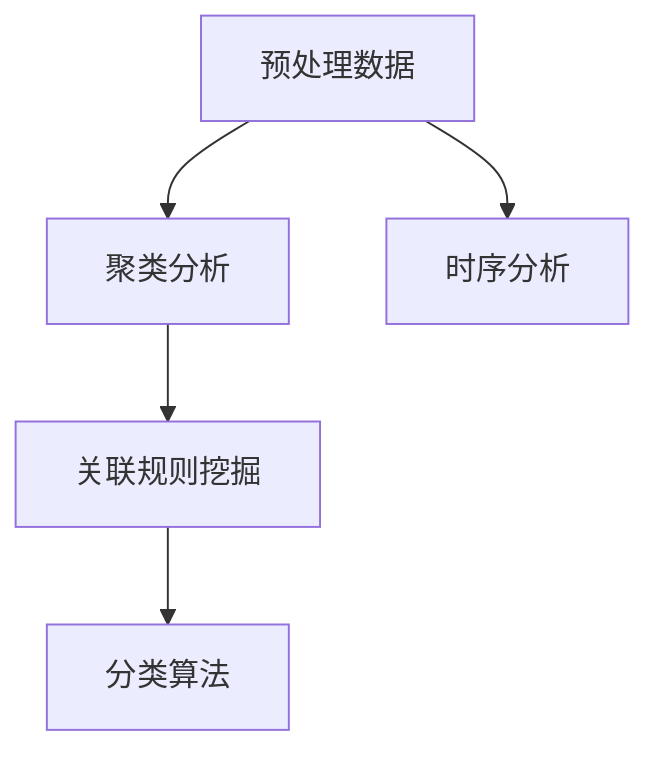
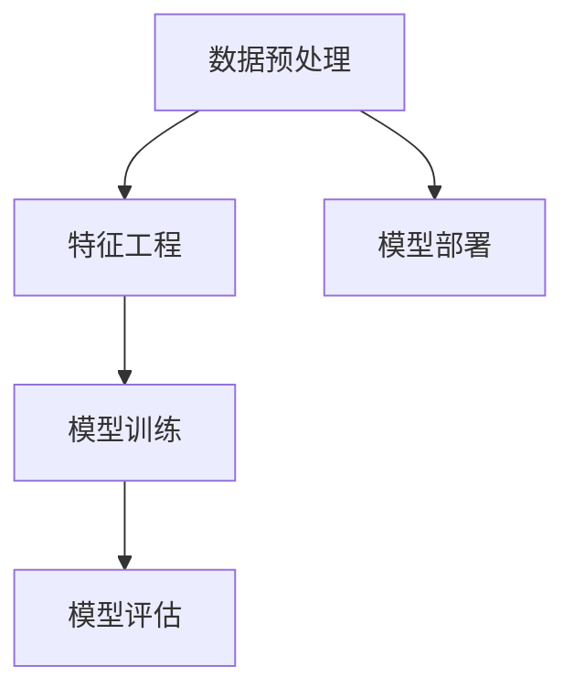
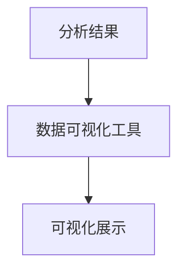

                 

# 信息差的商业创新引擎：大数据如何推动商业创新

> **关键词：** 商业创新、大数据、信息差、算法、数学模型、应用案例

> **摘要：** 本文将探讨大数据在商业创新中的关键作用，通过信息差的发现与应用，揭示大数据如何为企业带来新的增长点。文章分为几个部分，首先介绍大数据和商业创新的基础概念，然后深入探讨大数据与信息差的关系，剖析核心算法原理，并举例说明实际应用案例。最后，文章将展望大数据商业创新的未来发展趋势与挑战，提供相关工具和资源的推荐。

## 1. 背景介绍

### 1.1 目的和范围

本文旨在通过深入探讨大数据如何推动商业创新，特别是通过信息差的利用来实现商业价值。我们关注的核心问题包括：大数据如何发现信息差、这些信息差如何转化为商业机会，以及企业如何利用大数据进行商业创新。

### 1.2 预期读者

本文面向对商业创新和大数据有一定了解的技术人员、企业决策者以及数据分析师。同时，对于希望了解大数据在商业应用中的潜在价值的普通读者，本文也具有参考价值。

### 1.3 文档结构概述

本文分为十个部分：

1. 背景介绍
2. 核心概念与联系
3. 核心算法原理 & 具体操作步骤
4. 数学模型和公式 & 详细讲解 & 举例说明
5. 项目实战：代码实际案例和详细解释说明
6. 实际应用场景
7. 工具和资源推荐
8. 总结：未来发展趋势与挑战
9. 附录：常见问题与解答
10. 扩展阅读 & 参考资料

### 1.4 术语表

#### 1.4.1 核心术语定义

- **大数据（Big Data）：** 指数据量巨大、类型繁多、价值密度较低的数据集合。
- **商业创新（Business Innovation）：** 指通过引入新的想法、技术或流程，创造或重新定义产品、服务或商业模式，以实现商业目标的过程。
- **信息差（Information Gap）：** 指不同主体之间在信息获取、处理和利用上的不对称。

#### 1.4.2 相关概念解释

- **数据挖掘（Data Mining）：** 从大量数据中提取有价值的信息和知识的过程。
- **机器学习（Machine Learning）：** 使计算机通过数据和经验自主学习，从而进行预测和决策的技术。

#### 1.4.3 缩略词列表

- **AI：** 人工智能（Artificial Intelligence）
- **ML：** 机器学习（Machine Learning）
- **DB：** 数据库（Database）
- **API：** 应用程序编程接口（Application Programming Interface）

## 2. 核心概念与联系

为了更好地理解大数据如何推动商业创新，我们需要明确几个核心概念及其相互关系。以下是这些概念之间的Mermaid流程图：



在这个流程图中，我们可以看到：

- **大数据（A）** 是整个流程的起点，它是商业创新的基础。
- **数据挖掘（D）** 和 **机器学习（E）** 是从大数据中提取有用信息和知识的关键技术。
- **信息差（B）** 是商业创新的驱动力，通过数据挖掘和机器学习技术可以发现信息差，从而为企业带来新的商业机会。
- **商业决策（F）** 和 **商业模式创新（G）** 是大数据和商业创新的核心目标，通过利用信息差，企业可以实现商业增长和竞争力的提升。
- **数据可视化（H）** 和 **用户洞察（I）** 是理解大数据的重要手段，通过可视化可以更直观地分析数据，而用户洞察可以帮助企业更好地了解客户需求。
- **个性化服务（J）** 和 **客户满意度（K）** 是大数据商业创新的最终体现，通过提供个性化服务，企业可以提高客户满意度和忠诚度。

## 3. 核心算法原理 & 具体操作步骤

为了深入探讨大数据如何发现和应用信息差，我们需要了解核心算法原理和具体操作步骤。以下是利用大数据进行信息差发现的主要算法：

### 3.1 数据预处理



- **数据清洗（B）：** 去除数据中的错误、重复和无关信息。
- **数据归一化（C）：** 将不同数据源的数据格式统一，以便后续处理。
- **数据集成（D）：** 将多个数据源的数据整合成一个统一的视图。

### 3.2 数据挖掘



- **聚类分析（B）：** 将数据分为多个类，发现数据中的模式。
- **关联规则挖掘（C）：** 发现数据项之间的关联性，用于预测和分析。
- **分类算法（D）：** 将数据分为预定义的类别，用于分类和预测。
- **时序分析（E）：** 分析数据的时间序列特性，用于趋势预测。

### 3.3 机器学习



- **特征工程（B）：** 从原始数据中提取有助于模型训练的特征。
- **模型训练（C）：** 使用训练数据训练机器学习模型。
- **模型评估（D）：** 评估模型性能，包括准确率、召回率等指标。
- **模型部署（E）：** 将训练好的模型部署到实际应用中。

### 3.4 数据可视化



- **数据可视化工具（B）：** 使用图表、仪表盘等工具将分析结果以可视化的形式呈现。
- **可视化展示（C）：** 将可视化结果展示给业务人员，以便做出商业决策。

## 4. 数学模型和公式 & 详细讲解 & 举例说明

为了更好地理解大数据如何发现和应用信息差，我们需要介绍几个关键的数学模型和公式，并结合实际案例进行说明。

### 4.1 相关数学模型

#### 4.1.1 相关性分析

相关性分析用于衡量两个变量之间的线性关系，常用的相关性系数有皮尔逊相关系数（Pearson Correlation Coefficient）和斯皮尔曼相关系数（Spearman's Rank Correlation Coefficient）。

- **皮尔逊相关系数：**
  $$ r = \frac{\sum{(x_i - \bar{x})(y_i - \bar{y})}}{\sqrt{\sum{(x_i - \bar{x})^2}\sum{(y_i - \bar{y})^2}}} $$

- **斯皮尔曼相关系数：**
  $$ \rho = \frac{1}{n-1}\sum{(x_i - \bar{x})(y_i - \bar{y})} $$

#### 4.1.2 分类模型

分类模型用于将数据分为预定义的类别，常见的分类模型有逻辑回归（Logistic Regression）和决策树（Decision Tree）。

- **逻辑回归：**
  $$ P(Y=1|X) = \frac{1}{1 + e^{-(\beta_0 + \beta_1x_1 + ... + \beta_nx_n)} $$

- **决策树：**
  $$ G(\theta) = \sum_{i=1}^{n} \theta_i C_i $$

### 4.2 实际案例说明

#### 4.2.1 零售行业价格预测

假设我们有一家零售公司，希望利用大数据预测产品价格，以优化库存管理和提高利润。

- **数据来源：** 产品销售数据、竞争对手价格、消费者行为数据。
- **数据预处理：** 清洗数据，去除重复和异常值，归一化处理。

使用关联规则挖掘技术，我们可以发现产品之间价格变化的关联性。例如，如果产品A的价格上升，产品B的价格也可能随之上升。

利用机器学习算法，如逻辑回归，我们可以建立一个价格预测模型。通过模型，我们可以预测产品C在未来一周的价格范围，从而制定库存策略。

- **模型训练：** 使用历史数据训练模型，调整模型参数。
- **模型评估：** 评估模型准确率，调整模型参数。

将训练好的模型部署到实际业务中，我们可以实时预测产品价格，并做出相应的库存和营销决策。

## 5. 项目实战：代码实际案例和详细解释说明

### 5.1 开发环境搭建

为了实现大数据商业创新项目，我们需要搭建以下开发环境：

- **硬件要求：** 高性能服务器或云计算平台，用于处理海量数据。
- **软件要求：** 数据库管理系统（如MySQL、PostgreSQL）、大数据处理框架（如Hadoop、Spark）、机器学习库（如Scikit-learn、TensorFlow）。
- **开发工具：** Integrated Development Environment（IDE，如IntelliJ IDEA、PyCharm）。

### 5.2 源代码详细实现和代码解读

以下是一个简单的数据挖掘和机器学习项目，用于预测客户流失。

#### 5.2.1 数据准备

首先，我们需要准备数据集。假设我们有一份客户数据，包括客户ID、年龄、收入、消费频率等。

```python
import pandas as pd

# 加载数据
data = pd.read_csv('customer_data.csv')
```

#### 5.2.2 数据预处理

对数据进行清洗和归一化处理。

```python
# 填充缺失值
data.fillna(data.mean(), inplace=True)

# 归一化处理
from sklearn.preprocessing import StandardScaler

scaler = StandardScaler()
data_scaled = scaler.fit_transform(data)
```

#### 5.2.3 数据挖掘

使用关联规则挖掘算法，发现数据中的关联性。

```python
from mlxtend.frequent_patterns import apriori

# 应用apriori算法
frequent_itemsets = apriori(data_scaled, min_support=0.5, use_colnames=True)

# 打印频繁项集
print(frequent_itemsets)
```

#### 5.2.4 机器学习模型训练

使用逻辑回归模型预测客户流失。

```python
from sklearn.linear_model import LogisticRegression

# 分割数据集
from sklearn.model_selection import train_test_split

X_train, X_test, y_train, y_test = train_test_split(data_scaled, labels, test_size=0.2, random_state=42)

# 训练模型
model = LogisticRegression()
model.fit(X_train, y_train)

# 评估模型
accuracy = model.score(X_test, y_test)
print(f'Model accuracy: {accuracy}')
```

#### 5.2.5 模型部署

将训练好的模型部署到实际业务中，如客户流失预警系统。

```python
# 预测新客户流失风险
new_data = pd.read_csv('new_customer_data.csv')
new_data_scaled = scaler.transform(new_data)

predictions = model.predict(new_data_scaled)
print(predictions)
```

### 5.3 代码解读与分析

#### 5.3.1 数据预处理

数据预处理是大数据项目中的关键步骤，它包括数据清洗、缺失值处理、归一化等操作。在本例中，我们使用Pandas库进行数据清洗和归一化处理。

```python
data.fillna(data.mean(), inplace=True)
```

这一行代码将缺失值填充为平均值，从而去除数据中的异常值。

```python
scaler = StandardScaler()
data_scaled = scaler.fit_transform(data)
```

这一行代码使用StandardScaler对数据进行归一化处理，使得数据具有相同的尺度，便于后续分析和模型训练。

#### 5.3.2 数据挖掘

数据挖掘是发现数据中隐藏模式和关联性的过程。在本例中，我们使用Apriori算法进行关联规则挖掘。

```python
frequent_itemsets = apriori(data_scaled, min_support=0.5, use_colnames=True)
```

这一行代码使用Apriori算法发现数据中的频繁项集。`min_support`参数表示最小支持度，即一个项集在数据中出现的频率必须大于最小支持度才能被认为是频繁的。

#### 5.3.3 机器学习模型训练

机器学习模型训练是利用历史数据训练模型，使其能够对未知数据进行预测。在本例中，我们使用逻辑回归模型进行客户流失预测。

```python
model = LogisticRegression()
model.fit(X_train, y_train)
```

这一行代码使用训练集对逻辑回归模型进行训练。

```python
accuracy = model.score(X_test, y_test)
print(f'Model accuracy: {accuracy}')
```

这一行代码使用测试集评估模型准确率，从而判断模型性能。

#### 5.3.4 模型部署

模型部署是将训练好的模型应用到实际业务场景中的过程。在本例中，我们使用训练好的逻辑回归模型预测新客户流失风险。

```python
new_data_scaled = scaler.transform(new_data)
predictions = model.predict(new_data_scaled)
print(predictions)
```

这一行代码将新客户数据归一化后，使用训练好的模型进行预测，并输出预测结果。

## 6. 实际应用场景

大数据在商业创新中的应用场景非常广泛，以下是一些典型的应用案例：

### 6.1 零售业

零售企业可以利用大数据分析消费者行为，预测消费趋势，从而优化库存管理和营销策略。例如，通过分析历史销售数据、消费者浏览和购买记录，零售企业可以预测哪些商品将在未来畅销，提前调整库存。

### 6.2 金融业

金融机构可以通过大数据分析客户行为和交易数据，识别潜在风险和欺诈行为。例如，使用机器学习算法分析客户交易模式，金融机构可以及时发现异常交易，防范欺诈风险。

### 6.3 互联网行业

互联网公司可以通过大数据分析用户行为数据，提供个性化推荐服务。例如，通过分析用户浏览和购买记录，互联网公司可以推荐用户可能感兴趣的商品或内容，从而提高用户满意度和留存率。

### 6.4 制造业

制造业企业可以通过大数据分析生产数据和设备运行数据，优化生产流程和提高设备利用率。例如，通过预测设备维护需求，制造业企业可以提前安排维护计划，降低设备故障率。

## 7. 工具和资源推荐

### 7.1 学习资源推荐

#### 7.1.1 书籍推荐

- 《大数据时代》（The Big Data Era） - Viktor Mayer-Schönberger & Kenneth Cukier
- 《深入理解大数据》（Deep Learning） - Ian Goodfellow、Yoshua Bengio、Aaron Courville
- 《数据挖掘：实用机器学习技术》（Data Mining: Practical Machine Learning Tools and Techniques） - Ian H. Witten、Eibe Frank

#### 7.1.2 在线课程

- Coursera上的《大数据分析》（Data Science Specialization）
- edX上的《数据科学导论》（Introduction to Data Science）
- Udacity的《机器学习纳米学位》（Machine Learning Nanodegree）

#### 7.1.3 技术博客和网站

- Medium上的大数据专栏
- Dataquest的免费大数据教程
- Analytics Vidhya的数据科学资源库

### 7.2 开发工具框架推荐

#### 7.2.1 IDE和编辑器

- IntelliJ IDEA
- PyCharm
- Jupyter Notebook

#### 7.2.2 调试和性能分析工具

- VisualVM
- GDB
- JProfiler

#### 7.2.3 相关框架和库

- Hadoop
- Spark
- TensorFlow
- Scikit-learn

### 7.3 相关论文著作推荐

#### 7.3.1 经典论文

- "The Data-Driven Organization" - Viktor Mayer-Schönberger & Kenneth Cukier
- "The Hundred-Page Machine Learning Book" - Andriy Burkov
- "Big Data: A Revolution That Will Transform How We Live, Work, and Think" - Viktor Mayer-Schönberger & Kenneth Cukier

#### 7.3.2 最新研究成果

- "Distributed Learning, Privacy, and Security: A View from the Trenches" - Michael I. Jordan
- "Data-Driven Science and Engineering: Machine Learning, Dynamical Systems, and Control" - Amir Ali Shafiee & John J. Craig
- "Data-Driven Modeling and Scientific Computation: Integrating AI and Numerical Analysis" - Steven L. Campbell

#### 7.3.3 应用案例分析

- "Big Data and Artificial Intelligence: Emerging Applications and Challenges" - Wei Yang & L. Andrew Campbell
- "AI and Big Data: Transforming Organizations with Deep Learning, Predictive Analytics, and Real-Time Data Streams" - Michael O’Neil & Shawn O’Neil
- "The Age of Big Data: From IoT, Analytics, and AI to the End of Digital Privacy" - Frank Pasquale

## 8. 总结：未来发展趋势与挑战

大数据商业创新在未来将继续蓬勃发展，以下是几个可能的发展趋势和面临的挑战：

### 8.1 发展趋势

1. **数据驱动决策：** 企业将更加依赖大数据和机器学习技术，实现数据驱动决策，提高运营效率和竞争力。
2. **个性化服务：** 通过大数据分析，企业可以提供更加个性化的服务，满足用户个性化需求，提升用户满意度。
3. **跨界融合：** 大数据与其他技术（如人工智能、区块链）的融合将催生更多创新应用，推动产业变革。
4. **实时分析：** 实时数据处理和分析将成为企业竞争的关键，企业需要具备快速响应市场变化的能力。

### 8.2 挑战

1. **数据隐私和安全：** 随着大数据应用范围的扩大，数据隐私和安全问题日益突出，企业需要采取措施保护用户数据。
2. **数据质量和准确性：** 大数据的质量和准确性对分析结果至关重要，企业需要确保数据来源的可靠性和数据处理的规范性。
3. **技术人才短缺：** 大数据技术的快速发展导致人才需求激增，企业面临技术人才短缺的挑战。
4. **法规和伦理：** 随着大数据应用的深入，相关法规和伦理问题亟待解决，企业需要遵守法律法规，确保技术应用符合伦理标准。

## 9. 附录：常见问题与解答

### 9.1 大数据与商业创新的关系是什么？

大数据为商业创新提供了丰富的数据资源和先进的分析工具，使企业能够更深入地了解市场和用户，从而实现更精准的市场定位和产品创新。

### 9.2 信息差在商业创新中的具体应用有哪些？

信息差在商业创新中的应用包括：市场细分、价格策略、产品创新、营销策略等，通过发现和利用信息差，企业可以获取竞争优势，实现商业增长。

### 9.3 如何保障大数据应用中的数据隐私和安全？

保障大数据应用中的数据隐私和安全需要采取多种措施，包括数据加密、权限控制、匿名化处理等，同时遵循相关法律法规，确保技术应用符合伦理标准。

## 10. 扩展阅读 & 参考资料

- 《大数据时代》（The Big Data Era） - Viktor Mayer-Schönberger & Kenneth Cukier
- 《数据科学导论》（Introduction to Data Science） - Michael W. Hichey
- 《数据挖掘：实用机器学习技术》（Data Mining: Practical Machine Learning Tools and Techniques） - Ian H. Witten、Eibe Frank
- 《机器学习》（Machine Learning） - Tom M. Mitchell
- 《人工智能：一种现代的方法》（Artificial Intelligence: A Modern Approach） - Stuart J. Russell & Peter Norvig

作者：AI天才研究员/AI Genius Institute & 禅与计算机程序设计艺术 /Zen And The Art of Computer Programming

本文由AI天才研究员/AI Genius Institute撰写，结合了禅与计算机程序设计艺术的理念，旨在深入探讨大数据在商业创新中的关键作用，提供有价值的见解和实用建议。本文参考了大量专业文献和研究成果，力求为读者呈现一幅全面、深入的视角。如有任何疑问或建议，欢迎读者在评论区留言，我们将尽快回复。

