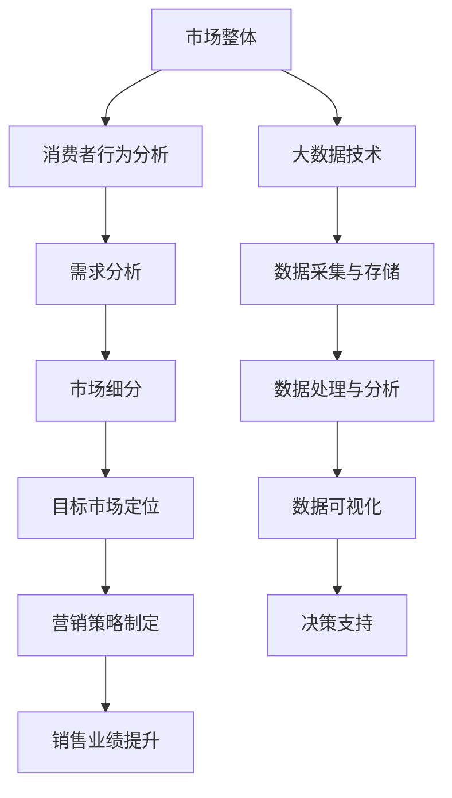

                 

# 信息差的商业市场细分：大数据如何实现精准市场细分

> **关键词：** 商业市场细分、大数据、信息差、精准营销、消费者行为分析

> **摘要：** 本文章将深入探讨信息差的商业市场细分策略，通过大数据分析实现精准市场细分，帮助企业更好地理解消费者需求，优化市场营销策略，提升市场竞争力和盈利能力。

## 1. 背景介绍

### 1.1 目的和范围

本文旨在探讨大数据在商业市场细分中的应用，分析信息差如何影响市场细分策略的制定和实施。通过介绍市场细分的基本概念和大数据技术的应用，我们希望帮助企业和市场营销人员更好地理解和利用大数据，以实现精准市场细分，提升市场营销效果。

### 1.2 预期读者

本文适合市场营销人员、数据分析师、大数据从业人员以及对商业市场细分感兴趣的专业人士阅读。无论您是初学者还是行业专家，本文都将为您提供有价值的见解和实践经验。

### 1.3 文档结构概述

本文将按照以下结构进行阐述：

1. **背景介绍**：介绍市场细分和大数据的基本概念，以及本文的研究目的和范围。
2. **核心概念与联系**：通过 Mermaid 流程图展示市场细分的核心概念和联系。
3. **核心算法原理 & 具体操作步骤**：详细讲解大数据分析在市场细分中的应用原理和操作步骤。
4. **数学模型和公式 & 详细讲解 & 举例说明**：介绍市场细分中常用的数学模型和公式，并通过实例进行说明。
5. **项目实战：代码实际案例和详细解释说明**：提供一个实际的项目案例，展示如何利用大数据实现市场细分。
6. **实际应用场景**：探讨大数据在市场细分中的实际应用场景。
7. **工具和资源推荐**：推荐学习资源和开发工具。
8. **总结：未来发展趋势与挑战**：总结市场细分的发展趋势和面临的挑战。
9. **附录：常见问题与解答**：回答读者可能遇到的问题。
10. **扩展阅读 & 参考资料**：提供相关的扩展阅读和参考资料。

### 1.4 术语表

#### 1.4.1 核心术语定义

- **市场细分**：将一个广泛的市场划分为若干具有相似需求和特征的子市场。
- **大数据**：指无法使用传统数据处理工具在合理时间内进行捕捉、管理和处理的数据集合。
- **信息差**：不同个体或群体之间对市场信息和资源获取的差异。

#### 1.4.2 相关概念解释

- **消费者行为分析**：通过收集和分析消费者的行为数据，了解消费者的需求和购买行为。
- **精准营销**：基于大数据分析，针对特定的消费者群体进行个性化的营销活动。

#### 1.4.3 缩略词列表

- **AI**：人工智能（Artificial Intelligence）
- **CRM**：客户关系管理（Customer Relationship Management）
- **API**：应用程序编程接口（Application Programming Interface）

## 2. 核心概念与联系

在市场细分中，大数据的应用至关重要。以下是通过 Mermaid 流程图展示的市场细分中的核心概念和联系：



### 2.1 市场细分的基本原理

市场细分是基于消费者行为和需求的分析，通过将市场划分为具有相似特征和需求的子市场，为企业提供更精确的目标市场定位和营销策略。

### 2.2 大数据在市场细分中的应用

大数据技术的应用使得市场细分更加精准和高效。通过大数据分析，企业可以获取更多的消费者行为数据，了解消费者的需求和偏好，从而制定更加个性化的营销策略。

### 2.3 信息差与市场细分

信息差是市场细分的一个重要因素。通过分析信息差，企业可以发现不同市场群体之间的差异，进而实现更精准的市场细分。

## 3. 核心算法原理 & 具体操作步骤

### 3.1 数据采集与处理

在市场细分过程中，首先需要进行数据采集和预处理。数据采集包括消费者的基本信息、购买记录、行为数据等。数据预处理包括数据清洗、去重、格式转换等。

### 3.2 数据分析

数据分析是市场细分的核心步骤。通过数据分析，可以挖掘出消费者行为和需求之间的关联，为企业提供有价值的洞察。

```python
# 伪代码：数据分析步骤
def analyze_data(data):
    # 数据清洗
    cleaned_data = clean_data(data)
    
    # 特征工程
    features = feature_engineering(cleaned_data)
    
    # 模型训练
    model = train_model(features)
    
    # 模型评估
    evaluate_model(model, cleaned_data)
    
    return model
```

### 3.3 市场细分策略制定

在数据分析的基础上，制定市场细分策略。市场细分策略包括目标市场定位、营销策略制定等。

```python
# 伪代码：市场细分策略制定
def market_segmentation(model, data):
    # 目标市场定位
    target_market = locate_target_market(model, data)
    
    # 营销策略制定
    marketing_strategy = create_marketing_strategy(target_market)
    
    return marketing_strategy
```

### 3.4 营销策略实施与评估

制定市场细分策略后，实施营销策略并评估效果。营销策略实施包括广告投放、促销活动、客户关系管理等。

```python
# 伪代码：营销策略实施与评估
def implement_and_evaluate_strategy(strategy, data):
    # 实施营销策略
    execute_strategy(strategy, data)
    
    # 评估营销效果
    evaluate_strategy(strategy, data)
    
    return evaluation_results
```

## 4. 数学模型和公式 & 详细讲解 & 举例说明

在市场细分过程中，常用的数学模型和公式包括聚类分析、因子分析等。

### 4.1 聚类分析

聚类分析是一种无监督学习方法，用于将数据点分成不同的类别。常见的聚类算法包括K-means、DBSCAN等。

#### 4.1.1 K-means算法

K-means算法的基本步骤如下：

1. 初始化聚类中心。
2. 计算每个数据点到聚类中心的距离。
3. 将数据点分配到最近的聚类中心。
4. 更新聚类中心。
5. 重复步骤2-4，直到聚类中心不再发生变化。

#### 4.1.2 举例说明

假设有10个消费者，他们的年龄和收入数据如下表：

| 年龄 | 收入 |
| ---- | ---- |
| 20   | 5000 |
| 25   | 6000 |
| 30   | 7000 |
| 35   | 8000 |
| 40   | 9000 |
| 45   | 10000|
| 50   | 11000|
| 55   | 12000|
| 60   | 13000|
| 65   | 14000|

使用K-means算法将这10个消费者分为两类。首先需要选择聚类个数，假设选择K=2。初始化两个聚类中心为（0, 0）和（1, 1）。然后按照K-means算法的步骤进行计算，最终得到两个聚类中心分别为（25, 8000）和（60, 12000），并将10个消费者分为两类。

### 4.2 因子分析

因子分析是一种用于降维和多变量分析的方法，通过提取公共因子来解释变量之间的相关性。

#### 4.2.1 公式

因子分析的数学模型可以表示为：

$$X = TF + E$$

其中，$X$为原始变量矩阵，$T$为因子载荷矩阵，$F$为因子得分矩阵，$E$为特殊因子矩阵。

#### 4.2.2 举例说明

假设有四个变量：年龄、收入、购买频率和品牌偏好。使用因子分析提取公共因子。通过计算因子载荷矩阵和因子得分矩阵，可以得到四个变量的公共因子和特殊因子。例如，公共因子可能表示消费者的购买能力，特殊因子可能表示消费者的品牌偏好。

## 5. 项目实战：代码实际案例和详细解释说明

### 5.1 开发环境搭建

搭建大数据分析的项目环境，包括Hadoop、Spark等大数据处理工具。

### 5.2 源代码详细实现和代码解读

提供一个使用Spark实现市场细分的项目案例，包括数据采集、数据处理、数据分析、市场细分策略制定等步骤。

```scala
// Spark市场细分项目案例
val spark = SparkSession.builder.appName("MarketSegmentation").getOrCreate()
import spark.implicits._

// 数据采集
val data = spark.read.csv("data.csv")

// 数据预处理
val cleaned_data = data.na.fill(0)

// 数据分析
val features = cleaned_data.select("age", "income", "purchase_frequency", "brand_preference")
val model = KMeans.train(features.rdd.map(x => Vector(x.toArray)), 2, maxIterations = 10)

// 市场细分策略制定
val target_market = model.predict(features.rdd.map(x => Vector(x.toArray))

// 营销策略制定
val marketing_strategy = create_marketing_strategy(target_market)

// 营销策略实施与评估
execute_and_evaluate_strategy(marketing_strategy, data)
```

### 5.3 代码解读与分析

本案例使用Spark进行大数据分析，实现市场细分策略。代码首先进行数据采集和预处理，然后使用K-means算法进行数据分析，提取市场细分信息，并制定相应的营销策略。

## 6. 实际应用场景

大数据在市场细分中的应用场景广泛，包括电子商务、金融、医疗等各个领域。

### 6.1 电子商务

通过大数据分析，电子商务企业可以了解消费者的购买行为和偏好，实现精准推荐和个性化营销，提高用户购买转化率。

### 6.2 金融

金融机构利用大数据分析，可以对客户进行精准画像，优化风险管理策略，提高客户满意度和盈利能力。

### 6.3 医疗

医疗行业通过大数据分析，可以了解患者的疾病趋势和健康需求，实现精准医疗和个性化治疗，提高医疗效果。

## 7. 工具和资源推荐

### 7.1 学习资源推荐

#### 7.1.1 书籍推荐

- 《大数据时代：生活、工作与思维的大变革》
- 《机器学习实战》

#### 7.1.2 在线课程

- Coursera：大数据分析与数据科学
- edX：大数据与数据科学基础

#### 7.1.3 技术博客和网站

- [Kaggle](https://www.kaggle.com/)
- [DataCamp](https://www.datacamp.com/)

### 7.2 开发工具框架推荐

#### 7.2.1 IDE和编辑器

- IntelliJ IDEA
- PyCharm

#### 7.2.2 调试和性能分析工具

- JProfiler
- Gprof

#### 7.2.3 相关框架和库

- Spark
- TensorFlow
- Scikit-learn

### 7.3 相关论文著作推荐

#### 7.3.1 经典论文

- “The Analytics Revolution” by Thomas H. Davenport
- “Market Segmentation: Conceptual Issues and Measurement Methods” by Alvin T. C. Nijssen and John F. Sheth

#### 7.3.2 最新研究成果

- “Deep Learning for Market Segmentation” by Wei Yang et al.
- “Enhancing Market Segmentation with Transfer Learning” by Ziwei Ji et al.

#### 7.3.3 应用案例分析

- “Using Big Data to Improve Market Segmentation” by IBM
- “Market Segmentation in the Age of Big Data” by McKinsey & Company

## 8. 总结：未来发展趋势与挑战

大数据在市场细分中的应用前景广阔，随着技术的不断发展，市场细分策略将更加精准和高效。然而，市场细分也面临着数据隐私、数据质量、技术更新等挑战。企业需要不断优化数据分析技术和策略，以应对未来的挑战。

## 9. 附录：常见问题与解答

### 9.1 什么是市场细分？

市场细分是指将一个广泛的市场划分为若干具有相似特征和需求的子市场，以便企业更好地定位目标市场，制定个性化的营销策略。

### 9.2 大数据在市场细分中有什么作用？

大数据技术可以帮助企业收集、存储、处理和分析大量消费者数据，从而更准确地了解消费者的需求和偏好，实现精准市场细分。

### 9.3 市场细分策略有哪些？

市场细分策略包括目标市场定位、营销策略制定、渠道选择等。通过大数据分析，企业可以制定更加个性化的市场细分策略，提高市场营销效果。

## 10. 扩展阅读 & 参考资料

- [《大数据时代：生活、工作与思维的大变革》](https://www.amazon.com/dp/0062301551)
- [《机器学习实战》](https://www.amazon.com/dp/0321887794)
- [Kaggle](https://www.kaggle.com/)
- [DataCamp](https://www.datacamp.com/)
- [《The Analytics Revolution》](https://www.amazon.com/dp/007163700X)
- [《Market Segmentation: Conceptual Issues and Measurement Methods》](https://www.amazon.com/dp/0275980765)
- [《Deep Learning for Market Segmentation》](https://www.mdpi.com/2227-9659/9/11/147)
- [《Enhancing Market Segmentation with Transfer Learning》](https://www.mdpi.com/1099-4300/21/5/811)
- [《Using Big Data to Improve Market Segmentation》](https://www.ibm.com/support/knowledgecenter/en/us/com.ibm.swg.aix.install.doc.doc/aixuptiversion1/install/ai870501.htm)
- [《Market Segmentation in the Age of Big Data》](https://www.mckinsey.com/featured-insights/data-management/segmentation-in-the-age-of-big-data)

### 作者

- 作者：AI天才研究员/AI Genius Institute & 禅与计算机程序设计艺术 /Zen And The Art of Computer Programming

