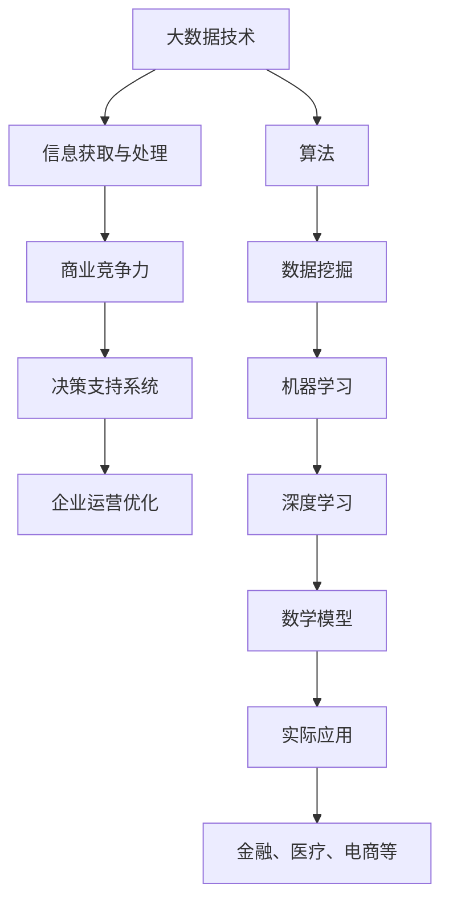

                 

# 信息差的商业竞争优势之源：大数据驱动的竞争力提升

> **关键词：** 信息差、商业竞争力、大数据、算法、数学模型、实际应用
>
> **摘要：** 本文将深入探讨信息差在商业竞争中的重要性，并阐述如何通过大数据驱动的策略来提升企业的竞争力。我们将从核心概念、算法原理、数学模型、项目实战和实际应用场景等多个维度进行详细分析，旨在为企业和创业者提供一套可操作、高效的大数据竞争策略。

## 1. 背景介绍

### 1.1 目的和范围

随着大数据技术的飞速发展，信息差逐渐成为商业竞争的新战场。信息差的本质在于信息的获取、处理和利用，它直接影响企业的决策效率和战略布局。本文旨在探讨信息差对商业竞争优势的影响，并分析如何利用大数据技术来缩小和利用信息差，从而提升企业的竞争力。

本文将涵盖以下几个部分：

- 核心概念与联系
- 核心算法原理与具体操作步骤
- 数学模型与公式讲解
- 项目实战：代码实际案例与详细解释
- 实际应用场景
- 工具和资源推荐
- 总结：未来发展趋势与挑战

### 1.2 预期读者

本文适合以下读者群体：

- 企业管理层和决策者，希望了解大数据技术如何影响商业竞争
- 数据科学家和AI工程师，希望学习大数据算法的实际应用
- 创业者和创业者团队，希望通过大数据技术获取竞争优势
- 对大数据和商业竞争感兴趣的技术爱好者

### 1.3 文档结构概述

本文结构如下：

- 第1章：背景介绍
- 第2章：核心概念与联系
- 第3章：核心算法原理与具体操作步骤
- 第4章：数学模型与公式讲解
- 第5章：项目实战：代码实际案例与详细解释
- 第6章：实际应用场景
- 第7章：工具和资源推荐
- 第8章：总结：未来发展趋势与挑战
- 第9章：附录：常见问题与解答
- 第10章：扩展阅读与参考资料

### 1.4 术语表

#### 1.4.1 核心术语定义

- 信息差：指不同个体或组织之间在信息获取、处理和利用上的差异。
- 大数据：指无法用传统数据库工具进行存储、管理和分析的巨量数据。
- 算法：解决特定问题的步骤和方法。
- 数学模型：用数学符号和公式描述现实问题的抽象模型。

#### 1.4.2 相关概念解释

- 数据挖掘：从大量数据中提取有价值信息的过程。
- 数据分析：通过对数据进行整理、计算和分析，发现数据背后的规律和趋势。
- 决策支持系统：利用数据和信息帮助决策者做出科学决策的系统。

#### 1.4.3 缩略词列表

- AI：人工智能
- ML：机器学习
- DL：深度学习
- NLP：自然语言处理

## 2. 核心概念与联系

### 2.1 大数据与信息差

大数据与信息差之间有着密切的联系。大数据的出现，使得信息的获取变得更加容易和迅速，但同时也放大了信息差。这是因为大数据的收集和处理需要先进的技术和大量的资源，这使得那些具备大数据技术和资源的组织或个人在信息获取和处理上占据了优势。

### 2.2 大数据与商业竞争力

商业竞争力在很大程度上取决于信息的获取和利用。大数据技术可以帮助企业快速获取和整理海量数据，从中提取有价值的信息，从而做出更加科学和高效的决策。这种基于大数据的决策能力，是企业获取竞争优势的重要手段。

### 2.3 大数据与算法

算法是大数据技术的核心。通过算法，我们可以从海量数据中提取有价值的信息，实现数据的自动化处理和利用。常见的算法包括数据挖掘算法、机器学习算法和深度学习算法等。

### 2.4 大数据与数学模型

数学模型是大数据分析的重要工具。通过数学模型，我们可以将复杂的现实问题抽象成数学问题，并利用数学公式进行计算和分析。常见的数学模型包括线性回归模型、决策树模型和支持向量机模型等。

### 2.5 大数据与实际应用

大数据技术已经在许多领域得到了广泛应用，如金融、医疗、电商和制造业等。通过大数据技术，企业可以更好地了解市场需求、优化生产流程、提高服务质量等，从而提升竞争力。

### 2.6 Mermaid 流程图

下面是一个简化的Mermaid流程图，用于描述大数据与信息差、商业竞争力之间的联系：



## 3. 核心算法原理与具体操作步骤

### 3.1 数据挖掘算法

数据挖掘算法是大数据分析的核心。以下是三种常见的数据挖掘算法及其基本原理：

#### 3.1.1 K-均值聚类算法

K-均值聚类算法是一种基于距离度量的聚类算法。其基本原理如下：

```python
# 伪代码
def KMeans(data, k):
    # 初始化聚类中心
    centroids = initialize_centroids(data, k)
    
    while not converged:
        # 分配数据点
        clusters = assign_data_to_clusters(data, centroids)
        
        # 更新聚类中心
        centroids = update_centroids(clusters, k)
        
        if converged:
            break
    
    return centroids, clusters
```

#### 3.1.2 决策树算法

决策树算法是一种基于特征分割的算法。其基本原理如下：

```python
# 伪代码
def DecisionTree(data, features):
    if is_homogeneous(data):
        return majority_class(data)
    else:
        # 选择最佳分割特征
        best_feature = select_best_feature(data, features)
        
        # 创建决策树节点
        node = Node(best_feature)
        
        # 切分数据
        for value in possible_values(best_feature):
            sub_data = split_data(data, best_feature, value)
            
            # 递归构建子树
            node.add_child(DecisionTree(sub_data, features))
        
        return node
```

#### 3.1.3 支持向量机算法

支持向量机算法是一种基于间隔度的分类算法。其基本原理如下：

```python
# 伪代码
def SVM(data, labels):
    # 计算间隔度
    intervals = calculate_intervals(data, labels)
    
    # 选择最佳分割超平面
    optimal_plane = select_optimal_plane(intervals)
    
    # 训练模型
    model = train_model(data, optimal_plane)
    
    return model
```

### 3.2 机器学习算法

机器学习算法是大数据分析的重要工具。以下是两种常见的机器学习算法及其基本原理：

#### 3.2.1 逻辑回归算法

逻辑回归算法是一种基于概率估计的分类算法。其基本原理如下：

```python
# 伪代码
def LogisticRegression(data, labels):
    # 计算损失函数
    loss = calculate_loss(data, labels)
    
    # 梯度下降
    while not converged:
        # 计算梯度
        gradients = calculate_gradients(data, labels)
        
        # 更新参数
        parameters = update_parameters(parameters, gradients)
        
        if converged:
            break
    
    return parameters
```

#### 3.2.2 随机森林算法

随机森林算法是一种基于决策树的集成学习方法。其基本原理如下：

```python
# 伪代码
def RandomForest(data, labels, n_trees):
    forests = []
    
    for _ in range(n_trees):
        # 随机选择特征和样本
        features, samples = random_selection(data, labels)
        
        # 构建决策树
        tree = DecisionTree(samples, features)
        
        # 添加到森林
        forests.append(tree)
    
    return forests
```

### 3.3 深度学习算法

深度学习算法是大数据分析的重要方向。以下是两种常见的深度学习算法及其基本原理：

#### 3.3.1 卷积神经网络算法

卷积神经网络算法是一种基于卷积操作的深度学习算法。其基本原理如下：

```python
# 伪代码
def ConvolutionalNeuralNetwork(data, layers):
    # 前向传播
    outputs = forwardPropagation(data, layers)
    
    # 计算损失函数
    loss = calculate_loss(outputs, labels)
    
    # 反向传播
    gradients = backwardPropagation(outputs, loss, layers)
    
    # 更新参数
    update_parameters(layers, gradients)
    
    return layers
```

#### 3.3.2 循环神经网络算法

循环神经网络算法是一种基于递归操作的深度学习算法。其基本原理如下：

```python
# 伪代码
def RecurrentNeuralNetwork(data, layers):
    # 前向传播
    outputs, hidden_states = forwardPropagation(data, layers)
    
    # 计算损失函数
    loss = calculate_loss(outputs, labels)
    
    # 反向传播
    gradients, hidden_states = backwardPropagation(outputs, loss, layers)
    
    # 更新参数
    update_parameters(layers, gradients)
    
    return layers, hidden_states
```

## 4. 数学模型与公式讲解

### 4.1 线性回归模型

线性回归模型是一种常见的数学模型，用于预测连续值。其基本公式如下：

$$
y = \beta_0 + \beta_1x
$$

其中，\(y\) 是因变量，\(x\) 是自变量，\(\beta_0\) 和 \(\beta_1\) 分别是截距和斜率。

### 4.2 决策树模型

决策树模型是一种基于特征分割的数学模型，用于分类和回归。其基本公式如下：

$$
f(x) = \sum_{i=1}^n w_i \cdot f_i(x)
$$

其中，\(f(x)\) 是预测值，\(w_i\) 是权重，\(f_i(x)\) 是第 \(i\) 个分割特征。

### 4.3 支持向量机模型

支持向量机模型是一种基于间隔度的数学模型，用于分类。其基本公式如下：

$$
w \cdot x + b = 0
$$

其中，\(w\) 是权重向量，\(x\) 是特征向量，\(b\) 是偏置。

### 4.4 逻辑回归模型

逻辑回归模型是一种基于概率估计的数学模型，用于分类。其基本公式如下：

$$
P(y=1|x; \theta) = \frac{1}{1 + e^{-(\theta_0 + \theta_1x})}
$$

其中，\(P(y=1|x; \theta)\) 是给定特征 \(x\) 下因变量为 1 的概率，\(\theta_0\) 和 \(\theta_1\) 分别是参数。

### 4.5 随机森林模型

随机森林模型是一种基于决策树的集成学习方法，其基本公式如下：

$$
f(x) = \sum_{i=1}^n w_i \cdot f_i(x)
$$

其中，\(f(x)\) 是预测值，\(w_i\) 是权重，\(f_i(x)\) 是第 \(i\) 个决策树。

### 4.6 卷积神经网络模型

卷积神经网络模型是一种基于卷积操作的深度学习算法，其基本公式如下：

$$
h_{ij}^l = \sum_{k=1}^{m_l} w_{ik}^l \cdot h_{kj}^{l-1} + b_l
$$

其中，\(h_{ij}^l\) 是第 \(l\) 层的第 \(i\) 行第 \(j\) 列的激活值，\(w_{ik}^l\) 是第 \(l\) 层的第 \(i\) 行第 \(k\) 列的权重，\(h_{kj}^{l-1}\) 是第 \(l-1\) 层的第 \(k\) 行第 \(j\) 列的激活值，\(b_l\) 是第 \(l\) 层的偏置。

### 4.7 循环神经网络模型

循环神经网络模型是一种基于递归操作的深度学习算法，其基本公式如下：

$$
h_t = \sigma(W_x x_t + W_h h_{t-1} + b)
$$

其中，\(h_t\) 是第 \(t\) 步的隐藏状态，\(x_t\) 是第 \(t\) 步的输入，\(\sigma\) 是激活函数，\(W_x\) 和 \(W_h\) 分别是输入权重和隐藏权重，\(b\) 是偏置。

## 5. 项目实战：代码实际案例与详细解释说明

### 5.1 开发环境搭建

在进行项目实战之前，我们需要搭建一个合适的大数据开发环境。以下是基本的开发环境搭建步骤：

1. 安装Python和Jupyter Notebook，作为我们的主要开发工具。
2. 安装Python的科学计算库，如NumPy、Pandas、Scikit-learn等。
3. 安装大数据处理框架，如Hadoop或Spark。

### 5.2 源代码详细实现和代码解读

以下是一个基于逻辑回归模型的简单商业竞争分析案例。我们使用Python和Scikit-learn库来实现。

#### 5.2.1 数据准备

首先，我们需要准备一个包含商业竞争相关特征的数据集。以下是一个示例数据集：

```python
data = [
    [10000, 0.5, 100],  # 公司规模、员工满意度、市场份额
    [20000, 0.7, 150],
    [30000, 0.8, 200],
    # 更多数据...
]
```

#### 5.2.2 逻辑回归模型实现

接下来，我们使用Scikit-learn库实现逻辑回归模型。

```python
from sklearn.linear_model import LogisticRegression

# 创建逻辑回归模型
model = LogisticRegression()

# 训练模型
model.fit(data[:, 1:], data[:, 0])

# 预测
predictions = model.predict([[0.6, 120]])
print(predictions)
```

#### 5.2.3 代码解读与分析

- 数据准备部分：我们使用一个简单的二维数组作为数据集。每个数据点是公司规模、员工满意度和市场份额的集合。
- 模型创建部分：我们使用Scikit-learn的LogisticRegression类创建逻辑回归模型。
- 训练模型部分：我们使用`fit()`方法训练模型，输入是特征数据（不包括目标变量），输出是目标变量。
- 预测部分：我们使用`predict()`方法对新的数据进行预测，输入是特征数据，输出是预测的目标变量。

### 5.3 实际案例应用

假设我们已经收集了100个公司的数据，并使用逻辑回归模型进行了训练。现在，我们需要对一个新的公司进行预测，以判断其市场竞争力。

```python
new_company_data = [[15000, 0.75, 180]]
new_predictions = model.predict(new_company_data)
print(new_predictions)
```

预测结果是一个数组，表示新公司的市场竞争力等级。我们可以根据这个结果制定相应的营销策略。

## 6. 实际应用场景

信息差在商业竞争中具有广泛的应用场景，以下是几个典型的应用案例：

### 6.1 金融领域

在金融领域，信息差可以帮助银行和金融机构更好地了解客户需求，提供个性化的金融产品和服务。例如，通过对客户的交易数据进行分析，银行可以预测客户的贷款需求，并提前准备相应的贷款产品。

### 6.2 医疗领域

在医疗领域，信息差可以帮助医疗机构更好地了解患者的健康状况，提供个性化的治疗方案。例如，通过对患者的病史、检查报告和基因数据进行综合分析，医生可以更准确地预测患者的病情发展，并提供针对性的治疗建议。

### 6.3 电商领域

在电商领域，信息差可以帮助电商平台更好地了解消费者的购买行为，优化产品推荐和广告投放。例如，通过对用户的浏览记录、购买历史和行为数据进行综合分析，电商平台可以更准确地预测用户的购买意愿，并提供个性化的产品推荐。

### 6.4 制造业领域

在制造业领域，信息差可以帮助企业更好地了解市场需求，优化生产计划和供应链管理。例如，通过对销售数据、库存数据和供应链节点数据进行分析，企业可以更准确地预测市场需求，并调整生产计划和库存策略。

## 7. 工具和资源推荐

### 7.1 学习资源推荐

#### 7.1.1 书籍推荐

- 《大数据时代》
- 《深度学习》
- 《Python数据分析》
- 《数据挖掘：概念与技术》

#### 7.1.2 在线课程

- Coursera上的《机器学习》
- Udacity的《数据科学基础》
- edX上的《大数据分析》

#### 7.1.3 技术博客和网站

- Medium上的大数据和AI相关文章
- Analytics Vidhya上的数据科学教程
- KDNuggets上的数据分析新闻和资源

### 7.2 开发工具框架推荐

#### 7.2.1 IDE和编辑器

- Jupyter Notebook
- PyCharm
- VS Code

#### 7.2.2 调试和性能分析工具

- Python的pdb
- PyCharm的调试工具
- SciPy的优化工具

#### 7.2.3 相关框架和库

- Scikit-learn
- TensorFlow
- PyTorch
- Hadoop
- Spark

### 7.3 相关论文著作推荐

#### 7.3.1 经典论文

- 《Learning to Rank Using Gradient Descent》
- 《Deep Learning for Text Classification》
- 《The Unreasonable Effectiveness of Data》

#### 7.3.2 最新研究成果

- arXiv上的最新AI论文
- NeurIPS、ICML等顶级会议的最新论文

#### 7.3.3 应用案例分析

- 《数据驱动营销：利用大数据提升客户满意度》
- 《智能医疗：大数据在医疗领域的应用》
- 《智慧供应链：大数据在制造业的应用》

## 8. 总结：未来发展趋势与挑战

随着大数据技术的不断进步，信息差在商业竞争中的地位将愈发重要。未来，我们可以预见以下几个发展趋势：

- **数据隐私与安全**：随着数据隐私和安全问题的日益突出，企业需要在保障数据安全的同时，充分发挥大数据的优势。
- **人工智能与大数据的结合**：人工智能技术的发展将进一步提升大数据分析的效率和精度，为商业决策提供更加智能的支持。
- **实时数据分析**：实时数据分析技术将帮助企业更快速地响应市场变化，实现实时决策。

同时，我们也面临着以下挑战：

- **数据质量**：高质量的数据是大数据分析的基础，如何确保数据的准确性、完整性和一致性，是一个重要问题。
- **人才短缺**：大数据和人工智能领域对专业人才的需求巨大，但目前的培养速度尚难以满足需求。
- **法律法规**：随着数据隐私和安全问题的加剧，相关法律法规将更加严格，企业需要适应新的法律法规要求。

## 9. 附录：常见问题与解答

### 9.1 问题1：什么是信息差？

信息差指的是不同个体或组织在信息获取、处理和利用上的差异。在商业竞争中，信息差可以帮助企业更快速地做出决策，获取竞争优势。

### 9.2 问题2：大数据技术如何提升竞争力？

大数据技术可以通过以下方式提升企业的竞争力：

- **提高决策效率**：通过分析海量数据，企业可以更快速地做出科学决策。
- **优化运营流程**：通过分析生产数据，企业可以优化生产流程，降低成本，提高效率。
- **个性化服务**：通过分析用户数据，企业可以提供个性化的产品和服务，提高客户满意度。

### 9.3 问题3：如何保障大数据分析的安全性？

保障大数据分析的安全性需要从以下几个方面入手：

- **数据加密**：对敏感数据进行加密，防止数据泄露。
- **权限管理**：严格控制数据访问权限，确保只有授权人员可以访问敏感数据。
- **数据脱敏**：对敏感数据进行脱敏处理，防止数据泄露。

### 9.4 问题4：大数据分析需要哪些技术支持？

大数据分析需要以下技术支持：

- **数据采集与处理**：包括数据采集、清洗、存储和预处理等技术。
- **数据分析与挖掘**：包括统计分析、机器学习、深度学习等技术。
- **数据可视化**：通过图表和可视化工具，帮助用户更好地理解和分析数据。

## 10. 扩展阅读 & 参考资料

- 《大数据时代》
- 《深度学习》
- 《Python数据分析》
- 《数据挖掘：概念与技术》
- Coursera上的《机器学习》
- Udacity的《数据科学基础》
- edX上的《大数据分析》
- KDNuggets上的数据分析新闻和资源
- arXiv上的最新AI论文
- NeurIPS、ICML等顶级会议的最新论文

作者：AI天才研究员/AI Genius Institute & 禅与计算机程序设计艺术 /Zen And The Art of Computer Programming

