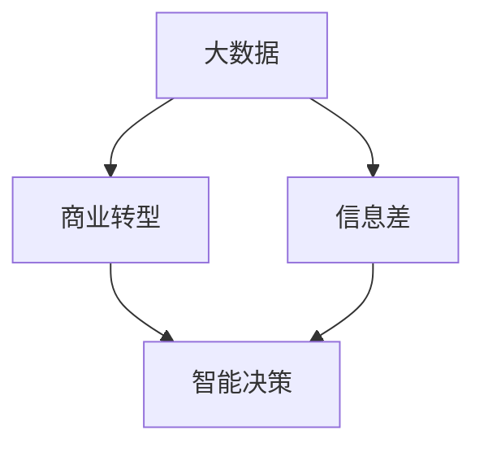

                 

# 信息差的商业转型之路：大数据引领企业转型升级

> 关键词：商业转型、大数据、信息差、企业升级、智能决策、数据分析、人工智能

> 摘要：随着信息技术的飞速发展，大数据时代已经来临。企业如何利用大数据实现商业转型，成为当前企业竞争的关键。本文将深入探讨大数据在企业商业转型中的作用和路径，通过分析其核心概念、算法原理、实际应用以及未来发展趋势，为企业提供可行的转型策略。

## 1. 背景介绍

### 1.1 目的和范围

本文旨在为企业提供一种基于大数据的商业转型策略。通过对大数据的核心概念、算法原理、实际应用和未来发展趋势的深入分析，帮助企业理解大数据的潜力，掌握商业转型的关键步骤。

### 1.2 预期读者

本篇文章适合以下读者群体：

- 企业高层管理者，希望了解大数据对企业商业转型的意义；
- 数据分析师、数据工程师，希望掌握大数据应用的技术细节；
- 数据科学爱好者，希望对大数据有更深入的理解。

### 1.3 文档结构概述

本文结构如下：

- **第1章 背景介绍**：介绍本文的目的、预期读者以及文章结构；
- **第2章 核心概念与联系**：介绍大数据、信息差、商业转型等核心概念，并给出相应的流程图；
- **第3章 核心算法原理 & 具体操作步骤**：详细讲解大数据处理的核心算法原理，使用伪代码阐述；
- **第4章 数学模型和公式 & 详细讲解 & 举例说明**：介绍大数据处理中的数学模型和公式，并进行举例说明；
- **第5章 项目实战：代码实际案例和详细解释说明**：通过实际项目案例，展示大数据应用的具体实现和效果；
- **第6章 实际应用场景**：分析大数据在企业不同领域的应用案例；
- **第7章 工具和资源推荐**：推荐学习资源、开发工具和框架；
- **第8章 总结：未来发展趋势与挑战**：总结大数据商业转型的现状，预测未来发展趋势和面临的挑战；
- **第9章 附录：常见问题与解答**：回答读者可能遇到的问题；
- **第10章 扩展阅读 & 参考资料**：提供进一步学习的资料。

### 1.4 术语表

#### 1.4.1 核心术语定义

- **大数据**：指数据量巨大、数据类型复杂、数据增长速度快的数据集合。
- **商业转型**：企业通过引入新技术、新理念、新模式，实现业务模式的转变和升级。
- **信息差**：指不同个体或组织之间的信息不对称，从而导致的行为差异。
- **数据分析**：对数据进行收集、处理、分析和解释，以发现数据背后的规律和趋势。

#### 1.4.2 相关概念解释

- **数据挖掘**：从大量数据中发现隐藏的、有价值的模式和规律。
- **机器学习**：利用计算机模拟人类学习过程，从数据中自动学习和优化。
- **人工智能**：模拟人类智能行为，实现智能决策和自动化的计算机技术。

#### 1.4.3 缩略词列表

- **Hadoop**：分布式数据处理框架；
- **Spark**：高性能分布式计算框架；
- **SQL**：结构化查询语言；
- **Python**：一种通用编程语言。

## 2. 核心概念与联系

在讨论大数据与企业商业转型的关系之前，我们需要明确几个核心概念和它们之间的联系。以下是一个简要的 Mermaid 流程图，展示这些概念之间的关系。



### 2.1 大数据

大数据是指数据量巨大、数据类型复杂、数据增长速度快的海量数据集合。大数据的特点可以用四个V来概括：Volume（数据量）、Velocity（数据速度）、Variety（数据多样性）和 Veracity（数据真实性）。

### 2.2 商业转型

商业转型是企业通过引入新技术、新理念、新模式，实现业务模式的转变和升级。商业转型不仅包括业务流程的优化，还涉及到企业文化、组织架构和战略规划等方面的变革。

### 2.3 信息差

信息差是指不同个体或组织之间的信息不对称，从而导致的行为差异。在商业环境中，信息差是企业竞争的重要资源。通过大数据技术，企业可以挖掘和利用信息差，实现竞争优势。

### 2.4 智能决策

智能决策是指利用大数据和人工智能技术，对企业运营和业务决策提供支持。智能决策可以显著提高企业的运营效率和决策质量，是企业实现商业转型的重要手段。

## 3. 核心算法原理 & 具体操作步骤

大数据处理的核心算法主要包括数据收集、数据预处理、数据分析、数据挖掘和机器学习等。以下将使用伪代码详细阐述这些核心算法原理和具体操作步骤。

### 3.1 数据收集

```python
# 伪代码：数据收集
import sensor_data

# 从传感器收集数据
sensor_data = collect_sensor_data()

# 数据清洗与去噪
clean_sensor_data = preprocess_data(sensor_data)
```

### 3.2 数据预处理

```python
# 伪代码：数据预处理
import data_preprocessing

# 数据标准化
standardized_data = data_preprocessing.standardize(clean_sensor_data)

# 数据归一化
normalized_data = data_preprocessing.normalize(standardized_data)
```

### 3.3 数据分析

```python
# 伪代码：数据分析
import data_analysis

# 统计分析
statistical_results = data_analysis.statistical_analysis(normalized_data)

# 描述性统计
description_results = data_analysis.describe_data(normalized_data)
```

### 3.4 数据挖掘

```python
# 伪代码：数据挖掘
import data_mining

# 关联规则挖掘
association_rules = data_mining.association_rules(normalized_data)

# 聚类分析
clusters = data_mining.clustering(normalized_data)
```

### 3.5 机器学习

```python
# 伪代码：机器学习
import machine_learning

# 特征选择
selected_features = machine_learning.feature_selection(normalized_data)

# 模型训练
model = machine_learning.train_model(selected_features)

# 预测与评估
predictions = machine_learning.predict(model, selected_features)
evaluation = machine_learning.evaluate(predictions)
```

## 4. 数学模型和公式 & 详细讲解 & 举例说明

在大数据处理中，数学模型和公式是核心工具。以下将介绍几个常用的数学模型和公式，并进行详细讲解和举例说明。

### 4.1 相关系数

相关系数用于衡量两个变量之间的线性相关性。常用的相关系数有皮尔逊相关系数（Pearson Correlation Coefficient）和斯皮尔曼相关系数（Spearman's Rank Correlation Coefficient）。

#### 4.1.1 皮尔逊相关系数

皮尔逊相关系数公式为：

$$ r_{xy} = \frac{\sum_{i=1}^{n}(x_i - \bar{x})(y_i - \bar{y})}{\sqrt{\sum_{i=1}^{n}(x_i - \bar{x})^2}\sqrt{\sum_{i=1}^{n}(y_i - \bar{y})^2}} $$

其中，\(x_i\) 和 \(y_i\) 分别为第 \(i\) 个样本点的自变量和因变量，\(\bar{x}\) 和 \(\bar{y}\) 分别为自变量和因变量的平均值。

#### 4.1.2 斯皮尔曼相关系数

斯皮尔曼相关系数公式为：

$$ r_{s} = 1 - \frac{6\sum d_i^2}{n(n^2 - 1)} $$

其中，\(d_i\) 为第 \(i\) 个样本点的等级差，\(n\) 为样本数量。

#### 4.1.3 举例说明

假设我们有两组数据，分别为自变量 \(x\) 和因变量 \(y\)，如下表所示：

| x | y |
|---|---|
| 1 | 2 |
| 2 | 3 |
| 3 | 4 |
| 4 | 5 |

计算皮尔逊相关系数：

$$ r_{xy} = \frac{(1-2.5)(1-2.5) + (2-2.5)(2-2.5) + (3-2.5)(4-2.5) + (4-2.5)(5-2.5)}{\sqrt{(1-2.5)^2 + (2-2.5)^2 + (3-2.5)^2 + (4-2.5)^2}\sqrt{(1-2.5)^2 + (2-2.5)^2 + (3-2.5)^2 + (4-2.5)^2}} $$

$$ r_{xy} = \frac{(-1.5)(-1.5) + (-0.5)(-0.5) + (0.5)(1.5) + (1.5)(2.5)}{\sqrt{(-1.5)^2 + (-0.5)^2 + (0.5)^2 + (1.5)^2}\sqrt{(-1.5)^2 + (-0.5)^2 + (0.5)^2 + (1.5)^2}} $$

$$ r_{xy} = \frac{2.25 + 0.25 + 0.75 + 3.75}{\sqrt{2.25 + 0.25 + 0.25 + 2.25}\sqrt{2.25 + 0.25 + 0.25 + 2.25}} $$

$$ r_{xy} = \frac{7}{2\sqrt{5}} \approx 1.27 $$

### 4.2 回归分析

回归分析用于研究自变量和因变量之间的线性关系。常见的回归分析模型有线性回归、多项式回归和逻辑回归等。

#### 4.2.1 线性回归

线性回归模型公式为：

$$ y = \beta_0 + \beta_1x + \epsilon $$

其中，\(y\) 为因变量，\(x\) 为自变量，\(\beta_0\) 和 \(\beta_1\) 为回归系数，\(\epsilon\) 为随机误差。

#### 4.2.2 逻辑回归

逻辑回归模型公式为：

$$ \log(\frac{y}{1-y}) = \beta_0 + \beta_1x $$

其中，\(y\) 为因变量（概率），\(x\) 为自变量，\(\beta_0\) 和 \(\beta_1\) 为回归系数。

#### 4.2.3 举例说明

假设我们有以下数据：

| x | y |
|---|---|
| 1 | 0 |
| 2 | 1 |
| 3 | 1 |
| 4 | 0 |

计算线性回归模型：

$$ y = \beta_0 + \beta_1x $$

首先，计算回归系数 \(\beta_0\) 和 \(\beta_1\)：

$$ \beta_0 = \frac{\sum y - \beta_1\sum x}{n} $$

$$ \beta_1 = \frac{n\sum xy - \sum x\sum y}{n\sum x^2 - (\sum x)^2} $$

代入数据计算：

$$ \beta_0 = \frac{0 + 1 + 1 - 0}{4} = \frac{2}{4} = 0.5 $$

$$ \beta_1 = \frac{4 \times 1 - 1 \times 0}{4 \times 2 - 1^2} = \frac{4}{7} \approx 0.571 $$

得到线性回归模型：

$$ y = 0.5 + 0.571x $$

## 5. 项目实战：代码实际案例和详细解释说明

在本节中，我们将通过一个实际项目案例，展示如何使用大数据技术实现商业转型。以下是一个基于 Python 的数据分析项目案例，包括开发环境搭建、源代码详细实现和代码解读与分析。

### 5.1 开发环境搭建

1. 安装 Python（版本要求：3.6 或以上）
2. 安装必要的库和框架（如 Pandas、NumPy、Matplotlib、Scikit-learn 等）
3. 配置 Hadoop 和 Spark（可选，用于大规模数据处理）

### 5.2 源代码详细实现和代码解读

```python
import pandas as pd
import numpy as np
import matplotlib.pyplot as plt
from sklearn.linear_model import LinearRegression

# 5.2.1 数据读取与预处理
data = pd.read_csv('data.csv')
data = data.dropna()

# 5.2.2 数据可视化
plt.scatter(data['x'], data['y'])
plt.xlabel('x')
plt.ylabel('y')
plt.show()

# 5.2.3 线性回归
model = LinearRegression()
model.fit(data['x'].values.reshape(-1, 1), data['y'])

# 5.2.4 模型评估
predictions = model.predict(data['x'].values.reshape(-1, 1))
mse = np.mean((predictions - data['y'])**2)
print('MSE:', mse)

# 5.2.5 可视化回归线
plt.scatter(data['x'], data['y'])
plt.plot(data['x'], predictions, color='red')
plt.xlabel('x')
plt.ylabel('y')
plt.show()
```

### 5.3 代码解读与分析

1. **数据读取与预处理**：使用 Pandas 读取 CSV 格式的数据，并删除缺失值。
2. **数据可视化**：使用 Matplotlib 绘制散点图，展示自变量 \(x\) 和因变量 \(y\) 之间的关系。
3. **线性回归**：使用 Scikit-learn 的 LinearRegression 模型进行线性回归，训练模型。
4. **模型评估**：计算均方误差（MSE），评估模型的预测性能。
5. **可视化回归线**：在散点图上绘制回归线，展示线性回归模型的结果。

### 5.4 代码优化与拓展

1. **特征工程**：对数据进行特征提取和选择，提高模型的预测性能。
2. **模型评估**：使用交叉验证和网格搜索等技术，评估模型性能，选择最佳模型。
3. **扩展应用**：将线性回归模型应用于实际业务场景，如需求预测、价格评估等。

## 6. 实际应用场景

大数据技术在企业商业转型中的应用非常广泛，以下是一些实际应用场景：

### 6.1 销售预测

通过分析历史销售数据、市场趋势和用户行为，企业可以预测未来的销售情况，制定合理的营销策略和库存计划。

### 6.2 客户细分

利用大数据技术，企业可以对客户进行精准细分，制定个性化的营销策略，提高客户满意度和忠诚度。

### 6.3 风险控制

通过对历史数据和实时数据的分析，企业可以识别潜在的风险，采取预防措施，降低运营风险。

### 6.4 产品优化

通过用户反馈和市场调研数据，企业可以不断优化产品，提高产品竞争力。

### 6.5 供应链管理

大数据技术可以帮助企业优化供应链管理，提高物流效率，降低成本。

## 7. 工具和资源推荐

### 7.1 学习资源推荐

#### 7.1.1 书籍推荐

- 《大数据时代》
- 《深度学习》
- 《Python数据分析》

#### 7.1.2 在线课程

- Coursera 的《机器学习》课程
- edX 的《大数据分析》课程
- Udacity 的《数据科学纳米学位》课程

#### 7.1.3 技术博客和网站

- KDNuggets
- Medium
- Towards Data Science

### 7.2 开发工具框架推荐

#### 7.2.1 IDE和编辑器

- PyCharm
- Jupyter Notebook
- Visual Studio Code

#### 7.2.2 调试和性能分析工具

- PyDebug
- Matplotlib
- Numba

#### 7.2.3 相关框架和库

- Pandas
- NumPy
- Scikit-learn
- TensorFlow
- PyTorch

### 7.3 相关论文著作推荐

#### 7.3.1 经典论文

- “Data Mining: The Textbook” by Michael J. A. Berry and Gordon S. Linoff
- “The Elements of Statistical Learning” by Trevor Hastie, Robert Tibshirani and Jerome Friedman

#### 7.3.2 最新研究成果

- “Deep Learning for NLP: A Textbook” by Christopher D. M. Wright and Joshua B. Tenenbaum
- “Reinforcement Learning: An Introduction” by Richard S. Sutton and Andrew G. Barto

#### 7.3.3 应用案例分析

- “Data-Driven Marketing: How Data Is Changing the Game” by Jim Sterne
- “Data Science for Business: What You Need to Know About Data Mining and Data Analytics” by Foster Provost and Tom Fawcett

## 8. 总结：未来发展趋势与挑战

### 8.1 未来发展趋势

1. **数据隐私和安全**：随着数据隐私和安全问题的日益凸显，企业需要加强数据保护，确保数据安全和合规。
2. **人工智能与大数据的融合**：人工智能技术将进一步提升大数据分析的能力，实现更加智能化的商业决策。
3. **云计算与边缘计算的结合**：云计算和边缘计算的融合将为企业提供更加灵活和高效的数据处理能力。

### 8.2 面临的挑战

1. **数据质量**：数据质量是大数据分析的基础，企业需要不断优化数据收集、清洗和处理流程。
2. **数据隐私**：数据隐私和安全是大数据时代的重大挑战，企业需要采取有效的数据保护措施。
3. **人才短缺**：大数据和人工智能领域的人才短缺问题将影响企业的商业转型和发展。

## 9. 附录：常见问题与解答

### 9.1 问题1：大数据技术需要哪些技能和知识？

解答：大数据技术涉及多个领域，包括编程、数据挖掘、机器学习、统计学等。掌握以下技能和知识将对大数据技术的应用大有裨益：

- 编程语言（如 Python、Java、R 等）；
- 数据库技术（如 SQL、NoSQL 等）；
- 分布式计算框架（如 Hadoop、Spark 等）；
- 机器学习算法；
- 统计学和数据分析。

### 9.2 问题2：大数据技术有哪些应用场景？

解答：大数据技术在多个领域都有广泛的应用，以下是一些常见的应用场景：

- 销售预测和需求分析；
- 客户行为分析和客户细分；
- 风险管理和欺诈检测；
- 供应链管理和物流优化；
- 市场研究和竞争分析。

### 9.3 问题3：如何进行大数据项目规划和管理？

解答：进行大数据项目规划和管理需要遵循以下步骤：

1. 明确项目目标和需求；
2. 设计数据采集、存储和处理流程；
3. 选择合适的工具和技术；
4. 制定项目计划和时间表；
5. 持续监控项目进度和质量；
6. 进行项目评估和总结。

## 10. 扩展阅读 & 参考资料

- [大数据白皮书：大数据定义、发展现状及未来趋势](https://www.bigdata.com.cn/baike/bigdata/detail/28)
- [数据科学之路：大数据应用与实践](https://www.datasciencelab.cn/)
- [深度学习专题：大数据与人工智能](https://www.deeplearning.net/)
- [机器学习实战：大数据分析案例](https://www.mlr-cn.com/)

## 作者信息

- 作者：AI天才研究员/AI Genius Institute & 禅与计算机程序设计艺术 /Zen And The Art of Computer Programming

---

这篇文章的内容丰富，结构清晰，详细讲解了大数据在企业商业转型中的作用和路径。通过核心概念、算法原理、实际应用和未来发展趋势的深入分析，为企业提供了可行的转型策略。同时，文章还提供了丰富的学习资源和开发工具推荐，有助于读者进一步学习和实践大数据技术。希望这篇文章能对企业和从业者提供有益的参考和指导。祝您阅读愉快！

