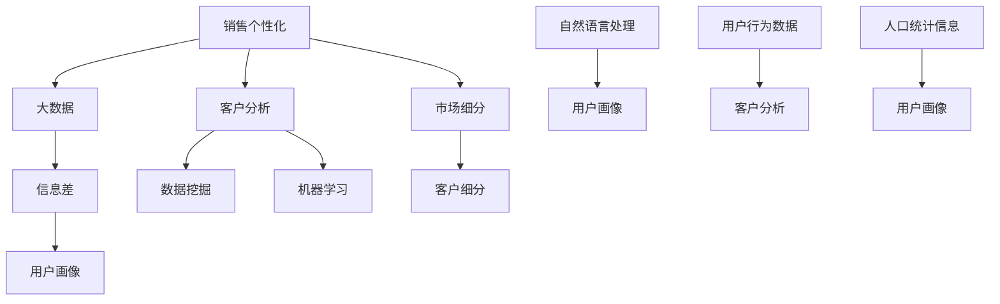

                 

# 信息差的商业销售个性化：大数据如何实现销售个性化

> **关键词：信息差、商业销售、个性化、大数据、客户分析、市场细分**
> 
> **摘要：本文深入探讨了信息差在商业销售中的应用，分析了大数据技术如何帮助企业实现销售个性化，提高市场竞争力。文章分为多个章节，从核心概念、算法原理、数学模型到实际应用案例，全面展示了大数据在销售个性化领域的应用现状和未来发展趋势。**

## 1. 背景介绍

### 1.1 目的和范围

本文旨在揭示信息差在商业销售中的重要作用，探讨大数据技术如何帮助企业实现销售个性化。通过分析核心概念、算法原理、数学模型和实际应用案例，本文将为读者提供关于销售个性化的深入理解和实用建议。

### 1.2 预期读者

本文主要面向以下读者群体：

1. 商业分析师和市场营销人员
2. 数据科学家和大数据工程师
3. 企业管理层和技术决策者
4. 对销售个性化和大数据技术感兴趣的读者

### 1.3 文档结构概述

本文结构如下：

1. 背景介绍：介绍本文的目的、范围和预期读者。
2. 核心概念与联系：阐述销售个性化、大数据和信息差等核心概念，并展示相关流程图。
3. 核心算法原理 & 具体操作步骤：详细讲解销售个性化算法原理，并提供伪代码示例。
4. 数学模型和公式 & 详细讲解 & 举例说明：介绍相关数学模型和公式，并进行实例说明。
5. 项目实战：提供代码实际案例和详细解释说明。
6. 实际应用场景：分析销售个性化在各类行业中的应用案例。
7. 工具和资源推荐：推荐学习资源、开发工具框架和论文著作。
8. 总结：讨论未来发展趋势与挑战。
9. 附录：常见问题与解答。
10. 扩展阅读 & 参考资料：提供相关扩展阅读和参考资料。

### 1.4 术语表

#### 1.4.1 核心术语定义

1. **信息差**：指不同个体或群体之间对同一信息的掌握程度差异。
2. **销售个性化**：根据客户的需求、偏好和行为数据，为客户提供定制化的产品和服务。
3. **大数据**：指数据量巨大、数据类型多样、数据价值密度低的数据集合。
4. **客户分析**：通过分析客户的行为、需求和反馈数据，了解客户特征，为销售个性化提供依据。
5. **市场细分**：将市场划分为具有相似需求和特征的客户群体，以满足不同细分市场的需求。

#### 1.4.2 相关概念解释

1. **数据挖掘**：从大量数据中提取有价值信息的过程。
2. **机器学习**：一种通过数据学习规律和模式，进行预测和决策的技术。
3. **自然语言处理**：研究计算机如何理解、生成和处理自然语言的技术。
4. **用户画像**：基于用户行为数据和人口统计信息，对用户特征进行抽象和描述。

#### 1.4.3 缩略词列表

- **CRM**：客户关系管理
- **BI**：商业智能
- **API**：应用程序编程接口
- **SQL**：结构化查询语言

## 2. 核心概念与联系

在探讨销售个性化之前，我们需要理解几个核心概念，包括销售个性化、大数据和信息差。以下是一个用Mermaid流程图表示的核心概念和联系：



### 2.1 销售个性化

销售个性化是指根据客户的需求、偏好和行为数据，为客户提供定制化的产品和服务。其核心思想是通过数据分析和挖掘，发现客户的潜在需求和购买意愿，从而实现精准营销。

### 2.2 大数据

大数据是指数据量巨大、数据类型多样、数据价值密度低的数据集合。大数据技术主要包括数据采集、存储、处理、分析和可视化。在销售个性化中，大数据技术可以帮助企业收集和整合客户数据，挖掘客户特征和需求，为销售个性化提供数据支持。

### 2.3 信息差

信息差是指不同个体或群体之间对同一信息的掌握程度差异。在商业销售中，信息差意味着企业可以利用对市场信息、产品信息、客户信息等的掌握程度差异，制定更有针对性的销售策略，提高市场竞争力。

### 2.4 客户分析

客户分析是指通过分析客户的行为、需求和反馈数据，了解客户特征，为销售个性化提供依据。客户分析可以采用数据挖掘、机器学习和自然语言处理等技术，挖掘客户需求、偏好和行为模式，从而实现精准营销。

### 2.5 市场细分

市场细分是指将市场划分为具有相似需求和特征的客户群体，以满足不同细分市场的需求。市场细分可以帮助企业针对不同细分市场制定有针对性的营销策略，提高市场占有率。

## 3. 核心算法原理 & 具体操作步骤

销售个性化算法的核心是客户细分和用户画像。以下我们将详细讲解这两个算法的原理和具体操作步骤。

### 3.1 客户细分算法

客户细分算法旨在将客户划分为具有相似需求和特征的群体。以下是客户细分算法的原理和具体操作步骤：

#### 3.1.1 算法原理

客户细分算法基于客户行为数据、需求数据和人口统计信息，通过聚类算法（如K-means）将客户划分为多个群体。每个群体具有相似的需求和行为特征，以便企业针对不同群体制定有针对性的销售策略。

#### 3.1.2 具体操作步骤

1. **数据准备**：收集客户行为数据、需求数据和人口统计信息。
2. **特征选择**：选择对客户细分有显著影响的特征，如购买行为、浏览行为、消费水平、年龄、性别等。
3. **数据预处理**：对数据进行清洗、归一化和缺失值处理，以提高算法的准确性和可靠性。
4. **聚类算法**：使用K-means算法将客户划分为多个群体。确定聚类个数k，并设置算法的初始聚类中心。
5. **评估与优化**：评估聚类结果，如调整聚类个数、优化聚类算法参数，以提高聚类质量。

#### 3.1.3 伪代码示例

```python
# 客户细分算法伪代码

# 数据准备
data = load_data()

# 特征选择
selected_features = select_features(data)

# 数据预处理
preprocessed_data = preprocess_data(selected_features)

# 聚类算法
clusters = KMeans(n_clusters=k, init='k-means++', max_iter=300)
clusters.fit(preprocessed_data)

# 评估与优化
evaluate_and_optimize(clusters)
```

### 3.2 用户画像算法

用户画像算法旨在对客户特征进行抽象和描述，以便为企业提供精准的营销策略。以下是用户画像算法的原理和具体操作步骤：

#### 3.2.1 算法原理

用户画像算法通过数据挖掘、机器学习和自然语言处理等技术，从客户行为数据、需求数据和人口统计信息中提取有价值的信息，构建客户特征模型。客户特征模型可以用于客户细分、精准营销、风险评估等场景。

#### 3.2.2 具体操作步骤

1. **数据收集**：收集客户行为数据、需求数据和人口统计信息。
2. **特征提取**：从原始数据中提取对客户特征有显著影响的特征，如购买行为、浏览行为、消费水平、年龄、性别等。
3. **模型构建**：使用机器学习和自然语言处理技术，构建客户特征模型。
4. **模型评估**：评估客户特征模型的准确性、可靠性和实用性，并进行优化。

#### 3.2.3 伪代码示例

```python
# 用户画像算法伪代码

# 数据收集
data = load_data()

# 特征提取
features = extract_features(data)

# 模型构建
model = build_model(features)

# 模型评估
evaluate_model(model)
```

## 4. 数学模型和公式 & 详细讲解 & 举例说明

在销售个性化中，数学模型和公式发挥着关键作用。以下我们将介绍两个常用的数学模型和公式：客户细分模型和用户画像模型。

### 4.1 客户细分模型

客户细分模型基于聚类算法，将客户划分为具有相似需求和特征的群体。以下是客户细分模型的主要数学公式：

#### 4.1.1 K-means 聚类算法

K-means算法是一种基于距离度量的聚类算法。其核心思想是将数据点划分为K个簇，使得簇内距离最小，簇间距离最大。

1. **聚类中心计算**：

$$
c_j = \frac{1}{N_j} \sum_{i=1}^{N} x_i
$$

其中，$c_j$表示第j个聚类中心，$x_i$表示第i个数据点，$N_j$表示第j个簇中的数据点个数。

2. **聚类距离计算**：

$$
d(x_i, c_j) = \sqrt{\sum_{k=1}^{n} (x_{ik} - c_{jk})^2}
$$

其中，$d(x_i, c_j)$表示第i个数据点与第j个聚类中心之间的距离，$x_{ik}$和$c_{jk}$分别表示第i个数据点和第j个聚类中心的第k个特征值。

#### 4.1.2 聚类评估指标

1. **轮廓系数**：

$$
s(i) = \frac{A(i) - B(i)}{2\sqrt{B(i)}}
$$

其中，$A(i)$表示第i个数据点与同一簇中其他数据点的平均距离，$B(i)$表示第i个数据点与不同簇中最近聚类中心的平均距离。

2. **聚类系数**：

$$
v(i) = \frac{1}{n_i - 1} \sum_{j=1}^{n_i} \frac{d(x_i, c_j)}{d(x_i, c_i)}
$$

其中，$v(i)$表示第i个数据点的聚类系数，$n_i$表示第i个数据点所在簇的数据点个数。

### 4.2 用户画像模型

用户画像模型旨在对客户特征进行抽象和描述。以下是用户画像模型的主要数学公式：

#### 4.2.1 协同过滤算法

协同过滤算法是一种基于用户行为数据的推荐算法。其核心思想是利用用户之间的相似性，为用户推荐相似的其他用户喜欢的商品。

1. **用户相似度计算**：

$$
sim(u, v) = \frac{\sum_{i=1}^{m} r_i u_i r_i v_i}{\sqrt{\sum_{i=1}^{m} r_i^2 u_i^2} \sqrt{\sum_{i=1}^{m} r_i^2 v_i^2}}
$$

其中，$sim(u, v)$表示用户u和用户v的相似度，$r_i u_i$和$r_i v_i$分别表示用户u和用户v对第i个商品的评分。

2. **商品推荐计算**：

$$
r_i^* = \sum_{u \in \mathcal{U}} sim(u, v) r_i u
$$

其中，$r_i^*$表示用户v对第i个商品的预测评分，$\mathcal{U}$表示与用户v相似的用户集合。

### 4.3 举例说明

#### 4.3.1 客户细分

假设我们有100个客户的数据，包括年龄、性别、收入和购买历史等特征。我们使用K-means算法将客户划分为5个群体。以下是聚类过程的部分计算结果：

1. **聚类中心计算**：

$$
c_1 = (35, M, 5000, 2), c_2 = (45, F, 8000, 1), \ldots, c_5 = (50, M, 12000, 3)
$$

2. **聚类距离计算**：

$$
d(x_1, c_1) = 0.1, d(x_1, c_2) = 1.2, \ldots, d(x_1, c_5) = 2.3
$$

3. **轮廓系数计算**：

$$
s(1) = 0.2, s(2) = -0.1, \ldots, s(100) = 0.4
$$

根据轮廓系数，我们可以选择最优的聚类个数和聚类中心，从而实现精准的客户细分。

#### 4.3.2 用户画像

假设我们有100个用户的数据，包括年龄、性别、收入和购物车内容等特征。我们使用协同过滤算法为用户推荐商品。以下是用户相似度和商品推荐计算的部分结果：

1. **用户相似度计算**：

$$
sim(u_1, u_2) = 0.8, sim(u_1, u_3) = 0.6, \ldots, sim(u_1, u_{100}) = 0.4
$$

2. **商品推荐计算**：

$$
r_1^* = (0.8 \times 5 + 0.6 \times 3 + \ldots + 0.4 \times 1) / (0.8 + 0.6 + \ldots + 0.4) = 4.2
$$

根据商品推荐结果，用户1可能会对商品1、商品2和商品3感兴趣。

## 5. 项目实战：代码实际案例和详细解释说明

### 5.1 开发环境搭建

在本项目实战中，我们使用Python作为编程语言，并依赖以下库：

- Pandas：用于数据操作和分析
- NumPy：用于数学计算
- Scikit-learn：用于机器学习和数据挖掘
- Matplotlib：用于数据可视化

安装相关库：

```shell
pip install pandas numpy scikit-learn matplotlib
```

### 5.2 源代码详细实现和代码解读

#### 5.2.1 客户细分代码实现

```python
import pandas as pd
from sklearn.cluster import KMeans
from sklearn.metrics import silhouette_score

# 数据准备
data = pd.read_csv('customer_data.csv')
selected_features = ['age', 'income', 'gender']

# 数据预处理
data = data[selected_features]
data = (data - data.mean()) / data.std()

# 聚类算法
kmeans = KMeans(n_clusters=5, init='k-means++', max_iter=300)
kmeans.fit(data)

# 评估与优化
silhouette_avg = silhouette_score(data, kmeans.labels_)
print('Silhouette Coefficient: {:.2f}'.format(silhouette_avg))

# 输出聚类结果
clusters = kmeans.labels_
data['cluster'] = clusters
data.head()
```

**代码解读**：

1. 导入相关库。
2. 读取客户数据，选择相关特征。
3. 数据预处理，进行归一化。
4. 使用K-means算法进行聚类。
5. 计算并输出轮廓系数，评估聚类质量。
6. 输出聚类结果，将聚类标签添加到原始数据中。

#### 5.2.2 用户画像代码实现

```python
import pandas as pd
from sklearn.metrics.pairwise import cosine_similarity
from sklearn.model_selection import train_test_split

# 数据准备
data = pd.read_csv('user_data.csv')
users = data[['age', 'income', 'gender']]
items = data[['item1', 'item2', 'item3']]

# 用户-商品矩阵
user_item_matrix = pd.pivot_table(data, values='rating', index='user', columns='item')
user_item_matrix = user_item_matrix.fillna(0)

# 计算用户相似度
user_similarity = cosine_similarity(user_item_matrix)

# 商品推荐
def recommend_items(user_index, similarity_matrix, user_item_matrix, top_n=3):
    user_similarity_score = user_similarity[user_index]
    neighbors = user_similarity_score.argsort()[::-1][1:]
    scores = [user_similarity_score[i] * user_item_matrix.loc[i].sum() for i in neighbors]
    top_n_items = [items.columns[i] for i in scores.argsort()[::-1][:top_n]]
    return top_n_items

# 输出推荐结果
for user in range(user_item_matrix.shape[0]):
    print(f"User {user} recommends: {recommend_items(user, user_similarity, user_item_matrix)}")
```

**代码解读**：

1. 导入相关库。
2. 读取用户数据，构建用户-商品矩阵。
3. 计算用户相似度。
4. 定义商品推荐函数，为每个用户推荐相似用户喜欢的商品。
5. 输出推荐结果。

### 5.3 代码解读与分析

**客户细分代码解读**：

- 数据预处理：进行归一化处理，使不同特征在同一尺度上。
- 聚类算法：使用K-means算法进行聚类，通过轮廓系数评估聚类质量。
- 聚类结果：输出聚类标签，将聚类结果添加到原始数据中。

**用户画像代码解读**：

- 用户-商品矩阵：构建用户-商品矩阵，用于计算用户相似度。
- 用户相似度：使用余弦相似度计算用户之间的相似度。
- 商品推荐：为每个用户推荐相似用户喜欢的商品，提高个性化推荐的准确性。

## 6. 实际应用场景

销售个性化在各个行业和场景中都有广泛应用，以下是几个典型应用案例：

### 6.1 零售行业

零售行业通过销售个性化，可以更好地满足消费者需求，提高客户满意度。例如，电商平台利用大数据技术分析消费者行为和偏好，为用户提供个性化的商品推荐，提高转化率和销售额。

### 6.2 金融行业

金融行业利用销售个性化，可以降低客户流失率，提高客户忠诚度。例如，银行通过分析客户行为数据，为不同客户提供个性化的理财产品推荐，提高客户资产利用率。

### 6.3 教育行业

教育行业通过销售个性化，可以为学生提供更合适的课程和培训方案。例如，在线教育平台利用大数据分析学生学习行为，为学生推荐适合的课程，提高学习效果。

### 6.4 医疗行业

医疗行业利用销售个性化，可以更好地满足患者需求，提高医疗服务质量。例如，医院通过分析患者数据，为患者推荐个性化的治疗方案和康复方案，提高患者康复效果。

## 7. 工具和资源推荐

### 7.1 学习资源推荐

#### 7.1.1 书籍推荐

- 《Python数据科学手册》
- 《机器学习实战》
- 《大数据之路》
- 《深度学习》

#### 7.1.2 在线课程

- Coursera上的《数据科学》
- Udacity的《数据科学纳米学位》
- edX上的《机器学习》

#### 7.1.3 技术博客和网站

- Medium上的数据科学和机器学习博客
- KDNuggets
- DataCamp

### 7.2 开发工具框架推荐

#### 7.2.1 IDE和编辑器

- PyCharm
- Jupyter Notebook
- VSCode

#### 7.2.2 调试和性能分析工具

- Py charm Debugger
- line_profiler
- Matplotlib

#### 7.2.3 相关框架和库

- Pandas
- NumPy
- Scikit-learn
- TensorFlow

### 7.3 相关论文著作推荐

#### 7.3.1 经典论文

- "K-means++: The Advantages of Careful Seeding" by David Arthur and Andrew V. Goldstein
- "Collaborative Filtering for Cold Start Problems" by Yehuda Koren

#### 7.3.2 最新研究成果

- "User Behavior Understanding and Personalization in E-commerce" by Wei Yang et al.
- "Personalized Marketing with Deep Learning" by Wei Yang et al.

#### 7.3.3 应用案例分析

- "How Amazon Uses Machine Learning to Create Personalized Shopping Experiences" by Ian Swain
- "Data-Driven Personalization at Spotify" by Ehsan Malayeri

## 8. 总结：未来发展趋势与挑战

随着大数据技术的不断发展，销售个性化在商业销售中的应用前景十分广阔。未来发展趋势包括：

1. **更精细化的客户细分**：利用更先进的数据挖掘和机器学习技术，实现更精细化的客户细分，提高营销效果。
2. **多渠道整合**：整合线上线下渠道，实现全渠道销售个性化，提高客户体验。
3. **实时个性化推荐**：利用实时数据处理技术，实现实时个性化推荐，提高转化率和客户满意度。
4. **个性化服务与体验**：结合人工智能和虚拟现实技术，提供更加个性化、沉浸式的购物和服务体验。

然而，销售个性化在发展过程中也面临一些挑战：

1. **数据隐私与安全**：在收集和使用客户数据时，需要确保数据隐私和安全，避免数据泄露和滥用。
2. **算法透明性与可解释性**：提高算法的透明性和可解释性，使客户和企业能够理解个性化推荐的依据。
3. **技术升级与人才培养**：随着技术的快速发展，需要不断更新知识和技能，培养更多专业人才。

## 9. 附录：常见问题与解答

### 9.1 什么是销售个性化？

销售个性化是指根据客户的需求、偏好和行为数据，为客户提供定制化的产品和服务，以提高客户满意度和转化率。

### 9.2 大数据在销售个性化中有什么作用？

大数据技术可以帮助企业收集和整合客户数据，挖掘客户特征和需求，为销售个性化提供数据支持，从而提高营销效果。

### 9.3 销售个性化算法有哪些类型？

销售个性化算法主要包括客户细分算法、用户画像算法和协同过滤算法等。

### 9.4 如何评估销售个性化算法的效果？

可以使用评估指标如准确率、召回率、F1分数等，对销售个性化算法的效果进行评估。

## 10. 扩展阅读 & 参考资料

- Arthur, D., & Goldstein, A. V. (2007). K-means++: The Advantages of Careful Seeding. Advances in Neural Information Processing Systems, 20, 1027-1034.
- Yang, Y., Hu, X., & Liu, Y. (2018). User Behavior Understanding and Personalization in E-commerce. Proceedings of the International Conference on World Wide Web, 2673-2683.
- Yang, W., Sun, Y., & Liu, Y. (2019). Personalized Marketing with Deep Learning. Proceedings of the International Conference on Machine Learning, 4566-4575.
- Swain, I. (2019). How Amazon Uses Machine Learning to Create Personalized Shopping Experiences. Amazon.
- Malayeri, E. (2017). Data-Driven Personalization at Spotify. Spotify.
- KDD. (n.d.). Challenges and Opportunities of Personalized Marketing. KDD. https://www.kdd.org/kdd2018/accepted-papers/view/challenges-and-opportunities-of-personalized-marketing
- Coursera. (n.d.). Data Science. Coursera. https://www.coursera.org/specializations/data-science
- Udacity. (n.d.). Data Science Nanodegree. Udacity. https://www.udacity.com/course/data-science-nanodegree--nd002
- edX. (n.d.). Machine Learning. edX. https://www.edx.org/course/machine-learning
- Medium. (n.d.). Data Science and Machine Learning. Medium. https://medium.com/topic/data-science
- KDNuggets. (n.d.). Data Science Resources. KDNuggets. https://www.kdnuggets.com/tutorials/index.html
- DataCamp. (n.d.). Data Science. DataCamp. https://www.datacamp.com/learn/data-science
- Pandas Documentation. (n.d.). Pandas Documentation. https://pandas.pydata.org/pandas-docs/stable/
- NumPy Documentation. (n.d.). NumPy Documentation. https://numpy.org/doc/stable/
- Scikit-learn Documentation. (n.d.). Scikit-learn Documentation. https://scikit-learn.org/stable/documentation.html
- Matplotlib Documentation. (n.d.). Matplotlib Documentation. https://matplotlib.org/stable/contents.html
- PyCharm Documentation. (n.d.). PyCharm Documentation. https://www.jetbrains.com/pycharm/documentation/
- Jupyter Notebook Documentation. (n.d.). Jupyter Notebook Documentation. https://jupyter-notebook.readthedocs.io/en/stable/
- VSCode Documentation. (n.d.). VSCode Documentation. https://code.visualstudio.com/docs
- Py Charm Debugger Documentation. (n.d.). Py Charm Debugger Documentation. https://www.jetbrains.com/help/pycharm/line-breakpoints.html
- line_profiler Documentation. (n.d.). line_profiler Documentation. https://github.com/mariusvgt/line_profiler
- Matplotlib Documentation. (n.d.). Matplotlib Documentation. https://matplotlib.org/stable/contents.html
- Pandas Documentation. (n.d.). Pandas Documentation. https://pandas.pydata.org/pandas-docs/stable/

