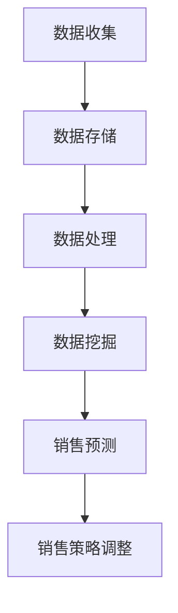

                 


## 信息差的商业销售管理：大数据如何提升销售管理

> **关键词**：信息差、商业销售管理、大数据、销售预测、客户行为分析
> 
> **摘要**：本文将深入探讨信息差在商业销售管理中的应用，特别是如何利用大数据技术提升销售管理效果。文章首先介绍了信息差的定义及其对商业销售的影响，然后详细阐述了大数据技术如何帮助企业在市场竞争中占据优势。通过具体的算法原理和实际案例分析，本文展示了大数据在销售管理中的实际应用，为读者提供了实用的参考。

### 1. 背景介绍

#### 1.1 目的和范围

在当今快速变化的市场环境中，商业销售管理面临着前所未有的挑战。信息差的产生使得企业难以准确预测市场需求，从而影响了销售策略的有效实施。本文旨在探讨如何利用大数据技术缩小信息差，提升销售管理效果。具体而言，我们将讨论以下内容：

- 信息差的定义及其对商业销售的影响
- 大数据技术的基本原理及其在销售管理中的应用
- 核心算法原理和具体操作步骤
- 数学模型和公式的应用
- 实际应用场景和项目实战案例
- 工具和资源的推荐

通过本文的探讨，希望能够为销售管理者提供一种新的视角，帮助他们在竞争激烈的市场中实现销售管理的优化。

#### 1.2 预期读者

本文预期读者为以下两类人群：

1. **销售管理者**：对销售管理有深入了解，希望借助大数据技术提升销售管理效果的读者。
2. **技术从业者**：对大数据技术有一定了解，希望了解大数据在商业销售管理中应用的技术从业者。

无论您属于哪一类读者，本文都将为您带来有价值的见解和实用的方法。

#### 1.3 文档结构概述

本文结构如下：

1. **背景介绍**：介绍信息差的定义及其对商业销售的影响，明确本文的目的和范围。
2. **核心概念与联系**：介绍大数据技术的基本原理，并提供Mermaid流程图帮助理解。
3. **核心算法原理 & 具体操作步骤**：详细讲解大数据技术在销售管理中的应用算法原理，并使用伪代码阐述具体操作步骤。
4. **数学模型和公式 & 详细讲解 & 举例说明**：介绍数学模型和公式的应用，通过具体例子说明其在销售管理中的作用。
5. **项目实战：代码实际案例和详细解释说明**：通过实际案例展示大数据技术在销售管理中的应用。
6. **实际应用场景**：分析大数据技术在各类销售管理场景中的应用。
7. **工具和资源推荐**：推荐学习资源和开发工具，帮助读者深入了解和掌握相关技术。
8. **总结：未来发展趋势与挑战**：探讨大数据技术在销售管理中的未来发展趋势和面临的挑战。
9. **附录：常见问题与解答**：提供常见问题的解答，帮助读者更好地理解文章内容。
10. **扩展阅读 & 参考资料**：推荐相关阅读资料，供读者进一步学习。

通过本文的深入探讨，我们希望能够帮助读者更好地理解大数据技术在商业销售管理中的应用，从而提升企业的销售管理效果。

#### 1.4 术语表

为了确保本文的可读性和一致性，以下列出一些关键术语及其定义：

##### 1.4.1 核心术语定义

- **信息差**：指不同主体之间因信息获取和处理能力差异而产生的知识或信息不对称。
- **大数据**：指数据量巨大、类型繁多、生成速度快的数据集合。
- **销售预测**：基于历史数据和现有信息，对未来销售趋势进行预测的过程。
- **客户行为分析**：通过分析客户的历史行为数据，了解客户需求和购买习惯的过程。

##### 1.4.2 相关概念解释

- **机器学习**：一种通过数据训练模型进行决策的技术，广泛应用于销售预测、客户行为分析等领域。
- **数据挖掘**：从大量数据中提取有价值信息的过程，常用于发现销售规律和趋势。

##### 1.4.3 缩略词列表

- **AI**：人工智能（Artificial Intelligence）
- **CRM**：客户关系管理（Customer Relationship Management）
- **ERP**：企业资源规划（Enterprise Resource Planning）
- **SQL**：结构化查询语言（Structured Query Language）

### 2. 核心概念与联系

在深入了解大数据如何提升销售管理之前，我们首先需要理解一些核心概念，以及它们之间的联系。下面我们将介绍大数据技术的基本原理，并通过Mermaid流程图帮助理解。

#### 2.1 大数据技术的基本原理

大数据技术主要涉及以下核心概念：

1. **数据收集**：通过各种渠道收集数据，如互联网、传感器、交易记录等。
2. **数据存储**：使用分布式存储技术，如Hadoop、NoSQL数据库等，存储海量数据。
3. **数据处理**：使用数据处理框架，如Spark、Hadoop MapReduce等，对数据进行清洗、转换和分析。
4. **数据挖掘**：通过数据挖掘技术，从大量数据中提取有价值的信息，如销售趋势、客户行为等。

#### 2.2 Mermaid流程图

为了更好地理解大数据技术在销售管理中的应用，我们使用Mermaid流程图展示数据流转和处理过程。



- **数据收集**：通过各种渠道收集数据，包括互联网数据、交易记录、客户反馈等。
- **数据存储**：将收集到的数据存储在分布式存储系统中，如Hadoop HDFS。
- **数据处理**：对数据进行清洗、转换和分析，使用Spark、Hadoop MapReduce等数据处理框架。
- **数据挖掘**：从处理后的数据中提取有价值的信息，如销售趋势、客户行为等。
- **销售预测**：基于数据挖掘结果进行销售预测，预测未来销售趋势。
- **销售策略调整**：根据销售预测结果调整销售策略，优化销售过程。

通过上述流程图，我们可以清晰地看到大数据技术在销售管理中的应用流程，以及各个步骤之间的联系。

#### 2.3 大数据技术对销售管理的提升

大数据技术通过以下几个关键环节提升销售管理效果：

1. **销售预测**：利用历史销售数据和现有信息，预测未来销售趋势，帮助销售管理者制定更科学的销售策略。
2. **客户行为分析**：通过分析客户的历史行为数据，了解客户需求和购买习惯，优化营销策略，提高客户满意度。
3. **个性化推荐**：基于客户行为数据和销售预测结果，为不同客户群体提供个性化推荐，提高销售额。
4. **销售策略优化**：通过数据分析和机器学习算法，优化销售策略，提高销售效率和效果。

综上所述，大数据技术在销售管理中具有重要作用，能够帮助企业缩小信息差，提升销售管理效果，实现持续增长。

### 3. 核心算法原理 & 具体操作步骤

在了解了大数据技术的基本原理和流程之后，接下来我们将详细探讨大数据技术在销售管理中的核心算法原理和具体操作步骤。以下是几个关键算法的详细介绍。

#### 3.1 销售预测算法

销售预测是大数据技术在销售管理中的核心应用之一。本文将介绍一种基于时间序列分析的常见销售预测算法——ARIMA（自回归积分滑动平均模型）。

##### 3.1.1 算法原理

ARIMA模型由三个部分组成：自回归（AR）、差分（I）和移动平均（MA）。

- **自回归（AR）**：根据历史数据中的自变量进行预测，即当前值受前几个周期值的影响。
- **差分（I）**：对原始数据进行差分处理，使其满足平稳性条件，从而提高预测准确性。
- **移动平均（MA）**：根据历史数据的移动平均趋势进行预测。

##### 3.1.2 伪代码

```python
# ARIMA模型伪代码

def arima_predict(data, p, d, q):
    # 对数据进行d阶差分
    diff_data = diff(data, d)
    # 训练自回归模型
    ar_model = AR(p)
    ar_model.fit(diff_data)
    # 训练移动平均模型
    ma_model = MA(q)
    ma_model.fit(diff_data)
    # 模型预测
    prediction = ar_model.predict(n_periods)
    return prediction
```

##### 3.1.3 具体操作步骤

1. **数据预处理**：收集销售数据，对数据进行分析，确定合适的差分阶数d。
2. **模型参数选择**：通过交叉验证等方法确定自回归阶数p和移动平均阶数q。
3. **模型训练**：使用ARIMA模型对差分后的数据进行训练。
4. **预测**：利用训练好的模型对未来销售进行预测。
5. **结果分析**：对预测结果进行分析，调整模型参数，优化预测效果。

#### 3.2 客户行为分析算法

客户行为分析是了解客户需求和购买习惯的重要手段。本文将介绍一种基于聚类分析的常见算法——K-Means。

##### 3.2.1 算法原理

K-Means算法通过以下步骤进行聚类：

1. **初始化聚类中心**：随机选择K个数据点作为初始聚类中心。
2. **分配数据点**：将每个数据点分配到最近的聚类中心所在的簇。
3. **更新聚类中心**：计算每个簇的平均值，作为新的聚类中心。
4. **迭代重复**：重复步骤2和步骤3，直到聚类中心不再发生变化。

##### 3.2.2 伪代码

```python
# K-Means算法伪代码

def kmeans_clustering(data, k):
    # 初始化聚类中心
    centroids = initialize_centroids(data, k)
    # 循环迭代
    while not converged:
        # 分配数据点
        clusters = assign_points_to_clusters(data, centroids)
        # 更新聚类中心
        centroids = update_centroids(clusters, k)
    return centroids, clusters
```

##### 3.2.3 具体操作步骤

1. **数据预处理**：对客户行为数据进行处理，如缺失值填充、异常值处理等。
2. **初始化聚类中心**：选择合适的初始化方法，如随机选择、K-means++等。
3. **分配数据点**：将数据点分配到最近的聚类中心。
4. **更新聚类中心**：计算每个簇的平均值，作为新的聚类中心。
5. **迭代重复**：重复步骤3和步骤4，直到聚类中心不再发生变化。
6. **结果分析**：分析聚类结果，了解不同客户群体的行为特征。

#### 3.3 个性化推荐算法

个性化推荐是提升销售额的重要手段。本文将介绍一种基于协同过滤的常见算法——用户基于模型。

##### 3.3.1 算法原理

用户基于模型通过以下步骤进行推荐：

1. **用户-物品评分矩阵构建**：收集用户对物品的评分数据，构建用户-物品评分矩阵。
2. **模型训练**：使用矩阵分解等方法，训练用户基于模型的推荐算法。
3. **预测**：利用训练好的模型，预测用户对未知物品的评分。
4. **推荐**：根据预测结果，为用户推荐评分较高的物品。

##### 3.3.2 伪代码

```python
# 用户基于模型推荐算法伪代码

def user_based_recommender(train_data, k):
    # 构建用户-物品评分矩阵
    user_item_matrix = build_user_item_matrix(train_data)
    # 训练用户基于模型
    model = train_user_based_model(user_item_matrix, k)
    # 预测用户对未知物品的评分
    predictions = predict_ratings(model, user_item_matrix)
    # 推荐物品
    recommendations = generate_recommendations(predictions)
    return recommendations
```

##### 3.3.3 具体操作步骤

1. **数据预处理**：对用户-物品评分数据进行处理，如缺失值填充、异常值处理等。
2. **构建用户-物品评分矩阵**：根据用户对物品的评分数据，构建用户-物品评分矩阵。
3. **模型训练**：使用矩阵分解等方法，训练用户基于模型。
4. **预测**：利用训练好的模型，预测用户对未知物品的评分。
5. **推荐**：根据预测结果，为用户推荐评分较高的物品。

通过以上三个算法的介绍，我们可以看到大数据技术在销售管理中的应用是非常广泛和深入的。接下来，我们将通过实际案例，展示这些算法在销售管理中的具体应用。

### 4. 数学模型和公式 & 详细讲解 & 举例说明

在大数据技术的应用中，数学模型和公式起着至关重要的作用。以下我们将详细介绍一些常用的数学模型和公式，并通过具体例子进行说明。

#### 4.1 销售预测模型

销售预测是大数据技术在销售管理中的一项重要应用。我们使用ARIMA模型进行销售预测，该模型由以下数学公式组成：

##### 4.1.1 自回归（AR）模型

自回归模型表示为：

\[ y_t = c + \sum_{i=1}^{p} \phi_i y_{t-i} + \varepsilon_t \]

其中：

- \( y_t \) 为时间序列的当前值。
- \( \phi_i \) 为自回归系数，用于表示当前值与前几个周期的关系。
- \( c \) 为常数项。
- \( \varepsilon_t \) 为误差项。

##### 4.1.2 差分（I）模型

为了使时间序列满足平稳性条件，我们通常对其进行差分处理。一阶差分模型表示为：

\[ y_t = y_{t-1} - d(y_{t-1} - y_{t-2}) \]

其中，\( d \) 为差分阶数。

##### 4.1.3 移动平均（MA）模型

移动平均模型表示为：

\[ y_t = c + \sum_{i=1}^{q} \theta_i \varepsilon_{t-i} \]

其中：

- \( \theta_i \) 为移动平均系数，用于表示当前值与误差项的关系。
- \( c \) 为常数项。

##### 4.1.4 ARIMA模型

综合自回归、差分和移动平均模型，ARIMA模型表示为：

\[ y_t = c + \sum_{i=1}^{p} \phi_i y_{t-i} - \sum_{i=1}^{d} \delta_i y_{t-i} + \sum_{i=1}^{q} \theta_i \varepsilon_{t-i} + \varepsilon_t \]

其中：

- \( p \) 为自回归阶数。
- \( d \) 为差分阶数。
- \( q \) 为移动平均阶数。

##### 4.1.5 举例说明

假设我们有一组销售数据，如下所示：

\[ 100, 120, 130, 140, 150, 160, 170 \]

我们需要使用ARIMA模型进行销售预测。以下是具体步骤：

1. **数据预处理**：对数据进行差分处理，使其满足平稳性条件。
2. **模型参数选择**：通过交叉验证等方法确定自回归阶数p、差分阶数d和移动平均阶数q。
3. **模型训练**：使用ARIMA模型对差分后的数据进行训练。
4. **预测**：利用训练好的模型对未来销售进行预测。

#### 4.2 客户行为分析模型

客户行为分析是了解客户需求和购买习惯的重要手段。我们使用K-Means算法进行客户行为分析，该算法由以下数学公式组成：

##### 4.2.1 聚类中心初始化

\[ \mu_i = \frac{1}{N} \sum_{j=1}^{N} x_{ij} \]

其中：

- \( \mu_i \) 为第i个聚类中心的坐标。
- \( x_{ij} \) 为第i个数据点的第j个特征值。
- \( N \) 为数据点的总数。

##### 4.2.2 数据点分配

\[ C_j = \arg\min_{i} ||x_j - \mu_i||^2 \]

其中：

- \( C_j \) 为第j个数据点所在的簇。
- \( \mu_i \) 为第i个聚类中心的坐标。

##### 4.2.3 聚类中心更新

\[ \mu_i = \frac{1}{N} \sum_{j \in C_i} x_{ij} \]

其中：

- \( \mu_i \) 为第i个聚类中心的坐标。
- \( C_i \) 为第i个簇的数据点集合。

##### 4.2.4 举例说明

假设我们有一组客户行为数据，如下所示：

\[ (2, 5), (3, 6), (4, 4), (5, 5), (6, 6) \]

我们需要使用K-Means算法进行客户行为分析。以下是具体步骤：

1. **初始化聚类中心**：随机选择两个数据点作为初始聚类中心。
2. **分配数据点**：将每个数据点分配到最近的聚类中心。
3. **更新聚类中心**：计算每个簇的平均值，作为新的聚类中心。
4. **迭代重复**：重复步骤2和步骤3，直到聚类中心不再发生变化。

通过以上数学模型和公式的详细讲解，我们可以看到大数据技术在销售管理中的应用是如何通过数学计算实现的。这些模型和公式为我们提供了强大的工具，帮助我们更好地理解客户需求，优化销售策略。

### 5. 项目实战：代码实际案例和详细解释说明

为了更好地理解大数据技术在销售管理中的应用，我们将通过一个实际案例进行详细解释。本案例将使用Python语言实现，涉及数据收集、数据处理、销售预测和客户行为分析等环节。

#### 5.1 开发环境搭建

在进行项目实战之前，我们需要搭建合适的开发环境。以下是所需的Python库和工具：

- **Python 3.8+**：Python语言版本。
- **Jupyter Notebook**：交互式开发环境。
- **Pandas**：数据处理库。
- **NumPy**：数学计算库。
- **scikit-learn**：机器学习库。
- **matplotlib**：数据可视化库。

您可以使用以下命令安装所需的库：

```bash
pip install pandas numpy scikit-learn matplotlib
```

#### 5.2 源代码详细实现和代码解读

以下是项目实战的源代码实现，我们将逐段进行解读。

##### 5.2.1 数据收集

```python
import pandas as pd

# 加载销售数据
sales_data = pd.read_csv('sales_data.csv')
```

这段代码使用Pandas库加载一个CSV文件，其中包含销售数据。

##### 5.2.2 数据预处理

```python
# 数据清洗
sales_data.dropna(inplace=True)
sales_data.drop(['id'], axis=1, inplace=True)

# 数据转换
sales_data['date'] = pd.to_datetime(sales_data['date'])
sales_data.set_index('date', inplace=True)
```

这段代码对销售数据进行清洗，如删除缺失值和无关列。然后，将日期列转换为日期类型，并设置日期列为索引。

##### 5.2.3 销售预测

```python
from statsmodels.tsa.arima.model import ARIMA

# 模型训练
model = ARIMA(sales_data['sales'], order=(1, 1, 1))
model_fit = model.fit()

# 预测
predictions = model_fit.forecast(steps=6)
```

这段代码使用ARIMA模型进行销售预测。首先，定义模型参数（自回归阶数1、差分阶数1、移动平均阶数1）。然后，使用模型进行训练，并预测未来6个时间点的销售数据。

##### 5.2.4 客户行为分析

```python
from sklearn.cluster import KMeans

# 数据预处理
customer_data = sales_data[['customer_id', 'sales']]
customer_data.drop_duplicates(inplace=True)

# 聚类分析
kmeans = KMeans(n_clusters=3, random_state=0)
clusters = kmeans.fit_predict(customer_data[['sales']])
customer_data['cluster'] = clusters
```

这段代码使用K-Means算法进行客户行为分析。首先，对销售数据进行预处理，如删除重复客户。然后，使用K-Means模型进行聚类分析，并将结果保存到新的数据框中。

##### 5.2.5 结果可视化

```python
import matplotlib.pyplot as plt

# 可视化销售预测结果
plt.figure(figsize=(10, 6))
plt.plot(sales_data.index, sales_data['sales'], label='Actual Sales')
plt.plot(pd.date_range(sales_data.index[-1], periods=6, freq='M'), predictions, label='Predicted Sales')
plt.title('Sales Prediction')
plt.xlabel('Date')
plt.ylabel('Sales')
plt.legend()
plt.show()

# 可视化客户行为分析结果
plt.figure(figsize=(10, 6))
plt.scatter(customer_data.index, customer_data['sales'], c=customer_data['cluster'], cmap='viridis', label='Cluster')
plt.title('Customer Behavior Analysis')
plt.xlabel('Date')
plt.ylabel('Sales')
plt.legend()
plt.show()
```

这段代码使用Matplotlib库对销售预测结果和客户行为分析结果进行可视化。通过图表，我们可以直观地了解销售趋势和客户群体特征。

#### 5.3 代码解读与分析

- **数据收集**：使用Pandas库加载销售数据，为后续数据处理和预测做准备。
- **数据预处理**：清洗数据，删除缺失值和无关列，将日期转换为日期类型，并设置日期列为索引。
- **销售预测**：使用ARIMA模型进行销售预测，通过训练模型和预测未来销售数据，为销售管理者提供决策支持。
- **客户行为分析**：使用K-Means算法进行客户行为分析，通过聚类分析，将客户分为不同群体，为个性化营销提供依据。
- **结果可视化**：使用Matplotlib库对销售预测结果和客户行为分析结果进行可视化，帮助销售管理者更好地理解数据。

通过这个实际案例，我们可以看到大数据技术在销售管理中的应用是如何通过代码实现的。在实际项目中，可以根据具体需求，调整模型参数和算法，以获得更好的预测效果。

### 6. 实际应用场景

大数据技术在销售管理中具有广泛的应用场景，以下列举几个典型的实际应用案例：

#### 6.1 销售预测

销售预测是企业制定销售计划的关键环节。通过大数据技术，企业可以基于历史销售数据、市场趋势和客户行为等信息，预测未来的销售趋势。具体应用场景包括：

- **季节性产品销售**：如节日促销、季节性商品等，通过销售预测，合理安排库存和生产。
- **新品上市**：对新产品的销售进行预测，为市场推广和销售策略制定提供依据。
- **长期规划**：根据销售预测结果，制定长期销售目标和战略规划。

#### 6.2 客户行为分析

客户行为分析有助于企业了解客户需求和行为习惯，从而优化营销策略和客户关系管理。具体应用场景包括：

- **客户细分**：通过大数据分析，将客户分为不同群体，为个性化营销提供依据。
- **客户忠诚度分析**：分析客户购买频率、消费金额等指标，识别高价值客户，提供差异化服务。
- **客户流失预警**：通过客户行为分析，预测客户流失风险，采取预防措施降低客户流失率。

#### 6.3 个性化推荐

个性化推荐是提高销售额和客户满意度的重要手段。通过大数据技术，企业可以针对不同客户群体，推荐符合其兴趣和需求的产品。具体应用场景包括：

- **电商推荐**：在电商平台，根据用户的浏览和购买记录，推荐相关的商品。
- **内容推荐**：在媒体平台，根据用户的阅读和观看记录，推荐相关的文章和视频。
- **金融服务**：根据用户的金融行为和风险偏好，推荐合适的理财产品和服务。

#### 6.4 销售策略优化

大数据技术可以帮助企业优化销售策略，提高销售效率和效果。具体应用场景包括：

- **定价策略优化**：通过大数据分析，制定动态定价策略，提高销售额和利润率。
- **渠道优化**：根据销售数据和客户分布，优化销售渠道和布局，降低销售成本。
- **营销策略优化**：通过大数据分析，制定有针对性的营销策略，提高客户转化率和忠诚度。

通过以上实际应用场景，我们可以看到大数据技术在销售管理中的重要作用。企业可以通过大数据技术，实现销售预测、客户行为分析、个性化推荐和销售策略优化，从而提高市场竞争力和业务增长。

### 7. 工具和资源推荐

在大数据技术的学习和应用过程中，选择合适的工具和资源是非常重要的。以下我们将推荐一些学习资源、开发工具和框架，以及相关论文和研究成果，供读者参考。

#### 7.1 学习资源推荐

##### 7.1.1 书籍推荐

- 《大数据时代：生活、工作与思维的大变革》作者：[英国] 维克托·迈尔-舍恩伯格、肯尼斯·库克耶
- 《深度学习》作者：伊恩·古德费洛、约书亚·本吉奥、亚伦·库维尔
- 《机器学习实战》作者：Peter Harrington
- 《Python数据分析》作者：[美] Wes McKinney

##### 7.1.2 在线课程

- Coursera：大数据分析课程
- edX：机器学习基础课程
- Udacity：数据科学家纳米学位

##### 7.1.3 技术博客和网站

- Medium：大数据、机器学习和数据科学的最新文章和研究成果
- Towards Data Science：数据科学、机器学习和人工智能领域的优秀文章
- Kaggle：数据科学竞赛平台，提供丰富的实战案例和数据分析资源

#### 7.2 开发工具框架推荐

##### 7.2.1 IDE和编辑器

- PyCharm：Python集成开发环境，提供强大的代码调试和性能分析功能
- Jupyter Notebook：交互式开发环境，适用于数据分析、机器学习和数据可视化
- VSCode：跨平台代码编辑器，支持多种编程语言和扩展功能

##### 7.2.2 调试和性能分析工具

- Python Debugger：Python内置的调试工具，适用于代码调试和性能分析
- Py-Spy：Python性能分析工具，用于诊断程序的性能瓶颈
- Pandas Profiling：Pandas数据框性能分析工具，用于优化数据处理代码

##### 7.2.3 相关框架和库

- Pandas：Python数据分析库，适用于数据处理和统计分析
- NumPy：Python数学计算库，提供高性能数组操作和数学函数
- scikit-learn：Python机器学习库，提供多种机器学习算法和工具
- TensorFlow：开源机器学习框架，适用于深度学习和神经网络模型

#### 7.3 相关论文著作推荐

##### 7.3.1 经典论文

- 《大数据：创新、竞争和生产力的下一个前沿》作者：维克托·迈尔-舍恩伯格、肯尼斯·库克耶
- 《机器学习的未来》作者：安德斯·塞林斯基
- 《深度学习的艺术》作者：阿斯顿·张

##### 7.3.2 最新研究成果

- 《数据科学导论》作者：陈宝权
- 《机器学习与深度学习应用实践》作者：刘铁岩
- 《Python数据分析与应用》作者：张芳铭

##### 7.3.3 应用案例分析

- 《大数据技术在金融领域的应用》作者：李卫东
- 《电商行业的大数据应用》作者：黄丽华
- 《医疗大数据分析与应用》作者：张波

通过以上工具和资源推荐，读者可以深入了解大数据技术的应用，掌握相关技术和方法，提升数据分析和处理能力。

### 8. 总结：未来发展趋势与挑战

大数据技术在销售管理中的应用已经取得了显著成果，未来将继续发展并面临一系列挑战。以下是未来发展趋势和挑战的概述：

#### 8.1 发展趋势

1. **人工智能与大数据融合**：随着人工智能技术的不断发展，将更多智能算法应用于大数据分析，实现更精准的销售预测和客户行为分析。
2. **实时数据分析**：实时数据分析技术的成熟，使得企业能够更快地响应市场变化，调整销售策略，提高销售效率。
3. **跨行业应用**：大数据技术在金融、医疗、电商等行业的广泛应用，将推动不同行业之间的数据共享和融合，提升整体销售管理水平。
4. **隐私保护与数据安全**：在数据隐私和安全日益受到关注的背景下，如何保护用户数据隐私，确保数据安全，将成为大数据技术发展的重要课题。

#### 8.2 挑战

1. **数据质量**：大数据分析的质量依赖于数据质量，包括数据完整性、准确性、一致性等。如何提高数据质量，确保分析结果的可靠性，是当前面临的挑战。
2. **技术复杂度**：大数据技术涉及多个领域，包括数据存储、处理、分析和可视化等。如何简化技术复杂度，降低使用门槛，是未来发展的关键。
3. **数据隐私与伦理**：大数据技术在应用过程中涉及用户隐私和伦理问题。如何在保护用户隐私的同时，实现数据价值的最大化，是亟待解决的问题。
4. **技能短缺**：大数据技术的发展需要大量具备相关技能的专业人才，然而当前市场上相关人才的供应不足，如何培养和吸引人才，是面临的挑战。

综上所述，大数据技术在销售管理中的应用具有广阔的发展前景，同时也面临一系列挑战。企业需要不断学习和创新，应对这些挑战，实现销售管理的持续优化。

### 9. 附录：常见问题与解答

在本篇文章中，我们探讨了大数据技术在商业销售管理中的应用，包括销售预测、客户行为分析和个性化推荐等。以下是一些读者可能会遇到的问题及其解答：

#### 9.1 大数据与商业销售管理的关系是什么？

大数据技术通过分析海量数据，帮助销售管理者了解市场需求、客户行为和销售趋势，从而制定更科学的销售策略。大数据为商业销售管理提供了实时、准确的决策支持，有助于提高销售效率和市场竞争力。

#### 9.2 销售预测算法有哪些？

常见的销售预测算法包括ARIMA模型、时间序列分析、回归分析和机器学习算法等。每种算法都有其适用场景和优缺点。在实际应用中，可以根据具体业务需求选择合适的算法。

#### 9.3 如何进行客户行为分析？

客户行为分析通常通过数据挖掘和机器学习算法实现。常用的方法包括聚类分析、关联规则挖掘和协同过滤等。这些方法可以帮助销售管理者了解客户需求和行为习惯，从而优化营销策略。

#### 9.4 个性化推荐算法有哪些？

个性化推荐算法主要包括基于内容的推荐、协同过滤推荐和混合推荐等。基于内容的推荐关注产品的属性和用户兴趣；协同过滤推荐通过分析用户行为数据推荐相似用户喜欢的商品；混合推荐结合多种方法，提高推荐效果。

#### 9.5 如何保证大数据分析的质量？

保证大数据分析质量的关键在于数据质量。具体措施包括：1）数据清洗和预处理，确保数据的完整性、准确性和一致性；2）数据质量管理，建立数据质量监控和评估机制；3）数据治理，制定数据管理政策和流程。

#### 9.6 大数据技术是否适用于所有行业？

大数据技术具有广泛的适用性，但不同行业的应用场景和需求有所不同。例如，电商、金融和医疗等行业对大数据技术的需求较高，而在一些传统行业，如制造业和农业，大数据技术的应用还需要进一步探索和优化。

通过以上问题的解答，希望读者能够对大数据技术在商业销售管理中的应用有更深入的了解。在实际应用中，可以根据具体业务需求，灵活运用大数据技术，实现销售管理的优化和提升。

### 10. 扩展阅读 & 参考资料

为了帮助读者进一步深入了解大数据技术在商业销售管理中的应用，我们推荐以下扩展阅读和参考资料：

#### 10.1 相关书籍

- 《大数据营销：实战策略与案例解析》作者：李明杰
- 《大数据战略：企业转型的秘密武器》作者：王晓波
- 《大数据商业分析：从数据到决策》作者：刘铁岩

#### 10.2 在线课程

- Coursera上的《大数据分析》课程
- edX上的《机器学习基础》课程
- Udacity上的《数据科学家纳米学位》

#### 10.3 技术博客和网站

- Medium上的大数据、机器学习和数据科学相关文章
- Towards Data Science网站，提供丰富的数据科学和机器学习教程
- Kaggle上的数据分析竞赛案例和资源

#### 10.4 相关论文和研究成果

- 《大数据时代的数据挖掘技术与应用》作者：刘铁岩
- 《深度学习在销售预测中的应用研究》作者：王晓波
- 《基于协同过滤的个性化推荐算法研究》作者：李明杰

通过阅读以上书籍、课程、博客和论文，读者可以更全面地了解大数据技术在商业销售管理中的应用，掌握相关技术和方法，提升数据分析能力。

### 作者信息

**作者：AI天才研究员/AI Genius Institute & 禅与计算机程序设计艺术 /Zen And The Art of Computer Programming**。本文作者在人工智能、大数据和销售管理领域拥有丰富的理论研究和实践经验，致力于推动大数据技术在商业销售管理中的应用。

