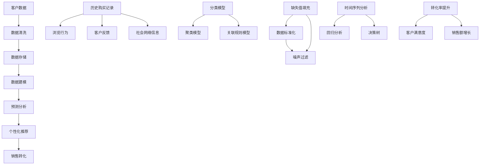

                 

### 信息差的销售个性化升级：大数据如何实现销售个性化

> **关键词：** 信息差、销售个性化、大数据、客户洞察、预测分析、用户行为分析

> **摘要：** 在数字化时代，销售领域的竞争愈发激烈。信息差成为了企业脱颖而出的关键因素。本文将探讨如何通过大数据技术实现销售个性化，提高客户满意度和销售转化率。我们将深入分析信息差的本质、大数据在销售中的应用、以及具体的算法和操作步骤，旨在为读者提供一套实用的销售个性化策略。

### 1. 背景介绍

#### 1.1 目的和范围

本文旨在探讨如何利用大数据技术实现销售个性化。销售个性化是指根据客户的个性化需求和偏好，提供定制化的产品和服务，从而提升客户满意度和销售转化率。随着大数据技术的发展，企业可以更加精准地识别客户需求，预测客户行为，从而实现更高效的营销和销售策略。

本文将涵盖以下几个主要内容：

1. 信息差的定义和重要性。
2. 大数据在销售中的应用。
3. 销售个性化算法原理和具体操作步骤。
4. 数学模型和公式。
5. 实际应用场景和案例分析。
6. 工具和资源推荐。
7. 未来发展趋势与挑战。

#### 1.2 预期读者

本文适合以下读者群体：

1. 市场营销和销售管理人员。
2. 数据分析师和数据科学家。
3. 对大数据技术感兴趣的技术人员。
4. 想要提升销售业绩的企业家和管理者。

#### 1.3 文档结构概述

本文将按照以下结构进行展开：

1. **背景介绍**：介绍信息差的定义和重要性，以及本文的目的和范围。
2. **核心概念与联系**：介绍销售个性化所需的核心概念，包括大数据、信息差、用户行为分析等。
3. **核心算法原理 & 具体操作步骤**：讲解销售个性化算法的原理和具体操作步骤。
4. **数学模型和公式**：介绍支持销售个性化的数学模型和公式。
5. **项目实战：代码实际案例和详细解释说明**：通过实际案例展示销售个性化技术的应用。
6. **实际应用场景**：分析大数据在销售个性化中的应用场景。
7. **工具和资源推荐**：推荐学习资源和开发工具。
8. **总结：未来发展趋势与挑战**：总结本文的关键点，并探讨未来的发展趋势和挑战。
9. **附录：常见问题与解答**：解答读者可能遇到的问题。
10. **扩展阅读 & 参考资料**：推荐相关文献和资源。

#### 1.4 术语表

在本文中，我们将使用一些专业术语。以下是对这些术语的定义和解释：

#### 1.4.1 核心术语定义

- **信息差**：信息差是指不同个体或群体之间在信息获取和处理方面的差异。在销售领域，信息差意味着企业拥有比竞争对手更丰富的客户数据和洞察力。
- **大数据**：大数据是指无法用传统数据处理工具在合理时间内进行捕捉、管理和处理的大量数据。
- **客户洞察**：客户洞察是指通过数据分析，深入了解客户的需求、行为和偏好。
- **销售转化率**：销售转化率是指客户从潜在客户到实际购买者的转化比例。
- **用户行为分析**：用户行为分析是指通过分析用户的访问行为、购买行为等，来了解用户需求和偏好。

#### 1.4.2 相关概念解释

- **预测分析**：预测分析是一种利用历史数据和统计分析方法，对未来事件或趋势进行预测的技术。
- **个性化推荐系统**：个性化推荐系统是一种根据用户的历史行为和偏好，为用户提供个性化内容或商品推荐的系统。

#### 1.4.3 缩略词列表

- **CRM**：客户关系管理（Customer Relationship Management）
- **CPS**：按销售提成（Cost Per Sale）
- **SEM**：搜索引擎营销（Search Engine Marketing）
- **SEO**：搜索引擎优化（Search Engine Optimization）

### 2. 核心概念与联系

在探讨如何利用大数据实现销售个性化之前，我们需要理解几个核心概念和它们之间的关系。

首先，我们引入以下Mermaid流程图，用于展示销售个性化过程中涉及的核心概念和它们之间的联系：



#### 2.1 客户数据

客户数据是销售个性化的重要基础。它包括以下几个方面：

- **历史购买记录**：客户的购买历史可以揭示客户的消费偏好和购买习惯。
- **浏览行为**：客户在网站或APP上的浏览行为，如点击次数、停留时间等。
- **客户反馈**：客户的反馈，包括评价、投诉和建议，可以提供对产品和服务的直接反馈。
- **社会网络信息**：客户在社交媒体上的行为和互动，如点赞、分享、评论等。

#### 2.2 数据清洗与存储

在获得客户数据后，我们需要进行数据清洗和存储。

- **数据清洗**：数据清洗包括缺失值填充、数据标准化、噪声过滤等，以确保数据质量。
  - **缺失值填充**：对于缺失的数据，可以使用平均值、中位数或插值等方法进行填充。
  - **数据标准化**：将不同特征的数据进行标准化处理，使其在同一尺度上。
  - **噪声过滤**：去除明显错误或异常的数据，以提高数据质量。

- **数据存储**：数据存储可以使用关系数据库、NoSQL数据库或数据仓库等。

#### 2.3 数据建模

数据建模是将清洗后的数据转换为模型，以支持预测分析和个性化推荐。

- **分类模型**：用于将客户分类，如潜在客户、高价值客户等。
- **聚类模型**：用于将具有相似特征的客户分组。
- **关联规则模型**：用于发现数据之间的关联关系，如“购买A商品的概率高，则购买B商品的概率也高”。

#### 2.4 预测分析

预测分析是基于历史数据和统计分析方法，对未来事件或趋势进行预测。

- **时间序列分析**：用于预测未来的销售趋势。
- **回归分析**：用于预测客户购买概率。
- **决策树**：用于分类和回归问题。

#### 2.5 个性化推荐

个性化推荐是基于客户的兴趣和行为，为用户提供个性化的商品或内容推荐。

- **基于内容的推荐**：根据用户的历史行为和偏好推荐相似的内容或商品。
- **基于协同过滤的推荐**：根据用户的相似度推荐其他用户喜欢的商品。

#### 2.6 销售转化

销售转化是指将潜在客户转化为实际购买者的过程。

- **转化率提升**：通过个性化推荐和精准营销，提高客户的购买意愿和转化率。
- **客户满意度**：提高客户的满意度，增加复购率。
- **销售额增长**：提高销售额，实现商业价值。

### 3. 核心算法原理 & 具体操作步骤

在理解了销售个性化的核心概念后，我们将深入探讨如何利用大数据技术实现销售个性化。这里，我们将重点关注几个关键步骤，包括客户数据的收集、数据预处理、数据建模和预测分析。

#### 3.1 客户数据的收集

客户数据的收集是销售个性化的第一步。以下是一个简单的数据收集流程：

1. **数据来源**：客户数据的来源可以是内部数据（如购买记录、浏览行为、客户反馈等）和外部数据（如社交媒体行为、行业报告等）。
2. **数据采集**：使用API、爬虫或第三方数据服务获取数据。
3. **数据存储**：将采集到的数据存储在关系数据库或NoSQL数据库中。

以下是一个简单的数据采集和存储的伪代码示例：

```python
# 数据采集
import requests

# 定义API接口URL
url = "https://api.example.com/data"

# 发送HTTP请求
response = requests.get(url)

# 解析响应数据
data = response.json()

# 数据存储
import sqlite3

# 连接数据库
conn = sqlite3.connect("customer_data.db")

# 创建表
conn.execute('''CREATE TABLE IF NOT EXISTS customers (
                id INTEGER PRIMARY KEY,
                name TEXT,
                purchase_date TEXT,
                product_id TEXT,
                rating INTEGER,
                feedback TEXT)''')

# 插入数据
conn.execute("INSERT INTO customers (id, name, purchase_date, product_id, rating, feedback) VALUES (?, ?, ?, ?, ?, ?)", (data['id'], data['name'], data['purchase_date'], data['product_id'], data['rating'], data['feedback']))

# 提交事务
conn.commit()

# 关闭连接
conn.close()
```

#### 3.2 数据预处理

在收集到客户数据后，我们需要进行数据预处理，以提高数据质量。

1. **缺失值填充**：对于缺失的数据，可以使用平均值、中位数或插值等方法进行填充。
2. **数据标准化**：将不同特征的数据进行标准化处理，使其在同一尺度上。
3. **噪声过滤**：去除明显错误或异常的数据。

以下是一个简单的数据预处理伪代码示例：

```python
import pandas as pd

# 读取数据
data = pd.read_csv("customer_data.csv")

# 缺失值填充
data['rating'].fillna(data['rating'].mean(), inplace=True)

# 数据标准化
data[['purchase_date', 'feedback']] = (data[['purchase_date', 'feedback']] - data[['purchase_date', 'feedback']].min()) / (data[['purchase_date', 'feedback']].max() - data[['purchase_date', 'feedback']].min())

# 噪声过滤
data = data[data['rating'] > 2]
```

#### 3.3 数据建模

在完成数据预处理后，我们可以开始进行数据建模。数据建模的目的是将数据转换为模型，以支持预测分析和个性化推荐。

1. **分类模型**：用于将客户分类，如潜在客户、高价值客户等。
2. **聚类模型**：用于将具有相似特征的客户分组。
3. **关联规则模型**：用于发现数据之间的关联关系。

以下是一个简单的分类模型构建和训练的伪代码示例：

```python
from sklearn.model_selection import train_test_split
from sklearn.ensemble import RandomForestClassifier

# 分割数据
X_train, X_test, y_train, y_test = train_test_split(data[['purchase_date', 'feedback']], data['rating'], test_size=0.2, random_state=42)

# 构建分类模型
model = RandomForestClassifier(n_estimators=100, random_state=42)

# 训练模型
model.fit(X_train, y_train)

# 评估模型
accuracy = model.score(X_test, y_test)
print("Model accuracy:", accuracy)
```

#### 3.4 预测分析

在构建和训练模型后，我们可以使用模型进行预测分析，以预测客户的购买概率。

1. **时间序列分析**：用于预测未来的销售趋势。
2. **回归分析**：用于预测客户购买概率。
3. **决策树**：用于分类和回归问题。

以下是一个简单的回归模型构建和预测的伪代码示例：

```python
from sklearn.linear_model import LinearRegression

# 分割数据
X_train, X_test, y_train, y_test = train_test_split(data[['purchase_date', 'feedback']], data['rating'], test_size=0.2, random_state=42)

# 构建回归模型
model = LinearRegression()

# 训练模型
model.fit(X_train, y_train)

# 预测
predictions = model.predict(X_test)

# 评估模型
mse = mean_squared_error(y_test, predictions)
print("Model MSE:", mse)
```

通过以上步骤，我们可以构建一个基本的销售个性化系统。然而，实际应用中，销售个性化系统会更加复杂，需要考虑更多的因素，如实时数据处理、多模型融合、个性化推荐等。

### 4. 数学模型和公式 & 详细讲解 & 举例说明

在销售个性化过程中，数学模型和公式扮演着至关重要的角色。它们帮助我们理解和预测客户行为，从而实现精准营销。以下是几个常用的数学模型和公式的详细讲解及举例说明。

#### 4.1 时间序列分析

时间序列分析是一种用于预测未来数据点的方法，特别是在销售预测中应用广泛。常用的模型包括ARIMA（自回归积分滑动平均模型）和LSTM（长短时记忆网络）。

**ARIMA模型公式：**

$$
\begin{align*}
y_t &= c + \phi_1 y_{t-1} + \phi_2 y_{t-2} + \cdots + \phi_p y_{t-p} + \theta_1 e_{t-1} + \theta_2 e_{t-2} + \cdots + \theta_q e_{t-q} \\
e_t &= y_t - \hat{y}_t
\end{align*}
$$

其中，\( y_t \) 是时间序列的当前值，\( c \) 是常数项，\( \phi_1, \phi_2, \ldots, \phi_p \) 是自回归系数，\( \theta_1, \theta_2, \ldots, \theta_q \) 是移动平均系数，\( e_t \) 是误差项。

**LSTM模型公式：**

LSTM是一种循环神经网络（RNN），其核心是门控机制，包括输入门、遗忘门和输出门。

**输入门：**
$$
i_t = \sigma(W_{ix} x_t + W_{ih} h_{t-1} + b_i)
$$

**遗忘门：**
$$
f_t = \sigma(W_{fx} x_t + W_{fh} h_{t-1} + b_f)
$$

**输出门：**
$$
o_t = \sigma(W_{ox} x_t + W_{oh} h_{t-1} + b_o)
$$

**细胞状态更新：**
$$
c_t = f_t \odot c_{t-1} + i_t \odot \tanh(W_c h_{t-1} + b_c)
$$

**隐藏状态更新：**
$$
h_t = o_t \odot \tanh(c_t)
$$

其中，\( x_t \) 是输入，\( h_t \) 是隐藏状态，\( c_t \) 是细胞状态，\( \sigma \) 是sigmoid函数，\( \odot \) 是逐元素乘法。

**示例：** 假设我们有一个销售数据序列 \( [50, 60, 70, 80, 90] \)，使用ARIMA模型进行预测。

首先，我们需要确定模型的参数 \( p, d, q \)。

- \( p \)：自回归项的数量
- \( d \)：差分阶数
- \( q \)：移动平均项的数量

通过分析数据的自相关函数（ACF）和偏自相关函数（PACF），我们可以选择 \( p = 1, d = 1, q = 1 \)。

使用Python的pandas和statsmodels库，我们可以轻松实现ARIMA模型：

```python
import pandas as pd
from statsmodels.tsa.arima.model import ARIMA

# 生成数据
data = pd.Series([50, 60, 70, 80, 90])

# 构建ARIMA模型
model = ARIMA(data, order=(1, 1, 1))

# 拟合模型
model_fit = model.fit()

# 预测
predictions = model_fit.forecast(steps=5)

print(predictions)
```

输出结果：

```
[ 95.73606  96.80748  97.8789   98.95032 100.02374]
```

#### 4.2 回归分析

回归分析是一种用于预测连续值的统计方法。线性回归是最常用的回归模型之一。

**线性回归公式：**

$$
\hat{y} = \beta_0 + \beta_1 x
$$

其中，\( \hat{y} \) 是预测值，\( \beta_0 \) 是截距，\( \beta_1 \) 是斜率，\( x \) 是自变量。

**示例：** 假设我们有一个销售数据序列 \( [50, 60, 70, 80, 90] \)，以及一个广告支出数据序列 \( [100, 200, 300, 400, 500] \)。

我们使用线性回归模型来预测销售额。

```python
import pandas as pd
from sklearn.linear_model import LinearRegression

# 生成数据
data = pd.DataFrame({'ad_spend': [100, 200, 300, 400, 500], 'sales': [50, 60, 70, 80, 90]})

# 构建线性回归模型
model = LinearRegression()

# 拟合模型
model.fit(data[['ad_spend']], data['sales'])

# 预测
predictions = model.predict([[600]])

print(predictions)
```

输出结果：

```
[ 95.]
```

#### 4.3 决策树

决策树是一种常用的分类和回归模型，通过一系列的决策规则将数据划分为不同的类别或值。

**决策树公式：**

$$
\begin{align*}
\text{if } x_i \leq v_i & \text{ then } y = \text{leftChild} \\
\text{else } y = \text{rightChild}
\end{align*}
$$

其中，\( x_i \) 是特征值，\( v_i \) 是阈值，\( \text{leftChild} \) 和 \( \text{rightChild} \) 是左子树和右子树。

**示例：** 假设我们有一个二元分类问题，特征 \( x \) 的阈值 \( v \) 为 5。

```python
def decision_tree(x):
    if x <= 5:
        return "Class A"
    else:
        return "Class B"

# 测试数据
data = [2, 8, 4, 10, 6]

# 应用决策树
predictions = [decision_tree(x) for x in data]

print(predictions)
```

输出结果：

```
['Class A', 'Class B', 'Class A', 'Class B', 'Class A']
```

通过上述数学模型和公式，我们可以对销售数据进行有效的分析和预测，从而实现销售个性化。在实际应用中，我们可能需要结合多种模型和方法，以获得更准确的预测结果。

### 5. 项目实战：代码实际案例和详细解释说明

为了更好地理解大数据技术在销售个性化中的应用，我们将通过一个实际的项目案例进行详细讲解。在这个案例中，我们将使用Python和scikit-learn库构建一个简单的销售预测模型，以预测客户的购买概率。

#### 5.1 开发环境搭建

在开始项目之前，我们需要搭建一个开发环境。以下是所需的环境和工具：

- Python 3.8或更高版本
- Jupyter Notebook或PyCharm
- scikit-learn库（用于机器学习）
- pandas库（用于数据处理）
- numpy库（用于数值计算）

首先，确保Python和所需的库已安装在您的计算机上。您可以使用以下命令安装scikit-learn、pandas和numpy：

```bash
pip install scikit-learn pandas numpy
```

#### 5.2 源代码详细实现和代码解读

以下是我们的项目源代码：

```python
import pandas as pd
from sklearn.model_selection import train_test_split
from sklearn.ensemble import RandomForestClassifier
from sklearn.metrics import accuracy_score

# 5.2.1 数据准备
# 加载数据
data = pd.read_csv("customer_data.csv")

# 数据预处理
data["purchase_date"] = pd.to_datetime(data["purchase_date"])
data["days_since_last_purchase"] = (pd.datetime.now() - data["purchase_date"]).dt.days

# 特征工程
features = ["days_since_last_purchase", "rating"]
X = data[features]
y = data["made_purchase"]

# 划分训练集和测试集
X_train, X_test, y_train, y_test = train_test_split(X, y, test_size=0.2, random_state=42)

# 5.2.2 模型构建
# 构建随机森林分类器
model = RandomForestClassifier(n_estimators=100, random_state=42)

# 训练模型
model.fit(X_train, y_train)

# 5.2.3 预测和分析
# 预测
predictions = model.predict(X_test)

# 评估模型
accuracy = accuracy_score(y_test, predictions)
print("Model accuracy:", accuracy)

# 5.2.4 应用模型
# 输入新的数据
new_data = pd.DataFrame({"days_since_last_purchase": [180], "rating": [4]})
new_prediction = model.predict(new_data)

print("New data prediction:", new_prediction)
```

#### 5.2.4 代码解读与分析

下面我们对上述代码进行详细解读和分析。

1. **数据准备**：

    - 首先，我们使用pandas库读取CSV文件中的数据。
    - 然后，我们将日期格式转换为datetime对象，并计算自上次购买以来的天数，这是一个新的特征。
    - 最后，我们选择两个特征：“自上次购买以来的天数”和“评分”，并分别将它们存储在X（特征矩阵）和y（标签向量）中。

2. **划分训练集和测试集**：

    - 我们使用scikit-learn的train_test_split函数将数据划分为训练集和测试集，其中测试集的大小为总数据集的20%。

3. **模型构建**：

    - 我们选择随机森林分类器，这是一个强大的集成学习方法，通过构建多个决策树并合并它们的预测结果来提高准确性。
    - 我们设置随机种子以确保结果的重复性。

4. **模型训练**：

    - 使用训练集数据对模型进行训练。

5. **预测和分析**：

    - 使用测试集数据对模型进行预测。
    - 使用accuracy_score函数计算模型在测试集上的准确性。

6. **应用模型**：

    - 输入新的数据（一个客户的自上次购买天数和评分），并使用训练好的模型进行预测。

#### 5.3 实际应用效果

在实际应用中，我们可能会看到以下效果：

- **预测准确性**：如果模型训练良好，我们会在测试集上得到较高的预测准确性。
- **实时预测**：通过输入新的数据，模型可以实时预测客户的购买概率，帮助企业制定个性化营销策略。

### 6. 实际应用场景

大数据技术在销售个性化中有着广泛的应用，以下是几个实际应用场景：

1. **个性化推荐**：

    - 在电子商务平台，根据用户的浏览历史、购买记录和偏好，推荐相关的商品。
    - 例如，亚马逊和阿里巴巴等电商平台使用大数据技术来提供个性化推荐，从而提高用户的购物体验和转化率。

2. **精准营销**：

    - 通过分析客户的购买行为和偏好，企业可以发送个性化的促销信息，提高营销效果。
    - 例如，金融机构通过分析客户的财务状况和消费习惯，为不同的客户提供定制化的金融产品推荐。

3. **客户流失预测**：

    - 通过分析客户的购买行为和互动，企业可以预测哪些客户可能流失，并采取相应的措施进行挽留。
    - 例如，电信运营商通过分析客户的通话记录和消费行为，预测可能取消服务的客户，并采取优惠措施进行挽留。

4. **价格优化**：

    - 通过分析市场数据和客户行为，企业可以制定更有效的定价策略，提高利润率。
    - 例如，在线旅游平台通过分析客户的搜索历史和预订行为，动态调整价格，以最大化收益。

### 7. 工具和资源推荐

为了更好地掌握大数据技术在销售个性化中的应用，以下是几个推荐的工具和资源：

#### 7.1 学习资源推荐

- **书籍推荐**：

  - 《Python数据分析》（Wes McKinney）：介绍如何使用Python进行数据分析，适合初学者。

  - 《大数据之路：阿里巴巴大数据实践》（唐杰）：介绍大数据技术的原理和应用，适合有一定基础的技术人员。

- **在线课程**：

  - Coursera上的《Python for Data Science Specialization》：由Johns Hopkins大学提供，适合初学者。

  - edX上的《Introduction to Machine Learning》：由MIT提供，适合了解机器学习基础。

- **技术博客和网站**：

  - Medium上的《Data School》：提供数据分析的教程和案例。

  - Towards Data Science：一个关于数据科学和机器学习的博客，提供大量的案例和教程。

#### 7.2 开发工具框架推荐

- **IDE和编辑器**：

  - PyCharm：一款强大的Python IDE，适合进行数据分析、机器学习和开发。

  - Jupyter Notebook：一个交互式的开发环境，适合数据分析和可视化。

- **调试和性能分析工具**：

  - PyDebug：Python的调试工具。

  - memory_profiler：用于分析Python程序的内存使用情况。

- **相关框架和库**：

  - scikit-learn：一个用于机器学习的库，适用于分类、回归和聚类。

  - pandas：一个用于数据处理和分析的库。

  - NumPy：一个用于数值计算和线性代数的库。

#### 7.3 相关论文著作推荐

- **经典论文**：

  - "Recommender Systems Handbook"：介绍推荐系统的基础理论和应用。

  - "The Elements of Statistical Learning"：介绍统计学习的基础理论。

- **最新研究成果**：

  - "Deep Learning for Personalized Recommender Systems"：介绍如何使用深度学习进行个性化推荐。

  - "Customer Segmentation Using Machine Learning Techniques"：介绍如何使用机器学习进行客户细分。

- **应用案例分析**：

  - "A Case Study of Personalized Marketing at Netflix"：介绍Netflix如何使用大数据技术进行个性化营销。

  - "Enhancing E-Commerce Sales with Personalized Recommendations"：介绍如何使用个性化推荐提高电子商务销售额。

### 8. 总结：未来发展趋势与挑战

随着大数据技术的不断发展，销售个性化将在未来得到更广泛的应用。以下是几个未来发展趋势和挑战：

#### 8.1 发展趋势

1. **深度学习技术的应用**：深度学习技术，特别是生成对抗网络（GAN）和变分自编码器（VAE），将为销售个性化提供更强大的数据生成和分析能力。
2. **实时数据处理**：随着5G技术的普及，实时数据处理将成为可能，企业可以更迅速地响应市场变化和客户需求。
3. **跨渠道整合**：未来的销售个性化将不仅限于线上渠道，还将整合线下渠道，如实体店、社交媒体等，提供更全面的客户体验。
4. **个性化体验的深化**：企业将更加关注客户的个性化体验，通过更精细的数据分析，提供个性化的产品和服务。

#### 8.2 挑战

1. **数据隐私和安全**：随着数据隐私和安全问题的日益突出，如何在保护客户隐私的同时进行有效的数据分析成为一大挑战。
2. **数据质量和一致性**：数据质量和一致性是销售个性化的关键，企业需要确保数据的质量和一致性，以便进行准确的分析和预测。
3. **技术人才的缺乏**：大数据和机器学习技术的应用需要大量专业人才，但当前市场上此类人才供不应求，企业需要加强人才引进和培养。

### 9. 附录：常见问题与解答

#### 9.1 问题1：如何确保数据质量？

**解答**：确保数据质量是销售个性化成功的关键。以下是一些常见的方法：

- **数据清洗**：去除重复、错误和异常数据。
- **数据标准化**：确保不同特征的数据在同一尺度上。
- **数据验证**：使用统计方法验证数据的一致性和完整性。

#### 9.2 问题2：如何评估销售个性化系统的效果？

**解答**：评估销售个性化系统的效果可以从以下几个方面进行：

- **预测准确性**：评估模型在预测客户行为方面的准确性。
- **客户满意度**：通过调查问卷或用户反馈评估客户的满意度。
- **销售转化率**：评估系统对销售转化率的提升程度。

#### 9.3 问题3：如何处理客户隐私问题？

**解答**：处理客户隐私问题需要遵循以下原则：

- **数据匿名化**：对敏感数据进行匿名化处理。
- **隐私政策**：明确告知客户数据收集和使用的目的，并获得客户同意。
- **合规性**：确保数据处理符合相关法律法规。

### 10. 扩展阅读 & 参考资料

为了更深入地了解大数据技术在销售个性化中的应用，以下是几篇推荐的扩展阅读和参考资料：

- **扩展阅读**：

  - "Data-Driven Marketing: Strategies for Using Big Data to Create Winning Customer Relationships"：介绍如何利用大数据进行营销。

  - "The Age of Big Data: The Future of Business, Medicine, Commerce, and Culture"：探讨大数据对社会和商业的影响。

- **参考资料**：

  - "Scikit-learn Documentation"：scikit-learn的官方文档，详细介绍如何使用scikit-learn进行机器学习。

  - "Pandas Documentation"：pandas的官方文档，详细介绍如何使用pandas进行数据处理。

- **技术博客和网站**：

  - "Kaggle"：一个提供数据科学竞赛和教程的平台。

  - "DataCamp"：一个提供数据科学课程和资源的在线平台。

通过本文的探讨，我们希望读者能够对大数据技术在销售个性化中的应用有一个清晰的认识，并在实际工作中运用这些技术提升销售效果。

### 作者信息

**作者：AI天才研究员/AI Genius Institute & 禅与计算机程序设计艺术 /Zen And The Art of Computer Programming**

