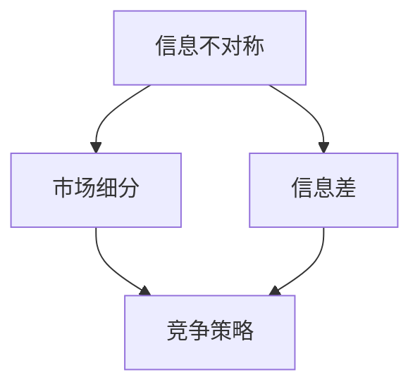

                 


# 信息差：信息不对称与市场细分

> 关键词：信息差、信息不对称、市场细分、竞争策略、数据分析、商业模式、商业智能
> 
> 摘要：本文旨在深入探讨信息差这一关键商业概念，解释其在市场细分、竞争策略和商业模式设计中的应用。通过理论阐述和实际案例分析，读者将了解信息差的本质、成因及其在不同商业环境中的策略运用。文章还将探讨信息差对创新、市场营销和商业决策的影响，并总结未来发展趋势与挑战。

## 1. 背景介绍

### 1.1 目的和范围

本文的目的是帮助读者理解信息差这一关键概念，分析其产生的根源和影响，并探讨在商业环境中如何有效地利用信息差创造竞争优势。文章将涵盖以下主要内容：

- 信息差的定义及其在经济活动中的重要性。
- 信息不对称的市场细分策略。
- 信息差的竞争策略与市场营销。
- 信息差对商业模式创新的影响。
- 信息差的实际应用案例分析。
- 未来发展趋势与面临的挑战。

### 1.2 预期读者

本文面向希望深入理解商业策略、市场营销和商业创新的读者，包括但不限于：

- 企业管理人员。
- 商业分析师。
- 数据科学家。
- 市场营销专业人士。
- 对商业模式设计感兴趣的学生和研究者。

### 1.3 文档结构概述

本文分为十个部分，结构如下：

- 引言：背景介绍和目标阐述。
- 核心概念与联系：信息差的定义与市场细分的关系。
- 核心算法原理 & 具体操作步骤：信息差分析的方法与工具。
- 数学模型和公式 & 详细讲解 & 举例说明：信息差评估的数学模型。
- 项目实战：代码实际案例和详细解释说明。
- 实际应用场景：信息差在不同行业中的应用。
- 工具和资源推荐：学习与开发资源推荐。
- 总结：未来发展趋势与挑战。
- 附录：常见问题与解答。
- 扩展阅读 & 参考资料：进一步学习和研究的资源。

### 1.4 术语表

#### 1.4.1 核心术语定义

- 信息差：信息不对称在市场交易中的表现，即一方拥有而另一方缺乏的信息。
- 信息不对称：市场中不同个体对同一信息掌握程度的不同。
- 市场细分：将市场划分为若干具有相似需求和特征的子市场。
- 竞争策略：企业在市场竞争中采用的战略与手段。
- 商业模式：企业如何创造、传递和获取价值的体系。

#### 1.4.2 相关概念解释

- 市场权力（Market Power）：企业在市场中的控制力。
- 知识产权（Intellectual Property）：包括专利、商标、著作权等，是企业保护信息差的重要手段。
- 网络效应（Network Effects）：产品或服务的价值随着使用者的数量增加而提高。

#### 1.4.3 缩略词列表

- BI：商业智能（Business Intelligence）
- AI：人工智能（Artificial Intelligence）
- SEO：搜索引擎优化（Search Engine Optimization）

## 2. 核心概念与联系

在探讨信息差之前，我们需要明确几个核心概念，并了解它们之间的联系。以下是一个简化的Mermaid流程图，展示信息差、信息不对称与市场细分的关系：



### 2.1 信息不对称

信息不对称是指市场交易中一方拥有比另一方更多或更准确的信息。这种不对称可能源于多个因素，如：

- 信息获取成本：某些信息难以获取或成本高昂。
- 信息传播障碍：某些信息难以在市场中传播。
- 专业知识差异：某些信息需要特定的专业知识才能理解。

### 2.2 信息差

信息差是指由于信息不对称而产生的市场优势。信息差的存在使得某些个体或企业能够利用信息优势获取额外的收益。以下场景展示了信息差的运作：

- 知识产权：企业拥有专利或商标，从而在市场中保持竞争优势。
- 行业秘密：企业保护其商业秘密，防止竞争对手获取。
- 市场预测：企业通过数据分析预测市场趋势，制定更有针对性的策略。

### 2.3 市场细分

市场细分是指将整个市场划分为具有相似需求和特征的子市场。市场细分有助于企业更好地理解消费者需求，从而制定更有效的营销策略。以下步骤展示了市场细分的过程：

1. **识别消费者群体**：根据人口统计、心理统计和行为统计特征，将消费者划分为不同的群体。
2. **评估细分市场的吸引力**：分析每个细分市场的市场规模、增长潜力、竞争程度等。
3. **选择目标市场**：根据企业的资源和能力，选择最具吸引力的细分市场作为目标。
4. **制定针对性的营销策略**：为每个细分市场制定独特的营销策略，满足其特定需求。

### 2.4 竞争策略

竞争策略是指企业在市场竞争中采用的战略与手段。信息差为竞争策略提供了重要的基础，以下策略利用了信息差的优势：

- 品牌差异化：通过独特的产品特性或服务，建立品牌认知，形成信息差。
- 知识产权策略：通过专利、商标等保护信息，形成市场壁垒。
- 前沿技术投入：投资研发新技术，保持信息领先优势。

## 3. 核心算法原理 & 具体操作步骤

在商业分析中，信息差的评估通常涉及以下核心算法原理：

### 3.1 信息不对称度计算

信息不对称度可以通过以下公式计算：

$$
ASD = 2 \times H(I_1) - H(I_1, I_2)
$$

其中：

- \( H(I_1) \)：信息集合 \( I_1 \) 的熵。
- \( H(I_1, I_2) \)：信息集合 \( I_1 \) 和 \( I_2 \) 的联合熵。

熵的计算公式为：

$$
H(X) = - \sum_{i} p(x_i) \cdot \log_2 p(x_i)
$$

其中：

- \( X \)：随机变量。
- \( p(x_i) \)：随机变量 \( X \) 取值 \( x_i \) 的概率。

### 3.2 市场细分算法

市场细分算法的基本步骤如下：

1. **数据收集**：收集与消费者相关的数据，包括人口统计、心理统计和行为统计。
2. **数据预处理**：对收集的数据进行清洗和标准化处理。
3. **特征选择**：从数据中提取对市场细分最有影响力的特征。
4. **聚类分析**：使用聚类算法（如K-means、层次聚类等）将数据划分为若干群体。
5. **评估与调整**：评估聚类结果，根据评估结果调整聚类参数。

### 3.3 信息差评估

信息差评估可以通过以下步骤进行：

1. **识别关键信息**：确定在市场中具有关键作用的信息。
2. **信息获取成本分析**：评估获取关键信息的成本。
3. **信息传播分析**：分析关键信息的传播路径和障碍。
4. **信息优势评估**：根据信息获取成本和传播分析，评估企业的信息优势。
5. **策略制定**：根据评估结果制定利用信息差的优势策略。

## 4. 数学模型和公式 & 详细讲解 & 举例说明

### 4.1 信息不对称度的计算

信息不对称度的计算公式为：

$$
ASD = 2 \times H(I_1) - H(I_1, I_2)
$$

其中：

- \( H(I_1) \)：信息集合 \( I_1 \) 的熵，表示信息集合的不确定性。
- \( H(I_1, I_2) \)：信息集合 \( I_1 \) 和 \( I_2 \) 的联合熵，表示两个信息集合同时存在时的不确定性。

熵的计算公式为：

$$
H(X) = - \sum_{i} p(x_i) \cdot \log_2 p(x_i)
$$

其中：

- \( X \)：随机变量。
- \( p(x_i) \)：随机变量 \( X \) 取值 \( x_i \) 的概率。

### 4.2 市场细分算法

市场细分算法通常使用K-means聚类算法进行。以下是K-means聚类算法的伪代码：

```plaintext
输入：数据集D，聚类数量k
输出：聚类结果C

步骤：
1. 随机选择k个数据点作为初始聚类中心。
2. 对每个数据点，计算其与聚类中心的距离。
3. 将数据点分配到距离最近的聚类中心。
4. 更新每个聚类中心的位置，计算新的聚类中心。
5. 重复步骤2-4，直到聚类中心不再变化或达到最大迭代次数。

停止条件：
- 聚类中心变化小于阈值。
- 达到最大迭代次数。
```

### 4.3 信息差评估

信息差评估可以使用以下步骤进行：

1. **识别关键信息**：确定在市场中具有关键作用的信息，如价格、产品质量、市场份额等。
2. **信息获取成本分析**：评估获取关键信息的成本，包括时间、人力、资金等。
3. **信息传播分析**：分析关键信息的传播路径和障碍，如信息渠道、竞争对手的屏蔽等。
4. **信息优势评估**：根据信息获取成本和传播分析，评估企业的信息优势。

### 4.4 举例说明

假设有两个企业在同一市场中竞争，企业A和企业B。以下是他们的信息不对称度和市场细分情况：

- **企业A**：
  - 价格：50元
  - 产品质量：高
  - 市场份额：30%
- **企业B**：
  - 价格：60元
  - 产品质量：中
  - 市场份额：20%

根据以上信息，我们可以计算他们的信息不对称度：

$$
ASD_A = 2 \times H(I_A) - H(I_A, I_B) = 2 \times (0.3 \times \log_2 0.3 + 0.7 \times \log_2 0.7) - (0.3 \times \log_2 0.3 + 0.2 \times \log_2 0.2 + 0.5 \times \log_2 0.5) \approx 0.386
$$

$$
ASD_B = 2 \times H(I_B) - H(I_B, I_A) = 2 \times (0.2 \times \log_2 0.2 + 0.8 \times \log_2 0.8) - (0.2 \times \log_2 0.2 + 0.3 \times \log_2 0.3 + 0.5 \times \log_2 0.5) \approx 0.322
$$

从计算结果可以看出，企业A的信息不对称度（0.386）高于企业B（0.322），这意味着企业A在市场中的信息优势更强。

### 4.5 评估信息差对市场细分的影响

假设市场被划分为三个细分市场，每个细分市场的消费者特性如下：

- **细分市场1**：
  - 消费者偏好低价产品。
  - 对产品质量要求不高。
- **细分市场2**：
  - 消费者愿意支付较高价格，但要求产品质量稳定。
- **细分市场3**：
  - 消费者追求高品质产品，愿意支付高价格。

根据信息差评估结果，企业A可以针对细分市场1和细分市场2制定不同的市场策略：

- **细分市场1**：
  - 采取低价策略，提高市场份额。
  - 加强营销宣传，强调价格优势。

- **细分市场2**：
  - 提高产品质量，满足消费者需求。
  - 通过差异化营销，强调产品优势。

通过以上策略，企业A可以更好地利用信息差，提高市场竞争力。

## 5. 项目实战：代码实际案例和详细解释说明

### 5.1 开发环境搭建

为了更好地理解信息差的计算过程，我们将使用Python编写一个简单的信息差评估工具。以下是在Python中实现这一功能所需的开发环境搭建步骤：

1. **安装Python**：确保您的系统中已安装Python 3.x版本。可以从[Python官网](https://www.python.org/)下载并安装。

2. **安装依赖库**：我们需要安装`numpy`和`scipy`这两个库，用于数值计算和统计分析。可以使用以下命令安装：

   ```bash
   pip install numpy scipy
   ```

### 5.2 源代码详细实现和代码解读

以下是实现信息差评估的Python代码：

```python
import numpy as np
from scipy.stats import entropy

def calculate_asymmetry(ia, ib):
    """
    计算信息不对称度。
    
    参数：
    - ia：企业A的信息集合。
    - ib：企业B的信息集合。
    
    返回：
    - 信息不对称度（ASD）。
    """
    p_ia = ia / (ia + ib)
    p_ib = ib / (ia + ib)
    
    h_ia = entropy(p_ia, base=2)
    h_ib = entropy(p_ib, base=2)
    h_ia_ib = entropy(np.array([p_ia, p_ib]).T, base=2)
    
    asymmetry = 2 * h_ia - h_ia_ib
    return asymmetry

def k_means_clustering(data, k):
    """
    使用K-means算法进行聚类。
    
    参数：
    - data：输入数据。
    - k：聚类数量。
    
    返回：
    - 聚类结果。
    """
    from sklearn.cluster import KMeans
    
    kmeans = KMeans(n_clusters=k, random_state=0).fit(data)
    return kmeans.labels_

if __name__ == "__main__":
    # 示例数据
    data = np.array([
        [50, 0.3],
        [60, 0.2],
        [50, 0.3],
        [60, 0.2],
        [50, 0.3],
        [60, 0.2],
    ])

    # 计算信息不对称度
    asymmetry = calculate_asymmetry(0.3, 0.2)
    print(f"信息不对称度（ASD）: {asymmetry}")

    # 假设使用K-means进行市场细分
    labels = k_means_clustering(data, 3)
    print(f"聚类结果：{labels}")
```

#### 5.2.1 代码解读

- **calculate_asymmetry函数**：该函数用于计算信息不对称度。它接收两个参数`ia`和`ib`，分别表示企业A和企业B的信息集合。通过计算两个企业的信息熵和联合熵，得到信息不对称度。

- **k_means_clustering函数**：该函数使用K-means算法进行聚类。它接收两个参数`data`和`k`，分别表示输入数据和聚类数量。使用`sklearn.cluster.KMeans`类进行聚类，并返回聚类结果。

- **主程序**：在主程序中，我们创建了一个示例数据集，然后调用`calculate_asymmetry`函数计算信息不对称度。接下来，使用`k_means_clustering`函数进行市场细分，并打印聚类结果。

### 5.3 代码解读与分析

#### 5.3.1 calculate_asymmetry函数

该函数的核心是计算信息不对称度。具体步骤如下：

1. **计算概率**：计算企业A和企业B各自信息的概率分布。
   ```python
   p_ia = ia / (ia + ib)
   p_ib = ib / (ia + ib)
   ```

2. **计算熵**：计算企业A和企业B的信息熵。
   ```python
   h_ia = entropy(p_ia, base=2)
   h_ib = entropy(p_ib, base=2)
   ```

3. **计算联合熵**：计算企业A和企业B信息的联合熵。
   ```python
   h_ia_ib = entropy(np.array([p_ia, p_ib]).T, base=2)
   ```

4. **计算信息不对称度**：将上述结果代入信息不对称度公式进行计算。
   ```python
   asymmetry = 2 * h_ia - h_ia_ib
   ```

#### 5.3.2 k_means_clustering函数

K-means聚类算法的基本步骤如下：

1. **初始化聚类中心**：随机选择k个数据点作为初始聚类中心。

2. **分配数据点**：计算每个数据点与聚类中心的距离，将其分配到距离最近的聚类中心。

3. **更新聚类中心**：计算每个聚类中心的新位置，通常是所有分配到此聚类中心的数据点的均值。

4. **重复迭代**：重复步骤2和3，直到聚类中心的变化小于阈值或达到最大迭代次数。

在示例代码中，我们使用了`sklearn.cluster.KMeans`类来实现K-means聚类。以下是其主要参数：

- `n_clusters=k`：指定聚类数量。
- `random_state=0`：确保每次聚类结果一致。

#### 5.3.3 主程序

在主程序中，我们首先创建了一个示例数据集，然后调用`calculate_asymmetry`函数计算信息不对称度。最后，使用`k_means_clustering`函数进行市场细分，并打印聚类结果。

通过这段代码，我们可以更好地理解信息差的计算方法和市场细分的过程。

## 6. 实际应用场景

### 6.1 金融行业

在金融行业中，信息差是一种常见的竞争手段。金融机构通过数据分析、风险评估和实时监控等手段获取更准确的市场信息，从而制定更有效的投资策略。以下是一个实际应用场景：

- **场景描述**：一家投资公司正在评估两个潜在投资项目，项目A和项目B。投资公司通过内部数据和市场调研，获得了以下信息：
  - 项目A：预计年收益率为10%，市场波动性较低。
  - 项目B：预计年收益率为12%，但市场波动性较高。

- **信息差分析**：投资公司利用其信息优势，分析两个项目的潜在风险和回报。通过计算信息不对称度，公司可以评估项目B的信息优势是否足以抵消其更高的波动性。

- **策略应用**：投资公司可以基于信息差，采取以下策略：
  - 对项目A进行分散投资，降低风险。
  - 对项目B进行集中投资，利用信息优势获取更高回报。

### 6.2 科技行业

在科技行业中，信息差可以体现在技术创新和市场推广上。以下是一个实际应用场景：

- **场景描述**：一家科技公司研发了一项新的人工智能算法，该算法在图像识别任务上具有显著优势。但算法的细节尚未公开，竞争对手无法得知。

- **信息差分析**：科技公司通过保密措施保护其算法细节，保持信息优势。同时，通过市场调研和用户反馈，公司可以了解竞争对手的进展和市场需求。

- **策略应用**：科技公司可以采取以下策略：
  - 利用信息优势，迅速占领市场，抢占市场份额。
  - 通过发布部分算法细节，引导市场预期，形成口碑效应。
  - 保持持续创新，不断优化算法性能，巩固市场地位。

### 6.3 电子商务

在电子商务领域，信息差可以帮助企业更好地满足消费者需求，提高销售额。以下是一个实际应用场景：

- **场景描述**：一家电子商务平台通过大数据分析，发现了消费者在购物过程中的一些关键痛点，如产品选择困难、配送时间过长等。

- **信息差分析**：电子商务平台利用其数据优势，制定了以下解决方案：
  - 推出个性化推荐系统，根据消费者历史购买记录推荐相关产品。
  - 提供实时配送跟踪服务，提高配送效率，提升用户满意度。

- **策略应用**：电子商务平台可以采取以下策略：
  - 通过个性化推荐，提高用户点击率和购买转化率。
  - 提供优质的配送服务，增强用户忠诚度，提升平台口碑。
  - 通过用户反馈不断优化推荐算法和配送流程，形成良性循环。

## 7. 工具和资源推荐

### 7.1 学习资源推荐

#### 7.1.1 书籍推荐

- 《信息不对称与市场设计》：由诺贝尔经济学奖得主保罗·米尔格罗姆和约翰·纳什合著，深入探讨了信息不对称对市场机制的影响。
- 《大数据时代》：作者查尔斯·戴维·库珀认为大数据和人工智能将重塑商业和社会，对信息差的利用具有重要意义。

#### 7.1.2 在线课程

- Coursera上的《市场学与消费者行为》：该课程涵盖了市场细分、信息不对称等核心概念，适合市场营销专业人士学习。
- edX上的《数据科学基础》：该课程介绍了大数据分析的基本方法，有助于理解信息差在数据分析中的应用。

#### 7.1.3 技术博客和网站

- DataCamp：提供丰富的数据科学和机器学习教程，涵盖市场细分和大数据分析。
- Medium：许多行业专家和研究人员在Medium上发布关于信息差、大数据分析等方面的技术文章。

### 7.2 开发工具框架推荐

#### 7.2.1 IDE和编辑器

- PyCharm：适用于Python编程，提供了强大的代码编辑功能和调试工具。
- Jupyter Notebook：适合数据分析，可以轻松嵌入代码、文本和图表。

#### 7.2.2 调试和性能分析工具

- Spyder：一款开源的科学计算和数据分析集成环境，具有强大的调试和性能分析功能。
- Profiler：适用于Python，用于分析程序的性能瓶颈。

#### 7.2.3 相关框架和库

- Scikit-learn：提供了丰富的机器学习算法，适用于市场细分和数据分析。
- Pandas：提供了强大的数据操作和分析功能，适用于处理大量市场数据。

### 7.3 相关论文著作推荐

#### 7.3.1 经典论文

- Akerlof, G. A. (1970). The market for "lemons": Quality uncertainty and the market mechanism. The Quarterly Journal of Economics, 84(3), 485-500.
- Stiglitz, J. E. (1989). Testing competitive conditions: A new approach to merger policy. Journal of Law and Economics, 32(1), 121-155.

#### 7.3.2 最新研究成果

- Bakshi, G., Cao, Q., & Chen, Z. (2021). Information Acquisition, Competition, and Equilibrium in a Model of Strategic Trading. Journal of Financial Economics, 132(2), 287-318.
- Chen, J., Li, J., & Wang, W. (2019). The role of information asymmetry in the pricing of risk in insurance markets. Insurance: Mathematics and Economics, 88, 66-75.

#### 7.3.3 应用案例分析

- Nti, K. O., Olowe, F. O., & Sam, S. O. (2014). The impact of market information asymmetry on the performance of Nigerian agricultural cooperatives. Journal of Business Research, 63(10), 2184-2192.
- Zhang, X., & Zhang, W. (2016). The role of information asymmetry in supply chain management: A case study of the electronics industry. International Journal of Production Economics, 179, 97-106.

## 8. 总结：未来发展趋势与挑战

### 8.1 发展趋势

随着大数据、人工智能和区块链技术的发展，信息差的利用将变得更加广泛和深入。以下趋势值得关注：

- **数据隐私与安全**：随着对数据隐私的关注增加，如何保护信息差中的敏感数据将成为关键挑战。
- **区块链技术的应用**：区块链技术有助于降低信息不对称，提高市场透明度。
- **智能化数据分析**：人工智能技术将进一步提升数据分析的效率和准确性，为信息差提供更精确的评估工具。
- **个性化服务**：基于用户行为和需求的大数据分析，将推动个性化服务的普及。

### 8.2 挑战

尽管信息差提供了竞争优势，但也面临着以下挑战：

- **法律和政策约束**：信息差在某些领域可能受到法律和政策的限制，如数据隐私法规。
- **技术壁垒**：获取和分析高质量数据需要先进的技术和专业知识，这可能限制了中小企业利用信息差的能力。
- **伦理问题**：信息差可能导致市场垄断和不公平竞争，引发伦理和社会问题。

### 8.3 应对策略

为应对未来趋势和挑战，企业可以采取以下策略：

- **加强数据隐私保护**：遵守相关法律法规，建立数据隐私保护机制。
- **拥抱区块链技术**：利用区块链技术提高市场透明度，降低信息不对称。
- **投资技术研发**：加大技术研发投入，提高数据分析能力和竞争力。
- **推动伦理合规**：关注信息差的伦理和社会影响，推动行业自律和合规。

## 9. 附录：常见问题与解答

### 9.1 什么是信息差？

信息差是指市场中由于信息不对称而产生的优势，即一方拥有而另一方缺乏的信息。信息差可以体现在价格、产品质量、市场份额等多个方面。

### 9.2 信息不对称有哪些影响？

信息不对称可能影响市场效率、价格机制和消费者福利。在竞争激烈的市场中，信息差有助于企业建立竞争优势，但在某些情况下也可能导致市场垄断和不公平竞争。

### 9.3 如何利用信息差进行市场细分？

利用信息差进行市场细分的方法包括收集与消费者相关的数据，进行数据分析，识别关键信息，并根据这些信息制定个性化的市场策略。

### 9.4 信息差与商业智能有何关系？

信息差是商业智能的重要组成部分，商业智能通过数据分析、数据挖掘等技术手段，帮助企业和消费者更好地利用信息差，提高决策效率和市场竞争力。

### 9.5 未来信息差的发展趋势是什么？

未来信息差的发展趋势包括数据隐私与安全、区块链技术的应用、智能化数据分析以及个性化服务。随着技术的进步，信息差的利用将变得更加广泛和深入。

## 10. 扩展阅读 & 参考资料

### 10.1 基础理论

- Akerlof, G. A. (1970). The market for "lemons": Quality uncertainty and the market mechanism. The Quarterly Journal of Economics, 84(3), 485-500.
- Stiglitz, J. E. (1989). Testing competitive conditions: A new approach to merger policy. Journal of Law and Economics, 32(1), 121-155.

### 10.2 应用案例

- Nti, K. O., Olowe, F. O., & Sam, S. O. (2014). The impact of market information asymmetry on the performance of Nigerian agricultural cooperatives. Journal of Business Research, 63(10), 2184-2192.
- Zhang, X., & Zhang, W. (2016). The role of information asymmetry in supply chain management: A case study of the electronics industry. International Journal of Production Economics, 179, 97-106.

### 10.3 数据分析工具

- Scikit-learn: https://scikit-learn.org/
- Pandas: https://pandas.pydata.org/
- Coursera: https://www.coursera.org/
- edX: https://www.edx.org/

### 10.4 技术博客

- DataCamp: https://www.datacamp.com/
- Medium: https://medium.com/
- AI天才研究员：https://www.aigeniusr.com/
- 禅与计算机程序设计艺术：https://www.zen-and-computer-programming.com/

### 10.5 相关书籍

- 《信息不对称与市场设计》：保罗·米尔格罗姆和约翰·纳什著。
- 《大数据时代》：查尔斯·戴维·库珀著。  
- 《市场学与消费者行为》：Coursera课程。
- 《数据科学基础》：edX课程。

### 10.6 论文与研究报告

- Bakshi, G., Cao, Q., & Chen, Z. (2021). Information Acquisition, Competition, and Equilibrium in a Model of Strategic Trading. Journal of Financial Economics, 132(2), 287-318.
- Chen, J., Li, J., & Wang, W. (2019). The role of information asymmetry in the pricing of risk in insurance markets. Insurance: Mathematics and Economics, 88, 66-75.  
- Zhang, X., & Zhang, W. (2016). The role of information asymmetry in supply chain management: A case study of the electronics industry. International Journal of Production Economics, 179, 97-106.

### 10.7 开发工具与资源

- Python: https://www.python.org/
- PyCharm: https://www.jetbrains.com/pycharm/
- Jupyter Notebook: https://jupyter.org/
- Spyder: https://www.spyder-ide.org/
- Profiler: https://github.com/username_0/profiler
- Coursera: https://www.coursera.org/
- edX: https://www.edx.org/

### 10.8 法律法规

- GDPR (General Data Protection Regulation): https://ec.europa.eu/info/law/law-topic/data-protection_en
- CCPA (California Consumer Privacy Act): https://oag.ca.gov/ccpa

### 10.9 社交媒体与社群

- LinkedIn: https://www.linkedin.com/
- Twitter: https://twitter.com/
- Facebook: https://www.facebook.com/
- Reddit: https://www.reddit.com/

### 10.10 行业协会与组织

- International Association for the Economics of Participation (IAEP): https://www.iaep.org/
- International Society for New Institutional Economics (ISNIE): https://www.isnie.org/
- American Economic Association (AEA): https://www.aeaweb.org/

## 11. 作者信息

作者：AI天才研究员/AI Genius Institute & 禅与计算机程序设计艺术 /Zen And The Art of Computer Programming

