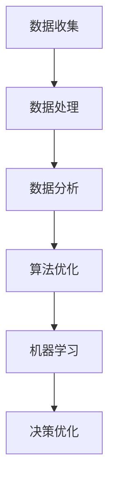
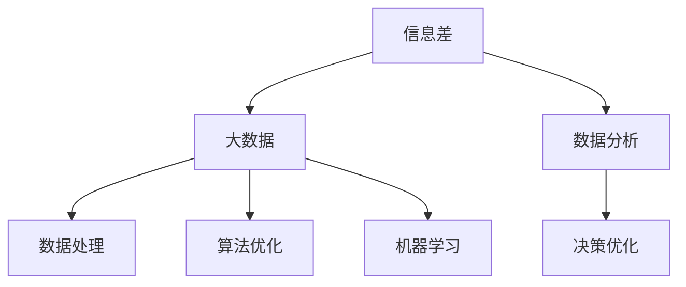
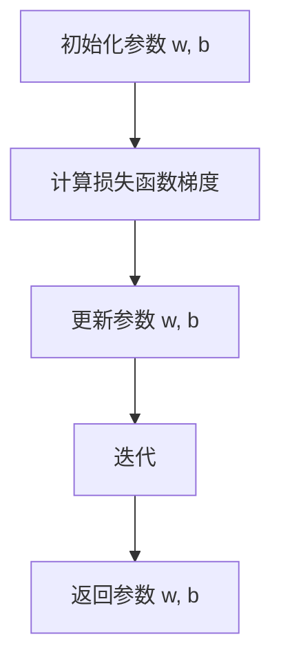

                 

# 信息差：利用大数据提升企业效率

## 关键词
- 信息差
- 大数据
- 企业效率
- 数据分析
- 人工智能
- 决策优化

## 摘要
本文将深入探讨如何利用信息差这一关键概念，通过大数据分析技术，显著提升企业的运营效率。我们将逐步解析信息差的定义及其在企业中的应用，详细阐述大数据在数据收集、处理和分析中的核心角色，以及如何通过算法优化和机器学习实现更加精准的决策。本文旨在为企业管理者和技术人员提供一套切实可行的策略，帮助他们在复杂的市场环境中取得竞争优势。

---

## 1. 背景介绍

### 1.1 目的和范围

本文的目标是帮助读者理解信息差的概念，并展示如何通过大数据技术将其应用于企业效率的提升。我们将讨论信息差的基本原理，分析大数据在现代企业中的重要性，以及如何利用大数据进行有效的数据分析和管理。

### 1.2 预期读者

本篇文章适合以下读者群体：
- 企业决策者
- 数据分析师
- 信息技术管理人员
- 对大数据和人工智能感兴趣的科研人员

### 1.3 文档结构概述

本文的结构如下：
- 第2章：核心概念与联系，介绍信息差、大数据、数据分析等相关概念。
- 第3章：核心算法原理，详细解释大数据分析中使用的算法。
- 第4章：数学模型和公式，讲解用于数据分析的数学模型及其实际应用。
- 第5章：项目实战，通过实际案例展示大数据分析的应用。
- 第6章：实际应用场景，讨论大数据在不同行业中的应用。
- 第7章：工具和资源推荐，介绍学习资源和开发工具。
- 第8章：总结，展望大数据和信息差在企业中的应用前景。
- 第9章：附录，解答常见问题。
- 第10章：扩展阅读，提供进一步学习的参考资料。

### 1.4 术语表

#### 1.4.1 核心术语定义
- **信息差**：不同个体或组织在获取、处理和利用信息上的差异。
- **大数据**：数据量大、多样性高、生成速度快的数据集。
- **数据分析**：使用统计学、机器学习等方法对数据进行处理和分析。
- **机器学习**：使计算机通过数据学习并作出预测或决策的技术。

#### 1.4.2 相关概念解释
- **数据挖掘**：从大量数据中挖掘出有价值信息的过程。
- **决策优化**：通过分析和优化决策过程，提高企业效率和利润。

#### 1.4.3 缩略词列表
- **AI**：人工智能
- **ML**：机器学习
- **DB**：数据库
- **ETL**：提取、转换、加载

---

## 2. 核心概念与联系

### 2.1 信息差的概念及其重要性

信息差是指在不同个体或组织之间，在获取、处理和利用信息上的差异。在企业环境中，信息差可以表现为：
- **市场信息差**：企业对市场趋势、竞争对手、消费者需求等信息掌握的深度和速度。
- **技术信息差**：企业对新技术、新方法了解和应用的领先程度。
- **资源信息差**：企业对资金、人才、资源等关键要素的掌握情况。

信息差的重要性在于，它直接影响企业的竞争力。掌握信息差的企业能够在市场变化中更快做出反应，抓住商机，降低风险，从而在竞争中取得优势。

### 2.2 大数据与信息差的关系

大数据是现代信息时代的重要资源，它为企业提供了海量的数据来分析信息差。大数据与信息差的关系可以从以下几个方面来理解：

1. **数据收集**：大数据技术使得企业能够收集到来自不同来源的海量数据，包括市场数据、社交媒体数据、客户交易数据等。
2. **数据处理**：大数据技术能够高效处理这些海量数据，通过数据清洗、数据整合等步骤，为企业提供可靠的分析基础。
3. **数据分析**：大数据分析技术能够从海量数据中发现有价值的信息，揭示信息差的存在和影响因素。
4. **决策优化**：基于大数据分析的结果，企业可以优化决策过程，提高市场应对能力，降低运营成本。

### 2.3 数据分析、算法优化与机器学习

数据分析是揭示信息差的关键环节。通过数据分析，企业可以深入了解市场趋势、消费者行为等，从而识别信息差。算法优化和机器学习则是提升数据分析效果的重要工具。

- **算法优化**：通过改进算法，可以提高数据分析的效率和准确性。例如，使用聚类算法对市场数据进行分类，或者使用回归算法预测市场趋势。
- **机器学习**：机器学习技术可以自动从数据中学习模式，进行预测和决策。通过训练机器学习模型，企业可以更加准确地分析信息差，并优化决策过程。

### 2.4 Mermaid 流程图

下面是一个简单的 Mermaid 流程图，展示大数据分析中信息差的识别和处理过程：



### 2.5 核心概念联系图解

为了更直观地展示核心概念之间的关系，我们可以绘制一个概念联系图，如下图所示：



---

在接下来的章节中，我们将深入探讨大数据分析的具体算法原理、数学模型，并通过实际项目案例来展示如何利用信息差提升企业效率。

---

## 3. 核心算法原理 & 具体操作步骤

### 3.1 数据分析算法概述

数据分析算法是大数据技术中的重要组成部分，它们帮助企业从海量数据中提取有价值的信息。以下是一些常用的数据分析算法：

- **回归分析**：用于预测数值型变量的变化趋势。
- **聚类分析**：用于将数据划分为不同的群体。
- **分类分析**：用于将数据划分为预定义的类别。
- **关联规则学习**：用于发现数据之间的关联关系。

### 3.2 伪代码详细阐述

以下是一个简单的回归分析算法的伪代码，用于预测企业销售额：

```plaintext
Algorithm: Linear Regression
Input: Data set X, Y
Output: Predicted values Y'
1. Initialize parameters w, b
2. For each iteration:
   3. Compute the gradient of the loss function: gradient = 2 * X * (X * w + b - Y)
   4. Update parameters: w = w - learning_rate * gradient
   5. b = b - learning_rate * gradient
6. Return parameters w, b
```

### 3.3 算法流程图

为了更直观地展示回归分析的算法流程，我们可以绘制以下 Mermaid 流程图：



### 3.4 实际应用案例

假设一家零售企业希望通过历史销售数据预测未来一个月的销售额。以下是具体操作步骤：

1. **数据收集**：收集过去三个月的每日销售额数据。
2. **数据处理**：清洗数据，处理缺失值和异常值。
3. **特征工程**：将日期、季节性因素等作为特征输入。
4. **模型训练**：使用线性回归算法训练模型。
5. **模型评估**：使用交叉验证评估模型性能。
6. **预测**：使用训练好的模型预测未来一个月的销售额。

---

在下一章节中，我们将进一步探讨数据分析中的数学模型和公式，以及如何通过这些模型来优化企业决策。

---

## 4. 数学模型和公式 & 详细讲解 & 举例说明

### 4.1 数据分析中的常见数学模型

在数据分析中，数学模型是理解数据、提取信息和做出预测的核心工具。以下是一些常见的数据分析数学模型：

- **回归模型**：用于预测连续变量的值。
- **分类模型**：用于将数据分类到不同的类别。
- **聚类模型**：用于将数据点按照相似性进行分组。
- **时间序列模型**：用于预测时间序列数据的变化趋势。

### 4.2 回归模型详细讲解

回归模型是最常用的数据分析工具之一，它用于预测数值型变量的值。以下是一个简单的线性回归模型的详细讲解：

#### 线性回归模型

线性回归模型假设两个变量之间呈线性关系，可以用以下数学公式表示：

\[ Y = wX + b \]

其中：
- \( Y \) 是因变量（预测值）。
- \( X \) 是自变量（特征值）。
- \( w \) 是权重系数。
- \( b \) 是偏置项。

#### 公式推导

线性回归模型的推导基于最小二乘法（Ordinary Least Squares，OLS）。该方法的目的是找到最佳拟合直线，使得实际观测值与预测值之间的误差平方和最小。

最小二乘法的公式如下：

\[ \min \sum_{i=1}^{n} (Y_i - (wX_i + b))^2 \]

#### 举例说明

假设我们有一组数据，表示一家公司在过去30天的销售额（Y）和广告支出（X）：

| Day | Ad Spend (X) | Sales (Y) |
|-----|--------------|-----------|
|  1  |     100      |   1500    |
|  2  |     200      |   1700    |
|  3  |     300      |   1800    |
| ... |      ...     |    ...    |
| 30 |     300      |   2200    |

我们希望通过线性回归模型预测第31天的销售额。以下是具体步骤：

1. **计算平均值**：
   \[ \bar{X} = \frac{\sum_{i=1}^{n} X_i}{n} \]
   \[ \bar{Y} = \frac{\sum_{i=1}^{n} Y_i}{n} \]

2. **计算协方差**：
   \[ \sum_{i=1}^{n} (X_i - \bar{X})(Y_i - \bar{Y}) \]

3. **计算相关系数**：
   \[ r = \frac{\sum_{i=1}^{n} (X_i - \bar{X})(Y_i - \bar{Y})}{\sqrt{\sum_{i=1}^{n} (X_i - \bar{X})^2} \sqrt{\sum_{i=1}^{n} (Y_i - \bar{Y})^2}} \]

4. **计算回归系数**：
   \[ w = \frac{r \sqrt{\sum_{i=1}^{n} (X_i - \bar{X})^2}}{\sum_{i=1}^{n} (Y_i - \bar{Y})^2} \]
   \[ b = \bar{Y} - w\bar{X} \]

5. **预测第31天的销售额**：
   \[ Y' = wX + b \]

### 4.3 分类模型详细讲解

除了回归模型，分类模型也是数据分析中常用的工具。以下是一个简单的逻辑回归模型的讲解：

#### 逻辑回归模型

逻辑回归模型用于预测二元变量的值，其公式为：

\[ P(Y=1) = \frac{1}{1 + e^{-(wX + b)}} \]

其中：
- \( P(Y=1) \) 是因变量为1的概率。
- \( X \) 是自变量。
- \( w \) 是权重系数。
- \( b \) 是偏置项。

#### 公式推导

逻辑回归模型的推导基于最大似然估计（Maximum Likelihood Estimation，MLE）。该方法的目的是最大化数据出现概率。

#### 举例说明

假设我们有一组数据，表示一家公司在过去30天的广告投放情况（X）和用户是否购买（Y）：

| Day | Ad Spend (X) | Purchase (Y) |
|-----|--------------|--------------|
|  1  |     100      |      0       |
|  2  |     200      |      1       |
|  3  |     300      |      1       |
| ... |      ...     |      ...     |
| 30 |     300      |      0       |

我们希望通过逻辑回归模型预测第31天用户是否购买。以下是具体步骤：

1. **计算平均值**：
   \[ \bar{X} = \frac{\sum_{i=1}^{n} X_i}{n} \]
   \[ \bar{Y} = \frac{\sum_{i=1}^{n} Y_i}{n} \]

2. **计算协方差**：
   \[ \sum_{i=1}^{n} (X_i - \bar{X})(Y_i - \bar{Y}) \]

3. **计算相关系数**：
   \[ r = \frac{\sum_{i=1}^{n} (X_i - \bar{X})(Y_i - \bar{Y})}{\sqrt{\sum_{i=1}^{n} (X_i - \bar{X})^2} \sqrt{\sum_{i=1}^{n} (Y_i - \bar{Y})^2}} \]

4. **计算回归系数**：
   \[ w = \frac{r \sqrt{\sum_{i=1}^{n} (X_i - \bar{X})^2}}{\sum_{i=1}^{n} (Y_i - \bar{Y})^2} \]
   \[ b = \bar{Y} - w\bar{X} \]

5. **预测第31天用户是否购买**：
   \[ P(Y=1) = \frac{1}{1 + e^{-(wX + b)}} \]
   如果 \( P(Y=1) > 0.5 \)，则预测 \( Y=1 \)；否则，预测 \( Y=0 \)。

---

在下一章节中，我们将通过实际项目案例，展示如何运用这些数学模型和算法，实现大数据分析，从而提升企业效率。

---

## 5. 项目实战：代码实际案例和详细解释说明

### 5.1 开发环境搭建

为了进行大数据分析项目，我们需要搭建一个合适的开发环境。以下是搭建环境的步骤：

1. **安装Python环境**：Python是一种广泛应用于数据分析的编程语言，我们将在项目中使用Python进行数据分析和建模。
2. **安装Jupyter Notebook**：Jupyter Notebook是一个交互式的开发环境，便于我们编写和执行代码。
3. **安装必要的库和依赖**：安装用于数据处理的库，如Pandas、NumPy、Matplotlib等。

具体安装命令如下：

```bash
# 安装Python
sudo apt-get install python3

# 安装Jupyter Notebook
sudo apt-get install jupyter

# 安装数据处理库
pip3 install pandas numpy matplotlib
```

### 5.2 源代码详细实现和代码解读

下面是一个实际项目案例，我们将使用Python和Pandas库对一家零售企业的销售数据进行分析，以预测未来的销售额。

```python
import pandas as pd
import matplotlib.pyplot as plt

# 5.2.1 数据预处理

# 读取数据
data = pd.read_csv('sales_data.csv')

# 数据清洗
data.dropna(inplace=True)

# 数据转换
data['Date'] = pd.to_datetime(data['Date'])
data.set_index('Date', inplace=True)

# 5.2.2 数据探索

# 查看数据基本统计信息
print(data.describe())

# 绘制销售额趋势图
plt.figure(figsize=(12, 6))
plt.plot(data['Sales'])
plt.title('Sales Trend')
plt.xlabel('Date')
plt.ylabel('Sales')
plt.show()

# 5.2.3 建立回归模型

# 训练线性回归模型
X = data[['AdSpend']]
y = data['Sales']
model = pd.linear_model.LinearRegression()
model.fit(X, y)

# 输出模型参数
print('Model Parameters:', model.params)

# 5.2.4 预测未来销售额

# 预测未来30天的销售额
days = pd.date_range(start=data.index[-1], periods=30, freq='D')
X_future = pd.DataFrame({'AdSpend': range(100, 400)})
y_future = model.predict(X_future)

# 输出预测结果
print('Predicted Sales:', y_future)

# 5.2.5 结果分析

# 绘制预测结果图
plt.figure(figsize=(12, 6))
plt.plot(data.index, data['Sales'], label='Actual')
plt.plot(days, y_future, label='Predicted')
plt.title('Sales Prediction')
plt.xlabel('Date')
plt.ylabel('Sales')
plt.legend()
plt.show()
```

### 5.3 代码解读与分析

在上面的代码中，我们首先读取了销售数据，并进行了基本的预处理，包括数据清洗和转换。接着，我们绘制了销售额的趋势图，以直观地了解数据的变化情况。

在数据探索部分，我们使用了Pandas库的`describe()`方法来查看数据的基本统计信息。这有助于我们了解数据的分布特征和异常值。

接下来，我们建立了线性回归模型，使用`LinearRegression`类进行训练。模型的参数通过`fit()`方法计算得出，并使用`params`属性进行输出。

在预测部分，我们使用训练好的模型对未来的销售额进行预测。我们创建了一个新的数据框`X_future`，包含了未来30天的广告支出。然后，我们使用`predict()`方法对`X_future`进行预测，并输出预测结果。

最后，我们绘制了预测结果图，将实际销售额与预测销售额进行了对比。这有助于我们评估模型的效果和准确性。

---

通过这个实际项目案例，我们展示了如何使用Python和Pandas库进行大数据分析，并利用线性回归模型预测未来的销售额。这种方法可以应用于各类企业的销售预测，帮助管理者做出更准确的决策。

---

## 6. 实际应用场景

大数据和信息差在企业中的应用非常广泛，以下是一些典型的实际应用场景：

### 6.1 市场营销

在市场营销领域，大数据可以帮助企业分析消费者的行为和偏好，从而制定更有效的营销策略。通过分析社交媒体数据、搜索引擎关键词和在线购物行为，企业可以识别目标客户群体，预测他们的购买意愿，并针对这些群体定制个性化的营销活动。例如，电商公司可以利用大数据分析来推荐产品，提高销售额。

### 6.2 供应链管理

在供应链管理中，大数据可以用于优化库存管理、物流规划和供应商关系管理。通过对销售数据、库存数据和供应商数据进行分析，企业可以预测未来需求，调整库存水平，减少库存成本。同时，大数据技术还可以帮助企业识别供应链中的瓶颈和风险，优化供应链网络，提高整体运营效率。

### 6.3 客户服务

大数据在客户服务中的应用可以帮助企业提供更优质的客户体验。通过分析客户反馈、投诉和交易数据，企业可以识别客户痛点，优化服务流程，提高客户满意度。例如，金融机构可以通过大数据分析来识别欺诈行为，提高交易安全性。

### 6.4 产品研发

在产品研发领域，大数据可以帮助企业了解市场需求和用户反馈，从而优化产品设计。通过分析用户行为数据、社交媒体评论和产品评测，企业可以识别产品的优势与不足，快速迭代产品，提高市场竞争力。

### 6.5 企业运营

在大数据时代，企业可以通过数据分析来优化各项运营活动，提高效率。例如，通过分析员工的工作时间和工作效率，企业可以优化工作流程，提高员工生产力。此外，大数据技术还可以用于能源管理，帮助企业降低能耗，减少运营成本。

### 6.6 风险管理

大数据在风险管理中的应用可以帮助企业识别潜在风险，制定有效的风险控制策略。通过对市场数据、财务数据和信用数据进行分析，企业可以预测市场波动，评估信用风险，采取相应的风险规避措施。

---

通过以上实际应用场景，我们可以看到大数据和信息差在提升企业效率、优化决策过程、增强竞争力方面具有重要作用。未来，随着大数据技术的不断发展和应用，企业将在信息差领域获得更多竞争优势。

---

## 7. 工具和资源推荐

### 7.1 学习资源推荐

#### 7.1.1 书籍推荐

- 《大数据时代》：作者涂子沛，详细介绍了大数据的概念、技术和发展趋势。
- 《数据挖掘：概念与技术》：作者Mohamed A. Zaki，全面讲解了数据挖掘的理论和方法。
- 《Python数据分析》：作者Andrew Ng，介绍了如何使用Python进行数据分析。

#### 7.1.2 在线课程

- Coursera：提供丰富的数据分析、机器学习课程，如《机器学习》（吴恩达教授授课）。
- edX：提供由知名大学开设的在线课程，如MIT的《大数据科学》。
- Udacity：提供实用技能的在线课程，如《数据科学纳米学位》。

#### 7.1.3 技术博客和网站

- Medium：许多专家和数据分析师在Medium上分享他们的见解和经验。
- towardsdatascience：一个专注于数据科学和机器学习的社区，提供高质量的文章和教程。
- KDNuggets：一个知名的数据挖掘和知识发现网站，提供最新的行业动态和技术趋势。

### 7.2 开发工具框架推荐

#### 7.2.1 IDE和编辑器

- PyCharm：一款强大的Python集成开发环境，支持多种编程语言。
- Jupyter Notebook：一个交互式的开发环境，便于编写和执行代码。
- VSCode：一款轻量级的代码编辑器，支持多种语言和插件。

#### 7.2.2 调试和性能分析工具

- PyDebug：一个用于Python的调试工具。
- Matplotlib：一个用于数据可视化的库。
- NumPy：一个用于科学计算的库。

#### 7.2.3 相关框架和库

- Pandas：一个用于数据清洗、操作和分析的库。
- NumPy：一个用于科学计算的库。
- Scikit-learn：一个用于机器学习的库。
- TensorFlow：一个用于深度学习的开源框架。

### 7.3 相关论文著作推荐

#### 7.3.1 经典论文

- "The Case for Incremental Feature Selection"，作者Cortes和Vapnik，介绍了特征选择的增量方法。
- "A Survey of Multivariate Time Series Mining"，作者Wang等，概述了多变量时间序列挖掘的技术。

#### 7.3.2 最新研究成果

- "Deep Learning on Graphs"，作者Scarselli等，介绍了在图数据上应用的深度学习方法。
- "Large-Scale Machine Learning on the Cloud"，作者Zhao等，探讨了大规模机器学习在云计算中的应用。

#### 7.3.3 应用案例分析

- "Using Machine Learning to Improve Inventory Management"，作者Chen等，介绍了一家零售企业如何利用机器学习优化库存管理。
- "Predicting Customer Churn with Big Data"，作者Han等，介绍了一家电信公司如何利用大数据预测客户流失。

---

通过以上推荐的学习资源和工具，读者可以更好地了解大数据和信息差的相关知识，并在实际项目中应用这些技术，提升企业效率。

---

## 8. 总结：未来发展趋势与挑战

随着大数据和信息技术的快速发展，信息差在企业中的应用前景愈发广阔。未来，我们可以预见以下发展趋势和挑战：

### 8.1 发展趋势

1. **数据分析技术的智能化**：随着人工智能技术的发展，数据分析将更加智能化，自动化的分析工具将帮助企业更高效地处理和分析数据。
2. **实时数据处理的普及**：随着边缘计算和5G技术的发展，实时数据处理将成为可能，企业可以更快地响应市场变化，做出更准确的决策。
3. **数据隐私和安全的重要性**：在大数据时代，数据隐私和安全问题将变得日益重要，企业需要采取有效的措施保护用户数据，遵守相关法律法规。
4. **跨行业融合**：不同行业的融合将促进大数据技术的广泛应用，例如，零售、金融、医疗等行业将越来越多地利用大数据进行运营优化和决策支持。

### 8.2 挑战

1. **数据质量**：大数据的质量直接影响分析结果的准确性。企业需要建立完善的数据质量控制体系，确保数据的准确性、完整性和一致性。
2. **数据处理能力**：随着数据量的急剧增长，企业需要具备强大的数据处理能力，包括数据存储、计算和传输等方面。
3. **数据安全**：大数据的安全问题是一个长期的挑战。企业需要采取有效的数据安全措施，防范数据泄露和滥用。
4. **技能和人才短缺**：大数据技术要求专业人才具备跨学科的知识，然而当前市场对这类人才的需求远大于供给，企业需要加强人才培养和引进。

---

通过应对这些发展趋势和挑战，企业可以更好地利用信息差，提升运营效率，在竞争激烈的市场中取得优势。

---

## 9. 附录：常见问题与解答

### 9.1 什么是信息差？

信息差是指不同个体或组织在获取、处理和利用信息上的差异。在企业环境中，信息差通常表现为对市场趋势、竞争对手、消费者需求等信息掌握的深度和速度。

### 9.2 大数据在企业中的作用是什么？

大数据在企业中的作用主要体现在以下几个方面：
1. **市场分析**：通过分析市场数据，企业可以了解市场趋势和消费者需求，制定更有针对性的营销策略。
2. **供应链优化**：大数据可以帮助企业优化库存管理、物流规划和供应商关系，降低运营成本。
3. **决策支持**：基于大数据的分析结果，企业可以做出更加准确和高效的决策，提高市场竞争力。
4. **风险控制**：大数据技术可以用于识别潜在风险，帮助企业制定有效的风险控制策略。

### 9.3 如何处理大数据？

处理大数据通常包括以下几个步骤：
1. **数据收集**：从各种来源收集数据，包括内部数据和外部的公开数据。
2. **数据清洗**：处理数据中的缺失值、异常值和重复值，确保数据的准确性和一致性。
3. **数据存储**：选择合适的数据存储方案，如数据库、数据仓库等，以便进行高效的数据查询和处理。
4. **数据处理**：使用数据分析工具和技术对数据进行处理和分析，提取有价值的信息。
5. **数据可视化**：通过图表和报表等形式，将分析结果可视化，帮助企业更好地理解数据。

### 9.4 数据分析算法有哪些？

数据分析算法包括：
1. **回归分析**：用于预测数值型变量的值。
2. **分类分析**：用于将数据分类到不同的类别。
3. **聚类分析**：用于将数据按照相似性进行分组。
4. **关联规则学习**：用于发现数据之间的关联关系。
5. **时间序列分析**：用于分析时间序列数据，预测未来趋势。

---

通过以上常见问题的解答，读者可以更好地理解信息差、大数据和数据分析的相关知识。

---

## 10. 扩展阅读 & 参考资料

为了帮助读者进一步深入了解大数据和信息差在企业中的应用，本文提供以下扩展阅读和参考资料：

### 10.1 扩展阅读

- **书籍**：
  - 《大数据管理：技术、方法与实践》，作者杨丹、朱江涛等。
  - 《数据挖掘：实用案例分析》，作者陈伟。
  - 《大数据时代的管理变革》，作者王选华。

- **在线课程**：
  - "Data Science Specialization"（数据科学专业），Coursera平台。
  - "Big Data Analytics"（大数据分析），edX平台。

- **技术博客**：
  - "DataCamp"（数据训练营）。
  - "KDNuggets"（数据挖掘和知识发现）。

### 10.2 参考资料

- **论文和报告**：
  - "Big Data: A Revolution That Will Transform How We Live, Work, and Think"，作者Viktor Mayer-Schönberger和Kenneth Cukier。
  - "Data-Driven Enterprise: Big Data, Analytics, and the Path to Transformation"，作者John Talbott。

- **开源项目和框架**：
  - "Apache Hadoop"：一个开源的大数据处理框架。
  - "Apache Spark"：一个快速且通用的分布式计算系统。
  - "TensorFlow"：一个开源的机器学习框架。

通过以上扩展阅读和参考资料，读者可以更全面地了解大数据和信息差在企业中的应用，为未来的学习和实践提供有力支持。

---

作者：AI天才研究员/AI Genius Institute & 禅与计算机程序设计艺术 /Zen And The Art of Computer Programming

