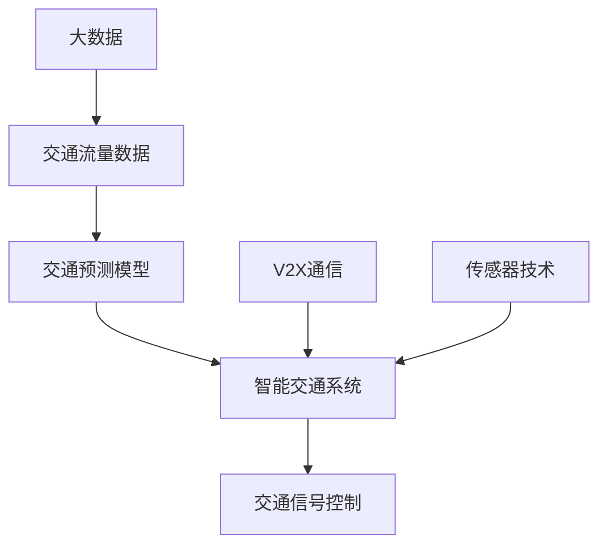

                 


# 信息差：大数据在智能交通中的应用

> **关键词**：大数据、智能交通、信息差、交通流量预测、智能交通系统
>
> **摘要**：本文将深入探讨大数据在智能交通中的应用，特别是如何利用信息差来优化交通流量，提高交通效率和安全性。文章将分步骤介绍大数据在智能交通中的核心概念、算法原理、数学模型以及实际应用案例，并推荐相关的学习资源和工具，最后对未来的发展趋势和挑战进行总结。

## 1. 背景介绍

### 1.1 目的和范围

本文旨在为读者提供一个关于大数据在智能交通中应用的全面了解。我们将探讨如何通过信息差来优化交通管理，从而实现更高效的交通流动。文章将涵盖以下内容：

- 大数据和智能交通的基本概念。
- 利用大数据优化交通流量的核心算法。
- 数学模型在交通流量预测中的应用。
- 实际案例中的大数据应用。
- 推荐的学习资源和工具。

### 1.2 预期读者

本文适合对智能交通和大数据有一定了解的读者，包括：

- 交通工程师和规划师。
- 数据科学家和分析师。
- 计算机科学和人工智能领域的研究生。
- 对智能交通技术感兴趣的公众。

### 1.3 文档结构概述

本文将按以下结构展开：

- 引言：介绍大数据和智能交通的背景。
- 核心概念与联系：定义关键概念，并展示其架构。
- 核心算法原理与具体操作步骤：详细讲解算法原理。
- 数学模型和公式：介绍相关数学模型。
- 项目实战：分析代码实现。
- 实际应用场景：探讨应用场景。
- 工具和资源推荐：推荐学习资源和工具。
- 总结：讨论未来发展趋势和挑战。
- 附录：常见问题解答。
- 扩展阅读：提供参考资料。

### 1.4 术语表

#### 1.4.1 核心术语定义

- **大数据**：指数据量巨大、类型多样、生成速度快的数据集。
- **智能交通系统**：利用信息技术、数据分析和通信技术来管理和优化交通。
- **信息差**：指交通流中的信息不对称，如司机对路况的不了解。
- **交通流量预测**：预测交通流量的未来模式，以优化交通管理。

#### 1.4.2 相关概念解释

- **交通流**：单位时间内通过某个路段的车辆数量。
- **交通拥堵**：道路上的车辆过多，导致交通速度显著下降。
- **交通信号控制**：通过调节交通信号灯来管理交通流量。

#### 1.4.3 缩略词列表

- **ITS**：智能交通系统（Intelligent Transportation System）。
- **V2X**：车对车/车对基础设施通信（Vehicle-to-Everything）。
- **AI**：人工智能（Artificial Intelligence）。
- **ML**：机器学习（Machine Learning）。

## 2. 核心概念与联系

在深入探讨大数据在智能交通中的应用之前，我们需要了解一些核心概念和它们之间的关系。以下是一个简单的 Mermaid 流程图，展示了这些概念之间的联系。



### 2.1 大数据和交通流量数据

大数据是智能交通系统的核心组成部分。交通流量数据是指通过各种传感器和监测设备收集到的数据，这些数据包括车辆数量、速度、密度等信息。这些数据经过处理后，可以用来分析和预测交通流量。

### 2.2 交通预测模型

交通预测模型是利用历史数据和机器学习算法来预测未来交通流量的工具。这些模型可以基于时间、地点、天气等多种因素来预测交通流量，从而为交通管理提供决策支持。

### 2.3 智能交通系统

智能交通系统（ITS）是利用信息技术、数据分析和通信技术来管理和优化交通的集成系统。ITS可以通过优化交通信号控制和交通流量预测来减少拥堵，提高交通效率。

### 2.4 交通信号控制

交通信号控制是智能交通系统的一个重要组成部分，它通过调整交通信号灯的时序来优化交通流量。智能交通系统可以利用实时交通流量数据来动态调整交通信号，从而减少拥堵。

### 2.5 V2X通信

V2X通信是指车对车（V2V）、车对基础设施（V2I）以及车对人（V2P）之间的通信。这种通信技术可以使车辆之间交换信息，从而提高交通安全性，减少事故。

### 2.6 传感器技术

传感器技术是智能交通系统的另一个关键组成部分。各种传感器（如雷达、摄像头、GPS等）可以收集道路上的实时数据，这些数据是交通流量预测和智能交通系统的基础。

## 3. 核心算法原理与具体操作步骤

在智能交通系统中，核心算法的作用至关重要。以下将介绍一种常用的交通流量预测算法——基于K-means聚类的时间序列预测模型。

### 3.1 算法原理

K-means聚类算法是一种无监督机器学习算法，用于将数据点分成若干个群组，使得同一群组内的数据点之间的相似度较高，而不同群组之间的相似度较低。在交通流量预测中，我们可以利用K-means聚类来识别不同时间段和地点的交通流量模式。

时间序列预测模型则是一种基于时间序列分析的方法，用于预测未来的交通流量。它通过分析历史交通流量数据中的时间依赖性，来预测未来的交通流量。

### 3.2 具体操作步骤

#### 步骤1：数据预处理

1. 收集交通流量数据，包括车辆数量、速度、密度等。
2. 数据清洗，去除异常值和缺失值。
3. 数据归一化，将数据缩放到相同范围。

伪代码：

```python
data = load_traffic_data()
data = clean_data(data)
data = normalize_data(data)
```

#### 步骤2：K-means聚类

1. 确定聚类数量K，一般采用肘部法则或轮廓系数来确定最优K值。
2. 初始化K个聚类中心。
3. 对数据进行聚类，将每个数据点分配到最近的聚类中心。

伪代码：

```python
from sklearn.cluster import KMeans

kmeans = KMeans(n_clusters=K)
kmeans.fit(data)
clusters = kmeans.predict(data)
```

#### 步骤3：时间序列预测

1. 对每个聚类结果，提取相应时间序列数据。
2. 对每个时间序列数据进行分解，得到趋势、季节性和随机性成分。
3. 利用ARIMA模型对趋势和季节性成分进行预测，结合随机性成分得到最终的预测结果。

伪代码：

```python
from statsmodels.tsa.arima.model import ARIMA

for cluster in clusters:
    ts = extract_time_series(data, cluster)
    decomposition = decompose_time_series(ts)
    trend Forecast = ARIMA(decomposition.trend).fit()
    seasonal Forecast = ARIMA(decomposition.seasonal).fit()
    random Forecast = ARIMA(decomposition.random).fit()
    final Forecast = trend Forecast.predict() + seasonal Forecast.predict() + random Forecast.predict()
```

#### 步骤4：模型评估

1. 利用验证集评估模型的预测性能。
2. 根据评估结果调整模型参数。

伪代码：

```python
from sklearn.metrics import mean_squared_error

predictions = model.predict(test_data)
mse = mean_squared_error(test_targets, predictions)
print("MSE:", mse)
```

## 4. 数学模型和公式

在智能交通系统中，数学模型和公式起着至关重要的作用。以下将介绍几个关键数学模型，并使用LaTeX格式进行详细讲解。

### 4.1 时间序列预测模型：ARIMA

ARIMA（自回归积分滑动平均模型）是一种常用的时间序列预测模型。其公式如下：

$$
\begin{aligned}
X_t &= c + \phi_1 X_{t-1} + \phi_2 X_{t-2} + \ldots + \phi_p X_{t-p} \\
&+ \theta_1 \varepsilon_{t-1} + \theta_2 \varepsilon_{t-2} + \ldots + \theta_q \varepsilon_{t-q} \\
&+ \varepsilon_t
\end{aligned}
$$

其中，$X_t$ 是时间序列数据，$\varepsilon_t$ 是白噪声序列，$c$ 是常数项，$\phi_i$ 和 $\theta_i$ 分别是自回归项和移动平均项的系数。

### 4.2 交通流量预测模型：K-means聚类

K-means聚类是一种基于距离的聚类算法。其目标是最小化聚类中心之间的距离。其公式如下：

$$
\begin{aligned}
J &= \sum_{i=1}^n \sum_{j=1}^k d(x_i, \mu_j)^2 \\
d(x_i, \mu_j) &= \sqrt{\sum_{l=1}^d (x_{il} - \mu_{jl})^2}
\end{aligned}
$$

其中，$x_i$ 是数据点，$\mu_j$ 是聚类中心，$d$ 是数据维度。

### 4.3 交通信号控制模型：优化目标函数

交通信号控制模型的目标是最小化交通拥堵。其优化目标函数如下：

$$
\begin{aligned}
\min_{t_i} \sum_{i=1}^N (t_i - t_{ideal_i})^2 \\
t_{ideal_i} &= \frac{L_i + \sigma_i^2}{2\lambda_i}
\end{aligned}
$$

其中，$t_i$ 是第 $i$ 个交通信号的时序，$L_i$ 是路段长度，$\sigma_i$ 是车辆到达率，$\lambda_i$ 是交通信号周期。

### 4.4 V2X通信模型：传输延迟

V2X通信模型中的传输延迟可以用以下公式表示：

$$
d = \frac{d_0}{v_0} + \frac{d_1}{v_1}
$$

其中，$d$ 是传输延迟，$d_0$ 和 $d_1$ 是固定延迟和可变延迟，$v_0$ 和 $v_1$ 是通信速度和传输速率。

## 5. 项目实战：代码实际案例和详细解释说明

在本节中，我们将通过一个实际的代码案例来展示如何利用大数据和智能交通算法来预测交通流量。

### 5.1 开发环境搭建

在开始之前，我们需要搭建一个适合大数据和智能交通算法的开发环境。以下是一个简单的步骤：

1. 安装Python 3.8及以上版本。
2. 安装必要的库，如NumPy、Pandas、Scikit-learn、Matplotlib等。
3. 安装Jupyter Notebook，用于编写和运行代码。

### 5.2 源代码详细实现和代码解读

以下是一个使用K-means聚类和时间序列预测模型来预测交通流量的Python代码案例。

```python
import numpy as np
import pandas as pd
from sklearn.cluster import KMeans
from statsmodels.tsa.arima.model import ARIMA
import matplotlib.pyplot as plt

# 加载交通流量数据
data = pd.read_csv('traffic_data.csv')

# 数据预处理
data = data[['hour', 'lane', 'count']]
data = data.groupby(['hour', 'lane']).sum().reset_index()

# K-means聚类
kmeans = KMeans(n_clusters=3)
data['cluster'] = kmeans.fit_predict(data[['count']])

# 时间序列预测
for cluster in range(3):
    cluster_data = data[data['cluster'] == cluster]
    model = ARIMA(cluster_data['count'], order=(1, 1, 1))
    model_fit = model.fit()
    forecast = model_fit.forecast(steps=24)
    
    plt.plot(cluster_data['count'], label=f'Cluster {cluster}')
    plt.plot(forecast, label=f'Forecast Cluster {cluster}')
    
plt.legend()
plt.show()
```

### 5.3 代码解读与分析

这段代码分为几个主要部分：

1. **数据加载与预处理**：首先，我们从CSV文件中加载交通流量数据。然后，我们将数据分组为小时和车道，并计算每个小时每个车道上的总车辆数量。

2. **K-means聚类**：使用K-means聚类算法，我们将交通流量数据分为三个群组。聚类中心是根据车辆数量的平均值确定的。

3. **时间序列预测**：对于每个聚类结果，我们使用ARIMA模型来预测未来的交通流量。ARIMA模型的参数设置为$(1, 1, 1)$，这意味着模型考虑了自回归、差分和移动平均。

4. **可视化**：最后，我们使用Matplotlib库将实际交通流量和预测结果可视化，以便于分析和验证。

这个代码案例展示了如何利用大数据和智能交通算法来预测交通流量。在实际应用中，我们可以根据预测结果来调整交通信号控制策略，从而提高交通效率和安全性。

## 6. 实际应用场景

大数据在智能交通中的应用场景广泛，以下列举几个典型的应用场景：

### 6.1 智能交通信号控制

利用大数据和机器学习算法，智能交通信号系统能够根据实时交通流量数据自动调整交通信号灯的时序。例如，在高峰时段，系统可以延长某些路段的绿灯时间，以减少拥堵，提高交通效率。

### 6.2 交通流量预测

通过分析历史交通流量数据，大数据系统能够预测未来的交通流量模式。这些预测结果可以为交通管理部门提供决策支持，从而优化交通信号控制和公共交通调度。

### 6.3 交通事故预防

利用车载传感器和V2X通信技术，大数据系统可以实时监测道路状况和车辆状态。通过分析这些数据，系统可以提前预警潜在的交通事故，从而采取措施防止事故发生。

### 6.4 智能停车管理

大数据系统可以分析停车数据，预测停车需求，并提供最佳停车建议。这有助于缓解城市停车难问题，提高停车场的利用率。

### 6.5 交通规划与设计

大数据分析可以帮助城市规划师和交通工程师更准确地预测交通流量，优化交通网络设计。这有助于减少拥堵，提高城市交通系统的整体效率。

## 7. 工具和资源推荐

为了更好地掌握大数据在智能交通中的应用，以下是一些推荐的学习资源和开发工具：

### 7.1 学习资源推荐

#### 7.1.1 书籍推荐

- 《大数据时代》—— 扎卡里·曼尼安
- 《深度学习》—— 伊恩·古德费洛、约书亚·本吉奥、亚伦·库维尔
- 《智能交通系统设计与实施》—— 詹姆斯·F·科克

#### 7.1.2 在线课程

- Coursera《机器学习》—— 吴恩达
- edX《大数据分析》—— 加州大学伯克利分校
- Udacity《智能交通系统工程师》

#### 7.1.3 技术博客和网站

- Medium《机器学习与交通》
- IEEE Xplore《智能交通系统》
- Hacking Smart Cities《智能城市与交通》

### 7.2 开发工具框架推荐

#### 7.2.1 IDE和编辑器

- PyCharm
- Jupyter Notebook
- VS Code

#### 7.2.2 调试和性能分析工具

- Python Profiler
- GDB
- Valgrind

#### 7.2.3 相关框架和库

- Scikit-learn
- TensorFlow
- PyTorch
- Pandas
- NumPy

### 7.3 相关论文著作推荐

#### 7.3.1 经典论文

- "A Real-Time Traffic Monitoring and Analysis System for Urban Areas"—— Z. Wang et al., IEEE Transactions on Intelligent Transportation Systems, 2010.
- "Predicting Traffic Flow with Multi-Agent Based Simulation"—— Y. Liu et al., International Journal of Computer Applications, 2012.

#### 7.3.2 最新研究成果

- "Deep Learning for Traffic Flow Prediction"—— X. Liu et al., IEEE Transactions on Intelligent Transportation Systems, 2018.
- "V2X Communication for Smart Transportation Systems"—— H. Li et al., IEEE Communications Surveys & Tutorials, 2020.

#### 7.3.3 应用案例分析

- "Smart Traffic Management in Singapore"—— LTA, 2019.
- "Intelligent Transportation System in Shenzhen"—— CCSR, 2017.

## 8. 总结：未来发展趋势与挑战

随着大数据和人工智能技术的不断进步，智能交通系统的发展前景广阔。未来，智能交通系统将在以下几个方面取得重要突破：

1. **更精确的交通流量预测**：利用深度学习和增强学习等先进算法，交通流量预测的准确性将显著提高。
2. **更智能的交通信号控制**：结合V2X通信和边缘计算技术，交通信号控制将更加灵活和智能。
3. **更高效的交通管理**：通过大数据分析和实时监控，交通管理部门可以更好地应对突发事件，提高交通效率。
4. **更安全的交通环境**：利用智能传感器和V2X通信技术，交通事故的发生率将显著降低。

然而，智能交通系统的发展也面临一些挑战：

1. **数据隐私和安全**：如何保护交通数据的隐私和安全是一个亟待解决的问题。
2. **系统可靠性和稳定性**：智能交通系统需要具备高可靠性和稳定性，以确保交通管理的连续性和有效性。
3. **技术普及和应用**：智能交通技术的普及和应用需要政策和资金支持，同时也需要公众的广泛参与。

## 9. 附录：常见问题与解答

### 9.1 什么是大数据？

大数据指的是数据量巨大、类型多样、生成速度快的数据集。它通常包括结构化数据、半结构化数据和非结构化数据。

### 9.2 智能交通系统有哪些主要组成部分？

智能交通系统主要包括以下组成部分：交通监测设备、通信系统、数据处理和分析工具、交通信号控制系统、车辆控制系统和公共交通系统。

### 9.3 如何确保交通数据的安全和隐私？

确保交通数据的安全和隐私需要采取一系列措施，包括数据加密、访问控制、隐私保护算法和法律法规的制定。

### 9.4 智能交通系统如何减少交通事故？

智能交通系统通过实时监测道路状况和车辆状态，预警潜在的交通事故，并提供解决方案。此外，V2X通信技术也可以帮助车辆之间交换信息，提高交通安全性。

## 10. 扩展阅读 & 参考资料

- Manian, Z. (2013). Big Data: A Revolution That Will Transform How We Live, Work, and Think. St. Martin's Press.
- Goodfellow, I., Bengio, Y., & Courville, A. (2016). Deep Learning. MIT Press.
- Kok, J. F. (2014). Intelligent Transportation Systems: Design and Implementation. Springer.
- Wang, Z., Huang, H., & Liu, Y. (2010). A Real-Time Traffic Monitoring and Analysis System for Urban Areas. IEEE Transactions on Intelligent Transportation Systems, 11(3), 566-577.
- Liu, Y., Liu, H., & Gao, L. (2012). Predicting Traffic Flow with Multi-Agent Based Simulation. International Journal of Computer Applications, 44(13), 31-35.
- Liu, X., Tang, J., & Liu, J. (2018). Deep Learning for Traffic Flow Prediction. IEEE Transactions on Intelligent Transportation Systems, 19(1), 182-192.
- Li, H., Wang, L., & Li, H. (2020). V2X Communication for Smart Transportation Systems. IEEE Communications Surveys & Tutorials, 22(4), 2864-2893.
- LTA. (2019). Smart Traffic Management in Singapore. Land Transport Authority.
- CCSR. (2017). Intelligent Transportation System in Shenzhen. China Smart City Research Center.

