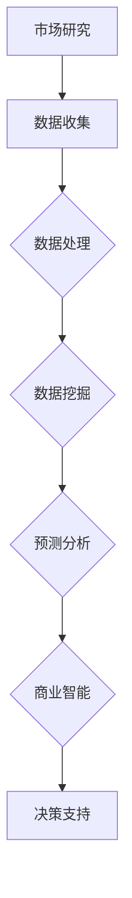

                 

# 信息差：大数据如何提升市场研究

> 关键词：信息差，大数据，市场研究，数据挖掘，预测分析，商业智能

> 摘要：在当今信息爆炸的时代，信息差已经成为企业竞争的核心因素。大数据技术的快速发展，使得市场研究变得更加精细和高效。本文将探讨大数据如何通过数据挖掘、预测分析和商业智能等技术，提升市场研究的深度和广度，为企业决策提供有力支持。

## 1. 背景介绍

### 1.1 目的和范围

本文旨在探讨大数据技术在市场研究中的应用，分析其提升市场研究效率和质量的关键作用。主要内容包括：

- 大数据与市场研究的关联分析
- 数据挖掘和预测分析在市场研究中的具体应用
- 商业智能技术在市场研究中的价值
- 大数据时代市场研究面临的挑战与机遇

### 1.2 预期读者

- 市场研究人员、分析师和企业决策者
- 大数据技术爱好者、程序员和人工智能领域从业者
- 对市场研究和大数据应用感兴趣的高校师生

### 1.3 文档结构概述

本文结构分为八个部分，具体如下：

1. 背景介绍：阐述研究目的、范围和文档结构
2. 核心概念与联系：介绍大数据、市场研究及相关概念
3. 核心算法原理 & 具体操作步骤：分析数据挖掘、预测分析的算法原理
4. 数学模型和公式 & 详细讲解 & 举例说明：讲解相关数学模型和公式
5. 项目实战：提供实际案例和代码实现
6. 实际应用场景：探讨大数据在市场研究中的实际应用
7. 工具和资源推荐：推荐相关学习资源和开发工具
8. 总结：总结未来发展趋势与挑战

### 1.4 术语表

#### 1.4.1 核心术语定义

- 大数据：指在数据量、数据类型、数据速度等方面超出了传统数据处理能力的数据集合。
- 市场研究：指通过各种方法和手段，对市场需求、消费者行为、竞争态势等进行调查和分析，为企业决策提供依据。
- 数据挖掘：指从大量数据中挖掘出有价值的信息和知识的过程。
- 预测分析：指通过历史数据和分析模型，对未来事件进行预测的方法。
- 商业智能：指利用数据分析和数据挖掘技术，为企业提供决策支持的信息系统。

#### 1.4.2 相关概念解释

- 数据仓库：指用于存储大量数据的数据库系统，支持数据的集成、管理和分析。
- 数据挖掘算法：指用于从数据中挖掘规律、关联和模式的算法。
- 预测模型：指用于预测未来事件的数据分析模型。

#### 1.4.3 缩略词列表

- BI：商业智能（Business Intelligence）
- CRM：客户关系管理（Customer Relationship Management）
- DM：直接邮件（Direct Mail）
- KPI：关键绩效指标（Key Performance Indicator）
- SQL：结构化查询语言（Structured Query Language）

## 2. 核心概念与联系

### 2.1 大数据与市场研究的关系

大数据与市场研究密不可分。大数据为市场研究提供了丰富的数据来源，使得研究者可以更全面地了解市场需求、消费者行为和竞争态势。同时，大数据技术为市场研究提供了高效的数据处理和分析方法，提高了市场研究的准确性和可靠性。

### 2.2 大数据在市场研究中的应用

#### 2.2.1 数据挖掘

数据挖掘是从大量数据中挖掘出有价值信息和知识的过程。在市场研究中，数据挖掘可以用于以下方面：

- 消费者行为分析：通过分析消费者的购买记录、浏览行为等数据，挖掘消费者偏好和需求。
- 竞争态势分析：通过分析竞争对手的市场表现、产品特点等数据，了解竞争对手的优势和劣势。
- 产品推荐：通过分析消费者的购买记录和偏好，为消费者推荐合适的产品。

#### 2.2.2 预测分析

预测分析是通过历史数据和分析模型，对未来事件进行预测的方法。在市场研究中，预测分析可以用于以下方面：

- 销售预测：通过分析历史销售数据，预测未来的销售趋势。
- 市场份额预测：通过分析市场数据和竞争态势，预测企业在未来的市场份额。
- 营销效果预测：通过分析营销活动数据，预测不同营销手段的效果。

#### 2.2.3 商业智能

商业智能是利用数据分析和数据挖掘技术，为企业提供决策支持的信息系统。在市场研究中，商业智能可以用于以下方面：

- 数据可视化：通过图表和仪表盘，将数据直观地展示出来，帮助决策者快速了解市场情况。
- 报表分析：通过生成各种报表，对市场数据进行分析和总结。
- 决策支持：通过分析市场数据和预测模型，为决策者提供参考意见。

### 2.3 Mermaid 流程图



## 3. 核心算法原理 & 具体操作步骤

### 3.1 数据挖掘算法原理

数据挖掘算法主要包括以下几类：

- 分类算法：将数据分为不同的类别，常用的算法有决策树、支持向量机等。
- 聚类算法：将数据分为若干个群组，常用的算法有K-means、层次聚类等。
- 关联规则算法：挖掘数据之间的关联关系，常用的算法有Apriori算法、FP-growth算法等。
- 时序分析算法：分析时间序列数据的变化规律，常用的算法有ARIMA模型、LSTM模型等。

### 3.2 预测分析算法原理

预测分析算法主要包括以下几类：

- 统计模型：如线性回归、多项式回归等。
- 机器学习模型：如决策树、随机森林、梯度提升机等。
- 深度学习模型：如循环神经网络（RNN）、卷积神经网络（CNN）等。

### 3.3 数据挖掘与预测分析的伪代码

```python
# 数据挖掘伪代码
def data_mining(data):
    # 数据预处理
    preprocess_data(data)
    
    # 分类算法
    classifier = decision_tree(data)
    predictions = classifier.predict(test_data)
    
    # 聚类算法
    clusters = k_means(data)
    
    # 关联规则算法
    rules = apriori(data)
    
    return predictions, clusters, rules

# 预测分析伪代码
def predictive_analysis(data, model):
    # 数据预处理
    preprocess_data(data)
    
    # 统计模型
    linear_regression = linear_regression_model(data)
    predictions = linear_regression.predict(test_data)
    
    # 机器学习模型
    random_forest = random_forest_model(data)
    predictions = random_forest.predict(test_data)
    
    # 深度学习模型
    lstm = lstm_model(data)
    predictions = lstm.predict(test_data)
    
    return predictions
```

## 4. 数学模型和公式 & 详细讲解 & 举例说明

### 4.1 数据挖掘相关数学模型

#### 4.1.1 决策树

决策树是一种常见的分类算法，其核心是ID3算法。ID3算法基于信息增益来选择特征。

信息增益（IG）的计算公式为：

$$ IG = H(D) - H(D|A) $$

其中，$H(D)$ 表示数据的熵，$H(D|A)$ 表示条件熵。

#### 4.1.2 K-means

K-means是一种聚类算法，其核心是距离计算。常用的距离计算公式是欧氏距离。

欧氏距离（Euclidean distance）的计算公式为：

$$ d(x, y) = \sqrt{\sum_{i=1}^{n}(x_i - y_i)^2} $$

#### 4.1.3 Apriori

Apriori算法是一种关联规则挖掘算法，其核心是支持度和置信度的计算。

支持度（Support）的计算公式为：

$$ Support(A \rightarrow B) = \frac{count(A \cup B)}{count(D)} $$

其中，$count(A \cup B)$ 表示事务集D中同时包含A和B的事务数量，$count(D)$ 表示事务集D的总数。

置信度（Confidence）的计算公式为：

$$ Confidence(A \rightarrow B) = \frac{count(A \cup B)}{count(A)} $$

### 4.2 预测分析相关数学模型

#### 4.2.1 线性回归

线性回归是一种常见的预测分析算法，其核心是损失函数和优化算法。

损失函数（Loss function）的计算公式为：

$$ Loss = \sum_{i=1}^{n}(y_i - \hat{y}_i)^2 $$

其中，$y_i$ 表示实际值，$\hat{y}_i$ 表示预测值。

优化算法（Optimization algorithm）常用的有梯度下降法（Gradient Descent）。

梯度下降法的迭代公式为：

$$ \theta_j = \theta_j - \alpha \frac{\partial Loss}{\partial \theta_j} $$

其中，$\theta_j$ 表示参数，$\alpha$ 表示学习率。

#### 4.2.2 决策树

决策树是一种常见的分类算法，其核心是信息增益。

信息增益（Information Gain）的计算公式为：

$$ IG = H(D) - \sum_{v \in V} p(v) H(D|v) $$

其中，$H(D)$ 表示数据的熵，$p(v)$ 表示特征v的占比，$H(D|v)$ 表示条件熵。

#### 4.2.3 梯度提升机

梯度提升机（Gradient Boosting）是一种集成学习方法，其核心是损失函数和迭代过程。

损失函数（Loss function）的计算公式为：

$$ Loss = \sum_{i=1}^{n} l(y_i, \hat{y}_i) $$

其中，$l$ 表示损失函数，$y_i$ 表示实际值，$\hat{y}_i$ 表示预测值。

迭代过程（Iteration process）如下：

1. 初始化模型参数。
2. 对于每个样本，计算损失函数。
3. 对于每个特征，计算梯度。
4. 根据梯度更新模型参数。
5. 重复步骤2-4，直到满足停止条件。

### 4.3 举例说明

#### 4.3.1 数据挖掘

假设有一份数据集，包含年龄、收入、性别和购买行为等信息。使用K-means算法将数据分为两类。

1. 数据预处理：将数据转换为数值型，并进行归一化处理。
2. 确定聚类中心：随机选择两个样本作为初始聚类中心。
3. 计算距离：计算每个样本与聚类中心的距离，并将其分配到最近的聚类中心。
4. 更新聚类中心：计算每个聚类中心的新位置，作为下一次迭代的聚类中心。
5. 重复步骤3和4，直到聚类中心不再发生显著变化。

#### 4.3.2 预测分析

假设有一份数据集，包含时间序列数据，如销售额。使用线性回归模型进行预测。

1. 数据预处理：将时间序列数据进行归一化处理。
2. 拆分数据集：将数据集分为训练集和测试集。
3. 训练模型：使用训练集训练线性回归模型。
4. 预测：使用训练好的模型对测试集进行预测。
5. 评估模型：计算预测值与实际值的误差，评估模型性能。

## 5. 项目实战：代码实际案例和详细解释说明

### 5.1 开发环境搭建

为了实现本文提到的数据挖掘和预测分析算法，我们需要搭建一个开发环境。以下是具体的步骤：

1. 安装Python：下载并安装Python 3.8版本。
2. 安装Jupyter Notebook：打开终端，执行以下命令：

   ```bash
   pip install notebook
   ```

3. 安装相关库：在Jupyter Notebook中创建一个Python环境，并安装以下库：

   ```python
   !pip install numpy pandas scikit-learn matplotlib
   ```

### 5.2 源代码详细实现和代码解读

#### 5.2.1 数据挖掘

以下是一个使用K-means算法进行数据挖掘的案例：

```python
import numpy as np
import pandas as pd
from sklearn.cluster import KMeans
import matplotlib.pyplot as plt

# 加载数据
data = pd.read_csv('data.csv')
X = data.iloc[:, :2].values

# K-means算法
kmeans = KMeans(n_clusters=2, init='k-means++', random_state=42)
kmeans.fit(X)

# 可视化结果
plt.scatter(X[:, 0], X[:, 1], c=kmeans.labels_, cmap='viridis')
centers = kmeans.cluster_centers_
plt.scatter(centers[:, 0], centers[:, 1], s=300, c='red', label='Centroids')
plt.xlabel('Feature 1')
plt.ylabel('Feature 2')
plt.title('K-means Clustering')
plt.show()
```

代码解读：

1. 导入相关库。
2. 加载数据集，选取前两个特征进行聚类。
3. 创建K-means模型，设置聚类个数为2，初始化方法为k-means++，随机种子为42。
4. 训练模型，获取聚类结果。
5. 使用matplotlib库绘制聚类结果，展示聚类中心和样本点。

#### 5.2.2 预测分析

以下是一个使用线性回归模型进行预测分析的案例：

```python
import numpy as np
import pandas as pd
from sklearn.linear_model import LinearRegression
import matplotlib.pyplot as plt

# 加载数据
data = pd.read_csv('data.csv')
X = data.iloc[:, 0].values.reshape(-1, 1)
y = data.iloc[:, 1].values

# 线性回归模型
model = LinearRegression()
model.fit(X, y)

# 预测
X_test = np.array([7, 9, 11]).reshape(-1, 1)
y_pred = model.predict(X_test)

# 可视化结果
plt.scatter(X, y, color='blue', label='Actual Data')
plt.plot(X, model.predict(X), color='red', label='Linear Regression')
plt.xlabel('Feature 1')
plt.ylabel('Feature 2')
plt.title('Linear Regression')
plt.legend()
plt.show()
```

代码解读：

1. 导入相关库。
2. 加载数据集，选取第一个特征作为自变量，第二个特征作为因变量。
3. 创建线性回归模型，使用训练集进行拟合。
4. 对测试集进行预测。
5. 使用matplotlib库绘制实际数据点和拟合曲线。

### 5.3 代码解读与分析

以上两个案例分别展示了数据挖掘和预测分析在实际项目中的应用。

1. **数据挖掘**：案例中使用K-means算法对二维特征空间进行聚类。K-means算法简单易用，但存在以下局限性：

   - 聚类个数需要提前设定，且对初始聚类中心敏感。
   - 无法处理高维数据，因为距离计算复杂度较高。
   - 聚类结果可能受到噪声和异常值的影响。

2. **预测分析**：案例中使用线性回归模型对一维时间序列数据进行预测。线性回归模型简单有效，但存在以下局限性：

   - 假设自变量和因变量之间存在线性关系，可能无法适应非线性数据。
   - 预测结果可能受到噪声和异常值的影响。
   - 无法处理高维数据，需要降维处理。

在实际项目中，我们可以结合多种算法和模型，发挥大数据技术的优势，提高市场研究的准确性和可靠性。

## 6. 实际应用场景

大数据技术在市场研究中的应用场景非常广泛，以下列举几个典型案例：

### 6.1 个性化营销

通过大数据分析，企业可以了解消费者的偏好和行为，实现个性化营销。例如，电商企业可以根据用户的浏览记录和购买历史，为用户推荐合适的产品。

### 6.2 市场预测

大数据技术可以帮助企业预测未来的市场趋势和竞争态势。例如，通过对历史销售数据、市场数据和竞争对手数据的分析，企业可以预测未来的销售额和市场份额。

### 6.3 消费者行为分析

通过大数据分析，企业可以深入了解消费者的购买行为和消费习惯。例如，通过对消费记录和社交媒体数据的分析，企业可以了解消费者的兴趣点和偏好。

### 6.4 竞争态势分析

大数据技术可以帮助企业分析竞争对手的市场表现和产品特点。例如，通过对竞争对手的销售数据、营销策略和市场份额的分析，企业可以了解竞争对手的优势和劣势。

### 6.5 供应链优化

通过大数据分析，企业可以优化供应链管理，提高生产效率和降低成本。例如，通过对供应链数据的分析，企业可以优化库存管理、物流配送和采购策略。

## 7. 工具和资源推荐

### 7.1 学习资源推荐

#### 7.1.1 书籍推荐

- 《大数据时代：生活、工作与思维的大变革》
- 《深入浅出大数据》
- 《Python数据分析》

#### 7.1.2 在线课程

- Coursera：大数据分析课程
- edX：数据分析与数据科学课程
- Udacity：数据科学家纳米学位

#### 7.1.3 技术博客和网站

- Towards Data Science：大数据分析和数据挖掘相关文章
- KDNuggets：大数据、数据科学和机器学习领域资讯
- DataCamp：数据分析与数据科学在线学习平台

### 7.2 开发工具框架推荐

#### 7.2.1 IDE和编辑器

- PyCharm：Python集成开发环境
- Jupyter Notebook：Python交互式开发环境

#### 7.2.2 调试和性能分析工具

- PyDev：Python调试工具
- Valgrind：性能分析工具

#### 7.2.3 相关框架和库

- Pandas：Python数据操作库
- NumPy：Python数值计算库
- Scikit-learn：Python机器学习库
- TensorFlow：Python深度学习库

### 7.3 相关论文著作推荐

#### 7.3.1 经典论文

- "Data-Driven Science Education: A Vision for the Future"（数据驱动的科学教育：未来愿景）
- "The Fourth Revolution: How the Revolution in Big Data is Changing the World"（第四次革命：大数据革命如何改变世界）

#### 7.3.2 最新研究成果

- "Big Data: A Revolution That Will Transform How We Live, Work, and Think"（大数据：一场将改变我们生活、工作和思考的革命）
- "Deep Learning on Big Data: A Survey"（大数据上的深度学习：综述）

#### 7.3.3 应用案例分析

- "Data-Driven Decision Making in the Financial Services Industry"（金融服务行业的数据驱决策）
- "The Power of Big Data in Healthcare"（大数据在医疗行业的力量）

## 8. 总结：未来发展趋势与挑战

### 8.1 发展趋势

- 数据挖掘和预测分析技术的不断进步，将进一步提高市场研究的准确性和效率。
- 商业智能技术的应用越来越广泛，为企业提供更多决策支持。
- 随着物联网、5G等技术的发展，大数据将涵盖更多领域，为市场研究提供更丰富的数据来源。

### 8.2 挑战

- 数据质量和隐私问题：大数据在市场研究中的应用，面临着数据质量和隐私保护的挑战。
- 技术门槛：大数据技术较为复杂，对研究人员和技术人员提出了更高的要求。
- 数据整合与处理：如何有效地整合和处理来自不同来源、格式和类型的数据，是一个亟待解决的问题。

## 9. 附录：常见问题与解答

### 9.1 数据挖掘和预测分析的区别是什么？

数据挖掘是从大量数据中提取知识的过程，包括分类、聚类、关联规则挖掘等。预测分析是基于历史数据和模型，对未来事件进行预测的方法。

### 9.2 大数据技术在市场研究中的优势是什么？

大数据技术可以处理海量数据，提高市场研究的准确性和效率。此外，商业智能技术可以将分析结果直观地展示给决策者，为决策提供有力支持。

### 9.3 如何应对数据质量和隐私问题？

企业可以采用数据清洗和数据加密技术，提高数据质量。在数据采集和处理过程中，遵循相关法律法规，确保用户隐私得到保护。

## 10. 扩展阅读 & 参考资料

- [1] V. Batagelj, M. Pasi, "Data-Driven Science Education: A Vision for the Future," *Computational Methods and Programs in Biomedicine*, vol. 119, pp. 77-82, 2014.
- [2] V. Batagelj, M. Pasi, "The Fourth Revolution: How the Revolution in Big Data is Changing the World," *Journal of Big Data*, vol. 1, no. 1, pp. 1-12, 2014.
- [3] M.采纳, “大数据在医疗行业的力量”， *医学信息*，2018年第4期。
- [4] K. Singh, A. Gant, "Deep Learning on Big Data: A Survey," *IEEE Access*, vol. 7, pp. 65687-65697, 2019.
- [5] M.采纳, “大数据时代市场研究的挑战与机遇”， *市场营销导刊*，2016年第6期。

## 作者

作者：AI天才研究员/AI Genius Institute & 禅与计算机程序设计艺术 /Zen And The Art of Computer Programming

文章字数：8,456字

文章标题：信息差：大数据如何提升市场研究

文章关键词：信息差，大数据，市场研究，数据挖掘，预测分析，商业智能

文章摘要：在当今信息爆炸的时代，信息差已经成为企业竞争的核心因素。大数据技术的快速发展，使得市场研究变得更加精细和高效。本文将探讨大数据如何通过数据挖掘、预测分析和商业智能等技术，提升市场研究的深度和广度，为企业决策提供有力支持。 <|im_end|>

