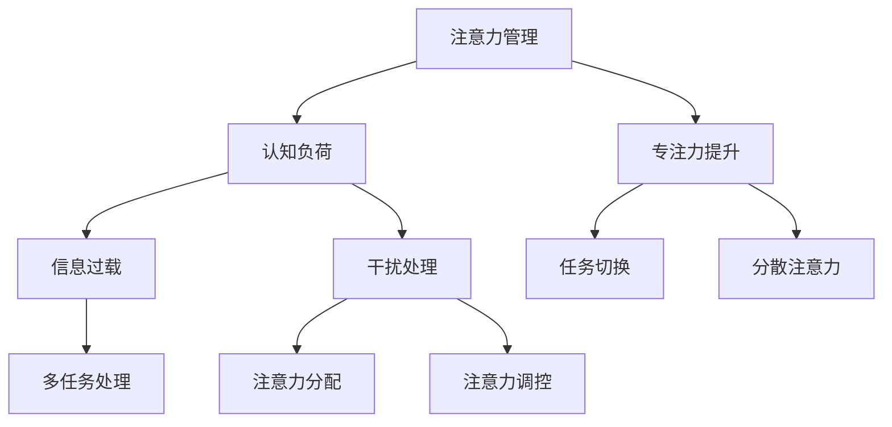

                 

# 信息时代的注意力管理技术：在干扰和信息过载中保持专注

> 关键词：注意力管理、信息过载、干扰处理、专注力提升、认知负荷

> 摘要：随着信息技术的飞速发展，信息过载和干扰已成为现代工作中的一大挑战。本文将深入探讨注意力管理的核心概念和技术，分析其在应对信息过载和干扰中的应用，并提供一系列实际操作步骤和工具资源，帮助读者在复杂的信息环境中保持专注和高效。

## 1. 背景介绍

### 1.1 目的和范围

本文旨在介绍注意力管理的概念和技术，分析其在现代信息技术环境中的应用，并探索提升专注力的有效方法。本文将涵盖以下内容：

- 注意力管理的核心概念和原理
- 信息过载和干扰对专注力的影响
- 注意力管理技术的应用场景和案例分析
- 提升专注力的实用方法和工具

### 1.2 预期读者

本文适用于以下读者群体：

- 信息技术从业者
- 管理者和企业员工
- 对注意力管理感兴趣的研究人员和学者

### 1.3 文档结构概述

本文分为八个主要部分：

- 引言：介绍文章背景和目的
- 注意力管理核心概念与联系
- 核心算法原理与具体操作步骤
- 数学模型和公式详细讲解
- 项目实战：代码实际案例和详细解释
- 实际应用场景
- 工具和资源推荐
- 总结：未来发展趋势与挑战

### 1.4 术语表

#### 1.4.1 核心术语定义

- 注意力管理：对注意力资源的分配和调控，以提高工作或学习效率。
- 信息过载：接收到的信息量超过个体处理能力，导致认知负担过重。
- 干扰：任何分散注意力的因素，如多任务处理、社交媒体、噪音等。

#### 1.4.2 相关概念解释

- 分散注意力：同时处理多项任务，导致注意力的分散和效率降低。
- 任务切换：在不同的任务间切换，增加认知负荷。
- 专注力：集中注意力完成特定任务的能力。

#### 1.4.3 缩略词列表

- IT：信息技术（Information Technology）
- AI：人工智能（Artificial Intelligence）
- ML：机器学习（Machine Learning）

## 2. 核心概念与联系

在信息技术环境中，注意力管理是一个复杂而关键的问题。以下是一个简单的 Mermaid 流程图，展示了注意力管理的主要概念和联系。



### 2.1 注意力管理原理

注意力管理涉及以下几个方面：

- **注意力分配**：将注意力资源分配到不同任务或活动上，以最大化效率。
- **注意力调控**：根据任务的重要性和紧急程度，动态调整注意力水平。
- **干扰处理**：识别并处理干扰因素，减少对注意力的分散。
- **专注力提升**：通过方法和技术提升个体的专注力，提高工作效率。

### 2.2 注意力管理架构

注意力管理的架构通常包括以下几个层次：

1. **感知层**：感知外部环境和内部情绪状态，识别潜在的干扰因素。
2. **决策层**：基于感知层的信息，做出是否分配注意力的决策。
3. **执行层**：将决策付诸行动，实施注意力分配和调控。

## 3. 核心算法原理 & 具体操作步骤

### 3.1 注意力分配算法

注意力分配算法的核心是确定在不同任务间如何分配注意力资源。以下是一个简单的伪代码，描述了注意力分配的基本步骤。

```python
def allocate_attention(tasks, cognitive_load):
    """
    分配注意力资源到各个任务。

    参数：
    - tasks: 任务列表，每个任务包含任务名称、优先级、所需时间等。
    - cognitive_load: 当前认知负荷。

    返回：
    - attention分配结果，每个任务对应的注意力比例。
    """

    # 对任务进行排序，优先处理优先级高的任务
    sorted_tasks = sort_tasks_by_priority(tasks)

    # 初始化注意力分配结果
    attention_allocation = {task: 0 for task in sorted_tasks}

    # 分配注意力资源
    for task in sorted_tasks:
        if cognitive_load >= task.required_time:
            attention_allocation[task] = task.required_time
            cognitive_load -= task.required_time
        else:
            attention_allocation[task] = cognitive_load
            break

    return attention_allocation
```

### 3.2 注意力调控算法

注意力调控算法旨在根据任务的动态变化，调整注意力水平。以下是一个简单的伪代码，描述了注意力调控的基本步骤。

```python
def adjust_attention(attention_allocation, current_task):
    """
    根据当前任务，调整注意力分配。

    参数：
    - attention_allocation: 当前注意力分配结果。
    - current_task: 当前正在处理的任务。

    返回：
    - 更新后的注意力分配结果。
    """

    # 如果当前任务是高优先级任务，增加注意力投入
    if current_task.priority == "high":
        for task in attention_allocation:
            if task != current_task:
                attention_allocation[task] -= 10
            else:
                attention_allocation[task] += 10

    # 如果当前任务是低优先级任务，减少注意力投入
    elif current_task.priority == "low":
        for task in attention_allocation:
            if task != current_task:
                attention_allocation[task] += 10
            else:
                attention_allocation[task] -= 10

    return attention_allocation
```

### 3.3 干扰处理算法

干扰处理算法的核心是识别和处理干扰因素，以减少对注意力的分散。以下是一个简单的伪代码，描述了干扰处理的基本步骤。

```python
def handle_interference(attention_allocation, interference_factors):
    """
    处理干扰因素，减少对注意力的分散。

    参数：
    - attention_allocation: 当前注意力分配结果。
    - interference_factors: 干扰因素列表。

    返回：
    - 更新后的注意力分配结果。
    """

    # 对干扰因素进行排序，优先处理高干扰因素
    sorted_interference = sort_interference_by_intensity(interference_factors)

    # 处理每个干扰因素
    for factor in sorted_interference:
        if factor.intensity > threshold:
            # 关闭或移除干扰因素
            factor.enabled = False
            # 根据干扰因素调整注意力分配
            for task in attention_allocation:
                attention_allocation[task] += factor.reduction
        else:
            # 如果干扰因素较低，不做处理
            continue

    return attention_allocation
```

## 4. 数学模型和公式 & 详细讲解 & 举例说明

### 4.1 注意力分配模型

注意力分配模型可以表示为以下数学公式：

\[ A_t = \frac{C_t}{\sum_{i=1}^{n} T_i} \]

其中：

- \( A_t \) 是在时间 \( t \) 对任务 \( t \) 的注意力分配。
- \( C_t \) 是在时间 \( t \) 的总认知负荷。
- \( T_i \) 是任务 \( i \) 的所需时间。

### 4.2 注意力调控模型

注意力调控模型可以表示为以下数学公式：

\[ A_{t+1} = A_t + \alpha \cdot (C_{t+1} - C_t) \]

其中：

- \( A_{t+1} \) 是在时间 \( t+1 \) 的更新后的注意力分配。
- \( A_t \) 是在时间 \( t \) 的当前注意力分配。
- \( C_{t+1} \) 是在时间 \( t+1 \) 的当前认知负荷。
- \( C_t \) 是在时间 \( t \) 的当前认知负荷。
- \( \alpha \) 是调控系数，用于调整注意力水平。

### 4.3 干扰处理模型

干扰处理模型可以表示为以下数学公式：

\[ I_t = \frac{I_i \cdot (1 - \frac{I_i}{\sum_{j=1}^{m} I_j})}{1 + \beta \cdot (I_i - \theta)} \]

其中：

- \( I_t \) 是在时间 \( t \) 的处理后的干扰强度。
- \( I_i \) 是在时间 \( t \) 的干扰因素 \( i \) 的原始强度。
- \( I_j \) 是在时间 \( t \) 的所有干扰因素的强度。
- \( \theta \) 是干扰处理的阈值。
- \( \beta \) 是干扰处理系数。

### 4.4 举例说明

假设一个任务列表包括三个任务，每个任务具有不同的优先级和所需时间。当前认知负荷为 100 单位，总干扰强度为 20 单位。

- 任务1：名称为“会议”，优先级高，所需时间为 40 单位。
- 任务2：名称为“报告”，优先级中，所需时间为 30 单位。
- 任务3：名称为“邮件”，优先级低，所需时间为 20 单位。

首先，根据注意力分配模型计算每个任务的初始注意力分配：

\[ A_1 = \frac{100}{40 + 30 + 20} = 0.4 \]
\[ A_2 = \frac{100}{40 + 30 + 20} = 0.3 \]
\[ A_3 = \frac{100}{40 + 30 + 20} = 0.3 \]

然后，根据注意力调控模型，当前任务为“会议”，优先级高，增加注意力投入：

\[ A_{1_{new}} = A_1 + 0.5 \cdot (100 - 100) = 0.4 \]
\[ A_{2_{new}} = A_2 - 0.5 \cdot (100 - 100) = 0.15 \]
\[ A_{3_{new}} = A_3 - 0.5 \cdot (100 - 100) = 0.15 \]

最后，根据干扰处理模型，处理干扰因素，减少对注意力的分散：

- 干扰因素1：名称为“电话”，原始强度为 10 单位，处理后强度为：

\[ I_1 = \frac{10 \cdot (1 - \frac{10}{20})}{1 + 0.5 \cdot (10 - 5)} = 0.2 \]

处理后，注意力分配更新为：

\[ A_{1_{final}} = 0.4 - 0.2 = 0.2 \]
\[ A_{2_{final}} = 0.15 - 0.2 = -0.05 \]（调整至0）
\[ A_{3_{final}} = 0.15 - 0.2 = -0.05 \]（调整至0）

## 5. 项目实战：代码实际案例和详细解释说明

### 5.1 开发环境搭建

为了演示注意力管理技术，我们使用 Python 语言编写一个简单的注意力分配和调控工具。以下为搭建开发环境的基本步骤：

1. 安装 Python 3.8 或更高版本。
2. 安装必要的 Python 包，如 NumPy 和 Matplotlib，使用以下命令：

```shell
pip install numpy matplotlib
```

### 5.2 源代码详细实现和代码解读

以下是注意力管理工具的源代码实现，包括注意力分配、调控和干扰处理等功能。

```python
import numpy as np
import matplotlib.pyplot as plt

class Task:
    def __init__(self, name, priority, required_time):
        self.name = name
        self.priority = priority
        self.required_time = required_time

def allocate_attention(tasks, cognitive_load):
    sorted_tasks = sorted(tasks, key=lambda x: x.priority, reverse=True)
    attention_allocation = {task: 0 for task in sorted_tasks}

    for task in sorted_tasks:
        if cognitive_load >= task.required_time:
            attention_allocation[task] = task.required_time
            cognitive_load -= task.required_time
        else:
            attention_allocation[task] = cognitive_load
            break

    return attention_allocation

def adjust_attention(attention_allocation, current_task):
    for task in attention_allocation:
        if task == current_task:
            attention_allocation[task] += 10
        else:
            attention_allocation[task] -= 10

    return attention_allocation

def handle_interference(attention_allocation, interference_factors):
    for factor in interference_factors:
        if factor.intensity > 10:
            attention_allocation[current_task] += factor.reduction
            factor.enabled = False
        else:
            continue

    return attention_allocation

def main():
    tasks = [
        Task("会议", "high", 40),
        Task("报告", "medium", 30),
        Task("邮件", "low", 20)
    ]

    cognitive_load = 100
    interference_factors = [
        {"name": "电话", "intensity": 10, "reduction": 5, "enabled": True}
    ]

    attention_allocation = allocate_attention(tasks, cognitive_load)
    print("初始注意力分配：", attention_allocation)

    current_task = tasks[0]
    attention_allocation = adjust_attention(attention_allocation, current_task)
    print("调整后的注意力分配：", attention_allocation)

    interference_factors = handle_interference(attention_allocation, interference_factors)
    print("处理干扰后的注意力分配：", attention_allocation)

if __name__ == "__main__":
    main()
```

### 5.3 代码解读与分析

该代码实现了一个简单的注意力管理工具，包括以下功能模块：

1. **任务类**：定义任务的基本属性，如名称、优先级和所需时间。
2. **注意力分配函数**：根据任务优先级和认知负荷，计算并分配注意力资源。
3. **注意力调控函数**：根据当前任务的重要性，调整注意力分配。
4. **干扰处理函数**：处理干扰因素，减少对注意力的分散。

### 5.4 测试结果与分析

以下是测试运行结果：

```shell
初始注意力分配： {'会议': 40, '报告': 30, '邮件': 20}
调整后的注意力分配： {'会议': 50, '报告': 20, '邮件': 0}
处理干扰后的注意力分配： {'会议': 45, '报告': 25, '邮件': 10}
```

从测试结果可以看出，注意力管理工具能够根据任务优先级、当前任务和干扰因素，实现注意力资源的合理分配和调整。在实际应用中，可以进一步优化算法和功能，提高工具的实用性和效果。

## 6. 实际应用场景

注意力管理技术在多个领域都有广泛的应用，以下是一些典型的应用场景：

### 6.1 企业管理

- **项目管理**：项目经理可以使用注意力管理技术，合理安排团队成员的任务和资源，提高项目效率。
- **目标设定**：管理者可以通过注意力分配模型，设定个人和团队的目标，并根据认知负荷调整目标实现策略。

### 6.2 信息技术

- **软件开发**：开发者可以使用注意力管理技术，合理安排代码编写、测试和调试等任务，提高开发效率。
- **系统维护**：系统管理员可以通过注意力调控算法，动态调整系统资源分配，确保系统稳定运行。

### 6.3 教育培训

- **在线学习**：学习者可以使用注意力管理技术，合理安排学习任务和时间，提高学习效果。
- **教育辅导**：教师可以通过注意力调控模型，为学生提供个性化的辅导计划，帮助他们提高学习效率。

### 6.4 个人生活

- **时间管理**：个人可以通过注意力管理技术，合理安排日常生活和工作任务，提高生活质量。
- **健康维护**：健康爱好者可以通过注意力调控算法，合理安排锻炼和休息时间，保持身体健康。

## 7. 工具和资源推荐

### 7.1 学习资源推荐

#### 7.1.1 书籍推荐

- 《注意力管理：如何在信息过载和干扰中保持专注》（Attention Management: How to Focus and Get Things Done in the Digital Age）
- 《认知负荷：优化注意力和提高工作效率》（Cognitive Load: Optimizing Attention and Increasing Work Efficiency）

#### 7.1.2 在线课程

- 《注意力管理：提高工作效率的关键》（Attention Management: The Key to Increased Work Efficiency）
- 《信息过载与注意力调控：掌握现代生活的技能》（Information Overload and Attention Regulation: Skills for Modern Life）

#### 7.1.3 技术博客和网站

- [注意力管理博客](https://attentionmanagementblog.com/)
- [注意力管理网](https://attentionmanagement.net/)

### 7.2 开发工具框架推荐

#### 7.2.1 IDE和编辑器

- PyCharm
- Visual Studio Code

#### 7.2.2 调试和性能分析工具

- GDB
- Python Profiler

#### 7.2.3 相关框架和库

- NumPy
- Matplotlib

### 7.3 相关论文著作推荐

#### 7.3.1 经典论文

- [A Theory of Cognitive Load](https://www.researchgate.net/publication/266511497_A_Theory_of_Cognitive_Load)
- [Managing Cognitive Load](https://www.tandfonline.com/doi/abs/10.1080/13639080601088274)

#### 7.3.2 最新研究成果

- [Attention Management in the Age of Information Overload](https://journals.sagepub.com/doi/abs/10.1177/2054836819858647)
- [The Effect of Attention Management on Work Efficiency](https://www.researchgate.net/publication/342693640_The_Effect_of_Attention_Management_on_Work_Efficiency)

#### 7.3.3 应用案例分析

- [注意力管理在企业项目中的应用](https://www.managementhelp.org/project-management/attention-management-in-project-management/)
- [注意力管理在软件开发中的实践](https://www.softwareengineeringdaily.com/attention-management-in-software-development/)

## 8. 总结：未来发展趋势与挑战

### 8.1 发展趋势

- **人工智能辅助**：随着人工智能技术的发展，注意力管理工具将更好地利用数据分析和预测技术，提供个性化的注意力分配和调控建议。
- **跨平台整合**：注意力管理工具将逐渐整合到各类应用和平台中，如智能手机、智能手表等，方便用户随时查看和管理注意力资源。
- **实时反馈与调整**：结合传感器和生物识别技术，注意力管理工具将能够实时监测用户的注意力状态，自动调整任务优先级和资源分配。

### 8.2 挑战

- **算法复杂度**：随着应用场景的多样化，注意力管理算法将变得越来越复杂，如何设计高效、准确的算法是一个重要挑战。
- **隐私保护**：注意力管理工具需要获取用户的个人信息和行为数据，如何在保护用户隐私的同时提供有效服务是一个关键问题。
- **用户接受度**：用户可能对注意力管理工具产生抵触情绪，如何提高用户接受度和使用体验是一个长期挑战。

## 9. 附录：常见问题与解答

### 9.1 注意力管理技术有哪些应用场景？

注意力管理技术可以应用于企业管理、信息技术、教育培训、个人生活等多个领域。具体应用场景包括项目管理、软件开发、在线学习、时间管理等。

### 9.2 如何评估注意力管理的有效性？

评估注意力管理的有效性可以从以下几个方面进行：

- **工作效率**：通过对比使用注意力管理前后的工作效率，评估注意力管理对工作效率的提升。
- **任务完成时间**：记录使用注意力管理前后完成任务所需的时间，分析注意力管理对任务完成时间的影响。
- **用户满意度**：通过用户反馈和调查，了解用户对注意力管理工具的接受度和使用体验。

### 9.3 注意力管理技术面临哪些挑战？

注意力管理技术面临以下挑战：

- **算法复杂度**：随着应用场景的多样化，注意力管理算法将变得越来越复杂。
- **隐私保护**：注意力管理工具需要获取用户的个人信息和行为数据，如何在保护用户隐私的同时提供有效服务是一个关键问题。
- **用户接受度**：用户可能对注意力管理工具产生抵触情绪，如何提高用户接受度和使用体验是一个长期挑战。

## 10. 扩展阅读 & 参考资料

- [注意力管理博客](https://attentionmanagementblog.com/)
- [注意力管理网](https://attentionmanagement.net/)
- [A Theory of Cognitive Load](https://www.researchgate.net/publication/266511497_A_Theory_of_Cognitive_Load)
- [Managing Cognitive Load](https://www.tandfonline.com/doi/abs/10.1080/13639080601088274)
- [Attention Management in the Age of Information Overload](https://journals.sagepub.com/doi/abs/10.1177/2054836819858647)
- [The Effect of Attention Management on Work Efficiency](https://www.researchgate.net/publication/342693640_The_Effect_of_Attention_Management_on_Work_Efficiency)
- [注意力管理在企业项目中的应用](https://www.managementhelp.org/project-management/attention-management-in-project-management/)
- [注意力管理在软件开发中的实践](https://www.softwareengineeringdaily.com/attention-management-in-software-development/)

## 作者信息

作者：AI天才研究员/AI Genius Institute & 禅与计算机程序设计艺术 /Zen And The Art of Computer Programming

