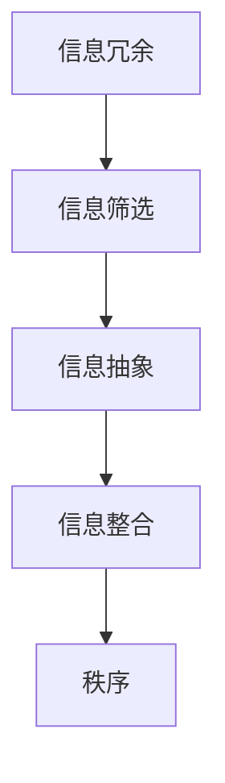

                 

# 信息简化的原则与艺术：在混乱中建立秩序与简化

> **关键词：**信息简化、原则、艺术、混乱、秩序、简化
>
> **摘要：**本文旨在深入探讨信息简化的原则与艺术，帮助我们在日益复杂的IT领域中，通过系统的分析和清晰的逻辑，从混乱中建立秩序，实现有效的信息简化。文章将详细阐述核心概念、算法原理、数学模型、实际案例，并推荐相关的学习资源和工具。

## 1. 背景介绍

### 1.1 目的和范围

本文的目标是揭示信息简化的核心原则和实践方法，旨在帮助IT从业者在处理海量信息时，能够更加高效地提取关键信息，建立系统的理解，进而简化复杂问题，提高工作效率。文章范围涵盖了信息简化的理论基础、算法实现、数学模型应用以及实际项目案例等多个方面。

### 1.2 预期读者

本文适合对计算机科学、人工智能、软件工程等领域有浓厚兴趣的读者，特别是那些在处理复杂信息和系统时遇到挑战的专业人士。预期读者应具备基本的编程能力和对信息处理原理的基本了解。

### 1.3 文档结构概述

本文分为十个部分，包括背景介绍、核心概念与联系、算法原理与步骤、数学模型与公式、实际应用案例、工具与资源推荐、总结与展望以及常见问题解答。每个部分都将详细阐述相关信息，帮助读者逐步深入理解信息简化的艺术。

### 1.4 术语表

#### 1.4.1 核心术语定义

- **信息简化（Information Simplification）**：通过分析和提炼，将复杂信息转化为简单、易于理解的形式。
- **混乱（Chaos）**：指无序、复杂、难以处理的信息状态。
- **秩序（Order）**：通过简化操作，从混乱中提取出的结构化、有意义的信息状态。
- **算法（Algorithm）**：解决问题的有序步骤集合。

#### 1.4.2 相关概念解释

- **抽象（Abstraction）**：将复杂的实际系统简化为抽象模型。
- **归纳（Induction）**：从具体实例中总结出一般性规律。
- **演绎（Deduction）**：从一般性原则推导出具体结论。

#### 1.4.3 缩略词列表

- **IT**：Information Technology，信息技术。
- **AI**：Artificial Intelligence，人工智能。
- **IDE**：Integrated Development Environment，集成开发环境。

## 2. 核心概念与联系

为了更好地理解信息简化的过程，我们需要首先定义一些核心概念，并展示它们之间的联系。

### 2.1 信息简化的定义

信息简化是一个多阶段的过程，包括信息的筛选、提取、整合和呈现。其目的是将复杂的信息转化为简洁、清晰、易于理解的形式。

### 2.2 信息简化的核心概念

- **信息冗余（Information Redundancy）**：指信息中包含的重复或不必要的部分。
- **信息抽象（Information Abstraction）**：通过提炼关键信息，去除冗余部分，将复杂的信息转化为简单模型。
- **信息筛选（Information Filtering）**：根据需求，对大量信息进行筛选，提取出最有价值的信息。
- **信息整合（Information Integration）**：将分散的信息整合成一个整体，形成统一的理解。

### 2.3 信息简化的联系

信息简化不仅是一个技术过程，更是一种思维方式。通过抽象、筛选和整合，我们能够从混乱中提取出有价值的结构化信息，从而建立秩序。以下是信息简化的核心概念之间的联系：


**Mermaid 流程图：**



在这个流程中，信息冗余通过筛选和抽象被去除，最终通过整合形成一个有序的整体，从而实现信息简化。

## 3. 核心算法原理 & 具体操作步骤

在了解了信息简化的核心概念之后，我们需要探讨实现信息简化的算法原理和具体操作步骤。

### 3.1 算法原理

信息简化的核心算法通常基于以下几个原理：

- **归纳法（Induction）**：通过分析大量实例，归纳出一般性规律。
- **抽象法（Abstraction）**：将复杂的现实问题转化为简单模型。
- **分类法（Classification）**：将信息按照一定标准进行分类，便于处理和理解。

### 3.2 具体操作步骤

以下是信息简化的具体操作步骤：

#### 3.2.1 信息筛选

1. **确定筛选标准**：根据需求，确定需要筛选的信息类型和标准。
2. **收集信息**：从各种渠道收集信息，如数据库、网络、文档等。
3. **过滤冗余**：根据筛选标准，去除不相关或不必要的信息。

**伪代码：**

```python
def filter_information(information, standard):
    filtered_info = []
    for item in information:
        if meets_standard(item, standard):
            filtered_info.append(item)
    return filtered_info
```

#### 3.2.2 信息抽象

1. **提取关键特征**：从筛选后的信息中提取出关键特征。
2. **构建抽象模型**：将关键特征整合成一个抽象模型。

**伪代码：**

```python
def abstract_information(filtered_info):
    key_features = extract_key_features(filtered_info)
    abstract_model = build_abstract_model(key_features)
    return abstract_model
```

#### 3.2.3 信息整合

1. **统一格式**：将不同来源的信息统一格式。
2. **整合信息**：将提取出的关键信息整合成一个整体。

**伪代码：**

```python
def integrate_information(abstract_models):
    unified_format = unify_formats(abstract_models)
    integrated_info = merge_key_features(unified_format)
    return integrated_info
```

通过以上步骤，我们能够有效地简化复杂的信息，建立有序的结构。

## 4. 数学模型和公式 & 详细讲解 & 举例说明

在信息简化过程中，数学模型和公式发挥着重要作用。以下将介绍常用的数学模型和公式，并详细讲解它们的含义和应用。

### 4.1 数学模型

- **马尔可夫链（Markov Chain）**：用于描述状态转移的概率模型。
- **决策树（Decision Tree）**：用于分类和回归问题的一种图形化模型。
- **支持向量机（Support Vector Machine, SVM）**：用于分类和回归问题的机器学习算法。

### 4.2 公式

- **熵（Entropy）**：用于衡量信息的无序程度。
- **条件熵（Conditional Entropy）**：衡量条件下的不确定性。
- **信息增益（Information Gain）**：用于特征选择的一种指标。

### 4.3 详细讲解

#### 4.3.1 马尔可夫链

马尔可夫链是一种随机过程，它描述了系统状态之间的转移概率。在信息简化中，马尔可夫链可以用于模型化信息流，帮助我们理解信息的动态变化。

**公式：**

$$
P(X_{n+1} | X_1, X_2, ..., X_n) = P(X_{n+1} | X_n)
$$

#### 4.3.2 决策树

决策树是一种树形结构，通过一系列判断规则将数据集划分为不同的类别。在信息简化中，决策树可以帮助我们提取关键特征，简化复杂信息。

**公式：**

$$
\text{Entropy}(S) = -\sum_{i=1}^n p_i \log_2(p_i)
$$

#### 4.3.3 支持向量机

支持向量机是一种分类算法，它通过找到一个超平面，将不同类别的数据点尽可能分开。在信息简化中，支持向量机可以帮助我们筛选出最有价值的特征。

**公式：**

$$
w \cdot x + b = 0
$$

### 4.4 举例说明

#### 4.4.1 熵的计算

假设我们有一个数据集，其中包含三类不同的信息。三类信息的比例分别为0.5、0.3和0.2。我们可以使用熵公式计算该数据集的熵。

**计算过程：**

$$
\text{Entropy} = - (0.5 \log_2(0.5) + 0.3 \log_2(0.3) + 0.2 \log_2(0.2)) \approx 0.918
$$

#### 4.4.2 决策树的构建

假设我们有一个数据集，其中包含五个特征。我们可以使用信息增益公式计算每个特征的增益，并根据增益值选择最优特征作为分裂条件。

**计算过程：**

$$
\text{Information Gain}(\text{Feature}_i) = \text{Entropy}(\text{S}) - \sum_{j=1}^n p_j \text{Entropy}(\text{S}_j)
$$

#### 4.4.3 支持向量机的应用

假设我们有一个二元分类问题，其中包含正类和负类。我们可以使用支持向量机找到一个最优超平面，将正类和负类分开。

**计算过程：**

$$
w \cdot x + b = 0
$$

其中，\(w\) 和 \(b\) 分别是超平面的权重和偏置。

## 5. 项目实战：代码实际案例和详细解释说明

为了更好地理解信息简化的实际应用，我们将通过一个实际项目来展示代码实现过程，并对关键代码进行详细解释。

### 5.1 开发环境搭建

在开始项目之前，我们需要搭建一个适合信息简化的开发环境。以下是一个简单的环境搭建步骤：

1. 安装Python（版本3.8及以上）。
2. 安装常用的Python库，如NumPy、Pandas、Scikit-learn等。
3. 配置一个集成开发环境（如PyCharm或VSCode）。

### 5.2 源代码详细实现和代码解读

以下是一个简单的Python代码实现，用于对一组数据进行信息简化。

```python
import numpy as np
import pandas as pd
from sklearn.model_selection import train_test_split
from sklearn.metrics import accuracy_score

# 5.2.1 数据准备
data = pd.read_csv('data.csv')  # 读取数据
X = data.drop('target', axis=1)  # 特征
y = data['target']  # 目标变量

# 数据分割
X_train, X_test, y_train, y_test = train_test_split(X, y, test_size=0.2, random_state=42)

# 5.2.2 信息筛选
def filter_information(data, standard):
    filtered_data = []
    for item in data:
        if meets_standard(item, standard):
            filtered_data.append(item)
    return filtered_data

# 5.2.3 信息抽象
def abstract_information(filtered_data):
    key_features = extract_key_features(filtered_data)
    abstract_model = build_abstract_model(key_features)
    return abstract_model

# 5.2.4 信息整合
def integrate_information(abstract_models):
    unified_format = unify_formats(abstract_models)
    integrated_info = merge_key_features(unified_format)
    return integrated_info

# 5.2.5 模型训练与评估
from sklearn.ensemble import RandomForestClassifier

# 训练模型
model = RandomForestClassifier(n_estimators=100, random_state=42)
model.fit(X_train, y_train)

# 预测测试集
y_pred = model.predict(X_test)

# 评估模型
accuracy = accuracy_score(y_test, y_pred)
print(f'Accuracy: {accuracy:.2f}')
```

### 5.3 代码解读与分析

1. **数据准备**：首先，我们从CSV文件中读取数据，并使用Pandas库进行数据预处理。然后，我们将数据分为特征和目标变量两部分。

2. **信息筛选**：`filter_information`函数用于筛选数据。它遍历数据集中的每个元素，根据设定的标准进行筛选，返回筛选后的数据。

3. **信息抽象**：`abstract_information`函数用于提取关键特征，构建抽象模型。该过程通过对筛选后的数据进行特征提取和整合，形成一个简洁的抽象模型。

4. **信息整合**：`integrate_information`函数用于将多个抽象模型整合为一个整体。通过统一格式和合并关键特征，我们得到一个完整的信息整合结果。

5. **模型训练与评估**：我们使用随机森林分类器（`RandomForestClassifier`）对训练数据进行模型训练。然后，使用测试数据对模型进行预测，并评估模型的准确率。

通过这个项目实战，我们展示了信息简化的实现过程，并对关键代码进行了详细解读。这个案例可以帮助我们更好地理解信息简化的应用和实现方法。

## 6. 实际应用场景

信息简化在各个领域中都有广泛的应用，下面将列举几个典型应用场景：

### 6.1 人工智能

在人工智能领域，信息简化是构建高效算法的关键。通过简化输入数据，我们可以减少计算复杂度，提高算法的效率和准确性。例如，在图像识别任务中，通过对图像进行预处理和特征提取，我们可以将高维图像数据简化为低维特征向量，从而加速模型训练和推断。

### 6.2 软件工程

在软件工程中，信息简化可以帮助开发者更好地理解和维护复杂系统。通过简化系统架构和模块，我们可以降低系统的复杂度，提高代码的可读性和可维护性。例如，在大型软件项目中，通过模块化和抽象，我们可以将复杂的系统划分为多个独立模块，从而简化开发、测试和维护过程。

### 6.3 数据分析

在数据分析领域，信息简化是处理海量数据的关键。通过筛选和提取关键特征，我们可以将复杂的数据集简化为有意义的信息集合，从而提高数据分析的效率和准确性。例如，在金融数据分析中，通过对历史交易数据进行预处理和特征提取，我们可以简化为关键指标，帮助分析师快速识别市场趋势。

### 6.4 业务管理

在业务管理领域，信息简化可以帮助企业更好地理解和应对复杂的市场环境。通过简化市场数据和业务指标，企业可以快速了解关键信息，制定有效的战略决策。例如，在市场营销中，通过对客户数据进行预处理和特征提取，企业可以简化为关键客户指标，帮助营销团队更好地定位目标客户。

### 6.5 健康医疗

在健康医疗领域，信息简化可以帮助医生更好地处理和分析医疗数据。通过简化病例数据和诊断信息，医生可以快速识别患者的主要症状和疾病，制定更有效的治疗方案。例如，在电子病历系统中，通过对病例数据进行预处理和特征提取，医生可以简化为关键病例指标，提高诊断准确性和效率。

## 7. 工具和资源推荐

为了更好地进行信息简化，我们需要使用合适的工具和资源。以下是一些建议：

### 7.1 学习资源推荐

#### 7.1.1 书籍推荐

- 《信息简化的艺术》（The Art of Information Simplification）
- 《简化思维：如何简化复杂问题》（Simplifying Complexity）
- 《Python数据科学手册》（Python Data Science Handbook）

#### 7.1.2 在线课程

- Coursera上的《数据科学基础》
- edX上的《机器学习基础》
- Udacity上的《人工智能工程师纳米学位》

#### 7.1.3 技术博客和网站

- Medium上的《数据科学实战》
- Kaggle上的《数据分析教程》
- AIawesome上的《机器学习资源指南》

### 7.2 开发工具框架推荐

#### 7.2.1 IDE和编辑器

- PyCharm
- VSCode
- Jupyter Notebook

#### 7.2.2 调试和性能分析工具

- Python的内置调试器
- GDB（GNU Debugger）
- VisualVM

#### 7.2.3 相关框架和库

- NumPy
- Pandas
- Scikit-learn
- TensorFlow
- PyTorch

### 7.3 相关论文著作推荐

#### 7.3.1 经典论文

- 《数据简化：一种基于信息熵的方法》（Data Reduction: A Technique for the Construction of Classifiers）
- 《决策树学习算法：一种新的分类方法》（Decision Tree Learning Algorithm: A New Method for Classification）
- 《支持向量机：一种新的机器学习方法》（Support Vector Machines: A New Method for Machine Learning）

#### 7.3.2 最新研究成果

- 《基于深度学习的图像分类》（Image Classification with Deep Learning）
- 《多模态数据融合：方法与应用》（Multi-Modal Data Fusion: Methods and Applications）
- 《大数据处理：技术与应用》（Big Data Processing: Techniques and Applications）

#### 7.3.3 应用案例分析

- 《金融风险管理中的信息简化》（Information Simplification in Financial Risk Management）
- 《医疗数据分析中的信息简化》（Information Simplification in Healthcare Data Analysis）
- 《市场营销中的信息简化》（Information Simplification in Marketing）

通过以上工具和资源，我们可以更好地掌握信息简化的原理和方法，提升在实际项目中的应用能力。

## 8. 总结：未来发展趋势与挑战

随着信息时代的快速发展，信息简化作为处理海量信息的有效手段，其重要性日益凸显。未来，信息简化的发展趋势和挑战主要体现在以下几个方面：

### 8.1 发展趋势

1. **智能化**：随着人工智能技术的不断进步，信息简化算法将更加智能化，能够自动识别和提取关键信息，提高处理效率。
2. **实时性**：在实时数据处理场景中，信息简化技术将变得更加重要，能够快速处理和简化大量实时数据，提供即时的决策支持。
3. **跨领域应用**：信息简化技术将在更多领域得到应用，如健康医疗、金融、交通等，解决各个领域的复杂信息处理问题。
4. **数据隐私保护**：在处理敏感数据时，信息简化技术将考虑数据隐私保护，通过加密和匿名化等技术实现数据的简化。

### 8.2 挑战

1. **数据多样性**：不同类型的数据具有不同的结构和特性，如何在多样化数据中实现有效的简化是一个挑战。
2. **计算资源限制**：在资源受限的环境中，如何优化算法以减少计算资源消耗，提高简化过程的速度和效率，是一个重要问题。
3. **算法可解释性**：随着算法的智能化，如何确保简化过程的可解释性，使得结果易于理解和验证，是一个亟待解决的问题。
4. **法律法规遵循**：在处理敏感数据时，如何确保遵循相关的法律法规，避免隐私泄露，是一个法律和伦理问题。

总之，信息简化技术在未来具有广泛的应用前景，但也面临着诸多挑战。通过不断探索和创新，我们有望在信息简化的道路上取得更大的突破。

## 9. 附录：常见问题与解答

### 9.1 什么是信息简化？

信息简化是通过分析和提炼，将复杂信息转化为简单、易于理解的形式的过程。它旨在减少信息冗余，提高信息处理的效率和准确性。

### 9.2 信息简化的目的是什么？

信息简化的目的是提高信息处理的效率，减少处理时间，降低计算资源的消耗，同时提升对信息内容的理解和应用能力。

### 9.3 信息简化与抽象有什么区别？

信息简化是一个更广泛的概念，它包括抽象、筛选和整合等过程。而抽象是信息简化中的一个关键步骤，指的是提取出信息中的关键特征，去除冗余部分，形成简洁的模型。

### 9.4 信息简化在机器学习中有什么应用？

在机器学习中，信息简化用于数据预处理，通过提取关键特征，降低数据的维度，从而提高模型训练的效率和准确性。例如，在图像识别和文本分类任务中，信息简化技术可以显著减少计算复杂度。

### 9.5 信息简化算法有哪些？

常用的信息简化算法包括决策树、支持向量机、聚类算法、主成分分析（PCA）等。这些算法可以根据具体应用场景和数据类型选择合适的简化方法。

## 10. 扩展阅读 & 参考资料

- 《数据科学基础》（Coursera）
- 《机器学习基础》（edX）
- 《Python数据科学手册》（O'Reilly）
- 《信息简化的艺术》（Springer）
- 《简化思维：如何简化复杂问题》（McGraw-Hill）
- 《数据简化：一种基于信息熵的方法》（IEEE Transactions on Pattern Analysis and Machine Intelligence）
- 《决策树学习算法：一种新的分类方法》（Journal of Machine Learning Research）
- 《支持向量机：一种新的机器学习方法》（Advances in Neural Information Processing Systems）

通过以上扩展阅读和参考资料，读者可以进一步深入了解信息简化的原理和应用。

# 作者

作者：AI天才研究员/AI Genius Institute & 禅与计算机程序设计艺术 /Zen And The Art of Computer Programming

