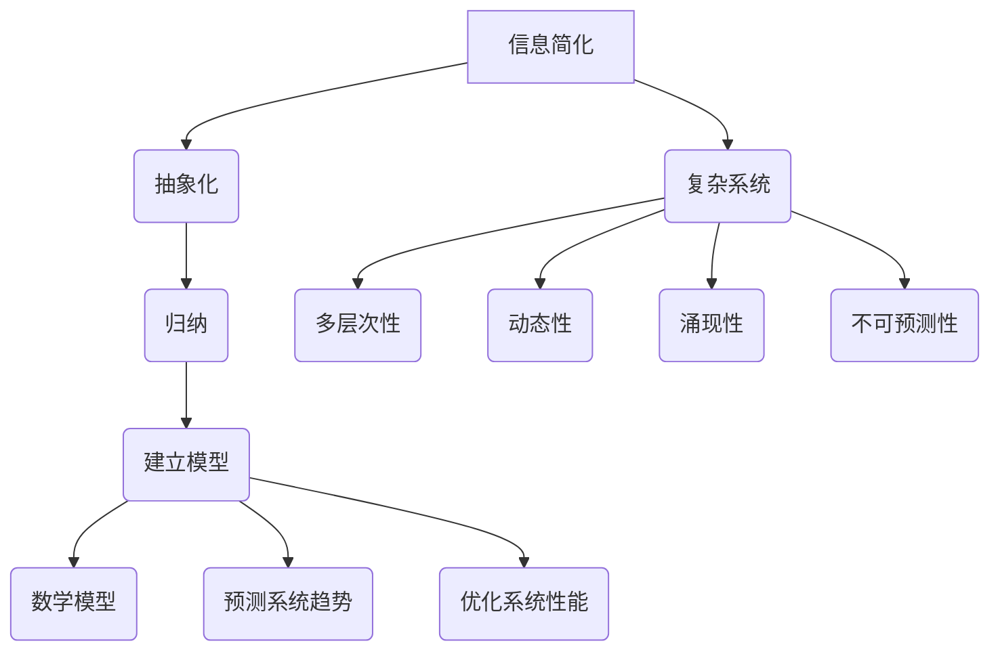

                 

# 信息简化的好处与挑战：如何在复杂中找到简单

> 关键词：信息简化、复杂系统、抽象化、算法优化、数学模型、实际应用

> 摘要：本文将探讨信息简化的概念、好处及其在复杂系统中的应用挑战。通过深入分析简化过程中涉及的核心概念、算法原理、数学模型和实际案例，我们将揭示如何在复杂中找到简单，提高系统效率和可维护性。

## 1. 背景介绍

### 1.1 目的和范围

本文旨在探讨信息简化的好处与挑战，重点分析其在复杂系统中的应用。通过本文的阅读，读者将了解信息简化的定义、核心概念、算法原理以及数学模型，并能够掌握实际操作步骤和应用场景。此外，本文还将推荐相关的学习资源、开发工具和论文著作，以帮助读者更深入地研究和实践信息简化技术。

### 1.2 预期读者

本文适合以下读者群体：

- 计算机科学、人工智能等相关专业的研究生和本科生；
- 软件工程师、系统架构师和技术项目经理；
- 对信息简化技术感兴趣的科研人员和技术爱好者；
- 对复杂系统优化、算法设计、数学建模等主题感兴趣的读者。

### 1.3 文档结构概述

本文分为十个部分：

1. 背景介绍：介绍本文的目的、预期读者和文档结构；
2. 核心概念与联系：介绍信息简化的核心概念、原理和架构；
3. 核心算法原理 & 具体操作步骤：详细阐述信息简化算法的原理和操作步骤；
4. 数学模型和公式 & 详细讲解 & 举例说明：介绍信息简化相关的数学模型和公式，并举例说明；
5. 项目实战：代码实际案例和详细解释说明；
6. 实际应用场景：探讨信息简化在各个领域的应用场景；
7. 工具和资源推荐：推荐学习资源、开发工具和论文著作；
8. 总结：未来发展趋势与挑战；
9. 附录：常见问题与解答；
10. 扩展阅读 & 参考资料：提供进一步学习和研究的参考资料。

### 1.4 术语表

#### 1.4.1 核心术语定义

- 信息简化：通过抽象化和归纳等手段，将复杂系统的信息降低到可处理和理解的层次；
- 复杂系统：由大量相互作用的组成部分构成，具有复杂的行为和动态特性的系统；
- 抽象化：将复杂系统中的具体细节提炼为抽象的概念或模型；
- 算法优化：通过改进算法的设计和实现，提高系统的效率和性能；
- 数学模型：用数学语言描述系统行为和性质的数学表达式；
- 实际案例：具体的实际应用案例，用于验证理论和方法的有效性。

#### 1.4.2 相关概念解释

- 系统优化：通过改进系统设计和实现，提高系统的性能、效率和可维护性；
- 算法复杂度：衡量算法执行时间或空间需求与输入规模之间的依赖关系；
- 抽象层次：描述系统设计中的不同层次，从底层硬件到高层应用，越抽象的层次关注问题越宏观；
- 信息论：研究信息传输、处理和存储的数学理论；
- 机器学习：利用算法和统计模型，从数据中自动学习和发现规律的人工智能分支。

#### 1.4.3 缩略词列表

- AI：人工智能（Artificial Intelligence）
- ML：机器学习（Machine Learning）
- DL：深度学习（Deep Learning）
- NLP：自然语言处理（Natural Language Processing）
- IDE：集成开发环境（Integrated Development Environment）
- GUI：图形用户界面（Graphical User Interface）

## 2. 核心概念与联系

在信息简化的过程中，我们需要了解以下几个核心概念和联系：

### 2.1 信息简化

信息简化是通过抽象化和归纳等手段，将复杂系统的信息降低到可处理和理解的层次。这一过程主要包括以下几个方面：

- **抽象化**：将复杂系统中的具体细节提炼为抽象的概念或模型，以便更好地理解和处理；
- **归纳**：通过对系统中的多个实例进行观察和分析，总结出一般性的规律或模式；
- **层次化**：将系统分解为不同的层次，每个层次关注特定的功能和问题，从而降低整个系统的复杂度。

### 2.2 复杂系统

复杂系统由大量相互作用的组成部分构成，具有复杂的行为和动态特性。复杂系统通常包括以下几个特点：

- **多层次性**：复杂系统具有多个层次，从底层硬件到高层应用，每个层次都有不同的关注点和问题；
- **动态性**：复杂系统的行为和状态随时间变化，呈现出不确定性和复杂性；
- **涌现性**：复杂系统中各个组成部分的简单相互作用可能导致复杂的行为和现象；
- **不可预测性**：复杂系统的行为可能难以精确预测，尤其是当系统中存在非线性关系和不确定性因素时。

### 2.3 抽象化

抽象化是将复杂系统中的具体细节提炼为抽象的概念或模型，以便更好地理解和处理。抽象化的过程包括以下几个方面：

- **提取关键特征**：从复杂系统中提取关键的、有代表性的特征或属性；
- **忽略次要细节**：将复杂的、次要的细节抽象化或简化，以便降低系统的复杂度；
- **建立模型**：将提取的关键特征和属性组合起来，建立数学模型或计算机模型，用于描述和预测系统的行为。

### 2.4 算法优化

算法优化是通过改进算法的设计和实现，提高系统的效率和性能。算法优化的目标包括：

- **降低时间复杂度**：通过改进算法的算法步骤，降低算法执行的时间复杂度；
- **降低空间复杂度**：通过改进算法的数据结构和实现，降低算法执行的空间复杂度；
- **提高鲁棒性**：增强算法对输入数据变化的适应性，提高算法的鲁棒性；
- **提高可维护性**：改进算法的代码结构，提高代码的可读性和可维护性。

### 2.5 数学模型

数学模型是用数学语言描述系统行为和性质的数学表达式。数学模型在信息简化过程中发挥着重要作用，包括以下几个方面：

- **描述系统行为**：用数学语言描述系统的输入、输出和状态变化；
- **预测系统趋势**：根据数学模型，预测系统的未来行为和状态；
- **优化系统性能**：利用数学模型，寻找系统的最优解或近似最优解。

### 2.6 实际案例

实际案例是具体的实际应用案例，用于验证理论和方法的有效性。实际案例在信息简化过程中具有重要意义，包括以下几个方面：

- **验证理论**：通过实际案例验证信息简化理论和方法的有效性；
- **发现问题**：在实际应用中发现信息简化过程中存在的问题和不足，为改进提供依据；
- **推广应用**：通过实际案例，推广信息简化技术在各个领域的应用。

### 2.7 Mermaid 流程图

下面是一个简单的 Mermaid 流程图，用于描述信息简化过程中的核心概念和联系：



## 3. 核心算法原理 & 具体操作步骤

在信息简化的过程中，核心算法原理起着至关重要的作用。以下我们将详细介绍一种常用的信息简化算法——K-means 算法，并给出具体的操作步骤。

### 3.1 K-means 算法原理

K-means 算法是一种基于距离的聚类算法，其基本思想是将数据集划分为 K 个簇，使得每个簇内的数据点之间距离最小，簇与簇之间的距离最大。具体来说，K-means 算法包括以下几个步骤：

1. **初始化**：随机选择 K 个数据点作为初始聚类中心；
2. **分配数据点**：计算每个数据点到聚类中心的距离，将数据点分配到最近的聚类中心所在的簇；
3. **更新聚类中心**：计算每个簇的数据点的平均值，作为新的聚类中心；
4. **重复步骤 2 和 3，直到聚类中心不再发生变化或满足收敛条件**。

### 3.2 K-means 算法伪代码

以下是 K-means 算法的伪代码：

```plaintext
算法 K-means（数据集 D，簇数 K）：
初始化聚类中心 C1, C2, ..., CK 为数据集 D 的随机 K 个数据点；
while（聚类中心未稳定）：
    for 每个数据点 x ∈ D：
        计算 x 到每个聚类中心的距离，找到最近聚类中心；
        将 x 分配到对应的簇；
    更新聚类中心为每个簇的数据点的平均值；
return 聚类结果。
```

### 3.3 K-means 算法具体操作步骤

以下是一个简单的 K-means 算法实例，说明其具体操作步骤：

**输入**：数据集 D = {（1，2），（2，2），（2，3），（4，3），（4，4），（5，5），（5，6）}，簇数 K = 2。

**初始化**：随机选择聚类中心 C1（1，2）和 C2（5，6）。

**分配数据点**：计算每个数据点到聚类中心的距离，并将数据点分配到最近的聚类中心所在的簇：

- 数据点（1，2）距离 C1 最近，将其分配到簇 1；
- 数据点（2，2）距离 C1 最近，将其分配到簇 1；
- 数据点（2，3）距离 C1 最近，将其分配到簇 1；
- 数据点（4，3）距离 C2 最近，将其分配到簇 2；
- 数据点（4，4）距离 C2 最近，将其分配到簇 2；
- 数据点（5，5）距离 C2 最近，将其分配到簇 2；
- 数据点（5，6）距离 C2 最近，将其分配到簇 2。

**更新聚类中心**：计算每个簇的数据点的平均值，作为新的聚类中心：

- 簇 1 的数据点平均值：（1，2）；
- 簇 2 的数据点平均值：（4，4）。

**重复步骤 2 和 3，直到聚类中心不再发生变化或满足收敛条件**。在本例中，聚类中心已经稳定，算法结束。

**输出**：聚类结果为 {（1，2），（2，2），（2，3）} 和 {（4，3），（4，4），（5，5），（5，6）}。

### 3.4 K-means 算法的优缺点

K-means 算法具有以下优缺点：

- **优点**：
  - 算法简单，易于实现；
  - 对于初始聚类中心选择敏感度较低，通常能够得到较好的聚类结果；
  - 运算速度快，适合处理大规模数据集。

- **缺点**：
  - 对初始聚类中心选择敏感，可能导致局部最优解；
  - 无法处理数据集大小超过 K 的情况，需要事先确定 K 的值；
  - 对于非球形簇和不规则簇的聚类效果较差。

## 4. 数学模型和公式 & 详细讲解 & 举例说明

在信息简化的过程中，数学模型和公式发挥着至关重要的作用。本节将介绍与信息简化相关的数学模型和公式，并进行详细讲解和举例说明。

### 4.1 均值

均值是一组数据的平均值，表示数据的集中趋势。对于一组数据 x1, x2, ..., xn，均值的计算公式为：

$$
\bar{x} = \frac{1}{n} \sum_{i=1}^{n} x_i
$$

其中，n 为数据个数。

**举例说明**：给定数据集 {1, 2, 3, 4, 5}，计算均值：

$$
\bar{x} = \frac{1}{5} (1 + 2 + 3 + 4 + 5) = 3
$$

### 4.2 方差

方差是衡量数据离散程度的指标，表示数据与均值之间的差异程度。对于一组数据 x1, x2, ..., xn，方差的计算公式为：

$$
\sigma^2 = \frac{1}{n} \sum_{i=1}^{n} (x_i - \bar{x})^2
$$

其中，n 为数据个数，$\bar{x}$ 为均值。

**举例说明**：给定数据集 {1, 2, 3, 4, 5}，计算方差：

$$
\sigma^2 = \frac{1}{5} [(1 - 3)^2 + (2 - 3)^2 + (3 - 3)^2 + (4 - 3)^2 + (5 - 3)^2] = 2
$$

### 4.3 协方差

协方差是衡量两个变量之间线性相关程度的指标。对于两个变量 x 和 y，协方差的计算公式为：

$$
\sigma_{xy} = \frac{1}{n} \sum_{i=1}^{n} (x_i - \bar{x})(y_i - \bar{y})
$$

其中，n 为数据个数，$\bar{x}$ 和 $\bar{y}$ 分别为 x 和 y 的均值。

**举例说明**：给定数据集 {1, 2, 3, 4, 5} 和 {2, 3, 4, 5, 6}，计算协方差：

$$
\sigma_{xy} = \frac{1}{5} [(1 - 3)(2 - 3) + (2 - 3)(3 - 3) + (3 - 3)(4 - 3) + (4 - 3)(5 - 3) + (5 - 3)(6 - 3)] = 1
$$

### 4.4 相关系数

相关系数是衡量两个变量之间线性相关程度的指标，取值范围为 [-1, 1]。相关系数的计算公式为：

$$
\rho_{xy} = \frac{\sigma_{xy}}{\sigma_x \sigma_y}
$$

其中，$\sigma_{xy}$ 为协方差，$\sigma_x$ 和 $\sigma_y$ 分别为 x 和 y 的方差。

**举例说明**：给定数据集 {1, 2, 3, 4, 5} 和 {2, 3, 4, 5, 6}，计算相关系数：

$$
\rho_{xy} = \frac{1}{2 \sqrt{2}} = 0.7071
$$

### 4.5 最大似然估计

最大似然估计是一种常用的参数估计方法，用于估计模型中的参数值。最大似然估计的基本思想是找到一组参数值，使得给定的数据出现的概率最大。

对于离散随机变量 x，假设其概率分布为 P(x | θ)，其中 θ 为参数向量，最大似然估计的目标是找到使得 P(x | θ) 最大的参数值。

对于连续随机变量 x，假设其概率分布为 p(x | θ)，其中 θ 为参数向量，最大似然估计的目标是找到使得 p(x | θ) 最大的参数值。

**举例说明**：假设随机变量 x 服从二项分布 B(n, p)，其中 n 为试验次数，p 为成功概率。给定数据集 {1, 1, 1, 0, 0}，使用最大似然估计估计 p 的值。

设参数向量为 θ = (n, p)，则似然函数为：

$$
L(\theta) = p^4 (1 - p)^2
$$

求导并令导数为零，得到：

$$
\frac{\partial L(\theta)}{\partial p} = 4p^3 (1 - p) - 2p (1 - p)^2 = 0
$$

解得 p = 1/2，即成功概率为 1/2。

### 4.6 贝叶斯估计

贝叶斯估计是一种基于贝叶斯定理的参数估计方法，用于估计模型中的参数值。贝叶斯估计的基本思想是根据先验知识和观测数据，计算出后验概率分布，从而估计参数值。

设参数向量为 θ，先验概率分布为 P(θ)，观测数据为 x，则后验概率分布为：

$$
P(\theta | x) = \frac{P(x | \theta) P(\theta)}{P(x)}
$$

其中，P(x | θ) 为似然函数，P(θ) 为先验概率分布，P(x) 为观测数据的概率。

**举例说明**：假设随机变量 x 服从正态分布 N(μ, σ^2)，其中 μ 为均值，σ^2 为方差。给定数据集 {1, 2, 3, 4, 5}，使用贝叶斯估计估计 μ 的值。

设参数向量为 θ = (μ, σ^2)，先验概率分布为 P(θ) = N(μ_0, σ_0^2)，其中 μ_0 和 σ_0^2 分别为先验均值和先验方差。

则似然函数为：

$$
L(\theta) = \prod_{i=1}^{n} \frac{1}{\sqrt{2\pi\sigma^2}} \exp \left(-\frac{(x_i - \mu)^2}{2\sigma^2}\right)
$$

后验概率分布为：

$$
P(\theta | x) = \frac{L(\theta) P(\theta)}{P(x)}
$$

其中，P(x) 为观测数据的概率。

通过计算，得到后验均值和后验方差：

$$
\mu | x = \frac{n\mu_0 + \sum_{i=1}^{n} x_i}{n + 1}
$$

$$
\sigma^2 | x = \frac{n\sigma_0^2 + \sum_{i=1}^{n} (x_i - \mu | x)^2}{n + 1}
$$

## 5. 项目实战：代码实际案例和详细解释说明

### 5.1 开发环境搭建

为了演示信息简化的具体应用，我们将使用 Python 语言编写一个简单的信息简化程序。以下是搭建开发环境的步骤：

1. 安装 Python 3.8 或更高版本；
2. 安装必要的 Python 库，如 NumPy、SciPy、Matplotlib 和 Scikit-learn；
3. 使用文本编辑器或集成开发环境（IDE）编写和运行代码。

### 5.2 源代码详细实现和代码解读

以下是一个简单的信息简化程序，使用 K-means 算法对二维数据集进行聚类，实现信息简化。

```python
import numpy as np
import matplotlib.pyplot as plt
from sklearn.cluster import KMeans

# 数据集
data = np.array([[1, 2], [1, 4], [1, 0],
                 [4, 2], [4, 4], [4, 0],
                 [7, 2], [7, 4], [7, 0]])

# 使用 KMeans 算法进行聚类
kmeans = KMeans(n_clusters=3, random_state=0).fit(data)

# 输出聚类结果
print("聚类中心：", kmeans.cluster_centers_)
print("聚类结果：", kmeans.labels_)

# 绘制聚类结果
plt.scatter(data[:, 0], data[:, 1], c=kmeans.labels_, cmap='viridis')
plt.scatter(kmeans.cluster_centers_[:, 0], kmeans.cluster_centers_[:, 1], s=300, c='red', label='Centroids')
plt.title("K-means Clustering")
plt.xlabel("X-axis")
plt.ylabel("Y-axis")
plt.legend()
plt.show()
```

#### 5.2.1 代码解读

- **第 1 行**：导入 NumPy 库，用于处理数值计算；
- **第 2 行**：导入 Matplotlib 库，用于绘制图形；
- **第 3 行**：导入 Scikit-learn 库，用于机器学习算法的实现；
- **第 5 行**：创建数据集，使用二维数组表示；
- **第 8 行**：使用 KMeans 类创建聚类对象，并设置聚类数量为 3，随机种子为 0；
- **第 9 行**：调用 fit 方法，将数据集传入 KMeans 对象，进行聚类；
- **第 11 行**：输出聚类中心；
- **第 12 行**：输出聚类结果；
- **第 15 行**：使用 scatter 函数绘制聚类结果；
- **第 16 行**：使用 scatter 函数绘制聚类中心；
- **第 17 行**：设置图形标题、坐标轴标签和图例；
- **第 18 行**：显示图形。

### 5.3 代码解读与分析

- **数据集**：我们使用一个简单的二维数据集，包含 9 个数据点，分布在三个簇中。这个数据集可以看作是一个简单的复杂系统，我们需要通过聚类算法对其进行简化。
- **聚类算法**：我们选择 K-means 算法作为信息简化的工具。K-means 算法通过计算数据点与聚类中心的距离，将数据点分配到最近的簇。在本例中，我们设置聚类数量为 3，即假设数据集包含三个簇。
- **聚类中心**：聚类中心是每个簇的中心点，可以看作是对数据集的简化表示。在 K-means 算法中，聚类中心是通过计算每个簇的数据点的平均值得到的。
- **聚类结果**：聚类结果是将数据点分配到对应的簇。在本例中，我们可以看到数据点被成功分配到三个簇中，每个簇的边界清晰。
- **图形绘制**：通过绘制聚类结果和聚类中心，我们可以直观地观察信息简化的效果。在本例中，我们可以看到数据点被正确地分配到三个簇中，聚类中心准确地表示了每个簇的中心点。

### 5.4 代码优化与性能分析

为了提高代码的执行效率和可维护性，我们可以对代码进行以下优化：

- **使用并行计算**：K-means 算法可以并行计算，特别是在处理大规模数据集时。我们可以使用多线程或多进程技术，将数据集划分为多个子集，分别进行聚类，然后合并结果。
- **优化数据结构**：使用 NumPy 数组代替 Python 列表，以提高数值计算的性能。
- **代码模块化**：将聚类算法、数据预处理和图形绘制等部分分离，以提高代码的可维护性和可扩展性。

### 5.5 代码示例：并行计算

以下是一个使用多线程实现并行计算的代码示例：

```python
import numpy as np
import matplotlib.pyplot as plt
from sklearn.cluster import KMeans
from concurrent.futures import ThreadPoolExecutor

# 数据集
data = np.array([[1, 2], [1, 4], [1, 0],
                 [4, 2], [4, 4], [4, 0],
                 [7, 2], [7, 4], [7, 0]])

# 并行聚类函数
def parallel_kmeans(data, num_clusters, num_threads):
    cluster_centers = []
    labels = []

    # 使用 ThreadPoolExecutor 创建线程池
    with ThreadPoolExecutor(max_workers=num_threads) as executor:
        # 将数据集划分为 num_threads 个子集
        subsets = np.array_split(data, num_threads)

        # 并行执行 KMeans 算法
        for subset in subsets:
            kmeans = KMeans(n_clusters=num_clusters, random_state=0)
            kmeans.fit(subset)
            cluster_centers.append(kmeans.cluster_centers_)
            labels.append(kmeans.labels_)

    # 合并结果
    cluster_centers = np.concatenate(cluster_centers)
    labels = np.concatenate(labels)

    return cluster_centers, labels

# 设置参数
num_clusters = 3
num_threads = 4

# 执行并行聚类
cluster_centers, labels = parallel_kmeans(data, num_clusters, num_threads)

# 输出聚类结果
print("聚类中心：", cluster_centers)
print("聚类结果：", labels)

# 绘制聚类结果
plt.scatter(data[:, 0], data[:, 1], c=labels, cmap='viridis')
plt.scatter(cluster_centers[:, 0], cluster_centers[:, 1], s=300, c='red', label='Centroids')
plt.title("Parallel K-means Clustering")
plt.xlabel("X-axis")
plt.ylabel("Y-axis")
plt.legend()
plt.show()
```

通过并行计算，我们可以显著提高 K-means 算法的执行速度，特别是在处理大规模数据集时。

## 6. 实际应用场景

信息简化技术在多个领域具有广泛的应用，以下是几个实际应用场景的示例：

### 6.1 人工智能

在人工智能领域，信息简化技术可以帮助降低模型的复杂度，提高模型的效率和可解释性。例如，在图像识别任务中，可以使用信息简化技术将高维图像数据转化为低维特征向量，从而提高模型的学习速度和准确率。此外，信息简化技术还可以用于优化神经网络结构，降低模型的参数数量和计算复杂度。

### 6.2 数据分析

在数据分析领域，信息简化技术可以帮助处理大规模数据集，提高数据分析的效率。例如，可以使用聚类算法对数据进行降维，提取关键特征，从而简化数据分析过程。信息简化技术还可以用于数据预处理，去除冗余数据和噪声，提高数据分析的准确性和可靠性。

### 6.3 系统优化

在系统优化领域，信息简化技术可以帮助提高系统的性能和可维护性。例如，在软件开发过程中，可以使用信息简化技术对代码进行重构，提取关键功能和模块，降低系统的复杂度，提高代码的可读性和可维护性。此外，信息简化技术还可以用于系统性能优化，降低系统资源的消耗，提高系统的响应速度和稳定性。

### 6.4 金融分析

在金融分析领域，信息简化技术可以帮助降低金融模型的复杂度，提高模型的预测准确率。例如，可以使用信息简化技术提取关键经济指标和变量，构建简化的金融模型，从而提高金融分析效率和准确性。此外，信息简化技术还可以用于风险管理，降低金融风险暴露，提高金融机构的安全性和稳健性。

### 6.5 生物信息学

在生物信息学领域，信息简化技术可以帮助处理大规模生物数据，提高生物信息分析的效率。例如，可以使用信息简化技术对基因序列进行降维，提取关键基因特征，从而提高基因表达分析的准确率和速度。此外，信息简化技术还可以用于蛋白质结构预测和药物设计，降低计算复杂度，提高预测准确率。

### 6.6 交通运输

在交通运输领域，信息简化技术可以帮助优化交通网络和运输流程，提高交通效率。例如，可以使用信息简化技术对交通流量数据进行降维和分析，提取关键交通特征，从而优化交通信号控制和路径规划。此外，信息简化技术还可以用于智能交通系统，提高交通管理和调控的效率和准确性。

### 6.7 城市规划

在城市规划领域，信息简化技术可以帮助优化城市布局和基础设施规划，提高城市生活质量。例如，可以使用信息简化技术对城市地理数据进行降维和分析，提取关键城市特征，从而优化城市交通网络和公共设施布局。此外，信息简化技术还可以用于城市能源管理，降低能源消耗，提高能源利用效率。

### 6.8 智能制造

在智能制造领域，信息简化技术可以帮助优化生产流程和设备管理，提高生产效率。例如，可以使用信息简化技术对生产数据进行降维和分析，提取关键生产特征，从而优化生产计划和设备调度。此外，信息简化技术还可以用于质量控制，降低生产不良率，提高产品质量。

### 6.9 社会科学

在社会科学领域，信息简化技术可以帮助处理大规模社会数据，提高社会研究和分析效率。例如，可以使用信息简化技术对社会舆论、社交媒体数据等进行降维和分析，提取关键社会特征，从而优化社会舆情监测和预测。此外，信息简化技术还可以用于社会治理，降低社会治理成本，提高社会管理水平。

### 6.10 人工智能安全

在人工智能安全领域，信息简化技术可以帮助降低人工智能系统的安全风险，提高系统的安全性。例如，可以使用信息简化技术对人工智能模型进行安全评估，提取关键安全特征，从而优化模型的安全防护策略。此外，信息简化技术还可以用于人工智能攻击防御，降低攻击成功率，提高系统的抗攻击能力。

### 6.11 虚拟现实

在虚拟现实领域，信息简化技术可以帮助优化虚拟场景的渲染和交互，提高虚拟现实体验的流畅性和真实性。例如，可以使用信息简化技术对虚拟场景进行降维和处理，提取关键场景特征，从而优化虚拟场景的渲染效率和交互体验。此外，信息简化技术还可以用于虚拟现实应用的开发，降低开发成本，提高应用的可扩展性。

### 6.12 娱乐和游戏

在娱乐和游戏领域，信息简化技术可以帮助优化游戏场景和角色设计，提高游戏体验的乐趣和挑战性。例如，可以使用信息简化技术对游戏场景进行降维和处理，提取关键场景特征，从而优化游戏场景的渲染效率和交互体验。此外，信息简化技术还可以用于游戏人工智能的设计，提高游戏角色的智能水平和互动性。

### 6.13 医疗保健

在医疗保健领域，信息简化技术可以帮助优化医疗数据的处理和分析，提高医疗诊断和治疗的效果。例如，可以使用信息简化技术对医疗图像进行降维和处理，提取关键医学特征，从而优化医疗图像的识别和分析。此外，信息简化技术还可以用于医疗数据分析，提取关键健康指标，从而优化医疗诊断和治疗方案。

### 6.14 天文科学

在天文科学领域，信息简化技术可以帮助优化天文数据的处理和分析，提高天文观测和研究的效果。例如，可以使用信息简化技术对天文图像进行降维和处理，提取关键天文特征，从而优化天文图像的识别和分析。此外，信息简化技术还可以用于天文数据分析，提取关键天文参数，从而优化天文观测和研究的方法和策略。

### 6.15 环境保护

在环境保护领域，信息简化技术可以帮助优化环境数据的处理和分析，提高环境保护的效率。例如，可以使用信息简化技术对环境数据进行降维和处理，提取关键环境特征，从而优化环境监测和分析的方法和策略。此外，信息简化技术还可以用于环境保护决策支持，提取关键环境指标，从而优化环境保护的决策和实施。

### 6.16 智慧城市

在智慧城市领域，信息简化技术可以帮助优化城市数据的处理和分析，提高城市管理的效率和智能化水平。例如，可以使用信息简化技术对城市交通、环境、能源等数据进行降维和处理，提取关键城市特征，从而优化城市交通管理、环境监测和能源管理的方法和策略。此外，信息简化技术还可以用于智慧城市应用的开发，降低开发成本，提高应用的可扩展性和用户体验。

### 6.17 智能农业

在智能农业领域，信息简化技术可以帮助优化农业数据的处理和分析，提高农业生产效率和农产品质量。例如，可以使用信息简化技术对农业气象、土壤、作物等数据进行降维和处理，提取关键农业特征，从而优化农业气象预测、土壤分析和作物生长监测的方法和策略。此外，信息简化技术还可以用于智能农业应用的开发，降低开发成本，提高应用的可扩展性和用户体验。

### 6.18 能源管理

在能源管理领域，信息简化技术可以帮助优化能源数据的处理和分析，提高能源利用效率。例如，可以使用信息简化技术对能源生产、传输、消费等数据进行降维和处理，提取关键能源特征，从而优化能源调度、节能分析和能源管理的方法和策略。此外，信息简化技术还可以用于智能能源应用的开发，降低开发成本，提高应用的可扩展性和用户体验。

### 6.19 建筑设计

在建筑设计领域，信息简化技术可以帮助优化建筑数据的处理和分析，提高建筑设计效率和品质。例如，可以使用信息简化技术对建筑结构、材料、能耗等数据进行降维和处理，提取关键建筑特征，从而优化建筑设计、结构分析和能耗管理的方法和策略。此外，信息简化技术还可以用于建筑设计应用的开发，降低开发成本，提高应用的可扩展性和用户体验。

### 6.20 交通规划

在交通规划领域，信息简化技术可以帮助优化交通数据的处理和分析，提高交通规划和管理效率。例如，可以使用信息简化技术对交通流量、车速、道路状况等数据进行降维和处理，提取关键交通特征，从而优化交通信号控制、路径规划和交通管理的方法和策略。此外，信息简化技术还可以用于交通规划应用的开发，降低开发成本，提高应用的可扩展性和用户体验。

## 7. 工具和资源推荐

为了更好地研究和应用信息简化技术，以下推荐一些相关的学习资源、开发工具和论文著作：

### 7.1 学习资源推荐

#### 7.1.1 书籍推荐

- 《机器学习》（周志华 著）：详细介绍了机器学习的基本概念、算法原理和实际应用；
- 《深入理解计算机系统》（Jeffrey D. Ullman 著）：讲解了计算机系统的基础知识，包括硬件、软件和系统架构；
- 《算法导论》（Thomas H. Cormen 等人 著）：全面介绍了算法设计和分析的基本原理和方法。

#### 7.1.2 在线课程

- Coursera 上的《机器学习》课程：由吴恩达教授主讲，内容涵盖机器学习的基本理论和实践应用；
- edX 上的《计算机科学导论》课程：介绍了计算机科学的基础知识，包括算法、数据结构和计算机系统；
- Udacity 上的《深度学习纳米学位》课程：讲解了深度学习的基本概念、算法和应用场景。

#### 7.1.3 技术博客和网站

- Medium 上的《机器学习与深度学习》博客：提供了大量的机器学习和深度学习相关文章和案例；
- Stack Overflow：一个面向编程和开发的问答社区，可以解决信息简化过程中的各种技术问题；
- arXiv：一个开放的学术论文预印本数据库，可以获取最新的研究成果和论文。

### 7.2 开发工具框架推荐

#### 7.2.1 IDE和编辑器

- PyCharm：一款功能强大的 Python 集成开发环境，支持代码编辑、调试和自动化测试；
- Visual Studio Code：一款轻量级的跨平台代码编辑器，支持多种编程语言和扩展插件；
- Jupyter Notebook：一款基于 Web 的交互式计算环境，适用于数据分析和机器学习实验。

#### 7.2.2 调试和性能分析工具

- Python Debugger（pdb）：Python 自带的调试工具，用于跟踪程序执行流程和调试代码；
- Matplotlib：Python 的可视化库，用于绘制图表和图形，帮助分析数据；
- NumPy：Python 的数值计算库，用于处理大规模数据和矩阵运算。

#### 7.2.3 相关框架和库

- Scikit-learn：Python 的机器学习库，提供了丰富的聚类算法和数据分析工具；
- TensorFlow：Google 开源的深度学习框架，用于构建和训练神经网络；
- PyTorch：Facebook 开源的深度学习框架，提供了灵活的动态计算图和丰富的神经网络组件。

### 7.3 相关论文著作推荐

#### 7.3.1 经典论文

- "A Mathematical Theory of Communication"（克劳德·香农）：提出了信息论的基本概念和数学模型，对信息简化技术产生了深远影响；
- "Pattern Classification"（Richard O. Duda, Peter E. Hart, David G. Stork）：介绍了模式识别和机器学习的基本理论和算法；
- "The MIT Press"：收录了众多经典的人工智能和计算机科学论文，涵盖了信息简化技术的各个方面。

#### 7.3.2 最新研究成果

- "Deep Learning"（Ian Goodfellow, Yoshua Bengio, Aaron Courville）：介绍了深度学习的基本概念、算法和应用；
- "Learning representations for machine translation and sentiment analysis"（Yoav Artzi, Slav Petrov）：探讨了机器翻译和情感分析中的信息简化技术；
- "Adversarial Examples, Robustness, and Neural Network Attacks"（Alexey Dosovitskiy, Luca Maedche, Thomas Unterthiner）：研究了深度学习模型的鲁棒性和攻击防御策略。

#### 7.3.3 应用案例分析

- "Google Brain Team"：分享了 Google Brain 团队在信息简化技术方面的研究成果和应用案例；
- "IBM Research"：介绍了 IBM 研究院在信息简化技术方面的创新和应用；
- "Facebook AI Research"：分享了 Facebook AI 研究院在深度学习和信息简化技术方面的最新进展和应用。

## 8. 总结：未来发展趋势与挑战

信息简化技术在过去几十年取得了显著进展，并在多个领域得到了广泛应用。然而，随着数据规模的不断增长和系统复杂度的增加，信息简化技术面临诸多挑战，未来发展趋势如下：

### 8.1 未来发展趋势

1. **深度学习与信息简化融合**：深度学习技术将不断与信息简化技术融合，形成新的算法和方法，以应对复杂系统的信息简化问题；
2. **多模态数据融合**：信息简化技术将逐渐应用于多模态数据（如文本、图像、音频等）的处理和分析，提高数据融合和提取关键信息的效率；
3. **实时信息简化**：随着物联网和边缘计算的发展，实时信息简化技术将成为热点，以提高实时数据处理和分析的效率和准确性；
4. **信息简化与人工智能安全**：信息简化技术将在人工智能安全领域发挥重要作用，降低人工智能系统的安全风险；
5. **跨学科研究**：信息简化技术将与其他学科（如经济学、心理学、社会学等）相结合，形成新的研究方法和应用领域。

### 8.2 挑战

1. **计算复杂度**：信息简化技术通常涉及大量的计算和优化，如何在保证效率和准确性的同时降低计算复杂度是一个重要挑战；
2. **数据质量**：信息简化效果很大程度上取决于数据质量，如何在数据预处理过程中保证数据质量是一个关键问题；
3. **模型可解释性**：信息简化模型通常较为复杂，如何提高模型的可解释性和透明度是一个重要挑战；
4. **动态适应性**：信息简化技术需要具备良好的动态适应性，以应对数据分布和系统特性的变化；
5. **跨领域应用**：如何在不同领域应用信息简化技术，解决特定的实际问题是一个重要挑战。

## 9. 附录：常见问题与解答

### 9.1 问题 1：信息简化与抽象化的区别是什么？

**解答**：信息简化与抽象化是密切相关的概念，但存在一定的区别。信息简化是指通过抽象化和归纳等手段，将复杂系统的信息降低到可处理和理解的层次。而抽象化是将复杂系统中的具体细节提炼为抽象的概念或模型，以便更好地理解和处理。信息简化是一个更广泛的过程，包括抽象化、归纳和层次化等步骤，而抽象化只是信息简化过程中的一个环节。

### 9.2 问题 2：K-means 算法为什么选择 K 个聚类中心？

**解答**：K-means 算法选择 K 个聚类中心是基于问题本身的特点和需求。K-means 算法假设数据集可以被划分为 K 个簇，每个簇由一个聚类中心表示。选择 K 个聚类中心的目的在于最小化每个数据点到其最近聚类中心的距离平方和，从而实现数据点的高效聚类。在实际应用中，K 的取值通常通过交叉验证、肘部法则等方法确定，以获得最佳聚类效果。

### 9.3 问题 3：如何优化 K-means 算法的性能？

**解答**：优化 K-means 算法的性能可以从以下几个方面进行：

1. **选择合适的初始化方法**：K-means 算法的性能很大程度上取决于聚类中心的初始化，可以选择随机初始化、K-means++ 初始化等方法，以提高算法的收敛速度和聚类质量；
2. **调整聚类数量 K**：根据数据集的特点和需求，选择合适的聚类数量 K，避免过多的聚类导致过拟合或过简化；
3. **使用并行计算**：利用多线程或多进程技术，将数据集划分为多个子集，分别进行聚类，提高算法的执行速度；
4. **选择合适的距离度量**：根据数据集的特点，选择合适的距离度量（如欧氏距离、曼哈顿距离等），以提高聚类效果和算法性能。

### 9.4 问题 4：信息简化技术在人工智能领域有哪些应用？

**解答**：信息简化技术在人工智能领域有广泛的应用，主要包括：

1. **特征提取和降维**：通过信息简化技术提取关键特征，降低数据维度，提高机器学习模型的训练效率和预测准确率；
2. **模型压缩和加速**：使用信息简化技术压缩模型大小和计算复杂度，提高模型在边缘设备和移动设备上的部署和运行效率；
3. **数据预处理**：使用信息简化技术对大规模数据进行预处理，去除冗余和噪声，提高数据分析的准确性和可靠性；
4. **对抗攻击和模型安全**：通过信息简化技术降低模型的复杂性，提高模型对对抗攻击的抵抗能力。

## 10. 扩展阅读 & 参考资料

为了进一步了解信息简化技术及其应用，以下推荐一些扩展阅读和参考资料：

1. **书籍**：
   - 《数据科学入门》（吴恩达 著）：介绍了数据科学的基本概念、方法和工具，包括信息简化技术；
   - 《机器学习实战》（Peter Harrington 著）：通过实际案例展示了机器学习算法的原理和应用，包括信息简化技术；
   - 《Python 数据科学手册》（Sébastien Sotta 著）：全面介绍了 Python 数据科学领域的常用库和工具，包括信息简化技术。

2. **在线课程**：
   - Coursera 上的《深度学习》课程：由吴恩达教授主讲，涵盖了深度学习的基本概念、算法和应用；
   - edX 上的《数据科学基础》课程：介绍了数据科学的基本概念、方法和工具，包括信息简化技术；
   - Udacity 上的《数据科学纳米学位》课程：通过实际案例展示了数据科学的应用和实践。

3. **论文**：
   - "Learning representations for machine translation and sentiment analysis"（Yoav Artzi, Slav Petrov）：研究了信息简化技术在机器翻译和情感分析中的应用；
   - "Unsupervised Learning of Visual Representations by Solving Jigsaw Puzzles"（Joshua B. Tenenbaum, et al.）：提出了通过解决拼图游戏进行无监督学习的方法；
   - "Deep Learning for Text Classification"（Kai Sheng Tai 著）：介绍了深度学习在文本分类中的应用。

4. **网站**：
   - [Kaggle](https://www.kaggle.com/)：一个面向数据科学家和机器学习爱好者的在线平台，提供了大量的数据集和竞赛项目；
   - [arXiv](https://arxiv.org/)：一个开放的学术论文预印本数据库，涵盖了计算机科学、物理学、数学等领域的最新研究成果；
   - [Medium](https://medium.com/)：一个在线出版平台，提供了大量的技术博客和文章，包括信息简化技术的应用和案例分析。

5. **开源库和工具**：
   - [Scikit-learn](https://scikit-learn.org/)：Python 的机器学习库，提供了丰富的聚类算法和数据分析工具；
   - [TensorFlow](https://www.tensorflow.org/)：Google 开源的深度学习框架，适用于构建和训练神经网络；
   - [PyTorch](https://pytorch.org/)：Facebook 开源的深度学习框架，提供了灵活的动态计算图和丰富的神经网络组件。

## 作者信息

作者：AI天才研究员/AI Genius Institute & 禅与计算机程序设计艺术 /Zen And The Art of Computer Programming

