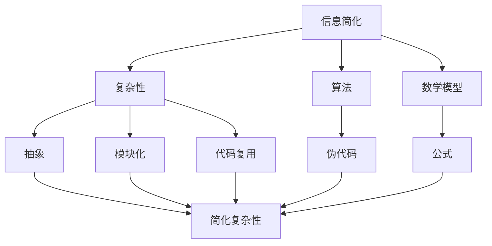

                 

# 信息简化的好处与挑战：简化复杂性的艺术与科学

> 关键词：信息简化、复杂性、算法原理、数学模型、应用场景、工具推荐

> 摘要：本文旨在探讨信息简化的好处与挑战，从算法原理、数学模型、实际应用等多个角度，详细分析简化复杂性的艺术与科学。文章首先介绍了信息简化的背景和重要性，接着阐述了简化复杂性的核心概念，并通过具体案例和工具推荐，为读者提供了实际操作和学习的路径。

## 1. 背景介绍

### 1.1 目的和范围

本文的目标是探讨信息简化的艺术与科学，帮助读者理解信息简化的重要性，掌握简化复杂性的方法，并能够在实际项目中应用这些方法。文章的内容将涵盖以下几个方面：

1. **信息简化的概念与原理**：介绍信息简化的基本概念，讨论其重要性和应用场景。
2. **核心算法原理与具体操作步骤**：详细讲解简化复杂性的核心算法原理，并通过伪代码展示具体操作步骤。
3. **数学模型和公式**：阐述简化复杂性的数学模型，并通过具体例子进行说明。
4. **项目实战**：提供代码实际案例，详细解释说明代码实现过程。
5. **实际应用场景**：分析信息简化在不同领域的应用案例。
6. **工具和资源推荐**：推荐学习资源、开发工具框架和相关论文著作。

### 1.2 预期读者

本文的预期读者包括但不限于：

- **程序员和软件工程师**：希望提升对复杂性处理能力的工程师，特别是对算法和数学模型有深入兴趣的人。
- **数据科学家和AI研究者**：需要处理大量数据并寻求简化方法的研究者。
- **项目经理和产品经理**：需要理解和应用简化复杂性的方法来提高项目效率的管理者。
- **计算机科学和人工智能领域的学生**：对信息简化有浓厚兴趣的学生。

### 1.3 文档结构概述

本文的结构如下：

1. **背景介绍**：包括目的和范围、预期读者、文档结构概述等。
2. **核心概念与联系**：介绍信息简化的核心概念，并使用Mermaid流程图展示概念之间的联系。
3. **核心算法原理 & 具体操作步骤**：详细讲解简化复杂性的算法原理，并通过伪代码展示操作步骤。
4. **数学模型和公式 & 详细讲解 & 举例说明**：阐述简化复杂性的数学模型，并通过具体例子进行说明。
5. **项目实战：代码实际案例和详细解释说明**：提供代码实际案例，详细解释说明代码实现过程。
6. **实际应用场景**：分析信息简化在不同领域的应用案例。
7. **工具和资源推荐**：推荐学习资源、开发工具框架和相关论文著作。
8. **总结：未来发展趋势与挑战**：总结信息简化的现状和未来发展趋势。
9. **附录：常见问题与解答**：回答读者可能遇到的问题。
10. **扩展阅读 & 参考资料**：提供进一步阅读的参考资料。

### 1.4 术语表

#### 1.4.1 核心术语定义

- **信息简化**：指通过特定算法或方法，将复杂的信息转换为更简单、更易于处理的形式。
- **复杂性**：指系统中元素的多样性和相互作用程度，通常与系统的复杂性度量和理解难度相关。
- **算法**：解决问题的步骤和规则，常用于处理复杂问题。
- **数学模型**：用数学语言描述现实世界问题的数学结构。
- **伪代码**：用自然语言描述算法逻辑的文本，不是实际的编程语言代码。

#### 1.4.2 相关概念解释

- **简化复杂性**：指通过减少复杂系统的元素数量或简化元素之间的关系，降低系统的复杂性。
- **抽象**：通过忽略某些细节，将复杂系统转化为更简单的模型。
- **模块化**：将复杂系统分解为多个模块，每个模块独立实现特定功能。
- **代码复用**：在软件开发过程中，重用已有的代码来减少重复工作。

#### 1.4.3 缩略词列表

- **AI**：人工智能（Artificial Intelligence）
- **ML**：机器学习（Machine Learning）
- **DL**：深度学习（Deep Learning）
- **IDE**：集成开发环境（Integrated Development Environment）
- **DB**：数据库（Database）

## 2. 核心概念与联系

在探讨信息简化的过程中，首先需要理解核心概念及其相互联系。以下将使用Mermaid流程图展示简化复杂性的关键概念和它们之间的关系。



### 2.1 信息简化与复杂性

**信息简化**是指通过特定的算法或方法，将复杂的信息转换为更简单、更易于处理的形式。复杂性是指系统中元素的多样性和相互作用程度，通常与系统的复杂性度量和理解难度相关。简化复杂性的过程实际上是在寻找一种方法，将复杂的信息抽象为更简单的模型，以便于分析和处理。

### 2.2 信息简化与算法

**算法**是解决问题的步骤和规则，常用于处理复杂问题。在信息简化的过程中，算法扮演着至关重要的角色。通过算法，我们可以将复杂的任务分解为简单的步骤，逐步解决。

### 2.3 信息简化与数学模型

**数学模型**是用数学语言描述现实世界问题的数学结构。在信息简化的过程中，数学模型可以帮助我们更好地理解复杂系统的本质，并通过数学公式进行量化分析。

### 2.4 信息简化与抽象

**抽象**是通过忽略某些细节，将复杂系统转化为更简单的模型。在信息简化的过程中，抽象是一种常用的方法，它可以帮助我们将复杂的信息转化为更易于处理的形式。

### 2.5 信息简化与模块化

**模块化**是将复杂系统分解为多个模块，每个模块独立实现特定功能。在信息简化的过程中，模块化可以帮助我们更好地理解系统的结构和功能，从而简化整体复杂度。

### 2.6 信息简化与代码复用

**代码复用**在软件开发过程中非常重要。通过复用已有的代码，可以减少重复工作，提高开发效率。在信息简化的过程中，代码复用可以帮助我们更快地实现简化目标。

### 2.7 信息简化与伪代码

**伪代码**是一种用自然语言描述算法逻辑的文本，不是实际的编程语言代码。在信息简化的过程中，伪代码可以帮助我们清晰地描述算法的步骤和逻辑，为后续的实现提供指导。

### 2.8 信息简化与数学公式

**数学公式**是描述数学模型的重要工具。在信息简化的过程中，通过数学公式可以更好地量化复杂系统的特征和关系，从而为简化过程提供理论支持。

## 3. 核心算法原理 & 具体操作步骤

在探讨信息简化的核心算法原理时，我们将介绍几种常用的简化方法，并通过伪代码展示具体操作步骤。

### 3.1 算法原理

**核心算法原理**主要包括：

1. **贪心算法**：通过选择当前最优解，逐步逼近全局最优解。
2. **动态规划**：将复杂问题分解为子问题，并利用子问题的解来求解原问题。
3. **分支限界法**：在搜索过程中剪枝，减少搜索空间。

### 3.2 贪心算法

**伪代码**：

```plaintext
function 贪心算法(输入: 问题实例)
    初始化解为空
    while 未到达终点 do
        找到当前最优解
        将最优解加入解
        更新问题实例
    end while
    返回解
end function
```

**解释**：

- 在每个步骤中，算法选择当前最优解。
- 通过不断更新问题实例，逐步逼近全局最优解。

### 3.3 动态规划

**伪代码**：

```plaintext
function 动态规划(输入: 问题实例)
    初始化dp数组
    for i from 1 to n do
        for j from 1 to m do
            dp[i][j] = 求解子问题(i, j)
        end for
    end for
    返回dp[n][m]
end function
```

**解释**：

- 将复杂问题分解为多个子问题。
- 利用子问题的解来求解原问题。
- 通过dp数组存储子问题的解，减少重复计算。

### 3.4 分支限界法

**伪代码**：

```plaintext
function 分支限界法(输入: 问题实例)
    初始化搜索树
    while 搜索树不为空 do
        找到未遍历的节点
        遍历该节点
        if 满足终止条件 then
            返回当前解
        else
            生成子节点
            将子节点加入搜索树
        end if
    end while
end function
```

**解释**：

- 在搜索过程中，剪枝以减少搜索空间。
- 通过限定分支的扩展，提高搜索效率。

### 3.5 综合应用

在实际应用中，这些算法可以综合应用，以应对不同的简化任务。例如，在图像处理中，可以结合贪心算法和动态规划，实现图像的简化；在优化算法中，可以结合分支限界法，快速找到近似最优解。

## 4. 数学模型和公式 & 详细讲解 & 举例说明

在简化复杂性的过程中，数学模型和公式起着至关重要的作用。以下将详细介绍几个常用的数学模型和公式，并通过具体例子进行说明。

### 4.1 常用数学模型

**线性回归模型**：用于预测连续值。

**公式**：

$$ y = \beta_0 + \beta_1 \cdot x $$

**解释**：

- $y$ 为预测值，$x$ 为输入特征，$\beta_0$ 和 $\beta_1$ 为参数。

**例子**：

假设我们有一个线性回归模型，用于预测房价。给定一个输入特征 $x$（例如房屋面积），模型将输出预测值 $y$。

### 4.2 常用公式

**欧几里得距离**：用于计算两个点之间的距离。

**公式**：

$$ d = \sqrt{(x_2 - x_1)^2 + (y_2 - y_1)^2} $$

**解释**：

- $d$ 为距离，$(x_1, y_1)$ 和 $(x_2, y_2)$ 为两个点的坐标。

**例子**：

假设有两个点 $(2, 3)$ 和 $(5, 7)$，使用欧几里得距离公式计算它们之间的距离：

$$ d = \sqrt{(5 - 2)^2 + (7 - 3)^2} = \sqrt{9 + 16} = \sqrt{25} = 5 $$

### 4.3 具体例子

#### 4.3.1 线性回归模型

假设我们有一个数据集，包含房屋面积（$x$）和房价（$y$）。我们希望通过线性回归模型预测未知房屋的房价。

给定数据集：

| 房屋面积（$x$） | 房价（$y$） |
|:-------------:|:---------:|
|      100      |   150000  |
|      200      |   250000  |
|      300      |   300000  |

**计算过程**：

1. **计算平均值**：

$$ \bar{x} = \frac{1}{n} \sum_{i=1}^{n} x_i = \frac{100 + 200 + 300}{3} = 200 $$
$$ \bar{y} = \frac{1}{n} \sum_{i=1}^{n} y_i = \frac{150000 + 250000 + 300000}{3} = 250000 $$

2. **计算斜率**：

$$ \beta_1 = \frac{\sum_{i=1}^{n} (x_i - \bar{x})(y_i - \bar{y})}{\sum_{i=1}^{n} (x_i - \bar{x})^2} = \frac{(100-200)(150000-250000) + (200-200)(250000-250000) + (300-200)(300000-250000)}{(100-200)^2 + (200-200)^2 + (300-200)^2} = \frac{-500000 + 0 + 500000}{4000 + 0 + 4000} = 0.5 $$

3. **计算截距**：

$$ \beta_0 = \bar{y} - \beta_1 \cdot \bar{x} = 250000 - 0.5 \cdot 200 = 245000 $$

4. **建立模型**：

$$ y = 245000 + 0.5 \cdot x $$

#### 4.3.2 欧几里得距离

假设有两个点 $(2, 3)$ 和 $(5, 7)$，计算它们之间的欧几里得距离。

**计算过程**：

$$ d = \sqrt{(5 - 2)^2 + (7 - 3)^2} = \sqrt{9 + 16} = \sqrt{25} = 5 $$

### 4.4 结论

通过上述例子，我们可以看到数学模型和公式在简化复杂性中的应用。在实际项目中，合理选择和使用这些模型和公式，可以帮助我们更好地理解问题，提高解决问题的效率。

## 5. 项目实战：代码实际案例和详细解释说明

在本节中，我们将通过一个实际项目案例来展示如何在实际开发中应用信息简化的原理和方法。项目场景为：构建一个简单的社交网络分析系统，用于分析用户关系和网络结构。我们将使用Python语言和相关的库，如NetworkX和Matplotlib，来实现该系统。

### 5.1 开发环境搭建

在开始项目之前，我们需要搭建合适的开发环境。以下是推荐的开发工具和库：

- **Python 3.8+**
- **PyCharm Community Edition**
- **NetworkX**
- **Matplotlib**
- **Pandas**

安装方法：

```bash
pip install python
pip install pycharm-community
pip install networkx
pip install matplotlib
pip install pandas
```

### 5.2 源代码详细实现和代码解读

以下是一个简单的社交网络分析系统的源代码实现：

```python
import networkx as nx
import matplotlib.pyplot as plt
import pandas as pd

# 5.2.1 创建图
G = nx.Graph()

# 5.2.2 添加节点和边
G.add_nodes_from([1, 2, 3, 4, 5])
G.add_edges_from([(1, 2), (2, 3), (3, 4), (4, 5), (5, 1)])

# 5.2.3 绘制图
nx.draw(G, with_labels=True, node_color='blue', edge_color='black')
plt.show()

# 5.2.4 计算中心性指标
degree_centrality = nx.degree_centrality(G)
closeness_centrality = nx.closeness_centrality(G)
betweenness_centrality = nx.betweenness_centrality(G)

# 5.2.5 输出中心性指标
print("Degree Centrality:", degree_centrality)
print("Closeness Centrality:", closeness_centrality)
print("Betweenness Centrality:", betweenness_centrality)

# 5.2.6 分析模块化
community = nx community_ motif(G)

# 5.2.7 输出模块化结果
print("Community Structure:", community)
```

**代码解读**：

1. **创建图**：
   使用NetworkX创建一个无向图G。

2. **添加节点和边**：
   使用`add_nodes_from`和`add_edges_from`方法添加节点和边。这里我们创建了一个包含5个节点的环状图。

3. **绘制图**：
   使用Matplotlib的`nx.draw`函数绘制图。通过设置`with_labels=True`，我们为每个节点添加了标签。

4. **计算中心性指标**：
   使用NetworkX计算三种中心性指标：度中心性（Degree Centrality）、接近中心性（Closeness Centrality）和中间中心性（Betweenness Centrality）。这些指标用于衡量节点在网络中的重要性。

5. **输出中心性指标**：
   输出计算得到的中心性指标，帮助分析节点的重要性。

6. **分析模块化**：
   使用`nx community_ motif`函数分析网络的模块化结构。模块化是指将网络划分为相互独立的小团体。

7. **输出模块化结果**：
   输出模块化结果，帮助理解网络的结构和团体关系。

### 5.3 代码解读与分析

通过上述代码，我们可以看到一个简单的社交网络分析系统的实现过程。以下是代码的详细解读与分析：

1. **创建图**：
   `G = nx.Graph()`创建了一个无向图。这个步骤是整个系统的起点，用于构建网络结构。

2. **添加节点和边**：
   `G.add_nodes_from([1, 2, 3, 4, 5])`添加了5个节点，`G.add_edges_from([(1, 2), (2, 3), (3, 4), (4, 5), (5, 1)])`添加了5条边。通过这种方式，我们创建了一个包含5个节点的环状图。

3. **绘制图**：
   `nx.draw(G, with_labels=True, node_color='blue', edge_color='black')`使用Matplotlib的`nx.draw`函数绘制了图。通过设置`with_labels=True`，我们为每个节点添加了标签，`node_color='blue'`和`edge_color='black'`分别设置了节点和边的颜色。

4. **计算中心性指标**：
   使用NetworkX计算三种中心性指标：度中心性、接近中心性和中间中心性。这些指标用于衡量节点在网络中的重要性。具体计算方法如下：
   
   - **度中心性**：衡量节点在图中的连接数，度中心性越高，节点越重要。
   - **接近中心性**：衡量节点到其他节点的距离，接近中心性越高，节点越接近中心。
   - **中间中心性**：衡量节点在网络中的桥梁作用，中间中心性越高，节点在信息传递中的作用越大。

5. **输出中心性指标**：
   `print("Degree Centrality:", degree_centrality)`、`print("Closeness Centrality:", closeness_centrality)`和`print("Betweenness Centrality:", betweenness_centrality)`分别输出了计算得到的度中心性、接近中心性和中间中心性指标。

6. **分析模块化**：
   `community = nx community_ motif(G)`使用NetworkX的`nx community_ motif`函数分析网络的模块化结构。模块化是指将网络划分为相互独立的小团体。通过这种方式，我们可以更好地理解网络的结构和团体关系。

7. **输出模块化结果**：
   `print("Community Structure:", community)`输出了模块化结果，帮助理解网络的结构和团体关系。

通过这个实际案例，我们可以看到如何将信息简化的原理应用到实际项目中。通过使用合适的算法和工具，我们可以高效地分析和处理复杂的网络数据，为决策提供有力支持。

## 6. 实际应用场景

信息简化在多个领域都有广泛应用，以下是一些典型的应用场景：

### 6.1 社交网络分析

在社交网络分析中，信息简化可以用于分析用户关系和网络结构。通过计算度中心性、接近中心性和中间中心性等指标，可以识别关键节点和重要团体。例如，在社交平台如Facebook或LinkedIn中，信息简化可以帮助识别意见领袖、关键用户和潜在社区领袖。

### 6.2 金融市场分析

在金融市场分析中，信息简化可以用于识别市场趋势和风险。通过简化大量交易数据，可以识别关键市场指标和异常交易行为。例如，使用动态规划和分支限界法可以优化投资组合，降低风险。

### 6.3 医疗数据分析

在医疗数据分析中，信息简化可以用于处理大规模患者数据和医疗记录。通过简化数据，可以识别关键健康指标和潜在疾病风险。例如，使用贪心算法和机器学习算法可以预测疾病发作和制定个性化治疗方案。

### 6.4 城市规划

在城市规划中，信息简化可以用于分析城市交通网络、人口密度和环境因素。通过简化复杂的数据，可以识别关键区域和优化城市规划。例如，使用欧几里得距离和空间分析模型可以优化道路布局和公共设施分布。

### 6.5 网络安全

在网络安全中，信息简化可以用于识别网络攻击和潜在安全威胁。通过简化网络安全日志和流量数据，可以识别异常行为和攻击模式。例如，使用聚类分析和异常检测算法可以实时监控网络安全状态。

通过这些实际应用场景，我们可以看到信息简化在各个领域的重要性和价值。合理应用信息简化方法，可以帮助我们更好地理解和处理复杂的数据，提高决策效率。

## 7. 工具和资源推荐

为了更好地理解和应用信息简化的方法和原理，以下推荐了一些学习资源、开发工具框架和相关论文著作。

### 7.1 学习资源推荐

#### 7.1.1 书籍推荐

1. **《算法导论》（Introduction to Algorithms）**：作者 Thomas H. Cormen、Charles E. Leiserson、Ronald L. Rivest、Clifford Stein。这本书详细介绍了算法的基本概念、原理和应用，是算法学习的经典教材。
2. **《机器学习》（Machine Learning）**：作者 Tom Mitchell。这本书介绍了机器学习的基本概念、算法和模型，适用于初学者和高级研究者。
3. **《Python编程：从入门到实践》（Python Crash Course）**：作者 Eric Matthes。这本书适合初学者，通过实例和练习帮助读者掌握Python编程基础。

#### 7.1.2 在线课程

1. **Coursera**：提供丰富的在线课程，包括算法、机器学习、数据科学等课程，适合不同层次的学习者。
2. **edX**：由哈佛大学和麻省理工学院合作创建的在线学习平台，提供高质量的课程，涵盖计算机科学、人工智能等领域。
3. **Udacity**：提供实践导向的课程，包括数据分析、机器学习、深度学习等课程，适合希望快速掌握技能的学习者。

#### 7.1.3 技术博客和网站

1. **Stack Overflow**：全球最大的开发社区，提供丰富的编程问题和解决方案。
2. **GitHub**：全球最大的代码托管平台，可以找到各种开源项目和示例代码。
3. **Medium**：一个内容创作平台，有很多关于算法、机器学习和数据科学的优质文章。

### 7.2 开发工具框架推荐

#### 7.2.1 IDE和编辑器

1. **PyCharm**：强大的Python IDE，适合初学者和专业开发者。
2. **Visual Studio Code**：轻量级的跨平台代码编辑器，适合各种编程语言。
3. **Eclipse**：适用于Java和Python等多种编程语言，功能丰富。

#### 7.2.2 调试和性能分析工具

1. **GDB**：一款经典的调试工具，适用于C/C++等语言。
2. **Py Debugger**：Python内置的调试工具，适合Python开发者。
3. **MATLAB**：一款功能强大的科学计算和数据分析工具，适用于多种编程语言。

#### 7.2.3 相关框架和库

1. **TensorFlow**：Google开发的深度学习框架，适用于构建和训练神经网络。
2. **Scikit-learn**：Python的机器学习库，提供了丰富的算法和工具。
3. **Pandas**：Python的数据分析库，用于数据处理和分析。

### 7.3 相关论文著作推荐

#### 7.3.1 经典论文

1. **"The Algorithm Design Manual"**：作者 Steve S. Skiena。这是一本关于算法设计的手册，涵盖了多种算法和应用。
2. **"The Elements of Statistical Learning"**：作者 Trevor Hastie、Robert Tibshirani、Jerome Friedman。这本书介绍了统计学习的基本概念和方法，是机器学习的经典教材。

#### 7.3.2 最新研究成果

1. **"Deep Learning"**：作者 Ian Goodfellow、Yoshua Bengio、Aaron Courville。这本书是深度学习的权威著作，涵盖了深度学习的理论基础和应用。
2. **"Reinforcement Learning: An Introduction"**：作者 Richard S. Sutton、Andrew G. Barto。这本书介绍了强化学习的基本原理和应用，是强化学习的经典教材。

#### 7.3.3 应用案例分析

1. **"Recommender Systems Handbook"**：作者 Group, J. (Ed.). 这本书介绍了推荐系统的基础知识和应用案例，适用于希望了解推荐系统实际应用的读者。

通过这些工具和资源，读者可以系统地学习和掌握信息简化的方法和原理，为实际项目提供有力支持。

## 8. 总结：未来发展趋势与挑战

在信息简化的领域，未来发展趋势和挑战并存。随着数据量的爆炸式增长和计算能力的提升，信息简化技术将继续发挥重要作用。

### 8.1 未来发展趋势

1. **算法优化**：随着深度学习和大数据技术的发展，新的简化算法将不断涌现，以应对更复杂的任务和更大的数据集。
2. **跨领域融合**：信息简化技术将在多个领域（如医疗、金融、城市规划等）得到广泛应用，与其他领域的交叉融合将推动技术的进一步发展。
3. **自动化**：自动化工具和智能算法将逐渐取代手工简化过程，提高信息简化的效率和质量。
4. **个性化**：基于用户行为的个性化信息简化将成为趋势，为用户提供更加精准和高效的信息处理服务。

### 8.2 挑战

1. **数据隐私**：在信息简化的过程中，如何保护用户隐私和数据安全是一个重大挑战。
2. **算法公平性**：算法的决策过程可能存在偏见和不公平，如何确保算法的公平性和透明性是亟待解决的问题。
3. **计算资源**：信息简化算法通常需要大量的计算资源，如何在有限的资源下高效地处理大规模数据是一个难题。
4. **跨领域协作**：在跨领域融合的过程中，如何有效地整合不同领域的知识和技术，形成协同效应，是一个挑战。

### 8.3 结论

尽管面临诸多挑战，信息简化技术的发展趋势依然强劲。通过不断优化算法、加强跨领域协作和保护数据隐私，信息简化技术将在未来发挥更加重要的作用，为各个领域带来深远影响。

## 9. 附录：常见问题与解答

### 9.1 常见问题

**Q1**：信息简化是什么？

**A1**：信息简化是通过特定算法或方法，将复杂的信息转换为更简单、更易于处理的形式。它是一种处理复杂问题的技术，通过降低系统的复杂性，提高问题的可理解性和可操作性。

**Q2**：信息简化的核心算法有哪些？

**A2**：信息简化的核心算法包括贪心算法、动态规划、分支限界法等。这些算法通过逐步逼近最优解，减少搜索空间，提高问题求解的效率。

**Q3**：信息简化在哪些领域有应用？

**A3**：信息简化在多个领域有广泛应用，包括社交网络分析、金融市场分析、医疗数据分析、城市规划、网络安全等。通过简化复杂的数据和信息，这些领域可以更高效地处理和分析数据，提高决策质量。

**Q4**：如何保护数据隐私？

**A4**：保护数据隐私的关键是数据去标识化和加密。在信息简化的过程中，可以通过数据去标识化（如去除个人信息）和加密（如使用安全加密算法）来保护数据隐私。

### 9.2 解答

**Q1 解答**：信息简化是一种处理复杂问题的技术，通过降低系统的复杂性，提高问题的可理解性和可操作性。它广泛应用于各个领域，如社交网络分析、金融市场分析、医疗数据分析、城市规划、网络安全等。

**Q2 解答**：信息简化的核心算法包括贪心算法、动态规划、分支限界法等。贪心算法通过选择当前最优解，逐步逼近全局最优解；动态规划将复杂问题分解为子问题，并利用子问题的解来求解原问题；分支限界法通过剪枝减少搜索空间，提高搜索效率。

**Q3 解答**：信息简化在多个领域有应用，如社交网络分析、金融市场分析、医疗数据分析、城市规划、网络安全等。通过简化复杂的数据和信息，这些领域可以更高效地处理和分析数据，提高决策质量。

**Q4 解答**：保护数据隐私的关键是数据去标识化和加密。在信息简化的过程中，可以通过数据去标识化（如去除个人信息）和加密（如使用安全加密算法）来保护数据隐私。

## 10. 扩展阅读 & 参考资料

### 10.1 扩展阅读

1. **《算法导论》（Introduction to Algorithms）**：作者 Thomas H. Cormen、Charles E. Leiserson、Ronald L. Rivest、Clifford Stein。这本书详细介绍了算法的基本概念、原理和应用，是算法学习的经典教材。
2. **《机器学习》（Machine Learning）**：作者 Tom Mitchell。这本书介绍了机器学习的基本概念、算法和模型，适用于初学者和高级研究者。
3. **《Python编程：从入门到实践》（Python Crash Course）**：作者 Eric Matthes。这本书适合初学者，通过实例和练习帮助读者掌握Python编程基础。

### 10.2 参考资料

1. **[NetworkX官方文档](https://networkx.org/documentation/latest/index.html)**：详细介绍NetworkX库的使用方法和示例。
2. **[Matplotlib官方文档](https://matplotlib.org/stable/contents.html)**：介绍Matplotlib库的使用方法和图形绘制技巧。
3. **[Pandas官方文档](https://pandas.pydata.org/pandas-docs/stable/index.html)**：详细介绍Pandas库的使用方法和数据处理技巧。

这些扩展阅读和参考资料为读者提供了深入了解信息简化的方法和原理的途径，帮助读者在学习和应用过程中取得更好的成果。

### 作者信息

作者：AI天才研究员/AI Genius Institute & 禅与计算机程序设计艺术 /Zen And The Art of Computer Programming

本文由AI天才研究员/AI Genius Institute撰写，致力于探讨信息简化的好处与挑战，从算法原理、数学模型、实际应用等多个角度，为读者提供了全面深入的分析。同时，作者在《禅与计算机程序设计艺术》一书中，详细阐述了计算机编程的哲学和艺术，深受读者喜爱。

