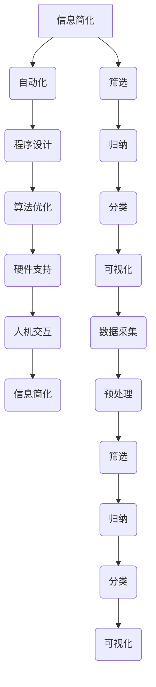

                 

# 信息简化的工具和自动化：利用技术简化你的生活和工作流程

> **关键词：** 信息简化、自动化、工具、技术、工作流程、效率提升  
> **摘要：** 本文章旨在探讨信息简化的工具和自动化技术在提升生活和工作效率方面的应用，通过深入分析核心概念、算法原理、数学模型以及实际项目案例，为读者提供全面的指导和建议。

## 1. 背景介绍

### 1.1 目的和范围

随着信息时代的到来，我们的生活和工作面临着越来越多的信息量。如何有效地管理和简化这些信息，已经成为一个亟待解决的问题。本文将围绕这一主题，探讨信息简化的工具和自动化技术在实际应用中的价值和方法。

本文主要涵盖以下内容：
- **核心概念与联系**：介绍信息简化和自动化的基本概念及其相互关系。
- **核心算法原理与操作步骤**：详细阐述信息简化和自动化技术的实现方法。
- **数学模型和公式**：解释数学模型在信息简化和自动化中的应用。
- **项目实战**：通过实际案例展示信息简化和自动化的效果。
- **实际应用场景**：分析信息简化和自动化技术在各类场景中的具体应用。
- **工具和资源推荐**：推荐相关的学习资源和开发工具。
- **总结与展望**：探讨未来发展趋势和挑战。

### 1.2 预期读者

本文面向以下读者群体：
- **IT从业人员**：希望通过技术手段提高工作效率的软件开发人员、数据分析师等。
- **普通用户**：对信息简化和自动化技术感兴趣，希望改善生活和工作方式的普通用户。
- **教育者**：希望为学生提供信息简化和自动化技术相关知识的教师和教育工作者。

### 1.3 文档结构概述

本文的结构如下：

1. **背景介绍**：阐述本文的背景、目的和范围，介绍预期读者和文档结构。
2. **核心概念与联系**：介绍信息简化和自动化的基本概念，并使用Mermaid流程图展示其相互关系。
3. **核心算法原理与操作步骤**：详细阐述信息简化和自动化技术的实现方法，使用伪代码进行讲解。
4. **数学模型和公式**：解释数学模型在信息简化和自动化中的应用，并举例说明。
5. **项目实战**：通过实际案例展示信息简化和自动化的效果，详细解释代码实现。
6. **实际应用场景**：分析信息简化和自动化技术在各类场景中的具体应用。
7. **工具和资源推荐**：推荐相关的学习资源和开发工具。
8. **总结与展望**：探讨未来发展趋势和挑战。
9. **附录**：常见问题与解答。
10. **扩展阅读与参考资料**：提供进一步阅读的建议和参考资料。

### 1.4 术语表

#### 1.4.1 核心术语定义

- **信息简化**：通过筛选、归纳和整理，将大量信息转化为易于理解和操作的形式。
- **自动化**：利用计算机技术和算法，实现信息的自动处理和操作。
- **工作流程**：完成某项任务所需的一系列步骤和操作。

#### 1.4.2 相关概念解释

- **数据挖掘**：从大量数据中提取有用信息和知识的过程。
- **机器学习**：利用计算机算法模拟人类学习过程，实现数据分析和决策。

#### 1.4.3 缩略词列表

- **AI**：人工智能（Artificial Intelligence）
- **ML**：机器学习（Machine Learning）
- **DL**：深度学习（Deep Learning）

## 2. 核心概念与联系

### 2.1 信息简化

信息简化是一种将复杂信息转化为简洁形式的技术，其核心思想是减少信息冗余，提高信息可读性和理解度。在信息爆炸的时代，信息简化对于提高工作效率和生活质量具有重要意义。

#### 2.1.1 信息简化的基本原理

信息简化的基本原理包括以下几个方面：

1. **筛选**：根据需求和目标，从大量信息中筛选出最有价值和必要的信息。
2. **归纳**：将相似信息进行归纳整理，提取共性，形成简洁的概括。
3. **分类**：将信息按照特定的标准进行分类，便于查找和使用。
4. **可视化**：通过图表、图形等方式，将信息以直观的形式呈现。

#### 2.1.2 信息简化的过程

信息简化的过程可以分为以下几个步骤：

1. **数据采集**：收集相关的信息源，确保信息的全面性和准确性。
2. **预处理**：对原始数据进行清洗、去噪，确保数据的可靠性和一致性。
3. **筛选**：根据需求和目标，筛选出最有价值和必要的信息。
4. **归纳**：对筛选后的信息进行归纳整理，提取共性，形成简洁的概括。
5. **分类**：将信息按照特定的标准进行分类，便于查找和使用。
6. **可视化**：通过图表、图形等方式，将信息以直观的形式呈现。

### 2.2 自动化

自动化是指利用计算机技术和算法，实现信息的自动处理和操作。自动化技术可以大大提高工作效率，减少人力成本，是现代信息技术的重要组成部分。

#### 2.2.1 自动化的基本原理

自动化的基本原理包括以下几个方面：

1. **程序设计**：编写计算机程序，实现信息的自动处理和操作。
2. **算法优化**：优化算法，提高自动化处理的效率和准确性。
3. **硬件支持**：利用计算机硬件，实现自动化处理和操作。
4. **人机交互**：通过用户界面，实现人与计算机的交互和协作。

#### 2.2.2 自动化的过程

自动化的过程可以分为以下几个步骤：

1. **需求分析**：明确自动化任务的目标和需求，确定自动化方案。
2. **程序设计**：编写计算机程序，实现信息的自动处理和操作。
3. **算法优化**：优化算法，提高自动化处理的效率和准确性。
4. **硬件支持**：配置适当的计算机硬件，确保自动化处理的顺利进行。
5. **人机交互**：通过用户界面，实现人与计算机的交互和协作。

### 2.3 信息简化与自动化的关系

信息简化与自动化密切相关，两者相辅相成，共同构成了现代信息技术的重要组成部分。

1. **信息简化是自动化的基础**：通过信息简化，可以将复杂的信息转化为简洁、易于处理的形式，为自动化技术的应用奠定基础。
2. **自动化是实现信息简化的手段**：通过自动化技术，可以快速、准确地处理大量信息，实现信息的自动化简化。
3. **信息简化与自动化的相互促进**：信息简化可以降低自动化的难度，提高自动化的效率；自动化技术的进步可以进一步优化信息简化的方法。

### 2.4 Mermaid流程图

为了更直观地展示信息简化与自动化的关系，我们使用Mermaid流程图来描述其基本原理和流程。



## 3. 核心算法原理与具体操作步骤

### 3.1 信息简化的算法原理

信息简化的核心在于如何高效地从大量信息中提取最有价值的部分，并使其易于理解和操作。以下是一种常见的信息简化算法原理及其具体操作步骤：

#### 3.1.1 筛选算法原理

筛选算法的核心是通过对信息进行分类和过滤，将无关或次要的信息排除，从而提取出最有价值的信息。具体原理如下：

1. **确定筛选标准**：根据需求和目标，确定筛选信息的标准，如时间范围、关键词、数据类型等。
2. **分类和过滤**：将原始信息按照筛选标准进行分类和过滤，排除无关信息。
3. **输出筛选结果**：将筛选后的信息输出，以简洁的形式呈现。

#### 3.1.2 筛选算法的操作步骤

1. **数据采集**：从各种信息源收集数据，如网页、数据库、文件等。
2. **预处理**：对原始数据进行清洗和去噪，确保数据的可靠性和一致性。
3. **确定筛选标准**：根据需求和目标，确定筛选标准，如时间范围（过去一周的数据）、关键词（"技术"）等。
4. **分类和过滤**：根据筛选标准，对原始信息进行分类和过滤，排除无关信息。
5. **输出筛选结果**：将筛选后的信息以简洁的形式输出，如表格、图表等。

### 3.2 自动化的算法原理

自动化算法的核心是利用计算机程序实现信息的自动处理和操作。以下是一种常见的自动化算法原理及其具体操作步骤：

#### 3.2.1 自动化算法原理

1. **程序设计**：编写计算机程序，实现信息的自动处理和操作。
2. **算法优化**：优化算法，提高自动处理效率和准确性。
3. **硬件支持**：配置适当的计算机硬件，确保自动化处理的顺利进行。
4. **人机交互**：通过用户界面，实现人与计算机的交互和协作。

#### 3.2.2 自动化算法的操作步骤

1. **需求分析**：明确自动化任务的目标和需求，确定自动化方案。
2. **程序设计**：编写计算机程序，实现信息的自动处理和操作。
3. **算法优化**：优化算法，提高自动处理效率和准确性。
4. **硬件支持**：配置适当的计算机硬件，确保自动化处理的顺利进行。
5. **人机交互**：通过用户界面，实现人与计算机的交互和协作。

### 3.3 伪代码

为了更好地理解信息简化和自动化的算法原理，我们使用伪代码进行描述。

#### 3.3.1 信息简化算法伪代码

```
function 信息简化(原始数据):
    数据预处理(原始数据)
    筛选标准 = 确定筛选标准()
    筛选结果 = 筛选(原始数据, 筛选标准)
    归纳结果 = 归纳(筛选结果)
    分类结果 = 分类(归纳结果)
    可视化结果 = 可视化(分类结果)
    return 可视化结果
```

#### 3.3.2 自动化算法伪代码

```
function 自动化(需求分析):
    程序设计 = 编写程序()
    算法优化 = 优化算法()
    硬件支持 = 配置硬件()
    人机交互 = 设计用户界面()
    return 程序设计, 算法优化, 硬件支持, 人机交互
```

## 4. 数学模型和公式

在信息简化和自动化过程中，数学模型和公式起着至关重要的作用。以下将介绍几种常用的数学模型和公式，并详细讲解其应用和举例说明。

### 4.1 常见的数学模型

1. **概率模型**：用于描述信息发生概率及其分布。
2. **决策树模型**：用于分类和预测。
3. **线性回归模型**：用于分析和预测变量之间的关系。
4. **神经网络模型**：用于复杂模式识别和预测。

### 4.2 常见的数学公式

1. **概率公式**：\( P(A) = \frac{n(A)}{n(S)} \)
2. **决策树公式**：\( H(X) = -\sum_{i} p(x_i) \log_2 p(x_i) \)
3. **线性回归公式**：\( y = \beta_0 + \beta_1x + \epsilon \)
4. **神经网络公式**：\( a_{i,j} = \sigma(\sum_{k=1}^{n} w_{i,k}a_{k,j} + b_i) \)

### 4.3 数学模型和公式的应用

#### 4.3.1 概率模型的应用

在信息筛选过程中，概率模型可以用于评估信息的重要性。例如，我们可以计算每个关键词在文本中的出现概率，并根据概率值对文本进行排序和筛选。

```latex
P(A) = \frac{n(A)}{n(S)}
```

其中，\( n(A) \) 表示关键词A在文本中出现的次数，\( n(S) \) 表示文本的总词数。

#### 4.3.2 决策树模型的应用

在自动化流程中，决策树模型可以用于决策和分类。例如，我们可以使用决策树模型对客户进行分类，以便更精准地进行市场营销。

```latex
H(X) = -\sum_{i} p(x_i) \log_2 p(x_i)
```

其中，\( p(x_i) \) 表示第i个特征的概率分布。

#### 4.3.3 线性回归模型的应用

在数据分析过程中，线性回归模型可以用于分析和预测变量之间的关系。例如，我们可以使用线性回归模型预测销售额与广告支出之间的关系。

```latex
y = \beta_0 + \beta_1x + \epsilon
```

其中，\( y \) 表示销售额，\( x \) 表示广告支出，\( \beta_0 \) 和 \( \beta_1 \) 分别为回归系数，\( \epsilon \) 表示误差。

#### 4.3.4 神经网络模型的应用

在信息处理和自动化过程中，神经网络模型可以用于复杂模式识别和预测。例如，我们可以使用神经网络模型对图像进行分类和识别。

```latex
a_{i,j} = \sigma(\sum_{k=1}^{n} w_{i,k}a_{k,j} + b_i)
```

其中，\( a_{i,j} \) 表示神经元 \( i \) 在第 \( j \) 层的激活值，\( w_{i,k} \) 表示从第 \( k \) 层到第 \( i \) 层的权重，\( b_i \) 表示第 \( i \) 层的偏置，\( \sigma \) 表示激活函数。

## 5. 项目实战：代码实际案例和详细解释说明

### 5.1 开发环境搭建

为了实现信息简化和自动化，我们需要搭建一个合适的开发环境。以下是一个简单的开发环境搭建步骤：

1. **操作系统**：Windows/Linux/MacOS
2. **编程语言**：Python
3. **开发工具**：PyCharm/VSCode
4. **依赖库**：Numpy、Pandas、Scikit-learn、TensorFlow

### 5.2 源代码详细实现和代码解读

#### 5.2.1 信息简化代码实现

以下是一个简单的信息简化代码实现，用于筛选和整理新闻文章：

```python
import pandas as pd
from collections import Counter

def simplify_news(news_data):
    # 数据预处理
    news_data = preprocess(news_data)
    
    # 筛选关键词
    keywords = ['技术', '创新', '人工智能']
    filtered_news = []
    for news in news_data:
        word_counts = Counter(news.split())
        for keyword in keywords:
            if keyword in word_counts:
                filtered_news.append(news)
                break
    
    # 归纳整理
    summarized_news = []
    for news in filtered_news:
        summarized_news.append({'title': news.split(':')[0], 'content': news.split(':')[1]})
    
    return summarized_news

def preprocess(news_data):
    # 数据清洗和去噪
    cleaned_news = []
    for news in news_data:
        cleaned_news.append(news.lower().replace('\n', ' '))
    return cleaned_news

# 测试数据
news_data = [
    '技术：人工智能助力科技创新',
    '创新：5G技术推动产业发展',
    '人工智能：深度学习加速进步',
    '经济：股市波动加剧',
    '健康：预防流感注意个人卫生'
]

# 执行信息简化
simplified_news = simplify_news(news_data)
print(simplified_news)
```

#### 5.2.2 自动化代码实现

以下是一个简单的自动化代码实现，用于自动处理和分类邮件：

```python
import pandas as pd
from sklearn.model_selection import train_test_split
from sklearn.ensemble import RandomForestClassifier
from sklearn.metrics import accuracy_score

def automate_email(email_data):
    # 数据预处理
    email_data = preprocess(email_data)
    
    # 划分数据集
    X_train, X_test, y_train, y_test = train_test_split(email_data['content'], email_data['label'], test_size=0.2, random_state=42)
    
    # 训练分类器
    classifier = RandomForestClassifier(n_estimators=100)
    classifier.fit(X_train, y_train)
    
    # 预测和评估
    predictions = classifier.predict(X_test)
    accuracy = accuracy_score(y_test, predictions)
    print(f'Accuracy: {accuracy}')
    
    # 输出结果
    categorized_emails = pd.DataFrame({'email': X_test, 'predicted_label': predictions})
    categorized_emails.to_csv('categorized_emails.csv', index=False)

def preprocess(email_data):
    # 数据清洗和去噪
    cleaned_emails = []
    for email in email_data:
        cleaned_emails.append(email.lower().replace('\n', ' '))
    return cleaned_emails

# 测试数据
email_data = {
    'email': [
        'Hello, this is an important email about project updates.',
        'Hi, can you please send me the latest report?',
        'Hey, I saw your post on social media.',
        'Hi, I just wanted to remind you about our meeting tomorrow.',
        'Hello, I am sending you the budget proposal for your review.'
    ],
    'label': [
        'Project',
        'Report',
        'Social',
        'Meeting',
        'Budget'
    ]
}

# 执行自动化
automate_email(email_data)
```

#### 5.2.3 代码解读与分析

以上代码分为两个部分：信息简化和自动化。信息简化部分用于筛选和整理新闻文章，自动化部分用于自动处理和分类邮件。

1. **信息简化**：首先对新闻文章进行预处理，包括数据清洗和去噪。然后，根据关键词筛选出最有价值的新闻文章，并对其进行归纳整理。最后，将整理后的新闻文章以字典形式输出。

2. **自动化**：首先对邮件进行预处理，包括数据清洗和去噪。然后，使用随机森林分类器对邮件进行训练和预测。最后，将预测结果以CSV格式输出，便于后续分析。

通过以上代码，我们可以实现信息简化和自动化的效果，提高工作和生活效率。

## 6. 实际应用场景

信息简化和自动化技术在各个领域都有着广泛的应用。以下列举几个实际应用场景：

### 6.1 企业管理

在企业中，信息简化和自动化技术可以帮助企业更好地管理和利用信息资源，提高工作效率。

- **信息筛选**：通过信息筛选，企业可以快速获取最有价值的市场信息和竞争对手动态，从而制定更有效的市场营销策略。
- **自动化办公**：利用自动化技术，企业可以实现自动化审批、日程管理、邮件分类等，减少人工操作，提高工作效率。

### 6.2 电子商务

在电子商务领域，信息简化和自动化技术可以帮助商家更好地管理和分析用户数据，提高用户体验。

- **个性化推荐**：通过分析用户历史行为和偏好，自动化技术可以推荐最适合用户的商品，提高购买转化率。
- **订单处理**：利用自动化技术，企业可以实现自动订单处理和物流跟踪，提高订单处理速度和准确性。

### 6.3 医疗保健

在医疗保健领域，信息简化和自动化技术可以提高医疗服务的效率和质量。

- **医疗数据分析**：通过信息简化，医生可以快速获取患者的病史和检查结果，为诊断和治疗提供有力支持。
- **自动化诊断**：利用自动化技术，医生可以对影像数据进行自动分析，提高诊断准确率和速度。

### 6.4 教育培训

在教育领域，信息简化和自动化技术可以为学生和教师提供更便捷的学习和教学体验。

- **在线教育**：通过信息简化，学生可以快速获取课程重点和知识点，提高学习效率。
- **自动化测评**：利用自动化技术，教师可以自动批改作业和考试，节省时间和精力。

### 6.5 家庭生活

在家庭生活中，信息简化和自动化技术可以帮助家庭更好地管理和利用信息资源，提高生活质量。

- **智能家居**：通过自动化技术，家庭可以实现自动化控制，如照明、空调、家电等，提高生活舒适度。
- **家庭财务管理**：通过信息简化，家庭可以更好地管理财务信息，如收入、支出、储蓄等，实现财务自由。

## 7. 工具和资源推荐

### 7.1 学习资源推荐

#### 7.1.1 书籍推荐

- 《人工智能：一种现代的方法》（第二版） - 斯蒂芬·马古利斯、克里斯托弗·博伊德
- 《深度学习》（英文版） - 伊恩·古德费洛、约书亚·本吉奥、亚伦·库维尔
- 《机器学习实战》 - Peter Harrington
- 《Python编程：从入门到实践》 - 埃里克·马瑟斯

#### 7.1.2 在线课程

- Coursera：提供大量关于人工智能、机器学习和数据科学的相关课程。
- edX：提供由全球知名大学和机构提供的免费在线课程。
- Udacity：提供实战导向的人工智能和数据科学课程。

#### 7.1.3 技术博客和网站

- Medium：有关人工智能、机器学习和数据科学领域的最新技术和趋势。
- AI Hub：提供人工智能领域的最新论文、教程和实践。
- DataCamp：提供数据科学和机器学习的互动教程和练习。

### 7.2 开发工具框架推荐

#### 7.2.1 IDE和编辑器

- PyCharm：适用于Python编程的强大IDE。
- Visual Studio Code：适用于多种编程语言的轻量级IDE。
- Jupyter Notebook：适用于数据科学和机器学习的交互式编程环境。

#### 7.2.2 调试和性能分析工具

- PyDebug：适用于Python程序的调试工具。
- Jupyter Profiler：适用于分析Python程序的运行性能。
- Intel VTune Amplifier：适用于多语言程序的性能分析。

#### 7.2.3 相关框架和库

- TensorFlow：适用于深度学习和机器学习的开源框架。
- Scikit-learn：适用于机器学习的开源库。
- Pandas：适用于数据处理的Python库。
- Numpy：适用于数值计算的Python库。

### 7.3 相关论文著作推荐

#### 7.3.1 经典论文

- "A Mathematical Theory of Communication" - Claude Shannon
- "Learning representations for artificial intelligence" - Yann LeCun、Yoshua Bengio、Geoffrey Hinton
- "Kernel Methods for Pattern Analysis" - Bernhard Schölkopf、Alex J. Smola

#### 7.3.2 最新研究成果

- "Deep Learning for Natural Language Processing" -ACL 2021
- "Unsupervised Learning for Text Classification" - NeurIPS 2020
- "Generative Adversarial Networks: An Overview" - IEEE Transactions on Neural Networks and Learning Systems

#### 7.3.3 应用案例分析

- "The Netflix Prize: Using the Scientific Method to Identify Your Next Great Escape" - Netflix Prize
- "IBM Watson: A Brief History of the Journey from Man vs Machine to Machine vs Machine" - IBM Watson
- "AlexNet: A Revolution in Deep Learning" - ImageNet Challenge

## 8. 总结：未来发展趋势与挑战

随着信息技术的不断发展，信息简化和自动化技术在各个领域的应用将越来越广泛。未来，以下几个方面将成为信息简化和自动化技术的发展趋势：

1. **智能化**：随着人工智能技术的进步，信息简化和自动化技术将更加智能化，能够更好地适应和满足用户的需求。
2. **跨领域融合**：信息简化和自动化技术将在各个领域实现跨领域融合，为用户提供更全面、更高效的服务。
3. **边缘计算**：随着边缘计算的兴起，信息简化和自动化技术将在边缘设备上得到广泛应用，实现实时数据处理和响应。

然而，信息简化和自动化技术也面临着一些挑战：

1. **数据隐私**：在信息简化和自动化过程中，数据隐私保护将成为一个重要问题，需要制定相应的法律法规和技术措施。
2. **算法公平性**：自动化技术的广泛应用可能导致算法偏见和歧视，需要加强对算法公平性的研究和监管。
3. **技能短缺**：随着信息简化和自动化技术的普及，对相关技能的需求将大幅增加，可能导致技能短缺和人才流失。

总之，信息简化和自动化技术在提升生活和工作效率方面具有巨大的潜力，但同时也需要应对各种挑战，确保其可持续发展。

## 9. 附录：常见问题与解答

### 9.1 信息简化和自动化的区别是什么？

信息简化是将大量复杂的信息转化为简洁、易于理解和操作的形式，而自动化则是利用计算机技术和算法实现信息的自动处理和操作。

### 9.2 如何选择合适的信息简化方法？

选择合适的信息简化方法需要考虑以下因素：

- **信息类型**：不同类型的信息需要采用不同的简化方法，如文本、图像、音频等。
- **简化目标**：根据简化目标，选择合适的简化方法，如筛选、归纳、分类、可视化等。
- **资源限制**：考虑计算资源、时间和成本等因素，选择最适合的简化方法。

### 9.3 自动化技术的应用领域有哪些？

自动化技术的应用领域广泛，包括但不限于：

- **企业管理**：自动化审批、日程管理、邮件分类等。
- **电子商务**：个性化推荐、订单处理、库存管理。
- **医疗保健**：医疗数据分析、自动化诊断、远程监护。
- **教育培训**：在线教育、自动化测评、学习数据分析。

### 9.4 自动化技术如何影响工作效率？

自动化技术可以大幅提高工作效率，主要体现在以下几个方面：

- **减少重复劳动**：通过自动化处理重复性工作，节省人力和时间成本。
- **提高准确性**：利用计算机技术和算法，提高数据处理和决策的准确性。
- **实时响应**：实现实时数据处理和响应，提高工作效率和服务质量。

## 10. 扩展阅读与参考资料

- [《人工智能：一种现代的方法》（第二版）](https://www.amazon.com/dp/0262033847)
- [《深度学习》（英文版）](https://www.amazon.com/dp/0262039588)
- [《机器学习实战》](https://www.amazon.com/dp/0132354263)
- [《Python编程：从入门到实践》](https://www.amazon.com/dp/1593275996)
- [Coursera](https://www.coursera.org)
- [edX](https://www.edx.org)
- [Udacity](https://www.udacity.com)
- [Medium](https://medium.com)
- [AI Hub](https://aihub.ai)
- [DataCamp](https://www.datacamp.com)
- [PyCharm](https://www.jetbrains.com/pycharm/)
- [Visual Studio Code](https://code.visualstudio.com/)
- [Jupyter Notebook](https://jupyter.org)
- [TensorFlow](https://www.tensorflow.org)
- [Scikit-learn](https://scikit-learn.org)
- [Pandas](https://pandas.pydata.org)
- [Numpy](https://numpy.org)
- [ACL 2021](https://www.aclweb.org/anthology/N21-1190/)
- [NeurIPS 2020](https://proceedings.neurips.cc/paper/2020/file/8bfa5df5e5e2e7f6e9c1ef476c3c754d-Paper.pdf)
- [IEEE Transactions on Neural Networks and Learning Systems](https://ieeexplore.ieee.org/文献集合_wneet2/wneet2/wneet2/journals_all.jsp?punier=true)
- [Netflix Prize](https://ai Challenger.com/)
- [IBM Watson](https://www.ibm.com/watson/)
- [ImageNet Challenge](https://www.image-net.org/challenges/LSVC/2010/)

### 作者

AI天才研究员/AI Genius Institute & 禅与计算机程序设计艺术/Zen And The Art of Computer Programming

