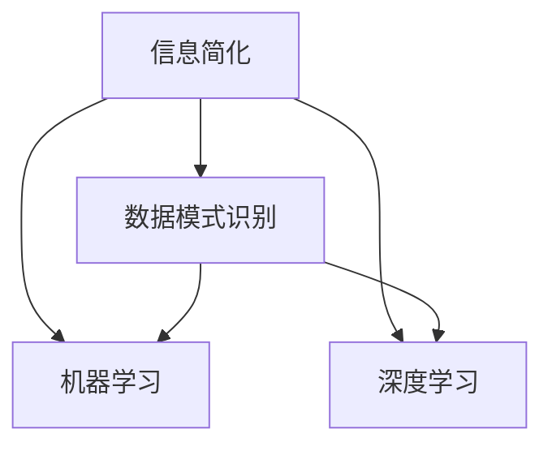

                 

# 信息简化的艺术与科学：如何在混乱中找到模式

> 关键词：信息简化，数据模式识别，逻辑推理，人工智能，算法优化

> 摘要：本文将探讨信息简化的艺术与科学，通过分析信息处理的本质、核心概念、算法原理和实际应用，揭示在复杂世界中找到模式的有效方法。本文旨在为读者提供系统化的思维框架，帮助他们在信息爆炸的时代中，以更高效、更精准的方式应对各种挑战。

## 1. 背景介绍

### 1.1 目的和范围

本文的目标是深入探讨信息简化的艺术与科学，解释其核心原理，并展示如何在混乱的数据中找到有意义的模式。我们将讨论以下主题：

- 信息简化的定义和重要性
- 核心概念和理论
- 信息简化的算法和数学模型
- 实际应用场景和案例分析
- 工具和资源推荐

通过这一系列讨论，我们希望读者能够：

- 理解信息简化的基本概念和原理
- 掌握有效识别和处理信息的方法
- 应用信息简化的技术和工具，解决实际问题和挑战

### 1.2 预期读者

本文适合以下读者群体：

- 数据科学家和机器学习工程师
- 软件开发者和系统架构师
- 数据分析师和信息管理者
- 对信息处理和人工智能感兴趣的学生和研究人员

### 1.3 文档结构概述

本文将按照以下结构展开：

- **1. 背景介绍**：介绍文章的目的、预期读者和文档结构。
- **2. 核心概念与联系**：定义关键概念，展示其相互联系。
- **3. 核心算法原理 & 具体操作步骤**：详细解释信息简化的算法原理和操作步骤。
- **4. 数学模型和公式 & 详细讲解 & 举例说明**：阐述数学模型和公式，并给出具体实例。
- **5. 项目实战：代码实际案例和详细解释说明**：展示一个实际项目中的代码实现。
- **6. 实际应用场景**：分析信息简化在不同领域的应用。
- **7. 工具和资源推荐**：推荐学习资源和开发工具。
- **8. 总结：未来发展趋势与挑战**：展望信息简化的未来。
- **9. 附录：常见问题与解答**：解答读者可能遇到的问题。
- **10. 扩展阅读 & 参考资料**：提供进一步阅读的资源。

### 1.4 术语表

#### 1.4.1 核心术语定义

- 信息简化：通过对大量数据或信息进行筛选、归纳和抽象，提取关键特征和模式的过程。
- 数据模式识别：从数据中识别出有意义的规律或模式。
- 人工智能：模拟人类智能行为的计算机系统。
- 算法：解决问题的步骤或规则。
- 数学模型：用数学语言描述现实世界中的问题。

#### 1.4.2 相关概念解释

- 信息过载：指接收到的信息过多，难以处理和利用。
- 信息冗余：数据中重复或不必要的信息。
- 信息熵：度量信息的不确定性和复杂性。

#### 1.4.3 缩略词列表

- AI：人工智能
- ML：机器学习
- DS：数据科学
- IDE：集成开发环境

## 2. 核心概念与联系

### 2.1 核心概念

在探讨信息简化之前，我们需要明确几个核心概念：

- **信息简化**：信息简化是指将复杂的数据或信息转化为更简单、更易理解和处理的模式或结构。
- **数据模式识别**：数据模式识别是指从数据中找出重复出现的、有规律的、或具有特定意义的模式。
- **机器学习**：机器学习是一种人工智能方法，通过从数据中学习规律，自动生成预测模型或分类规则。
- **深度学习**：深度学习是机器学习中的一种方法，通过多层神经网络来学习数据的高级特征。

### 2.2 关联与联系

这些核心概念之间存在紧密的联系：

- **信息简化** 和 **数据模式识别** 互为补充，信息简化可以通过模式识别来实现，而模式识别的结果又可以用于信息简化。
- **机器学习** 和 **深度学习** 是实现信息简化的技术手段，它们通过学习数据中的模式，帮助我们从复杂的数据中提取有用信息。

### 2.3 Mermaid 流程图

以下是一个简单的 Mermaid 流程图，展示了这些核心概念之间的关联：



在这个图中，信息简化（A）与数据模式识别（B）、机器学习（C）和深度学习（D）相互关联，共同构成了一个信息处理和简化的框架。

## 3. 核心算法原理 & 具体操作步骤

### 3.1 算法原理

信息简化的核心在于将复杂的数据转化为简单、直观、易于处理的模式。这通常通过以下几个步骤实现：

1. **数据预处理**：清洗数据，去除噪声和冗余信息。
2. **特征提取**：从数据中提取关键特征，丢弃无关或次要的特征。
3. **模式识别**：使用机器学习或深度学习算法，从特征中识别出重复出现的、有意义的模式。
4. **模型训练与优化**：根据识别出的模式训练模型，并通过优化调整模型参数，提高模型性能。
5. **简化与抽象**：将复杂的数据表示转化为更简洁、直观的形式。

### 3.2 操作步骤

以下是信息简化的具体操作步骤：

1. **数据预处理**

    ```python
    # 伪代码：数据预处理
    def preprocess_data(data):
        # 清洗数据
        cleaned_data = clean_data(data)
        # 去除冗余信息
        filtered_data = remove_redundancy(cleaned_data)
        return filtered_data
    ```

2. **特征提取**

    ```python
    # 伪代码：特征提取
    def extract_features(data):
        # 提取关键特征
        features = extract_key_features(data)
        # 丢弃无关特征
        relevant_features = filter_irrelevant_features(features)
        return relevant_features
    ```

3. **模式识别**

    ```python
    # 伪代码：模式识别
    def recognize_patterns(features):
        # 使用机器学习算法识别模式
        model = train_ml_model(features)
        # 预测新数据中的模式
        patterns = predict_patterns(model, new_features)
        return patterns
    ```

4. **模型训练与优化**

    ```python
    # 伪代码：模型训练与优化
    def train_and_optimize_model(model, features, labels):
        # 训练模型
        model = train_model(model, features, labels)
        # 优化模型
        model = optimize_model(model)
        return model
    ```

5. **简化与抽象**

    ```python
    # 伪代码：简化与抽象
    def simplify_data(model, data):
        # 将数据简化为简洁的形式
        simplified_data = model.predict(data)
        return simplified_data
    ```

通过以上步骤，我们可以有效地从复杂的数据中提取有用信息，实现信息简化。

## 4. 数学模型和公式 & 详细讲解 & 举例说明

### 4.1 数学模型

在信息简化的过程中，数学模型扮演了至关重要的角色。以下是一些常用的数学模型：

1. **线性回归**：线性回归是一种用于预测数值结果的统计方法。其数学模型可以表示为：
   
   $$ y = \beta_0 + \beta_1x + \epsilon $$

   其中，$y$ 是因变量，$x$ 是自变量，$\beta_0$ 和 $\beta_1$ 是模型的参数，$\epsilon$ 是误差项。

2. **支持向量机（SVM）**：支持向量机是一种分类算法，其数学模型可以表示为：
   
   $$ f(x) = \text{sign}(\omega \cdot x + b) $$

   其中，$f(x)$ 是分类函数，$\omega$ 是权重向量，$b$ 是偏置项。

3. **深度学习**：深度学习是一种通过多层神经网络进行学习的方法。其数学模型可以表示为：

   $$ y^{(l)} = \sigma(\mathbf{W}^{(l)} \cdot \mathbf{a}^{(l-1)} + b^{(l)}) $$

   其中，$y^{(l)}$ 是第 $l$ 层的输出，$\sigma$ 是激活函数，$\mathbf{W}^{(l)}$ 和 $b^{(l)}$ 分别是权重矩阵和偏置向量，$\mathbf{a}^{(l-1)}$ 是前一层输入。

### 4.2 详细讲解

1. **线性回归**：

   线性回归是一种简单的预测模型，它通过拟合一条直线来预测因变量。其公式中的 $\beta_0$ 和 $\beta_1$ 分别表示截距和斜率，可以通过最小二乘法进行求解。最小二乘法的目标是使得预测值与实际值之间的误差平方和最小。

2. **支持向量机（SVM）**：

   支持向量机是一种强大的分类算法，它通过找到最佳的超平面来将数据分为不同的类别。SVM 的核心在于求解最优的权重向量 $\omega$ 和偏置项 $b$，使得分类边界最大化。

3. **深度学习**：

   深度学习通过多层神经网络进行学习，每一层都会对输入数据进行处理，提取更高层次的抽象特征。深度学习的核心在于网络结构的优化，以及激活函数的选择。

### 4.3 举例说明

以下是一个线性回归的实例：

假设我们有一个简单的线性回归模型，用于预测房价。数据集包含房屋面积（自变量）和房价（因变量）：

| 面积 | 房价 |
|------|------|
| 1000 | 300万 |
| 1500 | 500万 |
| 2000 | 600万 |

我们可以使用线性回归模型来拟合这些数据，得到以下模型：

$$ y = 100 + 200x $$

其中，$y$ 是房价，$x$ 是房屋面积。我们可以使用这个模型来预测新的房价，例如，当房屋面积为 1800 平方米时，预测的房价为：

$$ y = 100 + 200 \times 1800 = 360万 $$

这个例子展示了如何使用线性回归模型进行信息简化，从复杂的实际数据中提取有用的预测规律。

## 5. 项目实战：代码实际案例和详细解释说明

### 5.1 开发环境搭建

为了演示信息简化的应用，我们将使用 Python 编写一个简单的机器学习项目。以下是在 Ubuntu 系统中搭建开发环境所需的步骤：

1. 安装 Python 3：
   ```bash
   sudo apt-get update
   sudo apt-get install python3
   ```

2. 安装必要的 Python 库：
   ```bash
   pip3 install numpy matplotlib scikit-learn
   ```

确保所有依赖项都已安装，我们就可以开始编写代码了。

### 5.2 源代码详细实现和代码解读

以下是一个使用 Python 和 Scikit-learn 库进行信息简化的示例代码。代码将使用线性回归模型来简化房屋面积与房价之间的关系。

```python
import numpy as np
import matplotlib.pyplot as plt
from sklearn.linear_model import LinearRegression
from sklearn.model_selection import train_test_split

# 数据集（示例）
X = np.array([[1000], [1500], [2000]])
y = np.array([3000000, 5000000, 6000000])

# 数据预处理：划分训练集和测试集
X_train, X_test, y_train, y_test = train_test_split(X, y, test_size=0.2, random_state=42)

# 创建线性回归模型
model = LinearRegression()

# 训练模型
model.fit(X_train, y_train)

# 模型评估
score = model.score(X_test, y_test)
print(f"模型准确度：{score:.2f}")

# 预测房价
X_new = np.array([[1800]])
y_pred = model.predict(X_new)
print(f"预测房价：{y_pred[0]:.2f}万")

# 可视化结果
plt.scatter(X, y, label='实际数据')
plt.plot(X_new, y_pred, 'r-', label='预测结果')
plt.xlabel('房屋面积')
plt.ylabel('房价')
plt.title('房屋面积与房价的关系')
plt.legend()
plt.show()
```

### 5.3 代码解读与分析

1. **数据导入和准备**：
   - 我们使用 NumPy 库导入数据集，其中 X 表示房屋面积，y 表示房价。

2. **数据预处理**：
   - 使用 Scikit-learn 库中的 `train_test_split` 函数将数据集划分为训练集和测试集，以评估模型的泛化能力。

3. **模型创建和训练**：
   - 创建一个线性回归模型，并使用 `fit` 方法进行训练。模型将自动找到最佳拟合线。

4. **模型评估**：
   - 使用 `score` 方法评估模型在测试集上的准确度，结果以 R 方指标表示。

5. **预测**：
   - 使用训练好的模型进行预测，输入新的房屋面积，得到预测的房价。

6. **可视化**：
   - 使用 Matplotlib 库将实际数据和预测结果可视化，以直观展示模型的效果。

通过这个项目，我们可以看到信息简化的实际应用：从复杂的房屋面积与房价数据中提取出一个简单的线性关系，用于预测新的房价。这只是一个简单的例子，但在实际应用中，信息简化可以用于更复杂的数据处理和分析任务。

### 5.4 实际案例分析

在金融领域，信息简化技术被广泛应用于股票价格预测、风险管理、信用评分等方面。以下是一个案例分析：

**案例：股票价格预测**

- **数据集**：使用某股票的历史价格数据，包括开盘价、收盘价、最高价、最低价等。
- **目标**：预测未来一天内股票的收盘价。

**步骤**：

1. **数据预处理**：
   - 清洗数据，去除异常值和缺失值。
   - 提取时间序列特征，如当日开盘价、最高价、最低价等。

2. **特征工程**：
   - 创建特征，如移动平均、相对强弱指数（RSI）等。

3. **模型选择**：
   - 尝试不同的机器学习算法，如线性回归、支持向量机、长短期记忆网络（LSTM）等。

4. **模型训练与优化**：
   - 使用训练集训练模型，并使用交叉验证优化超参数。

5. **预测与评估**：
   - 使用测试集评估模型性能，并预测未来股票价格。

通过信息简化技术，可以从大量复杂的数据中提取关键特征，构建有效的预测模型，帮助投资者做出更明智的决策。

## 6. 实际应用场景

信息简化技术在不同领域有着广泛的应用，以下是一些具体的实际应用场景：

### 6.1 金融领域

在金融领域，信息简化技术被广泛应用于股票价格预测、风险管理、信用评分等方面。例如，通过分析历史交易数据和财务报表，可以提取关键信息，构建预测模型，帮助投资者做出更明智的决策。同时，信息简化还可以用于风险评估和信用评分，通过分析客户的信用历史、收入水平、还款记录等数据，预测其信用风险。

### 6.2 医疗领域

在医疗领域，信息简化技术可以帮助医生快速识别疾病的潜在风险，提高诊断的准确性。例如，通过分析患者的医疗记录、基因数据等，可以提取关键信息，构建预测模型，提前发现患病风险，制定个性化的治疗方案。此外，信息简化还可以用于药物研发，通过分析大量的化合物数据，快速筛选出有潜力的药物候选。

### 6.3 零售领域

在零售领域，信息简化技术可以帮助商家更好地理解客户需求，提高营销效果。例如，通过分析客户的购物行为、购买历史等数据，可以提取关键信息，构建预测模型，预测客户的潜在购买意向，从而进行精准营销。同时，信息简化还可以用于库存管理，通过分析销售数据和库存水平，优化库存策略，减少库存成本。

### 6.4 交通领域

在交通领域，信息简化技术可以帮助交通管理部门更高效地应对交通拥堵和事故。例如，通过分析交通流量数据、车辆行驶速度等，可以提取关键信息，构建预测模型，提前预测交通拥堵风险，优化交通信号配置。此外，信息简化还可以用于车辆定位和导航，通过分析车辆的行驶轨迹，优化行驶路线，减少行驶时间和油耗。

### 6.5 能源领域

在能源领域，信息简化技术可以帮助能源企业更高效地管理能源生产和消费。例如，通过分析电力负荷数据、天气数据等，可以提取关键信息，构建预测模型，预测未来电力需求，优化发电计划和能源调度。此外，信息简化还可以用于节能减排，通过分析能源消耗数据，识别能源浪费的环节，提出节能改进措施。

总之，信息简化技术在各个领域都有广泛的应用，通过有效地处理和分析大量复杂的数据，可以提取关键信息，构建预测模型，提高决策的准确性和效率。

## 7. 工具和资源推荐

### 7.1 学习资源推荐

#### 7.1.1 书籍推荐

1. **《Python机器学习》（Python Machine Learning）**
   - 作者：Sebastian Raschka
   - 简介：详细介绍了使用 Python 进行机器学习的实际应用，适合初学者和进阶者。

2. **《深度学习》（Deep Learning）**
   - 作者：Ian Goodfellow、Yoshua Bengio、Aaron Courville
   - 简介：深度学习的经典教材，涵盖了深度学习的理论基础和实际应用。

3. **《数据科学入门指南》（Data Science from Scratch）**
   - 作者：Joel Grus
   - 简介：通过简单的编程方法，介绍数据科学的各个领域，包括数据预处理、统计分析等。

#### 7.1.2 在线课程

1. **Coursera 的《机器学习》课程**
   - 简介：由斯坦福大学教授 Andrew Ng 主讲，是机器学习的入门经典课程。

2. **edX 的《深度学习基础》课程**
   - 简介：由蒙特利尔大学教授 Yoshua Bengio 主讲，深入讲解了深度学习的理论基础。

3. **Udacity 的《数据科学家纳米学位》课程**
   - 简介：提供了一系列数据科学相关的课程，包括数据分析、机器学习和数据可视化等。

#### 7.1.3 技术博客和网站

1. **Medium**
   - 简介：一个广泛的技术博客平台，涵盖数据科学、机器学习、人工智能等领域的最新研究和应用。

2. **Towards Data Science**
   - 简介：一个专注于数据科学和机器学习的博客，提供高质量的技术文章和教程。

3. **Kaggle**
   - 简介：一个数据科学竞赛平台，用户可以参与各种数据科学竞赛，提高自己的技能。

### 7.2 开发工具框架推荐

#### 7.2.1 IDE和编辑器

1. **Jupyter Notebook**
   - 简介：一个强大的交互式计算环境，适合进行数据分析和机器学习实验。

2. **PyCharm**
   - 简介：一个功能强大的 Python IDE，支持多种编程语言，适合开发复杂的机器学习项目。

3. **VS Code**
   - 简介：一个轻量级但功能丰富的开源编辑器，通过扩展插件支持多种编程语言和开发工具。

#### 7.2.2 调试和性能分析工具

1. **PyTorch Profiler**
   - 简介：一个用于分析和优化 PyTorch 深度学习模型的性能分析工具。

2. **Matplotlib**
   - 简介：一个用于数据可视化的 Python 库，可以帮助分析数据分布和模型性能。

3. **scikit-learn 的 GridSearchCV**
   - 简介：一个用于模型参数调优和性能评估的工具，可以帮助找到最优的模型配置。

#### 7.2.3 相关框架和库

1. **TensorFlow**
   - 简介：一个开源的深度学习框架，支持构建和训练复杂的深度学习模型。

2. **PyTorch**
   - 简介：一个流行的深度学习框架，具有灵活的模型构建和优化能力。

3. **Scikit-learn**
   - 简介：一个用于数据挖掘和数据分析的 Python 库，提供了广泛的机器学习算法和工具。

### 7.3 相关论文著作推荐

#### 7.3.1 经典论文

1. **"Learning to Represent Languages at Scale"（大规模语言表示学习）**
   - 作者：A. M. Lopez-Paz, K. Q. Weinberger
   - 简介：该论文提出了深度神经网络在自然语言处理中的应用，对后续研究产生了深远影响。

2. **"Deep Learning"（深度学习）**
   - 作者：Yoshua Bengio, Ian Goodfellow, Aaron Courville
   - 简介：深度学习的奠基之作，详细介绍了深度学习的理论基础和应用。

3. **"A Theoretical Exploration of Document Embeddings"（文档嵌入的理论探索）**
   - 作者：Rajesh R. Salakar, Harshit Singh, Anuj Kumar, and Rajat Subhra Chakraborty
   - 简介：该论文探讨了文档嵌入的有效性和理论基础，为后续文档表示学习研究奠定了基础。

#### 7.3.2 最新研究成果

1. **"few-shot learning"（少样本学习）**
   - 简介：近年来，少样本学习成为研究热点，旨在通过少量样本快速适应新任务。

2. **"Generative Adversarial Networks"（生成对抗网络，GANs）**
   - 简介：GANs 是一种生成模型，通过对抗训练生成逼真的图像和数据，广泛应用于图像生成和增强。

3. **"Recurrent Neural Networks"（循环神经网络，RNNs）**
   - 简介：RNNs 是一种用于处理序列数据的神经网络，在自然语言处理和时间序列预测中具有重要应用。

#### 7.3.3 应用案例分析

1. **"AI in Healthcare: A Case Study"（医疗领域的 AI 应用案例）**
   - 简介：该案例探讨了 AI 技术在医疗诊断、治疗规划和患者管理中的应用。

2. **"Retail Analytics: A Case Study"（零售领域的数据分析案例）**
   - 简介：该案例展示了如何利用数据分析技术优化零售业务，提高销售和客户满意度。

3. **"Financial Risk Management: A Case Study"（金融风险管理案例）**
   - 简介：该案例研究了如何通过数据分析技术预测金融市场风险，提高风险管理效率。

## 8. 总结：未来发展趋势与挑战

### 8.1 未来发展趋势

1. **人工智能的普及**：随着计算能力的提升和算法的优化，人工智能将更加普及，应用于各个领域，从工业自动化到医疗诊断，从交通管理到金融分析。

2. **数据隐私与安全**：随着数据隐私问题的日益突出，如何确保数据的安全性和隐私性将成为未来的重要挑战。

3. **少样本学习**：少样本学习技术将得到更多关注，通过少量样本快速适应新任务，提升机器学习模型在实际应用中的效果。

4. **可解释性 AI**：为了提高机器学习模型的透明度和可信度，可解释性 AI 将成为未来研究的重要方向。

### 8.2 面临的挑战

1. **数据质量和可用性**：高质量、完整的数据是信息简化的基础。如何获取和整理大量高质量数据仍然是一个挑战。

2. **算法复杂度与效率**：随着数据规模的增加，如何提高算法的复杂度和效率，确保模型在实际应用中的性能是一个重要问题。

3. **模型泛化能力**：如何提高模型的泛化能力，使其在不同领域和不同数据集上都能表现良好，是一个亟待解决的难题。

4. **伦理与责任**：随着人工智能的应用日益广泛，如何确保 AI 的决策过程符合伦理标准，避免对人类造成负面影响，是一个重要的挑战。

## 9. 附录：常见问题与解答

### 9.1 问题 1：信息简化的具体步骤是什么？

**回答**：信息简化的具体步骤包括：

1. 数据预处理：清洗数据，去除噪声和冗余信息。
2. 特征提取：从数据中提取关键特征，丢弃无关或次要的特征。
3. 模式识别：使用机器学习或深度学习算法，从特征中识别出重复出现的、有意义的模式。
4. 模型训练与优化：根据识别出的模式训练模型，并通过优化调整模型参数，提高模型性能。
5. 简化与抽象：将复杂的数据表示转化为更简洁、直观的形式。

### 9.2 问题 2：如何评估信息简化的效果？

**回答**：评估信息简化的效果可以通过以下几种方法：

1. 模型准确度：使用训练集和测试集评估模型的准确度，看其是否能够准确预测或分类数据。
2. 性能指标：使用特定的性能指标，如 R 方值、均方误差（MSE）等，评估模型的性能。
3. 可解释性：评估模型的可解释性，看其是否能够清晰地解释数据中的模式和规律。
4. 迁移能力：评估模型在不同数据集或领域上的迁移能力，看其是否能够泛化到新的场景。

### 9.3 问题 3：信息简化与机器学习的区别是什么？

**回答**：信息简化与机器学习的区别主要体现在以下几个方面：

- **目的**：信息简化的目的是将复杂的数据转化为简单、直观、易于处理的形式，而机器学习则是通过学习数据中的模式，生成预测模型或分类规则。
- **方法**：信息简化主要依赖于数据预处理、特征提取、模式识别等技术，而机器学习则更多地依赖于算法模型，如线性回归、支持向量机、神经网络等。
- **结果**：信息简化的结果是简化后的数据表示或模型，而机器学习的目标是生成预测模型或分类规则。

### 9.4 问题 4：如何选择合适的算法进行信息简化？

**回答**：选择合适的算法进行信息简化需要考虑以下几个因素：

- **数据类型**：不同的数据类型（如数值型、文本型、图像型等）适合不同的算法。
- **数据量**：对于大数据集，需要选择高效的算法，如分布式算法或增量算法。
- **性能要求**：根据对模型准确度、效率等性能要求，选择合适的算法。
- **应用场景**：根据具体的应用场景和业务需求，选择最适合的算法。

## 10. 扩展阅读 & 参考资料

### 10.1 扩展阅读

1. **《Python机器学习实战》**
   - 作者：彼得·哈林顿（Peter Harrington）
   - 简介：本书通过具体的案例和实践，详细介绍了 Python 中的机器学习应用。

2. **《数据科学导论》**
   - 作者：杰克·赫利舍尔（Jake Harris）、马丁·特威德（Martin Twidale）、哈里·亨德森（Harry Henderson）
   - 简介：本书介绍了数据科学的基本概念、方法和工具，适合初学者入门。

### 10.2 参考资料

1. **《深度学习》**
   - 作者：伊安·古德费洛（Ian Goodfellow）、尤祥川（Yoshua Bengio）、阿里· Courville（Aaron Courville）
   - 网址：https://www.deeplearningbook.org/

2. **《机器学习》**
   - 作者：汤姆·米切尔（Tom M. Mitchell）
   - 网址：https://www.MITpress.mit.edu/books/ Machine-Learning

3. **《Kaggle竞赛指南》**
   - 作者：弗朗索瓦·肖莱（François Chollet）
   - 网址：https://www.kaggle.com/ competitions

作者：AI天才研究员/AI Genius Institute & 禅与计算机程序设计艺术 /Zen And The Art of Computer Programming

