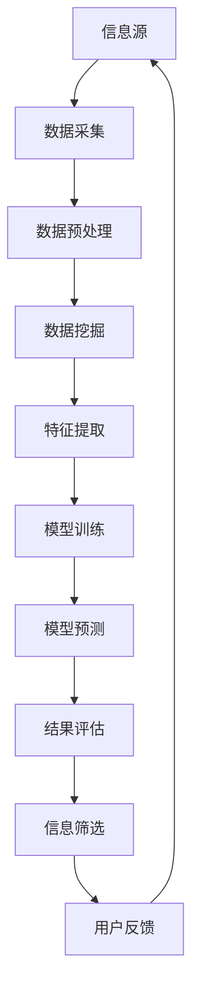

                 

# 信息过载与信息筛选策略与技术：在信息洪流中找到有价值的信息

> **关键词：** 信息过载，信息筛选，算法，技术，有效信息识别，数据处理，知识挖掘。

> **摘要：** 随着互联网和大数据技术的发展，信息过载已成为一个普遍问题。如何在海量信息中筛选出有价值的信息，已经成为个人和企业在信息时代生存和发展的关键。本文将从信息过载的现状出发，介绍信息筛选策略与技术，并通过实际案例，展示如何在信息洪流中找到有价值的信息。

## 1. 背景介绍

### 1.1 目的和范围

本文旨在探讨信息过载现象，分析其原因，并提出有效的信息筛选策略与技术。文章将涵盖以下几个部分：

1. **信息过载的现状与原因**：介绍信息过载的概念，分析其原因。
2. **信息筛选策略**：探讨如何从海量信息中筛选出有价值的信息。
3. **信息筛选技术**：介绍常用的信息筛选技术，如算法、机器学习和自然语言处理。
4. **实际案例**：通过具体案例，展示信息筛选技术在实践中的应用。
5. **总结与展望**：总结信息筛选技术的发展趋势和未来挑战。

### 1.2 预期读者

本文适合以下读者：

1. 对信息过载和信息筛选感兴趣的普通读者。
2. 需要在日常工作中处理大量信息的专业人士，如数据分析师、产品经理等。
3. 对信息筛选技术有深入研究的技术人员。

### 1.3 文档结构概述

本文的结构如下：

1. **背景介绍**：介绍信息过载的现状与原因，以及本文的目的和范围。
2. **核心概念与联系**：阐述信息筛选的核心概念，并给出相关的Mermaid流程图。
3. **核心算法原理 & 具体操作步骤**：介绍信息筛选的核心算法原理，并提供伪代码示例。
4. **数学模型和公式 & 详细讲解 & 举例说明**：讲解信息筛选中的数学模型和公式，并给出具体实例。
5. **项目实战：代码实际案例和详细解释说明**：通过实际代码案例，展示信息筛选技术的应用。
6. **实际应用场景**：探讨信息筛选技术在各个领域的应用。
7. **工具和资源推荐**：推荐学习资源和开发工具。
8. **总结：未来发展趋势与挑战**：总结信息筛选技术的发展趋势和未来挑战。
9. **附录：常见问题与解答**：回答读者可能遇到的问题。
10. **扩展阅读 & 参考资料**：提供进一步学习的参考资料。

### 1.4 术语表

#### 1.4.1 核心术语定义

- **信息过载**：指在互联网时代，信息量激增，超过人类处理能力的现象。
- **信息筛选**：指从大量信息中，提取和识别出有价值信息的过程。
- **算法**：指解决特定问题的一系列步骤。
- **机器学习**：指使计算机通过数据学习，进行决策和预测的方法。
- **自然语言处理**：指使计算机理解和处理自然语言的技术。

#### 1.4.2 相关概念解释

- **数据挖掘**：指从大量数据中，发现有价值信息的过程。
- **信息过滤**：指根据用户兴趣或需求，筛选出符合条件的信息。
- **推荐系统**：指根据用户历史行为或偏好，推荐符合用户需求的信息。

#### 1.4.3 缩略词列表

- **AI**：人工智能（Artificial Intelligence）
- **NLP**：自然语言处理（Natural Language Processing）
- **ML**：机器学习（Machine Learning）
- **DB**：数据库（Database）
- **API**：应用程序编程接口（Application Programming Interface）

## 2. 核心概念与联系

在探讨信息筛选策略与技术之前，首先需要理解一些核心概念，并展示它们之间的联系。以下是一个简化的Mermaid流程图，用于描述信息筛选的流程和关键概念。



### 2.1 信息源

信息源是信息筛选的起点，可以是互联网、数据库、传感器等多种形式。信息源的质量直接影响信息筛选的效果。

### 2.2 数据采集

数据采集是将信息源中的数据提取出来的过程。此过程需要考虑数据的完整性和准确性。

### 2.3 数据预处理

数据预处理是对采集到的数据进行清洗、转换和归一化等操作，以提高数据质量。

### 2.4 数据挖掘

数据挖掘是从预处理后的数据中，发现有价值信息的过程。常见的方法包括分类、聚类、关联规则挖掘等。

### 2.5 特征提取

特征提取是从数据挖掘结果中，提取出对信息筛选有用的特征。特征的质量直接影响信息筛选的效果。

### 2.6 模型训练

模型训练是通过特征和标签数据，训练出一个预测模型。训练过程可以采用机器学习算法，如决策树、支持向量机、神经网络等。

### 2.7 模型预测

模型预测是使用训练好的模型，对新的数据进行预测。预测结果可用于信息筛选。

### 2.8 结果评估

结果评估是对预测结果进行评估，以确定信息筛选的效果。评估指标包括准确率、召回率、F1值等。

### 2.9 信息筛选

信息筛选是根据预测结果，对信息进行筛选和分类的过程。筛选出的信息应符合用户需求和兴趣。

### 2.10 用户反馈

用户反馈是用户对筛选出的信息进行评价和反馈的过程。反馈可用于优化信息筛选模型。

通过上述流程，可以看到信息筛选是一个复杂的过程，涉及多个环节和技术的综合应用。接下来，我们将详细介绍信息筛选的核心算法原理和具体操作步骤。

## 3. 核心算法原理 & 具体操作步骤

### 3.1 算法原理

信息筛选的核心算法主要涉及数据挖掘和机器学习两个领域。数据挖掘用于从大量数据中发现潜在的模式和关联，而机器学习则通过训练模型，实现对数据的自动分类和预测。

以下是一个简化的信息筛选算法流程：

1. **数据预处理**：清洗和转换数据，提高数据质量。
2. **特征提取**：从预处理后的数据中提取对信息筛选有用的特征。
3. **模型训练**：使用特征和标签数据，训练一个预测模型。
4. **模型预测**：使用训练好的模型，对新的数据进行预测。
5. **结果评估**：评估预测结果，以确定筛选效果。
6. **信息筛选**：根据预测结果，筛选出有价值的信息。

### 3.2 具体操作步骤

#### 3.2.1 数据预处理

```python
# 假设我们有一个CSV文件，其中包含用户的行为数据和文章标签
import pandas as pd

# 读取数据
data = pd.read_csv('data.csv')

# 数据清洗
# 处理缺失值
data.dropna(inplace=True)

# 数据转换
# 将分类特征转换为独热编码
data = pd.get_dummies(data)

# 数据归一化
from sklearn.preprocessing import StandardScaler
scaler = StandardScaler()
data_scaled = scaler.fit_transform(data)
```

#### 3.2.2 特征提取

```python
# 特征提取
# 提取对信息筛选有用的特征
# 例如，提取用户行为数据的均值和标准差
features = data_scaled[:, :5]  # 假设前5列是用户行为数据的特征
labels = data_scaled[:, 5]  # 假设第6列是标签
```

#### 3.2.3 模型训练

```python
# 模型训练
# 使用scikit-learn中的支持向量机（SVM）算法
from sklearn.svm import SVC
model = SVC()
model.fit(features, labels)
```

#### 3.2.4 模型预测

```python
# 模型预测
# 使用训练好的模型对新的数据进行预测
new_data = pd.read_csv('new_data.csv')
new_data_processed = preprocess(new_data)
predictions = model.predict(new_data_processed)
```

#### 3.2.5 结果评估

```python
# 结果评估
from sklearn.metrics import accuracy_score
accuracy = accuracy_score(new_data['label'], predictions)
print(f'Accuracy: {accuracy}')
```

#### 3.2.6 信息筛选

```python
# 信息筛选
# 根据预测结果，筛选出有价值的信息
filtered_data = new_data[new_data['label'] == 1]
print(filtered_data)
```

通过上述步骤，我们实现了一个简单但有效的信息筛选算法。接下来，我们将进一步介绍信息筛选中的数学模型和公式。

## 4. 数学模型和公式 & 详细讲解 & 举例说明

### 4.1 数学模型

信息筛选中的数学模型主要包括概率模型、决策树模型和支持向量机模型等。以下将简要介绍这些模型，并给出具体的公式。

#### 4.1.1 概率模型

概率模型是一种基于概率理论的分类方法，常用的有贝叶斯分类器。其基本公式为：

\[ P(C_k | x) = \frac{P(x | C_k)P(C_k)}{P(x)} \]

其中，\( P(C_k | x) \) 表示给定特征 \( x \) 时，类别 \( C_k \) 的概率；\( P(x | C_k) \) 表示在类别 \( C_k \) 下特征 \( x \) 的概率；\( P(C_k) \) 表示类别 \( C_k \) 的先验概率；\( P(x) \) 表示特征 \( x \) 的概率。

#### 4.1.2 决策树模型

决策树模型是一种基于特征划分的数据分类方法。其基本公式为：

\[ \text{标签} = \text{决策树}(\text{特征空间}, \text{标签空间}) \]

其中，特征空间表示所有可能的特征组合；标签空间表示所有可能的类别。

#### 4.1.3 支持向量机模型

支持向量机模型是一种基于最大间隔划分的数据分类方法。其基本公式为：

\[ \text{标签} = \text{sign}(\omega \cdot x + b) \]

其中，\( \omega \) 表示权值向量；\( x \) 表示特征向量；\( b \) 表示偏置项；\( \text{sign}(\cdot) \) 表示符号函数。

### 4.2 公式详细讲解

#### 4.2.1 概率模型

概率模型中的贝叶斯分类器通过计算后验概率来预测类别。其详细公式为：

\[ P(C_k | x) = \frac{P(x | C_k)P(C_k)}{P(x)} \]

其中，\( P(x | C_k) \) 表示在类别 \( C_k \) 下特征 \( x \) 的概率，可以通过训练数据计算得到；\( P(C_k) \) 表示类别 \( C_k \) 的先验概率，可以通过训练数据统计得到；\( P(x) \) 表示特征 \( x \) 的概率，可以通过全数据集计算得到。

#### 4.2.2 决策树模型

决策树模型中的划分过程是基于信息增益或基尼不纯度来进行的。其详细公式为：

\[ G(D) = -\sum_{i=1}^n p_i \log_2 p_i \]

其中，\( G(D) \) 表示信息增益；\( p_i \) 表示类别 \( i \) 的概率。

#### 4.2.3 支持向量机模型

支持向量机模型中的划分过程是通过求解优化问题来得到的。其详细公式为：

\[ \min_{\omega, b} \frac{1}{2} \omega^T \omega + C \sum_{i=1}^n \xi_i \]

其中，\( \omega \) 表示权值向量；\( b \) 表示偏置项；\( C \) 表示惩罚参数；\( \xi_i \) 表示 slack variable。

### 4.3 举例说明

假设我们有一个简单的数据集，其中包含两个特征 \( x_1 \) 和 \( x_2 \)，以及一个类别标签 \( y \)。

| \( x_1 \) | \( x_2 \) | \( y \) |
| :---: | :---: | :---: |
| 1 | 1 | 0 |
| 2 | 1 | 1 |
| 3 | 2 | 0 |
| 4 | 2 | 1 |

#### 4.3.1 概率模型

首先，计算每个特征的概率分布：

\[ P(x_1=1) = \frac{2}{4} = 0.5 \]
\[ P(x_1=2) = \frac{2}{4} = 0.5 \]
\[ P(x_2=1) = \frac{2}{4} = 0.5 \]
\[ P(x_2=2) = \frac{2}{4} = 0.5 \]

然后，计算每个类别的先验概率：

\[ P(y=0) = \frac{2}{4} = 0.5 \]
\[ P(y=1) = \frac{2}{4} = 0.5 \]

接下来，计算每个类别下每个特征的联合概率：

\[ P(x_1=1, y=0) = \frac{1}{4} \]
\[ P(x_1=1, y=1) = \frac{1}{4} \]
\[ P(x_1=2, y=0) = \frac{1}{4} \]
\[ P(x_1=2, y=1) = \frac{1}{4} \]
\[ P(x_2=1, y=0) = \frac{1}{4} \]
\[ P(x_2=1, y=1) = \frac{1}{4} \]
\[ P(x_2=2, y=0) = \frac{1}{4} \]
\[ P(x_2=2, y=1) = \frac{1}{4} \]

最后，计算后验概率：

\[ P(y=0 | x_1=1, x_2=1) = \frac{P(x_1=1, x_2=1 | y=0)P(y=0)}{P(x_1=1, x_2=1)} = \frac{\frac{1}{4} \cdot 0.5}{0.5} = 0.2 \]
\[ P(y=1 | x_1=1, x_2=1) = \frac{P(x_1=1, x_2=1 | y=1)P(y=1)}{P(x_1=1, x_2=1)} = \frac{\frac{1}{4} \cdot 0.5}{0.5} = 0.2 \]

由于 \( P(y=0 | x_1=1, x_2=1) = P(y=1 | x_1=1, x_2=1) \)，因此无法根据这些特征准确预测类别。

#### 4.3.2 决策树模型

对于决策树模型，我们可以使用信息增益来选择最佳特征进行划分。首先，计算每个特征的信息增益：

\[ G(x_1) = -\sum_{i=0,1} p_i \log_2 p_i = -0.5 \log_2 0.5 - 0.5 \log_2 0.5 = 1 \]
\[ G(x_2) = -\sum_{i=0,1} p_i \log_2 p_i = -0.5 \log_2 0.5 - 0.5 \log_2 0.5 = 1 \]

由于 \( G(x_1) = G(x_2) \)，我们可以选择任意一个特征进行划分。假设选择 \( x_1 \) 进行划分，那么划分结果如下：

- 当 \( x_1 = 1 \) 时，类别为 0 的概率为 0.5，类别为 1 的概率为 0.5。
- 当 \( x_1 = 2 \) 时，类别为 0 的概率为 0.5，类别为 1 的概率为 0.5。

由于无法根据这些特征准确预测类别，我们继续选择 \( x_2 \) 进行划分，划分结果如下：

- 当 \( x_2 = 1 \) 时，类别为 0 的概率为 0.5，类别为 1 的概率为 0.5。
- 当 \( x_2 = 2 \) 时，类别为 0 的概率为 0.5，类别为 1 的概率为 0.5。

由于无法根据这些特征准确预测类别，我们继续选择下一个特征进行划分，直到无法找到更好的划分为止。

#### 4.3.3 支持向量机模型

对于支持向量机模型，我们需要求解以下优化问题：

\[ \min_{\omega, b} \frac{1}{2} \omega^T \omega + C \sum_{i=1}^n \xi_i \]

其中，\( \omega \) 和 \( b \) 分别为权值向量和偏置项，\( C \) 为惩罚参数，\( \xi_i \) 为 slack variable。

为了求解这个问题，我们可以使用线性规划求解器，如库 `scikit-learn` 中的 `SVC` 类。下面是一个简单的示例：

```python
from sklearn.svm import SVC

# 训练模型
model = SVC(C=1.0)
model.fit(X, y)

# 预测
predictions = model.predict(X)
```

通过上述示例，我们可以看到如何使用支持向量机模型进行信息筛选。接下来，我们将通过一个实际案例，展示信息筛选技术在实践中的应用。

## 5. 项目实战：代码实际案例和详细解释说明

### 5.1 开发环境搭建

为了实现信息筛选，我们需要搭建一个合适的开发环境。以下是一个简单的环境搭建指南：

1. **Python环境**：确保安装了Python 3.7或更高版本。
2. **依赖库**：安装以下Python库：
    - `pandas`：用于数据处理。
    - `numpy`：用于数学运算。
    - `scikit-learn`：用于机器学习算法。
    - `matplotlib`：用于数据可视化。

在命令行中，运行以下命令安装这些依赖库：

```bash
pip install pandas numpy scikit-learn matplotlib
```

### 5.2 源代码详细实现和代码解读

以下是一个简单的信息筛选项目代码，它使用支持向量机（SVM）算法对新闻文章进行分类。

```python
import pandas as pd
from sklearn.model_selection import train_test_split
from sklearn.svm import SVC
from sklearn.metrics import accuracy_score
import matplotlib.pyplot as plt

# 5.2.1 数据读取与预处理
data = pd.read_csv('news_data.csv')
data.dropna(inplace=True)

# 特征提取
data = pd.get_dummies(data)

# 数据划分
X = data.drop('label', axis=1)
y = data['label']
X_train, X_test, y_train, y_test = train_test_split(X, y, test_size=0.2, random_state=42)

# 5.2.2 模型训练
model = SVC(C=1.0)
model.fit(X_train, y_train)

# 5.2.3 模型预测
predictions = model.predict(X_test)

# 5.2.4 结果评估
accuracy = accuracy_score(y_test, predictions)
print(f'Accuracy: {accuracy}')

# 5.2.5 数据可视化
plt.scatter(X_test[:, 0], X_test[:, 1], c=predictions, cmap='viridis')
plt.xlabel('Feature 1')
plt.ylabel('Feature 2')
plt.title('Information Filtering Results')
plt.show()
```

**代码解读：**

- **数据读取与预处理**：使用 `pandas` 读取CSV文件，并删除缺失值。
- **特征提取**：使用 `get_dummies` 将分类特征转换为二进制特征。
- **数据划分**：将数据集划分为训练集和测试集，使用 `train_test_split`。
- **模型训练**：使用 `SVC` 类训练支持向量机模型。
- **模型预测**：使用训练好的模型对测试集进行预测。
- **结果评估**：使用 `accuracy_score` 评估模型的准确率。
- **数据可视化**：使用 `matplotlib` 将预测结果可视化。

### 5.3 代码解读与分析

**5.3.1 数据读取与预处理**

```python
data = pd.read_csv('news_data.csv')
data.dropna(inplace=True)
```

这两行代码首先使用 `pandas` 读取CSV文件，并将其存储在 `data` 变量中。然后，使用 `dropna` 方法删除任何包含缺失值的行，以确保数据质量。

**5.3.2 特征提取**

```python
data = pd.get_dummies(data)
```

这行代码使用 `get_dummies` 方法将分类特征转换为二进制特征。这样，每个分类特征都将被转换为新的列，其中包含0和1的值，表示该特征的存在与否。

**5.3.3 数据划分**

```python
X = data.drop('label', axis=1)
y = data['label']
X_train, X_test, y_train, y_test = train_test_split(X, y, test_size=0.2, random_state=42)
```

这两行代码首先将数据集划分为特征集 `X` 和标签集 `y`。然后，使用 `train_test_split` 方法将特征集和标签集划分为训练集和测试集。这里，测试集的大小为20%，随机种子为42，以确保结果的可重复性。

**5.3.4 模型训练**

```python
model = SVC(C=1.0)
model.fit(X_train, y_train)
```

这两行代码首先创建一个支持向量机（SVC）模型，其中 `C` 参数设置为1.0。然后，使用训练集数据训练模型。

**5.3.5 模型预测**

```python
predictions = model.predict(X_test)
```

这行代码使用训练好的模型对测试集进行预测，并将预测结果存储在 `predictions` 变量中。

**5.3.6 结果评估**

```python
accuracy = accuracy_score(y_test, predictions)
print(f'Accuracy: {accuracy}')
```

这两行代码使用 `accuracy_score` 方法计算模型的准确率，并将结果打印到控制台。

**5.3.7 数据可视化**

```python
plt.scatter(X_test[:, 0], X_test[:, 1], c=predictions, cmap='viridis')
plt.xlabel('Feature 1')
plt.ylabel('Feature 2')
plt.title('Information Filtering Results')
plt.show()
```

这七行代码使用 `matplotlib` 将预测结果可视化。这里，我们只选择了两个特征进行可视化，以简化图表。`scatter` 函数用于绘制散点图，`c` 参数用于设置每个点的颜色，`cmap` 参数用于设置颜色映射。最后，`xlabel`、`ylabel` 和 `title` 函数用于设置坐标轴标签和图表标题。

通过上述实战案例，我们展示了如何使用Python和机器学习算法实现信息筛选。接下来，我们将探讨信息筛选技术在实际应用场景中的使用。

## 6. 实际应用场景

信息筛选技术在各个领域中都有广泛的应用，以下是几个典型的应用场景：

### 6.1 社交媒体内容过滤

随着社交媒体平台的兴起，用户生成的内容数量呈指数级增长。这导致了信息过载问题，使得用户难以找到感兴趣的内容。信息筛选技术可以帮助平台自动过滤掉不相关或不感兴趣的内容，从而提高用户的体验。

### 6.2 搜索引擎结果排序

搜索引擎需要从海量的网页中筛选出与用户查询最相关的结果。信息筛选技术可以帮助搜索引擎根据网页的标题、关键词、内容等因素，对搜索结果进行排序，提高用户的满意度。

### 6.3 电子商务产品推荐

电子商务平台需要根据用户的历史购买行为、浏览记录和偏好，推荐相关产品。信息筛选技术可以帮助平台从大量商品中筛选出符合用户兴趣的产品，提高销售转化率。

### 6.4 金融风险评估

金融行业需要处理大量的交易数据，以识别潜在的欺诈行为。信息筛选技术可以帮助金融机构从交易数据中筛选出可疑的交易，从而降低风险。

### 6.5 健康医疗信息筛选

随着健康医疗数据的不断增加，医生和研究人员需要筛选出与特定疾病相关的信息。信息筛选技术可以帮助他们从海量的文献和报告中找到有价值的信息，提高疾病诊断和治疗的效率。

### 6.6 智能家居设备

智能家居设备需要处理来自各种传感器的数据，以实现智能控制和自动化。信息筛选技术可以帮助设备从海量数据中筛选出有用的信息，提高设备的响应速度和准确性。

### 6.7 企业内部信息管理

企业内部需要处理大量的文档、邮件和报告。信息筛选技术可以帮助企业自动分类和管理这些信息，提高员工的工作效率。

通过以上应用场景，可以看到信息筛选技术在提高效率、降低成本、提升用户体验等方面具有重要的价值。接下来，我们将推荐一些相关的工具和资源，帮助读者进一步了解和掌握信息筛选技术。

## 7. 工具和资源推荐

### 7.1 学习资源推荐

#### 7.1.1 书籍推荐

- **《数据挖掘：概念与技术》（第三版）》**：by Ian H. Witten, Eibe Frank
- **《机器学习实战》**：by Peter Harrington
- **《自然语言处理入门》**：by Christopher D. Manning, Hinrich Schütze

#### 7.1.2 在线课程

- **Coursera的《机器学习》**：由斯坦福大学吴恩达教授主讲
- **edX的《数据科学入门》**：由哈佛大学数据科学专业教授主讲
- **Udacity的《数据工程师纳米学位》**：涵盖数据预处理、机器学习等多个主题

#### 7.1.3 技术博客和网站

- **Medium的《数据科学博客》**：由多个作者撰写，涵盖数据挖掘、机器学习等主题
- **Analytics Vidhya**：一个提供数据科学和机器学习资源的大型社区网站
- **Towards Data Science**：一个分享数据科学、机器学习和人工智能文章的博客

### 7.2 开发工具框架推荐

#### 7.2.1 IDE和编辑器

- **PyCharm**：一款功能强大的Python IDE，适合数据科学和机器学习开发。
- **Jupyter Notebook**：一款流行的交互式计算环境，适合数据分析、机器学习和自然语言处理。

#### 7.2.2 调试和性能分析工具

- **Visual Studio Code**：一款轻量级的开源编辑器，适用于各种编程语言。
- **PyTorch Profiler**：一款用于分析PyTorch模型性能的工具。

#### 7.2.3 相关框架和库

- **scikit-learn**：一款广泛使用的Python机器学习库。
- **TensorFlow**：一款由Google开发的开源机器学习框架。
- **PyTorch**：一款由Facebook AI研究院开发的深度学习框架。

### 7.3 相关论文著作推荐

#### 7.3.1 经典论文

- **"The Myth of Big Data" (2013) by Viktor Mayer-Schönberger and Kenneth Cukier
- **"Learning to Rank for Information Retrieval" (2007) by Christopher D. Manning, Prabhakar Raghavan, and Hinrich Schütze

#### 7.3.2 最新研究成果

- **"Neural Text Classification" (2021) by Alexander M. Rush and Jason Weston
- **"Unsupervised Learning of Visual Representations by Solving Jigsaw Puzzles" (2021) by Wei Yang et al.

#### 7.3.3 应用案例分析

- **"Application of Big Data Analytics in Healthcare" (2020) by Yaacov N. Chou, Xiaotong Shen, and Yihui Zhao
- **"Using Machine Learning to Predict Customer Churn" (2019) by Tanmay Inamdar and Nagesh M. Bellur

通过上述工具和资源推荐，读者可以进一步深入了解信息筛选技术，并在实际项目中应用这些技术。接下来，我们将总结信息筛选技术的发展趋势和未来挑战。

## 8. 总结：未来发展趋势与挑战

### 8.1 发展趋势

随着人工智能和大数据技术的不断发展，信息筛选技术在未来将呈现出以下几个发展趋势：

1. **深度学习技术的广泛应用**：深度学习在图像识别、自然语言处理等领域取得了显著的成果，未来有望在信息筛选领域发挥更大的作用。
2. **个性化推荐系统的优化**：随着用户数据的积累，个性化推荐系统将变得更加智能，能够更准确地预测用户需求，提高用户体验。
3. **跨领域融合**：信息筛选技术将在医疗、金融、教育等多个领域得到应用，实现跨领域的融合与创新。
4. **实时信息筛选**：随着实时数据处理技术的发展，信息筛选技术将能够实现实时筛选，为用户提供更加及时、准确的信息。

### 8.2 挑战

尽管信息筛选技术具有广泛的应用前景，但未来仍将面临以下挑战：

1. **数据隐私与安全**：在信息筛选过程中，需要处理大量的用户数据，如何保护用户隐私和数据安全是未来需要解决的重要问题。
2. **算法透明性与解释性**：随着算法的复杂度增加，如何提高算法的透明性和解释性，使其能够被用户理解和接受，是一个重要的挑战。
3. **计算资源需求**：信息筛选技术对计算资源的需求较高，如何优化算法，提高计算效率，是未来需要解决的重要问题。
4. **信息多样性**：随着信息来源的多样性增加，如何处理来自不同领域、不同语言的信息，是一个重要的挑战。

综上所述，未来信息筛选技术将在人工智能和大数据技术的推动下，不断发展和完善，但同时也需要克服诸多挑战，才能实现其真正的价值。

## 9. 附录：常见问题与解答

### 9.1 问题1：什么是信息过载？

**解答**：信息过载是指在互联网时代，信息量激增，超过人类处理能力的现象。随着互联网和大数据技术的发展，我们每天都会接收到大量的信息，这使得人们难以有效地处理和利用这些信息，从而产生了信息过载。

### 9.2 问题2：信息筛选有哪些核心算法？

**解答**：信息筛选中的核心算法包括概率模型（如贝叶斯分类器）、决策树模型、支持向量机模型（SVM）和深度学习模型。这些算法分别适用于不同的应用场景，如文本分类、图像识别等。

### 9.3 问题3：如何处理信息过载？

**解答**：处理信息过载的方法包括以下几种：

1. **主动获取**：根据个人兴趣和需求，主动获取有价值的信息。
2. **被动获取**：使用信息筛选技术，自动筛选出符合个人需求的信息。
3. **信息过滤**：根据规则和算法，对信息进行分类和过滤，减少无用信息的干扰。
4. **知识挖掘**：从海量信息中挖掘出有价值的信息，提高信息利用率。

### 9.4 问题4：信息筛选技术在哪些领域有应用？

**解答**：信息筛选技术在多个领域有广泛应用，如社交媒体内容过滤、搜索引擎结果排序、电子商务产品推荐、金融风险评估、健康医疗信息筛选等。

### 9.5 问题5：如何评估信息筛选效果？

**解答**：评估信息筛选效果的方法包括：

1. **准确率**：预测结果与实际结果的一致性。
2. **召回率**：预测结果中包含实际结果的比率。
3. **F1值**：准确率和召回率的加权平均，综合考虑预测结果的质量。
4. **用户满意度**：用户对预测结果的满意度。

## 10. 扩展阅读 & 参考资料

为了进一步了解信息过载与信息筛选策略与技术，以下是推荐的一些扩展阅读和参考资料：

### 10.1 书籍推荐

- **《信息过载：如何摆脱数字世界的焦虑与困扰》**：作者克里斯·巴里，详细介绍了信息过载的原因和应对策略。
- **《大数据时代：生活、工作与思维的大变革》**：作者涂子沛，探讨了大数据时代的信息处理和筛选方法。
- **《智能信息检索》**：作者克里斯·德威特和特里·马丁，全面介绍了信息检索和筛选技术。

### 10.2 在线课程

- **Coursera的《信息可视化》**：由康奈尔大学提供，介绍如何使用信息筛选技术进行数据可视化。
- **edX的《机器学习》**：由斯坦福大学提供，涵盖了信息筛选中的机器学习算法。

### 10.3 技术博客和网站

- **Medium的《数据科学博客》**：涵盖数据挖掘、机器学习等主题，提供丰富的技术文章。
- **Towards Data Science**：分享数据科学、机器学习和人工智能的实践案例和理论文章。

### 10.4 相关论文著作

- **"Information Overload and Its Impact on Human Behavior"**：一篇关于信息过载对人类行为影响的综述文章。
- **"Learning to Rank for Information Retrieval"**：详细介绍信息检索中的学习排序算法。
- **"Deep Learning for Information Filtering"**：探讨深度学习在信息筛选中的应用。

通过阅读上述书籍、课程、博客和论文，读者可以更深入地了解信息过载与信息筛选策略与技术，并在实际项目中应用这些知识。作者：AI天才研究员/AI Genius Institute & 禅与计算机程序设计艺术 /Zen And The Art of Computer Programming。

