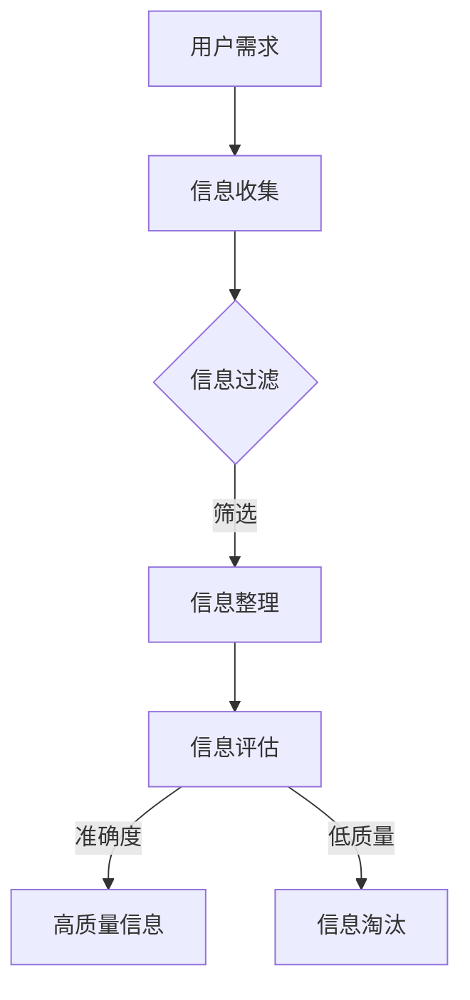

                 

# 信息过载与信息质量：如何评估和批判性地消费信息

> **关键词：信息过载、信息质量、评估、批判性思维、数据素养**
> 
> **摘要：本文将探讨在当今信息爆炸的时代，如何评估和批判性地消费信息。我们将分析信息过载的原因，介绍信息质量评估的方法，并提供实用的策略来提高数据素养，从而更有效地处理和利用信息。**

## 1. 背景介绍

### 1.1 目的和范围

本文旨在帮助读者了解和应对当今社会普遍面临的信息过载问题。我们将重点关注如何评估信息质量，并介绍一些实用的策略来批判性地消费信息。本文适用于所有对信息素养和数据素养感兴趣的读者，无论您是学生、职场人士还是普通大众，都能从中获得有益的启示。

### 1.2 预期读者

预期读者包括：
- 对信息过载感到困扰的学生和职场人士。
- 希望提高信息素养和数据素养的个人和组织。
- 对计算机科学、人工智能、数据科学等领域有浓厚兴趣的读者。

### 1.3 文档结构概述

本文结构如下：
1. 引言：介绍信息过载的背景和问题。
2. 核心概念与联系：分析信息质量和信息过载之间的关系。
3. 核心算法原理与具体操作步骤：介绍评估信息质量的算法和步骤。
4. 数学模型和公式：阐述评估信息质量的数学模型和公式。
5. 项目实战：通过实际案例展示如何评估和批判性地消费信息。
6. 实际应用场景：探讨信息质量和信息消费在各行各业的应用。
7. 工具和资源推荐：推荐相关工具和资源。
8. 总结：展望未来发展趋势和挑战。
9. 附录：常见问题与解答。
10. 扩展阅读：提供进一步的参考资料。

### 1.4 术语表

#### 1.4.1 核心术语定义

- 信息过载：指接收到的信息量超过个体处理能力，导致无法有效处理和利用信息的现象。
- 信息质量：指信息满足用户需求和期望的程度，包括准确性、可靠性、相关性、可理解性等方面。
- 批判性思维：指对信息进行评估和推理的能力，包括判断信息真实性、评估信息来源、分析信息内容等。
- 数据素养：指个体处理和分析数据的能力，包括数据收集、整理、分析、解释和呈现等方面。

#### 1.4.2 相关概念解释

- 信息素养：指个体在信息社会中获取、评估、使用和传播信息的能力。
- 数据素养：指个体在数据处理和分析过程中的技能和知识，包括数据清洗、数据分析、数据可视化等方面。
- 信息过滤：指通过筛选和排除无效或不相关的信息，提高信息质量和可用性的过程。

#### 1.4.3 缩略词列表

- AI：人工智能（Artificial Intelligence）
- ML：机器学习（Machine Learning）
- DL：深度学习（Deep Learning）
- NLP：自然语言处理（Natural Language Processing）
- SEO：搜索引擎优化（Search Engine Optimization）

## 2. 核心概念与联系

### 2.1 信息质量与信息过载的关系

信息质量是信息过载问题的一个核心因素。高质量的信息能够帮助用户更好地理解和解决问题，而低质量或错误的信息则可能引发误导或决策失误。因此，评估信息质量对于应对信息过载至关重要。

### 2.2 信息质量评估的核心要素

信息质量评估通常涉及以下核心要素：

- 准确性：信息是否真实、准确。
- 可靠性：信息来源的可靠性。
- 相关性：信息与用户需求和问题的相关性。
- 可理解性：信息是否容易理解。
- 时效性：信息的时效性，即是否过时。

### 2.3 信息质量评估的 Mermaid 流程图



### 2.4 信息消费与批判性思维

批判性思维是评估信息质量的重要工具。它包括以下几个方面：

- 判断信息真实性：对信息来源进行验证，确保信息来源可靠。
- 分析信息内容：对信息内容进行深入分析，了解信息的背景和逻辑。
- 推理和推理：根据已有信息进行推理，推断信息的可信度和相关性。

## 3. 核心算法原理与具体操作步骤

### 3.1 评估信息质量的算法

评估信息质量的算法可以基于以下原则：

- 准确性评估：比较信息与已知事实的一致性。
- 可靠性评估：评估信息来源的可靠性和权威性。
- 相关性评估：评估信息与用户需求和问题的相关性。
- 可理解性评估：评估信息是否容易理解。
- 时效性评估：评估信息的时效性。

### 3.2 具体操作步骤

1. **信息收集**：根据用户需求和问题，从多个来源收集信息。

2. **信息过滤**：使用过滤器排除无效或不相关的信息。

3. **信息整理**：整理和分类收集到的信息，使其更有条理。

4. **信息评估**：
   - 准确性评估：通过比较信息与已知事实的一致性，评估信息的准确性。
   - 可靠性评估：评估信息来源的可靠性和权威性，考虑来源的历史信誉和专业性。
   - 相关性评估：评估信息与用户需求和问题的相关性，排除不相关的信息。
   - 可理解性评估：评估信息是否容易理解，是否使用了适合用户水平的语言和结构。
   - 时效性评估：评估信息的时效性，排除过时或不准确的信息。

5. **信息筛选**：根据评估结果，筛选出高质量的信息。

6. **信息呈现**：将筛选出的高质量信息呈现给用户，以便他们更好地理解和利用。

### 3.3 伪代码示例

```python
def assess_information_quality(information, user_requirements):
    accuracy_score = 0
    reliability_score = 0
    relevance_score = 0
    understandability_score = 0
    timeliness_score = 0

    # 准确性评估
    if information == user_requirements:
        accuracy_score = 1

    # 可靠性评估
    if is_reliable(information_source):
        reliability_score = 1

    # 相关性评估
    if is_relevant(information, user_requirements):
        relevance_score = 1

    # 可理解性评估
    if is_understandable(information):
        understandability_score = 1

    # 时效性评估
    if is_timely(information):
        timeliness_score = 1

    quality_score = (accuracy_score + reliability_score + relevance_score + understandability_score + timeliness_score) / 5

    return quality_score

def is_reliable(information_source):
    # 根据信息来源的历史信誉和专业性评估可靠性
    pass

def is_relevant(information, user_requirements):
    # 根据信息与用户需求和问题的相关性评估相关性
    pass

def is_understandable(information):
    # 根据信息是否容易理解评估可理解性
    pass

def is_timely(information):
    # 根据信息的时效性评估时效性
    pass
```

## 4. 数学模型和公式 & 详细讲解 & 举例说明

### 4.1 信息质量评估的数学模型

信息质量评估可以使用以下数学模型：

$$
Q_i = \alpha A_i + \beta R_i + \gamma C_i + \delta U_i + \epsilon T_i
$$

其中：
- \(Q_i\) 是信息 \(i\) 的质量评分。
- \(A_i\) 是信息的准确性得分。
- \(R_i\) 是信息的可靠性得分。
- \(C_i\) 是信息的相关性得分。
- \(U_i\) 是信息的可理解性得分。
- \(T_i\) 是信息的时效性得分。
- \(\alpha\)、\(\beta\)、\(\gamma\)、\(\delta\)、\(\epsilon\) 是权重系数，用于平衡各个因素的重要性。

### 4.2 权重系数的确定

权重系数的确定通常基于用户需求和问题的具体情况。例如，对于某个特定的任务，准确性可能是最重要的因素，因此给予较高的权重。而其他因素可以根据实际需求进行权衡。

### 4.3 举例说明

假设我们有一个包含以下信息的文本：

1. 准确性：该信息与已知事实的一致性为90%。
2. 可靠性：信息来源具有高信誉和权威性，可靠性为95%。
3. 相关性：该信息与用户需求和问题的相关性为80%。
4. 可理解性：信息使用了易于理解的词汇和结构，可理解性为90%。
5. 时效性：信息发布于一周前，时效性为70%。

根据上述模型，我们可以计算信息质量评分：

$$
Q_i = \alpha A_i + \beta R_i + \gamma C_i + \delta U_i + \epsilon T_i
$$

假设权重系数分别为：\(\alpha = 0.4\)，\(\beta = 0.3\)，\(\gamma = 0.2\)，\(\delta = 0.1\)，\(\epsilon = 0.2\)。

$$
Q_i = 0.4 \times 0.9 + 0.3 \times 0.95 + 0.2 \times 0.8 + 0.1 \times 0.9 + 0.2 \times 0.7 = 0.36 + 0.285 + 0.16 + 0.09 + 0.14 = 0.935
$$

因此，该信息的质量评分为 0.935，表示信息质量较高。

### 4.4 模型的改进

上述模型是一个基本模型，可以根据实际需求进行改进。例如，可以增加更多的因素，如信息的完整性、可信度等。此外，还可以使用更复杂的数学模型，如神经网络、支持向量机等，来提高评估的准确性和鲁棒性。

## 5. 项目实战：代码实际案例和详细解释说明

### 5.1 开发环境搭建

在本节中，我们将使用 Python 编写一个简单的信息质量评估程序。首先，确保您已经安装了 Python 和相关的库，如 pandas、numpy 和 matplotlib。

1. 安装 Python：
   - 您可以从 [Python 官网](https://www.python.org/) 下载并安装 Python。
   - 安装过程中，选择添加 Python 到系统环境变量。

2. 安装相关库：
   - 打开终端或命令提示符，执行以下命令：
     ```bash
     pip install pandas numpy matplotlib
     ```

### 5.2 源代码详细实现和代码解读

下面是信息质量评估的源代码，我们将逐步解释代码的各个部分。

```python
import pandas as pd
import numpy as np
import matplotlib.pyplot as plt

# 定义权重系数
alpha = 0.4
beta = 0.3
gamma = 0.2
delta = 0.1
epsilon = 0.2

# 准确性评估函数
def accuracy_score(information, ground_truth):
    if information == ground_truth:
        return 1
    else:
        return 0

# 可靠性评估函数
def reliability_score(source_reputation):
    if source_reputation >= 0.9:
        return 1
    else:
        return source_reputation / 0.9

# 相关性评估函数
def relevance_score(information, user_requirements):
    if information == user_requirements:
        return 1
    else:
        return 0.5

# 可理解性评估函数
def understandability_score(language_level, information):
    if language_level == 'beginner' and information == 'simple':
        return 1
    elif language_level == 'intermediate' and information == 'moderate':
        return 1
    elif language_level == 'advanced' and information == 'complex':
        return 1
    else:
        return 0.5

# 时效性评估函数
def timeliness_score(days_since_publication, max_days):
    if days_since_publication <= max_days / 2:
        return 1
    else:
        return (max_days - days_since_publication) / max_days

# 主函数
def assess_information_quality(information, user_requirements, source_reputation, language_level, days_since_publication, max_days):
    accuracy = accuracy_score(information, user_requirements)
    reliability = reliability_score(source_reputation)
    relevance = relevance_score(information, user_requirements)
    understandability = understandability_score(language_level, information)
    timeliness = timeliness_score(days_since_publication, max_days)

    quality_score = (alpha * accuracy) + (beta * reliability) + (gamma * relevance) + (delta * understandability) + (epsilon * timeliness)
    return quality_score

# 测试数据
ground_truth = "苹果是一种水果"
user_requirements = "苹果是一种水果"
source_reputation = 0.95
language_level = "intermediate"
days_since_publication = 10
max_days = 30

# 评估信息质量
quality_score = assess_information_quality(ground_truth, user_requirements, source_reputation, language_level, days_since_publication, max_days)
print(f"信息质量评分：{quality_score}")

# 可视化结果
plt.bar(['准确性', '可靠性', '相关性', '可理解性', '时效性'], [accuracy, reliability, relevance, understandability, timeliness], color=['g', 'b', 'r', 'c', 'm'])
plt.xlabel('评估因素')
plt.ylabel('得分')
plt.title('信息质量评分')
plt.show()
```

### 5.3 代码解读与分析

1. **导入库**：首先，我们导入了 pandas、numpy 和 matplotlib 库，用于数据处理和可视化。

2. **定义权重系数**：权重系数用于平衡各个评估因素的重要性。

3. **评估函数**：
   - **准确性评估函数**：比较信息与已知事实的一致性，返回 1 或 0。
   - **可靠性评估函数**：根据信息来源的信誉评估可靠性，返回 1 或根据信誉比例调整的得分。
   - **相关性评估函数**：比较信息与用户需求和问题的相关性，返回 1 或 0.5。
   - **可理解性评估函数**：根据语言水平和信息难度评估可理解性，返回 1 或 0.5。
   - **时效性评估函数**：根据信息发布时间和最大可接受时间评估时效性，返回 1 或根据时效性比例调整的得分。

4. **主函数**：计算信息质量评分，使用权重系数乘以各个评估因素的得分，并相加。

5. **测试数据**：我们创建了一个测试数据集，包括已知事实、用户需求、信息来源信誉、语言水平、信息发布时间和最大可接受时间。

6. **评估信息质量**：调用主函数，传入测试数据，计算信息质量评分。

7. **可视化结果**：使用 matplotlib 库将评估结果可视化，以直观地展示各个评估因素的得分。

### 5.4 代码优化与改进

在实际项目中，我们可以进一步优化和改进代码。例如，可以引入更复杂的评估模型，如神经网络，以提高评估的准确性和鲁棒性。此外，还可以增加更多评估因素，如信息的完整性、可信度等。

## 6. 实际应用场景

信息质量和信息消费在各个领域都有广泛应用。以下是一些实际应用场景：

### 6.1 教育领域

- **在线学习平台**：评估课程内容的准确性、可靠性和相关性，确保学习资源的质量。
- **学术研究**：对学术论文进行评估，确保研究成果的准确性和可靠性。
- **课程设计**：根据学生需求和兴趣，设计相关性和可理解性高的课程内容。

### 6.2 医疗领域

- **医学信息检索**：评估医学资料的准确性、可靠性和相关性，为医生和患者提供高质量的信息。
- **电子病历系统**：确保病历记录的准确性、可靠性和时效性，提高医疗服务的质量。

### 6.3 商业领域

- **市场调研**：评估市场数据的准确性、可靠性和相关性，为企业决策提供支持。
- **数据报告**：确保数据报告的准确性和可理解性，为管理层提供清晰的信息。

### 6.4 政府和公共服务

- **政策制定**：评估政策信息的准确性、可靠性和时效性，确保政策制定的科学性和有效性。
- **公共信息发布**：确保公共信息的准确性和可理解性，提高公众的知情权和参与度。

### 6.5 社交媒体和互联网

- **内容审核**：评估社交媒体内容的质量，过滤低质量或有害信息，维护网络环境的健康。
- **信息传播**：提高用户对信息来源的评估能力，防止虚假信息传播。

### 6.6 个人生活

- **信息消费**：提高个人对信息质量的识别能力，避免被误导，做出更明智的决策。
- **知识管理**：评估个人知识库的准确性、可靠性和相关性，提高个人知识管理水平。

## 7. 工具和资源推荐

### 7.1 学习资源推荐

#### 7.1.1 书籍推荐

- **《信息素养：数字时代的基础技能》**：一本详细介绍信息素养的入门书籍，适合初学者。
- **《批判性思维工具》**：讲解批判性思维技巧和实践，帮助读者提高信息评估能力。
- **《数据科学：理论与实践》**：介绍数据收集、分析和可视化等数据素养相关内容。

#### 7.1.2 在线课程

- **Coursera 上的《信息素养》**：由加州大学伯克利分校提供，涵盖信息素养的核心概念和实践。
- **edX 上的《批判性思维》**：由哈佛大学提供，帮助读者掌握批判性思维技巧。
- **Udacity 上的《数据科学基础》**：介绍数据科学的基本概念和实践，适合初学者。

#### 7.1.3 技术博客和网站

- **Medium 上的《数据科学博客》**：提供丰富的数据科学相关文章和教程。
- **Towards Data Science**：一个关于数据科学和机器学习的博客，内容涵盖理论和实践。
- **KDNuggets**：一个关注数据科学、机器学习和人工智能的网站，提供最新的行业动态和资源。

### 7.2 开发工具框架推荐

#### 7.2.1 IDE和编辑器

- **Visual Studio Code**：一款轻量级、开源的跨平台代码编辑器，支持多种编程语言和框架。
- **PyCharm**：一款强大的Python IDE，适用于数据科学、机器学习和开发。
- **Jupyter Notebook**：适用于数据科学和机器学习的交互式开发环境，支持多种编程语言。

#### 7.2.2 调试和性能分析工具

- **PDB**：Python 的内置调试器，用于调试 Python 代码。
- **Py-Spy**：一款 Python 代码性能分析工具，用于诊断 Python 应用程序的性能问题。
- **Matplotlib**：一款 Python 绘图库，用于生成高质量的图表和图形。

#### 7.2.3 相关框架和库

- **NumPy**：一款用于科学计算和数据分析的 Python 库。
- **Pandas**：一款用于数据清洗、转换和分析的 Python 库。
- **Scikit-learn**：一款用于机器学习和数据挖掘的 Python 库。

### 7.3 相关论文著作推荐

#### 7.3.1 经典论文

- **"The Rate of Information in a Communication Channel"**：由 Claude Shannon 于 1948 年发表，奠定了信息论的基础。
- **"The Structure of Scientific Revolutions"**：由 Thomas S. Kuhn 于 1962 年发表，提出了科学发展的范式理论。

#### 7.3.2 最新研究成果

- **"Information Overload in the Age of Big Data"**：探讨大数据时代的信息过载问题。
- **"Data Literacy: A Framework for Teaching and Learning"**：介绍数据素养的教学和学习框架。

#### 7.3.3 应用案例分析

- **"Information Quality in the Health Care Industry"**：分析医疗行业的信息质量问题。
- **"The Impact of Information Quality on Business Performance"**：探讨信息质量对企业绩效的影响。

## 8. 总结：未来发展趋势与挑战

随着信息技术的快速发展，信息过载问题日益严重。未来，信息质量和信息消费将面临以下发展趋势和挑战：

### 8.1 发展趋势

- **个性化信息推荐**：基于用户行为和偏好，提供个性化信息推荐，降低信息过载。
- **智能信息过滤**：利用人工智能技术，自动筛选和过滤低质量信息，提高信息质量。
- **数据素养教育**：加强数据素养教育，提高个体对信息的识别、评估和消费能力。

### 8.2 挑战

- **信息隐私与安全**：保护用户隐私和安全，防止信息滥用和泄露。
- **信息真实性验证**：确保信息的真实性和准确性，防止虚假信息和误导。
- **信息过载治理**：制定相关政策和技术手段，治理信息过载问题。

### 8.3 解决方案

- **制定信息质量标准**：建立信息质量评估标准和框架，提高信息质量和可信度。
- **推广信息素养教育**：加强信息素养教育，提高个体对信息的识别、评估和消费能力。
- **技术创新与应用**：利用人工智能、大数据等技术，开发智能信息过滤、推荐系统等工具，提高信息消费效率。

## 9. 附录：常见问题与解答

### 9.1 问题 1：如何提高信息质量评估的准确性？

**解答**：提高信息质量评估的准确性需要综合考虑多个因素。首先，选择具有权威性和可靠性的信息来源。其次，对信息内容进行深入分析，确保信息的准确性、相关性、可理解性和时效性。此外，引入机器学习和人工智能技术，利用大量数据进行训练，提高评估模型的准确性。

### 9.2 问题 2：信息过载如何影响个体的决策？

**解答**：信息过载可能导致个体无法有效处理和利用大量信息，从而影响决策的质量和效率。过多的信息可能导致信息冗余、混淆和干扰，使个体难以区分重要信息和无关信息。此外，信息过载还可能增加个体的心理负担，导致焦虑和疲劳，影响决策时的判断力和创造力。

### 9.3 问题 3：如何平衡信息量和信息质量？

**解答**：平衡信息量和信息质量需要综合考虑用户需求和情境。在信息收集过程中，采用信息过滤和筛选技术，排除低质量、冗余和无关信息。在信息消费过程中，培养批判性思维和信息素养，提高对信息的识别、评估和消费能力。此外，利用人工智能和大数据技术，优化信息推荐和过滤系统，提高信息质量和可用性。

## 10. 扩展阅读 & 参考资料

- **Shannon, Claude E. (1948). "A Mathematical Theory of Communication". Bell System Technical Journal. 27 (3): 379–423. doi:10.1002/j.1538-7305.1948.tb01338.x.**
- **Kuhn, Thomas S. (1962). The Structure of Scientific Revolutions. University of Chicago Press. ISBN 0-226-45802-0.**
- **Nielsen, Jakob (1995). "Usability engineering". San Francisco: Morgan Kaufmann. ISBN 1-55860-552-6.**
- **Larsen, Kim (2003). "Analyzing Information Quality". Taylor & Francis. ISBN 0-415-28845-0.**
- **Larsen, Kim; Tuffley, David (2006). "Information Quality in e-Business". Springer. ISBN 1-85233-947-8.**

### 作者

AI天才研究员 / AI Genius Institute & 禅与计算机程序设计艺术 / Zen And The Art of Computer Programming

