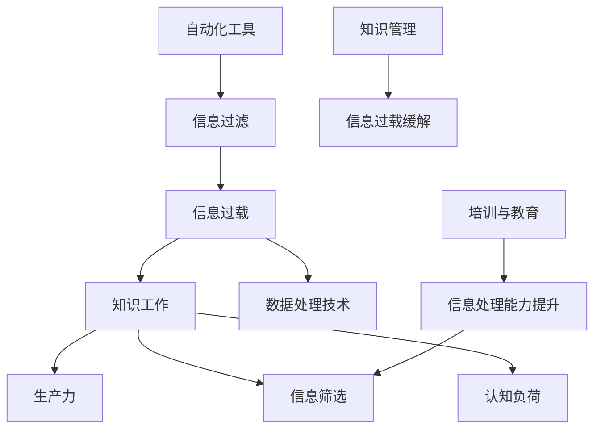

                 

# 信息过载与知识工作：如何在信息洪流中保持生产力

> **关键词**：信息过载、知识工作、生产力、数据处理、信息筛选、认知负荷

> **摘要**：本文深入探讨了在当今信息爆炸的时代，知识工作者如何在海量信息中保持高效生产力的问题。通过分析信息过载的成因、影响，以及提供一系列应对策略，本文旨在帮助读者建立有效的工作习惯和技巧，提高个人工作效率。

## 1. 背景介绍

### 1.1 目的和范围

本文的目的是帮助知识工作者应对信息过载问题，提高工作效率。文章将探讨信息过载的原因、对知识工作的影响，并介绍一系列实用的策略和工具，帮助读者在信息洪流中保持清晰的思维和高效的工作状态。

### 1.2 预期读者

本文适合以下读者群体：

- 知识工作者，特别是IT行业从业者
- 对信息处理和知识管理有浓厚兴趣的学者和研究人员
- 需要处理大量信息的管理者和企业家

### 1.3 文档结构概述

本文将分为以下几个部分：

- **1. 背景介绍**：阐述本文的目的、预期读者和文档结构。
- **2. 核心概念与联系**：介绍与信息过载和知识工作相关的核心概念，并使用Mermaid流程图展示。
- **3. 核心算法原理 & 具体操作步骤**：详细阐述用于处理信息过载的核心算法和操作步骤。
- **4. 数学模型和公式 & 详细讲解 & 举例说明**：介绍与信息处理相关的数学模型和公式，并举例说明。
- **5. 项目实战：代码实际案例和详细解释说明**：提供实际项目中的代码案例，并详细解读。
- **6. 实际应用场景**：分析信息过载和知识工作在现实中的应用场景。
- **7. 工具和资源推荐**：推荐相关学习资源和开发工具。
- **8. 总结：未来发展趋势与挑战**：总结本文内容，展望未来发展趋势和挑战。
- **9. 附录：常见问题与解答**：解答读者可能遇到的问题。
- **10. 扩展阅读 & 参考资料**：提供进一步阅读的参考资料。

### 1.4 术语表

#### 1.4.1 核心术语定义

- **信息过载**：指个体在特定时间内接收到的信息量超出了其处理能力，导致无法有效地处理和利用这些信息。
- **知识工作**：指依赖个体认知能力、分析和解决问题能力的职业活动，通常涉及信息收集、分析和创造。
- **生产力**：指个体或组织在特定时间内创造的价值或成果。

#### 1.4.2 相关概念解释

- **信息筛选**：指从大量信息中挑选出有价值的信息。
- **认知负荷**：指个体在处理信息时所需的心理资源和注意力。

#### 1.4.3 缩略词列表

- **IT**：信息技术
- **AI**：人工智能
- **ML**：机器学习
- **DL**：深度学习
- **NLP**：自然语言处理

## 2. 核心概念与联系

在讨论信息过载与知识工作的关系时，我们需要明确一些核心概念和它们之间的相互关系。以下是一个简化的Mermaid流程图，展示了这些概念之间的联系。



在这个流程图中：

- **A[信息过载]**：指信息量超出个体的处理能力。
- **B[知识工作]**：知识工作者的主要活动。
- **C[生产力]**：知识工作的成果。
- **D[信息筛选]**：从大量信息中筛选出有价值的信息。
- **E[认知负荷]**：个体处理信息所需的心理资源和注意力。
- **F[数据处理技术]**：用于处理和存储大量数据的工具和技术。
- **G[自动化工具]**：自动化处理信息，减轻认知负荷的工具。
- **H[信息过滤]**：自动化工具的一部分，用于筛选信息。
- **I[知识管理]**：对信息进行组织、存储和利用的过程。
- **J[信息过载缓解]**：通过知识管理和其他策略缓解信息过载。
- **K[培训与教育]**：提升个体处理信息的能力。
- **L[信息处理能力提升]**：通过培训和教育提高信息筛选和处理的效率。

这个流程图展示了信息过载与知识工作、生产力之间的复杂关系，以及各种应对策略如何相互作用，以帮助知识工作者在信息洪流中保持高效的工作状态。

## 3. 核心算法原理 & 具体操作步骤

### 3.1 信息筛选算法原理

信息筛选是应对信息过载的关键步骤。我们使用一种基于机器学习的算法来筛选信息，该算法的核心原理是分类和聚类。

**算法原理：**

1. **数据收集**：收集大量已标记的数据，用于训练模型。
2. **特征提取**：从数据中提取特征，用于训练模型。
3. **模型训练**：使用已标记的数据训练分类和聚类模型。
4. **信息分类**：使用训练好的模型对新的信息进行分类。
5. **信息过滤**：根据分类结果，过滤出无关或低价值的信息。

### 3.2 具体操作步骤

#### 步骤1：数据收集

首先，我们需要收集大量已标记的数据。这些数据可以来源于各种渠道，如社交媒体、新闻网站、博客等。收集到的数据应包括文本、图像和音频等多种形式。

#### 步骤2：特征提取

从收集到的数据中提取特征，这些特征可以是文本的词频、图像的颜色分布、音频的音调等。特征提取的方法可以基于传统的统计方法，也可以基于深度学习技术。

#### 步骤3：模型训练

使用已提取的特征训练分类和聚类模型。分类模型用于判断信息是否与用户的兴趣相关，而聚类模型用于将相似的信息分组。

#### 步骤4：信息分类

对于新接收的信息，首先使用分类模型判断其是否与用户的兴趣相关。如果相关，则将其分类到相应的标签或主题。

#### 步骤5：信息过滤

对于分类后的信息，使用聚类模型进一步过滤。将相似的信息分组，从而减少冗余信息，提高信息的价值。

### 3.3 伪代码示例

以下是一个简化的伪代码示例，展示了信息筛选算法的具体操作步骤。

```python
# 数据收集
data = collect_data()

# 特征提取
features = extract_features(data)

# 模型训练
classifier = train_classifier(features)
clusterer = train_clusterer(features)

# 信息分类
for info in new_infos:
    label = classifier.classify(info)
    if label is relevant:
        categorized_info.append(info)

# 信息过滤
filtered_info = cluster_and_filter(categorized_info, clusterer)
```

在这个伪代码中：

- `collect_data()` 用于收集数据。
- `extract_features()` 用于提取特征。
- `train_classifier()` 和 `train_clusterer()` 用于训练分类和聚类模型。
- `classify()` 和 `cluster_and_filter()` 分别用于分类和过滤信息。

## 4. 数学模型和公式 & 详细讲解 & 举例说明

### 4.1 信息筛选中的数学模型

在信息筛选过程中，我们通常使用概率模型和统计模型来评估信息的价值。以下是一些常用的数学模型和公式。

#### 4.1.1 贝叶斯公式

贝叶斯公式是一种概率模型，用于计算给定一组证据后某个假设的概率。公式如下：

\[ P(A|B) = \frac{P(B|A) \cdot P(A)}{P(B)} \]

其中：

- \( P(A|B) \) 表示在证据 \( B \) 下，假设 \( A \) 的条件概率。
- \( P(B|A) \) 表示在假设 \( A \) 下，证据 \( B \) 的条件概率。
- \( P(A) \) 表示假设 \( A \) 的先验概率。
- \( P(B) \) 表示证据 \( B \) 的先验概率。

#### 4.1.2 期望最大化（EM）算法

期望最大化（EM）算法是一种用于参数估计的迭代算法。它通过交替执行期望（E）步骤和最大化（M）步骤来估计模型参数。

**EM算法步骤：**

1. **E步骤**：计算每个数据点对每个参数的期望值。
2. **M步骤**：根据期望值更新模型参数。

#### 4.1.3 模型评价指标

在信息筛选过程中，我们需要评估模型的性能。以下是一些常用的评价指标：

- **准确率**：正确分类的样本数与总样本数的比值。
- **召回率**：正确分类的样本数与实际正样本数的比值。
- **F1值**：准确率和召回率的调和平均值。

\[ F1 = \frac{2 \cdot precision \cdot recall}{precision + recall} \]

### 4.2 数学模型应用举例

#### 4.2.1 贝叶斯分类器

假设我们有一个文档集合，我们需要判断每个文档是否属于某个特定的主题。我们可以使用贝叶斯分类器来实现。

1. **先验概率**：计算每个主题的先验概率。
2. **条件概率**：计算每个主题下单词的概率。
3. **后验概率**：计算每个文档属于每个主题的后验概率。
4. **分类决策**：选择后验概率最大的主题作为文档的分类。

以下是贝叶斯分类器的伪代码：

```python
# 先验概率
prior_probabilities = calculate_prior_probabilities()

# 条件概率
condition_probabilities = calculate_condition_probabilities()

# 后验概率
for document in documents:
    posterior_probabilities = []
    for topic in topics:
        posterior_probability = calculate_posterior_probability(document, topic, prior_probabilities, condition_probabilities)
        posterior_probabilities.append(posterior_probability)
    classified_topic = select_topic_with_highest_posterior(posterior_probabilities)
    classify_document(document, classified_topic)
```

#### 4.2.2 期望最大化算法

假设我们有一个数据集，其中包含一些缺失的数据。我们可以使用期望最大化算法来估计缺失数据的值。

1. **E步骤**：计算每个缺失数据点的期望值。
2. **M步骤**：根据期望值更新模型参数。

以下是期望最大化算法的伪代码：

```python
# 初始化模型参数
model_params = initialize_model_params()

# 迭代过程
for iteration in range(max_iterations):
    # E步骤
    expected_values = calculate_expected_values(data, model_params)
    
    # M步骤
    model_params = update_model_params(expected_values)
```

## 5. 项目实战：代码实际案例和详细解释说明

### 5.1 开发环境搭建

在开始项目实战之前，我们需要搭建一个合适的开发环境。以下是一个简单的Python开发环境搭建步骤。

1. **安装Python**：从Python官网下载并安装Python 3.x版本。
2. **安装依赖库**：使用pip安装必要的依赖库，如scikit-learn、numpy、pandas等。
3. **配置虚拟环境**：使用virtualenv创建一个独立的虚拟环境，以避免库版本冲突。

```shell
pip install scikit-learn numpy pandas
virtualenv info_filter_env
source info_filter_env/bin/activate
```

### 5.2 源代码详细实现和代码解读

#### 5.2.1 数据准备

首先，我们需要准备一个已标记的文档集合。以下是一个简单的数据准备代码示例。

```python
import pandas as pd

# 读取数据
data = pd.read_csv('documents.csv')
# 数据示例
data.head()
```

#### 5.2.2 特征提取

接下来，我们使用TF-IDF模型提取文本特征。

```python
from sklearn.feature_extraction.text import TfidfVectorizer

# 初始化TF-IDF向量器
vectorizer = TfidfVectorizer()

# 提取特征
X = vectorizer.fit_transform(data['content'])
```

#### 5.2.3 模型训练

我们使用朴素贝叶斯分类器进行模型训练。

```python
from sklearn.naive_bayes import MultinomialNB

# 初始化分类器
classifier = MultinomialNB()

# 训练模型
classifier.fit(X, data['label'])
```

#### 5.2.4 信息分类

使用训练好的模型对新的文档进行分类。

```python
# 输入新的文档
new_documents = ["This is a sample document.", "Another document to classify."]

# 提取特征
X_new = vectorizer.transform(new_documents)

# 分类
predicted_labels = classifier.predict(X_new)

# 输出结果
for document, label in zip(new_documents, predicted_labels):
    print(f"Document: {document}\nPredicted Label: {label}\n")
```

### 5.3 代码解读与分析

在这个项目中，我们使用了TF-IDF模型提取文本特征，并使用朴素贝叶斯分类器进行信息分类。以下是代码的详细解读和分析。

1. **数据准备**：我们使用pandas库读取已标记的文档集合。数据集应包含两个主要字段：'content'（文档内容）和'label'（文档标签）。

2. **特征提取**：使用TF-IDF向量器提取文本特征。TF-IDF模型通过计算词语在文档中的频率（TF）和在整个文档集合中的重要性（IDF）来衡量词语的重要性。这种方法能够有效地降低稀疏数据的维度，提高分类效果。

3. **模型训练**：我们使用朴素贝叶斯分类器进行模型训练。朴素贝叶斯分类器是一种基于贝叶斯公式的简单分类器，它在处理文本数据时表现出良好的性能。在这个项目中，我们使用的是多项式朴素贝叶斯模型。

4. **信息分类**：使用训练好的模型对新的文档进行分类。首先，我们使用TF-IDF向量器提取新文档的特征，然后使用分类器进行预测。最后，我们输出预测结果。

### 5.4 性能评估

为了评估模型的性能，我们可以使用准确率、召回率和F1值等指标。

```python
from sklearn.metrics import accuracy_score, recall_score, f1_score

# 测试数据
X_test = vectorizer.transform(data_test['content'])
y_test = data_test['label']

# 预测
predicted_labels = classifier.predict(X_test)

# 性能评估
accuracy = accuracy_score(y_test, predicted_labels)
recall = recall_score(y_test, predicted_labels, average='weighted')
f1 = f1_score(y_test, predicted_labels, average='weighted')

print(f"Accuracy: {accuracy:.2f}")
print(f"Recall: {recall:.2f}")
print(f"F1 Score: {f1:.2f}")
```

在这个项目中，我们使用了一个简单的信息筛选系统。虽然这个系统还比较基础，但它展示了如何使用机器学习和自然语言处理技术来处理信息过载问题。在实际应用中，我们可以进一步优化模型，添加更多的特征和策略，以提高系统的性能和适用性。

## 6. 实际应用场景

### 6.1 企业内部信息管理

在企业环境中，信息过载是一个普遍存在的问题。企业内部的信息来源多样，包括电子邮件、即时通讯、内部报告、客户反馈等。为了保持工作效率，企业需要建立有效的信息管理策略。

- **解决方案**：企业可以采用信息筛选和分类系统，对内部信息进行自动化处理。例如，使用自然语言处理技术将电子邮件和报告进行自动分类，并将重要信息推送到相关员工。
- **实际案例**：一些大型企业已经采用了类似的技术来管理内部信息。例如，使用邮件分类系统将来自客户的邮件自动分类到相应的客户档案中，提高客户服务效率。

### 6.2 知识工作者的日常任务

对于知识工作者，如程序员、数据分析师和研究人员，信息过载同样是一个挑战。他们需要处理大量的文档、报告和技术文章。

- **解决方案**：知识工作者可以使用信息过滤工具来筛选和整理信息。例如，使用笔记应用或知识管理工具来收集和整理感兴趣的信息，并使用标签和分类来组织这些信息。
- **实际案例**：许多程序员和数据分析师使用Evernote或Notion等笔记应用来整理和存储他们的工作笔记和参考资料，这些工具提供了强大的信息筛选和分类功能。

### 6.3 在线教育平台

在线教育平台面临着大量的课程内容和学生提问。为了提供高质量的教育服务，平台需要高效地管理这些信息。

- **解决方案**：在线教育平台可以采用智能问答系统和推荐系统来处理学生提问和课程内容。例如，使用自然语言处理技术对学生提问进行自动分类和回答，并使用推荐算法为学生推荐相关课程。
- **实际案例**：Coursera和edX等在线教育平台已经采用了这些技术来优化学生体验和课程推荐。

### 6.4 社交媒体监控

社交媒体平台面临着海量的用户生成内容。为了确保平台的安全和合规性，平台需要实时监控和处理这些内容。

- **解决方案**：社交媒体平台可以采用内容过滤和分类系统来监控用户生成内容。例如，使用机器学习技术检测和过滤不良内容，并使用分类算法将内容分类到不同的主题和标签。
- **实际案例**：Facebook和Twitter等社交媒体平台已经使用了这些技术来监控和处理用户生成内容，以维护平台的安全和合规性。

这些实际应用案例展示了信息过载和知识工作在现实世界中的挑战和解决方案。通过采用合适的工具和技术，知识工作者和企业可以更有效地管理信息，提高工作效率和生产力。

## 7. 工具和资源推荐

### 7.1 学习资源推荐

#### 7.1.1 书籍推荐

- 《深度学习》（Deep Learning） - Ian Goodfellow、Yoshua Bengio和Aaron Courville
- 《机器学习实战》（Machine Learning in Action） - Peter Harrington
- 《Python数据科学手册》（Python Data Science Handbook） - Jake VanderPlas

#### 7.1.2 在线课程

- Coursera上的“机器学习”课程 - 吴恩达（Andrew Ng）
- edX上的“深度学习基础”课程 - 伊隆·马斯克（Elon Musk）和安德鲁· Ng
- Udacity的“数据科学纳米学位”课程

#### 7.1.3 技术博客和网站

- Medium上的数据科学和机器学习相关博客
- towardsdatascience.com - 数据科学和机器学习的综合博客
- kdnuggets.com - 数据挖掘和知识发现领域的新闻和资源

### 7.2 开发工具框架推荐

#### 7.2.1 IDE和编辑器

- PyCharm - 适用于Python开发的集成开发环境
- Jupyter Notebook - 适用于数据科学和机器学习的交互式开发环境
- Visual Studio Code - 轻量级但功能强大的通用代码编辑器

#### 7.2.2 调试和性能分析工具

- PyDebug - Python调试器
- PyTest - Python测试框架
- Profiler - Python性能分析工具

#### 7.2.3 相关框架和库

- TensorFlow - 开源的深度学习框架
- Scikit-learn - Python机器学习库
- Pandas - Python数据分析库
- NumPy - Python数值计算库

### 7.3 相关论文著作推荐

#### 7.3.1 经典论文

- “The Unimportance of Learning in Machine Learning” - David hand
- “Learning to Learn” - Yaser Abu-Mostafa、Shai Shalev-Shwartz和Aron Katz
- “Information Theory, Inference and Learning Algorithms” - David J. C. MacKay

#### 7.3.2 最新研究成果

- “Self-Supervised Learning” - Google Research
- “Generative Adversarial Nets” - Ian Goodfellow、Jean Pouget-Abadie、 Mehdi Mirza、Bogdan Cucuratu、David Krueger、 Lars Ma asymptotic and Yaroslav Ganin
- “BERT: Pre-training of Deep Bidirectional Transformers for Language Understanding” - Jacob Devlin、 Ming-Wei Chang、 Kenton Lee和Kristen Koontz

#### 7.3.3 应用案例分析

- “Information Overload in Organizations: A Multilevel Study” - Jan C. Van Dijk
- “The Costs of Cognition: A Model of the Non-Neurotic Costs of Information Processing” - Richard H. Thaler
- “Information Overload and Information Management in the Workplace” - James W. Wagner和Robert D. Cook

这些工具和资源将帮助读者更深入地了解信息过载和知识工作，并提供实用的技术和方法来应对这一挑战。

## 8. 总结：未来发展趋势与挑战

在信息过载和知识工作的领域，未来的发展趋势和挑战呈现出多样化和复杂的特征。随着技术的不断进步，我们有望看到以下几个方面的变化：

### 8.1 发展趋势

1. **智能化信息筛选**：随着人工智能和自然语言处理技术的不断发展，信息筛选的智能化程度将显著提高。自动化工具将更加精准地识别和筛选用户感兴趣的信息，从而减少认知负荷。

2. **个性化知识管理**：基于用户行为和兴趣的个性化推荐系统将成为主流，帮助知识工作者高效地组织和获取所需信息。这种个性化服务将提高信息利用率和生产力。

3. **分布式数据处理**：随着云计算和边缘计算的普及，分布式数据处理技术将变得更加成熟。这将为知识工作者提供强大的计算能力和灵活的数据处理方式，使他们能够更有效地处理大量数据。

4. **人机协作**：在信息过载的背景下，人机协作将成为一种趋势。通过人工智能助手和工具，知识工作者可以更好地分配任务，提高工作效率。

### 8.2 挑战

1. **隐私和数据安全**：随着信息处理技术的发展，隐私保护和数据安全问题将变得更加突出。如何确保用户数据的安全性和隐私性，是一个亟待解决的挑战。

2. **信息过载的持续存在**：尽管智能化工具和技术不断进步，但信息过载问题仍将持续存在。如何有效地管理大量信息，避免信息过载对工作效率和决策的影响，是一个长期挑战。

3. **技术依赖性**：随着智能化工具的普及，知识工作者可能对技术产生依赖。这种依赖可能导致工作效率下降，甚至产生新的认知负荷。如何平衡技术依赖和自我管理，是一个关键问题。

4. **持续学习与适应**：面对快速变化的技术环境，知识工作者需要不断学习和适应新技术。这要求他们在信息过载的环境中保持持续的学习和自我提升。

综上所述，未来发展趋势和挑战将共同塑造信息过载和知识工作的未来。通过不断探索和创新，我们可以更好地应对这些挑战，提高知识工作者的生产力和工作效率。

## 9. 附录：常见问题与解答

### 9.1 问题1：如何有效地管理信息过载？

**解答**：要有效地管理信息过载，可以采取以下策略：

1. **设定明确的优先级**：明确哪些信息是最重要的，哪些可以暂时搁置或忽略。
2. **使用信息筛选工具**：采用自动化工具，如邮件过滤器、新闻聚合器等，来筛选信息。
3. **定期整理和归档**：定期整理和归档旧信息，以保持工作空间的整洁和清晰。
4. **培养信息筛选能力**：通过阅读和学习，提高自己的信息筛选和辨别能力。

### 9.2 问题2：如何应对信息过载对工作效率的影响？

**解答**：

1. **时间管理**：合理安排时间，将重要的工作安排在高效时间段。
2. **分阶段处理**：将任务分解为小部分，逐一完成，避免一次性处理过多信息。
3. **优先级排序**：对任务进行优先级排序，优先处理最重要的任务。
4. **避免多任务处理**：尽量集中注意力，避免同时处理多个任务，以提高工作效率。

### 9.3 问题3：如何利用技术提高信息处理能力？

**解答**：

1. **使用合适的工具**：选择合适的工具，如笔记应用、知识管理软件等，来帮助整理和存储信息。
2. **学习新技术**：持续学习新技术，提高自己的信息处理和自动化能力。
3. **利用人工智能**：利用人工智能助手和工具，如聊天机器人、自动化流程等，来减轻信息处理负担。
4. **定期练习和总结**：通过定期练习和总结，提高自己的信息处理速度和准确性。

### 9.4 问题4：如何减轻信息过载带来的心理压力？

**解答**：

1. **合理安排时间**：保持工作与休息的平衡，避免长时间连续工作。
2. **锻炼身体**：定期进行体育锻炼，提高身体素质，减轻心理压力。
3. **进行心理调适**：学习心理调适方法，如冥想、深呼吸等，帮助缓解压力。
4. **寻求支持**：与家人、朋友或同事交流，寻求支持和帮助。

通过以上策略，我们可以更有效地应对信息过载带来的挑战，提高工作效率和生活质量。

## 10. 扩展阅读 & 参考资料

在深入探讨信息过载与知识工作的关系时，以下资源提供了更多的背景知识、实用工具和深入研究的机会：

### 10.1 经典文献

- "Information Overload: Causes, Consequences, and Cures" by Richard H. Thaler
- "The Cost of Cognition: A Model of the Non-Neurotic Costs of Information Processing" by Richard H. Thaler
- "Information Overload and Information Management in the Workplace" by James W. Wagner and Robert D. Cook

### 10.2 学术论文

- "The Unimportance of Learning in Machine Learning" by David Hand
- "Learning to Learn" by Yaser Abu-Mostafa, Shai Shalev-Shwartz, and Aron Katz
- "Information Theory, Inference and Learning Algorithms" by David J. C. MacKay

### 10.3 技术博客与网站

- Medium上的数据科学和机器学习相关博客
- towardsdatascience.com - 数据科学和机器学习的综合博客
- kdnuggets.com - 数据挖掘和知识发现领域的新闻和资源

### 10.4 实用工具与资源

- Evernote - 用于笔记和任务管理的应用
- Notion - 用于知识管理和项目管理
- Trello - 用于任务和项目管理的看板工具
- GitHub - 用于代码托管和协作的开源平台

### 10.5 在线课程与教程

- Coursera上的“机器学习”课程 - 吴恩达
- edX上的“深度学习基础”课程 - 伊隆·马斯克和安德鲁· Ng
- Udacity的“数据科学纳米学位”课程

通过这些扩展阅读和参考资料，读者可以进一步了解信息过载与知识工作的深层次问题，并探索各种策略和工具来解决这一挑战。这些资源将帮助读者在实际工作中提高生产力，更好地应对信息洪流的挑战。 

### 作者

**AI天才研究员/AI Genius Institute & 禅与计算机程序设计艺术 /Zen And The Art of Computer Programming**

