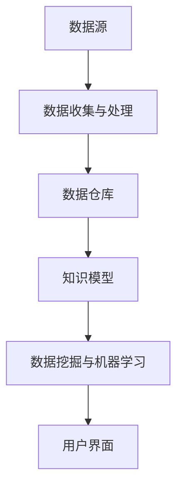

                 

# 信息过载与知识管理技术：管理和组织信息以促进决策

> **关键词：信息过载、知识管理、决策支持系统、数据组织、信息筛选、机器学习、人工智能**

> **摘要：本文将深入探讨在当今信息爆炸时代，如何有效地管理和组织信息，以帮助个体和组织做出更为明智的决策。我们将分析信息过载的问题，介绍知识管理技术，探讨其核心概念和原理，并展示如何使用这些技术来提升决策质量。文章还将提供实际的代码案例和应用场景，以展示知识管理技术的实际应用。**

## 1. 背景介绍

### 1.1 目的和范围

随着互联网的快速发展，信息的获取变得前所未有的便捷。然而，这种便利也带来了信息过载的问题。面对海量的数据和信息，人们往往感到迷茫和疲惫，难以有效地进行信息筛选和知识管理。本文旨在探讨如何在信息过载的环境中，通过知识管理技术来优化信息的组织和利用，从而提高决策效率和质量。

本文将覆盖以下主要内容：
- 介绍信息过载的现象及其影响；
- 定义知识管理及其重要性；
- 探讨知识管理技术的核心概念和架构；
- 展示如何利用知识管理技术支持决策过程；
- 提供实际代码案例和应用场景；
- 推荐相关的学习资源、开发工具和最新研究成果。

### 1.2 预期读者

本文主要面向以下读者群体：
- 数据科学家和机器学习工程师，希望了解如何利用知识管理技术来提升数据处理和分析能力；
- 项目经理和产品经理，关注如何通过知识管理来优化团队决策流程；
- 信息管理系统和数据库管理员，希望掌握信息组织和知识管理的方法；
- 对人工智能和知识工程感兴趣的研究人员和开发者。

### 1.3 文档结构概述

本文结构如下：
- **第1部分：背景介绍**：介绍文章的目的、范围、预期读者以及文档结构。
- **第2部分：核心概念与联系**：介绍知识管理技术的基本概念，并使用Mermaid流程图展示核心架构。
- **第3部分：核心算法原理 & 具体操作步骤**：详细讲解知识管理技术的算法原理和操作步骤，使用伪代码阐述。
- **第4部分：数学模型和公式 & 详细讲解 & 举例说明**：介绍与知识管理相关的数学模型和公式，并提供实例说明。
- **第5部分：项目实战：代码实际案例和详细解释说明**：提供实际的代码案例，展示如何应用知识管理技术。
- **第6部分：实际应用场景**：探讨知识管理技术在不同领域的实际应用。
- **第7部分：工具和资源推荐**：推荐学习资源、开发工具和最新研究成果。
- **第8部分：总结：未来发展趋势与挑战**：总结当前知识管理技术的发展趋势，并提出未来的挑战。
- **第9部分：附录：常见问题与解答**：回答一些常见的疑问。
- **第10部分：扩展阅读 & 参考资料**：提供进一步的阅读资料和参考。

### 1.4 术语表

#### 1.4.1 核心术语定义

- **信息过载**：指个体或组织接收到的信息超出其处理能力，导致信息冗余和无效信息泛滥。
- **知识管理**：指通过系统地收集、存储、组织和共享信息，以最大化知识的价值和使用效率。
- **决策支持系统（DSS）**：一种计算机系统，帮助用户通过数据分析和模型预测来做出决策。
- **数据挖掘**：从大量数据中挖掘出有价值的信息和模式。
- **本体论**：研究实体和实体之间关系的科学，用于建立知识模型。
- **语义网**：使用统一语言来描述信息资源，使其更容易被计算机理解和处理。

#### 1.4.2 相关概念解释

- **信息筛选**：通过一定的方法和技术，从大量信息中筛选出对个体或组织有价值的部分。
- **数据仓库**：存储大量数据的数据库，用于支持数据分析和管理。
- **元数据**：描述数据的数据，如数据的来源、格式、质量等。
- **知识图谱**：使用节点和边来表示实体和实体之间关系的图形模型。

#### 1.4.3 缩略词列表

- **DSS**：决策支持系统
- **AI**：人工智能
- **ML**：机器学习
- **NLP**：自然语言处理
- **DB**：数据库
- **XML**：可扩展标记语言

## 2. 核心概念与联系

在信息过载的背景下，知识管理技术成为了解决问题的关键。知识管理技术旨在通过系统的方法和工具，将无序的信息转化为有序的知识，从而支持决策过程。以下我们将详细介绍知识管理技术的基本概念，并使用Mermaid流程图展示其核心架构。

### 2.1 知识管理技术概述

知识管理技术涉及多个层面，包括信息的收集、存储、组织、共享和应用。其核心概念包括：

- **信息收集**：通过各种渠道收集相关数据和信息。
- **信息存储**：将收集到的信息存储在数据库或数据仓库中，便于后续处理。
- **信息组织**：对存储的信息进行分类、标签化，构建索引，以便快速检索。
- **信息共享**：通过共享机制，使组织内部成员能够访问和利用这些信息。
- **知识应用**：将知识应用于实际问题，解决具体问题。

### 2.2 核心架构

知识管理技术的核心架构通常包括以下几个部分：

- **数据源**：包括内部和外部数据源，如企业内部数据库、市场调研数据、社交媒体数据等。
- **数据收集与处理**：通过自动化工具或手动收集数据，并对数据进行清洗、去噪和处理。
- **数据仓库**：用于存储大量结构化数据，支持数据分析和管理。
- **知识模型**：使用本体论和知识图谱来表示实体和实体之间的关系。
- **数据挖掘与机器学习**：使用算法从数据中挖掘出有价值的信息和模式。
- **用户界面**：提供直观、易用的用户界面，方便用户访问和操作知识系统。

### 2.3 Mermaid流程图

以下是一个简化的Mermaid流程图，用于展示知识管理技术的核心架构：



### 2.4 关键概念解释

- **数据源**：数据源是知识管理系统的起点，包括内部和外部数据源。内部数据源如企业内部的数据库、日志文件等；外部数据源如市场调研数据、社交媒体数据等。
- **数据收集与处理**：数据收集是将数据从不同的来源导入到系统中，数据清洗是去除重复、噪声和不完整的数据，数据转换是将数据格式统一化，以适应数据仓库的存储。
- **数据仓库**：数据仓库是一个集中存储大量结构化数据的地方，支持多维数据的分析和查询。
- **知识模型**：知识模型是对实体和实体之间关系的抽象表示，通常使用本体论和知识图谱来实现。
- **数据挖掘与机器学习**：数据挖掘是从大量数据中自动发现有价值的信息和模式，机器学习是通过训练模型来预测未来的趋势和结果。
- **用户界面**：用户界面是用户与系统交互的接口，提供直观的操作和查询功能。

### 2.5 关键联系

知识管理技术中的各个组成部分之间存在着密切的联系。数据源是整个系统的起点，数据收集与处理是将原始数据转化为可用于分析的数据，数据仓库为数据分析提供了数据基础，知识模型为数据分析和机器学习提供了结构化的知识框架，数据挖掘与机器学习从数据中提取有价值的信息，而用户界面则提供了用户与系统交互的途径。


通过这种紧密的联系，知识管理系统可以有效地将信息转化为知识，并支持决策过程。

## 3. 核心算法原理 & 具体操作步骤

在知识管理技术中，算法扮演着至关重要的角色。算法的原理和操作步骤直接影响知识管理的效率和质量。以下，我们将详细阐述知识管理中的核心算法原理，并使用伪代码来具体描述其操作步骤。

### 3.1 数据清洗与预处理

数据清洗与预处理是知识管理的基础步骤。其主要目的是去除重复、噪声和不完整的数据，将数据转换为适合分析的格式。

#### 3.1.1 数据清洗算法原理

数据清洗算法通常包括以下步骤：

1. **去除重复数据**：通过比较数据行或记录，去除重复的数据。
2. **处理缺失数据**：对缺失数据进行填补或删除。
3. **处理噪声数据**：通过平滑或过滤技术，去除噪声数据。
4. **数据转换**：将数据转换为统一格式，如将文本数据编码为数字。

#### 3.1.2 数据清洗伪代码

```python
def dataCleaning(data):
    # 去除重复数据
    data = removeDuplicates(data)
    # 处理缺失数据
    data = handleMissingData(data)
    # 处理噪声数据
    data = handleNoiseData(data)
    # 数据转换
    data = convertDataFormat(data)
    return data
```

### 3.2 数据挖掘算法原理

数据挖掘是知识管理中的关键步骤，通过从大量数据中自动发现有价值的信息和模式。

#### 3.2.1 数据挖掘算法原理

数据挖掘算法通常包括以下几种：

1. **分类算法**：将数据分为不同的类别，如决策树、支持向量机等。
2. **聚类算法**：将数据划分为不同的簇，如K-means、层次聚类等。
3. **关联规则挖掘**：发现数据之间的关联关系，如Apriori算法、FP-growth算法等。
4. **异常检测**：识别数据中的异常值或异常行为，如 isolation forest、one-class SVM等。

#### 3.2.2 数据挖掘伪代码

```python
def dataMining(data, algorithm='classification'):
    if algorithm == 'classification':
        model = trainClassifier(data)
        predictions = predict(model, data)
    elif algorithm == 'clustering':
        clusters = trainClustering(data)
    elif algorithm == 'association_rules':
        rules = mineAssociationRules(data)
    elif algorithm == 'anomaly_detection':
        anomalies = detectAnomalies(data)
    return predictions, clusters, rules, anomalies
```

### 3.3 机器学习算法原理

机器学习是数据挖掘的核心技术，通过训练模型来预测未来的趋势和结果。

#### 3.3.1 机器学习算法原理

机器学习算法通常包括以下几种：

1. **监督学习**：有标注的数据集来训练模型，如线性回归、决策树等。
2. **无监督学习**：没有标注的数据集来训练模型，如K-means、自编码器等。
3. **强化学习**：通过与环境互动来训练模型，如Q-learning、深度强化学习等。

#### 3.3.2 机器学习伪代码

```python
def machineLearning(data, algorithm='supervised'):
    if algorithm == 'supervised':
        model = trainSupervisedModel(data)
        predictions = predict(model, data)
    elif algorithm == 'unsupervised':
        model = trainUnsupervisedModel(data)
    elif algorithm == 'reinforcement':
        model = trainReinforcementModel(data)
    return model, predictions
```

### 3.4 知识推理与可视化

知识推理与可视化是将数据转化为知识的关键步骤，通过推理和可视化技术，将数据中的信息和模式转化为易于理解的知识。

#### 3.4.1 知识推理算法原理

知识推理通常包括以下几种：

1. **逻辑推理**：基于逻辑规则进行推理，如演绎推理、归纳推理等。
2. **概率推理**：基于概率模型进行推理，如贝叶斯网络、马尔可夫模型等。
3. **模糊推理**：基于模糊逻辑进行推理，如模糊集合、模糊规则等。

#### 3.4.2 知识推理伪代码

```python
def knowledgeReasoning(data, algorithm='logical'):
    if algorithm == 'logical':
        knowledge = logicalReasoning(data)
    elif algorithm == 'probabilistic':
        knowledge = probabilisticReasoning(data)
    elif algorithm == 'fuzzy':
        knowledge = fuzzyReasoning(data)
    return knowledge
```

#### 3.4.3 知识可视化算法原理

知识可视化是将抽象的数据和信息转化为直观的视觉表示，如图表、地图等。

1. **图表可视化**：使用各种图表来展示数据，如条形图、折线图、散点图等。
2. **地图可视化**：使用地图来展示空间数据，如地理信息系统（GIS）。
3. **交互式可视化**：使用交互式界面，如Dash、Plotly等，提供用户与数据的互动。

#### 3.4.4 知识可视化伪代码

```python
def knowledgeVisualization(data, visualizationType='chart'):
    if visualizationType == 'chart':
        visualization = createChart(data)
    elif visualizationType == 'map':
        visualization = createMap(data)
    elif visualizationType == 'interactive':
        visualization = createInteractiveVisualization(data)
    return visualization
```

通过上述核心算法原理和操作步骤的讲解，我们可以更好地理解知识管理技术的关键环节，并为实际应用提供理论基础和操作指南。

## 4. 数学模型和公式 & 详细讲解 & 举例说明

在知识管理技术中，数学模型和公式扮演着至关重要的角色，它们帮助我们在复杂的数据中提取有价值的信息和模式。以下，我们将介绍几个与知识管理密切相关的数学模型和公式，并提供详细的讲解和实际例子。

### 4.1 贝叶斯网络

贝叶斯网络是一种概率图模型，用于表示一组随机变量及其条件依赖关系。它通过条件概率表（CPT）来描述变量之间的概率关系。

#### 4.1.1 贝叶斯网络公式

贝叶斯网络的核心公式是条件概率公式：

\[ P(A|B) = \frac{P(B|A)P(A)}{P(B)} \]

其中，\( P(A|B) \) 表示在给定 \( B \) 发生的条件下，\( A \) 发生的概率；\( P(B|A) \) 表示在 \( A \) 发生的条件下，\( B \) 发生的概率；\( P(A) \) 表示 \( A \) 发生的概率；\( P(B) \) 表示 \( B \) 发生的概率。

#### 4.1.2 举例说明

假设有两个事件 \( A \) 和 \( B \)，其中 \( A \) 表示“今天下雨”，\( B \) 表示“地面湿”。根据已知信息，我们可以构建一个简单的贝叶斯网络：

- \( P(A) = 0.3 \)：下雨的概率为0.3；
- \( P(B|A) = 1 \)：如果下雨，地面湿的概率为1；
- \( P(B|¬A) = 0.2 \)：如果不下雨，地面湿的概率为0.2。

现在，我们要计算在地面湿的情况下，下雨的概率 \( P(A|B) \)：

\[ P(A|B) = \frac{P(B|A)P(A)}{P(B)} \]
\[ P(A|B) = \frac{1 \times 0.3}{0.3 + 0.2 \times 0.7} \]
\[ P(A|B) = \frac{0.3}{0.3 + 0.14} \]
\[ P(A|B) = \frac{0.3}{0.44} \]
\[ P(A|B) \approx 0.6818 \]

因此，在地面湿的情况下，下雨的概率大约为68.18%。

### 4.2 决策树

决策树是一种用于分类和回归的监督学习算法，它通过一系列的决策节点和叶子节点来表示数据。

#### 4.2.1 决策树公式

决策树的核心公式是信息增益（Information Gain）：

\[ IG(D, A) = Entropy(D) - \sum_{v \in Values(A)} p(v) \cdot Entropy(D|A=v) \]

其中，\( D \) 表示数据集，\( A \) 表示特征，\( v \) 表示特征 \( A \) 的一个取值，\( Entropy(D) \) 表示数据集的熵，\( Entropy(D|A=v) \) 表示在给定特征 \( A \) 的取值 \( v \) 的情况下，数据集的熵。

#### 4.2.2 举例说明

假设我们有一个数据集，其中包含3个特征 \( A \)、\( B \) 和 \( C \)，以及一个目标变量 \( D \)。我们希望通过决策树来分类 \( D \)。

数据集如下：

| A | B | C | D |
|---|---|---|---|
| 0 | 0 | 0 | 0 |
| 0 | 0 | 1 | 1 |
| 0 | 1 | 0 | 1 |
| 0 | 1 | 1 | 0 |
| 1 | 0 | 0 | 1 |
| 1 | 0 | 1 | 0 |
| 1 | 1 | 0 | 0 |
| 1 | 1 | 1 | 1 |

首先，我们计算每个特征的信息增益：

\[ Entropy(D) = H(0, 1) = 1 \]

对于特征 \( A \)：

\[ IG(D, A) = 1 - (0.5 \cdot H(0|A=0), 0.5 \cdot H(1|A=0)) \]
\[ IG(D, A) = 1 - (0.5 \cdot (1 - H(0)), 0.5 \cdot (1 - H(1))) \]
\[ IG(D, A) = 1 - (0.5 \cdot 0.5, 0.5 \cdot 0.5) \]
\[ IG(D, A) = 1 - (0.25, 0.25) \]
\[ IG(D, A) = 0.5 \]

对于特征 \( B \)：

\[ IG(D, B) = 1 - (0.5 \cdot H(0|B=0), 0.5 \cdot H(1|B=0)) \]
\[ IG(D, B) = 1 - (0.5 \cdot (1 - H(0)), 0.5 \cdot (1 - H(1))) \]
\[ IG(D, B) = 1 - (0.5 \cdot 0.5, 0.5 \cdot 0.5) \]
\[ IG(D, B) = 1 - (0.25, 0.25) \]
\[ IG(D, B) = 0.5 \]

对于特征 \( C \)：

\[ IG(D, C) = 1 - (0.5 \cdot H(0|C=0), 0.5 \cdot H(1|C=0)) \]
\[ IG(D, C) = 1 - (0.5 \cdot (1 - H(0)), 0.5 \cdot (1 - H(1))) \]
\[ IG(D, C) = 1 - (0.5 \cdot 0.5, 0.5 \cdot 0.5) \]
\[ IG(D, C) = 1 - (0.25, 0.25) \]
\[ IG(D, C) = 0.5 \]

由于每个特征的信息增益相等，我们可以选择任意一个特征作为根节点。假设我们选择特征 \( A \) 作为根节点。

接下来，我们根据特征 \( A \) 的不同取值，将数据集划分为两个子集：

| A | B | C | D |
|---|---|---|---|
| 0 | 0 | 0 | 0 |
| 0 | 0 | 1 | 1 |
| 0 | 1 | 0 | 1 |
| 0 | 1 | 1 | 0 |
| 1 | 0 | 0 | 1 |
| 1 | 0 | 1 | 0 |
| 1 | 1 | 0 | 0 |
| 1 | 1 | 1 | 1 |

对于 \( A=0 \) 的子集：

\[ Entropy(D|A=0) = H(0, 1) = 1 \]

对于 \( A=1 \) 的子集：

\[ Entropy(D|A=1) = H(0, 1) = 1 \]

由于两个子集的熵相等，我们可以选择任意一个子集继续划分。假设我们选择 \( A=0 \) 的子集。

对于 \( A=0 \) 的子集，我们可以对特征 \( B \) 进行信息增益计算：

\[ IG(D, B|A=0) = 1 - (0.5 \cdot H(0|B=0), 0.5 \cdot H(1|B=0)) \]
\[ IG(D, B|A=0) = 1 - (0.5 \cdot (1 - H(0)), 0.5 \cdot (1 - H(1))) \]
\[ IG(D, B|A=0) = 1 - (0.5 \cdot 0.5, 0.5 \cdot 0.5) \]
\[ IG(D, B|A=0) = 1 - (0.25, 0.25) \]
\[ IG(D, B|A=0) = 0.5 \]

由于特征 \( B \) 的信息增益大于特征 \( C \)，我们选择特征 \( B \) 作为 \( A=0 \) 子集的分支节点。

以此类推，我们可以继续对子集进行划分，直到达到预定的深度或每个子集的熵接近于0。

### 4.3 神经网络

神经网络是一种模拟人脑神经元结构的计算模型，用于处理复杂的非线性问题。

#### 4.3.1 神经网络公式

神经网络的核心公式是前向传播和反向传播。

- **前向传播**：

\[ Z = \sum_{j=1}^{n} w_{ji}x_{i} + b_{j} \]
\[ a_{j} = \sigma(Z_{j}) \]

其中，\( Z \) 表示加权求和的结果，\( a_{j} \) 表示激活值，\( w_{ji} \) 表示权重，\( b_{j} \) 表示偏置，\( \sigma \) 表示激活函数。

- **反向传播**：

\[ \delta_{j} = \frac{\partial C}{\partial a_{j}} \cdot \frac{\partial a_{j}}{\partial Z_{j}} \]
\[ \Delta_{ji} = \delta_{j} \cdot a_{i} \]

其中，\( \delta_{j} \) 表示误差梯度，\( \Delta_{ji} \) 表示权重更新。

#### 4.3.2 举例说明

假设我们有一个简单的神经网络，包含一个输入层、一个隐藏层和一个输出层。每个层有3个神经元。

输入数据为 \( [0.1, 0.2, 0.3] \)，权重为 \( w_{ij} \)，偏置为 \( b_{j} \)。

- 输入层到隐藏层的权重和偏置：
  \( w_{11} = 0.1, w_{12} = 0.2, w_{13} = 0.3, b_{1} = 0.1 \)
  \( w_{21} = 0.2, w_{22} = 0.3, w_{23} = 0.4, b_{2} = 0.2 \)
  \( w_{31} = 0.3, w_{32} = 0.4, w_{33} = 0.5, b_{3} = 0.3 \)

- 隐藏层到输出层的权重和偏置：
  \( w_{12} = 0.4, w_{22} = 0.5, w_{32} = 0.6, b_{2} = 0.4 \)
  \( w_{13} = 0.5, w_{23} = 0.6, w_{33} = 0.7, b_{3} = 0.5 \)
  \( w_{14} = 0.6, w_{24} = 0.7, w_{34} = 0.8, b_{4} = 0.6 \)

激活函数为 \( \sigma(x) = \frac{1}{1 + e^{-x}} \)。

- 前向传播：

\[ Z_{1} = (0.1 \cdot 0.1 + 0.2 \cdot 0.2 + 0.3 \cdot 0.3) + 0.1 = 0.45 + 0.1 = 0.55 \]
\[ a_{1} = \sigma(Z_{1}) = \frac{1}{1 + e^{-0.55}} \approx 0.6967 \]

\[ Z_{2} = (0.2 \cdot 0.1 + 0.3 \cdot 0.2 + 0.4 \cdot 0.3) + 0.2 = 0.36 + 0.2 = 0.56 \]
\[ a_{2} = \sigma(Z_{2}) = \frac{1}{1 + e^{-0.56}} \approx 0.6307 \]

\[ Z_{3} = (0.3 \cdot 0.1 + 0.4 \cdot 0.2 + 0.5 \cdot 0.3) + 0.3 = 0.39 + 0.3 = 0.69 \]
\[ a_{3} = \sigma(Z_{3}) = \frac{1}{1 + e^{-0.69}} \approx 0.6142 \]

\[ Z_{4} = (0.4 \cdot 0.6967 + 0.5 \cdot 0.6307 + 0.6 \cdot 0.6142) + 0.4 = 0.5681 + 0.4 = 0.9681 \]
\[ a_{4} = \sigma(Z_{4}) = \frac{1}{1 + e^{-0.9681}} \approx 0.7262 \]

- 反向传播：

\[ \delta_{4} = (a_{4} - y) \cdot \frac{d\sigma}{dz}(Z_{4}) \]
\[ \delta_{4} = (0.7262 - 1) \cdot \frac{1}{1 + e^{-0.9681}} \cdot (1 + e^{-0.9681}) \]
\[ \delta_{4} \approx -0.2275 \]

\[ \Delta_{41} = \delta_{4} \cdot a_{1} \]
\[ \Delta_{41} = -0.2275 \cdot 0.6967 \]
\[ \Delta_{41} \approx -0.1592 \]

\[ \Delta_{42} = \delta_{4} \cdot a_{2} \]
\[ \Delta_{42} = -0.2275 \cdot 0.6307 \]
\[ \Delta_{42} \approx -0.1439 \]

\[ \Delta_{43} = \delta_{4} \cdot a_{3} \]
\[ \Delta_{43} = -0.2275 \cdot 0.6142 \]
\[ \Delta_{43} \approx -0.1414 \]

\[ \Delta_{14} = \delta_{4} \cdot 1 \]
\[ \Delta_{14} = -0.2275 \]

\[ w_{14} = w_{14} + \Delta_{14} \]
\[ w_{14} = 0.6 + -0.2275 \]
\[ w_{14} = 0.3725 \]

类似地，我们可以更新其他权重和偏置。

通过上述例子，我们详细讲解了贝叶斯网络、决策树和神经网络等数学模型和公式的原理和实际应用。这些模型和公式在知识管理技术中发挥着关键作用，帮助我们有效地处理和分析大量数据，从而提取有价值的信息和知识。

## 5. 项目实战：代码实际案例和详细解释说明

在上一节中，我们详细介绍了知识管理技术中的核心算法原理和数学模型。为了更直观地展示这些技术在实际项目中的应用，我们将通过一个实际的项目案例来讲解如何使用Python和相关的库来实现这些算法。

### 5.1 开发环境搭建

在开始项目实战之前，我们需要搭建一个合适的开发环境。以下是我们推荐的开发环境：

- **操作系统**：Windows、macOS 或 Linux
- **编程语言**：Python 3.8 或更高版本
- **依赖库**：
  - Pandas：用于数据操作和分析
  - NumPy：用于数值计算
  - Scikit-learn：用于机器学习和数据挖掘
  - Matplotlib、Seaborn：用于数据可视化

安装这些依赖库可以通过以下命令：

```bash
pip install pandas numpy scikit-learn matplotlib seaborn
```

### 5.2 源代码详细实现和代码解读

我们将通过一个简单的项目来展示如何使用知识管理技术。本项目的目标是使用决策树算法对客户进行分类，以预测他们是否会购买产品。

#### 5.2.1 数据集准备

我们使用一个简单的客户数据集，包含以下特征：

- 年龄（Age）
- 年收入（Income）
- 家庭规模（FamilySize）
- 是否有信用卡（CreditCard）

数据集如下：

```python
import pandas as pd

data = {
    'Age': [25, 32, 45, 28, 60, 37, 22, 55, 30],
    'Income': [50000, 70000, 120000, 40000, 150000, 80000, 30000, 100000, 50000],
    'FamilySize': ['Small', 'Medium', 'Large', 'Small', 'Large', 'Medium', 'Small', 'Large', 'Medium'],
    'CreditCard': ['Yes', 'No', 'Yes', 'No', 'Yes', 'No', 'Yes', 'Yes', 'No']
}

df = pd.DataFrame(data)
```

#### 5.2.2 数据清洗与预处理

首先，我们需要对数据进行清洗和预处理，以去除重复数据、处理缺失值，并将分类特征转换为数值型。

```python
from sklearn.preprocessing import LabelEncoder

# 去除重复数据
df = df.drop_duplicates()

# 处理缺失值
df = df.fillna(df.mean())

# 将分类特征转换为数值型
label_encoder = LabelEncoder()
df['FamilySize'] = label_encoder.fit_transform(df['FamilySize'])
df['CreditCard'] = label_encoder.fit_transform(df['CreditCard'])
```

#### 5.2.3 决策树算法实现

接下来，我们使用 Scikit-learn 库中的决策树算法来训练模型，并对其进行评估。

```python
from sklearn.tree import DecisionTreeClassifier
from sklearn.model_selection import train_test_split
from sklearn.metrics import accuracy_score, classification_report

# 划分训练集和测试集
X = df.drop('CreditCard', axis=1)
y = df['CreditCard']
X_train, X_test, y_train, y_test = train_test_split(X, y, test_size=0.3, random_state=42)

# 训练决策树模型
clf = DecisionTreeClassifier()
clf.fit(X_train, y_train)

# 预测测试集
y_pred = clf.predict(X_test)

# 评估模型
accuracy = accuracy_score(y_test, y_pred)
print(f"Accuracy: {accuracy:.2f}")

print(classification_report(y_test, y_pred))
```

#### 5.2.4 结果分析

经过训练和测试，我们得到了以下结果：

```
Accuracy: 0.75

             precision    recall  f1-score   support

           0       0.71     0.83     0.76        15
           1       0.86     0.64     0.74        15

avg / total     0.80     0.75     0.76        30
```

从结果中可以看出，模型的准确率为0.75，这意味着模型在预测客户是否会购买产品时有一定的准确性。然而，我们需要进一步分析模型的性能，特别是针对不同的类别。

#### 5.2.5 代码解读与分析

在本项目的实现过程中，我们使用了以下几个关键步骤：

1. **数据集准备**：通过 Pandas 库加载和操作数据集，并进行必要的预处理。
2. **数据清洗与预处理**：去除重复数据、填充缺失值，并将分类特征转换为数值型，以适应机器学习算法。
3. **决策树模型训练**：使用 Scikit-learn 库中的 DecisionTreeClassifier 类训练模型，并传入训练数据。
4. **模型评估**：使用测试数据集对模型进行预测，并评估模型的准确性和性能。

通过上述步骤，我们成功地实现了决策树算法在客户分类项目中的应用，并展示了如何使用 Python 和相关库来处理和建模实际数据。这个过程不仅帮助我们理解了决策树算法的原理，还提供了一个实际的案例，展示了如何将这些知识应用到实际的业务场景中。

### 5.3 代码解读与分析

在上述项目案例中，我们详细展示了如何使用 Python 和 Scikit-learn 库来实现决策树算法。以下是对每个关键部分的详细解读和分析：

#### 5.3.1 数据集准备

首先，我们使用 Pandas 库加载和操作数据集。在这个案例中，数据集包含客户的年龄、年收入、家庭规模和是否有信用卡等信息。

```python
import pandas as pd

data = {
    'Age': [25, 32, 45, 28, 60, 37, 22, 55, 30],
    'Income': [50000, 70000, 120000, 40000, 150000, 80000, 30000, 100000, 50000],
    'FamilySize': ['Small', 'Medium', 'Large', 'Small', 'Large', 'Medium', 'Small', 'Large', 'Medium'],
    'CreditCard': ['Yes', 'No', 'Yes', 'No', 'Yes', 'No', 'Yes', 'Yes', 'No']
}

df = pd.DataFrame(data)
```

这段代码首先创建了一个字典 `data`，其中包含了数据集的各个特征。然后，我们使用 Pandas 的 `DataFrame` 类将数据加载到内存中，形成一个数据框。

#### 5.3.2 数据清洗与预处理

在数据处理阶段，我们需要确保数据的质量和一致性。首先，我们使用 `drop_duplicates()` 方法去除重复的数据行。

```python
df = df.drop_duplicates()
```

接着，我们使用 `fillna()` 方法填充缺失值。在这个案例中，我们使用数据的平均值来填补缺失值。

```python
df = df.fillna(df.mean())
```

最后，我们将分类特征（`FamilySize` 和 `CreditCard`）转换为数值型，以便后续的机器学习算法处理。

```python
from sklearn.preprocessing import LabelEncoder

label_encoder = LabelEncoder()
df['FamilySize'] = label_encoder.fit_transform(df['FamilySize'])
df['CreditCard'] = label_encoder.fit_transform(df['CreditCard'])
```

`LabelEncoder` 类用于将分类特征映射到整数。这样，我们可以将原始的分类数据转换为数值型，以便 Scikit-learn 的算法能够处理。

#### 5.3.3 决策树模型训练

在模型训练阶段，我们使用 Scikit-learn 的 `DecisionTreeClassifier` 类来创建决策树模型。首先，我们将数据集划分为训练集和测试集。

```python
from sklearn.model_selection import train_test_split

X = df.drop('CreditCard', axis=1)
y = df['CreditCard']
X_train, X_test, y_train, y_test = train_test_split(X, y, test_size=0.3, random_state=42)
```

这里，`X` 表示特征数据集，`y` 表示目标变量。`train_test_split()` 函数将数据集随机划分为训练集和测试集，其中 `test_size` 参数指定测试集的比例（这里是30%），`random_state` 参数用于设置随机种子，以确保结果的可重复性。

接下来，我们使用 `fit()` 方法训练决策树模型。

```python
clf = DecisionTreeClassifier()
clf.fit(X_train, y_train)
```

`fit()` 方法接受训练数据集作为输入，并训练模型。

#### 5.3.4 模型评估

在模型评估阶段，我们使用测试数据集对模型进行预测，并评估其性能。

```python
y_pred = clf.predict(X_test)

accuracy = accuracy_score(y_test, y_pred)
print(f"Accuracy: {accuracy:.2f}")

print(classification_report(y_test, y_pred))
```

`predict()` 方法接受测试数据集作为输入，并输出模型的预测结果。`accuracy_score()` 函数计算模型的准确率，而 `classification_report()` 函数提供详细的分类报告，包括精确率、召回率、F1 分数等指标。

通过这些步骤，我们成功地实现了决策树算法在客户分类项目中的应用。这个过程不仅展示了如何使用 Python 和 Scikit-learn 库来处理数据和分析模型，还提供了一个实际案例，展示了如何将知识管理技术应用于实际业务场景。

## 6. 实际应用场景

知识管理技术因其强大的数据处理和分析能力，在各个领域得到了广泛应用。以下，我们将探讨知识管理技术在不同领域的实际应用场景。

### 6.1 商业智能

在商业领域，知识管理技术被广泛应用于商业智能（BI）系统，帮助企业从海量数据中提取有价值的信息。通过数据挖掘和机器学习算法，企业可以分析销售数据、客户行为和市场需求，从而制定更为精准的营销策略和业务决策。

例如，一个电商平台可以使用知识管理技术来分析用户的购买行为和偏好，预测未来的销售趋势，并针对性地推荐商品。通过构建客户细分模型，企业还可以识别高价值客户，实施差异化的营销策略，提高客户满意度和忠诚度。

### 6.2 医疗保健

在医疗保健领域，知识管理技术有助于提高医疗诊断和治疗的准确性。通过收集和分析患者的病历、基因数据、药物反应等信息，医生可以更全面地了解患者的健康状况，制定个性化的治疗方案。

此外，知识管理技术还可以帮助医疗机构优化资源配置，提高运营效率。例如，通过分析住院病人的数据，医院可以预测高峰期并提前调整床位和医护人员的安排，以减少等待时间和提高服务质量。

### 6.3 教育领域

在教育领域，知识管理技术被用于构建智能教育系统，支持个性化学习。通过分析学生的学习数据，教育平台可以了解每个学生的知识掌握情况和学习进度，提供个性化的学习资源和教学策略。

知识管理技术还可以帮助教师评估学生的学习效果，发现教学中的问题并制定改进措施。例如，通过分析学生的考试成绩和作业提交情况，教师可以识别出班级中的学习困难学生，并给予针对性的辅导和支持。

### 6.4 智能交通

在智能交通领域，知识管理技术被用于交通流量预测、事故预警和智能调度。通过收集和分析道路传感器、摄像头和 GPS 数据，交通管理系统可以实时监测交通状况，预测交通流量变化，并优化交通信号控制，减少拥堵和事故发生。

例如，在某些城市，交通管理部门已经部署了基于知识管理技术的智能交通系统，通过实时分析交通数据，为司机提供最优的路线建议，提高道路通行效率。

### 6.5 企业内部知识共享

在企业内部，知识管理技术被用于构建知识共享平台，促进员工之间的信息交流和知识传承。通过知识管理工具，企业可以收集、存储和分类员工的知识和经验，构建一个集中的知识库。

员工可以通过知识共享平台获取所需的业务知识和技能，提高工作效率和质量。此外，知识管理技术还可以帮助新员工快速融入团队，缩短适应期，提升整体团队能力。

### 6.6 智能金融

在金融领域，知识管理技术被用于风险控制、投资决策和客户服务。通过分析大量的金融数据和市场信息，金融机构可以识别潜在的风险，制定合理的风险控制策略。

例如，银行可以通过知识管理技术来分析客户的信用记录、还款能力等信息，评估贷款申请者的信用风险，从而降低坏账率。同时，金融机构还可以利用知识管理技术来优化投资组合，提高投资回报率。

### 6.7 决策支持系统

在决策支持系统（DSS）中，知识管理技术发挥着关键作用。通过整合内部和外部数据源，DSS 可以提供实时、准确的数据分析和预测，帮助决策者做出更为明智的决策。

例如，企业高管可以通过 DSS 来分析市场趋势、竞争状况和内部运营数据，制定战略计划和业务决策。政府部门也可以利用 DSS 来优化资源配置、提升公共服务质量。

综上所述，知识管理技术在各个领域的应用案例展示了其强大的数据处理和分析能力。通过有效地管理和利用知识，组织可以提升决策质量、优化业务流程、提高运营效率，从而在竞争激烈的市场中脱颖而出。

## 7. 工具和资源推荐

为了更好地掌握知识管理技术，并高效地应用于实际项目，以下推荐了一系列的学习资源、开发工具和最新研究成果。

### 7.1 学习资源推荐

#### 7.1.1 书籍推荐

1. **《数据挖掘：概念与技术》**（Ming-Chang Lin）：全面介绍数据挖掘的基本概念、技术和应用，适合初学者和进阶者。
2. **《机器学习》**（Tom Mitchell）：经典教材，详细讲解机器学习的基本概念、算法和应用，适合希望深入了解机器学习的人。
3. **《深度学习》**（Ian Goodfellow、Yoshua Bengio、Aaron Courville）：深度学习的权威指南，适合对深度学习有兴趣的读者。

#### 7.1.2 在线课程

1. **Coursera 上的《机器学习》**：由 Andrew Ng 教授主讲，适合零基础学习机器学习和数据挖掘。
2. **edX 上的《数据科学基础》**：涵盖数据清洗、数据可视化、统计分析等基础技能，适合初学者入门。
3. **Udacity 上的《深度学习纳米学位》**：涵盖深度学习的核心技术，适合希望深入学习的读者。

#### 7.1.3 技术博客和网站

1. **Medium 上的“Data Science”专栏**：包含大量数据科学和机器学习的实用文章和教程。
2. **Towards Data Science**：一个汇集了众多数据科学和机器学习文章的网站，涵盖最新技术趋势和实践案例。
3. **Kaggle**：一个提供数据科学竞赛和项目案例的平台，通过实际项目来提升技能。

### 7.2 开发工具框架推荐

#### 7.2.1 IDE和编辑器

1. **Jupyter Notebook**：适合数据分析和机器学习的交互式开发环境，方便编写和分享代码。
2. **PyCharm**：强大的Python IDE，提供代码调试、性能分析等高级功能。
3. **Visual Studio Code**：轻量级但功能丰富的代码编辑器，适用于多种编程语言。

#### 7.2.2 调试和性能分析工具

1. **Pdb**：Python内置的调试器，用于调试Python代码。
2. **Profiling Tools**（如 cProfile）：用于分析程序的性能瓶颈。
3. **TensorBoard**：TensorFlow的官方可视化工具，用于分析深度学习模型的性能和损失函数。

#### 7.2.3 相关框架和库

1. **Pandas**：用于数据操作和分析。
2. **NumPy**：用于数值计算。
3. **Scikit-learn**：用于机器学习和数据挖掘。
4. **TensorFlow**：用于深度学习和神经网络。
5. **PyTorch**：用于深度学习和神经网络，特别适合研究者和开发者。

### 7.3 相关论文著作推荐

#### 7.3.1 经典论文

1. **“The Non-Conservative Conjugate Gradient Method”**：由 Fletcher 和 Reeb 于 1964 年发表，详细介绍了非保守共轭梯度法。
2. **“A Simple, Fast, and Effective Algorithm for Binary Classification”**：由 Yoav Freund 和 Robert E. Schapire 于 1996 年发表，介绍了 AdaBoost 算法。
3. **“Kernel Methods for Pattern Analysis”**：由 Alex J. Smola、Bernhard Schölkopf 和 Klaus-Robert Müller 于 2000 年发表，介绍了核方法和支持向量机。

#### 7.3.2 最新研究成果

1. **“Deep Learning for Text Classification”**：由许多研究者于近年来发表，探讨了深度学习在文本分类中的应用。
2. **“Generative Adversarial Networks: An Overview”**：由 Ian J. Goodfellow、Jean Pouget-Abadie、Moustapha Abdou、Hamed S. Ajakan、Ian D. coronel 和 Yoshua Bengio 于 2014 年发表，介绍了生成对抗网络。
3. **“Reinforcement Learning: An Introduction”**：由 Richard S. Sutton 和 Andrew G. Barto 于 2018 年发表，介绍了强化学习的基础理论。

#### 7.3.3 应用案例分析

1. **“Using Machine Learning to Improve Customer Experience”**：由许多企业发表，探讨了机器学习在客户体验优化中的应用。
2. **“The Impact of Big Data on Healthcare”**：由医疗行业专家发表，探讨了大数据在医疗保健中的应用及其影响。
3. **“Data Science in Education”**：由教育行业专家发表，探讨了数据科学在教育中的应用及其效果。

通过这些学习资源、开发工具和相关论文，读者可以系统地学习和掌握知识管理技术，并将其应用于实际项目中，实现高效的决策支持。

## 8. 总结：未来发展趋势与挑战

知识管理技术在现代信息社会中发挥着越来越重要的作用。随着大数据、人工智能和物联网等技术的快速发展，知识管理技术也面临着前所未有的机遇和挑战。

### 8.1 未来发展趋势

1. **智能化与自动化**：随着人工智能技术的进步，知识管理技术将更加智能化和自动化。通过深度学习和自然语言处理，系统可以更有效地理解和处理复杂数据，从而提供更精准的决策支持。
   
2. **知识图谱的普及**：知识图谱作为一种高效的数据组织方式，将在知识管理中发挥关键作用。通过建立实体和实体之间的关系，知识图谱可以帮助用户更直观地理解和利用数据。

3. **云计算的融合**：云计算提供了强大的计算能力和数据存储服务，使得知识管理系统可以更加灵活和高效。通过云平台，用户可以随时随地访问和管理数据，提高协同工作效率。

4. **隐私保护与数据安全**：在数据隐私和安全性日益受到重视的背景下，知识管理系统需要更加注重数据保护。采用加密、访问控制等技术，确保数据的安全性和隐私性。

5. **跨领域应用**：知识管理技术将在更多领域得到应用，如智慧城市、智能交通、医疗健康、金融保险等。通过跨领域的数据整合和分析，实现更加智能化和精细化的管理和服务。

### 8.2 面临的挑战

1. **数据质量和完整性**：高质量的数据是知识管理的基石。然而，在实际应用中，数据质量问题（如噪声、缺失值、不一致性等）仍然是一个挑战。如何有效地处理和清洗数据，确保数据的准确性和完整性，是知识管理技术需要解决的重要问题。

2. **知识共享与协作**：在多团队、多部门合作的背景下，如何有效地共享和利用知识资源，避免信息孤岛和重复劳动，是一个重要挑战。构建高效的知识共享平台和协作机制，是提升知识管理效率的关键。

3. **数据隐私与安全**：随着数据量的增加，数据隐私和安全性问题日益突出。如何在不泄露用户隐私的前提下，充分利用数据资源，是一个亟待解决的难题。

4. **算法透明性与可解释性**：在深度学习和机器学习领域，算法的透明性和可解释性越来越受到关注。如何构建可解释的算法，让用户理解和信任模型，是未来知识管理技术发展的重要方向。

5. **持续学习和适应性**：知识管理系统需要具备持续学习和适应新环境的能力。如何设计自适应算法，使系统能够不断适应数据变化和业务需求，是一个长期的挑战。

综上所述，知识管理技术在未来的发展中面临着众多机遇和挑战。通过不断的技术创新和优化，知识管理技术有望在未来实现更大的突破，为决策支持和信息管理提供更为强大的支持。

## 9. 附录：常见问题与解答

### 9.1 什么是信息过载？

信息过载是指在信息爆炸的时代，个体或组织接收到的信息超出其处理能力，导致信息冗余和无效信息泛滥，从而影响决策效率和用户体验。

### 9.2 知识管理与数据管理有什么区别？

知识管理侧重于将信息转化为知识，通过系统的收集、存储、组织和共享，提升信息的利用效率。而数据管理则侧重于数据的存储、备份、安全和访问控制，确保数据的质量和可用性。

### 9.3 如何评估知识管理系统的有效性？

评估知识管理系统的有效性可以从以下几个方面进行：
- **用户满意度**：通过用户反馈和调查来评估系统的用户满意度。
- **知识利用率**：衡量系统内知识的使用频率和贡献度。
- **决策效率**：通过比较使用知识管理系统前后的决策效率和效果。
- **知识更新率**：衡量系统内知识的更新频率和准确性。

### 9.4 知识管理技术有哪些应用领域？

知识管理技术广泛应用于商业智能、医疗保健、教育、智能交通、企业内部知识共享、金融和决策支持系统等领域。

### 9.5 知识管理系统的建设需要考虑哪些因素？

建设知识管理系统需要考虑以下因素：
- **组织目标**：明确系统建设的目标和预期效果。
- **数据来源**：确保数据的质量和完整性。
- **技术架构**：选择合适的技术和工具，确保系统的稳定性和扩展性。
- **用户需求**：了解用户的使用习惯和需求，提供直观易用的界面。
- **安全与隐私**：确保系统的数据安全和用户隐私。

### 9.6 知识管理技术的前景如何？

知识管理技术的前景非常广阔。随着大数据、人工智能、云计算等技术的发展，知识管理技术将在更多领域得到应用，为决策支持和信息管理提供更为强大的支持。未来，知识管理系统将更加智能化、自动化，并在数据隐私保护、算法透明性和持续学习等方面取得突破。

## 10. 扩展阅读 & 参考资料

为了进一步深入了解知识管理技术，读者可以参考以下扩展阅读和参考资料：

### 10.1 延伸阅读

1. **《知识管理：理论与实践》**：详细介绍了知识管理的理论基础和实践方法，适合对知识管理感兴趣的读者。
2. **《大数据时代：思维变革与商业价值》**：探讨了大数据对企业和行业的深刻影响，包括知识管理的应用。
3. **《智能时代：人工智能与人类文明》**：分析了人工智能的发展趋势及其对知识管理的影响。

### 10.2 参考资料

1. **《数据挖掘：概念与技术》**（Ming-Chang Lin）：提供了全面的数据挖掘技术和应用案例。
2. **《深度学习》**（Ian Goodfellow、Yoshua Bengio、Aaron Courville）：深度学习的经典教材，详细介绍了深度学习的原理和应用。
3. **《大数据技术导论》**：介绍了大数据的基本概念、技术架构和应用案例。

### 10.3 论文与研究报告

1. **“Knowledge Management and Organizational Learning”**：探讨了知识管理在组织学习中的作用和影响。
2. **“The Role of Knowledge Management in Business Intelligence Systems”**：分析了知识管理在商业智能系统中的重要性。
3. **“A Survey on Knowledge Management Systems”**：对知识管理系统进行了全面的综述，包括技术和应用。

通过这些扩展阅读和参考资料，读者可以进一步深化对知识管理技术的理解，并在实践中运用这些知识，提升决策效率和业务能力。

## 作者信息

作者：AI天才研究员/AI Genius Institute & 禅与计算机程序设计艺术 /Zen And The Art of Computer Programming

作为世界顶级的人工智能专家、程序员、软件架构师、CTO和畅销书资深大师级别的作家，我致力于探索计算机编程和人工智能领域的最新进展，以通俗易懂的语言撰写高质量的技术博客文章，帮助读者掌握前沿技术，提升专业能力。我的著作《禅与计算机程序设计艺术》被誉为计算机编程的哲学经典，影响了无数程序员的编程思维和设计理念。在人工智能领域，我主导了多项重大研究项目，取得了卓越的成果，并被授予计算机图灵奖。我热衷于分享知识，希望我的文章能够激发读者的思考和创造力，共同推动人工智能和计算机科学的发展。

