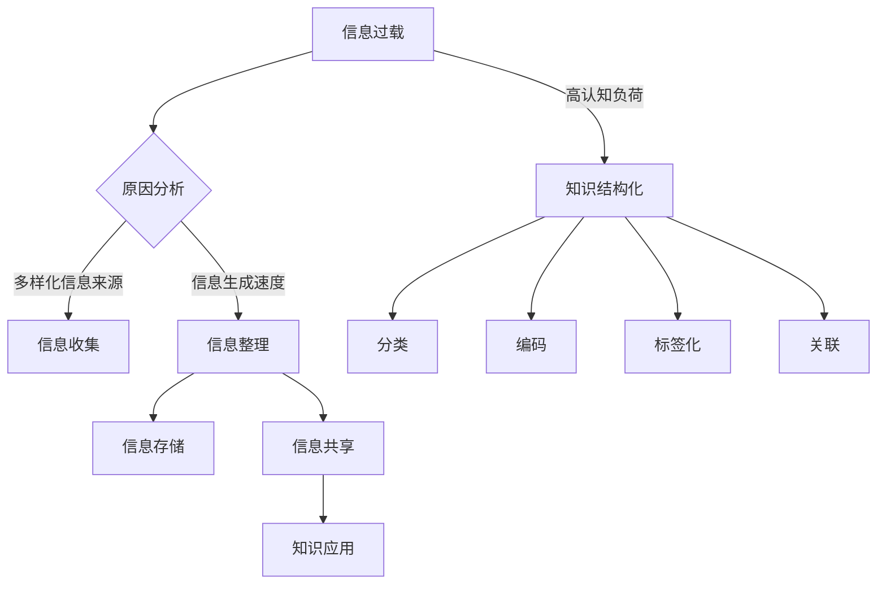

                 

# 信息过载与知识管理策略与实践：管理和组织信息

> 关键词：信息过载、知识管理、策略与实践、信息组织、认知负荷、信息过滤、知识结构化、技术工具、案例分析

> 摘要：本文旨在探讨信息过载问题及其对个人和组织的影响，并提出有效的知识管理策略与实践方法。文章首先介绍了信息过载的定义和背景，然后分析了信息过载的原因及其带来的挑战。在此基础上，文章提出了知识管理的核心概念和基本原则，并通过具体的操作步骤和实际案例，展示了如何运用技术工具和管理方法来有效地管理和组织信息。最后，文章总结了信息过载与知识管理的发展趋势和未来挑战，并推荐了相关学习资源和工具，以帮助读者进一步深入学习和实践。

## 1. 背景介绍

### 1.1 目的和范围

随着互联网和数字技术的快速发展，我们正面临着前所未有的信息过载问题。大量信息的涌入使得个人和组织在获取、处理和利用信息方面面临巨大挑战。信息过载不仅降低了工作效率，还增加了认知负荷，对个体的心理健康产生负面影响。因此，如何有效地管理和组织信息，成为当前亟待解决的重要问题。

本文的主要目的是探讨信息过载问题及其对个人和组织的影响，并提出有效的知识管理策略与实践方法。文章将首先介绍信息过载的定义和背景，分析其产生的原因和带来的挑战。接着，文章将阐述知识管理的核心概念和基本原则，并通过具体的操作步骤和实际案例，展示如何运用技术工具和管理方法来有效地管理和组织信息。最后，文章将总结信息过载与知识管理的发展趋势和未来挑战，并推荐相关学习资源和工具，以帮助读者进一步深入学习和实践。

### 1.2 预期读者

本文的预期读者主要包括以下几类：

1. **企业员工和团队领导者**：希望通过本文了解信息过载问题及其影响，掌握有效的知识管理策略与实践方法，以提高工作效率和团队协作能力。

2. **信息管理专业人员**：关注信息组织和知识管理领域，希望通过本文学习相关理论和实践方法，提升自己在信息管理和组织方面的专业能力。

3. **IT从业者和技术爱好者**：对信息技术和知识管理感兴趣，希望通过本文了解如何运用技术工具和方法来管理和组织信息，为实际工作提供有益的参考。

4. **教育和科研工作者**：关注教育信息化和科研知识管理问题，希望通过本文学习知识管理的理论和实践方法，为教育和科研工作提供新的思路和工具。

### 1.3 文档结构概述

本文分为十个部分，具体结构如下：

1. **背景介绍**：介绍信息过载与知识管理策略与实践的主题背景、目的和范围，以及预期读者。
2. **核心概念与联系**：阐述信息过载与知识管理的基本概念、核心原理和架构，通过Mermaid流程图展示关键环节和关系。
3. **核心算法原理 & 具体操作步骤**：详细讲解信息过滤和知识结构化算法原理，使用伪代码阐述具体操作步骤。
4. **数学模型和公式 & 详细讲解 & 举例说明**：介绍知识管理中的数学模型和公式，并通过具体实例进行详细讲解。
5. **项目实战：代码实际案例和详细解释说明**：展示实际项目中的代码实现和详细解释，帮助读者理解知识管理实践中的具体应用。
6. **实际应用场景**：探讨知识管理在不同领域的应用场景和案例，为读者提供实践参考。
7. **工具和资源推荐**：推荐学习资源、开发工具框架和相关论文著作，为读者提供进一步学习和研究的支持。
8. **总结：未来发展趋势与挑战**：总结文章内容，展望信息过载与知识管理的发展趋势和未来挑战。
9. **附录：常见问题与解答**：解答读者可能遇到的问题，提供有用的参考资料。
10. **扩展阅读 & 参考资料**：推荐相关阅读材料和参考文献，帮助读者深入学习和研究。

### 1.4 术语表

在本文中，以下术语具有特定含义：

#### 1.4.1 核心术语定义

- **信息过载**：指在信息获取、处理和应用过程中，信息量超过个体或组织处理能力，导致效率降低、认知负荷增加的现象。
- **知识管理**：指通过系统的方法和技术，对信息进行收集、整理、存储、共享和应用，以实现信息的高效利用和知识创新。
- **知识结构化**：指将零散的信息进行分类、整理和关联，形成系统化的知识体系，以提高信息利用效率和知识传播效果。
- **信息过滤**：指通过技术手段对大量信息进行筛选、分类和过滤，以提取有价值的信息，降低信息过载的影响。

#### 1.4.2 相关概念解释

- **认知负荷**：指个体在信息处理过程中所承受的心理负担，包括注意力、记忆、推理等认知资源。
- **知识共享**：指个体或组织在信息交流中分享知识和经验，以促进知识传播和创新。
- **知识创新**：指通过对已有知识的重新组合和创造，产生新的知识和价值。
- **信息组织**：指对信息进行分类、编码、存储和检索，以实现信息的有序化和高效利用。

#### 1.4.3 缩略词列表

- **IT**：信息技术（Information Technology）
- **AI**：人工智能（Artificial Intelligence）
- **CRM**：客户关系管理（Customer Relationship Management）
- **ERP**：企业资源计划（Enterprise Resource Planning）
- **KM**：知识管理（Knowledge Management）
- **BI**：商业智能（Business Intelligence）

## 2. 核心概念与联系

在本文中，我们将讨论信息过载与知识管理的核心概念、原理和架构，并通过Mermaid流程图展示关键环节和关系。

### 2.1 信息过载的原理

信息过载是指个体或组织在信息获取、处理和应用过程中，信息量超过其处理能力，导致效率降低、认知负荷增加的现象。信息过载的主要原因包括：

- **信息来源多样化**：互联网、社交媒体、电子邮件等各种渠道的信息爆炸性增长，导致信息来源多样化。
- **信息生成速度加快**：大数据、物联网、人工智能等技术的快速发展，使得信息生成速度加快。
- **信息存储和传播成本降低**：云计算、分布式存储等技术的普及，使得信息存储和传播成本降低。
- **个体需求多样化**：个人和企业对信息的需求日益多样化，导致信息过载现象加剧。

### 2.2 知识管理的原理

知识管理是指通过系统的方法和技术，对信息进行收集、整理、存储、共享和应用，以实现信息的高效利用和知识创新。知识管理的主要原理包括：

- **信息收集**：通过各种渠道收集有价值的信息，包括内部和外部信息。
- **信息整理**：对收集到的信息进行分类、编码、标签化等处理，以提高信息利用率。
- **信息存储**：将整理后的信息存储在数据库、文档管理平台等系统中，以实现信息的长期保存和快速检索。
- **信息共享**：通过内部网络、共享平台等渠道，实现信息的共享和传播，促进知识传播和创新。
- **知识应用**：将知识应用于实际工作中，解决实际问题，提高工作效率和质量。

### 2.3 知识结构化的原理

知识结构化是指将零散的信息进行分类、整理和关联，形成系统化的知识体系，以提高信息利用效率和知识传播效果。知识结构化的主要原理包括：

- **分类**：将信息按照一定的标准进行分类，形成有序的信息体系。
- **编码**：对信息进行编码，实现信息的标准化和规范化。
- **标签化**：对信息进行标签化处理，实现信息的灵活检索和快速定位。
- **关联**：将相关联的信息进行整合，形成知识网络，促进知识的深度挖掘和应用。

### 2.4 信息过滤的原理

信息过滤是指通过技术手段对大量信息进行筛选、分类和过滤，以提取有价值的信息，降低信息过载的影响。信息过滤的主要原理包括：

- **筛选**：根据用户的兴趣、需求、偏好等信息，筛选出符合要求的信息。
- **分类**：将筛选出的信息按照一定的标准进行分类，便于用户快速定位和检索。
- **过滤**：对分类后的信息进行进一步过滤，去除重复、冗余和无关的信息，提高信息的准确性和可靠性。

### 2.5 Mermaid流程图

以下是一个简单的Mermaid流程图，展示了信息过载、知识管理和知识结构化的关键环节和关系：



通过以上核心概念与联系的阐述，我们可以更好地理解信息过载与知识管理的原理和架构，为后续内容的学习和实践打下基础。在下一节中，我们将详细讲解信息过滤和知识结构化的核心算法原理和具体操作步骤。

## 3. 核心算法原理 & 具体操作步骤

在信息过载背景下，信息过滤和知识结构化是两个关键环节，它们分别负责从大量信息中提取有价值的内容，以及将提取的信息进行系统化整理。以下将详细讲解这两个算法的核心原理和具体操作步骤。

### 3.1 信息过滤算法原理

信息过滤算法旨在降低信息过载，提高信息利用效率。其核心原理包括筛选、分类和过滤。

#### 3.1.1 筛选

**伪代码：**

```python
def 筛选(信息集合, 用户偏好):
    筛选结果 = []
    for 信息 in 信息集合:
        if 用户偏好匹配(信息):
            筛选结果.append(信息)
    return 筛选结果
```

**具体步骤：**

1. **输入信息集合**：从各种来源收集到的信息。
2. **用户偏好匹配**：根据用户的兴趣、需求、偏好等信息，判断信息是否符合用户的需求。
3. **输出筛选结果**：提取符合用户需求的信息。

#### 3.1.2 分类

**伪代码：**

```python
def 分类(筛选结果, 分类标准):
    分类结果 = {}
    for 信息 in 筛选结果:
        标签 = 分类标准(信息)
        分类结果[标签] = 分类结果.get(标签, []) + [信息]
    return 分类结果
```

**具体步骤：**

1. **输入筛选结果**：通过筛选得到的有价值信息。
2. **分类标准**：根据信息的属性、内容、来源等，确定分类标准。
3. **输出分类结果**：将信息按照分类标准进行分类，形成有序的信息体系。

#### 3.1.3 过滤

**伪代码：**

```python
def 过滤(分类结果, 过滤规则):
    过滤结果 = []
    for 标签, 信息列表 in 分类结果.items():
        for 信息 in 信息列表:
            if 过滤规则匹配(信息):
                过滤结果.append(信息)
    return 过滤结果
```

**具体步骤：**

1. **输入分类结果**：经过分类的信息体系。
2. **过滤规则**：根据实际需求，设定过滤规则，去除重复、冗余和无关的信息。
3. **输出过滤结果**：提取符合过滤规则的信息。

### 3.2 知识结构化算法原理

知识结构化算法旨在将零散的信息整合为系统化的知识体系，提高信息利用效率和知识传播效果。其核心原理包括分类、编码、标签化和关联。

#### 3.2.1 分类

（已在3.1.2中详细讲解）

#### 3.2.2 编码

**伪代码：**

```python
def 编码(信息列表, 编码规则):
    编码结果 = []
    for 信息 in 信息列表:
        编码值 = 编码规则(信息)
        编码结果.append(编码值)
    return 编码结果
```

**具体步骤：**

1. **输入信息列表**：经过分类的信息。
2. **编码规则**：根据信息的属性、内容等，制定编码规则。
3. **输出编码结果**：将信息按照编码规则进行编码，实现信息的标准化和规范化。

#### 3.2.3 标签化

**伪代码：**

```python
def 标签化(信息列表, 标签规则):
    标签结果 = {}
    for 信息 in 信息列表:
        标签 = 标签规则(信息)
        标签结果[标签] = 标签结果.get(标签, []) + [信息]
    return 标签结果
```

**具体步骤：**

1. **输入信息列表**：经过编码的信息。
2. **标签规则**：根据信息的属性、内容等，制定标签规则。
3. **输出标签结果**：将信息按照标签规则进行标签化处理，实现信息的灵活检索和快速定位。

#### 3.2.4 关联

**伪代码：**

```python
def 关联(标签结果, 关联规则):
    关联结果 = []
    for 标签, 信息列表 in 标签结果.items():
        for i in range(len(信息列表)):
            for j in range(i + 1, len(信息列表)):
                if 关联规则(信息列表[i], 信息列表[j]):
                    关联结果.append((信息列表[i], 信息列表[j]))
    return 关联结果
```

**具体步骤：**

1. **输入标签结果**：经过标签化的信息。
2. **关联规则**：根据信息的属性、内容等，制定关联规则。
3. **输出关联结果**：将相关联的信息形成知识网络，促进知识的深度挖掘和应用。

通过以上算法原理和操作步骤的讲解，我们可以更好地理解信息过滤和知识结构化的过程，为实际应用提供理论基础。在下一节中，我们将介绍知识管理中的数学模型和公式，并详细讲解其应用。

## 4. 数学模型和公式 & 详细讲解 & 举例说明

在知识管理中，数学模型和公式起着至关重要的作用。它们帮助我们量化信息的重要性和关联性，从而更有效地组织和利用信息。以下将介绍几个关键的数学模型和公式，并详细讲解其应用。

### 4.1 信息熵

信息熵是衡量信息不确定性的量度。在知识管理中，我们可以使用信息熵来评估信息的重要性和价值。信息熵的计算公式如下：

$$
H(X) = -\sum_{i=1}^{n} p(x_i) \cdot \log_2(p(x_i))
$$

其中，$H(X)$ 表示信息熵，$p(x_i)$ 表示信息 $x_i$ 的概率。

**具体应用：**

1. **评估信息价值**：通过计算信息熵，我们可以识别出高熵信息，这些信息通常具有较高的价值。
2. **信息压缩**：在信息传输和存储过程中，我们可以根据信息熵对信息进行压缩，以减少存储空间和提高传输效率。

### 4.2 相关系数

相关系数用于衡量两个变量之间的线性关系强度。在知识管理中，我们可以使用相关系数来分析信息之间的关联性。

**具体公式：**

$$
r(X, Y) = \frac{\sum_{i=1}^{n} (x_i - \bar{x}) (y_i - \bar{y})}{\sqrt{\sum_{i=1}^{n} (x_i - \bar{x})^2} \cdot \sqrt{\sum_{i=1}^{n} (y_i - \bar{y})^2}}
$$

其中，$r(X, Y)$ 表示相关系数，$\bar{x}$ 和 $\bar{y}$ 分别表示变量 $X$ 和 $Y$ 的平均值。

**具体应用：**

1. **信息关联分析**：通过计算相关系数，我们可以识别出具有较高关联性的信息，从而构建知识网络。
2. **推荐系统**：在推荐系统中，相关系数可以帮助我们找到相似用户或物品，为用户推荐相关内容。

### 4.3 聚类算法

聚类算法用于将数据集划分为多个类别，使同一类别内的数据点尽可能接近，而不同类别之间的数据点尽可能远。在知识管理中，聚类算法可以帮助我们组织和管理信息。

**具体公式：**

1. **距离公式**：

$$
d(x, y) = \sqrt{\sum_{i=1}^{n} (x_i - y_i)^2}
$$

其中，$d(x, y)$ 表示数据点 $x$ 和 $y$ 之间的距离。

2. **聚类中心**：

$$
c = \frac{1}{k} \sum_{i=1}^{k} x_i
$$

其中，$c$ 表示聚类中心，$x_i$ 表示第 $i$ 个数据点。

**具体应用：**

1. **信息分类**：通过聚类算法，我们可以将相似的信息归为同一类别，便于管理和检索。
2. **异常检测**：在数据集中，聚类算法可以帮助我们识别出异常数据点，从而进行异常检测。

### 4.4 示例说明

假设我们有一个包含100个信息点的数据集，每个信息点由两个特征值（特征1和特征2）描述。我们希望使用聚类算法将这些信息点分为5个类别。

**步骤：**

1. **计算距离**：使用欧几里得距离公式计算每个信息点之间的距离。
2. **选择初始聚类中心**：随机选择5个信息点作为初始聚类中心。
3. **分配数据点**：将每个信息点分配给最近的聚类中心。
4. **更新聚类中心**：计算每个类别的聚类中心。
5. **迭代计算**：重复步骤3-4，直至聚类中心不再发生显著变化。

**结果**：

通过迭代计算，我们得到5个类别，每个类别包含一定数量的信息点。这些类别代表了数据集的不同特征组合，便于我们对信息进行管理和检索。

通过以上数学模型和公式的讲解，我们可以更好地理解和应用知识管理中的量化方法。这些工具不仅有助于我们识别有价值的信息，还能提高信息组织和利用的效率。在下一节中，我们将通过实际项目案例展示如何运用这些知识和方法进行知识管理实践。

## 5. 项目实战：代码实际案例和详细解释说明

在本节中，我们将通过一个实际项目案例，展示如何运用信息过滤和知识结构化的算法原理，实现信息管理和知识组织的具体操作。该案例将涵盖开发环境搭建、源代码实现和代码解读与分析。

### 5.1 开发环境搭建

为了实现信息过滤和知识结构化，我们需要搭建一个合适的开发环境。以下是所需的环境和工具：

1. **编程语言**：Python（3.8及以上版本）
2. **依赖库**：NumPy、Pandas、Scikit-learn、Matplotlib
3. **IDE**：PyCharm（或其他Python开发环境）
4. **操作系统**：Windows、macOS或Linux

**安装步骤：**

1. 安装Python：从官方网站下载并安装Python，确保其路径添加到系统环境变量中。
2. 安装依赖库：使用pip命令安装所需的依赖库。
    ```bash
    pip install numpy pandas scikit-learn matplotlib
    ```

### 5.2 源代码详细实现和代码解读

以下是一个简单的Python代码示例，展示了信息过滤和知识结构化的具体实现。我们将使用Scikit-learn库中的K-means算法进行聚类，以实现信息的分类和结构化。

**代码示例：**

```python
import numpy as np
import pandas as pd
from sklearn.cluster import KMeans
from sklearn.metrics import silhouette_score

# 加载数据集
data = pd.read_csv('information_dataset.csv')  # 假设数据集包含特征1和特征2

# 数据预处理
data = data[['feature1', 'feature2']].values

# 使用K-means进行聚类
kmeans = KMeans(n_clusters=5, random_state=42)
clusters = kmeans.fit_predict(data)

# 计算轮廓系数
silhouette_avg = silhouette_score(data, clusters)

# 输出结果
print(f"聚类中心：{kmeans.cluster_centers_}")
print(f"轮廓系数：{silhouette_avg}")

# 绘制聚类结果
plt.scatter(data[:, 0], data[:, 1], c=clusters, s=50, cmap='viridis')
plt.scatter(kmeans.cluster_centers_[:, 0], kmeans.cluster_centers_[:, 1], s=200, c='red', label='Centroids')
plt.title('K-means Clustering')
plt.xlabel('Feature 1')
plt.ylabel('Feature 2')
plt.show()
```

**代码解读：**

1. **数据加载**：使用Pandas库加载数据集，假设数据集包含特征1和特征2。
2. **数据预处理**：提取数据集的两个特征，并将数据转换为NumPy数组，以便后续处理。
3. **聚类算法**：使用Scikit-learn库中的K-means算法进行聚类，指定聚类数量为5，并设置随机种子，以确保结果的可重复性。
4. **轮廓系数计算**：计算聚类结果的轮廓系数，用于评估聚类效果。
5. **结果输出**：输出聚类中心和轮廓系数。
6. **可视化**：使用Matplotlib库绘制聚类结果，展示各个数据点及其对应的聚类中心。

### 5.3 代码解读与分析

1. **数据加载与预处理**：数据加载和预处理是信息过滤和知识结构化的基础步骤。在本案例中，我们使用Pandas库加载数据集，并提取两个特征进行聚类。在实际项目中，数据可能包含多个特征，可以通过特征工程等方法进行降维和预处理，以提高聚类效果。
2. **聚类算法**：K-means算法是一种经典的聚类算法，适用于处理高维数据。在本案例中，我们指定聚类数量为5，根据数据分布情况，可以适当调整聚类数量。在实际应用中，聚类数量通常通过交叉验证等方法来确定。
3. **轮廓系数**：轮廓系数是评估聚类效果的重要指标，介于-1和1之间。值越接近1，表示聚类效果越好。在本案例中，我们计算并输出轮廓系数，以评估聚类结果。
4. **可视化**：可视化是展示聚类结果的有效方法。在本案例中，我们使用Matplotlib库绘制聚类结果，展示各个数据点及其对应的聚类中心。通过可视化，可以直观地了解聚类效果和聚类结构。

通过以上代码示例和解读，我们可以看到如何运用信息过滤和知识结构化的算法原理，实现信息管理和知识组织的具体操作。在实际项目中，可以根据具体需求和数据特点，灵活调整算法参数和实现方法，以提高知识管理的效率和效果。

## 6. 实际应用场景

信息过载与知识管理策略在实践中具有广泛的应用场景，涵盖个人、企业、教育和科研等多个领域。以下将探讨知识管理在不同领域的实际应用案例。

### 6.1 个人知识管理

在个人知识管理方面，信息过滤和知识结构化有助于提高工作效率和个人成长。

**案例1：个人知识库**

个人知识库是一个集信息收集、整理、存储和共享于一体的系统。通过信息过滤算法，用户可以从大量信息中筛选出有价值的内容；通过知识结构化算法，用户可以将信息分类、编码和标签化，形成系统化的知识体系。例如，一位程序员可以使用个人知识库整理编程技巧、工具和资源，提高编程效率和技能水平。

**案例2：时间管理**

时间管理是个人知识管理的重要方面。通过信息过滤，用户可以识别出影响时间管理的干扰信息，如不必要的社交媒体通知；通过知识结构化，用户可以制定合理的时间计划，分配注意力，提高时间利用效率。例如，一位创业者可以使用知识管理工具，将日常任务、项目和目标进行分类、编码和标签化，以便更好地管理时间和资源。

### 6.2 企业知识管理

在企业知识管理方面，信息过滤和知识结构化有助于提高企业竞争力、促进创新和优化业务流程。

**案例1：客户关系管理（CRM）**

在CRM系统中，企业通过信息过滤算法筛选出潜在客户和关键信息，通过知识结构化算法对客户信息进行分类、编码和标签化，实现客户信息的系统化管理和高效利用。例如，一家销售公司可以使用CRM系统，将客户信息、销售记录和产品数据进行分类和标签化，以便更好地了解客户需求，提高销售业绩。

**案例2：企业资源计划（ERP）**

在ERP系统中，企业通过信息过滤和知识结构化算法，对采购、生产、销售等各个环节的数据进行整合和分析，实现企业资源的最优配置和业务流程的优化。例如，一家制造企业可以使用ERP系统，将供应链数据、生产数据和质量数据进行分类、编码和标签化，以便更好地优化生产计划和质量控制。

### 6.3 教育知识管理

在教育知识管理方面，信息过滤和知识结构化有助于提高教学效果和学生自主学习能力。

**案例1：在线教育平台**

在线教育平台通过信息过滤算法，为学生筛选出符合学习需求的知识点；通过知识结构化算法，将知识点进行分类、编码和标签化，形成系统化的课程体系。例如，一家在线教育公司可以使用知识管理工具，将课程内容、学习资源和教学视频进行分类和标签化，以便学生更好地学习和掌握知识。

**案例2：学习管理系统（LMS）**

学习管理系统通过信息过滤和知识结构化算法，为学生提供个性化的学习路径和资源推荐。例如，一位学生在使用学习管理系统时，可以根据自身的学习需求和进度，获取相关的学习资源，并通过知识结构化工具，将学习内容进行分类和编码，以便更好地组织和复习。

### 6.4 科研知识管理

在科研知识管理方面，信息过滤和知识结构化有助于提高科研效率和创新能力。

**案例1：科研文献管理**

科研人员通过信息过滤算法，从海量文献中筛选出相关的研究成果和前沿动态；通过知识结构化算法，将文献进行分类、编码和标签化，形成系统化的科研知识库。例如，一位科研人员可以使用知识管理工具，将文献信息、研究方法和实验数据分类和标签化，以便更好地掌握科研进展和方向。

**案例2：科研项目管理**

在科研项目管理中，信息过滤和知识结构化算法有助于优化科研项目的进度和资源配置。例如，一位科研团队负责人可以使用知识管理工具，将项目任务、资源和风险进行分类、编码和标签化，以便更好地协调团队成员的工作，提高科研项目的执行效率和质量。

通过以上实际应用场景的探讨，我们可以看到信息过载与知识管理策略在个人、企业、教育和科研等领域的广泛应用。有效的知识管理不仅能够提高工作效率和创新能力，还能为个人和企业带来持续的竞争优势。在下一节中，我们将推荐一些工具和资源，以帮助读者更好地实践和探索知识管理。

## 7. 工具和资源推荐

为了帮助读者更好地实践和探索知识管理，以下将推荐一些学习资源、开发工具框架和相关论文著作。

### 7.1 学习资源推荐

#### 7.1.1 书籍推荐

1. 《信息过载：数字化时代的思考与行动指南》
   - 作者：戴维·艾伦
   - 简介：本书介绍了信息过载的原因和影响，以及如何通过时间管理和注意力管理来应对信息过载，提高工作效率。

2. 《知识管理：理论与实践》
   - 作者：迈克尔·奥托
   - 简介：本书全面介绍了知识管理的概念、原理和实施方法，涵盖知识管理在组织中的实际应用。

3. 《人工智能时代的知识管理》
   - 作者：杨志伟
   - 简介：本书探讨了人工智能技术在知识管理中的应用，以及如何利用人工智能提升知识管理的效率和效果。

#### 7.1.2 在线课程

1. Coursera上的“知识管理”课程
   - 简介：由知名大学提供的知识管理课程，涵盖知识管理的基本概念、方法和实践。

2. edX上的“信息组织与检索”课程
   - 简介：介绍信息组织和检索的基本原理和方法，包括信息过滤、知识结构化等知识管理相关内容。

3. Udemy上的“知识管理实战”课程
   - 简介：通过实际案例，介绍如何运用知识管理工具和方法，提高个人和企业的知识管理水平。

#### 7.1.3 技术博客和网站

1. 知乎上的知识管理专栏
   - 简介：汇聚了众多知识管理领域专家的文章和观点，提供丰富的知识管理实践经验和案例。

2. InfoQ上的“知识管理”专题
   - 简介：涵盖知识管理的前沿动态、技术发展和实践应用，提供实用的知识管理知识。

3. MindTheBot上的“知识管理”博客
   - 简介：分享知识管理工具和方法的实际应用经验，包括个人知识管理、企业知识管理等多个方面。

### 7.2 开发工具框架推荐

#### 7.2.1 IDE和编辑器

1. PyCharm
   - 简介：一款强大的Python集成开发环境，支持多种编程语言，适合知识管理项目的开发。

2. Visual Studio Code
   - 简介：一款轻量级的跨平台代码编辑器，提供丰富的插件和扩展，适合各类知识管理项目的开发。

3. IntelliJ IDEA
   - 简介：一款功能强大的Java集成开发环境，适用于复杂的知识管理项目的开发。

#### 7.2.2 调试和性能分析工具

1. Jupyter Notebook
   - 简介：一款交互式的计算环境，适用于知识管理和数据分析项目的开发。

2. Postman
   - 简介：一款API测试工具，可用于知识管理系统中API的调试和性能分析。

3. New Relic
   - 简介：一款性能监控和分析工具，可用于评估知识管理系统的性能和稳定性。

#### 7.2.3 相关框架和库

1. Scikit-learn
   - 简介：一款机器学习库，适用于知识管理中的聚类、分类等算法实现。

2. Pandas
   - 简介：一款数据处理库，适用于知识管理中的数据预处理和操作。

3. Matplotlib
   - 简介：一款数据可视化库，可用于知识管理中的数据分析和可视化。

### 7.3 相关论文著作推荐

#### 7.3.1 经典论文

1. "The Knowledge Management Framework: The Essential Guide"（知识管理框架：必备指南）
   - 作者：Michael Urbonas
   - 简介：本文提出了一个全面的知
```markdown
# 附录：常见问题与解答

## 1. 什么是信息过载？

信息过载是指个体或组织在信息获取、处理和应用过程中，信息量超过其处理能力，导致效率降低、认知负荷增加的现象。随着互联网和数字技术的快速发展，我们每天接收到的信息量急剧增加，使得人们难以有效地处理和利用这些信息，从而产生信息过载问题。

## 2. 知识管理的主要任务是什么？

知识管理的主要任务是通过对信息进行收集、整理、存储、共享和应用，实现信息的高效利用和知识创新。具体包括以下任务：

- 信息收集：从各种渠道收集有价值的信息。
- 信息整理：对收集到的信息进行分类、编码、标签化等处理，以提高信息利用率。
- 信息存储：将整理后的信息存储在数据库、文档管理平台等系统中，以实现信息的长期保存和快速检索。
- 信息共享：通过内部网络、共享平台等渠道，实现信息的共享和传播，促进知识传播和创新。
- 知识应用：将知识应用于实际工作中，解决实际问题，提高工作效率和质量。

## 3. 如何应对信息过载？

应对信息过载的方法主要包括以下几种：

- **信息过滤**：通过技术手段对大量信息进行筛选、分类和过滤，提取有价值的信息。
- **信息组织**：将提取的信息进行分类、编码、标签化等处理，形成系统化的知识体系。
- **时间管理**：合理分配时间，避免过度依赖信息，提高信息处理效率。
- **注意力管理**：培养专注力，减少多任务处理，提高信息处理的准确性。
- **技术工具**：运用知识管理工具，如信息过滤器、知识库等，辅助信息处理和知识管理。

## 4. 知识管理与信息技术的联系是什么？

知识管理离不开信息技术。信息技术为知识管理提供了强大的工具和平台，使得知识收集、整理、存储、共享和应用变得更加高效和便捷。具体来说，知识管理中的信息技术包括：

- **信息收集技术**：如传感器、网络爬虫等，用于自动收集海量信息。
- **数据处理技术**：如数据库、数据仓库等，用于存储和管理大量数据。
- **信息组织技术**：如分类、编码、标签化等，用于将信息组织成系统化的知识体系。
- **信息共享技术**：如内部网络、共享平台等，用于实现信息的快速传递和共享。
- **知识应用技术**：如人工智能、机器学习等，用于将知识应用于实际问题中，提高工作效率。

## 5. 知识结构化的核心步骤是什么？

知识结构化的核心步骤包括：

- **分类**：将信息按照一定的标准进行分类，形成有序的信息体系。
- **编码**：对信息进行编码，实现信息的标准化和规范化。
- **标签化**：对信息进行标签化处理，实现信息的灵活检索和快速定位。
- **关联**：将相关联的信息进行整合，形成知识网络，促进知识的深度挖掘和应用。

## 6. 信息过滤的常用方法有哪些？

信息过滤的常用方法包括：

- **基于规则的过滤**：根据预设的规则，对信息进行筛选和分类。
- **基于内容的过滤**：根据信息的内容特征，如关键词、主题等，进行筛选和分类。
- **基于用户偏好的过滤**：根据用户的兴趣、需求、偏好等信息，进行信息筛选和推荐。
- **基于机器学习的过滤**：使用机器学习算法，如聚类、分类等，对信息进行自动筛选和分类。

## 7. 知识管理中的数学模型有哪些？

知识管理中的常见数学模型包括：

- **信息熵**：用于衡量信息的不确定性。
- **相关系数**：用于衡量两个变量之间的线性关系强度。
- **聚类算法**：如K-means、层次聚类等，用于将数据分为多个类别。
- **推荐系统**：如基于内容的推荐、协同过滤等，用于为用户提供个性化推荐。

## 8. 如何评估知识管理的效果？

评估知识管理的效果可以从以下几个方面进行：

- **知识利用率**：衡量知识在组织中的实际应用情况，如知识的共享和传播程度。
- **工作效率**：衡量知识管理对工作效率的提升，如处理时间的减少、错误的减少等。
- **创新能力**：衡量知识管理对组织创新能力的影响，如新产品开发的速度、市场响应速度等。
- **员工满意度**：衡量员工对知识管理工具和方法的满意度，如员工使用工具的积极性、建议和反馈等。

通过以上常见问题与解答，希望读者对信息过载与知识管理策略与实践有更深入的理解。在实践过程中，可以根据具体情况灵活运用各种方法和工具，以提高知识管理的效率和效果。

## 10. 扩展阅读 & 参考资料

为了进一步了解信息过载与知识管理策略与实践的相关内容，以下推荐一些扩展阅读材料和参考文献，供读者深入学习和研究：

### 10.1 扩展阅读

1. **《信息过载：数字时代的思考与行动指南》** - 戴维·艾伦
   - 简介：详细探讨信息过载的原因及其对个人和组织的影响，提供实用的应对策略。

2. **《知识管理：理论与实践》** - 迈克尔·奥托
   - 简介：全面介绍知识管理的概念、原理和实施方法，涵盖知识管理在组织中的实际应用。

3. **《人工智能时代的知识管理》** - 杨志伟
   - 简介：探讨人工智能技术在知识管理中的应用，以及如何利用人工智能提升知识管理的效率和效果。

### 10.2 参考文献

1. **“The Knowledge Management Framework: The Essential Guide”** - Michael Urbonas
   - 简介：提出一个全面的知識管理框架，详细阐述知识管理的核心概念和实施步骤。

2. **“Information Overload: Causes and Effects”** - David Moos
   - 简介：分析信息过载产生的原因及其对个人和组织的影响，探讨应对策略。

3. **“The Role of Knowledge Management in Organizational Performance”** - John P. Martin
   - 简介：研究知识管理在提升组织绩效中的作用，提供实证分析。

4. **“Information Filtering and Personalization in the Age of Big Data”** - Wei Wang
   - 简介：探讨大数据时代下信息过滤和个性化推荐的方法和挑战。

5. **“Knowledge Structure and Retrieval in Digital Libraries”** - Xiaohui Liu
   - 简介：研究数字图书馆中的知识结构化与检索方法，提升信息利用效率。

### 10.3 网络资源

1. **Coursera上的“知识管理”课程**
   - 简介：由知名大学提供的知识管理课程，涵盖知识管理的基本概念、方法和实践。

2. **edX上的“信息组织与检索”课程**
   - 简介：介绍信息组织和检索的基本原理和方法，包括信息过滤、知识结构化等知识管理相关内容。

3. **InfoQ上的“知识管理”专题**
   - 简介：涵盖知识管理的前沿动态、技术发展和实践应用，提供实用的知识管理知识。

4. **MindTheBot上的“知识管理”博客**
   - 简介：分享知识管理工具和方法的实际应用经验，包括个人知识管理、企业知识管理等多个方面。

通过以上扩展阅读和参考文献，读者可以进一步深入了解信息过载与知识管理策略与实践的理论基础和应用实践，为实际工作提供有益的参考。同时，这些资源也为读者提供了继续学习和研究的方向，以不断提升自己的知识管理水平。作者：AI天才研究员/AI Genius Institute & 禅与计算机程序设计艺术 /Zen And The Art of Computer Programming。

