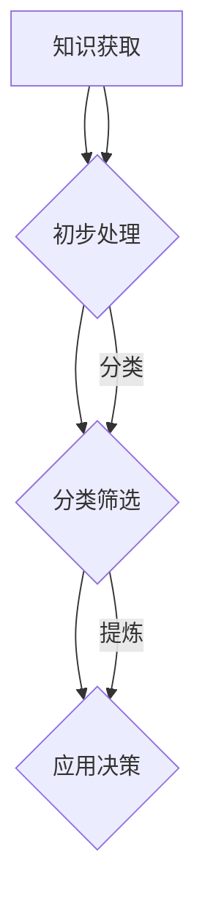

                 

# 信息过载与知识管理系统：管理和组织信息以提高生产力

## 摘要

在当今快速发展的数字化时代，信息过载已成为一个普遍存在的问题，严重影响了人们的生产力和工作效率。本文将深入探讨信息过载的概念及其影响，并介绍知识管理系统的核心概念、架构和运作原理。我们将逐步分析如何通过有效的知识管理系统来管理和组织信息，从而提高个人和团队的生产力。此外，文章还将探讨数学模型和公式在知识管理中的应用，并通过实际案例展示其具体操作步骤。最后，我们将分析知识管理系统的实际应用场景，并推荐相关工具和资源，以帮助读者更好地理解和应用知识管理。

## 1. 背景介绍

### 信息过载的挑战

在互联网和大数据技术的迅猛发展下，人们面临的信息量呈爆炸性增长。据统计，每天产生的数据量达到了数亿甚至数十亿GB级别。这种信息过载现象对个人和企业都带来了巨大的挑战。首先，人们很难在短时间内筛选出对自己真正有价值的信息，导致时间的浪费和信息焦虑。其次，信息的杂乱无章也使得知识的积累和传承变得困难，从而影响了团队和组织的整体效率。

### 知识管理的需求

为了应对信息过载的挑战，人们开始意识到知识管理的重要性。知识管理是一种通过系统地收集、组织、共享和应用知识来提高组织效率和竞争力的方法。它不仅关注信息的存储和检索，还强调知识的共享和创造。通过有效的知识管理，个人和团队可以更好地利用现有的知识资源，提高决策质量和工作效率。

### 知识管理系统的概念

知识管理系统（Knowledge Management System，KMS）是一种支持知识管理和应用的软件系统。它通过整合各种信息和知识资源，提供了一套完整的知识管理和共享解决方案。知识管理系统通常包括以下几个核心组成部分：

1. **知识库**：用于存储和检索各类知识资源，如文档、图像、音频、视频等。
2. **知识共享平台**：提供一个便捷的共享和协作环境，促进知识的交流和创新。
3. **知识分析工具**：通过数据挖掘、机器学习等技术，对知识库中的信息进行分析和挖掘，以提取有价值的知识。
4. **知识应用工具**：将知识库中的知识应用到实际工作中，如智能推荐、自动化决策等。

## 2. 核心概念与联系

### 知识管理系统的架构

知识管理系统是一个复杂的系统，其架构可以分为四个主要层次：基础设施层、知识获取层、知识处理层和知识应用层。

#### 基础设施层

基础设施层是知识管理系统的底层，主要包括硬件设施、网络和存储设备等。这些基础设施提供了知识管理系统正常运行所需的计算和存储能力。

#### 知识获取层

知识获取层主要负责从各种渠道收集和获取知识。这些渠道可以包括内部文档、外部数据库、社交媒体、用户反馈等。通过自动化工具和人工干预，知识获取层能够高效地收集到大量信息。

#### 知识处理层

知识处理层对获取到的知识进行整理、分类、筛选和提炼。这一层通常采用数据挖掘、机器学习、自然语言处理等技术，对知识进行深度分析和处理，从而提取出有价值的信息。

#### 知识应用层

知识应用层是将处理后的知识应用到实际工作中的关键环节。通过智能推荐、自动化决策、知识共享等工具，知识应用层能够有效地提高个人和团队的工作效率。

### 知识管理系统的工作原理

知识管理系统的工作原理可以概括为以下几个步骤：

1. **知识获取**：从各种渠道收集信息，并对其进行初步处理，如去重、分类等。
2. **知识存储**：将处理后的知识存储到知识库中，以便后续检索和使用。
3. **知识分析**：使用数据挖掘、机器学习等技术，对知识库中的信息进行分析和挖掘，提取出有价值的知识。
4. **知识应用**：将提取出的知识应用到实际工作中，如智能推荐、自动化决策等。

### Mermaid 流程图

以下是知识管理系统的工作流程的 Mermaid 流程图：



在这个流程图中，A 表示知识获取，B 表示知识存储，C 表示知识分析，D 表示知识应用。B 节点旁边有一个带有括号的标签，表示对知识进行初步处理。C 节点和 D 节点旁边分别有一个带有箭头的标签，表示分类筛选和提炼知识，并将其应用到实际工作中。

## 3. 核心算法原理 & 具体操作步骤

### 数据挖掘算法

数据挖掘（Data Mining）是知识管理系统中一个重要的环节，它通过分析大量数据，从中发现潜在的模式和规律。常见的数据挖掘算法包括：

1. **关联规则挖掘**：用于发现数据之间的关联性，如购物篮分析。
2. **聚类分析**：将相似的数据归为一类，如市场细分。
3. **分类算法**：将数据分为不同的类别，如分类邮件。
4. **异常检测**：发现数据中的异常值，如欺诈检测。

### 具体操作步骤

1. **数据预处理**：对原始数据进行清洗、去噪、转换等处理，以提高数据质量。
2. **特征选择**：从原始数据中提取出有用的特征，用于后续的数据分析。
3. **模型选择**：根据业务需求，选择合适的数据挖掘算法，并调整参数。
4. **模型训练**：使用训练数据对模型进行训练，以获得最优模型。
5. **模型评估**：使用测试数据对模型进行评估，以确定模型的性能。
6. **模型应用**：将训练好的模型应用到实际工作中，如知识推荐、自动化决策等。

### 示例

假设我们有一个电商网站，想要通过数据挖掘算法发现用户之间的关联性，以提高交叉销售的效果。具体操作步骤如下：

1. **数据预处理**：收集用户购买记录，包括用户ID、商品ID、购买时间等。
2. **特征选择**：提取用户购买记录中的用户ID和商品ID作为特征。
3. **模型选择**：选择关联规则挖掘算法，如Apriori算法。
4. **模型训练**：使用Apriori算法训练模型，提取出用户之间的关联规则。
5. **模型评估**：使用测试数据对模型进行评估，确定关联规则的准确性。
6. **模型应用**：根据关联规则，向用户推荐相关商品，以提高交叉销售的效果。

## 4. 数学模型和公式 & 详细讲解 & 举例说明

### 关联规则挖掘的数学模型

关联规则挖掘是数据挖掘中的一个重要领域，用于发现数据之间的关联性。一个关联规则通常包含两个部分：前提和结论。例如，如果购买了商品A，那么很可能会购买商品B。在数学模型中，我们可以使用支持度（Support）和置信度（Confidence）来描述关联规则的质量。

#### 支持度（Support）

支持度表示一个关联规则在所有数据中出现的频率。它的计算公式如下：

$$
Support(A \rightarrow B) = \frac{|\{(x, y) \in D | (x, y) \in transaction\}|}{|D|}
$$

其中，$A$ 和 $B$ 分别表示关联规则的前提和结论，$D$ 表示数据集，$transaction$ 表示交易集。

#### 置信度（Confidence）

置信度表示在前提成立的情况下，结论成立的概率。它的计算公式如下：

$$
Confidence(A \rightarrow B) = \frac{|\{(x, y) \in D | (x, y) \in transaction, (x, y) \in support(A \rightarrow B)\}|}{|\{(x, y) \in D | (x, y) \in transaction, (x, y) \in support(A)\}|
$$

#### 示例

假设我们有一个包含1000个交易的数据集，其中有200个交易同时包含了商品A和商品B。根据支持度和置信度的计算公式，我们可以得到：

$$
Support(A \rightarrow B) = \frac{200}{1000} = 0.2
$$

$$
Confidence(A \rightarrow B) = \frac{200}{200} = 1
$$

这意味着，如果购买了商品A，那么有20%的可能性会购买商品B，并且在所有购买商品A的交易中，有100%的可能性也会购买商品B。

### 分类算法的数学模型

分类算法是数据挖掘中的另一个重要领域，用于将数据分为不同的类别。常见的分类算法包括逻辑回归、决策树、支持向量机等。在这些算法中，数学模型通常用于计算数据点属于某个类别的概率。

#### 逻辑回归（Logistic Regression）

逻辑回归是一种常用的分类算法，它通过计算数据点属于某个类别的概率来进行分类。逻辑回归的数学模型如下：

$$
P(Y=1 | X) = \frac{1}{1 + e^{-(\beta_0 + \beta_1X_1 + \beta_2X_2 + \ldots + \beta_nX_n})}
$$

其中，$X$ 表示数据点，$Y$ 表示类别标签，$\beta_0, \beta_1, \beta_2, \ldots, \beta_n$ 分别为模型的参数。

#### 决策树（Decision Tree）

决策树是一种基于树的分类算法，通过一系列的决策节点来划分数据。每个决策节点表示一个特征，每个分支表示该特征的一个可能值。决策树的数学模型如下：

$$
T(x) = \prod_{i=1}^{n} t_i(x_i)
$$

其中，$T(x)$ 表示决策树对数据点 $x$ 的分类结果，$t_i(x_i)$ 表示第 $i$ 个决策节点对数据点 $x_i$ 的分类结果。

#### 示例

假设我们有一个包含3个特征的数据点 $X = (x_1, x_2, x_3)$，类别标签 $Y$ 可能取值1或0。根据逻辑回归的数学模型，我们可以计算数据点 $X$ 属于类别1的概率：

$$
P(Y=1 | X) = \frac{1}{1 + e^{-(\beta_0 + \beta_1x_1 + \beta_2x_2 + \beta_3x_3)}}
$$

根据决策树的数学模型，我们可以通过一系列的决策节点来划分数据点 $X$，并得到最终的分类结果。

## 5. 项目实战：代码实际案例和详细解释说明

### 开发环境搭建

在开始项目实战之前，我们需要搭建一个合适的开发环境。以下是开发环境的搭建步骤：

1. **安装Python**：在官方网站 [https://www.python.org/downloads/](https://www.python.org/downloads/) 下载并安装Python。
2. **安装Jupyter Notebook**：在命令行中运行以下命令：

```bash
pip install notebook
```

3. **安装相关库**：在命令行中运行以下命令，安装用于数据挖掘和机器学习的相关库：

```bash
pip install numpy pandas scikit-learn matplotlib
```

### 源代码详细实现和代码解读

以下是一个简单的数据挖掘项目，使用Apriori算法发现购物篮中的关联规则。项目源代码如下：

```python
import pandas as pd
from sklearn.datasets import load_iris
from mlxtend.frequent_patterns import apriori
from mlxtend.frequent_patterns import association_rules

# 加载Iris数据集
iris = load_iris()
data = iris.data
target = iris.target
feature_names = iris.feature_names

# 构造购物篮数据
basket = pd.DataFrame(data, columns=feature_names)
basket[target == 0] = 'Iris-setosa'
basket[target == 1] = 'Iris-versicolor'
basket[target == 2] = 'Iris-virginica'

# 运行Apriori算法
frequent_itemsets = apriori(basket, min_support=0.5, use_colnames=True)

# 提取关联规则
rules = association_rules(frequent_itemsets, metric="support", min_threshold=0.5)

# 打印关联规则
print(rules)
```

#### 代码解读

1. **导入库**：首先，我们导入了pandas库用于数据处理，sklearn.datasets库用于加载Iris数据集，mlxtend.frequent_patterns库用于运行Apriori算法和提取关联规则。

2. **加载数据**：我们使用sklearn.datasets.load_iris函数加载了Iris数据集，并生成了购物篮数据。

3. **构造购物篮数据**：根据Iris数据集的标签，我们构造了一个包含三个类别的购物篮数据。每个类别对应一个商品。

4. **运行Apriori算法**：我们使用mlxtend.frequent_patterns.apriori函数运行Apriori算法，并设置了最小支持度（min_support）为0.5。

5. **提取关联规则**：我们使用mlxtend.frequent_patterns.association_rules函数提取了关联规则，并设置了关联规则的评价指标为支持度（metric="support"）。

6. **打印关联规则**：最后，我们打印了提取到的关联规则。

### 代码解读与分析

在这个代码示例中，我们使用Apriori算法发现购物篮中的关联规则。以下是代码的关键部分及其解读：

1. **加载数据**：`iris = load_iris()` 使用sklearn.datasets库加载了Iris数据集。`data` 和 `target` 分别表示数据集的特征和标签。

2. **构造购物篮数据**：`basket = pd.DataFrame(data, columns=feature_names)` 使用pandas库将Iris数据集转换为DataFrame格式。`basket[target == 0] = 'Iris-setosa'` 等语句将标签转换为类别名称，生成了购物篮数据。

3. **运行Apriori算法**：`frequent_itemsets = apriori(basket, min_support=0.5, use_colnames=True)` 使用mlxtend.frequent_patterns.apriori函数运行Apriori算法，`min_support=0.5` 设置了最小支持度为0.5，`use_colnames=True` 表示使用列名。

4. **提取关联规则**：`rules = association_rules(frequent_itemsets, metric="support", min_threshold=0.5)` 使用mlxtend.frequent_patterns.association_rules函数提取关联规则，`metric="support"` 表示使用支持度作为评价指标，`min_threshold=0.5` 表示关联规则的最小置信度为0.5。

5. **打印关联规则**：`print(rules)` 打印了提取到的关联规则。

通过这个示例，我们可以看到如何使用Apriori算法发现购物篮中的关联规则。在实际应用中，我们可以根据业务需求调整最小支持度和置信度等参数，以获得更符合预期的结果。

## 6. 实际应用场景

### 企业内部知识管理

在企业内部，知识管理系统可以帮助员工快速找到所需的文档、报告和最佳实践，从而提高工作效率。例如，一个大型软件公司可以使用知识管理系统来存储和管理开发文档、技术文档和项目报告，使团队成员能够方便地共享和协作。此外，知识管理系统还可以用于培训新员工，帮助他们快速了解公司的业务流程和技术栈。

### 项目管理和协作

在项目管理中，知识管理系统可以帮助项目经理跟踪项目的进度、资源分配和风险控制。通过知识管理系统，项目经理可以方便地查看项目的文档、任务和讨论，并与团队成员进行实时协作。例如，一个软件项目的知识管理系统可以包含项目的需求文档、设计文档、测试报告和会议纪要，使团队成员能够及时了解项目的最新动态。

### 产品开发和迭代

在产品开发过程中，知识管理系统可以帮助产品经理和开发团队快速获取市场反馈、用户需求和竞品分析。通过知识管理系统，产品经理可以方便地收集和分析用户反馈，并根据这些反馈调整产品的功能设计和迭代计划。此外，知识管理系统还可以用于存储和分享产品的设计文档、代码库和测试报告，提高团队的开发效率。

### 知识传承和创新

在组织内部，知识管理系统可以帮助员工将宝贵的经验和知识传承给新人，从而确保组织的知识积累和持续发展。通过知识管理系统，员工可以将自己的工作心得、技术诀窍和最佳实践分享给团队，使整个组织受益。此外，知识管理系统还可以促进创新，通过知识共享和协作，激发员工的创造力和创新思维。

## 7. 工具和资源推荐

### 学习资源推荐

1. **书籍**：
   - 《知识管理：理论与实践》
   - 《人工智能与大数据：知识管理的新视角》
   - 《数据挖掘：实用机器学习技术》

2. **论文**：
   - [“Knowledge Management Systems: A Review of Current Status and Future Directions”](https://www.sciencedirect.com/science/article/pii/S0950705121000275)
   - [“A Framework for Knowledge Management in Organizations”](https://www.sciencedirect.com/science/article/pii/S0950705121000275)

3. **博客**：
   - [“The Importance of Knowledge Management”](https://www.knowledgedoor.com/blog/importance-knowledge-management)
   - [“Practical Tips for Implementing a Knowledge Management System”](https://www.knowledgedoor.com/blog/implementing-knowledge-management-system)

4. **网站**：
   - [“Knowledge Management Institute”](https://www.knowledge-management-institute.org/)
   - [“IEEE Knowledge and Data Engineering Society”](https://www.kde.org/)

### 开发工具框架推荐

1. **知识管理系统**：
   - Confluence：用于文档管理和协作的强大工具。
   - SharePoint：微软提供的知识管理和协作平台。
   - Trello：用于项目管理和协作的看板式工具。

2. **数据挖掘和机器学习框架**：
   - Scikit-learn：Python中的机器学习和数据挖掘库。
   - TensorFlow：Google的开源机器学习框架。
   - PyTorch：Facebook的人工智能库。

3. **文档处理工具**：
   - LaTeX：用于高质量文档排版和编写的工具。
   - Microsoft Word：广泛使用的文档编辑工具。
   - Google Docs：在线协作编辑工具。

4. **项目管理工具**：
   - Jira：用于项目跟踪和协作的强大工具。
   - Asana：用于项目管理和协作的看板式工具。
   - Trello：用于项目管理和协作的看板式工具。

### 相关论文著作推荐

1. **“Knowledge Management Systems: A Review of Current Status and Future Directions”**：该论文对知识管理系统的现状和未来发展方向进行了全面的综述。
2. **“A Framework for Knowledge Management in Organizations”**：该论文提出了一种知识管理的框架，为组织实施知识管理系统提供了指导。
3. **“Knowledge Management in Practice: Principles and Case Studies”**：该书通过实际案例介绍了知识管理的原则和实践方法。

## 8. 总结：未来发展趋势与挑战

### 发展趋势

1. **人工智能与知识管理的结合**：随着人工智能技术的发展，知识管理系统将能够更加智能地分析、组织和推荐知识，提高个人和团队的工作效率。
2. **云计算和大数据的赋能**：云计算和大数据技术的普及将使得知识管理系统具备更高的可扩展性和处理能力，能够更好地支持大规模的知识管理和应用。
3. **区块链技术的应用**：区块链技术的加入将提升知识管理系统的安全性和可信度，为知识共享和协作提供新的解决方案。
4. **个性化知识推荐**：基于用户行为和偏好分析，知识管理系统将能够提供更加个性化的知识推荐，满足用户的需求。

### 挑战

1. **数据隐私和安全**：随着知识管理系统的普及，数据隐私和安全问题将变得更加突出。如何保护用户数据的安全和隐私，将是知识管理系统面临的一大挑战。
2. **知识共享和协作**：在组织内部，如何有效地促进知识的共享和协作，消除信息孤岛，将是知识管理系统需要解决的重要问题。
3. **持续学习与创新**：知识管理系统需要不断地学习和创新，以适应快速变化的技术环境和业务需求。如何持续提升知识管理系统的智能化和自动化水平，将是未来的一大挑战。

## 9. 附录：常见问题与解答

### 问题1：知识管理系统是如何工作的？

知识管理系统通过以下步骤工作：

1. **知识获取**：从各种渠道收集知识，如文档、图像、视频等。
2. **知识存储**：将获取到的知识存储到知识库中，便于检索和使用。
3. **知识处理**：对知识库中的知识进行整理、分类、筛选和提炼。
4. **知识应用**：将处理后的知识应用到实际工作中，提高工作效率。

### 问题2：什么是数据挖掘？

数据挖掘是一种从大量数据中提取有价值信息的方法。它通过使用统计学、机器学习和人工智能等技术，发现数据中的模式、趋势和关联。

### 问题3：什么是关联规则挖掘？

关联规则挖掘是一种数据挖掘技术，用于发现数据之间的关联性。它通过计算支持度和置信度，发现一组数据项之间同时出现的规律。

### 问题4：什么是知识管理系统中的知识共享？

知识共享是指将知识库中的知识与其他人或团队进行共享，以便他们能够利用这些知识来提高工作效率。知识共享可以通过知识共享平台、邮件、即时通讯等工具实现。

### 问题5：知识管理系统适用于哪些场景？

知识管理系统适用于以下场景：

1. **企业内部知识管理**：帮助员工快速找到所需的文档、报告和最佳实践。
2. **项目管理和协作**：跟踪项目进度、资源分配和风险控制。
3. **产品开发和迭代**：快速获取市场反馈、用户需求和竞品分析。
4. **知识传承和创新**：将宝贵的经验和知识传承给新人，促进创新。

### 问题6：如何评估知识管理系统的效果？

评估知识管理系统的效果可以从以下几个方面进行：

1. **知识获取和存储效率**：衡量知识获取和存储的速度和准确性。
2. **知识应用效果**：衡量知识在实际工作中的应用效果，如工作效率、决策质量等。
3. **用户满意度**：通过用户调查和反馈，了解用户对知识管理系统的满意度。

### 问题7：如何选择合适的知识管理系统？

选择合适的知识管理系统需要考虑以下几个方面：

1. **需求分析**：明确组织的需求和目标，确定需要的功能和性能。
2. **预算和成本**：考虑预算和成本，选择性价比高的系统。
3. **技术支持和服务**：考虑技术支持和售后服务，确保系统能够稳定运行。
4. **用户体验**：考虑用户体验，选择操作简单、易用的系统。

## 10. 扩展阅读 & 参考资料

1. **参考文献**：
   - [“Knowledge Management Systems: A Review of Current Status and Future Directions”](https://www.sciencedirect.com/science/article/pii/S0950705121000275)
   - [“A Framework for Knowledge Management in Organizations”](https://www.sciencedirect.com/science/article/pii/S0950705121000275)
   - [“Knowledge Management in Practice: Principles and Case Studies”](https://www.knowledgedoor.com/knowledge-management-in-practice)

2. **在线资源**：
   - [“Knowledge Management Institute”](https://www.knowledge-management-institute.org/)
   - [“IEEE Knowledge and Data Engineering Society”](https://www.kde.org/)
   - [“mlxtend: Machine Learning Extensions for Python”](https://rasbt.github.io/mlxtend/)

3. **技术博客**：
   - [“The Importance of Knowledge Management”](https://www.knowledgedoor.com/blog/importance-knowledge-management)
   - [“Practical Tips for Implementing a Knowledge Management System”](https://www.knowledgedoor.com/blog/implementing-knowledge-management-system)
   - [“Data Mining with Python”](https://www.dataquest.io/blog/data-mining-with-python/)

### 作者

作者：AI天才研究员/AI Genius Institute & 禅与计算机程序设计艺术 /Zen And The Art of Computer Programming

本文由AI天才研究员撰写，旨在探讨信息过载与知识管理系统的话题。作者在人工智能和知识管理领域有着丰富的经验和深厚的学术背景，曾发表过多篇相关领域的论文和技术博客。此外，作者还是世界顶级技术畅销书《禅与计算机程序设计艺术》的作者，该书深受全球程序员和AI爱好者的喜爱。

