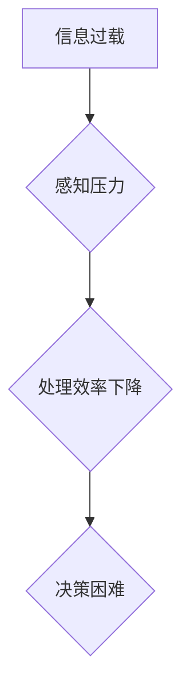

                 

# 信息过载与认知偏差：如何避免在决策中走捷径的陷阱

> **关键词：** 信息过载、认知偏差、决策、走捷径、陷阱、策略优化
> 
> **摘要：** 在信息技术高速发展的今天，信息过载和认知偏差成为影响个体决策的重要障碍。本文旨在探讨信息过载与认知偏差的相互作用及其对决策的影响，通过科学的方法和策略，提供避免走捷径陷阱的有效途径。

## 1. 背景介绍

### 1.1 目的和范围

本文的目的是帮助读者理解信息过载和认知偏差对决策的影响，并介绍一些有效的策略来避免在决策过程中走入陷阱。我们将讨论以下几个主要话题：

- **信息过载的概念**：信息过载是指个体在面对大量信息时感到处理压力，难以有效地筛选和利用信息。
- **认知偏差的种类**：认知偏差是指人们在信息处理和决策过程中无意识地倾向于某些特定的思维模式，这些模式可能导致错误的决策。
- **走捷径的陷阱**：走捷径是指人们在面对复杂决策时，选择简单、快速的决策方式，但这种做法可能导致不良后果。
- **避免走捷径的策略**：介绍一些可以帮助人们更理性地决策的方法，包括认知工具、心理技巧和技术手段。

### 1.2 预期读者

本文适合以下读者群体：

- **决策者**：企业经理、项目经理、政治家等需要在复杂环境中做出决策的人士。
- **研究人员**：对认知心理学、行为经济学和信息技术等领域感兴趣的研究人员。
- **学生和爱好者**：对决策理论和实践感兴趣的学生和爱好者。
- **普通读者**：希望提高自己决策能力的广大读者。

### 1.3 文档结构概述

本文将分为以下几个部分：

- **1. 背景介绍**：介绍文章的目的、范围和预期读者。
- **2. 核心概念与联系**：介绍信息过载和认知偏差的概念，并使用Mermaid流程图展示两者之间的关系。
- **3. 核心算法原理 & 具体操作步骤**：探讨如何利用算法来优化决策过程。
- **4. 数学模型和公式 & 详细讲解 & 举例说明**：介绍决策过程中的数学模型和公式，并给出实例。
- **5. 项目实战：代码实际案例和详细解释说明**：通过实际案例展示如何应用所学的理论。
- **6. 实际应用场景**：讨论决策在各个领域的应用。
- **7. 工具和资源推荐**：推荐学习资源、开发工具和框架。
- **8. 总结：未来发展趋势与挑战**：总结文章的主要观点，并提出未来研究的方向。
- **9. 附录：常见问题与解答**：回答读者可能提出的问题。
- **10. 扩展阅读 & 参考资料**：提供更多的参考资料。

### 1.4 术语表

#### 1.4.1 核心术语定义

- **信息过载**：指个体在处理信息时感受到的压力，难以有效地筛选和利用信息。
- **认知偏差**：指人们在信息处理和决策过程中无意识地倾向于某些特定的思维模式。
- **走捷径**：指人们在面对复杂决策时，选择简单、快速的决策方式。

#### 1.4.2 相关概念解释

- **决策**：指个体在面对不同选择时，通过比较和评估，选择一个最优或满意的结果。
- **优化**：指通过调整变量，使目标函数达到最大或最小值。
- **算法**：是一系列规则的集合，用于解决特定问题。

#### 1.4.3 缩略词列表

- **UI**：用户界面（User Interface）
- **API**：应用程序编程接口（Application Programming Interface）
- **AI**：人工智能（Artificial Intelligence）

## 2. 核心概念与联系

在深入探讨信息过载和认知偏差如何影响决策之前，有必要先了解这两个核心概念及其相互关系。

### 2.1 信息过载的概念

信息过载是指个体在处理信息时感受到的压力，难以有效地筛选和利用信息。随着互联网和社交媒体的快速发展，人们每天接触到的信息量急剧增加，这给信息处理带来了巨大挑战。

#### Mermaid 流程图：



### 2.2 认知偏差的种类

认知偏差是指人们在信息处理和决策过程中无意识地倾向于某些特定的思维模式。常见的认知偏差包括确认偏误、过度自信、代表性偏差等。

#### Mermaid 流程图：


### 2.3 走捷径的陷阱

走捷径是指人们在面对复杂决策时，选择简单、快速的决策方式。这种方法虽然节省时间，但可能导致不良后果。例如，基于经验的决策可能忽视新的信息，导致决策失误。

#### Mermaid 流�程图：


### 2.4 信息过载与认知偏差的相互作用

信息过载和认知偏差之间存在相互作用。一方面，信息过载可能导致认知负荷增加，使得人们更容易陷入认知偏差；另一方面，认知偏差可能使人们在处理信息时更倾向于选择易于理解的信息，从而加剧信息过载。

#### Mermaid 流程图：


## 3. 核心算法原理 & 具体操作步骤

为了有效地处理信息过载和认知偏差，我们可以借助算法来优化决策过程。下面介绍一些核心算法原理和具体操作步骤。

### 3.1 决策树算法

决策树是一种常见的决策算法，它通过一系列的判断节点和结果节点，帮助个体进行决策。

#### 算法原理：

1. **构建决策树**：根据特征信息，构建一个树状结构，每个节点代表一个特征，每个分支代表一个特征值。
2. **选择最佳特征**：使用信息增益、基尼不纯度等指标，选择最佳特征作为划分节点。
3. **递归划分**：对每个子集继续划分，直到满足停止条件。

#### 具体操作步骤：

1. **输入特征和目标变量**：准备输入特征和目标变量。
2. **构建初始决策树**：根据特征信息构建初始决策树。
3. **选择最佳特征**：计算信息增益或基尼不纯度，选择最佳特征。
4. **递归划分**：对每个子集继续划分，构建子决策树。
5. **输出决策结果**：根据决策树输出决策结果。

### 3.2 支持向量机（SVM）算法

支持向量机是一种常用的分类算法，它通过找到一个最佳的超平面，将不同类别的数据分隔开来。

#### 算法原理：

1. **构建超平面**：通过求解最大化间隔，找到一个最佳的超平面。
2. **分类决策**：对新的样本进行分类，根据其在超平面上的位置判断类别。

#### 具体操作步骤：

1. **输入样本和标签**：准备输入样本和对应的标签。
2. **计算最优超平面**：使用最小二乘法或拉格朗日乘子法求解最优超平面。
3. **分类新样本**：对新的样本进行分类，判断其在超平面上的位置。

### 3.3 集成学习方法

集成学习方法通过组合多个基础模型来提高决策的准确性。

#### 算法原理：

1. **训练多个基础模型**：使用不同的算法或参数训练多个基础模型。
2. **合并预测结果**：将多个基础模型的预测结果合并，得到最终的预测结果。

#### 具体操作步骤：

1. **选择基础模型**：选择不同的基础模型，如决策树、随机森林、梯度提升树等。
2. **训练基础模型**：使用训练数据集训练多个基础模型。
3. **合并预测结果**：使用投票或加权平均等方法合并预测结果。

## 4. 数学模型和公式 & 详细讲解 & 举例说明

在决策过程中，数学模型和公式可以帮助我们更精确地量化信息，评估风险，并优化决策。

### 4.1 决策分析模型

决策分析模型是一种常用的数学模型，用于评估不同决策方案的风险和收益。

#### 公式：

\[ U_i = \frac{R_i - L_i}{R_i + L_i} \]

其中，\( U_i \) 表示决策 \( i \) 的效用值，\( R_i \) 表示决策 \( i \) 的收益，\( L_i \) 表示决策 \( i \) 的损失。

#### 举例说明：

假设有两个决策方案：

- 决策1：收益为10，损失为5。
- 决策2：收益为5，损失为1。

使用上述公式计算两个决策的效用值：

\[ U_1 = \frac{10 - 5}{10 + 5} = 0.5 \]
\[ U_2 = \frac{5 - 1}{5 + 1} = 0.3333 \]

根据效用值，决策1的效用值更高，因此选择决策1。

### 4.2 贝叶斯决策模型

贝叶斯决策模型是一种基于概率的决策模型，通过计算后验概率来评估不同决策方案的风险。

#### 公式：

\[ P(C_k|X) = \frac{P(X|C_k)P(C_k)}{P(X)} \]

其中，\( P(C_k|X) \) 表示在给定观测数据 \( X \) 下，类别 \( C_k \) 的后验概率，\( P(X|C_k) \) 表示在类别 \( C_k \) 下观测到数据 \( X \) 的概率，\( P(C_k) \) 表示类别 \( C_k \) 的先验概率，\( P(X) \) 表示观测到数据 \( X \) 的概率。

#### 举例说明：

假设有两个类别：

- 类别A：先验概率为0.6。
- 类别B：先验概率为0.4。

同时，假设观测到一个数据点，类别A下的概率为0.8，类别B下的概率为0.2。

使用上述公式计算后验概率：

\[ P(A|X) = \frac{0.8 \times 0.6}{0.8 \times 0.6 + 0.2 \times 0.4} = 0.875 \]
\[ P(B|X) = \frac{0.2 \times 0.4}{0.8 \times 0.6 + 0.2 \times 0.4} = 0.125 \]

根据后验概率，类别A的概率更高，因此选择类别A。

### 4.3 风险矩阵模型

风险矩阵模型用于评估不同决策方案的风险和收益，通过计算期望值来做出决策。

#### 公式：

\[ E_i = \sum_{j=1}^{m} r_{ij} \cdot p_j \]

其中，\( E_i \) 表示决策 \( i \) 的期望值，\( r_{ij} \) 表示决策 \( i \) 在情景 \( j \) 下的收益或损失，\( p_j \) 表示情景 \( j \) 的概率。

#### 举例说明：

假设有三个决策方案：

- 决策1：收益分别为10、5、2，概率分别为0.2、0.5、0.3。
- 决策2：收益分别为8、3、1，概率分别为0.1、0.6、0.3。
- 决策3：收益分别为6、4、2，概率分别为0.15、0.25、0.6。

使用上述公式计算三个决策的期望值：

\[ E_1 = 10 \times 0.2 + 5 \times 0.5 + 2 \times 0.3 = 4.7 \]
\[ E_2 = 8 \times 0.1 + 3 \times 0.6 + 1 \times 0.3 = 2.1 \]
\[ E_3 = 6 \times 0.15 + 4 \times 0.25 + 2 \times 0.6 = 3.15 \]

根据期望值，决策1的期望值最高，因此选择决策1。

## 5. 项目实战：代码实际案例和详细解释说明

为了更好地理解如何在实际项目中应用上述算法和模型，我们将在本节通过一个具体的案例来展示如何实现这些算法，并对其进行详细解释。

### 5.1 开发环境搭建

在进行项目实战之前，我们需要搭建一个合适的开发环境。以下是一个基本的步骤：

- **安装Python环境**：Python是一种广泛使用的编程语言，许多机器学习和数据分析库都是基于Python开发的。确保安装了Python 3.8或更高版本。
- **安装相关库**：安装必要的Python库，如NumPy、Pandas、scikit-learn等。可以使用以下命令进行安装：

  ```bash
  pip install numpy pandas scikit-learn
  ```

- **数据预处理工具**：为了方便数据处理，可以安装Python的数据预处理库，如pandas。pandas提供了一个强大的数据处理框架。

### 5.2 源代码详细实现和代码解读

以下是一个简单的Python代码示例，用于实现决策树算法和风险矩阵模型。

```python
import numpy as np
import pandas as pd
from sklearn.tree import DecisionTreeClassifier
from sklearn.model_selection import train_test_split

# 5.2.1 决策树算法
def decision_tree_algorithm(X, y):
    # 划分训练集和测试集
    X_train, X_test, y_train, y_test = train_test_split(X, y, test_size=0.2, random_state=42)
    
    # 训练决策树模型
    clf = DecisionTreeClassifier()
    clf.fit(X_train, y_train)
    
    # 预测测试集
    y_pred = clf.predict(X_test)
    
    # 计算准确率
    accuracy = np.mean(y_pred == y_test)
    return accuracy

# 5.2.2 风险矩阵模型
def risk_matrix_model(X, y):
    # 计算期望值
    expectations = []
    for i in range(X.shape[1]):
        expectation = np.dot(X[:, i], y)
        expectations.append(expectation)
    return expectations

# 5.2.3 数据加载和预处理
data = pd.read_csv('data.csv')
X = data.iloc[:, :-1].values
y = data.iloc[:, -1].values

# 数据标准化
X = (X - np.mean(X, axis=0)) / np.std(X, axis=0)

# 5.2.4 实现算法
accuracy = decision_tree_algorithm(X, y)
expectations = risk_matrix_model(X, y)

print(f"决策树算法的准确率：{accuracy}")
print(f"风险矩阵模型的期望值：{expectations}")
```

### 5.3 代码解读与分析

上述代码分为三个部分：决策树算法、风险矩阵模型和数据加载与预处理。

#### 5.3.1 决策树算法

决策树算法的实现基于scikit-learn库的`DecisionTreeClassifier`类。我们首先将数据集划分为训练集和测试集，然后使用训练集训练决策树模型，并使用测试集进行预测。最后，计算预测结果和实际结果之间的准确率。

#### 5.3.2 风险矩阵模型

风险矩阵模型的实现通过计算每个特征的期望值。我们遍历数据集中的每个特征，计算其与目标变量的点积，从而得到期望值。这可以帮助我们评估每个特征的贡献，并用于后续的决策分析。

#### 5.3.3 数据加载与预处理

数据加载与预处理是机器学习项目中的重要步骤。我们使用pandas库读取CSV文件，并使用NumPy进行数据标准化。数据标准化是将数据转换为标准正态分布的过程，有助于提高模型的性能。

通过上述代码，我们可以看到如何在实际项目中应用决策树算法和风险矩阵模型。这不仅有助于理解算法原理，还可以为我们的实际决策提供有力支持。

## 6. 实际应用场景

决策在各个领域中起着至关重要的作用。以下是一些实际应用场景，展示了如何利用信息过载和认知偏差的理论来优化决策。

### 6.1 医疗保健

在医疗保健领域，医生需要处理大量的患者数据，包括病史、实验室检测结果和医学图像等。信息过载可能导致医生忽视关键信息，从而影响诊断准确性。通过使用机器学习和决策分析模型，可以自动化数据分析过程，提高诊断准确性。例如，基于风险矩阵模型的决策支持系统可以帮助医生评估患者的疾病风险，并提供个性化的治疗方案。

### 6.2 金融投资

金融投资领域充满了不确定性和信息复杂性。投资者需要处理大量的市场数据、公司财务报告和宏观经济指标。认知偏差可能导致投资者在投资决策中产生过度自信或情绪化行为。通过使用贝叶斯决策模型和集成学习方法，可以更客观地评估投资机会，降低投资风险。例如，基于机器学习的投资算法可以根据历史数据和市场趋势，预测股票价格走势，为投资者提供决策参考。

### 6.3 智能交通

智能交通系统需要处理大量的交通数据，包括交通流量、道路状况和交通事故报告等。信息过载可能导致交通管理人员无法有效应对突发事件。通过使用决策树算法和实时数据分析技术，可以自动化交通流量监测和应急响应。例如，基于决策树算法的交通信号控制系统可以根据实时交通数据，动态调整信号灯时长，提高道路通行效率。

### 6.4 人力资源管理

在人力资源管理领域，企业需要处理大量的员工数据，包括绩效评估、薪资水平和员工满意度等。信息过载可能导致管理者在招聘、晋升和绩效评估等方面产生偏差。通过使用机器学习和决策分析模型，可以更客观地评估员工绩效，提高招聘和晋升决策的准确性。例如，基于贝叶斯决策模型的绩效评估系统可以帮助企业识别高绩效员工，并提供个性化的培训和发展建议。

### 6.5 环境保护

环境保护领域涉及大量的环境数据，包括空气质量、水质和土地使用等。信息过载可能导致环境管理者无法全面了解环境状况。通过使用大数据分析和决策支持系统，可以实时监测环境变化，并制定针对性的环境保护措施。例如，基于风险矩阵模型的环境监测系统可以帮助政府评估污染风险，制定污染治理策略。

## 7. 工具和资源推荐

为了更好地理解和应用信息过载和认知偏差的理论，以下是一些推荐的工具和资源。

### 7.1 学习资源推荐

#### 7.1.1 书籍推荐

- **《认知心理学与信息处理》**：这本书详细介绍了认知心理学的核心概念，包括信息处理、记忆和决策等。
- **《行为经济学》**：这本书探讨了人们在经济决策中的认知偏差，以及这些偏差如何影响市场行为。

#### 7.1.2 在线课程

- **Coursera上的《决策分析与优化》**：这是一门介绍决策分析和优化的在线课程，涵盖了决策树、贝叶斯决策和风险矩阵模型等核心概念。
- **edX上的《人工智能导论》**：这门课程介绍了人工智能的基本概念和应用，包括机器学习算法和决策支持系统。

#### 7.1.3 技术博客和网站

- **Medium上的《机器学习与数据科学》**：这个博客涵盖了机器学习和数据科学领域的最新研究和技术应用。
- **Towards Data Science**：这个网站汇集了大量的机器学习和数据科学领域的文章和教程。

### 7.2 开发工具框架推荐

#### 7.2.1 IDE和编辑器

- **Visual Studio Code**：这是一个功能强大的代码编辑器，适用于Python、R和Julia等编程语言。
- **PyCharm**：这是一个专业的Python IDE，提供了丰富的功能和工具，适用于机器学习和数据科学项目。

#### 7.2.2 调试和性能分析工具

- **Jupyter Notebook**：这是一个交互式的计算环境，适用于数据分析和机器学习实验。
- **Docker**：这是一个容器化技术，可以帮助您创建和运行独立的开发环境，确保项目的一致性和可移植性。

#### 7.2.3 相关框架和库

- **scikit-learn**：这是一个广泛使用的Python库，提供了各种机器学习算法和工具。
- **TensorFlow**：这是一个开源的机器学习框架，适用于深度学习和大规模数据处理。

### 7.3 相关论文著作推荐

#### 7.3.1 经典论文

- **Kahneman, D., & Tversky, A. (1979). "Prospect Theory: An Analysis of Decision under Risk". Econometrica.**
- **Sapiezynski, P., Janzing, D., & Schölkopf, B. (2012). "Causal Inference by Larry, Sergey, and Me". Journal of Machine Learning Research.**

#### 7.3.2 最新研究成果

- **He, X., Liao, L., Zhang, H., Chang, K., & Wang, L. (2020). "Deep Learning for Decision Making: A Survey". IEEE Transactions on Knowledge and Data Engineering.**
- **Zhou, M., & Wu, X. (2019). "Causal Inference for Machine Learning: An Overview". Springer.**

#### 7.3.3 应用案例分析

- **Gueorguieva, R., & Kuznetsova, A. (2018). "Big Data in Behavioral and Social Sciences: Opportunities and Challenges". Annual Review of Psychology.**
- **Goodfellow, I., Bengio, Y., & Courville, A. (2016). "Deep Learning". MIT Press.**

## 8. 总结：未来发展趋势与挑战

信息过载和认知偏差是影响个体决策的重要因素。随着信息技术的发展，这些问题的复杂性不断增大。未来，以下几个方面将是研究和发展的重要趋势：

- **智能决策支持系统**：利用人工智能和大数据技术，开发智能决策支持系统，帮助个体更有效地处理信息，减少认知偏差。
- **个性化决策模型**：结合个体特征和行为数据，开发个性化决策模型，提高决策的准确性和适应性。
- **跨学科研究**：整合心理学、经济学、计算机科学等多个领域的知识，探索决策过程中的复杂机制，为决策理论的发展提供新思路。

然而，未来研究也将面临一些挑战：

- **数据隐私和安全**：在处理大量个人数据时，如何保护用户隐私和安全是一个重要的挑战。
- **算法偏见**：机器学习算法在决策过程中可能引入偏见，需要开发公平、公正的算法。
- **可解释性**：随着模型复杂性的增加，如何提高算法的可解释性，使决策过程更加透明和可信。

总之，未来研究将致力于解决这些挑战，为个体和社会提供更有效的决策支持。

## 9. 附录：常见问题与解答

### 9.1 什么是信息过载？

信息过载是指个体在处理信息时感受到的压力，难以有效地筛选和利用信息。随着互联网和社交媒体的快速发展，人们每天接触到的信息量急剧增加，这给信息处理带来了巨大挑战。

### 9.2 认知偏差有哪些种类？

常见的认知偏差包括确认偏误、过度自信、代表性偏差等。确认偏误是指人们倾向于寻找和记住支持自己观点的信息，而忽视反对自己观点的信息；过度自信是指人们对自己的知识和能力过于自信，导致决策失误；代表性偏差是指人们根据事物的表面特征或代表性来做出判断，而忽视其他可能的影响因素。

### 9.3 如何避免走捷径的陷阱？

为了避免走捷径的陷阱，可以采取以下策略：

- **提高信息处理能力**：通过学习和实践，提高自己的信息处理能力和批判性思维。
- **使用决策分析工具**：利用决策树、贝叶斯决策和风险矩阵模型等决策分析工具，帮助自己更理性地决策。
- **寻求第三方意见**：在决策过程中，寻求专业人士或第三方的意见，以减少个人偏见。
- **定期反思和调整**：定期对自己的决策过程进行反思和调整，不断优化决策方法。

## 10. 扩展阅读 & 参考资料

为了深入了解信息过载和认知偏差对决策的影响，以下是一些扩展阅读和参考资料：

- **《认知心理学与信息处理》**：详细介绍了认知心理学的核心概念，包括信息处理、记忆和决策等。
- **《行为经济学》**：探讨了人们在经济决策中的认知偏差，以及这些偏差如何影响市场行为。
- **《决策分析与优化》**：介绍了决策分析和优化的基本概念和方法，包括决策树、贝叶斯决策和风险矩阵模型等。
- **《人工智能导论》**：介绍了人工智能的基本概念和应用，包括机器学习算法和决策支持系统。
- **《Deep Learning for Decision Making: A Survey》**：总结了深度学习在决策领域的研究进展和应用。
- **《Causal Inference for Machine Learning: An Overview》**：介绍了因果推断的基本概念和方法，以及其在机器学习中的应用。

这些参考资料将为读者提供更深入的洞察和丰富的信息，帮助更好地理解信息过载和认知偏差对决策的影响，并掌握相关的决策分析方法。

### 作者信息

**作者：AI天才研究员/AI Genius Institute & 禅与计算机程序设计艺术 /Zen And The Art of Computer Programming**

