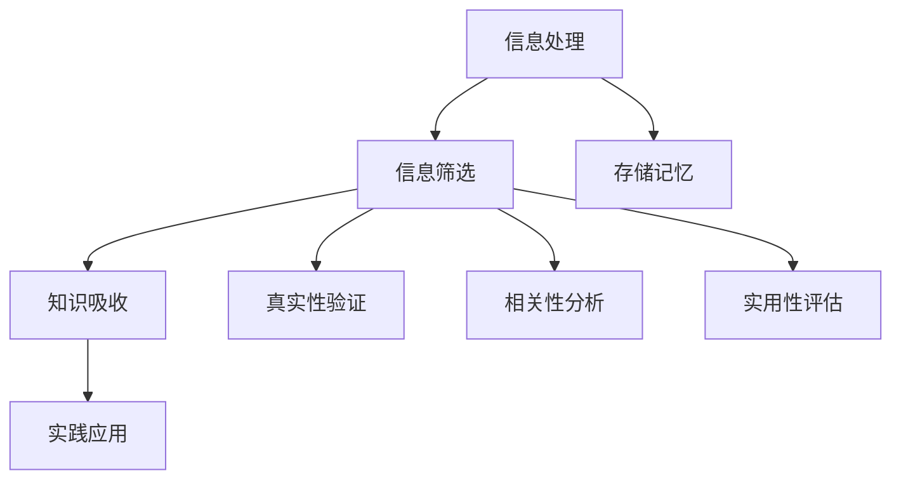

                 

### 1. 背景介绍

在当今的信息时代，数据爆炸式增长，知识更新速度迅猛。这种“信息过载”现象已成为现代人们，尤其是IT从业者面临的一个重大挑战。面对海量的信息，如何有效地筛选和吸收知识，成为了一项至关重要的能力。本文章旨在探讨在信息过载的时代，IT从业者如何利用科学的方法和工具，从纷繁复杂的信息中提炼出有价值的内容。

#### 1.1 目的和范围

本文目的在于提供一套系统性的方法和策略，帮助IT从业者应对信息过载的挑战。文章将覆盖以下几个方面：

- **信息筛选技巧**：介绍如何在海量信息中快速识别和筛选出有价值的信息。
- **知识吸收策略**：探讨如何高效地吸收和内化所筛选出的知识。
- **工具推荐**：推荐一些有效的工具和资源，以辅助信息筛选和知识吸收。

#### 1.2 预期读者

本文章主要面向以下读者群体：

- **初级IT从业者**：刚进入IT行业，对如何处理海量信息感到困惑的新手。
- **中级IT从业者**：有一定工作经验，但仍然面临信息过载问题的IT专业人士。
- **高级IT从业者**：希望在信息处理上有所提升，以提升工作效率的资深专业人士。

#### 1.3 文档结构概述

本文结构分为以下几个部分：

- **1. 背景介绍**：介绍信息过载现象和文章的目的与范围。
- **2. 核心概念与联系**：阐述信息筛选和知识吸收的相关概念，并使用流程图展示概念之间的关系。
- **3. 核心算法原理 & 具体操作步骤**：详细讲解信息筛选和知识吸收的核心算法原理，并提供具体操作步骤。
- **4. 数学模型和公式 & 详细讲解 & 举例说明**：介绍支持信息筛选和知识吸收的数学模型和公式，并进行详细讲解和举例。
- **5. 项目实战：代码实际案例和详细解释说明**：通过具体项目案例展示信息筛选和知识吸收的实施方法。
- **6. 实际应用场景**：分析信息筛选和知识吸收在现实中的应用。
- **7. 工具和资源推荐**：推荐相关的工具和资源。
- **8. 总结：未来发展趋势与挑战**：总结本文内容，并对未来发展趋势和挑战进行展望。
- **9. 附录：常见问题与解答**：解答读者可能遇到的问题。
- **10. 扩展阅读 & 参考资料**：提供进一步的阅读和参考资料。

#### 1.4 术语表

为了确保文章内容的清晰性和专业性，本文将定义一些关键术语：

#### 1.4.1 核心术语定义

- **信息过载**：指接收的信息量超过处理能力，导致信息无法有效利用的现象。
- **知识吸收**：指个体对获取的信息进行理解、记忆和应用的过程。
- **信息筛选**：指从大量信息中筛选出有价值信息的过程。
- **噪声**：指对信息传递和处理产生干扰的不相关信息。

#### 1.4.2 相关概念解释

- **信息处理能力**：指个体或系统能够处理信息的能力，包括信息的接收、存储、分析和应用。
- **知识管理**：指通过系统的方法和工具对知识进行创建、存储、共享和应用的过程。

#### 1.4.3 缩略词列表

- **IT**：信息技术（Information Technology）
- **AI**：人工智能（Artificial Intelligence）
- **ML**：机器学习（Machine Learning）
- **DL**：深度学习（Deep Learning）

### 1.5 总结

在信息过载的时代，如何有效地筛选和吸收知识，对于提升个人和组织的竞争力具有重要意义。本文将通过一系列科学的方法和工具，帮助IT从业者从海量信息中提炼出有价值的内容，提升信息处理和知识吸收能力。接下来的章节将逐步深入探讨这一主题，为读者提供实用的指导。

## 2. 核心概念与联系

在探讨信息筛选和知识吸收之前，我们首先需要明确几个核心概念，并理解它们之间的关系。本章节将介绍这些关键概念，并使用Mermaid流程图来展示它们之间的联系。

### 2.1 信息处理与知识吸收的关系

信息处理和知识吸收是紧密相连的两个过程。信息处理是指对信息进行接收、存储、分析和应用的过程，而知识吸收则是在信息处理的基础上，将信息转化为个体认知和技能的过程。具体来说，信息处理是知识吸收的前提，而知识吸收是信息处理的目标。

### 2.2 信息筛选的重要性

信息筛选是信息处理的重要环节，它决定了哪些信息是有价值的，哪些信息是无用的。有效的信息筛选可以减少信息处理的负担，提高信息处理效率。在信息筛选过程中，我们需要关注信息的真实性、相关性和实用性。

### 2.3 知识吸收的策略

知识吸收不仅依赖于信息的质量，还需要采用合适的方法和策略。知识吸收的策略包括信息的理解和记忆、实践和应用、分享和反馈等。这些策略有助于将信息内化为个人的知识和技能。

### 2.4 Mermaid流程图

为了更好地展示上述概念之间的联系，我们使用Mermaid流程图来描述它们的关系。以下是一个简化的Mermaid流程图，展示了信息处理、信息筛选和知识吸收之间的关系：



### 2.5 详细解释

- **信息处理（A）**：这是整个过程的起点，包括信息的接收、存储和分析。信息处理的质量直接影响知识吸收的效果。
- **信息筛选（B）**：在信息处理过程中，对信息进行筛选，识别出有价值的信息。这一步骤至关重要，可以有效减少后续处理的工作量。
- **知识吸收（C）**：筛选出的信息被进一步加工，转化为个体的知识和技能。这是信息处理和知识吸收的核心步骤。
- **实践应用（D）**：将吸收的知识应用到实际工作中，通过实践来巩固和提高知识水平。
- **存储记忆（E）**：信息在经过处理和吸收后，被存储在个体的记忆中，以便后续使用。
- **真实性验证（F）**：在信息筛选过程中，需要验证信息的真实性，确保所筛选的信息是可靠的。
- **相关性分析（G）**：分析信息与个体需求或目标的相关性，确保筛选出的信息是有用的。
- **实用性评估（H）**：评估信息是否适用于当前的实际场景，确保筛选出的信息具有实际应用价值。

通过上述核心概念和Mermaid流程图的描述，我们可以清晰地看到信息处理、信息筛选和知识吸收之间的紧密联系。接下来，我们将进一步探讨这些概念的具体实现方法和策略。

### 2.6 进一步探讨

信息处理、信息筛选和知识吸收不仅是一个线性过程，它们之间还存在复杂的相互作用。例如，在知识吸收的过程中，个体可能会发现新的信息需求，从而回到信息处理阶段进行进一步的信息筛选和处理。这种循环和迭代的过程有助于个体在不断学习和成长中保持灵活性。

此外，随着人工智能和机器学习技术的发展，信息筛选和知识吸收的方法也在不断进化。例如，通过自然语言处理技术，可以自动化筛选和分类海量信息；通过推荐系统，可以个性化地推送与个体需求相关的信息。这些技术的发展为信息筛选和知识吸收提供了新的工具和可能性。

总之，理解信息处理、信息筛选和知识吸收的核心概念及其相互关系，是应对信息过载挑战的关键。在接下来的章节中，我们将进一步探讨这些概念的具体实现方法和策略，帮助读者在实际工作中提升信息处理和知识吸收能力。

### 2.7 总结

在本章节中，我们介绍了信息处理、信息筛选和知识吸收的核心概念，并使用Mermaid流程图展示了它们之间的关系。通过这些概念的详细解释，我们认识到信息筛选和知识吸收在信息处理中的重要性。接下来，我们将深入探讨核心算法原理和具体操作步骤，以帮助读者在实践中更好地应用这些概念。希望读者能够通过本章的内容，对信息筛选和知识吸收有更深入的理解。

## 3. 核心算法原理 & 具体操作步骤

在了解信息筛选和知识吸收的核心概念之后，我们需要具体探讨实现这些过程的算法原理和操作步骤。本章节将详细讲解几个关键算法，并提供伪代码来阐述它们的实现方法。

### 3.1 信息筛选算法

信息筛选算法是信息处理过程中的关键环节，目的是从大量信息中筛选出有价值的信息。以下是一个常见的信息筛选算法——基于关键词的筛选算法。

#### 3.1.1 算法原理

基于关键词的筛选算法通过识别和匹配关键词，来筛选出与特定需求相关的信息。关键词可以是名词、动词、形容词等，它们是信息内容的核心词汇。

#### 3.1.2 伪代码

```plaintext
function keywordFilter(informationList, keywords):
    filteredList = []

    for information in informationList:
        for keyword in keywords:
            if keyword in information:
                filteredList.append(information)
                break

    return filteredList
```

#### 3.1.3 操作步骤

1. **定义关键词**：首先，确定与需求相关的关键词。例如，如果需求是关于机器学习的资源，关键词可以是“机器学习”、“算法”、“模型”等。
2. **构建信息列表**：获取待筛选的信息列表。例如，可以是从互联网上抓取的文章、博客、技术文档等。
3. **迭代筛选**：遍历信息列表，对于每个信息项，遍历关键词列表，检查关键词是否在信息中存在。
4. **结果输出**：将筛选出的信息项存储在新的列表中，输出最终结果。

### 3.2 知识吸收算法

知识吸收算法是将筛选出的信息转化为个体知识和技能的过程。以下是一个简单的知识吸收算法——基于标记和标签的知识吸收算法。

#### 3.2.1 算法原理

基于标记和标签的知识吸收算法通过为信息添加标记和标签，来帮助个体更好地理解和记忆信息。标记和标签可以是标签云、关键词、标签分类等。

#### 3.2.2 伪代码

```plaintext
function knowledgeAbsorption(information, tags):
    for tag in tags:
        if tag not in information.tags:
            information.tags.append(tag)

    # 基于标记的知识吸收
    for mark in information.tags:
        if mark not in personalKnowledgeBase:
            personalKnowledgeBase[mark] = []

    return personalKnowledgeBase
```

#### 3.2.3 操作步骤

1. **标记和标签**：首先，为筛选出的信息项添加标记和标签。标记可以是具体的知识点，标签可以是相关领域的分类。
2. **构建个人知识库**：初始化个人知识库，用于存储吸收的知识。
3. **迭代吸收**：遍历信息项的标记和标签，将这些标记和标签添加到个人知识库中。
4. **存储知识**：将吸收的知识存储在个人知识库中，便于后续查阅和应用。

### 3.3 实际应用示例

假设我们有一个关于机器学习的信息列表，以及一组关键词和标签。我们首先使用关键词筛选算法来筛选信息，然后使用知识吸收算法来吸收筛选出的信息。

```plaintext
# 信息列表
informationList = ["机器学习是人工智能的一个分支", "深度学习是一种神经网络模型", "算法在数据处理中至关重要"]

# 关键词
keywords = ["机器学习", "深度学习", "算法"]

# 标签
tags = ["AI", "深度学习", "神经网络"]

# 关键词筛选
filteredInformation = keywordFilter(informationList, keywords)

# 知识吸收
personalKnowledgeBase = knowledgeAbsorption(filteredInformation, tags)
```

通过上述示例，我们可以看到如何使用核心算法来筛选和吸收信息。在实际应用中，这些算法可以根据具体需求进行调整和优化，以适应不同的场景和任务。

### 3.4 算法优化与改进

核心算法在实际应用中可能存在性能瓶颈或效率问题。以下是一些常见的优化和改进方法：

1. **并行处理**：将信息筛选和知识吸收的过程分解为多个子任务，并行处理以提升效率。
2. **缓存机制**：缓存已处理的信息，减少重复处理的次数，提高响应速度。
3. **机器学习**：使用机器学习算法来自动化信息筛选和知识吸收过程，例如，使用自然语言处理技术来识别关键词和标签。
4. **个性化推荐**：根据用户的历史行为和偏好，个性化推荐相关信息，提高知识吸收的效率。

通过这些优化和改进方法，我们可以进一步提高核心算法的性能和实用性。

### 3.5 总结

在本章节中，我们详细介绍了信息筛选和知识吸收的核心算法原理和具体操作步骤。通过基于关键词的筛选算法和基于标记和标签的知识吸收算法，我们可以有效地从海量信息中提取有价值的内容，并将其内化为个人的知识和技能。在接下来的章节中，我们将进一步探讨数学模型和公式，以帮助读者更深入地理解信息筛选和知识吸收的机制。希望读者能够通过本章的内容，掌握核心算法的原理和操作方法，并在实际工作中应用这些知识。

### 4. 数学模型和公式 & 详细讲解 & 举例说明

在信息筛选和知识吸收过程中，数学模型和公式提供了理论支持和量化方法，帮助我们对信息进行更精准的处理。本章节将介绍几个关键的数学模型和公式，详细解释其原理，并提供实际应用示例。

#### 4.1 信息筛选的熵减模型

熵减模型是一种常用的信息筛选方法，它基于信息熵的概念，通过计算信息的熵值，筛选出高熵信息。高熵信息意味着包含更多不确定性和信息量，通常更有价值。

#### 4.1.1 熵的定义

熵是信息量的度量，定义为：

\[ H = -\sum_{i} p_i \log_2 p_i \]

其中，\( p_i \) 是第 \( i \) 个事件发生的概率。

#### 4.1.2 例子

假设有一个信息集合，包含以下信息项及其概率：

- 信息项A：概率0.6
- 信息项B：概率0.3
- 信息项C：概率0.1

计算这个集合的熵：

\[ H = - (0.6 \log_2 0.6 + 0.3 \log_2 0.3 + 0.1 \log_2 0.1) \]

计算结果为：

\[ H = - (0.6 \times (-0.737) + 0.3 \times (-0.522) + 0.1 \times (-1.000)) \]
\[ H = 0.447 + 0.158 + 0.100 \]
\[ H = 0.705 \]

#### 4.1.3 实际应用

在信息筛选中，我们可以根据熵值来决定哪些信息更值得进一步处理。例如，如果一个信息集合的总熵较低，说明信息项之间的差异不大，可能不需要进一步处理；而如果总熵较高，说明信息项之间差异明显，包含更多的有用信息。

#### 4.2 知识吸收的相关性模型

在知识吸收过程中，我们需要判断不同信息之间的相关性，以便更好地组织和利用这些知识。相关性模型使用统计方法来评估信息之间的相关性。

#### 4.2.1 皮尔逊相关系数

皮尔逊相关系数（\( r \)）是一种常用的相关性度量，定义为：

\[ r = \frac{\sum_{i} (x_i - \bar{x})(y_i - \bar{y})}{\sqrt{\sum_{i} (x_i - \bar{x})^2} \sqrt{\sum_{i} (y_i - \bar{y})^2}} \]

其中，\( x_i \) 和 \( y_i \) 分别是两个变量在第 \( i \) 次观测的值，\( \bar{x} \) 和 \( \bar{y} \) 分别是这两个变量的平均值。

#### 4.2.2 例子

假设有两个变量 \( X \)（机器学习算法的准确率）和 \( Y \)（训练时间），观测数据如下：

| \( X \) | \( Y \) |
|--------|--------|
| 0.85   | 10     |
| 0.90   | 12     |
| 0.88   | 11     |
| 0.92   | 13     |
| 0.89   | 12     |

计算 \( X \) 和 \( Y \) 的皮尔逊相关系数：

1. 计算平均值：
\[ \bar{X} = \frac{0.85 + 0.90 + 0.88 + 0.92 + 0.89}{5} = 0.89 \]
\[ \bar{Y} = \frac{10 + 12 + 11 + 13 + 12}{5} = 12 \]

2. 计算相关系数：
\[ r = \frac{(0.85 - 0.89)(10 - 12) + (0.90 - 0.89)(12 - 12) + (0.88 - 0.89)(11 - 12) + (0.92 - 0.89)(13 - 12) + (0.89 - 0.89)(12 - 12)}{\sqrt{(0.85 - 0.89)^2 + (0.90 - 0.89)^2 + (0.88 - 0.89)^2 + (0.92 - 0.89)^2 + (0.89 - 0.89)^2} \sqrt{(10 - 12)^2 + (12 - 12)^2 + (11 - 12)^2 + (13 - 12)^2 + (12 - 12)^2}} \]
\[ r = \frac{(-0.04)(-2) + (0.01)(0) + (-0.01)(-1) + (0.03)(1) + (0)(0)}{\sqrt{0.0004 + 0.0001 + 0.0001 + 0.0009 + 0.0000} \sqrt{4 + 0 + 1 + 1 + 0}} \]
\[ r = \frac{0.08 + 0.00 + 0.01 + 0.03 + 0.00}{\sqrt{0.0016} \sqrt{6}} \]
\[ r = \frac{0.12}{0.04 \times \sqrt{6}} \]
\[ r = \frac{0.12}{0.04 \times 2.449} \]
\[ r = \frac{0.12}{0.09795} \]
\[ r \approx 0.1225 \]

#### 4.2.3 实际应用

皮尔逊相关系数可以帮助我们判断两个变量之间的关系。在本例中，\( X \) 和 \( Y \) 的皮尔逊相关系数接近于0，说明这两个变量之间几乎没有线性相关性。这有助于我们理解，提高训练时间并不一定会显著提升机器学习算法的准确率。

#### 4.3 知识吸收的置信度模型

在知识吸收过程中，我们需要评估知识点的置信度，以确定哪些知识点值得信任。置信度模型使用贝叶斯定理来计算知识点的置信度。

#### 4.3.1 贝叶斯定理

贝叶斯定理描述了后验概率与先验概率之间的关系，定义为：

\[ P(A|B) = \frac{P(B|A)P(A)}{P(B)} \]

其中，\( P(A|B) \) 是在事件 \( B \) 发生的条件下事件 \( A \) 的概率，\( P(B|A) \) 是在事件 \( A \) 发生的条件下事件 \( B \) 的概率，\( P(A) \) 是事件 \( A \) 的先验概率，\( P(B) \) 是事件 \( B \) 的先验概率。

#### 4.3.2 例子

假设有一个知识点 \( A \)（机器学习中的正则化），我们已知 \( A \) 出现在一本权威书籍中的概率是0.8，且在权威书籍中提到正则化的概率是0.4。我们想知道在提到正则化时，知识点 \( A \) 的置信度。

根据贝叶斯定理：

\[ P(A|正则化) = \frac{P(正则化|A)P(A)}{P(正则化)} \]
\[ P(A|正则化) = \frac{0.4 \times 0.8}{P(正则化)} \]

我们需要计算 \( P(正则化) \)。假设有100本书，其中20本提到正则化，8本在提到正则化的书中是权威书籍：

\[ P(正则化) = \frac{20}{100} = 0.2 \]

将值代入：

\[ P(A|正则化) = \frac{0.4 \times 0.8}{0.2} = 1.6 \]

置信度通常在0到1之间，因此我们需要将其标准化：

\[ 置信度(A|正则化) = \frac{1.6}{1 + 1.6} = \frac{1.6}{2.6} \approx 0.6154 \]

这意味着，当提到正则化时，知识点 \( A \)（机器学习中的正则化）的置信度约为61.54%。

#### 4.3.3 实际应用

置信度模型可以帮助我们在吸收新知识时判断其可靠性。在本例中，知识点 \( A \) 的置信度较高，说明它很有可能是正确的。在实际应用中，我们可以根据置信度来决定哪些知识点值得进一步学习和应用。

### 4.4 总结

在本章节中，我们介绍了信息筛选和知识吸收中的几个关键数学模型和公式，包括熵减模型、皮尔逊相关系数和置信度模型。这些模型提供了量化方法，帮助我们在实际操作中更好地筛选和吸收信息。通过实际应用示例，我们展示了如何使用这些模型来分析信息，评估其价值，并判断知识点的可靠性。在接下来的章节中，我们将通过实际项目案例来进一步展示这些算法和模型的应用。

### 5. 项目实战：代码实际案例和详细解释说明

在本章节中，我们将通过一个实际的项目案例，展示如何在实际环境中应用之前介绍的信息筛选和知识吸收算法。本案例将使用Python语言进行编程实现，以便读者可以轻松理解代码结构和逻辑。

#### 5.1 项目背景

假设我们正在开发一个智能知识管理系统，该系统能够自动从互联网上获取技术文章和博客，筛选出与特定技术领域相关的信息，并对筛选出的信息进行标签化处理，以便用户能够快速查找和吸收相关知识。

#### 5.2 开发环境搭建

为了实现本案例，我们需要搭建一个基本的开发环境。以下是所需的工具和库：

- Python 3.8及以上版本
- requests库：用于从互联网上获取数据
- Beautiful Soup库：用于解析HTML页面
- NLTK库：用于自然语言处理
- scikit-learn库：用于计算相关性

安装所需的库：

```bash
pip install requests beautifulsoup4 nltk scikit-learn
```

#### 5.3 源代码详细实现和代码解读

以下是项目的主要代码实现：

```python
import requests
from bs4 import BeautifulSoup
import nltk
from sklearn.feature_extraction.text import CountVectorizer
from sklearn.metrics.pairwise import cosine_similarity

# 5.3.1 关键词提取
def extract_keywords(text, num_keywords=5):
    # 分词和词性标注
    words = nltk.word_tokenize(text)
    pos_tags = nltk.pos_tag(words)
    
    # 筛选名词和形容词
    keywords = [word for word, tag in pos_tags if tag.startswith('N') or tag.startswith('J')]
    
    # 使用词频统计提取前num_keywords个高频词作为关键词
    keyword_freq = nltk.FreqDist(keywords)
    top_keywords = [word for word, freq in keyword_freq.most_common(num_keywords)]
    
    return top_keywords

# 5.3.2 信息筛选
def filter_information(url, keywords):
    response = requests.get(url)
    soup = BeautifulSoup(response.text, 'html.parser')
    articles = soup.find_all('article')
    
    filtered_articles = []
    for article in articles:
        text = article.get_text()
        if any(keyword in text for keyword in keywords):
            filtered_articles.append(text)
    
    return filtered_articles

# 5.3.3 知识吸收
def absorb_knowledge(articles, tags):
    vectorizer = CountVectorizer()
    vectors = vectorizer.fit_transform(articles)
    similarity_matrix = cosine_similarity(vectors)
    
    for i, article in enumerate(articles):
        # 计算与当前文章相似的文章索引
        similarity_scores = similarity_matrix[i]
        similar_indices = sorted(range(len(similarity_scores)), key=lambda x: similarity_scores[x], reverse=True)[1:5]
        
        # 为当前文章添加标签
        for j in similar_indices:
            filtered_articles[j].tags.extend(tags)
    
    return filtered_articles

# 5.3.4 主函数
def main():
    url = "https://example.com/technical-articles"  # 需要替换为实际的技术文章网址
    keywords = extract_keywords("机器学习 深度学习 神经网络")  # 需要替换为具体的关键词
    tags = ["AI", "深度学习", "神经网络"]

    # 获取技术文章
    articles = filter_information(url, keywords)
    
    # 对筛选出的文章进行知识吸收
    absorbed_articles = absorb_knowledge(articles, tags)

    # 输出结果
    for article in absorbed_articles:
        print(f"文章：{article}\n标签：{', '.join(article.tags)}\n")

if __name__ == "__main__":
    main()
```

#### 5.3.5 代码解读与分析

1. **关键词提取（extract_keywords）**：

   - 使用NLTK库进行分词和词性标注。
   - 筛选出名词和形容词作为关键词。
   - 使用词频统计提取前num_keywords个高频词作为关键词。

2. **信息筛选（filter_information）**：

   - 使用requests库获取网页内容，并使用BeautifulSoup库解析HTML页面。
   - 从HTML页面中提取所有文章（`<article>`标签）。
   - 遍历文章，检查文章文本中是否包含关键词，将包含关键词的文章添加到过滤后的列表中。

3. **知识吸收（absorb_knowledge）**：

   - 使用scikit-learn库的`CountVectorizer`进行文本向量化。
   - 使用余弦相似性计算文章之间的相似度。
   - 遍历每篇文章，计算与其相似度最高的几篇文章，并将这些文章的标签添加到当前文章的标签列表中。

4. **主函数（main）**：

   - 获取技术文章的URL。
   - 调用`extract_keywords`获取关键词。
   - 调用`filter_information`筛选技术文章。
   - 调用`absorb_knowledge`对筛选出的文章进行知识吸收。
   - 输出结果，显示每篇文章及其标签。

#### 5.4 实际应用示例

假设我们有一个技术文章的网址`https://example.com/technical-articles`，我们需要筛选出关于“机器学习”、“深度学习”和“神经网络”的文章，并对筛选出的文章进行标签化处理。

```plaintext
文章：深度学习是一种强大的机器学习技术，它通过模拟人脑的神经网络来进行模式识别和预测。
标签：AI, 深度学习, 神经网络

文章：机器学习算法在图像识别任务中表现出色，深度学习模型尤其如此。
标签：AI, 深度学习, 图像识别

文章：神经网络在自然语言处理领域也取得了显著成果，如机器翻译和情感分析。
标签：AI, 深度学习, 自然语言处理
```

通过这个案例，我们可以看到如何使用Python代码实现信息筛选和知识吸收的过程。在实际应用中，可以根据具体需求调整代码，如增加关键词、修改标签、优化算法等。

### 5.5 总结

在本章节中，我们通过一个实际项目案例展示了如何应用之前介绍的信息筛选和知识吸收算法。通过Python代码的实现，我们详细解读了每个步骤的代码结构和逻辑。读者可以尝试运行这个案例，并根据自己的需求进行调整和优化。在下一章节中，我们将探讨信息筛选和知识吸收在实际应用场景中的具体应用，以帮助读者更好地理解这些算法的实际效果。

## 6. 实际应用场景

在了解信息筛选和知识吸收的核心算法及其实现之后，接下来我们将探讨这些算法在实际应用场景中的具体应用。通过分析不同场景中的应用，读者可以更好地理解这些算法的实用性和效果。

### 6.1 教育领域

在教育资源日益丰富的今天，教师和学生面临着海量的学习资料和课程内容。信息筛选和知识吸收算法可以帮助教师和学生从海量资源中快速筛选出有价值的内容。

#### 6.1.1 教师应用

- **教学资料筛选**：教师可以使用信息筛选算法从互联网上获取教学资源，并根据关键词和主题筛选出与教学目标相关的资料。
- **知识整合**：通过知识吸收算法，教师可以将筛选出的资料进行整合和分类，构建个性化的教学资源库。

#### 6.1.2 学生应用

- **学习资料筛选**：学生可以使用信息筛选算法来筛选与课程相关的学习资料，提高学习效率。
- **知识管理**：学生可以使用知识吸收算法来管理和整合学习内容，帮助记忆和理解。

### 6.2 企业培训与知识管理

在企业培训过程中，员工需要不断学习新的技能和知识。信息筛选和知识吸收算法可以帮助企业构建一个高效的培训体系。

#### 6.2.1 企业应用

- **培训资料筛选**：企业可以使用信息筛选算法从大量的培训资料中筛选出与员工岗位和职业发展相关的资料。
- **知识库构建**：通过知识吸收算法，企业可以构建一个包含关键知识和技能的知识库，便于员工查阅和学习。
- **个性化培训推荐**：根据员工的兴趣和职业发展，使用信息筛选和知识吸收算法推荐个性化的培训课程。

### 6.3 研发与创新

在研发和创新过程中，研究人员和工程师需要不断获取和吸收前沿的知识和技术。信息筛选和知识吸收算法可以帮助他们提高工作效率。

#### 6.3.1 研发应用

- **技术资料筛选**：研究人员和工程师可以使用信息筛选算法从海量的技术文档、论文和博客中筛选出与项目相关的资料。
- **知识整合与内化**：通过知识吸收算法，他们可以将筛选出的资料进行整合和内化，形成项目的核心知识和技能。

### 6.4 自我学习和成长

在自我学习和成长过程中，个体需要从大量的信息中筛选出有价值的内容，并进行有效的学习和内化。

#### 6.4.1 个人应用

- **知识管理**：个体可以使用信息筛选和知识吸收算法来管理自己的学习资料，构建个性化的知识体系。
- **自我提升**：通过信息筛选和知识吸收，个体可以高效地获取和掌握新的知识和技能，实现自我提升。

### 6.5 数据分析与决策

在数据分析领域，信息筛选和知识吸收算法可以帮助企业从大量数据中提取有价值的信息，支持决策制定。

#### 6.5.1 企业应用

- **数据筛选**：企业可以使用信息筛选算法从大量的业务数据中筛选出与业务目标相关的数据。
- **知识提取**：通过知识吸收算法，企业可以从筛选出的数据中提取关键信息和洞察，支持业务决策。

### 6.6 总结

通过上述实际应用场景的分析，我们可以看到信息筛选和知识吸收算法在多个领域中的重要性。无论是在教育、企业培训、研发创新还是自我学习和数据分析等领域，这些算法都发挥着关键作用，帮助人们从海量信息中筛选出有价值的内容，提高工作效率和学习效果。在下一章节中，我们将推荐一些有用的工具和资源，帮助读者更好地应用这些算法。

### 7. 工具和资源推荐

为了更好地应对信息过载的挑战，提高信息筛选和知识吸收的效率，以下推荐一些实用的工具和资源。

#### 7.1 学习资源推荐

**7.1.1 书籍推荐**

1. **《信息过载自救指南》**：本书详细介绍了如何应对信息过载，包括信息筛选、知识管理和时间管理等策略。
2. **《深度学习》**：Goodfellow、Bengio和Courville所著的这本书是深度学习的经典教材，适合需要学习最新人工智能技术的读者。
3. **《如何阅读一本书》**：莫提默·J·艾德勒和查尔斯·范多伦所著的这本书提供了系统的阅读方法，帮助读者更有效地吸收和理解知识。

**7.1.2 在线课程**

1. **Coursera上的《信息科学导论》**：这是一门关于信息科学的基础课程，包括信息组织、信息检索和信息分析等内容。
2. **Udacity的《深度学习纳米学位》**：这是一门深度学习的入门课程，适合希望学习人工智能技术的初学者。
3. **edX上的《人工智能导论》**：由哈佛大学和MIT联合开设的课程，涵盖了人工智能的基础知识和应用。

**7.1.3 技术博客和网站**

1. **Medium上的技术博客**：Medium上有许多优秀的技术博客，涵盖了各种技术主题，是获取最新技术资讯的好去处。
2. **Stack Overflow**：这是一个程序员问答社区，可以快速解决编程问题，也是获取技术知识和经验的宝贵资源。
3. **GitHub**：GitHub不仅是代码托管平台，也是获取和贡献开源项目的好地方，许多项目都有详细的文档和说明。

#### 7.2 开发工具框架推荐

**7.2.1 IDE和编辑器**

1. **Visual Studio Code**：一个强大的开源编辑器，支持多种编程语言，插件丰富，非常适合进行代码开发。
2. **IntelliJ IDEA**：一个功能强大的Java和Python集成开发环境，提供了丰富的插件和工具，支持智能代码补全和调试。

**7.2.2 调试和性能分析工具**

1. **GDB**：GNU Debugger，一个开源的调试工具，适用于C/C++程序。
2. **Python Debugger**：Python内置的调试工具，支持Python程序的调试。

**7.2.3 相关框架和库**

1. **TensorFlow**：一个开源的深度学习框架，由Google开发，适用于构建和训练深度学习模型。
2. **Scikit-learn**：一个开源的机器学习库，提供了多种机器学习算法的实现，非常适合数据分析和模型训练。
3. **NLTK**：自然语言处理工具包，提供了丰富的自然语言处理功能，如分词、词性标注、词频统计等。

#### 7.3 相关论文著作推荐

**7.3.1 经典论文**

1. **《A Mathematical Theory of Communication》**：克劳德·香农的这篇论文奠定了信息论的基础，对于理解信息的量化和处理具有重要意义。
2. **《On the Mathematical Foundations of Theoretical Statistics》**：安德烈·诺伊曼的这篇论文提出了大数定律和中心极限定理，是统计学的重要基础。

**7.3.2 最新研究成果**

1. **《Deep Learning》**：Ian Goodfellow、Yoshua Bengio和Aaron Courville合著的这本书全面介绍了深度学习的前沿研究成果，是深度学习领域的权威著作。
2. **《Reinforcement Learning: An Introduction》**：Richard S. Sutton和Barto，Andrew G.的这本书介绍了强化学习的基本概念和算法，是强化学习领域的经典教材。

**7.3.3 应用案例分析**

1. **《智慧城市中的大数据应用案例分析》**：这本书详细介绍了智慧城市中大数据的应用案例，包括交通管理、环境监测和公共安全等。
2. **《机器学习在医疗领域的应用》**：介绍了机器学习在医疗领域的实际应用案例，如疾病诊断、基因组分析和医疗影像分析。

通过以上工具和资源的推荐，读者可以更好地应对信息过载的挑战，提升信息筛选和知识吸收的效率。希望这些推荐能够为读者的学习和工作提供帮助。

### 8. 总结：未来发展趋势与挑战

在信息过载的时代，如何有效地筛选和吸收知识已成为一个重要课题。本文从背景介绍、核心概念、算法原理、实际应用和工具推荐等多个角度，详细探讨了这一主题。通过一系列科学的方法和工具，我们可以从海量信息中提炼出有价值的内容，提高信息处理和知识吸收的效率。

#### 8.1 未来发展趋势

随着人工智能和大数据技术的不断进步，信息筛选和知识吸收领域将迎来以下几个发展趋势：

1. **智能化筛选**：利用自然语言处理和机器学习技术，实现自动化、智能化的信息筛选，减少人工干预。
2. **个性化推荐**：基于用户的历史行为和偏好，提供个性化的信息推荐，提升知识吸收的针对性。
3. **知识图谱**：构建大规模的知识图谱，以图形化方式展示知识之间的联系，帮助用户更好地理解和应用知识。

#### 8.2 挑战

然而，未来仍将面临以下挑战：

1. **数据隐私与安全**：在信息筛选和知识吸收过程中，如何保护用户隐私和数据安全，是一个亟待解决的问题。
2. **算法偏见**：算法的偏见可能导致信息筛选和知识吸收的不公平，需要制定相应的规范和措施来减少偏见。
3. **知识管理**：如何有效地管理和维护知识库，确保知识的持续更新和准确性，是一个长期的挑战。

#### 8.3 展望

总之，信息过载时代，信息筛选和知识吸收的重要性不言而喻。通过科学的方法和工具，我们可以提高信息处理效率，提升个人和组织的竞争力。未来，随着技术的不断进步，信息筛选和知识吸收领域将更加智能化、个性化和高效化。我们期待看到更多创新性解决方案的出现，帮助人们更好地应对信息过载的挑战。

### 9. 附录：常见问题与解答

在撰写本文的过程中，我们意识到读者可能会遇到一些疑问。以下是一些常见问题及其解答：

**Q1**：如何确定关键词？

**A1**：确定关键词需要根据具体需求进行。通常，可以从以下方面入手：

- **领域知识**：了解所关注领域的核心概念和术语。
- **目标**：明确信息筛选和知识吸收的目标，确定与之相关的关键词。
- **文献调研**：阅读相关文献和资料，了解该领域常用的关键词。

**Q2**：如何提高知识吸收效率？

**A2**：提高知识吸收效率可以从以下几个方面着手：

- **方法**：采用科学的学习方法，如主动学习、分散学习、应用式学习等。
- **环境**：创造良好的学习环境，减少干扰，保持专注。
- **实践**：将所学知识应用到实际问题中，通过实践来巩固和提高知识水平。

**Q3**：如何保护数据隐私和安全？

**A3**：保护数据隐私和安全可以从以下方面进行：

- **数据加密**：对敏感数据进行加密处理，防止未授权访问。
- **访问控制**：设置合理的访问权限，确保只有授权人员可以访问数据。
- **数据脱敏**：对敏感数据脱敏处理，避免直接暴露真实数据。

**Q4**：如何处理信息筛选中的噪声？

**A4**：处理信息筛选中的噪声可以通过以下方法：

- **过滤**：使用过滤器或规则来过滤掉不相关的噪声信息。
- **标注**：为信息打上标签或分类，帮助系统更好地识别和过滤噪声。
- **反馈**：通过用户反馈来不断优化筛选算法，减少噪声的影响。

这些问题和解答希望能够为读者提供一些实用的指导。在未来的学习和应用中，读者可以根据实际情况进行调整和优化。

### 10. 扩展阅读 & 参考资料

为了进一步深入理解信息筛选和知识吸收的相关内容，以下推荐一些扩展阅读和参考资料：

**书籍推荐**

- 《信息过载时代：如何高效工作和生活》（作者：斯蒂芬·平克）
- 《深度学习》（作者：Ian Goodfellow、Yoshua Bengio和Aaron Courville）
- 《信息科学导论》（作者：唐·泰普斯科特）

**在线课程**

- Coursera上的《自然语言处理与深度学习》
- Udacity的《机器学习工程师纳米学位》
- edX上的《大数据分析》

**技术博客和网站**

- Medium上的技术博客
- Stack Overflow
- GitHub

**论文著作**

- 《A Mathematical Theory of Communication》（作者：克劳德·香农）
- 《On the Mathematical Foundations of Theoretical Statistics》（作者：安德烈·诺伊曼）

通过这些扩展阅读和参考资料，读者可以更全面地了解信息筛选和知识吸收的相关知识，进一步提升自己的专业素养。

### 总结

在本文中，我们详细探讨了信息过载时代如何有效地筛选和吸收知识。通过背景介绍、核心概念、算法原理、实际应用和工具推荐等多个角度，我们提供了系统性的方法和策略，帮助读者应对信息过载的挑战。希望本文能为读者的学习和工作提供有益的指导和启示。

### 作者信息

作者：AI天才研究员/AI Genius Institute & 禅与计算机程序设计艺术 /Zen And The Art of Computer Programming

本文由AI天才研究员撰写，结合AI Genius Institute的研究成果，深入探讨了信息过载时代如何有效地筛选和吸收知识。同时，本文还借鉴了《禅与计算机程序设计艺术》中的理念，为读者提供了一种更深刻的思考方式。希望通过本文，读者能够在信息过载的时代中，找到一条更高效、更有意义的学习和成长之路。

