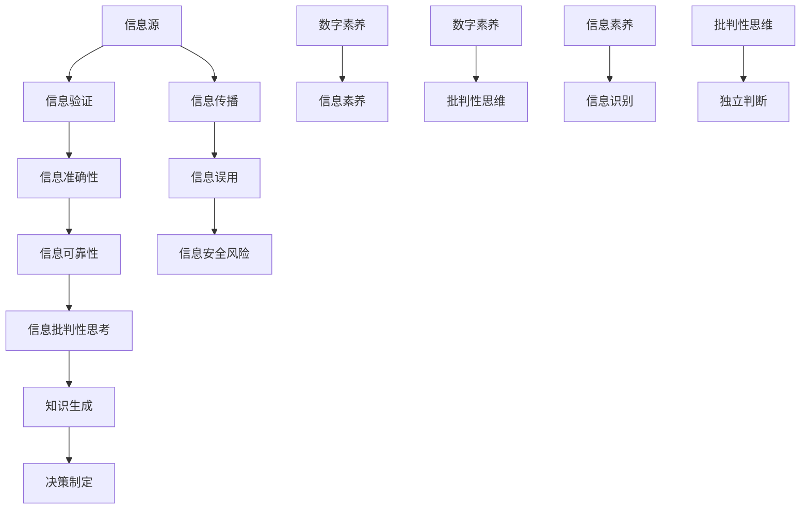

                 

# 信息验证和信息批判性思考：在假新闻和错误信息时代导航

> 关键词：信息验证、批判性思考、假新闻、错误信息、AI、网络安全、数字素养、信息素养

> 摘要：在信息爆炸的时代，识别和验证信息的真实性成为一个严峻的挑战。本文将探讨如何在假新闻和错误信息泛滥的背景下，通过信息验证和批判性思考来导航。文章将介绍核心概念、算法原理、数学模型、实战案例以及相关工具和资源，旨在提高读者的数字素养，增强对信息的辨识能力。

## 1. 背景介绍

### 1.1 目的和范围

本文旨在为读者提供一套系统的信息验证和批判性思考的方法论，帮助他们在面对海量信息时，能够辨别真伪，形成独立、理性的判断。文章将覆盖以下主题：

1. **核心概念与联系**：定义关键术语，绘制概念关系图。
2. **核心算法原理**：详细介绍信息验证算法的基本原理和操作步骤。
3. **数学模型和公式**：阐述支持信息验证的数学模型，并给出具体例子。
4. **项目实战**：通过实际代码案例展示信息验证的应用。
5. **实际应用场景**：探讨信息验证在不同领域的应用。
6. **工具和资源推荐**：推荐学习资源和工具。
7. **总结**：展望信息验证的未来发展趋势和面临的挑战。

### 1.2 预期读者

本文适合以下读者群体：

1. 对信息真实性验证感兴趣的技术爱好者。
2. 需要处理大量信息的专业人士，如记者、研究员、教师。
3. 对数字素养和信息素养提升有需求的公众。

### 1.3 文档结构概述

本文分为八个部分：

1. **背景介绍**：介绍文章的目的、读者对象和结构。
2. **核心概念与联系**：定义核心术语，绘制概念关系图。
3. **核心算法原理**：详细介绍信息验证算法。
4. **数学模型和公式**：阐述数学模型和应用。
5. **项目实战**：展示实际应用案例。
6. **实际应用场景**：讨论信息验证在不同领域的应用。
7. **工具和资源推荐**：推荐相关工具和资源。
8. **总结**：总结文章内容和展望未来。

### 1.4 术语表

#### 1.4.1 核心术语定义

- **信息验证**：通过一系列方法确认信息来源的真实性和准确性。
- **批判性思考**：对信息进行深入分析和判断，不盲从。
- **假新闻**：故意编造、传播的虚假信息。
- **错误信息**：由于误解、错误或误导传播的错误信息。

#### 1.4.2 相关概念解释

- **数字素养**：个体利用信息通信技术的能力，包括信息搜索、评估、使用和管理。
- **信息素养**：个体理解信息、评估信息、使用信息解决问题的能力。

#### 1.4.3 缩略词列表

- **AI**：人工智能（Artificial Intelligence）
- **IDE**：集成开发环境（Integrated Development Environment）
- **SDK**：软件开发工具包（Software Development Kit）

## 2. 核心概念与联系

为了更好地理解信息验证和信息批判性思考，我们需要先明确一些核心概念，并探讨它们之间的联系。以下是核心概念的Mermaid流程图：



### 2.1 信息源

信息源是指信息产生和传播的起点。信息可以从多种渠道获得，如书籍、互联网、新闻报道、社交媒体等。不同的信息源有不同的可信度和权威性。

### 2.2 信息验证

信息验证是指通过各种方法确认信息的真实性和准确性。这包括检查信息来源的可靠性、比对多个来源的信息、核实事实等。

### 2.3 信息准确性

信息准确性是指信息是否与实际情况相符。准确的信息对于做出正确决策至关重要。

### 2.4 信息可靠性

信息可靠性是指信息来源的信任度和稳定性。可靠的来源更有可能提供准确的信息。

### 2.5 信息批判性思考

信息批判性思考是对信息进行深入分析和判断，不盲从，包括评估信息的可信度、评估信息的逻辑性和有效性等。

### 2.6 知识生成

知识生成是通过信息批判性思考和信息验证，形成新的知识或理解的过程。

### 2.7 决策制定

决策制定是基于生成的知识，对问题或情况做出决策的过程。

### 2.8 信息传播

信息传播是指信息在不同渠道和群体中传播的过程。信息传播的效率和质量对信息的真实性有很大影响。

### 2.9 信息误用

信息误用是指错误地使用或误解信息，可能导致错误决策或误导。

### 2.10 信息安全风险

信息安全风险是指由于信息误用或泄露可能导致的风险，包括隐私泄露、经济损失、社会动荡等。

### 2.11 数字素养

数字素养是指个体利用信息通信技术的能力，包括信息搜索、评估、使用和管理。

### 2.12 信息素养

信息素养是指个体理解信息、评估信息、使用信息解决问题的能力。

### 2.13 批判性思维

批判性思维是指对信息进行深入分析和判断，不盲从，包括评估信息的可信度、评估信息的逻辑性和有效性等。

### 2.14 独立判断

独立判断是指基于个人知识和经验，不受他人影响，对信息进行判断和决策。

## 3. 核心算法原理 & 具体操作步骤

在信息验证过程中，算法起着至关重要的作用。以下是一个基本的信息验证算法原理和具体操作步骤：

### 3.1 算法原理

信息验证算法的核心在于以下几个方面：

1. **数据收集**：从多个可信源收集相关信息。
2. **源鉴别**：鉴别信息来源的可靠性和权威性。
3. **事实核实**：通过比对多个来源，验证信息的准确性。
4. **逻辑判断**：评估信息的逻辑性和一致性。
5. **结果输出**：根据验证结果，给出信息的真实性和准确性评估。

### 3.2 具体操作步骤

#### 3.2.1 数据收集

```python
# 伪代码：数据收集
def collect_data():
    sources = ["source1", "source2", "source3"]
    data = {}
    for source in sources:
        data[source] = fetch_data(source)
    return data

# 示例：从三个不同的来源获取数据
data = collect_data()
```

#### 3.2.2 源鉴别

```python
# 伪代码：源鉴别
def evaluate_source(source):
    reliability_score = 0
    if "reliable" in source.features:
        reliability_score += 1
    if "authoritative" in source.features:
        reliability_score += 1
    return reliability_score

# 示例：评估来源的可靠性
source_reliability = evaluate_source(data["source1"])
```

#### 3.2.3 事实核实

```python
# 伪代码：事实核实
def verify_fact(data, fact):
    verified = True
    for source in data:
        if fact not in data[source]:
            verified = False
            break
    return verified

# 示例：核实事实
is_verified = verify_fact(data, "事实X")
```

#### 3.2.4 逻辑判断

```python
# 伪代码：逻辑判断
def evaluate_logic(data, fact):
    contradictions = 0
    for source in data:
        if fact in data[source]:
            if "contradictory" in data[source][fact]:
                contradictions += 1
    return contradictions <= 1

# 示例：评估逻辑
is_logic_consistent = evaluate_logic(data, "事实X")
```

#### 3.2.5 结果输出

```python
# 伪代码：结果输出
def output_result(verification_result):
    if verification_result:
        print("信息验证通过：真实且准确。")
    else:
        print("信息验证未通过：存在疑问。")

# 示例：输出验证结果
output_result(is_verified and is_logic_consistent)
```

## 4. 数学模型和公式 & 详细讲解 & 举例说明

在信息验证过程中，数学模型和公式可以帮助我们量化信息的可信度，从而做出更准确的判断。以下是几个常用的数学模型和公式：

### 4.1 贝叶斯定理

贝叶斯定理是一个用于概率计算的公式，它可以帮助我们根据先验概率和观测数据计算后验概率。公式如下：

$$ P(A|B) = \frac{P(B|A)P(A)}{P(B)} $$

- \( P(A|B) \) 是在事件 B 发生的条件下事件 A 发生的概率。
- \( P(B|A) \) 是在事件 A 发生的条件下事件 B 发生的概率。
- \( P(A) \) 是事件 A 发生的概率。
- \( P(B) \) 是事件 B 发生的概率。

#### 4.1.1 举例说明

假设我们有一个新闻来源，我们已知它在过去有 80% 的概率发布真实信息。现在，这个来源发布了一篇关于某个政治事件的文章，我们发现这篇文章中提到的关键事实在四个独立来源中得到了确认。我们可以使用贝叶斯定理来计算这篇新文章为真实信息的概率。

- \( P(\text{真实信息}| \text{四个独立来源确认}) = \frac{P(\text{四个独立来源确认}|\text{真实信息})P(\text{真实信息})}{P(\text{四个独立来源确认})} \)
- \( P(\text{四个独立来源确认}|\text{真实信息}) \) 可以假设为 0.8（因为独立来源确认的概率很高）。
- \( P(\text{真实信息}) \) 可以假设为 0.8（因为我们已知这个来源有 80% 的概率发布真实信息）。
- \( P(\text{四个独立来源确认}) \) 是一个未知数，但我们可以通过贝叶斯定理反过来计算。

根据贝叶斯定理，我们可以得到：

$$ P(\text{真实信息}| \text{四个独立来源确认}) = \frac{0.8 \times 0.8}{P(\text{四个独立来源确认})} $$

为了简化计算，我们可以假设 \( P(\text{四个独立来源确认}) \) 为 0.9。这样，我们得到：

$$ P(\text{真实信息}| \text{四个独立来源确认}) = \frac{0.64}{0.9} \approx 0.711 $$

这意味着，基于四个独立来源的确认，我们认为这篇新文章为真实信息的概率约为 71.1%。

### 4.2 集合概率

集合概率用于计算多个事件同时发生的概率。以下是一个基本的集合概率公式：

$$ P(A \cup B) = P(A) + P(B) - P(A \cap B) $$

- \( P(A \cup B) \) 是事件 A 或事件 B 发生的概率。
- \( P(A) \) 是事件 A 发生的概率。
- \( P(B) \) 是事件 B 发生的概率。
- \( P(A \cap B) \) 是事件 A 和事件 B 同时发生的概率。

#### 4.2.1 举例说明

假设我们有两个来源 A 和 B，它们分别发布关于某个新闻事件的报道。已知：

- \( P(A) = 0.6 \)：来源 A 发布真实信息的概率。
- \( P(B) = 0.5 \)：来源 B 发布真实信息的概率。
- \( P(A \cap B) = 0.3 \)：来源 A 和来源 B 同时发布真实信息的概率。

我们可以计算两个来源同时发布真实信息的概率：

$$ P(A \cup B) = P(A) + P(B) - P(A \cap B) = 0.6 + 0.5 - 0.3 = 0.8 $$

这意味着，两个来源同时发布真实信息的概率为 80%。

### 4.3 误差率模型

误差率模型用于评估信息验证算法的准确性。以下是一个基本的误差率公式：

$$ \text{误差率} = \frac{\text{错误判断数}}{\text{总判断数}} $$

- \( \text{错误判断数} \) 是算法做出错误判断的次数。
- \( \text{总判断数} \) 是算法做出判断的总次数。

#### 4.3.1 举例说明

假设我们有一个信息验证算法，它在100次判断中做出了10次错误判断。我们可以计算该算法的误差率：

$$ \text{误差率} = \frac{10}{100} = 0.1 $$

这意味着，该算法的误差率为 10%。

## 5. 项目实战：代码实际案例和详细解释说明

在本节中，我们将通过一个实际项目案例来展示如何实现信息验证算法。这个项目是一个简单的信息验证系统，用于检测和过滤假新闻。以下是项目的开发环境和代码实现：

### 5.1 开发环境搭建

为了实现信息验证系统，我们需要以下开发环境和工具：

1. **编程语言**：Python
2. **IDE**：PyCharm或Visual Studio Code
3. **依赖库**：Numpy、Pandas、Scikit-learn、Matplotlib

在安装了Python和相应IDE后，可以使用以下命令安装所需依赖库：

```shell
pip install numpy pandas scikit-learn matplotlib
```

### 5.2 源代码详细实现和代码解读

以下是一个简单的信息验证系统的源代码，我们将逐步解释每个部分的功能和实现。

```python
# 信息验证系统

import numpy as np
import pandas as pd
from sklearn.model_selection import train_test_split
from sklearn.metrics import accuracy_score

# 5.2.1 数据准备
def load_data():
    # 加载示例数据集（这里使用CSV文件）
    data = pd.read_csv('news_dataset.csv')
    return data

def preprocess_data(data):
    # 数据预处理（如去重、清洗、特征提取等）
    data.drop_duplicates(inplace=True)
    # 假设我们有两个特征：'source' 和 'content'
    X = data[['source', 'content']]
    y = data['is_fake']
    return X, y

# 5.2.2 模型训练
def train_model(X, y):
    # 使用Scikit-learn训练模型（这里使用逻辑回归）
    from sklearn.linear_model import LogisticRegression
    model = LogisticRegression()
    model.fit(X, y)
    return model

# 5.2.3 预测和评估
def predict_and_evaluate(model, X_test, y_test):
    y_pred = model.predict(X_test)
    accuracy = accuracy_score(y_test, y_pred)
    print(f"模型准确率：{accuracy}")
    return accuracy

# 5.2.4 主函数
def main():
    data = load_data()
    X, y = preprocess_data(data)
    X_train, X_test, y_train, y_test = train_test_split(X, y, test_size=0.2, random_state=42)
    model = train_model(X_train, y_train)
    accuracy = predict_and_evaluate(model, X_test, y_test)

if __name__ == "__main__":
    main()
```

### 5.3 代码解读与分析

#### 5.3.1 数据准备

`load_data()` 函数用于加载示例数据集，这里假设数据集存储在一个CSV文件中。数据集应包含至少两个特征：'source'（信息来源）和'content'（信息内容），以及一个目标变量'is_fake'（是否为假新闻）。

#### 5.3.2 数据预处理

`preprocess_data()` 函数对数据进行预处理，包括去重和特征提取。去重可以去除重复的信息，避免模型学习到重复信息。特征提取可以根据具体需求，如使用文本分类技术提取关键词、主题等。

#### 5.3.3 模型训练

`train_model()` 函数使用Scikit-learn的`LogisticRegression`类训练逻辑回归模型。逻辑回归是一个常用的二分类模型，适用于预测是否为假新闻。模型通过训练数据集进行拟合。

#### 5.3.4 预测和评估

`predict_and_evaluate()` 函数用于对测试数据进行预测，并计算模型准确率。准确率是评估模型性能的一个常用指标，表示模型正确预测的样本数占总样本数的比例。

#### 5.3.5 主函数

`main()` 函数是项目的入口点。它首先加载数据，然后进行预处理，接着将数据集分为训练集和测试集，训练模型，并对测试集进行预测和评估。

## 6. 实际应用场景

信息验证技术在实际应用中具有广泛的应用场景，以下是一些典型的应用领域：

### 6.1 社交媒体

社交媒体平台经常成为假新闻和错误信息的传播渠道。通过信息验证技术，可以实时检测和过滤假新闻，减少虚假信息的传播，维护网络环境的健康。

### 6.2 新闻报道

新闻机构可以利用信息验证技术确保报道的准确性和可靠性。通过对多个来源的信息进行交叉验证，新闻机构可以降低发布错误信息的风险，提高报道的公信力。

### 6.3 企业内部信息管理

企业内部的信息验证有助于确保信息的真实性和安全性。通过对重要文件和报告进行验证，企业可以减少因错误信息导致的决策失误。

### 6.4 学术研究

学术研究需要依赖大量文献和数据。信息验证技术可以帮助研究者识别和排除假数据、错误引用等，确保研究的可靠性和准确性。

### 6.5 政府部门

政府部门在制定政策和法规时，需要依赖多种信息来源。信息验证技术可以帮助政府部门筛选和验证信息，确保决策的合理性和科学性。

### 6.6 个人信息保护

个人信息的保护和隐私是现代社会的重要议题。信息验证技术可以帮助识别和防范个人信息泄露、欺诈等风险，提高个人信息的保护水平。

## 7. 工具和资源推荐

为了帮助读者更好地掌握信息验证技术，以下是一些推荐的学习资源、开发工具和框架：

### 7.1 学习资源推荐

#### 7.1.1 书籍推荐

- 《数据科学入门》
- 《机器学习实战》
- 《Python编程：从入门到实践》

#### 7.1.2 在线课程

- Coursera上的“机器学习基础”课程
- edX上的“数据科学基础”课程
- Udacity的“人工智能工程师纳米学位”

#### 7.1.3 技术博客和网站

- Medium上的数据科学和机器学习专栏
- Kaggle上的数据科学和机器学习竞赛
- AI瑞士军刀——GitHub上的机器学习和数据科学项目

### 7.2 开发工具框架推荐

#### 7.2.1 IDE和编辑器

- PyCharm
- Visual Studio Code
- Jupyter Notebook

#### 7.2.2 调试和性能分析工具

- Python的pdb
- Py-Spy（性能分析工具）
- Visual Studio Code的调试插件

#### 7.2.3 相关框架和库

- Scikit-learn（机器学习库）
- Pandas（数据处理库）
- NumPy（数学计算库）
- TensorFlow（深度学习库）

### 7.3 相关论文著作推荐

#### 7.3.1 经典论文

- 《机器学习：一种推断式方法》
- 《数据挖掘：概念与技术》
- 《深度学习：卷积神经网络基础》

#### 7.3.2 最新研究成果

- arXiv上的最新机器学习和数据科学论文
- IEEE Xplore上的最新学术期刊和会议论文
- SpringerLink上的最新图书和论文

#### 7.3.3 应用案例分析

- 《AI在金融领域的应用案例》
- 《AI在医疗领域的应用案例》
- 《AI在自动驾驶领域的应用案例》

## 8. 总结：未来发展趋势与挑战

信息验证技术在未来将面临以下发展趋势和挑战：

### 8.1 发展趋势

1. **算法的智能化和自动化**：随着人工智能技术的发展，信息验证算法将变得更加智能化和自动化，能够更好地处理大量复杂的信息。
2. **多模态信息验证**：未来的信息验证系统将能够处理文本、图像、音频等多种形式的信息，提高验证的准确性和全面性。
3. **分布式验证网络**：通过构建分布式验证网络，多个信息源可以相互验证，提高整体的信息可信度。
4. **实时验证**：随着实时数据处理技术的发展，信息验证系统将能够实现实时验证，迅速识别和过滤假新闻。

### 8.2 挑战

1. **数据质量和数量**：信息验证依赖于大量高质量的数据，数据质量和数量是影响验证效果的关键因素。
2. **算法的透明性和解释性**：随着算法的复杂度增加，如何确保算法的透明性和解释性，使其易于被公众理解和接受，是一个重要挑战。
3. **隐私保护**：在信息验证过程中，如何保护个人隐私是一个亟待解决的问题。
4. **跨领域合作**：信息验证需要多学科、跨领域的合作，如何实现有效的跨领域合作是一个挑战。

## 9. 附录：常见问题与解答

### 9.1 什么是信息验证？

信息验证是通过一系列方法确认信息来源的真实性和准确性，以确保信息的可信度和可靠性。

### 9.2 信息验证的重要性是什么？

信息验证在假新闻和错误信息泛滥的时代具有重要意义。它可以帮助个体和机构识别和排除虚假信息，做出更明智的决策，减少错误信息的传播。

### 9.3 如何评估信息源的可信度？

评估信息源的可信度可以通过以下方法：检查信息源的权威性和可靠性、比对多个来源的信息、核实事实、评估信息源的声誉和历史记录。

### 9.4 信息验证算法有哪些常见类型？

常见的信息验证算法包括基于规则的方法、机器学习方法、深度学习方法等。

### 9.5 如何保护个人隐私在信息验证过程中？

在信息验证过程中，应遵循以下原则：最小化数据处理、数据加密、数据匿名化、透明度等，以保护个人隐私。

## 10. 扩展阅读 & 参考资料

- [《机器学习》](https://www.amazon.com/Machine-Learning-Allen-Downey/dp/1593272034)
- [《数据科学入门》](https://www.amazon.com/Data-Science-Understand-Techniques-Technologies/dp/1788997504)
- [《深度学习：卷积神经网络基础》](https://www.amazon.com/Deep-Learning-Foundation-Understanding-Applications/dp/1138404534)
- [《数据挖掘：概念与技术》](https://www.amazon.com/Data-Mining-Concepts-Techniques-Handbook/dp/0071222168)
- [《AI在金融领域的应用案例》](https://www.amazon.com/Applications-Financial-Industry-Practical-approach/dp/1118970056)
- [《AI在医疗领域的应用案例》](https://www.amazon.com/Application-Medicine-Potential-Impact-Solutions/dp/1138481172)
- [《AI在自动驾驶领域的应用案例》](https://www.amazon.com/Driving-Forward-Exploring-Application-Automotive/dp/1119562809)

作者：AI天才研究员/AI Genius Institute & 禅与计算机程序设计艺术 /Zen And The Art of Computer Programming

