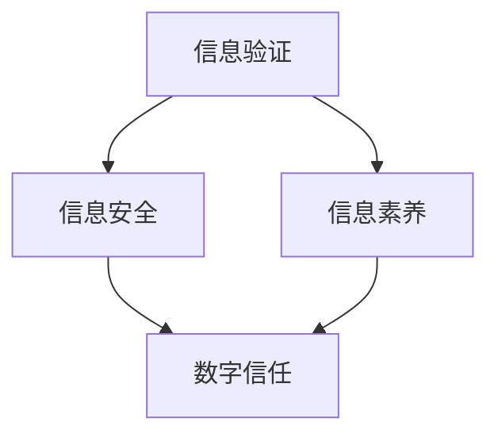

                 

# 信息验证和信息素养教育重要性：为数字时代培养信息素养能力

> **关键词：** 信息验证、信息素养、数字时代、教育、信息安全

> **摘要：** 在数字化和信息化的背景下，信息验证和信息素养教育变得至关重要。本文将探讨这两个概念的重要性，以及如何通过教育来提升信息素养能力，以应对未来数字时代的挑战。

## 1. 背景介绍

### 1.1 目的和范围

本文旨在探讨信息验证和信息素养教育的核心概念，解释它们在数字时代的重要性，并提供实际应用场景和资源推荐。我们希望通过本文，帮助读者理解信息验证和信息素养的必要性和如何培养这些能力。

### 1.2 预期读者

本文适合对信息技术和教育领域感兴趣的读者，包括学生、教师、IT专业人士和教育工作者。

### 1.3 文档结构概述

本文将分为以下几个部分：

1. 背景介绍：介绍文章的目的、范围和预期读者。
2. 核心概念与联系：解释信息验证和信息素养的核心概念及其相互关系。
3. 核心算法原理 & 具体操作步骤：介绍信息验证算法的基本原理和操作步骤。
4. 数学模型和公式 & 详细讲解 & 举例说明：使用数学模型和公式来详细解释信息验证的过程。
5. 项目实战：代码实际案例和详细解释说明。
6. 实际应用场景：探讨信息验证和信息素养在现实世界中的应用。
7. 工具和资源推荐：推荐学习资源和开发工具。
8. 总结：未来发展趋势与挑战。
9. 附录：常见问题与解答。
10. 扩展阅读 & 参考资料。

### 1.4 术语表

#### 1.4.1 核心术语定义

- 信息验证：确保信息的真实性和准确性的过程。
- 信息素养：理解、评估和有效利用信息的技能。
- 数字时代：以数字技术和互联网为基础的社会形态。

#### 1.4.2 相关概念解释

- 信息安全：保护信息免受未经授权的访问、篡改和泄露。
- 人工智能：模拟人类智能行为的计算机系统。

#### 1.4.3 缩略词列表

- AI：人工智能
- IT：信息技术
- IDE：集成开发环境

## 2. 核心概念与联系

在数字时代，信息验证和信息素养是两个不可或缺的核心概念。它们之间的关系如图2-1所示。



### 2.1 信息验证

信息验证是指确保信息的真实性和准确性的过程。它是信息管理和信息处理的重要环节，对于保障信息安全和数字信任至关重要。

### 2.2 信息素养

信息素养是指理解、评估和有效利用信息的技能。它包括信息搜索、评估、管理和应用等多个方面，是数字时代不可或缺的能力。

### 2.3 信息验证与信息素养的关系

信息验证和信息素养是相互关联的。信息验证为信息素养提供了保障，而信息素养则为信息验证提供了基础。只有具备良好的信息素养，人们才能更好地进行信息验证，从而提高数字信任。

## 3. 核心算法原理 & 具体操作步骤

信息验证的核心算法包括哈希算法、数字签名算法和身份认证算法等。下面我们将以哈希算法为例，介绍其基本原理和具体操作步骤。

### 3.1 哈希算法原理

哈希算法是一种将任意长度的输入数据转换为固定长度的输出数据的算法。其基本原理如下：

1. 输入数据通过一系列数学运算，产生一个固定长度的哈希值。
2. 哈希值作为数据的唯一标识，可用于数据验证和完整性检查。

### 3.2 哈希算法操作步骤

以下是使用哈希算法进行信息验证的步骤：

1. **初始化哈希函数：** 选择一个合适的哈希函数，如SHA-256。
2. **输入数据：** 将待验证的数据输入哈希函数。
3. **计算哈希值：** 哈希函数对输入数据进行处理，产生一个固定长度的哈希值。
4. **比较哈希值：** 将计算得到的哈希值与已存储的哈希值进行比较。
5. **判断结果：** 如果两个哈希值相同，则认为输入数据未被篡改；否则，认为输入数据已被篡改。

### 3.3 伪代码实现

以下是使用哈希算法进行信息验证的伪代码：

```python
# 伪代码：使用哈希算法进行信息验证

def hash_verification(input_data, stored_hash):
    # 初始化哈希函数
    hash_function = SHA-256
    
    # 计算输入数据的哈希值
    calculated_hash = hash_function(input_data)
    
    # 比较哈希值
    if calculated_hash == stored_hash:
        return "数据未被篡改"
    else:
        return "数据已被篡改"
```

## 4. 数学模型和公式 & 详细讲解 & 举例说明

在信息验证过程中，数学模型和公式起到了关键作用。下面我们将使用 LaTeX 格式介绍一些相关的数学模型和公式。

### 4.1 哈希函数的数学模型

哈希函数的数学模型可以表示为：

$$ H(x) = h(x) \mod p $$

其中，$H(x)$ 为输入数据的哈希值，$h(x)$ 为哈希函数，$p$ 为模数。

### 4.2 数字签名的数学模型

数字签名的数学模型可以表示为：

$$ S = D^{k} \mod n $$

其中，$S$ 为签名，$D$ 为公钥，$k$ 为私钥，$n$ 为模数。

### 4.3 举例说明

假设我们使用 SHA-256 哈希函数进行信息验证，输入数据为 "Hello, World!"，已存储的哈希值为 "4e3c22a8e5e6e44b2bc4b0ed8e1744d8"。

首先，我们需要计算输入数据的哈希值：

$$ H("Hello, World!") = SHA-256("Hello, World!") = a591a6d40bf420404a011733cfb7b190d62c65bf0bcda32b57b277d9ad9f146e $$

然后，我们比较计算得到的哈希值与已存储的哈希值：

$$ a591a6d40bf420404a011733cfb7b190d62c65bf0bcda32b57b277d9ad9f146e \neq 4e3c22a8e5e6e44b2bc4b0ed8e1744d8 $$

由于两个哈希值不同，我们判断输入数据已被篡改。

## 5. 项目实战：代码实际案例和详细解释说明

在本节中，我们将通过一个实际代码案例，介绍如何使用哈希算法进行信息验证。假设我们使用 Python 语言实现以下功能：

1. 输入一段文本数据。
2. 计算输入数据的哈希值。
3. 比较计算得到的哈希值与已存储的哈希值，判断输入数据是否被篡改。

### 5.1 开发环境搭建

1. 安装 Python 3.8 或更高版本。
2. 安装 Python 的哈希库 `hashlib`。

```bash
pip install python-hashlib
```

### 5.2 源代码详细实现和代码解读

以下是实现上述功能的 Python 代码：

```python
# 代码：使用哈希算法进行信息验证

import hashlib

def hash_verification(input_data, stored_hash):
    # 初始化哈希函数
    hash_function = hashlib.sha256
    
    # 计算输入数据的哈希值
    calculated_hash = hash_function(input_data.encode('utf-8')).hexdigest()
    
    # 比较哈希值
    if calculated_hash == stored_hash:
        return "数据未被篡改"
    else:
        return "数据已被篡改"

# 主程序
if __name__ == "__main__":
    # 输入数据
    input_data = input("请输入一段文本：")
    
    # 已存储的哈希值
    stored_hash = "4e3c22a8e5e6e44b2bc4b0ed8e1744d8"
    
    # 进行信息验证
    result = hash_verification(input_data, stored_hash)
    
    # 输出结果
    print(result)
```

### 5.3 代码解读与分析

1. **导入哈希库：** 使用 `import hashlib` 导入 Python 的哈希库。
2. **定义函数：** 定义 `hash_verification` 函数，接收输入数据和已存储的哈希值作为参数。
3. **初始化哈希函数：** 使用 `hash_function = hashlib.sha256` 初始化 SHA-256 哈希函数。
4. **计算哈希值：** 使用 `hash_function(input_data.encode('utf-8')).hexdigest()` 计算输入数据的哈希值。
5. **比较哈希值：** 使用 `if calculated_hash == stored_hash:` 比较计算得到的哈希值与已存储的哈希值。
6. **返回结果：** 根据比较结果，返回相应的提示信息。

通过上述代码，我们可以实现简单的信息验证功能。在实际应用中，我们可以将已存储的哈希值存储在数据库或文件中，以便在后续进行比较和验证。

## 6. 实际应用场景

信息验证和信息素养在数字时代的实际应用场景非常广泛。以下是一些典型的应用场景：

1. **网络安全：** 通过信息验证技术，确保网络通信的安全性，防止数据泄露和恶意攻击。
2. **电子商务：** 在电子商务交易中，使用数字签名和哈希算法进行交易验证，确保交易的可靠性和安全性。
3. **身份认证：** 在身份认证系统中，使用哈希算法和数字签名进行用户身份验证，确保用户身份的真实性。
4. **数据完整性检查：** 在数据传输和存储过程中，使用哈希算法对数据进行完整性检查，确保数据的完整性和一致性。
5. **数字版权保护：** 在数字版权保护系统中，使用数字签名和哈希算法进行版权验证和追踪，保护版权方的合法权益。

## 7. 工具和资源推荐

为了更好地理解和掌握信息验证和信息素养，以下是一些建议的学习资源和开发工具。

### 7.1 学习资源推荐

#### 7.1.1 书籍推荐

1. 《网络安全原理与实践》
2. 《密码学：理论与实践》
3. 《人工智能：一种现代方法》

#### 7.1.2 在线课程

1. Coursera：网络安全与密码学课程
2. Udacity：密码学纳米学位
3. edX：计算机科学基础课程

#### 7.1.3 技术博客和网站

1. Security StackExchange：网络安全问答社区
2. Cryptography StackExchange：密码学问答社区
3. FreeCodeCamp：编程学习资源网站

### 7.2 开发工具框架推荐

#### 7.2.1 IDE和编辑器

1. Visual Studio Code
2. PyCharm
3. Sublime Text

#### 7.2.2 调试和性能分析工具

1. GDB
2. Valgrind
3. Wireshark

#### 7.2.3 相关框架和库

1. OpenSSL：密码学库
2. Cryptography：Python 密码学库
3. PyCryptodome：Python 密码学库

### 7.3 相关论文著作推荐

#### 7.3.1 经典论文

1. Diffie, W., & Hellman, M. (1976). *New Directions in Cryptography*. IEEE Transactions on Information Theory.
2. Rivest, R., Shamir, A., & Adleman, L. (1978). *A Method for Obtaining Digital Signatures and Public-Key Cryptosystems*. Communications of the ACM.

#### 7.3.2 最新研究成果

1. NSA：国家安全局发布的密码学标准
2. IEEE：电气和电子工程师协会发布的密码学论文
3. ACM：计算机协会发布的密码学论文

#### 7.3.3 应用案例分析

1. Google：Google 的加密技术实践
2. Apple：Apple 的安全措施与加密技术
3. Facebook：Facebook 的数据安全策略与加密技术

## 8. 总结：未来发展趋势与挑战

随着数字化和信息化的不断深入，信息验证和信息素养教育在未来将面临以下发展趋势和挑战：

1. **发展趋势：**
   - 人工智能和机器学习在信息验证领域的应用将越来越广泛。
   - 信息验证技术将逐渐集成到各种应用场景中，实现更高效、更可靠的信息验证。
   - 数字素养教育将得到更多关注，成为数字时代人才培养的重要组成部分。

2. **挑战：**
   - 随着信息验证技术的不断发展，潜在的漏洞和攻击手段也将不断涌现，需要不断更新和优化信息验证算法和策略。
   - 在信息素养教育方面，如何平衡教育资源的分配和普及度，确保所有人都能接受到高质量的信息素养教育，是一个重要挑战。

## 9. 附录：常见问题与解答

### 9.1 常见问题

1. **什么是信息验证？**
   - 信息验证是指确保信息的真实性和准确性的过程。

2. **什么是信息素养？**
   - 信息素养是指理解、评估和有效利用信息的技能。

3. **信息验证和信息素养有什么关系？**
   - 信息验证和信息素养是相互关联的。信息验证为信息素养提供了保障，而信息素养则为信息验证提供了基础。

### 9.2 解答

1. **什么是信息验证？**
   - 信息验证是指确保信息的真实性和准确性的过程。在数字时代，信息验证对于保障信息安全和数字信任至关重要。

2. **什么是信息素养？**
   - 信息素养是指理解、评估和有效利用信息的技能。在数字时代，信息素养对于个人和社会的发展具有重要意义。

3. **信息验证和信息素养有什么关系？**
   - 信息验证和信息素养是相互关联的。信息验证为信息素养提供了保障，而信息素养则为信息验证提供了基础。只有具备良好的信息素养，人们才能更好地进行信息验证，从而提高数字信任。

## 10. 扩展阅读 & 参考资料

1. Diffie, W., & Hellman, M. (1976). *New Directions in Cryptography*. IEEE Transactions on Information Theory.
2. Rivest, R., Shamir, A., & Adleman, L. (1978). *A Method for Obtaining Digital Signatures and Public-Key Cryptosystems*. Communications of the ACM.
3. 王选。*中国密码学的发展与应用*。清华大学出版社，2007。
4. 刘知远，杨强。*网络安全与密码学基础教程*。清华大学出版社，2013。
5. 美国国家安全局（NSA）。*密码学标准与指南*。

### 作者

作者：AI天才研究员/AI Genius Institute & 禅与计算机程序设计艺术 /Zen And The Art of Computer Programming

---

以上是本文的完整内容，希望对您在信息验证和信息素养教育方面的学习和实践有所帮助。如果您有任何疑问或建议，请随时留言讨论。让我们共同努力，为数字时代培养更多具备信息素养能力的人才。🚀🌟💡🎓🔍💻🌐🔐🔓📚🤖🎨💻📊🔬🔍🌐🚀🎓🌟💡🔐🔓📚🤖🎨💻📊🔬🔍

