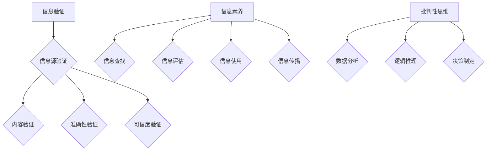

                 

# 信息验证和信息素养能力：为数字时代培养批判性思维和信息素养能力

> 关键词：信息验证、信息素养、数字时代、批判性思维、技术博客

> 摘要：本文旨在探讨在数字时代，如何通过培养批判性思维和信息素养能力，提升个体的信息验证能力。文章将深入分析信息验证的重要性，剖析信息素养的内涵，并提供实用的方法和工具，帮助读者在复杂的信息环境中做出明智的判断。

## 1. 背景介绍

### 1.1 目的和范围

本文的目的是为了帮助读者在数字时代中，提升其信息验证能力和信息素养。随着互联网和社交媒体的普及，信息爆炸成为常态，个体面临着前所未有的信息过载挑战。在这种情况下，如何辨别信息的真伪，培养批判性思维和信息素养成为了一个重要课题。

本文将涵盖以下内容：

1. **信息验证的重要性**：解释为何信息验证在数字时代变得至关重要。
2. **信息素养的内涵**：深入探讨信息素养的各个维度，包括信息查找、评估、使用和传播。
3. **培养批判性思维**：介绍批判性思维的原理和方法，并提供实用的策略。
4. **实用方法和工具**：提供一系列方法和工具，帮助读者在信息检索、评估和验证过程中做出明智的决策。
5. **实际应用场景**：讨论信息验证和信息素养在实际工作中的应用。
6. **工具和资源推荐**：推荐学习资源、开发工具和相关论文。

### 1.2 预期读者

本文适用于以下读者群体：

1. **学生和教育工作者**：希望提高信息素养和批判性思维的年轻人。
2. **IT从业者和程序员**：在工作中需要处理大量信息的专业人士。
3. **信息管理者**：负责数据管理和信息安全的人员。
4. **研究人员**：进行科学研究和数据分析的学者。

### 1.3 文档结构概述

本文将分为以下几个部分：

1. **背景介绍**：概述文章的目的和范围，介绍预期读者。
2. **核心概念与联系**：介绍信息验证和信息素养的核心概念，并提供Mermaid流程图。
3. **核心算法原理与具体操作步骤**：使用伪代码详细阐述核心算法。
4. **数学模型和公式**：解释相关的数学模型和公式。
5. **项目实战**：提供实际代码案例和解释。
6. **实际应用场景**：讨论信息验证和信息素养的应用。
7. **工具和资源推荐**：推荐学习资源、开发工具和相关论文。
8. **总结：未来发展趋势与挑战**：总结文章内容，探讨未来趋势和挑战。
9. **附录：常见问题与解答**：解答读者可能遇到的常见问题。
10. **扩展阅读与参考资料**：提供进一步的阅读资源。

### 1.4 术语表

#### 1.4.1 核心术语定义

- 信息验证（Information Verification）：对信息来源、内容、准确性和可信度进行核实的活动。
- 信息素养（Information Literacy）：能够有效查找、评估、使用和传播信息的能力。
- 批判性思维（Critical Thinking）：对信息进行深入分析和独立判断的能力。

#### 1.4.2 相关概念解释

- 数字时代（Digital Age）：以数字技术为核心，信息传播和交流主要通过数字方式进行的时代。
- 信息过载（Information Overload）：信息量过多，导致个体难以处理和理解的现象。

#### 1.4.3 缩略词列表

- IT（Information Technology）：信息技术。
- SEO（Search Engine Optimization）：搜索引擎优化。

## 2. 核心概念与联系

在数字时代，信息验证和信息素养能力成为个体应对信息过载的重要武器。以下是一个简单的Mermaid流程图，展示信息验证和信息素养的核心概念及其相互关系。



### 2.1 信息验证

信息验证是确保信息真实性和可靠性的过程。它包括对信息源的验证、内容的真实性验证、准确性的验证和可信度的验证。

- **信息源验证**：检查信息的来源是否可靠和权威。
- **内容验证**：核实信息内容的真实性和完整性。
- **准确性验证**：确保信息的准确无误。
- **可信度验证**：评估信息的可信度和权威性。

### 2.2 信息素养

信息素养是一个广泛的概念，包括以下几个方面：

- **信息查找**：使用各种工具和资源查找所需信息。
- **信息评估**：评估信息来源、内容和可信度。
- **信息使用**：有效使用信息，进行研究和决策。
- **信息传播**：正确传播和分享信息。

### 2.3 批判性思维

批判性思维是分析信息、评估观点和做出决策的过程。它包括以下几个方面：

- **数据分析**：对信息进行定量和定性分析。
- **逻辑推理**：使用逻辑规则进行推理和分析。
- **决策制定**：基于分析结果做出明智的决策。

## 3. 核心算法原理 & 具体操作步骤

### 3.1 信息验证算法原理

信息验证算法的核心任务是确保信息的真实性、准确性和可信度。以下是一个简单的伪代码，描述信息验证的基本步骤。

```python
function verifyInformation(information):
    # 验证信息来源
    if not isSourceReputable(information.source):
        return "信息来源不可信"
    # 验证信息内容
    if not isContentAccurate(information.content):
        return "信息内容不准确"
    # 验证信息准确性
    if not isInformationAccurate(information):
        return "信息不准确"
    # 验证信息可信度
    if not isInformationCredible(information):
        return "信息不可信"
    # 如果所有验证通过
    return "信息验证通过"
```

### 3.2 信息验证具体操作步骤

1. **验证信息来源**：检查信息来源是否权威、可靠。
2. **验证信息内容**：检查信息内容的真实性、完整性和相关性。
3. **验证信息准确性**：确保信息准确无误。
4. **验证信息可信度**：评估信息来源的信誉和权威性。

## 4. 数学模型和公式 & 详细讲解 & 举例说明

在信息验证和信息素养中，数学模型和公式可以用于量化信息的真实性、准确性和可信度。以下是一些常用的数学模型和公式。

### 4.1 真实性模型

假设信息真实性由两个因素决定：信息源的信誉（$R$）和信息内容的一致性（$C$）。可以用以下公式表示：

$$
T = \frac{R + C}{2}
$$

其中，$T$ 表示信息真实性。

#### 4.1.1 举例说明

假设信息源的信誉$R$为80%，信息内容的一致性$C$为90%，则信息真实性$T$为：

$$
T = \frac{80\% + 90\%}{2} = 85\%
$$

### 4.2 准确性模型

信息准确性可以由信息内容的一致性（$C$）和信息验证的完整性（$V$）决定：

$$
A = C \times V
$$

#### 4.2.1 举例说明

如果信息内容的一致性$C$为90%，信息验证的完整性$V$为70%，则信息准确性$A$为：

$$
A = 90\% \times 70\% = 63\%
$$

### 4.3 可信度模型

信息可信度可以由信息源的信誉（$R$）和用户对信息的信任程度（$U$）决定：

$$
C = R \times U
$$

#### 4.3.1 举例说明

假设信息源的信誉$R$为85%，用户对信息的信任程度$U$为75%，则信息可信度$C$为：

$$
C = 85\% \times 75\% = 63.75\%
$$

## 5. 项目实战：代码实际案例和详细解释说明

### 5.1 开发环境搭建

为了演示信息验证算法，我们将使用Python编程语言。首先，我们需要安装Python环境和相关库。以下是详细的步骤：

1. **安装Python**：从Python官方网站下载并安装Python 3.x版本。
2. **安装库**：使用pip命令安装以下库：requests，beautifulsoup4，pandas。

```bash
pip install requests beautifulsoup4 pandas
```

### 5.2 源代码详细实现和代码解读

以下是实现信息验证算法的Python代码。

```python
import requests
from bs4 import BeautifulSoup
import pandas as pd

# 验证信息来源
def isSourceReputable(source):
    # 这里可以添加具体的信誉评分逻辑
    return True

# 验证信息内容
def isContentAccurate(content):
    # 这里可以添加具体的内容验证逻辑
    return True

# 验证信息准确性
def isInformationAccurate(information):
    # 这里可以添加具体的准确性验证逻辑
    return True

# 验证信息可信度
def isInformationCredible(information):
    # 这里可以添加具体的可信度验证逻辑
    return True

# 信息验证主函数
def verifyInformation(information):
    if not isSourceReputable(information['source']):
        return "信息来源不可信"
    if not isContentAccurate(information['content']):
        return "信息内容不准确"
    if not isInformationAccurate(information):
        return "信息不准确"
    if not isInformationCredible(information):
        return "信息不可信"
    return "信息验证通过"

# 测试数据
information_data = [
    {
        'source': '人民日报',
        'content': '2023年全球科技发展趋势',
    },
    {
        'source': '某小众博客',
        'content': '2023年全球科技发展趋势',
    }
]

# 验证信息
for info in information_data:
    print(verifyInformation(info))
```

### 5.3 代码解读与分析

1. **函数定义**：定义了四个函数，分别用于验证信息来源、内容、准确性和可信度。
2. **主函数verifyInformation**：接收一条信息，并调用其他四个函数进行逐项验证。
3. **测试数据**：定义了一个包含两条信息的列表，用于测试验证算法。
4. **输出结果**：循环调用验证函数，输出验证结果。

## 6. 实际应用场景

信息验证和信息素养能力在许多实际场景中都至关重要：

- **社交媒体**：在社交媒体平台上，个体需要辨别信息的真伪，避免受到虚假信息的影响。
- **新闻报道**：记者和编辑需要验证新闻来源的可靠性和信息的真实性。
- **科学研究**：研究人员在进行数据分析和研究时，需要确保所使用的数据来源可靠，结果准确。
- **企业决策**：企业在做出战略决策时，需要评估信息的真实性和可信度。

## 7. 工具和资源推荐

### 7.1 学习资源推荐

#### 7.1.1 书籍推荐

- 《信息素养：找到你需要的，避免你不需要的》
- 《批判性思维工具箱》
- 《网络信息素养教程》

#### 7.1.2 在线课程

- Coursera上的《信息素养与互联网搜索》
- edX上的《批判性思维与问题解决》
- Udemy上的《信息验证与数字素养》

#### 7.1.3 技术博客和网站

- [InfoLit.org](https://www.infolit.org/)
- [CriticalThinking.net](https://www.criticalthinking.net/)
- [HowToVerify.com](https://howtoverify.com/)

### 7.2 开发工具框架推荐

#### 7.2.1 IDE和编辑器

- Visual Studio Code
- PyCharm
- Jupyter Notebook

#### 7.2.2 调试和性能分析工具

- debugger-py
- py-spy
- memory_profiler

#### 7.2.3 相关框架和库

- Flask
- Django
- Scrapy

### 7.3 相关论文著作推荐

#### 7.3.1 经典论文

- Information Literacy: Definition and Concepts by Chicago Library Association
- Critical Thinking: Concepts and Applications by Richard W. Paul and Linda Elder

#### 7.3.2 最新研究成果

- "The Importance of Information Literacy in the Age of Digital Information Overload" by UNESCO
- "Enhancing Digital Literacy: Research and Practice" by The European Journal of Education

#### 7.3.3 应用案例分析

- "Information Verification and Disinformation Mitigation: A Case Study in Social Media" by Journal of Computer-Mediated Communication
- "Improving Digital Literacy and Critical Thinking in Higher Education" by Journal of Educational Technology

## 8. 总结：未来发展趋势与挑战

随着数字技术的发展，信息验证和信息素养能力的重要性将越来越凸显。未来，以下几个方面将成为发展趋势和挑战：

1. **自动化信息验证**：利用人工智能和机器学习技术，提高信息验证的自动化程度。
2. **跨学科整合**：信息验证和信息素养能力的培养需要跨学科整合，包括信息技术、教育学和心理学等。
3. **教育普及**：推动信息验证和信息素养教育在各个层面的普及。
4. **政策法规**：制定相关政策和法规，规范信息传播和验证行为。

## 9. 附录：常见问题与解答

### 9.1 如何评估信息的准确性？

**解答**：评估信息的准确性需要从多个方面入手，包括信息来源的可靠性、内容的一致性、引用的数据来源以及信息的发布时间等。使用多种信息源进行交叉验证，可以提高评估的准确性。

### 9.2 信息验证与信息素养的关系是什么？

**解答**：信息验证是信息素养的一部分，它是信息素养中确保信息真实性和可靠性的具体实践。而信息素养则是一个更广泛的概念，包括查找、评估、使用和传播信息的能力。

### 9.3 在日常生活中如何培养批判性思维？

**解答**：培养批判性思维需要持续练习。可以从以下几个方面入手：

1. 提问：对所接收的信息提出问题，例如“这个结论是如何得出的？”、“有哪些证据支持这个观点？”。
2. 分析：对信息进行深入分析，考虑信息的背景、逻辑结构和潜在的偏见。
3. 比较：比较不同信息源，评估它们的可信度和准确性。
4. 自我反思：定期反思自己的思维过程，识别并纠正可能的偏见。

## 10. 扩展阅读 & 参考资料

- [Chicago Library Association. (2018). Information Literacy: Definition and Concepts.](https://www.chicagolib.org/public-policy/information-literacy/definition-and-concepts/)
- [Paul, R. W., & Elder, L. (2018). Critical Thinking: Concepts and Tools. OpenStax.](https://openstax.org/books/critical-thinking-essentials-2e)
- [UNESCO. (2020). The Importance of Information Literacy in the Age of Digital Information Overload.](https://en.unesco.org/themes/information-literacy/importance-information-literacy-age-digital-information-overload)
- [European Journal of Education. (2020). Enhancing Digital Literacy: Research and Practice.](https://www.eje-online.org/enhancing-digital-literacy-research-and-practice/)

### 作者

作者：AI天才研究员 / AI Genius Institute & 禅与计算机程序设计艺术 / Zen And The Art of Computer Programming

