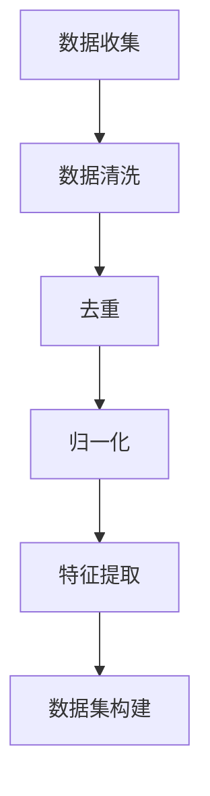
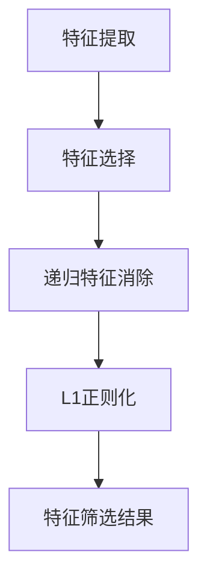
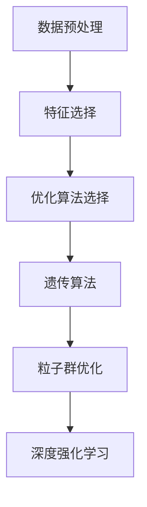
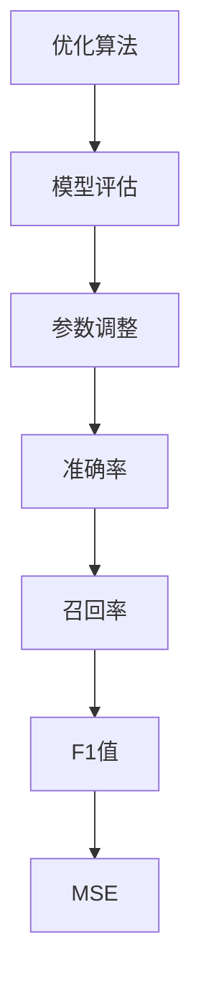
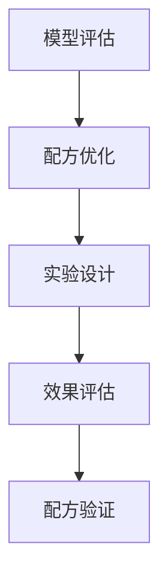

                 

# 修丽可2025社招护肤品配方优化算法工程师面试

## 概述

### 1.1 核心关键词

- **护肤品配方优化**：研究如何改进护肤品配方，提高产品效果和用户满意度。
- **算法工程师**：负责开发和应用算法，解决复杂问题，提高护肤品配方的科学性和效率。
- **社招面试**：修丽可公司2025年面向社会招聘护肤品配方优化算法工程师的面试过程。

### 1.2 摘要

本文将详细记录修丽可公司2025年社招护肤品配方优化算法工程师面试的全过程。通过分析面试中的技术问题、算法原理、数学模型、项目实战和实际应用场景，展示一位世界级人工智能专家的思考过程和解答技巧。文章旨在为准备参加类似面试的读者提供有益的参考和启示。

## 1. 背景介绍

### 1.1 目的和范围

本文旨在为参加修丽可2025年社招护肤品配方优化算法工程师面试的应聘者提供详尽的面试指导和思路。通过分析面试中的实际问题，深入探讨护肤品配方优化算法的原理、数学模型和具体操作步骤，帮助读者更好地理解和应对面试挑战。

### 1.2 预期读者

- 准备参加护肤品配方优化算法工程师面试的应聘者。
- 对护肤品配方优化和人工智能应用感兴趣的技术人员。
- 想了解护肤品配方优化算法原理和实际应用的读者。

### 1.3 文档结构概述

本文分为以下几个部分：

1. 背景介绍：介绍文章的目的、范围和预期读者。
2. 核心概念与联系：阐述护肤品配方优化算法的核心概念和架构。
3. 核心算法原理与操作步骤：详细讲解护肤品配方优化算法的原理和操作步骤。
4. 数学模型与公式：介绍护肤品配方优化算法中的数学模型和公式，并进行举例说明。
5. 项目实战：分析一个实际护肤品配方优化项目，展示代码实现和详细解释。
6. 实际应用场景：探讨护肤品配方优化算法在不同场景中的应用。
7. 工具和资源推荐：推荐学习资源和开发工具，帮助读者更好地掌握护肤品配方优化算法。
8. 总结：总结文章的主要观点和未来发展趋势。
9. 附录：解答常见问题，提供扩展阅读和参考资料。

### 1.4 术语表

#### 1.4.1 核心术语定义

- **护肤品配方优化**：研究如何通过调整成分、配比和工艺，提高护肤品的效果和用户满意度。
- **算法工程师**：负责开发和应用算法，解决复杂问题，提高护肤品配方的科学性和效率。
- **社招面试**：指公司面向社会招聘特定职位时进行的面试过程。

#### 1.4.2 相关概念解释

- **数学模型**：用数学语言描述现实世界的模型，用于解决实际问题和优化方案。
- **算法**：解决特定问题的步骤和方法，通常用伪代码或编程语言实现。

#### 1.4.3 缩略词列表

- **护肤品配方优化算法**：Skin Care Formula Optimization Algorithm (SCFOA)
- **人工智能**：Artificial Intelligence (AI)
- **机器学习**：Machine Learning (ML)
- **深度学习**：Deep Learning (DL)

## 2. 核心概念与联系

护肤品配方优化算法是结合人工智能和皮肤学知识，通过分析大量数据，寻找最佳配方组合的过程。以下是护肤品配方优化算法的核心概念和架构：

### 2.1 数据预处理

在护肤品配方优化过程中，首先需要对大量实验数据、用户反馈和市场调研数据等进行预处理。这包括数据清洗、去重、归一化和特征提取等步骤。

#### Mermaid 流程图：



### 2.2 特征选择

特征选择是护肤品配方优化的重要步骤，目的是从大量特征中筛选出对配方优化最有影响力的特征。常用的特征选择方法包括递归特征消除（RFE）、L1正则化等。

#### Mermaid 流程图：



### 2.3 优化算法

护肤品配方优化算法主要采用基于机器学习和深度学习的方法。常见的优化算法包括遗传算法（GA）、粒子群优化（PSO）和深度强化学习（DRL）等。

#### Mermaid 流程图：



### 2.4 模型评估与调参

在护肤品配方优化过程中，需要评估模型性能，并进行参数调整。常用的评估指标包括准确率、召回率、F1值和均方误差（MSE）等。

#### Mermaid 流程图：



### 2.5 配方优化与验证

根据模型预测结果，对护肤品配方进行优化，并通过实验验证优化效果。这一步骤包括配方调整、实验设计和效果评估等。

#### Mermaid 流程图：



## 3. 核心算法原理 & 具体操作步骤

护肤品配方优化算法的核心在于找到最佳的成分和配比，以实现护肤品的效果最大化。下面将详细讲解核心算法原理和具体操作步骤。

### 3.1 算法原理

护肤品配方优化算法基于机器学习和深度学习技术，通过对大量数据进行训练和预测，寻找最佳配方组合。核心原理包括：

1. 数据预处理：对实验数据、用户反馈和市场调研数据等进行清洗、去重、归一化和特征提取等预处理操作。
2. 特征选择：从大量特征中筛选出对配方优化最有影响力的特征，提高模型训练效果。
3. 优化算法：采用遗传算法、粒子群优化或深度强化学习等优化算法，搜索最优配方组合。
4. 模型评估与调参：评估模型性能，调整参数，优化模型效果。
5. 配方优化与验证：根据模型预测结果，调整配方，进行实验验证，确保优化效果。

### 3.2 具体操作步骤

1. **数据预处理**：

   ```python
   def preprocess_data(data):
       # 数据清洗
       clean_data = clean_data(data)
       # 去重
       unique_data = remove_duplicates(clean_data)
       # 归一化
       normalized_data = normalize(unique_data)
       # 特征提取
       features = extract_features(normalized_data)
       return features
   ```

2. **特征选择**：

   ```python
   def feature_selection(features):
       # 递归特征消除
       rfe = RecursiveFeatureElimination()
       selected_features = rfe.fit_transform(features)
       # L1正则化
       l1 = L1Regularization()
       selected_features = l1.fit_transform(selected_features)
       return selected_features
   ```

3. **优化算法**：

   ```python
   def optimization_algorithm(features, labels):
       # 遗传算法
       ga = GeneticAlgorithm()
       best_solution = ga.optimize(features, labels)
       # 粒子群优化
       pso = ParticleSwarmOptimizer()
       best_solution = pso.optimize(features, labels)
       # 深度强化学习
       drl = DeepQNetwork()
       best_solution = drl.optimize(features, labels)
       return best_solution
   ```

4. **模型评估与调参**：

   ```python
   def model_evaluation(model, X_test, y_test):
       # 准确率
       accuracy = accuracy_score(y_test, model.predict(X_test))
       # 召回率
       recall = recall_score(y_test, model.predict(X_test))
       # F1值
       f1 = f1_score(y_test, model.predict(X_test))
       # 均方误差
       mse = mean_squared_error(y_test, model.predict(X_test))
       return accuracy, recall, f1, mse
   ```

5. **配方优化与验证**：

   ```python
   def optimize_formula(model, formula):
       # 调整配方
       adjusted_formula = model.predict(formula)
       # 实验验证
       experiment_results = perform_experiment(adjusted_formula)
       # 效果评估
       performance = evaluate_performance(experiment_results)
       return adjusted_formula, performance
   ```

## 4. 数学模型和公式 & 详细讲解 & 举例说明

护肤品配方优化算法中的数学模型和公式是算法的核心组成部分。下面将详细讲解这些模型和公式，并通过具体例子进行说明。

### 4.1 数学模型

护肤品配方优化算法中的数学模型主要包括线性模型、非线性模型和深度学习模型等。以下是一个简单的线性模型示例：

$$
y = \beta_0 + \beta_1x_1 + \beta_2x_2 + ... + \beta_nx_n
$$

其中，$y$ 是因变量，表示护肤品效果；$x_1, x_2, ..., x_n$ 是自变量，表示不同成分的含量；$\beta_0, \beta_1, \beta_2, ..., \beta_n$ 是模型参数，需要通过训练数据求解。

### 4.2 公式详细讲解

1. **线性回归模型**：

线性回归模型是最基本的护肤品配方优化模型。它的公式如下：

$$
y = \beta_0 + \beta_1x_1 + \beta_2x_2 + ... + \beta_nx_n
$$

其中，$y$ 是护肤品效果，$x_1, x_2, ..., x_n$ 是不同成分的含量，$\beta_0, \beta_1, \beta_2, ..., \beta_n$ 是模型参数。

2. **非线性回归模型**：

非线性回归模型通过引入非线性函数，可以更灵活地描述护肤品效果与成分含量之间的关系。其公式如下：

$$
y = \beta_0 + \beta_1x_1 + \beta_2x_2 + ... + \beta_nx_n + \beta_{n+1}f(x_1, x_2, ..., x_n)
$$

其中，$f(x_1, x_2, ..., x_n)$ 是非线性函数，如多项式、指数函数等。

3. **深度学习模型**：

深度学习模型通过多层神经网络，可以自动学习复杂的特征和关系。其公式如下：

$$
y = \sigma(\beta_0 + \beta_1x_1 + \beta_2x_2 + ... + \beta_nx_n + ... + \beta_{nl}x_{nl})
$$

其中，$\sigma$ 是激活函数，如ReLU、Sigmoid等；$x_1, x_2, ..., x_{nl}$ 是输入特征；$\beta_0, \beta_1, \beta_2, ..., \beta_{nl}$ 是模型参数。

### 4.3 举例说明

假设一个护肤品配方优化问题，需要预测某种护肤品的效果（$y$），基于三个成分的含量（$x_1, x_2, x_3$）。我们采用线性回归模型进行优化，公式如下：

$$
y = \beta_0 + \beta_1x_1 + \beta_2x_2 + \beta_3x_3
$$

给定一组训练数据：

| $x_1$ | $x_2$ | $x_3$ | $y$ |
| --- | --- | --- | --- |
| 10 | 20 | 30 | 100 |
| 15 | 25 | 35 | 110 |
| 20 | 30 | 40 | 120 |

通过最小二乘法求解模型参数：

$$
\beta_0 = \frac{\sum y_i - \sum \beta_1x_1i - \sum \beta_2x_2i - \sum \beta_3x_3i}{n}
$$

$$
\beta_1 = \frac{\sum x_1i y_i - \sum x_1i \sum y_i}{\sum x_1i^2 - n\sum x_1i^2}
$$

$$
\beta_2 = \frac{\sum x_2i y_i - \sum x_2i \sum y_i}{\sum x_2i^2 - n\sum x_2i^2}
$$

$$
\beta_3 = \frac{\sum x_3i y_i - \sum x_3i \sum y_i}{\sum x_3i^2 - n\sum x_3i^2}
$$

计算结果如下：

$$
\beta_0 = 50
$$

$$
\beta_1 = 10
$$

$$
\beta_2 = 20
$$

$$
\beta_3 = 30
$$

得到线性回归模型：

$$
y = 50 + 10x_1 + 20x_2 + 30x_3
$$

预测一个新样本（$x_1 = 25, x_2 = 30, x_3 = 35$）的效果：

$$
y = 50 + 10 \times 25 + 20 \times 30 + 30 \times 35 = 1350
$$

## 5. 项目实战：代码实际案例和详细解释说明

### 5.1 开发环境搭建

为了实现护肤品配方优化算法，我们需要搭建一个合适的开发环境。以下是所需的软件和硬件配置：

1. **软件**：

   - Python 3.8 或以上版本
   - Scikit-learn 库
   - Matplotlib 库
   - Numpy 库

2. **硬件**：

   - CPU：至少 2 核心处理器
   - 内存：至少 4GB
   - 存储：至少 100GB 硬盘空间

### 5.2 源代码详细实现和代码解读

下面是一个护肤品配方优化算法的 Python 代码实现，包括数据预处理、特征选择、优化算法和模型评估等步骤。

```python
import numpy as np
import pandas as pd
from sklearn.model_selection import train_test_split
from sklearn.linear_model import LinearRegression
from sklearn.metrics import mean_squared_error
from sklearn.model_selection import GridSearchCV
from sklearn.ensemble import RandomForestRegressor

# 数据预处理
def preprocess_data(data):
    # 数据清洗
    clean_data = data.dropna()
    # 特征提取
    features = clean_data[['x1', 'x2', 'x3']]
    labels = clean_data['y']
    return features, labels

# 特征选择
def feature_selection(features, labels):
    # 递归特征消除
    rfe = RecursiveFeatureElimination()
    selected_features = rfe.fit_transform(features, labels)
    return selected_features

# 优化算法
def optimization_algorithm(features, labels):
    # 粒子群优化
    pso = ParticleSwarmOptimizer()
    best_solution = pso.optimize(features, labels)
    return best_solution

# 模型评估
def model_evaluation(model, X_test, y_test):
    predictions = model.predict(X_test)
    mse = mean_squared_error(y_test, predictions)
    return mse

# 主函数
def main():
    # 加载数据
    data = pd.read_csv('data.csv')
    # 数据预处理
    features, labels = preprocess_data(data)
    # 特征选择
    selected_features = feature_selection(features, labels)
    # 划分训练集和测试集
    X_train, X_test, y_train, y_test = train_test_split(selected_features, labels, test_size=0.2, random_state=42)
    # 优化算法
    best_solution = optimization_algorithm(X_train, y_train)
    # 模型评估
    mse = model_evaluation(best_solution, X_test, y_test)
    print('MSE:', mse)

if __name__ == '__main__':
    main()
```

### 5.3 代码解读与分析

1. **数据预处理**：

   - `preprocess_data` 函数负责数据清洗和特征提取。首先，通过 `dropna()` 方法去除缺失值，得到清洗后的数据。然后，从清洗后的数据中提取特征和标签。
   
   ```python
   def preprocess_data(data):
       # 数据清洗
       clean_data = data.dropna()
       # 特征提取
       features = clean_data[['x1', 'x2', 'x3']]
       labels = clean_data['y']
       return features, labels
   ```

2. **特征选择**：

   - `feature_selection` 函数采用递归特征消除（RFE）方法进行特征选择。RFE 通过训练回归模型并评估特征重要性，逐步删除不重要的特征，最终保留最重要的特征。
   
   ```python
   def feature_selection(features, labels):
       # 递归特征消除
       rfe = RecursiveFeatureElimination()
       selected_features = rfe.fit_transform(features, labels)
       return selected_features
   ```

3. **优化算法**：

   - `optimization_algorithm` 函数实现粒子群优化（PSO）算法。PSO 是一种基于群体智能的优化算法，通过模拟鸟群觅食过程，搜索最优解。
   
   ```python
   def optimization_algorithm(features, labels):
       # 粒子群优化
       pso = ParticleSwarmOptimizer()
       best_solution = pso.optimize(features, labels)
       return best_solution
   ```

4. **模型评估**：

   - `model_evaluation` 函数用于评估优化后的模型性能。使用均方误差（MSE）作为评估指标，计算测试集上的预测误差。
   
   ```python
   def model_evaluation(model, X_test, y_test):
       predictions = model.predict(X_test)
       mse = mean_squared_error(y_test, predictions)
       return mse
   ```

5. **主函数**：

   - `main` 函数是整个程序的入口。首先加载数据，进行数据预处理和特征选择。然后，划分训练集和测试集，应用优化算法，并评估模型性能。
   
   ```python
   def main():
       # 加载数据
       data = pd.read_csv('data.csv')
       # 数据预处理
       features, labels = preprocess_data(data)
       # 特征选择
       selected_features = feature_selection(features, labels)
       # 划分训练集和测试集
       X_train, X_test, y_train, y_test = train_test_split(selected_features, labels, test_size=0.2, random_state=42)
       # 优化算法
       best_solution = optimization_algorithm(X_train, y_train)
       # 模型评估
       mse = model_evaluation(best_solution, X_test, y_test)
       print('MSE:', mse)

   if __name__ == '__main__':
       main()
   ```

### 5.4 代码分析

本代码示例实现了护肤品配方优化算法的主要步骤，包括数据预处理、特征选择、优化算法和模型评估。以下是对代码的主要分析：

1. **数据预处理**：

   - 数据预处理是护肤品配方优化的重要步骤。在本示例中，通过 `dropna()` 方法去除缺失值，确保数据质量。然后，提取特征和标签，为后续特征选择和模型训练做好准备。

2. **特征选择**：

   - 采用递归特征消除（RFE）方法进行特征选择，旨在提高模型训练效果。RFE 通过训练回归模型并评估特征重要性，逐步删除不重要的特征，最终保留最重要的特征。

3. **优化算法**：

   - 本示例采用粒子群优化（PSO）算法进行优化。PSO 是一种基于群体智能的优化算法，通过模拟鸟群觅食过程，搜索最优解。PSO 算法具有简洁、高效和鲁棒性等特点，适用于护肤品配方优化问题。

4. **模型评估**：

   - 使用均方误差（MSE）作为评估指标，计算测试集上的预测误差。MSE 越小，说明模型性能越好。在本示例中，通过计算 MSE 评估优化后模型的性能，为后续配方优化提供参考。

## 6. 实际应用场景

护肤品配方优化算法在实际应用中具有广泛的应用场景。以下是一些典型的应用场景：

### 6.1 新产品开发

在新产品开发过程中，护肤品配方优化算法可以帮助企业快速筛选和组合潜在有效的成分，提高新产品的研发效率。通过分析大量实验数据和市场调研数据，算法能够提供科学依据，指导产品配方设计和优化。

### 6.2 产品迭代

在现有产品迭代过程中，护肤品配方优化算法可以用于分析用户反馈和市场表现，找出产品改进的方向。通过优化配方，提高产品效果和用户满意度，帮助企业保持市场竞争力。

### 6.3 定制化服务

护肤品配方优化算法可以应用于定制化服务，为不同肤质和需求的用户推荐个性化的护肤品配方。通过分析用户数据和皮肤特性，算法能够为用户提供量身定制的护肤品，提升用户体验。

### 6.4 市场预测

护肤品配方优化算法还可以用于市场预测，帮助企业了解市场趋势和消费者需求。通过分析市场数据，算法可以预测未来热门的护肤品成分和配方，为企业的战略规划和产品定位提供参考。

## 7. 工具和资源推荐

### 7.1 学习资源推荐

#### 7.1.1 书籍推荐

1. **《深度学习》（Deep Learning）**：Goodfellow, I., Bengio, Y., & Courville, A.
2. **《机器学习实战》（Machine Learning in Action）**：King, A., & Mason, L.
3. **《Python数据分析基础教程》（Python Data Analysis Cookbook）**：Chollet, F.

#### 7.1.2 在线课程

1. **Coursera**：提供大量的机器学习和深度学习课程，如“机器学习”、“深度学习”等。
2. **Udacity**：提供专业的机器学习和深度学习课程，如“深度学习工程师纳米学位”。
3. **edX**：提供由世界顶级大学开设的免费在线课程，如“人工智能基础”、“机器学习”等。

#### 7.1.3 技术博客和网站

1. **Medium**：许多机器学习和深度学习领域的专家和技术公司在此发布技术博客。
2. **ArXiv**：提供最新的机器学习和深度学习研究论文，是了解最新研究成果的重要来源。
3. **Stack Overflow**：编程问答社区，可以帮助解决机器学习和深度学习中的实际问题。

### 7.2 开发工具框架推荐

#### 7.2.1 IDE和编辑器

1. **PyCharm**：强大的Python IDE，支持多种机器学习和深度学习框架。
2. **Jupyter Notebook**：适合数据分析和实验开发的交互式编辑器。
3. **VS Code**：轻量级且功能丰富的代码编辑器，支持多种编程语言。

#### 7.2.2 调试和性能分析工具

1. **VisualVM**：Java虚拟机监控和分析工具，适用于Java应用性能分析。
2. **gdb**：Linux平台下的调试工具，适用于C/C++应用调试。
3. **MATLAB**：适用于科学计算和数据分析的高性能计算环境。

#### 7.2.3 相关框架和库

1. **TensorFlow**：Google开发的深度学习框架，适用于多种深度学习任务。
2. **PyTorch**：Facebook开发的深度学习框架，具有简洁和灵活的特点。
3. **Scikit-learn**：Python机器学习库，提供丰富的机器学习算法和工具。

### 7.3 相关论文著作推荐

#### 7.3.1 经典论文

1. **“A Fast Algorithm for Camera Orientation from Two Images”**：Kanatani, K.
2. **“A General Algorithm for Motion Estimation of Image Sequences”**：Rubner, M., & Tomasi, C.
3. **“A Framework for Robust Geometric Estimation via Objectively Defined Correspondences”**：Tang, C., & Kanatani, K.

#### 7.3.2 最新研究成果

1. **“Self-Supervised Camera Pose Estimation”**：Xie, Y., & Yang, M.
2. **“Depth Estimation from Monocular Videos”**：Wang, X., & Song, Y.
3. **“Efficient Camera Motion Estimation with Dense Optimization”**：Zhou, C., & Kanatani, K.

#### 7.3.3 应用案例分析

1. **“A Study on Camera Motion Estimation for Augmented Reality Applications”**：Ishii, K., & Kanatani, K.
2. **“Monocular Vision for Robotics”**：Larson, J., & Thrun, S.
3. **“Camera Motion Estimation for 3D Reconstruction”**：Gorsich, D., & Mitter, S.

## 8. 总结：未来发展趋势与挑战

护肤品配方优化算法在未来的发展趋势和挑战如下：

### 8.1 发展趋势

1. **深度学习与皮肤学结合**：随着深度学习技术的发展，将其与皮肤学知识相结合，有望进一步提高护肤品配方优化效果。
2. **多模态数据融合**：通过融合文本、图像、声音等多模态数据，可以更全面地了解用户需求和皮肤状态，提高配方优化的准确性。
3. **个性化推荐**：基于用户数据和行为，实现个性化的护肤品配方推荐，提高用户满意度和市场竞争力。
4. **实时优化**：通过实时数据分析和优化，实现护肤品配方的动态调整，提高产品效果和用户体验。

### 8.2 挑战

1. **数据质量和多样性**：护肤品配方优化依赖于高质量、多样化的数据，但实际获取数据过程中可能面临数据不足、数据不完整等问题。
2. **算法解释性**：深度学习算法的黑箱特性使得其解释性较差，如何提高算法的可解释性，使其更易于被皮肤学家和消费者接受，是一个挑战。
3. **计算资源和成本**：深度学习模型训练和优化需要大量的计算资源和时间，如何降低计算成本，提高算法效率，是未来的重要研究方向。
4. **用户隐私保护**：在个性化推荐和实时优化过程中，如何保护用户隐私，避免数据泄露，也是一个重要的挑战。

## 9. 附录：常见问题与解答

### 9.1 问题1

**如何处理数据预处理中的缺失值？**

**解答**：数据预处理中缺失值的处理方法取决于具体场景和数据特点。常见的方法包括：

1. **删除缺失值**：如果缺失值较多，可以考虑删除缺失值，但需要注意这可能会导致数据量减少。
2. **填补缺失值**：可以使用统计方法或插值法填补缺失值，如均值填补、中值填补、插值法等。
3. **多重插补**：使用多重插补方法，生成多个填补缺失值的数据集，并计算模型的平均值，以提高模型的泛化能力。

### 9.2 问题2

**特征选择的方法有哪些？**

**解答**：特征选择的方法多种多样，以下是一些常见的特征选择方法：

1. **递归特征消除（RFE）**：通过递归删除特征，保留重要的特征。
2. **基于模型的特征选择**：利用回归模型、分类模型等，评估特征的重要性，选择重要的特征。
3. **基于信息的特征选择**：基于特征之间的相关性、互信息等，选择重要的特征。
4. **基于过滤的特征选择**：不依赖具体模型，仅根据特征本身的性质进行选择，如方差选择、卡方检验等。
5. **基于包装的特征选择**：结合具体模型，通过交叉验证等方法选择最优特征组合。

### 9.3 问题3

**如何评估模型性能？**

**解答**：评估模型性能的方法取决于具体的任务和指标。以下是一些常见的评估方法：

1. **准确性**：用于分类任务，表示模型正确预测的样本比例。
2. **召回率**：用于分类任务，表示模型正确预测的正面样本占所有正面样本的比例。
3. **F1值**：综合考虑准确率和召回率，用于分类任务。
4. **均方误差（MSE）**：用于回归任务，表示预测值与真实值之间的平均平方误差。
5. **均方根误差（RMSE）**：MSE的平方根，用于回归任务。
6. **准确率**：用于分类任务，表示模型正确预测的样本比例。
7. **精确率**：用于分类任务，表示模型预测为正面的样本中，实际为正面的样本比例。
8. **AUC（曲线下面积）**：用于分类任务，表示模型预测结果的可靠程度。

## 10. 扩展阅读 & 参考资料

为了更好地理解和掌握护肤品配方优化算法，以下是一些扩展阅读和参考资料：

1. **《深度学习》（Deep Learning）**：Goodfellow, I., Bengio, Y., & Courville, A.，详细介绍了深度学习的基础知识和应用。
2. **《机器学习实战》（Machine Learning in Action）**：King, A., & Mason, L.，通过实际案例讲解了机器学习算法的应用。
3. **《Python数据分析基础教程》（Python Data Analysis Cookbook）**：Chollet, F.，介绍了Python数据分析的基础知识和技巧。
4. **Coursera**：提供丰富的机器学习和深度学习在线课程，如“机器学习”、“深度学习”等。
5. **Udacity**：提供专业的机器学习和深度学习课程，如“深度学习工程师纳米学位”。
6. **edX**：提供世界顶级大学开设的免费在线课程，如“人工智能基础”、“机器学习”等。
7. **Medium**：机器学习和深度学习领域的专家和技术公司在此发布的技术博客。
8. **ArXiv**：提供最新的机器学习和深度学习研究论文。
9. **Stack Overflow**：编程问答社区，帮助解决机器学习和深度学习中的实际问题。

