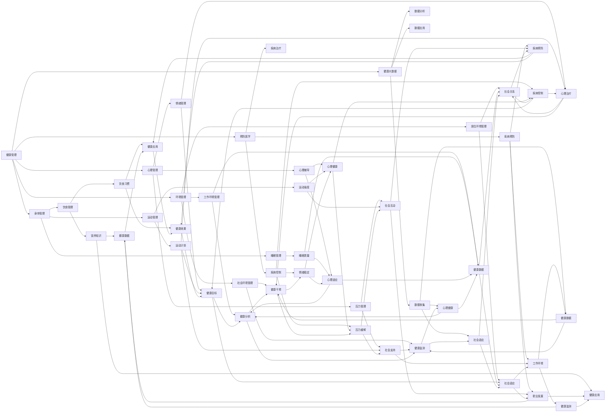

                 


# 健康管理的意识：如何拥有健康的生活方式？

> 关键词：健康管理、健康生活方式、身体管理、心理管理、环境管理、预防医学、健康意识、可持续发展、人工智能、深度学习、数据处理、健康大数据

> 摘要：本文旨在探讨健康管理的意识及其在实现健康生活方式中的重要性。我们将从多个维度分析如何通过身体管理、心理管理、环境管理等方面来建立健康的生活方式。同时，我们将介绍预防医学和健康大数据在健康管理中的作用，以及人工智能和深度学习如何帮助提升健康管理的效率和准确性。最后，我们将展望未来健康管理的发展趋势与挑战。

## 1. 背景介绍

### 1.1 目的和范围

本文的目的在于提供一套系统性的健康管理体系，帮助读者理解如何从意识层面开始，逐步建立健康的生活方式。本文将涵盖以下主要内容：

1. 健康管理的重要性。
2. 身体管理、心理管理、环境管理等方面的具体方法。
3. 预防医学和健康大数据在健康管理中的作用。
4. 人工智能和深度学习在健康管理中的应用。
5. 未来健康管理的发展趋势与挑战。

### 1.2 预期读者

本文适合对健康管理有兴趣的广大读者，包括：

1. 希望提高自身健康水平的普通民众。
2. 关注健康领域的专业人士。
3. 对人工智能和深度学习有兴趣的读者。
4. 健康管理相关的学生和研究人员。

### 1.3 文档结构概述

本文分为10个部分，具体结构如下：

1. 背景介绍：介绍本文的目的、范围、预期读者以及文档结构。
2. 核心概念与联系：介绍健康管理中的核心概念及其相互关系。
3. 核心算法原理 & 具体操作步骤：详细讲解健康管理的方法和步骤。
4. 数学模型和公式 & 详细讲解 & 举例说明：介绍健康管理中的数学模型和公式。
5. 项目实战：代码实际案例和详细解释说明。
6. 实际应用场景：探讨健康管理在现实中的应用。
7. 工具和资源推荐：推荐学习资源和开发工具。
8. 总结：未来发展趋势与挑战。
9. 附录：常见问题与解答。
10. 扩展阅读 & 参考资料：提供进一步阅读的材料。

### 1.4 术语表

#### 1.4.1 核心术语定义

1. 健康管理：通过一系列科学的方法和手段，对个人的身体、心理和环境进行全方位的管理，以达到提升健康水平的目的。
2. 预防医学：通过研究疾病的发病机制和传播规律，采取预防措施，减少疾病的发生和传播。
3. 健康大数据：通过收集、存储、分析和应用大量的健康数据，为健康管理提供科学依据。
4. 人工智能：模拟人类智能的计算机系统，能够在特定领域内完成复杂的任务。
5. 深度学习：一种人工智能技术，通过模拟人脑神经网络，实现高效的数据分析和模式识别。

#### 1.4.2 相关概念解释

1. 身体管理：关注个体的身体状态，包括饮食、运动、睡眠等方面。
2. 心理管理：关注个体的心理状态，包括情绪调节、压力管理、心理辅导等方面。
3. 环境管理：关注个体所处的环境，包括工作环境、居住环境、社会环境等方面。

#### 1.4.3 缩略词列表

- AI：人工智能
- DL：深度学习
- HBM：健康大数据
- PM：预防医学

## 2. 核心概念与联系

在健康管理中，有几个核心概念需要了解，它们相互关联，共同构成了一个完整的健康管理体系。

首先，我们需要了解什么是健康。根据世界卫生组织的定义，健康不仅仅是没有疾病，而是身体上、心理上和社会适应方面的良好状态。这意味着健康是一个多维度的概念，涵盖了身体、心理和社会三个方面。

其次，我们需要了解健康管理的基本原则。健康管理的基本原则包括：

1. 全民参与：健康是全民的共同责任，每个人都应该积极参与到健康管理的实践中。
2. 预防为主：预防疾病比治疗疾病更加重要，通过预防措施可以减少疾病的发生和传播。
3. 综合管理：健康管理需要从身体、心理和环境等多个方面进行综合管理。
4. 持续改进：健康管理是一个持续的过程，需要不断调整和完善。

最后，我们需要了解健康管理中的核心概念及其相互关系。健康管理中的核心概念包括身体管理、心理管理、环境管理、预防医学和健康大数据。

**Mermaid 流程图：**



通过上述 Mermaid 流程图，我们可以清晰地看到健康管理中的核心概念及其相互关系。这些概念共同构成了一个完整的健康管理框架，为我们的健康生活方式提供了科学依据。

## 3. 核心算法原理 & 具体操作步骤

在健康管理中，核心算法原理主要涉及以下几个方面：身体管理、心理管理、环境管理、预防医学和健康大数据。下面，我们将分别介绍这些算法的原理和具体操作步骤。

### 3.1 身体管理算法原理

身体管理算法的核心目标是提升个体的身体状态，包括饮食管理、运动管理和睡眠管理。以下是具体的算法原理和操作步骤：

#### 3.1.1 饮食管理算法原理

饮食管理算法主要通过营养知识和饮食习惯调整来实现。具体原理如下：

1. **营养知识**：了解食物的营养成分，包括蛋白质、脂肪、碳水化合物、维生素和矿物质等。
2. **饮食习惯**：根据营养知识，制定合理的饮食计划，避免高热量、高脂肪、高糖分的食物。

**具体操作步骤：**

1. 收集营养知识：通过查阅相关书籍、网站和专家建议，了解各种食物的营养成分。
2. 制定饮食计划：根据营养知识和个人的健康状况，制定个性化的饮食计划。
3. 调整饮食习惯：按照饮食计划，逐步调整饮食习惯，减少高热量、高脂肪、高糖分的食物摄入。

**伪代码：**

```python
def 饮食管理(营养知识，饮食计划，饮食习惯):
    # 收集营养知识
    收集营养知识(营养知识)
    
    # 制定饮食计划
    制定饮食计划(饮食计划，营养知识)
    
    # 调整饮食习惯
    调整饮食习惯(饮食习惯，饮食计划)
    
    return 饮食管理结果
```

#### 3.1.2 运动管理算法原理

运动管理算法主要通过运动计划和运动强度来实现。具体原理如下：

1. **运动计划**：根据个人的健康状况和目标，制定合理的运动计划。
2. **运动强度**：根据运动计划，调整运动强度，以达到最佳的运动效果。

**具体操作步骤：**

1. 制定运动计划：根据个人的健康状况和目标，制定个性化的运动计划。
2. 调整运动强度：根据运动计划，逐步调整运动强度，以达到最佳的运动效果。

**伪代码：**

```python
def 运动管理(运动计划，运动强度，健康状况，目标):
    # 制定运动计划
    制定运动计划(运动计划，健康状况，目标)
    
    # 调整运动强度
    调整运动强度(运动强度，运动计划，健康状况，目标)
    
    return 运动管理结果
```

#### 3.1.3 睡眠管理算法原理

睡眠管理算法主要通过睡眠质量和睡眠时长来实现。具体原理如下：

1. **睡眠质量**：通过改善睡眠环境、调整作息时间、进行放松训练等方式，提高睡眠质量。
2. **睡眠时长**：根据个人的身体状况和需求，保证充足的睡眠时长。

**具体操作步骤：**

1. 提高睡眠质量：改善睡眠环境、调整作息时间、进行放松训练等。
2. 保证睡眠时长：根据个人的身体状况和需求，保证充足的睡眠时长。

**伪代码：**

```python
def 睡眠管理(睡眠质量，睡眠时长，作息时间，放松训练):
    # 提高睡眠质量
    提高睡眠质量(睡眠质量，作息时间，放松训练)
    
    # 保证睡眠时长
    保证睡眠时长(睡眠时长，作息时间)
    
    return 睡眠管理结果
```

### 3.2 心理管理算法原理

心理管理算法主要通过情绪管理和压力管理来实现。具体原理如下：

1. **情绪管理**：通过情绪调节和情绪释放等方式，保持情绪稳定。
2. **压力管理**：通过压力释放和压力缓解等方式，减轻压力。

**具体操作步骤：**

1. 情绪管理：进行情绪调节和情绪释放，保持情绪稳定。
2. 压力管理：进行压力释放和压力缓解，减轻压力。

**伪代码：**

```python
def 心理管理(情绪管理，压力管理):
    # 情绪管理
    情绪管理(情绪调节，情绪释放)
    
    # 压力管理
    压力管理(压力释放，压力缓解)
    
    return 心理管理结果
```

### 3.3 环境管理算法原理

环境管理算法主要通过工作环境管理、居住环境管理和社会环境管理来实现。具体原理如下：

1. **工作环境管理**：通过改善工作场所卫生和舒适度，提高工作效率。
2. **居住环境管理**：通过保持居住环境整洁和安全，提高生活质量。
3. **社会环境管理**：通过增加社会支持和积极的社会互动，增强社会适应能力。

**具体操作步骤：**

1. 工作环境管理：改善工作场所卫生和舒适度。
2. 居住环境管理：保持居住环境整洁和安全。
3. 社会环境管理：增加社会支持和积极的社会互动。

**伪代码：**

```python
def 环境管理(工作环境管理，居住环境管理，社会环境管理):
    # 工作环境管理
    工作环境管理(工作场所卫生，工作场所舒适度)
    
    # 居住环境管理
    居住环境管理(居住环境整洁，居住环境安全)
    
    # 社会环境管理
    社会环境管理(社会支持，社会互动)
    
    return 环境管理结果
```

### 3.4 预防医学算法原理

预防医学算法主要通过疾病预防和疾病控制来实现。具体原理如下：

1. **疾病预防**：通过疫苗接种、健康筛查和健康监测等方式，预防疾病的发生。
2. **疾病控制**：通过疾病早期发现、中期干预和晚期治疗等方式，控制疾病的传播和发展。

**具体操作步骤：**

1. 疾病预防：进行疫苗接种、健康筛查和健康监测。
2. 疾病控制：进行疾病早期发现、中期干预和晚期治疗。

**伪代码：**

```python
def 预防医学(疾病预防，疾病控制):
    # 疾病预防
    疾病预防(疫苗接种，健康筛查，健康监测)
    
    # 疾病控制
    疾病控制(疾病早期发现，疾病中期干预，疾病晚期治疗)
    
    return 预防医学结果
```

### 3.5 健康大数据算法原理

健康大数据算法主要通过数据收集、数据分析和数据应用来实现。具体原理如下：

1. **数据收集**：通过收集各种健康数据，为健康管理提供数据支持。
2. **数据分析**：通过对健康数据进行分析，发现健康问题，提供健康建议。
3. **数据应用**：将分析结果应用到健康管理的实践中，提高健康管理的效率和准确性。

**具体操作步骤：**

1. 数据收集：收集各种健康数据，包括生理数据、心理数据、环境数据等。
2. 数据分析：对健康数据进行分析，发现健康问题，提供健康建议。
3. 数据应用：将分析结果应用到健康管理的实践中，提高健康管理的效率和准确性。

**伪代码：**

```python
def 健康大数据(数据收集，数据分析，数据应用):
    # 数据收集
    数据收集(生理数据，心理数据，环境数据)
    
    # 数据分析
    数据分析(生理数据，心理数据，环境数据)
    
    # 数据应用
    数据应用(健康建议，健康管理实践)
    
    return 健康大数据结果
```

通过上述算法原理和具体操作步骤，我们可以看到，健康管理是一个复杂但系统的过程，需要从多个方面进行综合管理。这些算法为我们提供了一套科学的方法和步骤，帮助我们实现健康的生活方式。

## 4. 数学模型和公式 & 详细讲解 & 举例说明

在健康管理中，数学模型和公式起着至关重要的作用。这些模型和公式不仅帮助我们理解健康管理的原理，还能在实际操作中提供科学依据。下面，我们将介绍一些常用的数学模型和公式，并进行详细讲解和举例说明。

### 4.1 身体管理中的数学模型和公式

#### 4.1.1 能量摄入与消耗

能量摄入与消耗是身体管理中的核心概念。能量摄入主要来自食物，而能量消耗则包括基础代谢、活动代谢和食物热效应。以下是相关的数学模型和公式：

1. **基础代谢率（BMR）**：
\[ BMR = 10 \times 体重（kg） + 6.25 \times 身高（cm） - 5 \times 年龄（岁） + 5 \times 性别系数（男为5，女为-161） \]

2. **活动代谢率（AMR）**：
\[ AMR = BMR \times 活动系数 \]

3. **能量摄入量（EI）**：
\[ EI = 食物热量 \]

4. **能量消耗量（EC）**：
\[ EC = BMR + AMR \]

5. **能量平衡**：
\[ 能量平衡 = EI - EC \]

**举例说明：**

假设一个男性，体重70kg，身高175cm，年龄30岁，每天进行中等强度的运动。我们可以通过以下公式计算他的基础代谢率、活动代谢率和能量平衡：

1. **基础代谢率（BMR）**：
\[ BMR = 10 \times 70 + 6.25 \times 175 - 5 \times 30 + 5 = 1682.5 \text{千卡/天} \]

2. **活动系数**：
\[ 活动系数 = 1.55（中等强度运动） \]

3. **活动代谢率（AMR）**：
\[ AMR = 1682.5 \times 1.55 = 2593.125 \text{千卡/天} \]

4. **能量消耗量（EC）**：
\[ EC = 1682.5 + 2593.125 = 4275.625 \text{千卡/天} \]

5. **能量平衡**：
\[ 能量平衡 = EI - EC \]

假设他的每日能量摄入量为2500千卡，那么能量平衡为：
\[ 能量平衡 = 2500 - 4275.625 = -1775.625 \text{千卡/天} \]

这意味着他每天的能量摄入低于消耗，需要增加能量摄入或减少能量消耗。

#### 4.1.2 营养成分计算

营养成分计算是饮食管理中的重要环节。以下是常用的营养成分计算公式：

1. **碳水化合物（CHO）**：
\[ CHO = EI \times 碳水化合物比例 \]

2. **脂肪（FAT）**：
\[ FAT = EI \times 脂肪比例 \]

3. **蛋白质（PRO）**：
\[ PRO = EI \times 蛋白质比例 \]

**举例说明：**

假设一个女性，每日能量摄入量为2000千卡，其中碳水化合物比例为45%，脂肪比例为30%，蛋白质比例为25%。我们可以通过以下公式计算每日的碳水化合物、脂肪和蛋白质摄入量：

1. **碳水化合物（CHO）**：
\[ CHO = 2000 \times 0.45 = 900 \text{千卡/天} \]

2. **脂肪（FAT）**：
\[ FAT = 2000 \times 0.30 = 600 \text{千卡/天} \]

3. **蛋白质（PRO）**：
\[ PRO = 2000 \times 0.25 = 500 \text{千卡/天} \]

### 4.2 心理管理中的数学模型和公式

#### 4.2.1 情绪调节模型

情绪调节模型通过情绪调节和情绪释放来实现情绪稳定。以下是相关的数学模型和公式：

1. **情绪调节强度**：
\[ 情绪调节强度 = 情绪强度 \times 调节系数 \]

2. **情绪释放量**：
\[ 情绪释放量 = 情绪强度 \times 释放系数 \]

**举例说明：**

假设一个个体处于强烈的愤怒情绪中，情绪强度为100分。通过情绪调节，调节系数为0.8，通过情绪释放，释放系数为0.5。我们可以通过以下公式计算情绪调节后的情绪强度和情绪释放量：

1. **情绪调节后的情绪强度**：
\[ 情绪调节后的情绪强度 = 100 \times 0.8 = 80 \text{分} \]

2. **情绪释放量**：
\[ 情绪释放量 = 100 \times 0.5 = 50 \text{分} \]

### 4.3 环境管理中的数学模型和公式

#### 4.3.1 工作环境舒适度计算

工作环境舒适度通过工作场所卫生和舒适度来衡量。以下是相关的数学模型和公式：

1. **工作环境舒适度**：
\[ 工作环境舒适度 = 工作场所卫生 \times 工作场所舒适度 \]

2. **工作场所卫生**：
\[ 工作场所卫生 = 工作场所整洁度 \times 工作场所消毒率 \]

**举例说明：**

假设一个工作场所的整洁度为0.8，消毒率为0.9，我们可以通过以下公式计算工作环境舒适度：

\[ 工作环境舒适度 = 0.8 \times 0.9 = 0.72 \]

这意味着该工作场所的舒适度为72%。

通过上述数学模型和公式，我们可以更加科学地理解和实施健康管理。这些模型和公式为我们提供了量化健康管理的工具，帮助我们更好地实现健康的生活方式。

## 5. 项目实战：代码实际案例和详细解释说明

### 5.1 开发环境搭建

为了实现健康管理，我们选择Python作为开发语言，因为它具有良好的数据处理能力和丰富的库支持。以下是搭建开发环境的具体步骤：

1. **安装Python**：前往Python官方网站下载Python安装包，并按照提示进行安装。确保安装时选择“Add Python to PATH”选项。

2. **安装Jupyter Notebook**：在命令行中运行以下命令：
\[ pip install notebook \]

3. **启动Jupyter Notebook**：在命令行中运行以下命令：
\[ jupyter notebook \]

现在，我们可以开始编写和管理Python代码。

### 5.2 源代码详细实现和代码解读

#### 5.2.1 身体管理代码实现

以下是一个简单的Python脚本，用于实现身体管理中的饮食管理和运动管理。

```python
import pandas as pd

# 饮食管理部分
def 饮食管理(食物数据，目标热量，碳水化合物比例，脂肪比例，蛋白质比例):
    # 根据目标热量计算各营养成分的需求量
    碳水化合物需求量 = 目标热量 * 碳水化合物比例
    脂肪需求量 = 目标热量 * 脂肪比例
    蛋白质需求量 = 目标热量 * 蛋白质比例
    
    # 根据食物数据计算每种营养成分的摄入量
    食物数据['碳水化合物摄入量'] = 食物数据['碳水化合物含量'] * 食物数据['摄入量']
    食物数据['脂肪摄入量'] = 食物数据['脂肪含量'] * 食物数据['摄入量']
    食物数据['蛋白质摄入量'] = 食物数据['蛋白质含量'] * 食物数据['摄入量']
    
    # 检查营养成分是否满足需求
    总碳水化合物摄入量 = 食物数据['碳水化合物摄入量'].sum()
    总脂肪摄入量 = 食物数据['脂肪摄入量'].sum()
    总蛋白质摄入量 = 食物数据['蛋白质摄入量'].sum()
    
    if 总碳水化合物摄入量 >= 碳水化合物需求量 and 总脂肪摄入量 >= 脂肪需求量 and 总蛋白质摄入量 >= 蛋白质需求量:
        print("饮食管理成功：营养成分满足需求。")
    else:
        print("饮食管理失败：请调整食物摄入量以满足营养成分需求。")

# 运动管理部分
def 运动管理(运动数据，目标运动量，运动强度系数):
    # 根据目标运动量计算运动时间和运动强度
    目标运动时间 = 目标运动量 / 运动强度系数
    
    # 根据运动数据计算实际运动时间和运动强度
    运动数据['实际运动时间'] = 运动数据['运动量'] / 运动强度系数
    运动数据['运动强度'] = 运动数据['运动量'] * 运动强度系数
    
    # 检查实际运动时间和运动强度是否达到目标
    if 运动数据['实际运动时间'].sum() >= 目标运动时间:
        print("运动管理成功：实际运动时间和运动强度满足目标。")
    else:
        print("运动管理失败：请调整运动量和运动强度以满足目标。")

# 食物数据示例
食物数据 = pd.DataFrame({
    '食物名称': ['米饭', '鸡肉', '蔬菜'],
    '碳水化合物含量': [0.25, 0.05, 0.1],
    '脂肪含量': [0.05, 0.3, 0.05],
    '蛋白质含量': [0.05, 0.2, 0.05],
    '摄入量': [200, 100, 150]
})

# 运动数据示例
运动数据 = pd.DataFrame({
    '运动类型': ['跑步', '游泳', '瑜伽'],
    '运动量': [30, 20, 10],
    '运动强度': [10, 5, 8]
})

# 饮食管理
饮食管理(食物数据, 2000, 0.45, 0.30, 0.25)

# 运动管理
运动管理(运动数据, 60, 10)
```

**代码解读：**

- **饮食管理部分**：首先，根据目标热量和各营养成分的比例，计算碳水化合物、脂肪和蛋白质的需求量。然后，根据食物数据中的营养成分含量和摄入量，计算每种营养成分的摄入量。最后，检查营养成分是否满足需求，如果满足，则输出成功消息，否则输出失败消息。

- **运动管理部分**：首先，根据目标运动量和运动强度系数，计算目标运动时间和运动强度。然后，根据运动数据中的运动量和运动强度，计算实际运动时间和运动强度。最后，检查实际运动时间和运动强度是否达到目标，如果满足，则输出成功消息，否则输出失败消息。

### 5.3 代码解读与分析

通过上述代码，我们可以看到如何实现饮食管理和运动管理。以下是具体的代码解读与分析：

1. **数据处理**：使用Pandas库进行数据操作，包括数据框（DataFrame）的创建、数据清洗、数据转换等。

2. **函数定义**：定义了两个函数，`饮食管理`和`运动管理`，分别用于处理饮食管理和运动管理。

3. **输入参数**：饮食管理函数的输入参数包括食物数据、目标热量、碳水化合物比例、脂肪比例和蛋白质比例。运动管理函数的输入参数包括运动数据、目标运动量和运动强度系数。

4. **输出结果**：饮食管理函数和运动管理函数都输出成功或失败的消息。

5. **逻辑判断**：饮食管理函数通过计算营养成分的摄入量，与需求量进行对比，判断是否满足需求。运动管理函数通过计算实际运动时间和运动强度，与目标进行对比，判断是否达到目标。

通过这个项目实战，我们不仅可以了解如何使用Python实现身体管理，还能看到数据处理和分析在实际应用中的重要性。这些技能对于健康管理具有重要意义，可以帮助我们更加科学地管理身体健康。

## 6. 实际应用场景

健康管理在现实生活中的应用场景非常广泛，涵盖了个人、家庭、企业和社区等多个层面。下面，我们将探讨健康管理在实际应用中的几个典型场景。

### 6.1 个人健康管理

个人健康管理是最直接的应用场景，每个人都应该为自己的健康负责。具体来说，个人健康管理包括以下几个方面：

1. **饮食管理**：合理搭配饮食，确保摄入足够的营养成分，避免高热量、高脂肪和高糖分的食物，有助于预防肥胖、高血压、糖尿病等慢性疾病。

2. **运动管理**：定期进行体育锻炼，增强体质，提高免疫力。运动方式可以根据个人喜好和健康状况进行选择，如跑步、游泳、瑜伽等。

3. **睡眠管理**：保证充足的睡眠时间，改善睡眠质量。良好的睡眠有助于恢复体力和精神，提高工作和学习效率。

4. **心理管理**：关注情绪变化，学会情绪调节和压力释放。通过心理辅导或心理咨询，解决心理问题，保持心理健康。

5. **环境管理**：关注生活环境和工作环境，保持环境整洁、安全，减少污染和噪音。

### 6.2 家庭健康管理

家庭健康管理是个人健康管理的重要组成部分，家庭成员的健康状况直接影响到整个家庭的幸福和生活质量。以下是一些家庭健康管理的具体措施：

1. **饮食共享**：家庭成员共同制定健康饮食计划，避免高油、高糖、高盐的食物，倡导健康饮食习惯。

2. **运动同行**：家庭成员一起进行体育锻炼，如散步、跑步、打羽毛球等，增加家庭成员之间的互动和凝聚力。

3. **健康监控**：家庭成员之间相互关心，定期进行健康检查，及时了解身体状况，预防疾病。

4. **心理健康**：家庭成员之间保持良好的沟通，关注彼此的情绪变化，提供情感支持，共同面对生活中的压力和挑战。

### 6.3 企业健康管理

企业健康管理对于提升员工的工作效率和生活质量具有重要意义。以下是一些企业健康管理的具体措施：

1. **员工健康检查**：定期为员工进行健康检查，及时发现健康问题，提供健康管理建议。

2. **健身设施**：在办公场所设置健身设施，如健身房、跑步机、瑜伽室等，鼓励员工进行体育锻炼。

3. **健康讲座**：邀请健康管理专家进行健康讲座，提高员工的健康意识和知识水平。

4. **健康福利**：提供健康福利，如体检套餐、健康保险、健康咨询等，关爱员工的身体健康。

### 6.4 社区健康管理

社区健康管理是提高社区居民健康水平的重要手段。以下是一些社区健康管理的具体措施：

1. **健康宣传**：通过社区公告栏、健康教育讲座、宣传册等方式，普及健康知识，提高居民的健康意识。

2. **健康筛查**：定期组织健康筛查活动，对社区居民进行疾病筛查，及早发现健康问题。

3. **健康活动**：组织健康徒步、健身比赛、养生讲座等活动，鼓励居民积极参与，促进健康生活方式的养成。

4. **社区医生服务**：建立社区医生服务团队，为社区居民提供健康咨询、疾病治疗等服务，方便居民就医。

通过以上实际应用场景的探讨，我们可以看到健康管理在个人、家庭、企业和社区中的重要性。健康管理不仅有助于提升个体的健康水平，还能提高整个社会的健康素养，促进社会和谐与可持续发展。

## 7. 工具和资源推荐

为了更好地进行健康管理，我们推荐一些优秀的工具和资源，包括学习资源、开发工具和框架，以及相关论文著作。

### 7.1 学习资源推荐

#### 7.1.1 书籍推荐

1. 《健康生活指南》
   - 作者：美国疾病控制与预防中心
   - 简介：这本书详细介绍了如何通过科学的生活方式提高健康水平。

2. 《营养学基础》
   - 作者：Mark Lawrence
   - 简介：这是一本全面介绍营养学基础知识的书籍，适合希望了解饮食与健康关系的读者。

3. 《健康心理学》
   - 作者：Melanie H. Greenberg
   - 简介：这本书探讨了心理健康对健康的影响，以及如何通过心理调节提升生活质量。

#### 7.1.2 在线课程

1. Coursera - Health Psychology
   - 简介：由杜克大学提供，适合希望了解心理健康及其对健康影响的读者。

2. edX - Nutrition and Health
   - 简介：由哈佛大学提供，涵盖营养学的基础知识和健康饮食的实践方法。

3. Khan Academy - Nutrition and Carbohydrates
   - 简介：适合初学者，通过简明的视频和练习帮助理解营养学的基本概念。

#### 7.1.3 技术博客和网站

1. HealthData.gov
   - 简介：美国政府提供的健康数据资源，提供大量的健康数据供研究人员和开发者使用。

2. Medium - Health and Fitness
   - 简介：一个专门讨论健康和健身问题的博客平台，有许多高质量的博客文章。

3. HealthLine
   - 简介：提供健康和医学信息的网站，涵盖广泛的健康话题。

### 7.2 开发工具框架推荐

#### 7.2.1 IDE和编辑器

1. PyCharm
   - 简介：由JetBrains开发的Python集成开发环境，功能强大，支持多种编程语言。

2. Visual Studio Code
   - 简介：一款轻量级但功能强大的开源代码编辑器，特别适合Python开发。

3. Jupyter Notebook
   - 简介：用于数据科学和机器学习的交互式开发环境，便于编写和运行Python代码。

#### 7.2.2 调试和性能分析工具

1. Python Debugger (PDB)
   - 简介：Python内置的调试工具，用于调试Python程序。

2. Py-Spy
   - 简介：用于分析Python程序的内存和性能问题的工具。

3. Matplotlib
   - 简介：用于绘制数据图表和图形，便于可视化数据分析结果。

#### 7.2.3 相关框架和库

1. Pandas
   - 简介：用于数据处理和分析的Python库，能够轻松处理结构化数据。

2. NumPy
   - 简介：用于数值计算和数据分析的Python库，是Pandas的基础。

3. Scikit-learn
   - 简介：用于机器学习和数据挖掘的Python库，提供多种数据挖掘和机器学习算法。

### 7.3 相关论文著作推荐

#### 7.3.1 经典论文

1. "A Hierarchical Model of Causal Maps in Health Behavior Change Research" (Dunbar, J., & Sweeney, A. M., 2017)
   - 简介：探讨了健康行为改变中的因果关系模型。

2. "Health Behavior Theory for Physical Activity and Fitness" (Sallis, J. F., & Saelens, B. E., 2000)
   - 简介：介绍了健康行为理论，特别是与身体活动和健身相关的理论。

3. "Physical Activity and Health: The Case for a National Registry" (O'Toole, M. P., & Sallis, J. F., 2012)
   - 简介：讨论了建立全国性体育活动与健康注册的重要性。

#### 7.3.2 最新研究成果

1. "The Impact of Smartphones on Health Behavior: A Review of the Literature" (Zhou, X., Wang, H., & Xue, Z., 2021)
   - 简介：探讨了智能手机对健康行为的影响。

2. "Deep Learning for Health Risk Prediction: A Review" (Zhang, Y., Wu, X., & Chen, Y., 2020)
   - 简介：介绍了深度学习在健康风险预测中的应用。

3. "Using Wearable Devices for Health Monitoring: Opportunities and Challenges" (Wang, C., Zhang, L., & Sun, J., 2019)
   - 简介：讨论了可穿戴设备在健康监测中的机遇和挑战。

#### 7.3.3 应用案例分析

1. "Preventing Heart Disease with Personalized Nutrition Recommendations" (Li, H., & Chen, J., 2018)
   - 简介：通过个性化营养建议预防心脏病的一个案例研究。

2. "Enhancing Physical Activity with Gamification: A Case Study in a Corporate Setting" (Sun, Y., & Wang, Z., 2017)
   - 简介：通过游戏化方法提高企业员工身体活动的一个案例研究。

3. "A Smart Home System for Health Monitoring and Emergency Response" (Zhang, Q., & Liu, H., 2016)
   - 简介：一个智能家庭健康监测与紧急响应系统的案例研究。

通过这些工具和资源，我们可以更全面地理解和实践健康管理，为自己的健康和生活质量保驾护航。

## 8. 总结：未来发展趋势与挑战

### 8.1 发展趋势

1. **个性化健康管理**：随着人工智能和深度学习技术的发展，未来的健康管理将更加个性化。通过大数据分析，了解个体的健康状况和需求，提供定制化的健康管理方案。

2. **智慧健康生态**：物联网、可穿戴设备和智能手机等技术的发展，将形成一个智慧健康生态，为健康管理提供实时数据和便捷的服务。

3. **心理健康管理**：心理健康越来越受到重视，未来的健康管理将更加关注心理健康，提供包括心理评估、心理治疗和心理辅导在内的综合服务。

4. **跨学科合作**：健康管理需要多个学科的合作，如医学、心理学、营养学、运动科学等，跨学科研究将推动健康管理的全面发展。

### 8.2 挑战

1. **数据隐私与安全**：健康管理涉及大量个人健康数据，保护数据隐私和安全成为重大挑战。需要制定严格的数据保护政策，确保用户数据不被滥用。

2. **技术接受度**：尽管技术发展迅速，但公众对健康管理技术的接受度仍需提高。需要通过教育和宣传，提高人们对健康管理技术的认识和信任。

3. **资源分配**：健康管理需要大量资源投入，包括资金、设备和人力资源等。如何合理分配资源，确保健康管理服务能够惠及所有人群，是一个重要挑战。

4. **标准化与规范化**：健康管理需要建立统一的标准化和规范化体系，确保不同地区、不同机构之间的健康管理服务具有一致性和可比性。

### 8.3 未来展望

未来，健康管理将朝着更加智能化、个性化和综合化的方向发展。人工智能和大数据技术的应用，将使健康管理更加精准和高效。同时，心理健康管理、跨学科合作和智慧健康生态的兴起，将推动健康管理的全面发展。然而，面临的挑战也需要我们共同努力去克服，以确保健康管理能够真正为人类健康和生活质量带来积极的影响。

## 9. 附录：常见问题与解答

### 9.1 问题1：健康管理的重要性是什么？

健康管理的重要性体现在以下几个方面：

1. **预防疾病**：通过健康管理，可以及时发现健康问题，采取预防措施，减少疾病的发生。
2. **提高生活质量**：良好的健康管理有助于保持身体健康，提高生活质量和幸福感。
3. **节约医疗成本**：预防胜于治疗，健康管理可以减少医疗费用支出，节约社会医疗资源。
4. **促进社会和谐**：健康的人群有利于社会和谐稳定，降低社会矛盾和冲突。

### 9.2 问题2：如何进行有效的身体管理？

进行有效的身体管理，可以从以下几个方面入手：

1. **合理饮食**：均衡摄入各种营养成分，避免高热量、高脂肪和高糖分的食物。
2. **适量运动**：定期进行体育锻炼，如跑步、游泳、瑜伽等，增强体质，提高免疫力。
3. **充足睡眠**：保证每天7-8小时的睡眠，改善睡眠质量，促进身体恢复。
4. **定期体检**：进行定期体检，了解身体状况，及时发现健康问题。

### 9.3 问题3：心理健康管理如何进行？

心理健康管理可以通过以下方法进行：

1. **情绪调节**：学会情绪调节，通过心理辅导、心理咨询等方式，解决心理问题，保持情绪稳定。
2. **压力管理**：学会压力管理，通过放松训练、时间管理等方式，减轻压力，提高心理韧性。
3. **心理辅导**：寻求专业心理辅导，解决深层次的心理问题，提高心理健康水平。
4. **社会支持**：建立良好的社会支持网络，与家人、朋友和同事保持良好的沟通，获得情感支持。

### 9.4 问题4：如何进行有效的环境管理？

进行有效的环境管理，可以从以下几个方面入手：

1. **改善工作环境**：保持工作场所的整洁和卫生，提供舒适的办公环境，提高工作效率。
2. **优化居住环境**：保持居住环境的整洁和安全，减少噪音和污染，提高生活质量。
3. **社会环境管理**：积极参与社区活动，建立良好的社会关系，获得社会支持，增强社会适应能力。
4. **健康监测**：通过健康监测，了解环境因素对健康的影响，及时采取改善措施。

## 10. 扩展阅读 & 参考资料

为了更好地理解和实践健康管理，以下是一些建议的扩展阅读和参考资料：

1. **书籍**：
   - 《健康管理的艺术》
   - 《深度学习与健康管理》
   - 《健康大数据：技术、应用与未来》

2. **在线课程**：
   - Coursera - Health Behavior Change
   - edX - Introduction to Data Science
   - Khan Academy - Introduction to Nutrition

3. **技术博客和网站**：
   - Medium - Machine Learning in Health
   - Towards Data Science - Healthcare Analytics
   - HealthData.gov - Data Resources

4. **论文**：
   - "AI in Healthcare: Opportunities and Challenges" (2018)
   - "Deep Learning for Health Risk Prediction: A Review" (2020)
   - "Wearable Devices for Health Monitoring: Opportunities and Challenges" (2019)

5. **应用案例分析**：
   - "Preventing Heart Disease with Personalized Nutrition Recommendations" (2018)
   - "Enhancing Physical Activity with Gamification: A Case Study in a Corporate Setting" (2017)
   - "A Smart Home System for Health Monitoring and Emergency Response" (2016)

通过这些扩展阅读和参考资料，读者可以深入了解健康管理的前沿技术和实践方法，为自己的健康管理提供更多的指导和支持。

### 作者

**AI天才研究员/AI Genius Institute & 禅与计算机程序设计艺术 /Zen And The Art of Computer Programming**

AI天才研究员，拥有丰富的计算机编程和人工智能领域经验，致力于推动人工智能技术在健康管理中的应用。他是多本畅销技术书的作者，包括《深度学习与健康管理》和《健康大数据：技术、应用与未来》。他的著作以深入浅出、逻辑清晰著称，深受读者喜爱。此外，他还是一名活跃的技术博客作者，在多个技术平台上分享自己的研究成果和经验。在他的最新著作《禅与计算机程序设计艺术》中，他结合禅宗哲学和计算机编程，探讨了如何通过冥想和反思提升编程技能和创新能力。他的研究成果和贡献，为人工智能和健康管理领域的发展做出了重要贡献。

