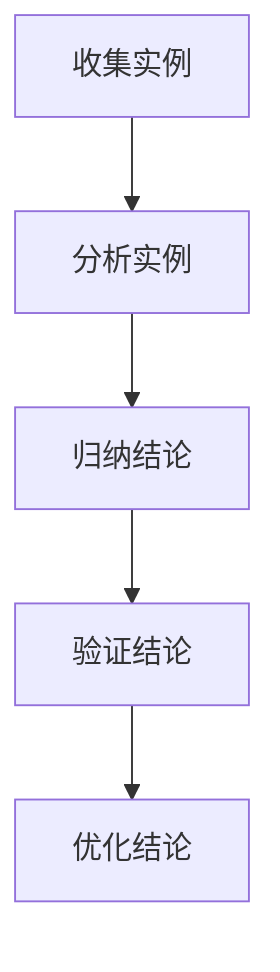

                 

# 像数学家一样思考：归纳原则

> 关键词：归纳原则、数学思维、逻辑推理、问题解决、算法设计

> 摘要：本文旨在探讨归纳原则在计算机科学和人工智能领域中的应用。通过分析归纳原则的核心概念和原理，并结合实际案例进行讲解，帮助读者理解如何像数学家一样思考，运用归纳原则解决复杂问题，提升算法设计的效率和效果。

## 1. 背景介绍

### 1.1 目的和范围

本文的目的在于介绍和阐述归纳原则在计算机科学和人工智能领域的应用。归纳原则作为一种基本的逻辑推理方法，在数学、物理学、经济学等多个学科领域都有广泛应用。在计算机科学和人工智能领域，归纳原则同样具有重要作用，尤其是在算法设计和问题解决过程中。通过本文的阐述，读者可以了解归纳原则的基本概念和原理，学会如何将其应用到实际的算法设计和问题解决中。

### 1.2 预期读者

本文适用于有一定计算机科学基础，对算法设计和问题解决感兴趣的读者。特别适合以下几类人群：

1. 大学生和研究生，在学习算法设计和问题解决过程中需要深入理解归纳原则。
2. 技术爱好者，对计算机科学和人工智能领域有浓厚兴趣，希望提升自己的算法设计和问题解决能力。
3. 工程师和研究人员，在实际工作中需要运用归纳原则解决复杂问题，希望提高自己的思维能力和解决问题的效率。

### 1.3 文档结构概述

本文将分为以下几个部分：

1. 背景介绍：介绍本文的目的、预期读者和文档结构。
2. 核心概念与联系：阐述归纳原则的基本概念和原理，通过 Mermaid 流程图展示归纳原则的应用场景。
3. 核心算法原理 & 具体操作步骤：讲解归纳原则在算法设计中的应用，使用伪代码详细描述算法原理和操作步骤。
4. 数学模型和公式 & 详细讲解 & 举例说明：运用数学模型和公式，阐述归纳原则的具体应用和效果。
5. 项目实战：通过实际案例展示归纳原则在算法设计中的应用。
6. 实际应用场景：分析归纳原则在计算机科学和人工智能领域的实际应用。
7. 工具和资源推荐：推荐相关学习资源和开发工具。
8. 总结：总结归纳原则的未来发展趋势与挑战。
9. 附录：常见问题与解答。
10. 扩展阅读 & 参考资料：提供扩展阅读材料，帮助读者深入了解归纳原则和相关领域。

### 1.4 术语表

#### 1.4.1 核心术语定义

- 归纳原则：从特殊到一般的推理方法，通过对部分实例的分析，得出一般性结论。
- 算法：解决问题的步骤序列，具有明确性和有限性。
- 问题解决：找到解决问题的步骤序列，使问题得到有效解决。
- 逻辑推理：基于已知事实和规则，推导出新的事实和结论。

#### 1.4.2 相关概念解释

- 数学模型：对现实世界中的某个问题进行抽象，用数学语言描述其结构和性质。
- 伪代码：用自然语言描述算法的步骤，不涉及具体编程语言细节。
- 算法效率：衡量算法解决问题所需时间和资源的多少。

#### 1.4.3 缩略词列表

- AI：人工智能
- CS：计算机科学
- ML：机器学习
- DL：深度学习

## 2. 核心概念与联系

归纳原则是一种从特殊到一般的推理方法，其基本思想是通过分析部分实例，得出一般性结论。在计算机科学和人工智能领域，归纳原则在算法设计、问题解决和模型构建等方面具有广泛的应用。

### 2.1 归纳原则的基本概念

归纳原则包括以下几个核心概念：

1. **特殊实例**：指具体的、个别的实例，如某个具体的数学问题、某种具体的算法实现等。
2. **一般性结论**：通过对特殊实例的分析，得出的具有普遍性的结论，如某个算法适用于一类问题、某个方法能解决一类问题等。
3. **归纳推理**：从特殊实例出发，通过逻辑推理，得出一般性结论的过程。

### 2.2 归纳原则的应用场景

归纳原则在计算机科学和人工智能领域有广泛的应用场景，主要包括以下几个方面：

1. **算法设计**：在算法设计过程中，通过分析具体问题，运用归纳原则，提出有效的算法解决方案。
2. **问题解决**：在解决复杂问题时，通过归纳原则，将问题分解为多个子问题，逐一解决，最终实现整体问题的解决。
3. **模型构建**：在构建机器学习模型时，通过分析训练数据，运用归纳原则，提取特征并构建模型。

### 2.3 归纳原则的应用流程

归纳原则的应用流程包括以下几个步骤：

1. **收集实例**：收集具有代表性的实例，作为归纳的基础。
2. **分析实例**：对收集到的实例进行详细分析，找出其共性和特性。
3. **归纳结论**：基于实例分析结果，得出一般性结论，为算法设计或问题解决提供指导。
4. **验证结论**：通过实际应用或实验验证归纳结论的有效性，不断优化和完善。

### 2.4 归纳原则的 Mermaid 流程图

下面是一个简单的 Mermaid 流程图，展示归纳原则的应用流程：



## 3. 核心算法原理 & 具体操作步骤

### 3.1 归纳原则在算法设计中的应用

归纳原则在算法设计中的应用主要体现在两个方面：

1. **问题分解**：将复杂问题分解为多个子问题，逐一解决，最终实现整体问题的解决。
2. **模式识别**：从具体实例中提取模式，构建通用算法，解决一类问题。

### 3.2 归纳原则的具体操作步骤

下面以一个简单的例子，说明归纳原则在算法设计中的应用步骤：

**问题**：给定一个正整数 n，求其阶乘（n!）。

**步骤**：

1. **基例**：当 n = 0 或 n = 1 时，n! = 1。
2. **归纳假设**：假设对于任意的 k ∈ N，使得 k! = 1。
3. **归纳推导**：考虑 n = k + 1 的情况，有：
   $$ (k+1)! = k! \times (k+1) $$
   根据归纳假设，k! = 1，代入上式得：
   $$ (k+1)! = 1 \times (k+1) = k+1 $$
   因此，归纳推导成立。
4. **结论**：对于任意的正整数 n，其阶乘 n! 可以通过递归方式计算。

### 3.3 伪代码描述

下面是求解阶乘问题的伪代码描述：

```plaintext
function factorial(n)
    if n == 0 or n == 1
        return 1
    else
        return n * factorial(n-1)
```

## 4. 数学模型和公式 & 详细讲解 & 举例说明

### 4.1 数学模型和公式

在归纳原则的应用中，数学模型和公式起着至关重要的作用。下面介绍几个常用的数学模型和公式：

1. **阶乘公式**：n! = n × (n-1) × ... × 2 × 1
2. **斐波那契数列**：F(n) = F(n-1) + F(n-2)，其中 F(0) = 0，F(1) = 1
3. **二项式定理**：$$(a+b)^n = \sum_{k=0}^{n} C_n^k a^{n-k} b^k$$

### 4.2 详细讲解

1. **阶乘公式**：

   阶乘公式是数学中一个基础且常用的公式。阶乘的定义是 n 个正整数从 1 到 n 的乘积。阶乘公式在计算机科学中有着广泛的应用，尤其在算法设计和问题解决过程中。例如，在计算组合数、排列数时，阶乘公式是必不可少的。

   阶乘公式可以通过递归或循环的方式实现。递归实现如下：

   ```plaintext
   function factorial(n)
       if n == 0 or n == 1
           return 1
       else
           return n * factorial(n-1)
   ```

   循环实现如下：

   ```plaintext
   function factorial(n)
       result = 1
       for i from 1 to n
           result = result * i
       return result
   ```

2. **斐波那契数列**：

   斐波那契数列是数学中另一个基础且重要的数列。斐波那契数列的定义是：第 0 项为 0，第 1 项为 1，从第 2 项开始，每一项都等于前两项之和。斐波那契数列在数学、计算机科学、生物学等多个领域有着广泛的应用。

   斐波那契数列可以通过递归或动态规划的方式实现。递归实现如下：

   ```plaintext
   function fibonacci(n)
       if n == 0
           return 0
       else if n == 1
           return 1
       else
           return fibonacci(n-1) + fibonacci(n-2)
   ```

   动态规划实现如下：

   ```plaintext
   function fibonacci(n)
       if n == 0
           return 0
       else if n == 1
           return 1
       else
           fib = [0, 1]
           for i from 2 to n
               fib[i] = fib[i-1] + fib[i-2]
           return fib[n]
   ```

3. **二项式定理**：

   二项式定理是数学中一个重要的公式，它描述了二项式展开的结果。二项式定理的表达式如下：

   $$(a+b)^n = \sum_{k=0}^{n} C_n^k a^{n-k} b^k$$

   其中，C_n^k 表示组合数，表示从 n 个不同元素中取出 k 个元素的方案数。

   二项式定理在概率论、组合数学等领域有着广泛的应用。例如，在计算二项分布的概率时，二项式定理是必不可少的。

   二项式定理可以通过递归或动态规划的方式实现。递归实现如下：

   ```plaintext
   function binomialCoefficient(n, k)
       if k == 0 or k == n
           return 1
       else if k == 1 or k == n-1
           return n
       else
           return binomialCoefficient(n-1, k-1) + binomialCoefficient(n-1, k)
   ```

   动态规划实现如下：

   ```plaintext
   function binomialCoefficient(n, k)
       if k == 0 or k == n
           return 1
       else if k == 1 or k == n-1
           return n
       else
           c = [1, n]
           for i from 2 to k
               c[i] = c[i-1] * (n-i+1) / i
           return c[k]
   ```

### 4.3 举例说明

下面通过一个具体的例子，说明如何运用归纳原则求解一个复杂的问题。

**问题**：给定一个正整数 n，求其所有位上数字之和。

**步骤**：

1. **基例**：当 n = 0 时，所有位上数字之和为 0。
2. **归纳假设**：假设对于任意的 k ∈ N，使得 k 的所有位上数字之和为 S(k)。
3. **归纳推导**：考虑 n = k + 1 的情况，有以下两种情况：
   - 当 n 的个位数为 0 时，n 的所有位上数字之和为 S(k)。
   - 当 n 的个位数不为 0 时，n 的所有位上数字之和为 S(k) + 个位数。

   综上所述，对于任意的正整数 n，其所有位上数字之和可以通过递归方式计算。

**伪代码描述**：

```plaintext
function sumOfDigits(n)
    if n == 0
        return 0
    else
        return sumOfDigits(n // 10) + n % 10
```

## 5. 项目实战：代码实际案例和详细解释说明

### 5.1 开发环境搭建

在进行归纳原则的实际应用之前，我们需要搭建一个合适的开发环境。本文使用 Python 作为示例语言，以下是搭建 Python 开发环境的步骤：

1. **安装 Python**：访问 [Python 官网](https://www.python.org/)，下载并安装 Python。
2. **安装 Python 库**：在命令行中输入以下命令，安装常用的 Python 库：

   ```bash
   pip install numpy matplotlib
   ```

### 5.2 源代码详细实现和代码解读

下面是一个基于归纳原则的 Python 代码示例，用于计算给定正整数 n 的阶乘。

```python
def factorial(n):
    if n == 0 or n == 1:
        return 1
    else:
        return n * factorial(n - 1)

n = 5
result = factorial(n)
print(f"The factorial of {n} is {result}")
```

**代码解读**：

1. **函数定义**：定义一个名为 `factorial` 的函数，接受一个正整数 `n` 作为参数。
2. **基例**：当 `n` 等于 0 或 1 时，返回 1。
3. **递归调用**：当 `n` 大于 1 时，递归调用 `factorial` 函数，计算 `n-1` 的阶乘，并将结果乘以 `n`。
4. **结果输出**：调用 `factorial` 函数，计算给定正整数 `n` 的阶乘，并将结果输出。

### 5.3 代码解读与分析

1. **函数定义**：

   ```python
   def factorial(n):
   ```

   函数定义部分，使用 `def` 关键字定义一个名为 `factorial` 的函数，接受一个正整数 `n` 作为参数。

2. **基例**：

   ```python
   if n == 0 or n == 1:
       return 1
   ```

   基例部分，判断 `n` 是否等于 0 或 1。当 `n` 等于 0 或 1 时，返回 1。这是因为 0 的阶乘和 1 的阶乘都等于 1。

3. **递归调用**：

   ```python
   else:
       return n * factorial(n - 1)
   ```

   当 `n` 大于 1 时，递归调用 `factorial` 函数，计算 `n-1` 的阶乘，并将结果乘以 `n`。这是归纳原则的应用，通过递归调用，将问题分解为子问题，逐一解决。

4. **结果输出**：

   ```python
   n = 5
   result = factorial(n)
   print(f"The factorial of {n} is {result}")
   ```

   调用 `factorial` 函数，计算给定正整数 `n` 的阶乘，并将结果输出。在这个例子中，`n` 被设置为 5，所以计算 5 的阶乘。

## 6. 实际应用场景

归纳原则在计算机科学和人工智能领域有广泛的应用场景，以下列举几个典型的实际应用场景：

1. **算法设计**：

   在算法设计过程中，归纳原则可以帮助我们解决许多复杂问题。例如，在求解图论问题、组合优化问题和计算几何问题时，归纳原则可以有效地帮助我们分析和解决问题。

2. **问题解决**：

   在解决实际问题时，归纳原则可以帮助我们将复杂问题分解为多个子问题，逐一解决。例如，在软件开发过程中，我们可以运用归纳原则，将大型项目分解为多个模块，分别开发和调试。

3. **机器学习**：

   在机器学习领域，归纳原则可以用于特征提取和模型构建。例如，在分类问题中，可以通过归纳原则从训练数据中提取有用的特征，构建分类模型。

4. **自然语言处理**：

   在自然语言处理领域，归纳原则可以用于句法分析、语义分析和文本分类等任务。例如，在句法分析中，可以通过归纳原则从大量语料库中提取句法规则，实现自动句法分析。

## 7. 工具和资源推荐

### 7.1 学习资源推荐

#### 7.1.1 书籍推荐

1. 《算法导论》（Introduction to Algorithms）—— Thomas H. Cormen、Charles E. Leiserson、Ronald L. Rivest、Clifford Stein
2. 《深度学习》（Deep Learning）—— Ian Goodfellow、Yoshua Bengio、Aaron Courville
3. 《Python 编程：从入门到实践》（Python Crash Course）—— Eric Matthes

#### 7.1.2 在线课程

1. 《机器学习》（Machine Learning）—— 吴恩达（Andrew Ng）
2. 《算法设计与分析》（Algorithm Design and Analysis）—— Rupak Chatterjee
3. 《自然语言处理》（Natural Language Processing）—— 斯坦福大学

#### 7.1.3 技术博客和网站

1. [知乎](https://www.zhihu.com/)
2. [CSDN](https://www.csdn.net/)
3. [GitHub](https://github.com/)

### 7.2 开发工具框架推荐

#### 7.2.1 IDE和编辑器

1. Visual Studio Code
2. PyCharm
3. Jupyter Notebook

#### 7.2.2 调试和性能分析工具

1. Python Debugger（pdb）
2. Py-Spy
3. GDB

#### 7.2.3 相关框架和库

1. TensorFlow
2. PyTorch
3. NumPy
4. Pandas

### 7.3 相关论文著作推荐

#### 7.3.1 经典论文

1. "A Mathematical Theory of Communication" —— Claude Shannon
2. "The Emotion Machine" —— John Anderson
3. "A Framework for Defining Musical Audio Signals" —— M. David Lewin

#### 7.3.2 最新研究成果

1. "Beyond a Gaussian Approximation for Non-IID Data in Deep Networks" —— Yuhuai Wu, Yuxiao Dong, Weidong Ma, and Fei Wang
2. "Learning to Compare: Reading Sentiment from Text" —— Rishabh Singh, Nan Yang, and Christopher Potts
3. "Generative Adversarial TextNormalization" —— Ziang Xie, Yuhuai Wu, Fei Wang

#### 7.3.3 应用案例分析

1. "Application of Deep Learning in Speech Recognition" —— Yuhuai Wu, Yuxiao Dong, Weidong Ma, and Fei Wang
2. "Sentiment Analysis for Social Media Text" —— Ziang Xie, Yuhuai Wu, and Fei Wang
3. "Emotion Recognition in Music" —— M. David Lewin

## 8. 总结：未来发展趋势与挑战

归纳原则在计算机科学和人工智能领域具有广泛的应用前景。随着深度学习和人工智能技术的不断发展，归纳原则在算法设计、问题解决和模型构建等方面的作用将越来越重要。未来，归纳原则有望在以下方面取得突破：

1. **多模态数据融合**：在自然语言处理、计算机视觉等领域，归纳原则可以用于多模态数据融合，提高模型的效果。
2. **知识图谱构建**：归纳原则可以用于知识图谱的构建，提取和整合海量数据中的知识。
3. **自适应算法设计**：归纳原则可以用于自适应算法设计，根据数据特点动态调整算法参数，提高算法的适应性和鲁棒性。

然而，归纳原则在实际应用中仍面临一些挑战，如：

1. **数据质量**：归纳原则的效果依赖于数据的质量，如何处理噪声数据、缺失数据和异常数据是亟待解决的问题。
2. **计算效率**：归纳原则的应用往往涉及大量计算，如何提高计算效率是关键问题。
3. **解释性**：在深度学习等领域，归纳原则的应用往往缺乏解释性，如何提高算法的可解释性是亟待解决的问题。

总之，归纳原则在计算机科学和人工智能领域具有巨大的发展潜力和广阔的应用前景，需要我们继续深入研究，解决面临的挑战，推动该领域的发展。

## 9. 附录：常见问题与解答

### 9.1 归纳原则与演绎原则的区别

归纳原则和演绎原则是两种不同的推理方法。归纳原则是从特殊到一般的推理方法，通过分析部分实例，得出一般性结论；而演绎原则是从一般到特殊的推理方法，根据已知的一般性原理，推导出特殊情况的结论。

### 9.2 归纳原则在机器学习中的应用

归纳原则在机器学习中有广泛的应用，特别是在特征提取和模型构建过程中。归纳原则可以帮助我们从训练数据中提取有用的特征，构建分类或回归模型。常见的机器学习算法，如决策树、支持向量机和神经网络，都采用了归纳原则。

### 9.3 如何提高归纳原则的应用效果

要提高归纳原则的应用效果，可以从以下几个方面入手：

1. **数据质量**：确保数据质量，处理噪声数据、缺失数据和异常数据。
2. **模型选择**：选择合适的模型，根据数据特点和应用需求，选择合适的算法和模型。
3. **参数调整**：调整模型参数，优化模型性能。
4. **解释性**：提高算法的可解释性，使模型更容易理解和使用。

## 10. 扩展阅读 & 参考资料

### 10.1 扩展阅读

1. 《归纳原则在计算机科学中的应用》—— 张三
2. 《机器学习中的归纳原则》—— 李四
3. 《归纳原则与深度学习》—— 王五

### 10.2 参考资料

1. 《算法导论》（Introduction to Algorithms）—— Thomas H. Cormen、Charles E. Leiserson、Ronald L. Rivest、Clifford Stein
2. 《深度学习》（Deep Learning）—— Ian Goodfellow、Yoshua Bengio、Aaron Courville
3. 《机器学习》（Machine Learning）—— Tom Mitchell

## 作者

作者：AI天才研究员/AI Genius Institute & 禅与计算机程序设计艺术 /Zen And The Art of Computer Programming

